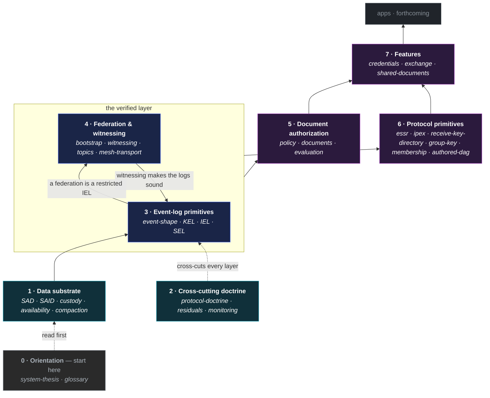

# VDTI Design Documentation

This directory is the **design surface** for VDTI — the canonical specification of the protocol. It
is built from foundations up: each layer builds on the ones below it. Read it in order for a first
full pass, or jump to a layer with the table of contents.

Two ideas anchor everything here. Every content-bearing object is a **SAD** — Self-Addressed Data, a
record identified by the hash of its own content. And the system's central claim is
**end-verifiability**: any consumer can validate any chain, credential, or event from the data
alone, trusting no service, database, or peer. The reading order follows from that — the data
substrate first, then the doctrine that governs it, then the primitives that implement it, then the
authorization and protocol layers that sit on top.

## The layer stack

VDTI is built bottom-up: each layer rests on the ones below it. The map below is the reading order
as a picture — start at the bottom and build up.

Two edges are worth calling out. **Doctrine (2) cross-cuts** — its rules constrain every layer
above, not only the one directly over it. And the **event-log primitives (3) and federation (4) are
co-foundational**: a federation is itself a restricted identity event log (IEL), so it is built
_from_ the event-log primitives — yet federation witnessing is what makes those logs sound, since a
fork cannot silently form on a witnessed chain. Everything above them — policy, the protocol
primitives, and the features — rests on that **verified layer**. (Each solid edge runs from a layer
up to the one that builds on it; dotted edges are orientation and the cross-cut.)

## Table of contents

- [The layer stack](#the-layer-stack)
- [0 — Orientation](#0--orientation)
- [1 — The data substrate](#1--the-data-substrate)
- [2 — Cross-cutting doctrine](#2--cross-cutting-doctrine)
- [3 — The event-log primitives](#3--the-event-log-primitives)
- [4 — Federation and witnessing](#4--federation-and-witnessing)
- [5 — The document-authorization layer](#5--the-document-authorization-layer)
- [6 — The protocol primitives](#6--the-protocol-primitives)
- [7 — The feature layer](#7--the-feature-layer)
- [Forthcoming](#forthcoming)

## 0 — Orientation

Start here.

1. [`system-thesis.md`](system-thesis.md) — the founding thesis: end-verifiability over data from
   any source, the adversarial-first posture, and the load-bearing doctrines (compromise is
   permanent, divergence resolves by tier, forks are seal-bounded, the verifier is the trust
   boundary). The "why" behind every rule that follows.

Keep [`glossary.md`](glossary.md) open alongside — it gives a one-line definition of every
load-bearing term (seal, tier, sealed branch, effective-SAID, …) with a pointer to the doc that owns
it.

## 1 — The data substrate

Everything content-bearing is a SAD; this layer defines what that means. (This group also carries
its own reading-order note in `sad.md`.)

2. [`primitives/data/sad/sad.md`](primitives/data/sad/sad.md) — the SAD record: chain events versus
   standalone SADs, composition by reference.
3. [`primitives/data/sad/said.md`](primitives/data/sad/said.md) — the SAID derivation and
   canonicalization — the mechanism that makes end-verifiability work.
4. [`primitives/data/sad/custody.md`](primitives/data/sad/custody.md) — per-object authority: who
   may write, who may read.
5. [`primitives/data/sad/availability.md`](primitives/data/sad/availability.md) — where the bytes
   live: replicas, time-to-live, one-shot delivery.
6. [`primitives/data/sad/compaction.md`](primitives/data/sad/compaction.md) — compaction and
   selective disclosure.

Alongside these, three **identifier catalogues** define the naming conventions used surface-wide
(all on the shared `vdti/{component}/v1/{category}/{name}` convention) — read one when a `kind`,
`tag`, or `topic` first puzzles you: [`primitives/data/sad/kinds.md`](primitives/data/sad/kinds.md)
(every SAD `kind`, with each kind's field shape in
[`primitives/data/sad/shapes.md`](primitives/data/sad/shapes.md)),
[`primitives/data/event-logs/tags-and-topics.md`](primitives/data/event-logs/tags-and-topics.md)
(the derivation `tag`s and SEL `topic`s), and
[`substrate/federation/topics.md`](substrate/federation/topics.md) (the gossip topics, also at #28).

## 2 — Cross-cutting doctrine

7. [`protocol-doctrine.md`](protocol-doctrine.md) — the rules that span every primitive: the two
   capability tiers, the seal and locked-portion bound, divergence and recovery, federation
   convergence, the verification walk, and the shared terminology. Dense; read it here for the
   concept map, and revisit its divergence and federation sections after the event-log group — they
   land deeper once the event shapes are concrete.

Alongside the doctrine, [`residuals.md`](residuals.md) is the honest-limits catalog — every risk the
design does not fully eliminate, grouped and ranked by cost of exposure, each with the concrete
attack, the mitigation, and what is lost. It is where a deployment learns what each trade costs and
what the whole system leans on. [`monitoring.md`](monitoring.md) covers the owner-side detection
layer for the silent compromises — comparing a prefix's effective SAID against what its key state
expects.

## 3 — The event-log primitives

The KEL / IEL / SEL chains — the heart of the protocol.

8. [`primitives/data/event-logs/event-shape.md`](primitives/data/event-logs/event-shape.md) — the
   event taxonomy, field shape, and per-kind structural rules shared across all three log types. The
   bridge from SADs to chains.

Then the KEL (Key Event Log) primitive, in order:

9. [`primitives/data/event-logs/kel/log.md`](primitives/data/event-logs/kel/log.md) — the chain
   primitive: the four-state per-node machine, the seal / spine / locked-portion, paging.
10. [`primitives/data/event-logs/kel/events.md`](primitives/data/event-logs/kel/events.md) — the
    five-kind taxonomy (plus the founder `Fcp` inception variant), the two-tier capability model,
    the kind-strict anchor matrix, and forward-key commitments.
11. [`primitives/data/event-logs/kel/verification.md`](primitives/data/event-logs/kel/verification.md)
    — the verifier walk and the verification token: how a chain is read and validated.
12. [`primitives/data/event-logs/kel/merge.md`](primitives/data/event-logs/kel/merge.md) — the write
    path: divergence resolution, burial by position and ascent, and the single-word merge outcomes.
13. [`primitives/data/event-logs/kel/compromise.md`](primitives/data/event-logs/kel/compromise.md) —
    recovery as a plain burying `Rot`: the reserve defends the signing key, not the rotation key.
14. [`primitives/data/event-logs/kel/reconciliation.md`](primitives/data/event-logs/kel/reconciliation.md)
    — the exhaustive correctness proof: every divergence case resolved, and the argument that all
    honest nodes converge. The densest doc; read it last.

Then the IEL (Identity Event Log) primitive, in order:

15. [`primitives/data/event-logs/iel/log.md`](primitives/data/event-logs/iel/log.md) — the chain
    primitive: an identity as a threshold over member KELs; the four-state machine; the seal,
    locked-portion bound, and seal-cap over the content window versus the sealed spine.
16. [`primitives/data/event-logs/iel/events.md`](primitives/data/event-logs/iel/events.md) — the
    eight-kind taxonomy (plus the restricted federation set), the threshold vector and its bounds,
    the kind-strict anchor matrix, the `kills[]` revocation declaration, and the facet-dependent
    `Wit`.
17. [`primitives/data/event-logs/iel/verification.md`](primitives/data/event-logs/iel/verification.md)
    — the verifier walk: threshold anchoring, roster accumulation by delta, root-facet dispatch, and
    the `kills[]` forward-match.
18. [`primitives/data/event-logs/iel/merge.md`](primitives/data/event-logs/iel/merge.md) — the write
    path: events first-seen at their own position (the universal position gate — content _and_
    sealed), sealed record-both, and eviction via a roster `cut`.
19. [`primitives/data/event-logs/iel/reconciliation.md`](primitives/data/event-logs/iel/reconciliation.md)
    — the correctness-proof matrix: the content-versus-sealed divergence enumeration and the verdict
    by witnessed-sealed-branch count (at the last seal).
20. [`primitives/data/event-logs/iel/delegation.md`](primitives/data/event-logs/iel/delegation.md) —
    the delegate / rescind surface: the single-hop grant-and-rescission primitive.

Then the SEL (SAD Event Log) primitive, in order:

21. [`primitives/data/event-logs/sel/log.md`](primitives/data/event-logs/sel/log.md) — the chain
    primitive: a single-owner data log that is its own witnessed chain; the four-state machine, the
    seal and its advancers, and the severance a dead owner-IEL anchor causes.
22. [`primitives/data/event-logs/sel/events.md`](primitives/data/event-logs/sel/events.md) — the
    six-kind taxonomy, the three axes, the kind-strict cross-layer anchor matrix, the typed-value
    `Gnt`, the neutral `Sea` re-seal, and the content and lineage fields.
23. [`primitives/data/event-logs/sel/verification.md`](primitives/data/event-logs/sel/verification.md)
    — the verifier walk: owner-rooting, the witnessed divergence read, the severance read, the
    `content: true` acceptance biconditional, and the value lineage walk.
24. [`primitives/data/event-logs/sel/merge.md`](primitives/data/event-logs/sel/merge.md) — the write
    path: witnessed first-seen, seal-advancer burial, and inherited severance.
25. [`primitives/data/event-logs/sel/reconciliation.md`](primitives/data/event-logs/sel/reconciliation.md)
    — the correctness proof: the SEL's own divergence crossed with inherited owner-IEL deadness.

## 4 — Federation and witnessing

The witnessing layer every KEL, IEL, and SEL rests on for its soundness. A federation is a
restricted IEL whose roster is witness KELs directly; witnessing is what prevents a content fork
from forming on an honest chain and makes a sealed fork detectable everywhere.

26. [`substrate/federation/bootstrap.md`](substrate/federation/bootstrap.md) — genesis and the
    configured trust root: the restricted-IEL shape, the dependency-ordered ceremony, and why there
    is no self-witnessing carve-out.
27. [`substrate/federation/witnessing.md`](substrate/federation/witnessing.md) — the mechanism: the
    witnessing floor, first-seen (content prevention / sealed detection), fork-cost, deterministic
    selection, as-of-context receipts and the currency gate, the clock, the receipt SAD, rebinding,
    and the recoverability cap.
28. [`substrate/federation/topics.md`](substrate/federation/topics.md) — the gossip topics (the
    witness-mesh channels) and the two-scope encrypted transport.
29. [`substrate/infrastructure/mesh-transport.md`](substrate/infrastructure/mesh-transport.md) — the
    authenticated, encrypted channel the mesh runs over: handshake, per-connection session keys, and
    the nonce discipline that makes reuse structural.

## 5 — The document-authorization layer

Policy sits above the primitives — it governs documents, never the chain events themselves
(chain-event authorization is structural). (This group carries its own reading-order note in
`policy.md`.)

30. [`primitives/policy/policy.md`](primitives/policy/policy.md) — the policy language (`id` / `del`
    / `pol` leaves; `thr` / `wgt` / `and` combinators).
31. [`primitives/policy/documents.md`](primitives/policy/documents.md) — the anchored issuer context
    a relying party's policy is matched against, and how a document anchors that context.
32. [`primitives/policy/evaluation.md`](primitives/policy/evaluation.md) — how a policy is evaluated
    (as-issued) and the seam to the primitives.

## 6 — The protocol primitives

These primitives sit atop the verified layer — the sealed envelope and the disclosure exchange that
credentials and secure messaging are built from, the device-key directory recipients are resolved
through, and the shared group key that chat and shared documents encrypt under. They compose the
primitives below rather than extending them.

33. [`primitives/protocols/essr.md`](primitives/protocols/essr.md) — the sealed, authenticated
    one-to-one envelope: confidential to the recipient, provably from the sender, and the two
    identity bindings that make it so.
34. [`primitives/protocols/ipex.md`](primitives/protocols/ipex.md) — the issuance and presentation
    exchange: every exchange a disclosure from a discloser to a disclosee, the anchor and compaction
    as its two proofs, and the single-round-trip freshness envelope that binds a presentation to one
    use.
35. [`primitives/protocols/receive-key-directory.md`](primitives/protocols/receive-key-directory.md)
    — the directory of an identity's device receive keys: how a key is published, and how a sender
    resolves one or fans out to all of a recipient's devices.
36. [`primitives/protocols/group-key.md`](primitives/protocols/group-key.md) — the ratcheting shared
    key a group encrypts under: per-device fan-out, epochs, and the ratchet, with chat and shared
    documents as its consumers.
37. [`primitives/protocols/membership.md`](primitives/protocols/membership.md) — the unbounded,
    per-requester gated set that authorizes one identity at a time (a chat's store gate, a shared
    document's read/write gate), never materialized as a roster.
38. [`primitives/protocols/authored-dag.md`](primitives/protocols/authored-dag.md) — the per-writer
    content graph a chat lane and a document version graph are: attribution by lane, monotone order,
    and a single-parent (fork = equivocation) / multi-parent (branch + merge) variant.

## 7 — The feature layer

Features compose the primitives into what an application ships: credentials, secure messaging (the
`exchange` feature), and shared documents.

39. [`features/credentials.md`](features/credentials.md) — issuing a credential and, the core case,
    a relying party accepting a presented one: the anchor and compaction as its proofs, the two
    questions (validly-issued, ownership), IPEX presentation, targeted-vs-bearer, blinded
    claim-gating, revocation, edges, terms-of-use, bulk issuance, and the migration-first registrar.
40. [`features/exchange.md`](features/exchange.md) — sealed store-and-forward messaging: the two
    modes (one-off ESSR mail and the ratcheting chat session), digest-named payloads, sender-key
    currency, recipient-scoped delivery + the serve-time gate, the `chat-membership` store gate, and
    the per-sender-lane authored DAG.
41. [`features/shared-documents.md`](features/shared-documents.md) — a document several parties
    co-author, membership and sharing evolving under a creator: the V0 constitution, the three
    `document-*-membership` instances (edit / comment / read, max-capability), the multi-parent
    version DAG, the honored-window predicate, and group-key confidentiality.

## Forthcoming

These are referenced above as forward-references and are still forthcoming:

- `infrastructure/` — the storage service and the **encoding library** (the byte-exact `select`
  scheme, receipt canonicalization, and the AEAD nonce / key-scope discipline).
