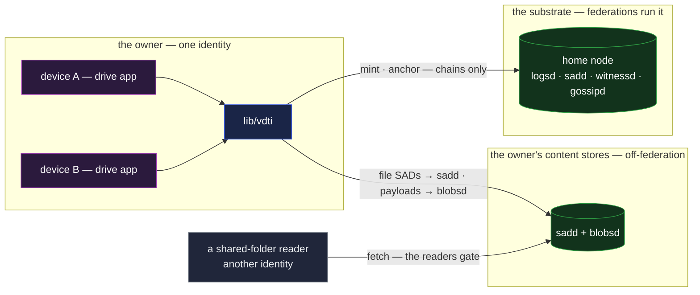

# drive — file storage and sync

`drive` is personal and shared file storage: files and folders owned by an identity, synced across
that identity's devices, shared with chosen readers or published to everyone. It is the composition
case for **data with custody alone** — no feature, just the SAD layer doing what it already does —
and it absorbs the catalogue's same-composition variants: the **blog / CMS** (publicly readable
custodied records) and the **photo and document vault** (read-gated custodied records) are this
application with `readers` omitted or present.

This doc, like every example-application doc, is a validation exercise: it composes only landed
mechanisms, cites each one, and states honestly where the composition's edges are.

## Deployment

No party runs a drive server: the drive is client code composing the generic stores, and a reader is
just another verifying consumer admitted by membership. The federation carries the owner's chains,
never file bytes.

## The composition

A file is a **`file` SAD** whose bytes ride as a content-addressed payload — a bundle carrying the
blob's access and availability, committed by the **storage key** the wrapper's `digest` field
carries
([`../primitives/data/sad/shapes.md` §The file payload](../primitives/data/sad/shapes.md#the-file-payload--vdtisadv1schemasfile),
[`../primitives/data/sad/sad.md` §Bulk opaque bytes](../primitives/data/sad/sad.md#bulk-opaque-bytes--the-content-addressed-blob)):
the wrapper carries `digest`, `size`, advisory `mediaType` / `name`, and the mandatory high-entropy
`nonce` that keeps a private file's SAID unguessable. The two wrapper axes do the rest:

- **`custody { owner, pin, readers[] }`** — the drive owner is the `owner` (an identity, not a
  device), and every file write is **anchored on the owner's IEL**: the mint and the anchoring `Ixn`
  are one tip-atomic step, `pin` locates the anchor, and the attribution is backdate-proof
  ([`../primitives/data/sad/custody.md` §Attribution requires an anchor](../primitives/data/sad/custody.md#attribution-requires-an-anchor)).
  Sharing is the read side: `readers` names one or more read-authorization SELs, and a fetch is
  admitted when the requester is a **current member** of any listed set
  ([`../primitives/protocols/membership.md`](../primitives/protocols/membership.md)). A public file
  omits `readers`. The four custody combinations are exactly the drive's product surface: private
  files, published posts, an inbox folder anyone can deposit into, and shared folders
  ([`../primitives/data/sad/custody.md` §The four combinations](../primitives/data/sad/custody.md#the-four-combinations)).
- **`availability { expiry, once }`** — lifetime and read semantics: `expiry` gives trash a
  committed horizon, and `once` stays unused — a drive's files are fetched repeatedly by many
  devices, the composition one-shot delivery is wrong for. The wrapper's `availability` governs the
  SAD; the payload's rides its bundle, coupled by the covering rule
  ([`../primitives/data/sad/availability.md`](../primitives/data/sad/availability.md)).
  **Placement** is the client's cascading store, not a field — and every file, published or private,
  lives **off the federation**: the drive's SADs on a [`sadd`](../substrate/infrastructure/sadd.md)
  tier, its bytes on a [`blobsd`](../substrate/infrastructure/blobsd.md), the federation holding
  only the owner's chains and anchors — application data has no federation tier to choose
  ([`../substrate/infrastructure/architecture.md` §The cascading store](../substrate/infrastructure/architecture.md#the-cascading-store--one-interface-composed-in-sequence)).
  Published and private differ in the gate and in discovery, never in placement.

**Folders are composition by reference.** A directory is itself a SAD whose content lists its
children by SAID, so a drive is a hash tree: the root directory's SAID commits, transitively, to
every byte in the drive
([`../primitives/data/sad/sad.md` §Composition by reference](../primitives/data/sad/sad.md#composition-by-reference)).
Changing any file re-mints the SADs on its path to the root — one fresh anchor commits the whole new
state — and unchanged subtrees are shared between versions by construction, so a version history
costs only the changed path. A directory carries its own `custody`, and `readers` does **not** flow
downward — each SAD gates itself
([`../primitives/data/sad/compaction.md` §Privacy contract](../primitives/data/sad/compaction.md#privacy-contract))
— so sharing a folder is its own subtree-wide re-mint: the shared read set is stamped on every SAD
under the shared root at share time, never deferred to the next change — a descendant left unstamped
would keep its old gate.

**Re-gating a subtree re-uploads its bytes — and a re-gate is a revocation only if the prior payload
is deleted.** A file's read gate rides its content-addressed **bundle**, so changing which sets gate
a file re-mints its bundle — a new `bundle.said`, a new storage key, the bytes deposited again — on
top of the subtree re-mint above. And the **old** payload stays live at the old storage key, its
`access` still naming the removed SEL, whose members are still current members of _that_ set and
keep reading it — a drive file's typical `availability` carries no `expiry` to run out. So the
re-gating client issues `delete(S)` on each prior payload, and the authorization is drive's own
store predicate — the file's `custody.owner`
([`blobsd.md` §Deletion is the application's](../substrate/infrastructure/blobsd.md#deletion-is-the-applications));
`readers` never authorizes a delete, and an operator retains an out-of-band administrative delete on
its own disk — the protocol authorizes requests, it does not bind an operator's `rm`. This is the
price of a self-gating blob, and it is why a large shared drive that expects to re-gate encrypts
client-side and publishes an ungated bundle, paying in key management once instead of in bytes per
re-gate.

**The handle is the root SAID.** Whoever holds the current root SAID holds the drive: every device
of the owner identity resolves the whole tree from it by SAID fetch — the batch SAD fetch moves a
directory's resolution set in one round trip ([`sadd.md`](../substrate/infrastructure/sadd.md)), and
[`blobsd`](../substrate/infrastructure/blobsd.md) serves the bytes — and verifies everything it
fetches locally: SAIDs recomputed, blob digests matched, the write attribution checked against the
owner's IEL through the verification core every consumer links
([`../substrate/infrastructure/architecture.md` §The core is a library](../substrate/infrastructure/architecture.md#the-core-is-a-library-because-consumers-must-verify)).
A reader who is handed the root SAID of a shared folder does the same, admitted by membership.

## Scenarios

- **Save.** A device of the owner mints the changed file and path SADs, deposits them to `sadd` and
  the payload to `blobsd` — the committing SAD supplied and verified at admission — and anchors the
  new root's issuance commitment on the owner IEL — a `t_use` content act, witnessed. If another
  device advanced the IEL first, the tip-atomic mint fails cleanly and re-mints against the new tip.
- **Sync.** Every other device sees the owner IEL advance (it is a member; the IEL is its own
  identity's chain) and pulls exactly the changed subtree by SAID — the unchanged parts it already
  holds, content addressing makes that dedupe free. It learns the new root SAID by taking part in
  the anchoring act (a `t_use` quorum authors the anchor together); a device that sat the act out
  sees only the blinded commitment and is handed the root by its peers — or the identity runs an
  index chain and closes that gap structurally, which is the personal data store's composition
  ([`pds.md`](pds.md)).
- **Share and un-share.** Grant a reader membership in the folder's read-authorization SEL; rescind
  to un-share. The gate reads **current** membership at fetch time, so an un-shared reader is
  refused on the next fetch with nothing re-encrypted and no data moved. This ordinary case is free
  — a membership change inside an existing set touches no SAD, no bundle, no stored byte; changing
  **which sets gate** a subtree is the re-gate above, and pays.
- **Publish.** The blog case: mint with `readers` omitted and an ungated bundle. The post's SADs
  serve by SAID and its bytes by storage key from the owner's content stores — a stranger holding
  the owner's prefix resolves them through the owner's identity-scoped **content-store lookup**
  ([`blobsd.md` §Public-blob discovery](../substrate/infrastructure/blobsd.md#public-blob-discovery)),
  and the provenance — this identity wrote it, at an append-only position — travels with the data.
  Standing up that lookup is a one-time tier-2 establishment, priced at the mechanism.

## What this validates

- **Tamper-evidence and provenance with no feature machinery.** A drive is a hash tree of custodied
  SADs; a changed byte breaks a digest, a changed SAD breaks the root, and every version's writer is
  attested by an anchor that cannot be backdated. The catalogue's claim that most applications are
  "mostly primitives" holds at the strongest reading here: this one is primitives entirely.
- **The store is never trusted.** Any node can serve a drive; the owner's devices and every reader
  verify what they fetch. Moving a drive between hosts changes cost, not trust
  ([`../system-thesis.md` §End-verifiability](../system-thesis.md#end-verifiability)).
- **Share semantics ride identity, not keys-in-files.** `readers` names identities through
  membership sets, so a reader's device rotation, or the owner rescinding one reader, needs no touch
  of the stored data.

## Limits

- **Confidentiality at rest is not the read gate's job.** `readers` is serve-side enforcement — it
  limits store-side harvesting by outsiders, and storage operators hold whatever bytes the
  application stores. A drive that must be private _from its storage nodes_ encrypts client-side
  before minting (an application pattern layered above the protocol); a drive that must deliver
  secretly to another party is the exchange feature's composition, not this one.
- **Un-sharing is forward-looking.** A rescinded reader is refused the next fetch; bytes already
  fetched are already theirs. This is the same post-retrieval limit the availability primitive
  states for one-shot reads
  ([`../primitives/data/sad/availability.md` §Adversarial framing](../primitives/data/sad/availability.md#adversarial-framing)).
- **A live "latest root" pointer for third parties is a log's job.** The owner's own devices track
  the current root through their identity's anchors, but a stranger cannot enumerate a drive from
  the IEL — anchors are blinded commitments, which is the privacy design working as intended. An
  always-current published pointer to evolving state is exactly what the log primitive is the lookup
  layer for; the personal data store composes it ([`pds.md`](pds.md)).
