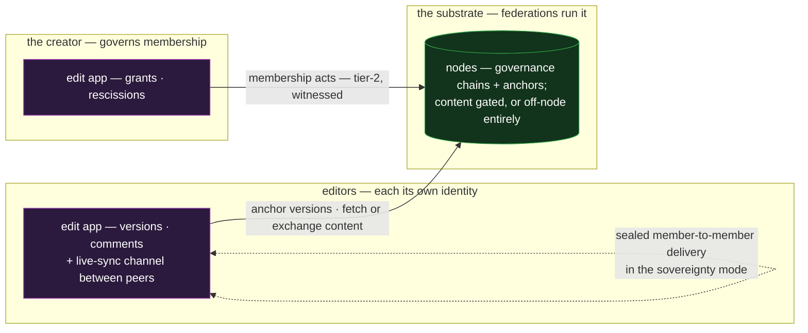

# edit — the collaborative editor

`edit` is the co-authored document: several people writing, branching, merging, and commenting on
one evolving piece of content, confidentially. It is the composition case for **shared documents
plus exchange** — the document construct carries authorship and governance, exchange carries the
content between members — and it is where the two features' deliberate seam shows: what the document
proves and what the transport moves are separate concerns, composed.

## Deployment

In the sovereignty mode the nodes hold nothing readable — opaque chains and anchors — while content
moves member-to-member; the on-node mode trades that for availability, per document.

## The composition

- **The document is the shared-documents construct whole.** Constitution, the three-role membership
  triad, the multi-parent version DAG with the honored predicate, comments and resolutions — the
  editor renders what the feature defines and invents no state of its own
  ([`../features/shared-documents.md`](../features/shared-documents.md)).
- **Confidential content rides the group-key seal.** A private document's versions are sealed under
  the per-document content key, epochs aligned to the membership periods — removed editors lose the
  future, keep only what they already read
  ([`../features/shared-documents.md` §Confidentiality](../features/shared-documents.md#confidentiality--the-group-key-primitive)).
- **Exchange delivers member-to-member.** New versions reach members as sealed payloads over the
  standing exchange machinery; in the **sovereignty mode** the nodes hold only the opaque governance
  chains and anchors while the content moves peer-to-peer — the maximum-privacy tier the feature
  defines and this application makes usable
  ([`../features/shared-documents.md` §Sharing, custody, and privacy](../features/shared-documents.md#sharing-custody-and-privacy)).
- **The editing surface is the application's.** Keystroke-level sync — operational transforms,
  CRDTs, cursors, presence — is ephemeral collaboration state the app runs over its own channel (a
  chat-mode session serves); a **version** is the durable, anchored checkpoint the DAG records. The
  split is deliberate: the protocol commits what needs proving (who authored what, under which
  membership window), not every keystroke.

## Scenarios

- **Concurrent editing.** Two editors branch from one version and a third merges the tips — the
  DAG's normal shape, every step attributed and anchored, the merge a version like any other.
- **A contested merge.** Two merges race: both tips present, the canonical choice a tag, tag
  conflicts arbitrated by the application — the presented-not-picked posture at the point users
  actually feel it.
- **Un-invite an editor.** Rescind their edit grant with the bound the creator chooses — grandfather
  their honest work or cut back to last-good — then the epoch turns and future content is sealed
  past them. Membership, honor, and confidentiality move together because the epochs align to the
  membership periods by design.
- **An editor's device is compromised.** The feature's recovery dial verbatim: rescind the period,
  choose the bound (the honest-collateral-versus-malicious-survival trade), re-add on a fresh
  disjoint period once the identity has evicted the device. No whole-document reincept.

## What this validates

- **The features' seam is load-bearing and clean.** Proof (documents) and movement (exchange)
  compose with no shared state beyond SAIDs — the sovereignty mode is the demonstration that a node
  can serve a fully private collaboration while holding nothing readable.
- **Real-time and verifiable coexist.** The checkpoint split shows the design's granularity boundary
  honestly: structure carries what must survive and be proven; the app carries what must be fast.
  Neither leaks into the other.
- **Governance recovery is usable.** The compromised-editor dial — the design's flagship
  bounded-recovery story — maps onto buttons a real product would ship, which is the point of
  designing the app.

## Limits

- **Version cadence is a cost dial.** Every version is a minted, anchored SAD; a document that
  checkpoints every keystroke pays anchor cost for no proof value. Batching cadence is the app's
  judgment — the same batching posture the ledger states for high-rate trails
  ([`ledger.md`](ledger.md)).
- **Read-set invariance is not confidentiality**, and a co-author exfiltrates trivially — the
  feature's own boundary, unchanged by the editor UI. Encrypt for secrecy, gate for integrity.
- **Whole-document recovery from a rogue creator is social.** A reincepted successor document
  carries no structural link to its predecessor — the feature says so, and the editor surfaces it as
  a fork-the-document action rather than pretending continuity.
