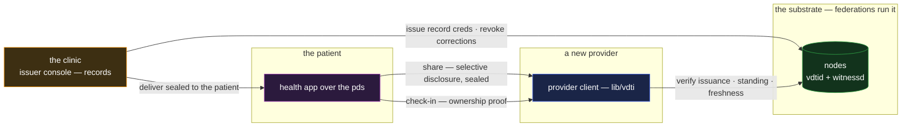

# health — patient-held records

`health` is the medical record in the patient's hands: doctor-signed, held by the person it is
about, shared with each provider on the patient's own terms. It is a core reference app and the
composition case for **credentials plus exchange** in its person-centered form — the provider-signed
record is a credential, the sharing is a sealed, selective disclosure.

## Deployment

The patient sits in the middle by design: records flow to their store, and every share is their act
— with the receiving provider verifying against the issuing clinic's chain, not the patient's word.

## The composition

- **A record is a credential issued to the patient.** The clinic is the issuer, the patient the
  issuee, the clinical content the claims — anchored on the provider's chain, so its authenticity
  and its issuer's standing are verifiable by any later reader with no call to the originating
  clinic ([`../features/credentials.md`](../features/credentials.md)). A corrected record is the
  clinical instance of re-issue: revoke the erroneous credential, issue the correction, both acts on
  the issuer's chain — the record's history of being wrong is itself preserved and readable.
- **The patient's store is the pds.** Held records are custodied SADs in the patient's own store,
  indexed by their own chains, on hosts they choose ([`pds.md`](pds.md)) — holding needs no
  health-specific machinery, which is the point of having a personal data store at all.
- **Sharing is claim-gated presentation over sealed transport.** A new provider gets exactly what
  the patient discloses: the vaccination brackets without the psychiatric history, the allergy list
  without the addresses — issuer-precomputed claims, revealed selectively against the one anchor
  ([`../features/credentials.md` §Claim-gating](../features/credentials.md#claim-gating)), delivered
  sealed to the provider's keys ([`../features/exchange.md`](../features/exchange.md)). The provider
  verifies issuance, standing, and the patient's live ownership — and can rely on the record without
  trusting the patient's honesty about its content, which is the clinical requirement exactly.
- **Check-in is the ownership proof.** Tap-to-check-in is the `sso` composition at the front desk
  ([`sso.md`](sso.md)): a live, audience-scoped signature identifying the patient's prefix, plus
  whatever credential the visit requires — insurance attestation, referral — presented in the same
  act.

## Scenarios

- **A new specialist.** The patient forwards the referral and the relevant history — selectively
  disclosed, sealed, verified by the specialist against each originating provider's chain. No
  records office in the loop, no fax, no trust in the patient's transcription.
- **An emergency abroad.** Authenticity verifies offline from the presented data; freshness and
  revocation want a network leg, and an emergency room's fail-open acceptance of a stale read is the
  priced trade the design names — the same dial as every checker, chosen here with clinical stakes
  in view.
- **A retracted result.** The lab revokes the erroneous report credential; every downstream holder's
  next fresh read shows it revoked — the recall mechanic, applied to information.
- **Drug integrity at the pharmacy.** The pack's provenance is the supply-chain composition
  ([`trace.md`](trace.md)); the prescription's single fill is the permit's discipline
  ([`permit.md`](permit.md)). The health app is the point where the person meets both — composed,
  not rebuilt.

## What this validates

- **Selective disclosure carries the most privacy-hostile domain in the catalogue.** The
  bracket-and-nonce machinery was designed for exactly this shape of question — prove the
  vaccination, hide the birthdate — and the clinical flows exercise it without a gap that would
  force full disclosure.
- **Patient custody does not sacrifice provider assurance.** The record the patient hands over is as
  verifiable as one fetched from the issuing institution — better, because standing is read live.
  Custody and authority decouple, which is the thesis's central claim in its most regulated setting.
- **Institutional failure degrades gracefully.** A closed clinic's records stay verifiable forever
  (anchored, witnessed); only its ability to issue and revoke ends. Compare the paper world, where
  the basement floods.

## Limits

- **Structure proves provenance, not clinical truth.** A signed wrong diagnosis is a wrong diagnosis
  with excellent provenance; correction is re-issue, and the reader's fresh revocation read is what
  surfaces it — the ledger's garbage-in limit with clinical stakes.
- **Break-glass access must be provisioned, not overridden.** There is no structural emergency
  override — an unconscious patient's records open only along paths arranged in advance (a
  delegate's read authority, an emergency-disclosure credential). The composition makes
  pre-provisioning expressible; it cannot conjure consent after the fact, and does not pretend to.
- **Records about the patient held by others stay theirs.** Providers keep their own charts on their
  own chains; the patient-held copy is the portable one, not a confiscation of the institutional
  record. Jurisdictions' data-subject rights are policy over this substrate, not properties of it.
