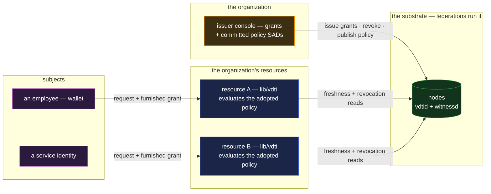

# iam — organizational access control

`iam` is standing authority inside an organization: who may do what, granted to people and
services, delegated down the organization's own lines, checked at every use, and withdrawn in one
place. It is the composition case for **credentials plus the policy layer** — grants are targeted
credentials, the authorization rules are committed policy SADs, and every resource decides locally
by evaluating the same expression over furnished proofs. It absorbs the catalogue's **API keys /
capability tokens** — the same grant with a service identity in the issuee slot.

Where `permit` is the credential lifecycle presented occasionally to outside checkers, `iam` is the
same wrapper exercised as infrastructure: the relying parties are the organization's own resources,
the check runs on every request, and the policy language — one bullet in the other compositions —
is the product surface here. And where `sso` proves who is calling, `iam` proves what the caller
may do; the two compose without touching ([`sso.md`](sso.md)).

## Deployment

The resources were already the organization's servers; what nobody runs is an authorization
service between them. Each resource links `lib/vdti` and evaluates the same committed policy from
the data — there is no policy decision service to stand up, scale, or take down.

## The composition

- **A grant is a targeted credential.** The organization is the `issuer`, the person or service the
  `issuee`, and the authority itself the `claims` — issuer-precomputed brackets (the capability
  booleans, the scope flags), so a resource learns exactly the boolean it asks for and nothing else
  ([`../features/credentials.md` §The two foundations](../features/credentials.md#the-two-foundations),
  [§Claim-gating](../features/credentials.md#claim-gating)). A machine subject is nothing special:
  a service holds an identity and grants name it — API keys and capability tokens are this bullet
  verbatim.
- **The rules are committed policy SADs.** What a resource requires is one expression in the policy
  language — `crd(vdti/cred/v1/schemas/deployer, thr(1, [id(org), del(org, 2)]))` — published by
  the organization and adopted by SAID
  ([`../primitives/policy/policy.md` §The policy language](../primitives/policy/policy.md#the-policy-language),
  [§A policy is a SAD](../primitives/policy/policy.md#a-policy-is-a-sad)). Two resources naming the
  same SAID enforce the same rule by construction; changing a rule is publishing a new SAD, itself
  anchored and permanent.
- **The check is local, and it is a decision.** A request arrives with the grant furnished; the
  resource runs the acceptance conjunction — integrity, anchored issuance, issuer trusted, fresh to
  the tip, not revoked, owned by the caller live
  ([`../features/credentials.md` §Accepting a presented credential](../features/credentials.md#accepting-a-presented-credential))
  — and evaluates the adopted policy over the proofs, deny on any uncertainty. The result is a
  decision carrying the assignment that satisfied it — which leaves, on which proofs
  ([`../primitives/policy/evaluation.md` §Decisions at the leaves, reports around them](../primitives/policy/evaluation.md#decisions-at-the-leaves-reports-around-them)).
  No authorization service is consulted, because the policy is data and the proofs are furnished.
- **Delegated administration is the delegation machinery.** The organization's root delegates to a
  department, the department to a team lead: a grant issued down the line carries its committed
  `delegationPath`, and every resource verifies the authority chain itself — never a directory's
  word
  ([`../primitives/policy/documents.md` §Delegation in a document](../primitives/policy/documents.md#delegation-in-a-document)).
  Rescinding a delegate cuts its future grants at the grandfather bound; what it validly granted
  before stands until revoked.
- **Withdrawal is the kill.** Offboarding is revocation of the subject's grants — a strike per
  grant on the issuing chain, read fail-secure by every resource everywhere from its next fresh
  read ([`../features/credentials.md` §Revocation](../features/credentials.md#revocation)). There
  is no per-system account cleanup because there are no per-system accounts: the resources never
  held authority state, only the data did.

## Scenarios

- **A request.** A service calls resource B with its grant furnished; B verifies the conjunction,
  evaluates the adopted policy SAID, and allows — recording the decision with the assignment that
  produced it, which is the authorization audit entry conventional access control reconstructs from
  scattered logs.
- **Offboarding.** One kill per grant. Every resource refuses from its next fresh read — the
  interval between strike and refusal is each resource's freshness dial, priced explicitly, instead
  of an account-cleanup checklist across systems.
- **A delegated grant.** A team lead, holding a delegation from the root, issues a deploy grant to
  a new member; the grant carries its `delegationPath`; resources accept under the committed
  `del(org, 2)` leg with no call to the root. Rescinding the lead later stops new grants and leaves
  the trail intact.
- **A policy change.** The organization tightens a rule — delegated grants now accepted within two
  hops instead of three. It publishes the new policy SAD and resources adopt the new SAID; the old
  and new expressions are both permanent anchored objects, so which rule was in force when is
  answerable after the fact.

## What this validates

- **The policy layer carries a real authorization domain.** Four leaves and three composers, in one
  committed SAD, express the rules an organization actually runs on — roles, delegation depth,
  thresholds — with no rules engine invented and no policy field added to any chain or credential.
- **No central policy server, demonstrated.** The catalogue's claim lands as topology: the decision
  happens where enforcement happens, in the library each resource links, and agreement across
  resources is a shared SAID rather than synchronized configuration.
- **Authorization is auditable at rest.** Grants, delegations, rescissions, revocations, and the
  policies themselves are anchored, witnessed, attributable acts — the who-could-do-what-when
  record that conventional access control reconstructs forensically is this composition's resting
  state.

## Limits

- **Enforcement is each resource's own act.** The structure proves authority; nothing makes a
  resource evaluate the policy or honor the deny. A resource that skips the check fails its
  callers, not the framework — the verifier is the trust boundary, here as everywhere
  ([`../system-thesis.md` §End-verifiability](../system-thesis.md#end-verifiability)).
- **Live context is above the composition.** Time-of-day, source network, anomaly signals —
  conditions on the request rather than the requester — are the resource's own layered policy. The
  committed expression names who may act, as-issued; the resource decides the rest.
- **Revocation latency is the resource's dial.** Between a strike and the next fresh read, a
  fail-open resource honors a dead grant — the standing freshness residual, tuned per resource.
- **Revocation authority is the issuing chain's.** A kill is declared where the grant was issued,
  so a delegated issuer that disappears with its books open leaves grants nobody can revoke —
  rescission stops its future issuance but grandfathers its past. The stated discipline is
  revoke-before-terminate and delegates wound down in order; an organization that cannot tolerate
  the residual issues from the root.
- **A legitimate issuer's bad grant is structurally perfect.** The composition proves the
  organization granted the authority, not that it should have; the checks and balances above the
  grant are the organization's governance, outside structural reach.
