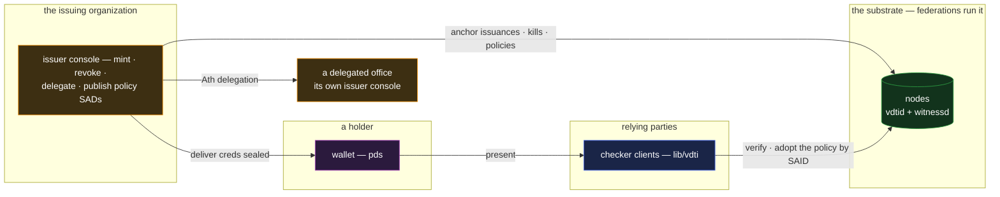

# issuer — the issuing organization's console

`issuer` is the operator surface for any organization that vouches: register the credential kinds
you issue, mint and anchor credentials, deliver them, revoke and renew them, delegate issuing
authority, and publish the acceptance policies that consume them. It is the set's second
**building-block application** — where `vote` builds on `registrar`, nearly every app in this set
builds on an issuing organization, and `issuer` is that organization's app. Its composition is
**credentials (the issuance side) plus exchange, plus policy publication** — the same signature
family as `health` and `registrar`, kept as its own app for the same reason those two both stay: the
role differs. `permit` is the relying party's lifecycle; `registrar` is issuance bound to external
truth; `issuer` is issuance as a product surface.

## Deployment

In a test harness this whole picture shrinks to one process per box: an `issuer` per fixture role, a
wallet per subject, a checker per relying party — the same topology every app above deploys.

## The composition

Everything is the credentials feature's own machinery, operated:

- **Kinds and claims.** The organization registers its credential kinds (`vdti/cred/v1/schemas/…`,
  application-registered) and bakes claims with the uniform-bracket discipline — every credential of
  a type carries the same blinded claim keys, values produced and named by the shared derivation
  helpers, so presence reveals nothing and selective disclosure works from day one
  ([`../features/credentials.md` §Claim-gating](../features/credentials.md#claim-gating)).
- **Mint and anchor.** A single issuance is the tip-atomic mint-and-anchor; a cohort is bulk
  issuance at width, with the linkability trade chosen per population
  ([`../features/credentials.md` §Bulk issuance](../features/credentials.md#bulk-issuance)).
  Delivery to the issuee rides sealed exchange and the IPEX issuance flow
  ([`../features/exchange.md`](../features/exchange.md)).
- **Revoke, renew, recall.** Revocation is the kill on the org's own chain; renewal is
  revoke-and-re-issue with fresh nonces (unlinkable across renewals); recall is the same strike at
  cohort width — the mechanics `permit` verifies from the other side
  ([`../features/credentials.md` §Revocation](../features/credentials.md#revocation)).
- **Delegate.** Standing up an office that issues under the org's authority is an `Ath` grant plus
  its delegating link; the office's credentials carry their committed `delegationPath`, and
  rescinding the office cuts future issuance with the grandfather semantics intact
  ([`../primitives/policy/documents.md` §Delegation in a document](../primitives/policy/documents.md#delegation-in-a-document)).
- **Publish the rule that consumes what you issue.** The org commits its acceptance expressions as
  **policy SADs** — `crd(vdti/cred/v1/schemas/triager, id(org))`, or the delegated form over
  `del(org, N)` — so relying parties configure by adopting a SAID rather than transcribing prose
  ([`../primitives/policy/policy.md` §A policy is a SAD](../primitives/policy/policy.md#a-policy-is-a-sad)).
  The issuing side and the accepting side of an ecosystem meet in one committed, shareable object,
  which is what makes the `crd` leaf operational rather than aspirational.

## Scenarios

- **Every other harness's fixture.** Each example application's test harness runs an `issuer`
  instance parameterized by kind and schema: the tracker's org minting `triager`, the election
  authority minting ballots, the clinic minting records, the ministry and its offices minting
  licences, the carrier and bank minting trade instruments, the maker minting product credentials.
  One application, instantiated per role — the issuance glue written once instead of per harness.
- **A threshold-crossing renewal.** A holder's bracket flips (a birthday, a tier change): the holder
  discloses fully to the issuer, the issuer recomputes every bracket, revokes the old credential,
  and issues fresh — the credentials feature's renewal loop as a workflow with a button on it.
- **Standing up a regional office.** Grant the delegation, publish the updated acceptance policy
  (its issuer slot now `thr(1, [id(org), del(org, 1)])`), and every relying party that adopted the
  policy SAID accepts the office's issuances — or declines to adopt, visibly, which is decentralized
  authority behaving as designed.

## What this validates

- **Issuance as a product is thin.** Nothing in this console adds trust machinery — every act is the
  feature's own mint, anchor, kill, grant, or policy SAD. The operator surface is workflow over
  landed primitives, which is precisely the "you write the app, the trust comes with the data" claim
  from the operator's chair.
- **Apps building on apps is a load-bearing axis.** `vote` on `registrar` was the first internal
  composition; every harness on `issuer` makes it systematic. The applications tier composes
  internally the way the features do.
- **The committed-policy loop closes.** With `crd`, the party that issues can publish the exact
  expression that accepts — issuance, acceptance, and configuration become three views of the same
  committed data.

## Limits

- **The console attests the org's judgment, not the world.** A wrongly-granted credential is wrongly
  granted with perfect provenance — `permit`'s limit, seen from the source. And `issuer`
  deliberately does **not** bind people to prefixes against external records; that is the
  registrar's seam, with its own step-up discipline ([`registrar.md`](registrar.md)).
- **The org's identity is the crown jewel.** Every credential and policy this console publishes
  rides the org's chain, so the org runs its roster with redundancy and treats issuing-key
  compromise as the governance-compromise class it is — the identity layer's doctrine, inherited at
  maximum stakes.
- **Adoption is the relying parties'.** Publishing a policy SAD makes the rule adoptable, not
  adopted — an ecosystem where checkers name different policies is functioning, not broken, and no
  console can centralize that choice away.
