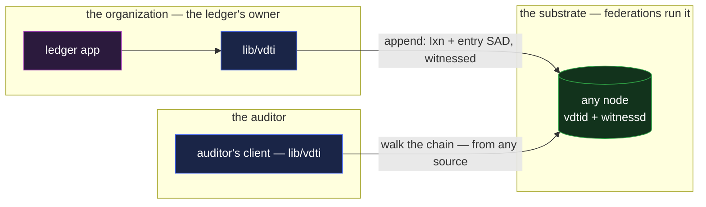

# ledger — the audit trail

`ledger` is an append-only, tamper-evident record of what an organization did: a compliance ledger,
a change-control trail, a decision log. It is the composition case for **a log alone** — the SEL
primitive carrying application entries — and it absorbs the catalogue's same-composition variant,
**event sourcing**: an event-sourced system's store _is_ an audit trail whose entries are state
transitions, replayed by the same walk an auditor runs.

## Deployment

Two parties, no service between them: the organization appends through its own client, and the
auditor walks the chain from any node — including its own mirror.

## The composition

The ledger is a **content SEL** owned by the organization's identity
([`../primitives/data/event-logs/sel/log.md`](../primitives/data/event-logs/sel/log.md)): a
single-owner chain whose `topic` names the application's discriminator and whose prefix derives from
its inception content, so the ledger's address is a function of what it is. One organization runs as
many ledgers as it has trails to keep — a SEL is cheap, and one-subject-per-chain keeps each walk
small.

- **An entry is an `Ixn` committing an entry SAD.** The chain carries structure; the entry's content
  — what happened, in the application's schema — is a standalone SAD the event's manifest commits by
  SAID. Chain events have a fixed schema with no room for application payloads, and that is the
  design working as intended: the entry SAD expands for whoever needs the detail, the chain commits
  it immutably
  ([`../primitives/data/sad/sad.md` §Composition by reference](../primitives/data/sad/sad.md#composition-by-reference)).
- **Every entry is organization-authorized and witnessed.** A SEL event lands only with its
  owner-IEL anchor — an `Ixn` the organization's `t_use` threshold of devices authors — and the SEL
  is witnessed at its own position, first-seen, so a competing rewrite of an existing serial is
  declined by the witnessing floor rather than adjudicated after the fact
  ([`../primitives/data/event-logs/sel/log.md` §The SEL is its own witnessed chain](../primitives/data/event-logs/sel/log.md#the-sel-is-its-own-witnessed-chain)).
- **Each entry carries a public, disinterested timestamp.** The witnesses' receipts assert `τ`
  inside their signed payloads, and an event's witnessed time is a deterministic read over them —
  identical for every verifier holding the same receipt set, and moving only earlier as receipts
  accumulate — so "when" in this trail is multi-party attested, not operator-asserted
  ([`../substrate/federation/witnessing.md` §An event's witnessed time](../substrate/federation/witnessing.md#an-events-witnessed-time)).
- **Retirement is structural.** Closing the ledger is the SEL's terminal `Trm` — after it, nothing
  appends, and any later "entry" is refused by every verifier rather than by policy
  ([`../primitives/data/event-logs/sel/log.md` §Per-node chain states](../primitives/data/event-logs/sel/log.md#per-node-chain-states)).

**The audit read is the ordinary walk.** An auditor is handed the ledger's prefix, fetches the chain
from **any** node — the operator's, their own, a mirror — and walks it: linkage verified, every
anchor resolved down to the owner identity and its member device signatures, witnessing confirmed at
each position. Nothing about the read depends on trusting the party being audited, which is the
property an audit trail exists to have
([`../system-thesis.md` §End-verifiability](../system-thesis.md#end-verifiability)). Freshness — "am
I seeing the newest entries, and is this really the current chain state" — is the consumer walk's
standing machinery, not the operator's word
([`../substrate/infrastructure/architecture.md` §The freshness statement](../substrate/infrastructure/architecture.md#the-freshness-statement)).

**Entries can be public-spine, private-detail.** The chain itself carries only opaque commitments,
and the entry SADs are standalone, so they take `custody`: a regulator-gated trail puts `readers` on
the entry SADs while the spine stays walkable by anyone — existence and integrity are public,
content is gated. Selective disclosure inside one entry is the SAD layer's compaction machinery
([`../primitives/data/sad/compaction.md` §Partial disclosure](../primitives/data/sad/compaction.md#partial-disclosure)).

## Scenarios

- **An append.** The application mints the entry SAD, the organization's `t_use` threshold of
  devices authors the anchoring `Ixn`, and the witnesses receipt it — the entry exists when the
  floor says so, not when the operator's database does.
- **An audit.** The auditor is handed the ledger's prefix and walks the chain from any node or their
  own mirror — every check in the composition, none requiring the organization's cooperation or
  honesty.
- **An attempted rewrite.** The operator regrets an entry and authors a competing event at its
  serial: the floor already receipted the first-seen event, so the rewrite is declined at witnessing
  — there is nothing to adjudicate afterward, because the fork never lands.

## Event sourcing, absorbed

An event-sourced application writes its state transitions as ledger entries and derives current
state by folding the walk. The composition adds what a conventional event store cannot claim: replay
from **any** replica is safe because every event self-verifies, and no operator — including the
application itself — can quietly rewrite history that witnesses first-saw. Snapshotting is an
application optimization above the chain; the chain stays the source of truth.

## What this validates

- **"Keep an append-only history" really is one primitive.** The catalogue's core pattern maps to a
  single SEL with no supporting machinery invented here — entries, authorization, timestamps,
  retirement, and the audit read are all standing mechanisms cited above.
- **Non-repudiation is layered and complete.** An entry is signed by a device, thresholded by the
  identity, anchored append-only, and witnessed at its position — an operator can neither deny an
  entry they made nor backdate one they wish they had made.
- **The verifier is the trust boundary.** The auditor trusts the data, not the audited party's
  services — the thesis claim, exercised end-to-end by the least glamorous application in the set.

## Limits

- **The chain proves recording, not truth.** A ledger proves _who recorded what, when,
  irreversibly_. Whether the recorded fact is true is outside structural reach — garbage in stays
  garbage, immutably. Applications that need attested facts compose credentials (an authority
  vouching), which is a different composition ([`passport.md`](passport.md)).
- **Omission is invisible to the chain.** An operator who never records an action leaves no trace to
  audit. What the composition guarantees is that what _was_ recorded cannot be unrecorded and that
  serial gaps cannot be hidden; completeness of recording is an operational and regulatory matter.
- **Throughput has a witnessing cadence.** Every entry is a witnessed chain event; a trail with very
  high write rates batches application actions into entries (many actions, one entry SAD) rather
  than minting one event per action — a normal batching decision above the chain, not a protocol
  change.
