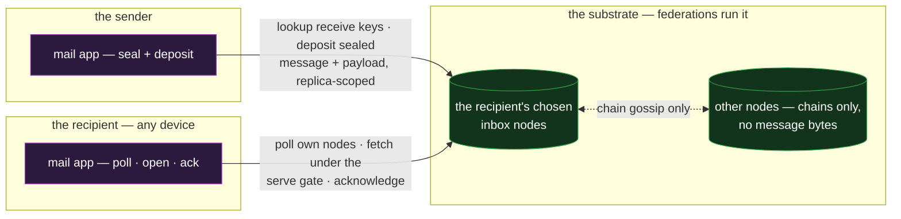

# mail — sealed store-and-forward messaging

`mail` is the asynchronous message: sealed to its recipient, delivered while they are offline,
authenticated when they open it. It is the thinnest of the core reference apps — a UI over the
**exchange** feature's one-off mode, composing nothing else — and it absorbs the catalogue's
same-composition variants: **notifications / pub-sub**, **secure file transfer**, and **key
distribution** (below).

## Deployment

The sealed bytes live only on the nodes the recipient chose — the rest of the federation carries
chains, never mail.

## The composition

Every mechanism is exchange's, used as specified
([`../features/exchange.md`](../features/exchange.md)):

- **Send.** The sender resolves the recipient's published receive keys and inbox-node hints from the
  receive-key directory, seals once per recipient device, and deposits the message at the
  recipient's own nodes — `availability.replicas` set to the inbox hints, so the sealed bytes live
  only where the recipient reads. Attachments ride as the digest-named payload blob, uploaded
  against the deposited message.
- **Receive.** The recipient polls its own nodes, fetches through the serve-time gate (a live
  signature from any current member device), opens the seal, and runs **sender-key currency** —
  placing the message in the sender's witnessed key-state timeline, so a routine rotation never
  strands in-flight mail and a harvested old key can never read as current
  ([`../features/exchange.md` §Sender-key currency](../features/exchange.md#sender-key-currency)).
  Acknowledge, and the origin node deletes.
- **Non-repudiation is opt-in.** A high-value message anchors its blinded commitment on the sender's
  chain — a witnessed, end-verifiable send-time any third party can check, per message, never by
  default.

## Scenarios

- **A rotation mid-flight.** The sender rotates between deposit and read: sender-key currency places
  the message in the sender's witnessed key-state timeline, so the honest pre-rotation send still
  opens — while a forgery signed later with the harvested old key lands outside its interval and
  refuses.
- **A dormant recipient returns.** Weeks offline, then one poll of their own nodes: everything
  deposited in the interim is fetched under the serve gate, each message placed against the sender's
  key state at its send time, acknowledged, and deleted at the origin.
- **A mass notification.** One sender, many recipients: a one-off send per subscriber under a
  `topic` discriminator — the pub-sub variant below, exercised as a flow.

## The absorbed variants

- **Notifications / pub-sub** — a one-off send per subscriber with the payload `topic` as the
  channel discriminator; the "subscription" is the sender's list, the delivery scoping identical.
- **Secure file transfer** — the payload machinery with the note as the afterthought: deposit a
  message naming a large blob, scoped to the recipient's nodes, opened and acknowledged once.
- **Key distribution** — not an application over exchange but exchange's own substrate surfaced:
  publishing and looking up encryption receive keys **is** the receive-key directory, tier-2
  protected and chain-verified. The catalogue entry dissolves into the feature, which is the right
  outcome for it.

## What this validates

- **Offline confidential delivery with no trusted relay.** The store holds ciphertext it cannot
  read, serves it under a gate that limits harvesting, and is trusted for availability only;
  authenticity and confidentiality ride the data end to end.
- **Metadata scoping is a deliberate, priced bound.** Who-mails-whom is exposed to the recipient's
  chosen nodes, not gossiped federation-wide — a bound on the recipient's own reads,
  sender-cooperative rather than sender-proof, with the residual carried in the limits below.
- **Key rotation composes with async delivery.** The interval acceptance rule threads the needle the
  design promises: honest pre-rotation mail opens, post-compromise forgeries cannot read as current.

## Limits

- **The recipient's home nodes see the communication graph** — who, when, how large — and the
  scoping is sender-cooperative; a sender bent on leaking can deposit elsewhere. Mixing and cover
  traffic are out of scope, stated as such
  ([`../features/exchange.md` §Residuals](../features/exchange.md#residuals)).
- **Spam is bounded, not eliminated.** An open inbox accepts a deposit from anyone inside the rate
  limits; lockdown trades reachability for a credential write-gate. The exchange residual, inherited
  unchanged.
- **A live stolen signing key sends valid mail** within its window until rotated — the ordinary
  compromise limit; rotation recovers the future, not the window.
