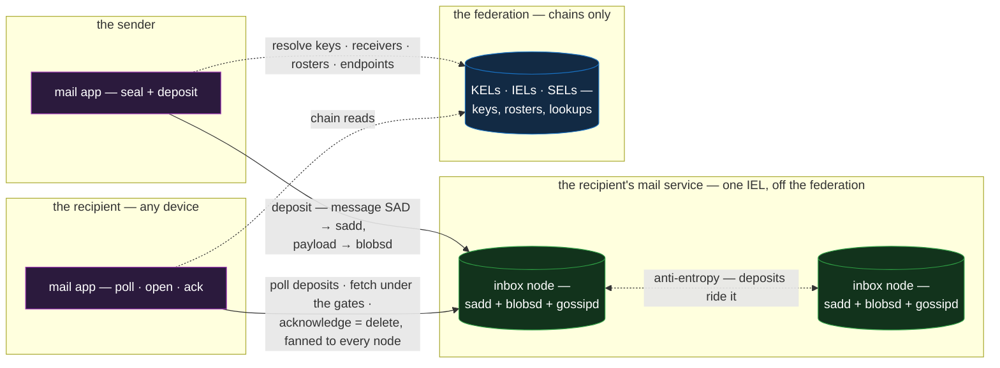

# mail — sealed store-and-forward messaging

`mail` is the asynchronous message: sealed to its recipient, delivered while they are offline,
authenticated when they open it. It is the thinnest of the core reference apps — a UI over the
**exchange** feature's one-off mode, composing nothing else — and it absorbs the catalogue's
same-composition variants: **notifications / pub-sub**, **secure file transfer**, and **key
distribution** (below). It is also the catalogue's **replicated example**: the service shape here is
the durability story the other apps reference rather than re-derive.

## Deployment

```mermaid
flowchart LR
  subgraph sender["the sender"]
    sapp["mail app — seal + deposit"]:::app
  end
  subgraph recipient["the recipient — any device"]
    rapp["mail app — poll · open · ack"]:::app
  end
  subgraph svc["the recipient's mail service — one IEL, off the federation"]
    n1[("inbox node —<br/>sadd + blobsd + gossipd")]:::svc
    n2[("inbox node —<br/>sadd + blobsd + gossipd")]:::svc
  end
  subgraph fed["the federation — chains only"]
    chains[("KELs · IELs · SELs —<br/>keys, rosters, lookups")]:::fedc
  end
  sapp -->|"deposit — message SAD → sadd,<br/>payload → blobsd"| n1
  n1 <-.->|"anti-entropy — deposits ride it"| n2
  rapp -->|"poll deposits · fetch under the gates ·<br/>acknowledge = delete, fanned to every node"| n1
  sapp -.->|"resolve keys · receivers · rosters · endpoints"| chains
  rapp -.->|"chain reads"| chains
  classDef app fill:#2b1a3d,stroke:#9c36b5,color:#fff
  classDef svc fill:#12331c,stroke:#2f9e44,color:#fff
  classDef fedc fill:#122a44,stroke:#1971c2,color:#fff
```

The sealed bytes live only on the nodes of the services the recipient chose — off the federation,
which carries chains, never mail.

## The mail service — one identity whose roster is its deployments

A mail service is **one IEL whose roster is its deployments' KELs** — the same shape as a
federation, whose roster is its witnesses' KELs, because gossip's peer model is exactly that shape
([`gossipd`](../substrate/infrastructure/gossipd.md)). Each deployment wires
[`sadd`](../substrate/infrastructure/sadd.md) (deletes on) and
[`blobsd`](../substrate/infrastructure/blobsd.md), with `gossipd` running peer authentication and
anti-entropy between them; there is no `logsd` and no `witnessd` — the service stores mail, it does
not witness chains. **The roster is the server list**: a sender enumerates the deployments from one
chain, and a deployment is cut with one roster act. There is no server-list SEL and no delegation
anywhere in mail — delegation keeps the job it was introduced for, issuer fleets in gated
applications; minting authority and peer membership are different structures.

The service takes the federation's _shape_, with each constraint derived rather than imported:

- **Floor `|roster| ≥ 3`, recommended `≥ 4`.** The property that transfers is _evict one deployment
  and still govern_: with the universal `t_govern ≥ 2` that takes three. The federation's own `≥ 4`
  floor is derived from its witness signer pool (`signers ≤ |roster| − 1` — a witness never receipts
  its own event, [`iel/events.md`](../primitives/data/event-logs/iel/events.md)), premises a mail
  service does not have. Three deployments across three availability zones is an ordinary, sound
  shape.
- **Authority thresholds `≥ 2`, signing keys in an HSM.** The `≥ 2` floor is universal — hard for
  every identity of `|roster| ≥ 2` — and the fleet's signing keys live in an HSM never reachable
  from a public face, the standing issuer expectation. The byzantine work was done for the
  federation; the worked example is the pattern to copy, not a weaker cousin of it.
- **The generic roster bounds apply as themselves.** `MAXIMUM_ROSTER_SIZE = 32` bounds a fleet as it
  bounds any identity, and the identity bond applies — a deployment's KEL joins the fleet IEL on the
  same terms as any member device. The adjacent witness-config caps do **not** carry over
  (`threshold ≤ min(|roster| − 2, signers − 1)` and the witnessing majority bound a config a fleet
  does not have).
- **The client app warns when a service is underconfigured** — below three deployments, or
  thresholds at one — because the person choosing a provider bears the risk and cannot read a roster
  event. Getting the floor right is what keeps the warning worth reading: a warning that fires on
  correct deployments is trained away, and then it stops working for the deployments it was built
  for.

**Addressing follows from the shape.** The recipient publishes **one** address per service — the
service's IEL prefix, in its `receivers` list. A sender resolves it, reads the roster, picks a node
**by KEL prefix** — on latency or anything else it cares about — and resolves that node's address
through the service's own
[endpoint lookup](../primitives/protocols/receive-key-directory.md#the-endpoint-lookup--the-same-pattern-for-a-services-addresses).
Picking a node is not trusting it: the dial authenticates against that node's KEL
([`sadd.md` §Public face](../substrate/infrastructure/sadd.md#public-face)), so a stale or
re-pointed address **fails to authenticate** and the sender falls through to the next node in the
roster. A recipient that will not depend on a single service lists two — two independent services do
not replicate to each other, so the sender deposits once per listed service.

**Replication is `gossipd` between the deployments, split by direction.** Deposits ride the
service's own anti-entropy; deletes fan from the **client** across the roster — the acknowledge is
the recipient's delete, issued to every node (the mechanics are
[`gossipd`](../substrate/infrastructure/gossipd.md)'s). This is not the hard problem the federation
solves: every deposit is immutable and named by its own hash, so two copies cannot disagree and
there is no ordering or authority question — durability reduces to how many copies exist. The only
nontrivial flow is the delete, whose worst case is a stray copy outliving its intended removal until
the client's next poll reaches the node holding it. Two consequences are worth stating: `once` burns
**per store** on a replicated deployment — two stores mean two reads — which is one more reason mail
relies on the explicit delete; and a snapshot of one node restores objects its peers have deleted,
until the same poll-and-delete reaches them.

**What a governance compromise costs.** Not content: mail is ESSR-sealed to the **recipient's device
receive keys** — the envelope encapsulates to the recipient, never to the service — so a compromised
service governance holds ciphertext it cannot open and can forge no authorship. What widens is
**metadata and denial of service**: the correspondence graph, and the ability to withhold or to
re-point where future deposits land.

## The composition

Every mechanism is exchange's, used as specified
([`../features/exchange.md`](../features/exchange.md)):

- **Send.** The sender resolves, from the receive-key directory, the recipient's published receive
  keys and its `receivers` — the recipient's chosen service identities. It seals once per recipient
  device and deposits once per listed service, fanning **client-side** across the service's two
  stores: the message SAD to `sadd`, the payload (`bundle.said ‖ blob`) to `blobsd`, the message
  committing the storage key `S`
  ([`../features/exchange.md` §The payload](../features/exchange.md#the-payload--committed-by-storage-key-deposited-beside-the-message)).
  The sealed bytes land only where the recipient reads, off the federation.
- **Receive.** The recipient polls its own services' recipient-scoped `deposits` listing, fetches
  under the serve gates (the payload under its bundle's `roster` gate — a live signature from any
  current member device), opens the seal, and runs **sender-key currency** — placing the message in
  the sender's witnessed key-state timeline, so a routine rotation never strands in-flight mail and
  a harvested old key can never read as current
  ([`../features/exchange.md` §Sender-key currency](../features/exchange.md#sender-key-currency)).
  Then it **acknowledges**: a delete mail's own store predicate authorizes for the **recipient** —
  the requester the live check resolves must equal the envelope's `recipient`, so an evicted device
  can neither drain nor delete — not `custody.owner`, which on a mail message names the **sender**
  and is usually absent. The client fans the delete across the service's roster.
- **Non-repudiation is opt-in.** A high-value message anchors its blinded commitment on the sender's
  chain — a witnessed, end-verifiable send-time any third party can check, per message, never by
  default.

## Scenarios

- **A rotation mid-flight.** The sender rotates between deposit and read: sender-key currency places
  the message in the sender's witnessed key-state timeline, so the honest pre-rotation send still
  opens — while a forgery signed later with the harvested old key lands outside its interval and
  refuses.
- **A dormant recipient returns.** Weeks offline, then one poll of their own services: everything
  deposited in the interim is fetched under the serve gates, each message placed against the
  sender's key state at its send time, acknowledged, and deleted across the roster.
- **A deployment is lost.** One roster act cuts it; the surviving nodes already hold every
  replicated deposit, the sender's next resolve reads the reduced roster, and the client warns if
  the service has fallen below the floor — durability and governance both recover from the chain,
  with no migration machinery.
- **A mass notification.** One sender, many recipients: a one-off send per subscriber under a
  `topic` discriminator — the pub-sub variant below, exercised as a flow.

## The absorbed variants

- **Notifications / pub-sub** — a one-off send per subscriber with the payload `topic` as the
  channel discriminator; the "subscription" is the sender's list, the delivery scoping identical.
- **Secure file transfer** — the payload machinery with the note as the afterthought: deposit a
  message committing a large payload by its storage key, scoped to the recipient's services, opened
  and acknowledged once.
- **Key distribution** — not an application over exchange but exchange's own substrate surfaced:
  publishing and looking up encryption receive keys **is** the receive-key directory, tier-2
  protected and chain-verified. The catalogue entry dissolves into the feature, which is the right
  outcome for it.

## What this validates

- **Offline confidential delivery with no trusted relay.** The store holds ciphertext it cannot
  read, serves it under a gate that limits harvesting, and is trusted for availability only;
  authenticity and confidentiality ride the data end to end.
- **Durability is copy count, not consensus.** One app demonstrates the replicated service shape —
  one IEL whose roster is its deployments, immutable deposits riding anti-entropy, deletes fanned
  from the client — and the rest of the catalogue references it instead of re-deriving it.
- **Metadata scoping is a deliberate, priced bound.** Who-mails-whom is exposed to the recipient's
  chosen services, not gossiped federation-wide — and the recipient chooses a **service**, never
  machines: the roster is public and auditable, so the exposure set is inspectable at any time.
- **Key rotation composes with async delivery.** The interval acceptance rule threads the needle the
  design promises: honest pre-rotation mail opens, post-compromise forgeries cannot read as current.

## Limits

- **The recipient's inbox nodes see the communication graph** — who, when, how large — and the
  scoping is sender-cooperative; a sender bent on leaking can deposit elsewhere. Listing a second
  service doubles the parties that see the graph. Mixing and cover traffic are out of scope, stated
  as such ([`../features/exchange.md` §Residuals](../features/exchange.md#residuals)).
- **A compromised service is denial and correlation, never disclosure.** It reads no content and
  forges nothing; it can withhold, and a governance compromise can re-point where future deposits
  land — the same class as the residual above, at a larger radius.
- **Spam is bounded, not eliminated.** An open inbox accepts a deposit from anyone inside the rate
  limits; lockdown trades reachability for a credential write-gate. The exchange residual, inherited
  unchanged.
- **A live stolen signing key sends valid mail** within its window until rotated — the ordinary
  compromise limit; rotation recovers the future, not the window.
