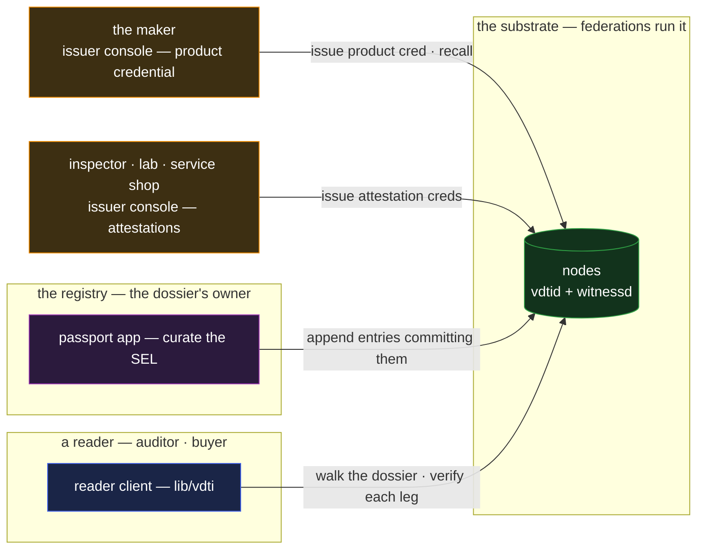

# passport — the digital product passport

`passport` is a product's verifiable dossier: what it is, attested by its maker; what has happened
to it — inspections, certifications, services, repairs — accumulated over its life. The
regulation-driven instance is the EU-style digital product passport; the same shape is a machine's
service book or a facility's compliance file. It is the composition case for **credentials plus a
log**, and it absorbs the catalogue's same-composition variants: **compliance attestation** (an
auditor attests; a log holds the trail) and **warranty and service history** (a service record that
travels with the good).

## Deployment

Three independent authorities — the maker, the registry, the attestors — never share a system; the
reader composes their chains from any node.

## The composition

Two constructs, joined by reference — each doing only what it is for:

- **The product credential is the identity of the good.** The maker issues a credential whose claims
  describe the product — model, serial, materials, compliance brackets — anchored on the maker's
  chain ([`../features/credentials.md`](../features/credentials.md)). The good itself is not an
  identity holding keys, and no holder presents this credential at all: the dossier commits it by
  SAID and a reader verifies it as **referenced** data — the accepting checks minus ownership
  ([`../features/credentials.md` §Edges / chaining](../features/credentials.md#edges--chaining)) —
  so the repeated, holder-independent checks a product's life demands never touch the bearer rule's
  single-use bound. Recalling a batch is cohort revocation — the strike every downstream check sees,
  the `permit` composition at product width ([`permit.md`](permit.md)).
- **The dossier is a content SEL the registry owns.** Per product, a single-owner log — `topic` the
  passport discriminator, entries committing dossier records by SAID
  ([`../primitives/data/event-logs/sel/log.md`](../primitives/data/event-logs/sel/log.md)). The log
  supplies what the credential cannot: an append-only, witnessed **timeline** — the `ledger`
  composition applied to one product's life ([`ledger.md`](ledger.md)).
- **Third parties attest by credential; the log collects by reference.** An inspector, a service
  shop, an auditor issues its **own** credential — anchored on its own chain, carrying its own
  authority, revocable by it alone — and the dossier's next entry commits that credential's SAID.
  The log owner curates the timeline; it cannot forge the attestations on it (each verifies against
  its issuer's chain), and the attestors cannot rewrite the timeline (only the owner appends,
  witnessed). Curation and attestation stay separate authorities, which is the honest division a
  multi-party dossier needs.
- **A reader walks both legs.** Verify the product credential against the maker; walk the dossier
  for its entries; verify each committed attestation against its own issuer, including revocation —
  an attestation the auditor later withdrew reads withdrawn even though the log entry that cited it
  is immutable. The timeline is permanent; the standing of what it cites is always read live.
  Delegated authority composes where the domain has hierarchy — an accredited lab's attestation
  carries its accreditation path, verified not asserted
  ([`../features/credentials.md` §Edges / chaining](../features/credentials.md#edges--chaining)).

## Scenarios

- **Manufacture.** The maker issues the product credential and incepts the dossier, its first entry
  committing the credential — the passport exists the moment the product does.
- **A service visit.** The shop issues a service attestation to its own chain's authority; the
  registry appends an entry committing it. The owner of the good needs no account anywhere — the
  passport travels with the good's identifier, fetchable and verifiable from any node.
- **An audit.** The auditor reads the whole dossier from any source, verifies every attestation
  against its issuer, and checks the product credential's standing — including whether the maker has
  recalled this unit. Nothing in the read trusts the registry beyond its curation.
- **A withdrawn certification.** The certifier revokes its attestation credential. The dossier entry
  stands (the timeline is history), and every fresh read of the passport now shows the certification
  as revoked — exactly the recall-aware read a regulated dossier must support.

## What this validates

- **Credentials and logs compose by reference with no bridging machinery.** The log commits
  credential SAIDs like any content; the credentials verify by their own rules; neither primitive
  needed a field for the other. The composition surface the catalogue promised — snap together,
  don't integrate — holds at two constructs.
- **Curation and attestation separate cleanly.** Who maintains the timeline and who vouches for
  facts on it are different authorities with different failure modes, and the composition keeps them
  independently verifiable — a captured registry cannot forge an inspection; a rogue inspector
  cannot rewrite the book.
- **Immutable history with live standing.** The design's split between what is committed (forever)
  and what is currently trusted (read fresh) is exactly the semantics a recall-and-audit domain
  requires, and it falls out with no special casing.

## Limits

- **The single-owner log is a registry, not a relay baton.** A SEL has one owner for life, so the
  dossier's custodian is fixed — a maker, a regulator, an industry registry. A history whose
  _writers_ change as the good changes hands — each custodian recording its own leg — is the
  provenance composition, which adds exchange for the hand-off ([`trace.md`](trace.md)).
- **The physical binding is out of band.** That _this_ object is the one the passport describes
  rests on the identifier's attachment — serial, tag, marking — which structure cannot secure. A
  swapped tag defeats the passport; the composition guarantees the dossier's integrity, not the
  object's.
- **Registry liveness bounds growth, not verification.** A retired or unavailable registry stops new
  entries; everything already committed verifies forever from any copy. Choose the dossier's owner
  with its expected lifetime in mind — a structural argument for industry registries over single
  vendors, made honestly by the composition itself.
