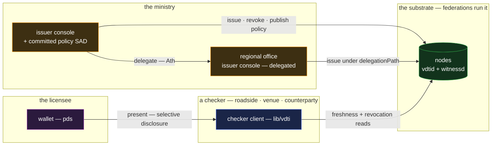

# permit — licensing and permits

`permit` is authority issued, verified, and withdrawn: a driving licence, a food-service permit, a
building consent — issued by an authority, held by the licensee, checked by anyone, revocable at the
issuer's word. It is the composition case for **credentials alone**, chosen because a licensing
system exercises the whole credential lifecycle — issue, verify, delegate, disclose selectively,
renew, revoke — in one application. It absorbs the catalogue's largest same-composition family
(below).

## Deployment

The presentation runs holder-to-checker directly — authenticity needs no network; the checker's two
online legs are the freshness and revocation reads, from any node.

## The composition

- **A licence is a targeted credential.** The authority is the `issuer`, the licensee's identity the
  `issuee`, the licence class and conditions the `claims`, and issuance is the anchor on the
  authority's own chain — witnessed, positioned, revocable in place
  ([`../features/credentials.md` §The two foundations](../features/credentials.md#the-two-foundations)).
  Cohorts issue in bulk where linkage is harmless and singly where it is not, the feature's stated
  trade.
- **A check is the acceptance conjunction.** A roadside inspector, a venue, a counterparty — each
  runs the same fail-secure sequence: integrity, valid issuance at the pinned anchor, issuer trusted
  (the checker's list), fresh to the tip, **not revoked**, owned by the presenter live, not expired
  ([`../features/credentials.md` §Accepting a presented credential](../features/credentials.md#accepting-a-presented-credential)).
  Authenticity needs no network; the freshness and revocation reads are the one online leg, with the
  fail-open lookup as the checker's own availability trade.
- **Suspension and revocation are the kill.** The issuer declares the credential's derived
  revocation target on its own chain; every fail-secure check in the world turns the licence away
  from that moment, and no one — not the licensee, not a compromised verifier — can un-declare it
  ([`../features/credentials.md` §Revocation](../features/credentials.md#revocation)). Restoring a
  suspended licence is a re-issue: a fresh credential, the old one dead — strikes are additive and
  final, which is what makes them trustworthy. Office-issued licences mint under a
  `revocationPolicy` naming the ministry's line, so winding an office down never strands its
  outstanding licences beyond the ministry's strike.
- **Delegated issuing authority is the delegation machinery.** A national authority delegates to
  regional offices; a licence issued by an office carries its committed `delegationPath`, and
  acceptance walks it — authority is derived by the verifier, never asserted by the office
  ([`../primitives/policy/documents.md` §Delegation in a document](../primitives/policy/documents.md#delegation-in-a-document)).
  Rescinding an office's delegation cuts future issuance without unwinding what it validly issued
  before the bound — the grandfather semantics a real licensing hierarchy needs. The checker's whole
  condition is one committed expression in the policy language —
  `crd(vdti/cred/v1/schemas/driving-licence, thr(1, [id(ministry), del(ministry, 2)]))` — a policy
  SAD named by SAID, shared verbatim by every checker that adopts it
  ([`../primitives/policy/policy.md` §The policy language](../primitives/policy/policy.md#the-policy-language)).
- **Conditions disclose selectively.** The claims carry issuer-precomputed brackets — the age
  brackets, the licence-class booleans, the endorsement flags — so a check learns exactly the
  boolean it asks for and nothing else
  ([`../features/credentials.md` §Claim-gating](../features/credentials.md#claim-gating)). Renewal
  re-issues with fresh nonces: unlinkable across renewals, the bracket set extensible with no
  protocol change.

## Scenarios

- **A roadside check, offline.** The licensee presents from the wallet; integrity, issuance, claims,
  and live ownership all verify holder-to-checker with no network. The freshness and revocation
  reads run when connectivity allows — accepting in the gap is the fail-open trade, priced by the
  checker, never silent.
- **A suspension.** The ministry declares the kill on its own chain; every fail-secure check
  everywhere turns the licence away from its next fresh read, and reinstatement is a fresh
  credential — the old one stays dead.
- **A regional office issues.** The office mints under its committed `delegationPath`; a checker
  that adopted the ministry's policy SAD accepts the licence with no call to the ministry —
  authority walked from the data, never asserted.

## The absorbed family

Seven catalogue entries are this application with the nouns changed, and each maps to a lifecycle
corner `permit` already exercises (authority checked at every use by the organization's own
resources — access control and API keys — is the `iam` composition, [`iam.md`](iam.md)):

- **Age / identity verification** — a claim-gated check (`ageGTE18`, disclosed alone) against a
  government-issued credential; the offline-verify posture is the licence check with the network leg
  deferred.
- **Travel documents** — a licence held by the traveler: authenticity offline, revocation from a
  fresh read of the issuer's chain, from any source.
- **Prescriptions** — a licence to dispense once: issued to the patient, revoked by the issuer on
  fill (the single-use discipline; a pharmacy that must dispense before confirming is the fail-open
  trade, priced consciously).
- **Recall management** — revocation at cohort width: the issuer strikes a batch's credentials and
  every holder's check fails secure, everywhere, at once.
- **Certificate of authenticity** — the maker as issuer, the item's description as claims; as a
  bearer instrument it is single-use, redemption-as-revocation closing reuse
  ([`../features/credentials.md` §Targeted vs bearer](../features/credentials.md#targeted-vs-bearer)),
  and a certificate checked repeatedly across resales is targeted, transferred as a re-grant — the
  title model ([`trade.md`](trade.md)).
- **Supplier onboarding / KYB** — a reusable business-identity credential: verified once by the
  attestor, presented everywhere, revoked when standing lapses.
- **Reputation / endorsements** — accumulated attestations: many small credentials from many
  issuers, each independently verifiable and revocable; the aggregation and weighting is the relying
  party's policy, as it must be.

## What this validates

- **One wrapper carries a regulatory domain.** Nothing licensing needed — hierarchy, suspension,
  selective disclosure, renewal, cohort recall, single-use — required a new field, a registry
  service, or a policy language. The claim that the credential is deliberately minimal and the
  relying party deliberately sovereign survives contact with the heaviest credential domain in the
  catalogue.
- **Fail-secure is the default posture end to end.** Every check in this doc refuses on uncertainty
  — unresolvable anchor, stale chain, unreachable revocation walk — and every fail-open softening is
  an explicit, local, priced choice by the checker.
- **Offline-first verification with principled online legs.** Authenticity from the data alone;
  freshness and revocation as the exactly-two reads that genuinely cannot be offline — the split the
  design promises, observed intact in the field's most offline-shaped use cases.

## Limits

- **Issuer trust is out of band.** Which authorities a checker accepts is configuration rooted in
  the real world; the structure proves issuance by a prefix, not that the prefix is the ministry it
  claims to be. Binding well-known authorities to prefixes is directory work above the protocol.
- **Revocation latency is the checker's dial.** Between the issuer's strike and a checker's next
  fresh read, a fail-open checker can accept a dead licence — the stated freshness residual, tuned
  per deployment, never hidden.
- **The credential attests the issuer's judgment, not the fact.** A licence proves the authority
  said the holder may drive — wrongly granted is wrongly granted, structurally perfect. Contesting
  the judgment is an institutional process; the structure contributes the unforgeable record of who
  judged what, when.
