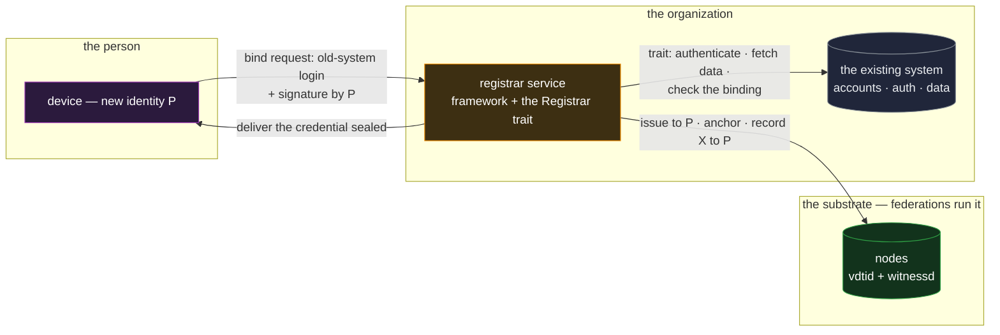

# registrar — binding people to identities

`registrar` is the bridge between the chain world and an organization's roll of real people: it
binds each person to **exactly one** identity prefix and issues them credentials carrying the
organization's data about them. It is a core reference app — the carrier of the **external authority
seam**, the one place an application must plug in truth the chains cannot derive — and the
foundation `vote` builds on ([`vote.md`](vote.md)).

## Deployment

The registrar is the one app in the set that must run a service, because its job is the seam: the
grey box is the organization's existing world, reached only through the trait it implements.

## The composition

The mechanism is the credential feature's registrar model, applied
([`../features/credentials.md` §The registrar](../features/credentials.md#the-registrar)):

- **Migration is the primary path.** The adopting organization already has its people behind an
  existing login, already deduplicated. Migrating each account to one prefix inherits that
  uniqueness — the bind is two proofs in one exchange, both required: authenticate to the old system
  ("I am account X") and sign with the new prefix ("I control P"). The organization's own
  verification of the first proof is the **`Registrar` trait** — the seam where its private systems
  answer; the framework carries everything around it: receiving the request, issuing and anchoring,
  recording `X ↔ P`.
- **Fresh enrollment is the exception path.** A person with no prior account gets a mailed one-time
  token whose single use a public spent log enforces — the no-prior-trust bootstrap, deliberately
  narrow.
- **Step-up guards the binding.** A second factor out of band from the login — recommended on first
  bind, **enforced on any re-bind** — so a stolen password alone can never re-point an existing
  person's binding at an attacker's prefix.
- **Recovery maps to the identity's own tiers.** A rotated key changes nothing here; total loss
  reincepts a new prefix and re-runs the bind under step-up, the registrar revoking the old
  credential and **replacing** the binding — one person, one prefix, maintained through the person's
  worst day.
- **Delivery rides exchange.** The issued credential reaches the person sealed to their keys
  ([`../features/exchange.md`](../features/exchange.md)); presentations of it thereafter are the
  standard machinery, with the registrar out of the loop — which is the point: the old system's
  strength bounds a one-time enrollment window, not a permanent dependency.

## Scenarios

- **A government migrates its citizen portal.** Each citizen binds once; the portal shrinks to the
  binding map and retires. A later breach of the retired system can neither present anyone's
  credential nor re-bind anyone — the trust actually transferred.
- **A university issues alumni credentials.** Same seam, lower stakes: the trait implementation is
  "verify against the student-records system"; everything else ships with the framework.
- **A re-bind under duress scrutiny.** An attacker with a phished password requests a re-bind;
  step-up refuses. The failure mode of account-recovery flows — the industry's weakest link — is
  structurally fenced to the one flow that changes a binding.

## What this validates

- **The external-authority seam is one trait, not an integration project.** Everything an
  organization must supply is "authenticate the requester, return their data, check the binding" —
  its existing competence. Everything protocol-shaped is framework-supplied. The design's claim that
  apps plug in only the logic the system cannot own is tested at the seam where it matters most.
- **One-person-one-prefix is maintainable, not just establishable.** The bind, the re-bind, the
  recovery replacement, and the spent-token log together keep the invariant through the whole
  lifecycle — which is what `vote` and every sybil-sensitive consumer actually needs.
- **Old-system risk is a closing window.** The composition's security improves monotonically as
  migration proceeds — the inherited-uniqueness argument made concrete.

## Limits

- **The single binding is attested by the registrar, not independently verifiable** — the feature's
  stated residual. A corrupt or compromised registrar can double-bind; its consumers trust its roll
  the way they always did, now with an auditable issuance trail.
- **The bind is as strong as the weaker proof at bind time.** A compromised old-system account
  migrates its data to the thief's prefix during the window — bounded by step-up, closed by
  completed migration, and stated rather than hidden.
- **The trait's answer quality is the organization's.** Garbage rolls produce well-attested garbage
  bindings; the seam transfers institutional truth, it cannot mint it.
