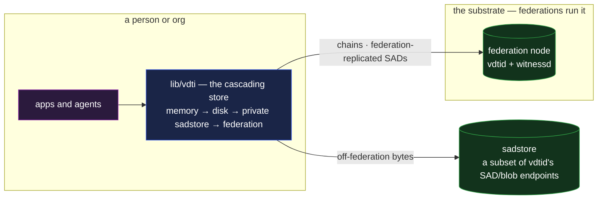

# sadstore — off-federation SAD storage

`sadstore` is a **storage node you run yourself**: a deployable image that holds the SAD bytes and
blobs the federation does not, and drops into a client's cascading store as a tier of its own. It is
the answer to "where does data kept **off** the federation live" — the store a person or
organization runs for it, still addressed and verified with the same content-addressed model as
everything else.

It is **not** federation infrastructure. A federation node is a `vdtid` + `witnessd` pair whose
witness KEL is its identity
([`../substrate/infrastructure/architecture.md`](../substrate/infrastructure/architecture.md#the-decomposition));
`sadstore` runs neither the witness role nor the chain log. It **exposes a subset of `vdtid`'s
endpoints** — the SAD and blob store/serve paths, and nothing else — so it stores and serves by SAID
/ digest under the same custody `readers` rules, but it witnesses nothing and sits in no
federation's roster.

## Deployment

The image is dropped in wherever the operator wants a storage tier — a personal device, a home
region, an org's private network. A client's **cascading store**
([`../substrate/infrastructure/architecture.md` §The store traits](../substrate/infrastructure/architecture.md#the-store-traits--one-interface-composed-in-sequence))
searches its tiers in order — memory → disk → private `sadstore`(s) → the federation — and a fetch
is answered by whichever tier holds the bytes, the serve rules identical at each.

## The composition

- **It exposes the store half of `vdtid`, not the chain half.** The SAD write / fetch, the blob
  upload / fetch, the existence probe
  ([`../substrate/infrastructure/vdtid.md` §The API surface](../substrate/infrastructure/vdtid.md#the-api-surface))
  — never `submit events`, receipts, or the gossip mesh. `sadstore` is a store, not a witness.
- **The cascading store is the routing signal.** There is no per-SAD placement field: the client
  decides which tier a write lands on. Off-federation data is written to the local and private
  `sadstore` tiers and **not submitted** to a federation node; data meant for federation witnessing
  is submitted and replicates across **all** the federation's witnesses
  ([`../substrate/infrastructure/architecture.md` §The store traits](../substrate/infrastructure/architecture.md#the-store-traits--one-interface-composed-in-sequence)).
  One object model expresses both placements — the application owns the choice, off to the side of
  the protocol.
- **Everything still verifies.** A `sadstore` is untrusted like every store — bytes
  content-addressed (SAID / blob digest), reads gated by custody `readers`, the consumer verifying
  what it fetches through the same core library. Moving data between a `sadstore` and anywhere else
  is cost, not trust
  ([`../system-thesis.md` §End-verifiability](../system-thesis.md#end-verifiability)).

## Scenarios

- **A personal store.** A person runs a `sadstore` on a home device; their [`pds`](pds.md) records
  live there, indexed by the person's own chains, fetched by any of their devices through the
  cascade.
- **A private drive tier.** A [`drive`](drive.md) keeps a home-region `sadstore` as a fast, private
  tier; published files still replicate across the federation, private ones stay on the `sadstore`.
- **An inbox.** A recipient's mail lands on the `sadstore`(s) their receive-key directory
  **inbox-node hints** point at — off-federation blobs deposited to the recipient's own storage, so
  the communication graph is exposed only to the nodes the recipient chose, not the federation
  ([`../features/exchange.md` §Addressing and delivery](../features/exchange.md#addressing-and-delivery--scoped-to-the-recipients-own-nodes)).

## What this validates

- **Off-federation storage needs no new protocol.** The same SAD / blob model, the same custody
  gate, the same verification — `sadstore` is a deployment shape, not a new primitive. "Storage is a
  tier, trust is the data" holds at the edge of the federation as it does inside it.
- **The federation stays the witness set, uncomplicated.** A federation replicates every SAD it
  admits across all its witnesses — there is no per-object placement field to carry or resolve.
  "Keep it off the federation" is the client writing to a `sadstore` tier and not submitting, off to
  the side of the protocol; the "arbitrary node subset" cases all resolve to that.

## Limits

- **A `sadstore` witnesses nothing.** It cannot advance a chain, mint a receipt, or vouch for
  freshness — it only stores and serves. Data that needs federation witnessing goes to the
  federation.
- **At-rest privacy from the `sadstore` operator is client-side encryption** — the same limit
  `drive` and `pds` state; `readers` gates the serve, encryption protects the bytes.
- **Availability is the operator's.** A `sadstore` taken offline takes its off-federation data with
  it; redundancy across several `sadstore` tiers, or falling back to the federation for what can be
  public, is the operator's call.

## Cross-references

- [`../primitives/data/sad/availability.md`](../primitives/data/sad/availability.md) — the
  `{ expiry, once }` axes that still govern a SAD held on a `sadstore`.
- [`../substrate/infrastructure/architecture.md`](../substrate/infrastructure/architecture.md) — the
  node decomposition and the cascading store traits that route placement.
- [`../substrate/infrastructure/vdtid.md`](../substrate/infrastructure/vdtid.md) — the endpoints
  `sadstore` exposes a subset of.
- [`pds.md`](pds.md) / [`drive.md`](drive.md) / [`../features/exchange.md`](../features/exchange.md)
  — the compositions that place data on a `sadstore`.
