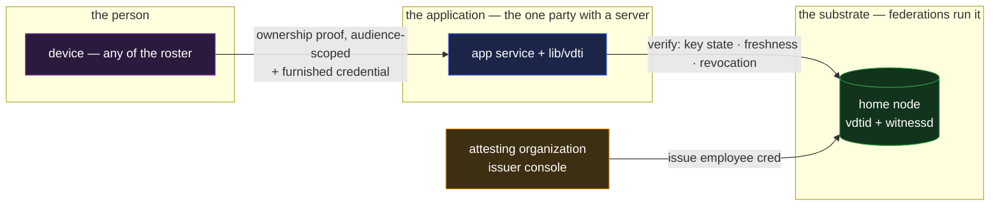

# sso — passwordless sign-in

`sso` is authentication to an application: prove who you are, optionally prove attested facts about
yourself ("verified employee of X"), start a session. It is the composition case for **identity plus
credentials**, and it is the one application in the set that validates the identity primitive
**directly** — the thing being consumed is control of an identity, not data the identity wrote.

## Deployment

The application is the one party here that runs a service — and it holds no secrets worth stealing:
it verifies proofs against the substrate instead of keeping a credential database.

## The composition

- **The account is a prefix.** An application account is an identity — an IEL over the person's
  devices — and enrollment is nothing but recording the prefix. There is no password to set because
  there is no shared secret at all: the application never holds anything a breach of the application
  could leak that would let anyone sign in.
- **Sign-in is the ownership proof.** The credential feature already defines the one live act the
  system has — a fresh, audience-scoped `{ audience, nonce, created }` signed by the identity's
  `t_use` quorum
  ([`../features/credentials.md` §Presentation](../features/credentials.md#presentation)). Sign-in
  is that act with the application as the audience: replay to another site fails the audience
  binding, replay to this site hits the nonce dedup, and phishing has nothing to steal — the
  signature binds to the verifier it was made for. The application verifies against the identity's
  **current** key state, so a rotated-out device stops signing in with no deprovisioning step, and a
  forked or disputed identity is frozen out fail-secure — the same divergence gate every ownership
  proof carries
  ([`../features/credentials.md` §Accepting a presented credential](../features/credentials.md#accepting-a-presented-credential)).
- **"And they are verified to be X" is a presented credential.** Where the application needs more
  than control of a prefix — an employer attestation, an age bracket, a customer tier — the person
  presents a credential in the same round trip, and the application runs the standard acceptance
  conjunction with its own issuer trust. Selective disclosure means the application learns the
  bracket, not the birthdate
  ([`../features/credentials.md` §Claim-gating](../features/credentials.md#claim-gating)).
- **The session is the application's.** What starts after a successful proof — a cookie, a token, a
  TTL — is ordinary application machinery, out of scope by design. The composition replaces the
  authentication event, not the session layer.

## Scenarios

- **Enroll.** The person presents their prefix; the application records it, optionally gated on a
  presented credential ("employees of X may register"). No password, no email verification loop
  standing in for identity.
- **Sign in from a new phone.** The person's identity added the device to its roster; the
  application did nothing and needs to know nothing. The quorum is the account, not the gadget.
- **Lost device.** The identity evicts it; the application, again, did nothing. Compare the
  password-reset flow this replaces — the weakest link in conventional account security is the
  recovery path, and here it is the identity layer's own machinery with its own doctrine
  ([`../system-thesis.md` §Defense against current-state compromise is layered](../system-thesis.md#defense-against-current-state-compromise-is-layered)).
- **Step-up.** For a sensitive action the application demands a fresh proof — same mechanism,
  narrower audience string, optionally a verifier-issued challenge (the stronger-liveness mode the
  presentation machinery already defines).

## What this validates

- **Identity as a first-class primitive earns its keep.** The account/device decoupling the thesis
  claims is exactly what dissolves the hard problems of application auth: provisioning, device loss,
  and recovery all move to the identity layer, where they are governed by chains rather than by help
  desks.
- **The application's breach surface collapses.** The application stores prefixes — public data.
  There is no credential database to dump, no password hashes to crack, no session-minting secret
  whose theft is an account-takeover factory. What remains breachable is the application's own
  authorization data, which no authentication scheme removes.
- **No identity provider sits in the loop.** Conventional SSO delegates sign-in to a provider the
  application must trust and the person must have a live relationship with. Here the "provider" is
  the person's own chain plus the witnessing substrate — verified, not trusted, and available to
  every application without federation agreements.

## Limits

- **Account linkage is by design visible to the application.** The same prefix presented twice is
  the same account — that is what an account is. A person wanting unlinkable personas runs distinct
  identities; nothing in the composition manufactures unlinkability from a single prefix.
- **Authorization stays the application's.** What an authenticated identity may do — the roles, the
  entitlements — is the application's policy over presented proofs, as everywhere else in the design
  (the tracker composes it — [`tracker.md`](tracker.md)).
- **A wholly-compromised identity signs in as itself.** The ownership proof attests control of the
  quorum, not the wholesomeness of the controller. Detection and recovery of identity compromise is
  the identity layer's doctrine; the application's step-up dial bounds what a thief does with a
  window of control.
