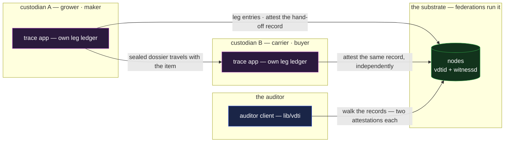

# trace — track-and-trace provenance

`trace` is an item's history across organizations that do not trust each other: food, pharma, luxury
goods, evidence — each actor recording its leg, each hand-off attested by both sides, the whole
chain verifiable end-to-end with no central tracker. It is the composition case for **credentials
plus logs plus exchange**, and it absorbs the catalogue's same-composition variants: **chain of
custody** (legal evidence, lab samples, cold chain) and **drug supply-chain provenance** are this
application with the nouns changed.

## Deployment

No consortium platform: each custodian writes only its own chains, the hand-off record collects both
parties' independent attestations, and the auditor composes it all from any node.

## The composition

The passport fixed one honest edge: a single-owner log has one custodian for life, so it makes a
registry, not a relay baton ([`passport.md`](passport.md)). `trace` is the shape for the baton —
**no shared log exists at all**; the chain of custody is a chain of cross-referenced acts on the
participants' own chains:

- **Each actor keeps its own leg.** A custodian records what it did with the item — received,
  stored, processed, shipped — on its **own** ledger (a content SEL it owns, the `ledger`
  composition per participant — [`ledger.md`](ledger.md)). Nobody writes on anyone else's chain, so
  no shared-write machinery is needed or invented.
- **A hand-off is one jointly-attested record.** The transfer document — item, time-bracket,
  condition, the two parties, the prior hand-off's SAID — names its `issuers` as the sender and
  receiver, and **each attests independently on its own chain at its own pace** through the
  multi-identity attestation machinery; a relying party's committed policy
  `and(id(sender), id(receiver))` is satisfied by the two positive lookups, with no coordination and
  no countersigning ceremony
  ([`../primitives/policy/documents.md` §Multi-identity authorization](../primitives/policy/documents.md#multi-identity-authorization--independent-attestations)).
  The item's custody chain is the sequence of these records, each linking its predecessor by SAID —
  every link a two-sided, independently-anchored commitment neither party can later deny or alter,
  and a half-attested record is exactly what a disputed transfer looks like.
- **Exchange moves the dossier with the item.** At each hand-off the sender delivers the item's
  accumulated dossier — the prior attestations and leg records — sealed to the receiver
  ([`../features/exchange.md`](../features/exchange.md)), so the next custodian holds everything it
  needs to verify what it accepted, and the business relationship stays off any shared surface: the
  graph is visible to the parties and their chosen nodes, not to a platform.
- **A verifier walks the chain of records.** Handed the final hand-off, an auditor confirms each
  record's two attestations — anchored, unrevoked, fresh — and follows the predecessor references
  back to origin. Authority composes where the domain has it: a certified carrier's attestation
  carries its accreditation path; a recall is the maker's cohort revocation striking every
  downstream check at once ([`permit.md`](permit.md)).

## Scenarios

- **A cold-chain leg.** The carrier's own ledger records temperature attestations on its leg; the
  delivery's hand-off record commits the leg's summary. A break in the chain is either recorded (and
  permanent) or a refusal to attest — and a hand-off missing the receiver's attestation is exactly
  what the next buyer's verification surfaces.
- **Evidence custody.** The absorbed legal case verbatim: every transfer double-attested, every gap
  visible as a missing or half-attested record, no clerk able to rewrite the book afterward — the
  property courts currently establish by testimony carried instead by structure.
- **A recall.** The manufacturer revokes the lot's credentials; every custodian's next fresh check
  fails secure, wherever the goods are, with no notification infrastructure beyond the chains
  themselves.
- **An audit years later.** Every attestation still verifies from any source — issuers' chains are
  append-only and witnessed — and standing is read live: an attestor since discredited shows as
  revoked exactly as the passport's read prescribes.

## What this validates

- **Three features compose with nothing invented.** The hand-off record is a jointly-attested
  document under a committed policy; the legs are plain ledgers; the delivery is plain exchange. The
  catalogue's heaviest multi-feature entry decomposes entirely into landed machinery — the strongest
  evidence yet for the composition thesis.
- **Cross-organization truth without a platform.** No consortium database, no operator whose
  compromise rewrites history, no member whose exit strands the data — each party owns its own
  records and the item's story is the verifiable seam between them.
- **Two-sided attestation is the right primitive for custody — and it exercises the policy layer's
  most neglected machinery.** A transfer neither party can unilaterally assert or deny falls
  directly out of independent attestations counted by a committed `and` policy — no escrow, no
  countersigning ceremony, no shared document needed, and the multi-identity attestation
  construction gains its first consuming application.

## Limits

- **The physical binding is out of band** — the passport's limit, compounded by motion: that the
  crate scanned is the crate attested rests on identifiers and seals structure cannot secure.
- **Omission is the honest gap.** A custodian who never attests leaves a hole; the composition makes
  the hole **visible** (the record chain breaks, or a record sits half-attested) and
  non-repairable-in-hindsight, but it cannot force diligence — the ledger's omission limit, at
  supply-chain width.
- **Graph privacy is scoped, not absolute.** The parties to a hand-off and their chosen nodes see
  that leg; regulators see what they are handed. What the composition removes is the central tracker
  that sees everything — not the counterparty's knowledge of its own trades.
