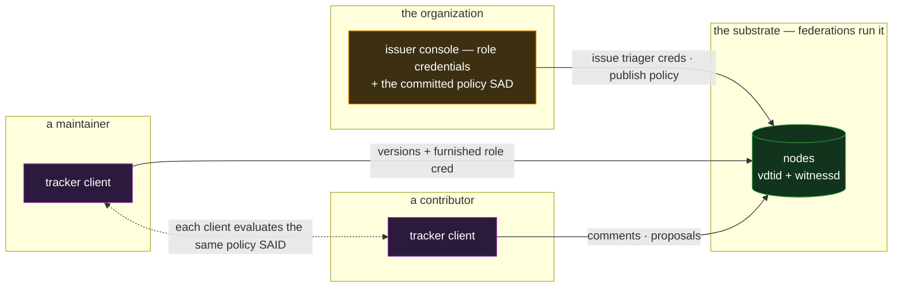

# tracker — the issue and project tracker

`tracker` is collaborative work state: issues, discussion, status, and the roles that govern who may
triage what. It is the composition case for **shared documents plus credentials** — the document
construct carries the collaboration, and credentials carry the **roles**, combined by the
application exactly the way the design says roles must be combined: as the relying party's
acceptance decision, never as policy on the data.

## Deployment

There is no tracker server: the organization's one operator surface is its issuer console, and every
client renders the same state by evaluating the same committed policy against the same data.

## The composition

- **An issue is a shared document.** Its constitution derives the issue's identity; its version DAG
  carries the issue body and its structured state — title, status, labels, assignee — each state
  change an authored, anchored version; the discussion is the comment tree, threaded and attributed,
  the same machinery the message board exercises
  ([`../features/shared-documents.md`](../features/shared-documents.md), [`bbs.md`](bbs.md)). A
  project is an index document whose versions maintain the issue list.
- **Who can write is membership; what a writer's word counts for is a credential.** The document
  feature's edit/comment/read triad gates participation — contributors comment, editors author
  versions. Roles above that — maintainer, triager, release manager — are **credentials the
  organization issues** to member identities
  ([`../features/credentials.md`](../features/credentials.md)): revocable, delegable (a team lead
  holds triage authority delegated from the org root, the committed delegation path checked at
  acceptance), and carried by the person across every project document, which a per-document
  membership grant is not.
- **The application combines them.** The tracker verifies a version's authorship and honored window
  through the document feature, verifies the author's role credential through the credential
  acceptance conjunction, and then applies **its own** policy: a status-changing version by a
  triager renders as the issue's state; the same version by a contributor renders as a proposal.
  This is the layering the design fixes — the features carry proofs, the application combines them
  with the relying party's policy; no role field rides the chain or the document
  ([`../features/credentials.md` §The two questions](../features/credentials.md#the-two-questions)).
  And the rule itself is committable: the organization publishes "who may close" as a **policy SAD**
  — `crd(vdti/cred/v1/schemas/triager, id(org))` in the policy language
  ([`../primitives/policy/policy.md` §The policy language](../primitives/policy/policy.md#the-policy-language))
  — named by SAID, so every client evaluates the same committed expression, with the author's role
  credential **furnished** to the evaluation the way a delegated credential furnishes its path.

## Scenarios

- **Triage.** A maintainer authors a version setting `status: closed`. Every client verifies the
  version (anchored, in an open editor bracket) and the maintainer credential (issued by the org,
  unrevoked, fresh), and renders the issue closed. A contributor authoring the same version produces
  a valid version that clients render as a close _request_ — same structure, different acceptance
  policy.
- **Contested state.** Two concurrent versions set different statuses — the DAG presents both tips,
  as designed. The tracker arbitrates by role: the triager's tip renders canonical; a same-role race
  renders as a conflict for a human to merge. The arbitration is client-side policy over presented
  structure — the feature never picks
  ([`../features/shared-documents.md` §Versions](../features/shared-documents.md#versions--the-authored-dag)).
- **Offboarding.** Rescind the person's memberships (their brackets close; their history stays,
  grandfathered) and revoke their role credentials (the kill on the org's chain, read fail-secure by
  every client). Two independent removals, because the two authorities are independent — write
  access and role weight — and the design keeps them so.
- **A new maintainer's authority is checkable from outside.** An external contributor can verify
  that the person closing their issue actually holds triage authority from the org — the
  credential's anchor, delegation path, and revocation status are public structure. No forge answers
  "who are the maintainers" from a database only it can read.

## What this validates

- **The policy edge points where the design says it points.** Roles live in the application's
  acceptance policy over credential proofs — this app is the working demonstration that the
  no-policy-on-the-credential and no-policy-on-the-chain rules leave nothing missing: everything a
  role system needs is expressible at the combining layer.
- **Two membership models compose without merging.** Document membership (per-document, creator
  governed, symmetric) and credentials (org-issued, asymmetric, revocable) stay the two distinct
  constructs the design insists they are — a co-author is not an issuer — and the tracker needs
  both, which is evidence the split is real rather than doctrinaire.
- **Auditability of governance falls out.** Who held what role when is answerable after the fact:
  credentials anchor at positions, revocations are witnessed kills, and version anchors interleave
  with them on append-only chains.

## Limits

- **Role arbitration is client policy — shared exactly as far as the policy SAD is.** Clients that
  name the same committed policy SAID agree by construction; clients configured differently render
  different canonical states from identical data, visibly — a configuration difference, not drift.
  Across organizations that is the honest shape of decentralized authority: the data carries the
  proofs, acceptance is the reader's.
- **The status lattice is application vocabulary.** What statuses exist, which transitions are
  sensible, what a label means — none of it is structural, and the chain will happily commit a
  version with a nonsense status. Structure guarantees authorship, order, and authority — not
  workflow semantics.
- **Fine-grained per-field authority is not a structural gate.** The document either admits an
  editor or it does not; "may edit labels but not status" exists only in the acceptance policy. An
  organization needing hard per-field enforcement partitions state into separate documents with
  separate memberships — a modeling choice the composition supports, at bookkeeping cost.
