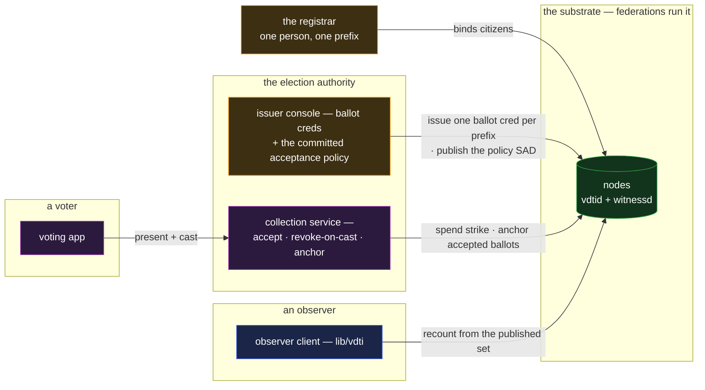

# vote — auditable elections

`vote` is the ballot with a paper trail and no paper: one person, one vote, every accepted ballot
anchored and auditable, the tally recomputable by anyone. It is a core reference app composing
**credentials, exchange, and the registrar** — and it is scoped deliberately: VDTI carries the
**auditable** ballot; the fully **secret** ballot (voter privacy with coercion resistance) is out of
scope, stated here first because everything else in this doc is read in its light.

## Deployment

The stack in one picture: the registrar's binding feeds the authority's issuance, the collection
service's every acceptance is a public anchor, and the observer needs nobody's honesty — only the
data.

## The composition

- **Eligibility is a registrar-backed credential.** The government's registrar binds each citizen to
  exactly one prefix ([`registrar.md`](registrar.md)); the election authority issues each bound
  prefix one ballot credential per election, claim-gated to the election's brackets — eligible,
  district, ballot form — so a polling check learns the district bracket, not the address
  ([`../features/credentials.md` §Claim-gating](../features/credentials.md#claim-gating)).
  One-person-one-prefix plus one-credential-per-prefix is the double-vote defense at issuance. The
  acceptance rule itself is **committed before the polls open**: the authority publishes its policy
  as a policy SAD — `crd(vdti/cred/v1/schemas/ballot, id(electionAuthority))` — so the recount
  checks every ballot against the declared expression, not a rule inferred after the fact
  ([`../primitives/policy/policy.md` §A policy is a SAD](../primitives/policy/policy.md#a-policy-is-a-sad)).
  Which registrars the authority honors is issuance-side diligence — checked when a ballot
  credential is granted, publishable the same way as the authority's own policy SAD over the
  registrar-issued binding — so that commitment is on the record before the polls too.
- **Casting is presentation plus a spent strike.** The voter presents the ballot credential —
  ownership proven live, audience-scoped to this election — and submits the marked ballot; the
  authority **revokes the credential on acceptance** (the single-use discipline —
  [`permit.md`](permit.md)'s prescription mechanic at civic stakes), so a second cast finds a spent
  credential and fails secure, at every collection point, from the data.
- **An accepted ballot is anchored.** The authority anchors each accepted ballot's commitment on its
  election chain — an append-only, witnessed record of exactly which ballots entered the tally, in
  which order, with the ballot content itself a SAD the commitment binds. After close, the authority
  publishes the ballot set; the anchors make omission and stuffing visible: a ballot without an
  anchor is not in the tally, an anchor without a published ballot is a hole anyone can point at.
- **The tally is a recomputation, not a pronouncement.** Anyone holding the published set — a party,
  an observer, a citizen — recounts and checks: every ballot anchored, every anchor's credential
  validly issued and spent exactly once, every issuance registrar-backed. Delivery of ballots and
  receipts rides sealed exchange ([`../features/exchange.md`](../features/exchange.md));
  verification rides the standing acceptance machinery, end to end
  ([`../features/credentials.md` §Accepting a presented credential](../features/credentials.md#accepting-a-presented-credential)).

## Scenarios

- **An observer audits.** Walks the election chain, recounts the published ballots, samples
  issuances back through the registrar's anchored trail. The audit needs the authority's data, not
  its honesty.
- **A double-cast attempt.** The second presentation fails the revocation walk — the same
  fail-secure read as every spent instrument, uniform across polling places without a live central
  roll.
- **A contested count.** The dispute collapses to data questions with data answers: is this ballot
  anchored, was this credential issued to a registrar-bound prefix, was it spent twice? What remains
  contestable — and does — is the roll itself, which is the registrar's residual, named below.

## What this validates

- **The reference apps stack.** `vote` consumes `registrar` as infrastructure the way both consume
  the features — the applications tier composes internally, which the catalogue promised and no
  earlier doc exercised.
- **Single-use instruments at adversarial stakes.** Issue-once, spend-once, verifiable-by-all is the
  credential lifecycle under the most motivated attacker in the set, carried by the standing
  revocation machinery with no election-specific cryptography invented.
- **Auditability as a composition property.** Every claim an election audit makes maps to a walk
  someone can run — the end-verifiability thesis at its most public.

## Limits

- **The ballot is auditable, not secret — the scope line, restated.** The authority links voter to
  ballot at acceptance; coercion resistance and receipt-freeness are cryptographic territory
  (mixnets, homomorphic tallies) deliberately outside this composition. Where secrecy is legally
  required, this design carries the eligibility and audit legs and defers the anonymization leg to
  machinery beyond the catalogue.
- **The roll is the registrar's residual.** One-person-one-prefix is attested by the registrar; a
  corrupted roll corrupts eligibility upstream of everything structural. The composition narrows
  election trust to exactly that institution — a smaller surface than trusting the count, the
  transmission, and the roll at once, but not zero, and said so.
- **Availability is operational.** An election's surge, its offline fallbacks, its deadline
  semantics are deployment engineering; the structure guarantees what was accepted is auditable, not
  that acceptance never queues.
