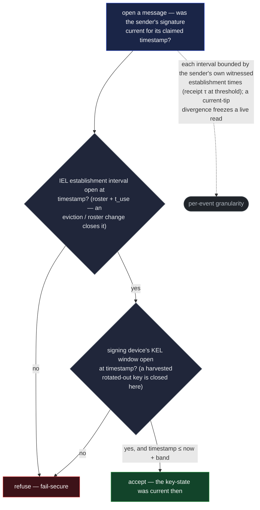
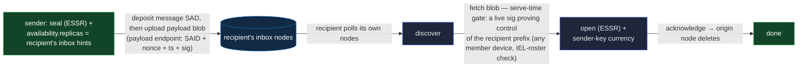

# Exchange — sealed store-and-forward messaging

**Exchange** is how parties send each other **authenticated, confidential** messages — one-to-one
and in groups — delivered when the recipient is offline. It is the feature `mail` and `chat` are
each a UI over. It composes the sealed-send primitives directly and adds **no new chain machinery**:
an identity publishes the keys others seal to, a sender seals and deposits a message, and the
recipient fetches and opens it, trusting the data alone.

Exchange is a **verification + discovery + transport** layer. Confidentiality and authenticity are
the [sealed envelope](../primitives/protocols/essr.md)'s; the integrity of a published key is the
chain's. What exchange adds is the parts the envelope leaves out — resolving a recipient to its
keys, checking the sender's key was valid when it signed, delivering the bytes, and carrying a
long-lived group conversation.

## What exchange composes

Everything below it already exists as a primitive:

- **[ESSR](../primitives/protocols/essr.md)** — the one-to-one sealed, authenticated envelope.
  Exchange calls it; sealing to more than one device is exchange calling ESSR once per key.
- **[The receive-key directory](../primitives/protocols/receive-key-directory.md)** — where an
  identity publishes the per-device keys others seal to it, and where a sender looks them up.
- **[group-key](../primitives/protocols/group-key.md)** — the ratcheting epoch key the session
  (chat) mode builds a conversation over.
- **[IPEX](../primitives/protocols/ipex.md)** — the credential issuance/presentation exchange, one
  consumer of exchange's transport.
- **The SAD store and mail** — a message is a [SAD](../primitives/data/sad/sad.md); its bytes live
  and move under [`availability`](../primitives/data/sad/availability.md) and the store's delivery
  path.

## Two modes over one spine

Both modes share the published receive keys, the sender-key-currency check, the crypto suite, and
mail.

- **One-offs (the async baseline).** A single sealed message per send — stateless, needing no live
  handshake because it seals to a static published key an offline recipient opens later. This is the
  default: mail, one-shot deliveries, and any time the recipient is offline.
- **Session (chat).** A long-lived (assume years), **ratcheting**, group-capable conversation for an
  ongoing exchange. It gains forward secrecy from the group-key ratchet, and only fits an ongoing
  chat.

This is not "secure versus weaker" — it is **async baseline versus the ongoing path**. The client
picks by usage: a one-off or an offline recipient takes the async path; an ongoing conversation
takes the session.

## Addressing and delivery — scoped to the recipient's own nodes

Exchange addresses by **identity**, not by key. A recipient publishes, in its receive-key directory,
both its per-device receive keys and a set of **inbox-node hints** — the storage nodes it reads its
mail from. A sender resolves those and, by default, **fans out**: it seals the message once to
**each** of the recipient's device keys, so the message opens on any of the recipient's devices. An
opaque `key_label` narrows a send to a **single** key instead, for a point-to-point delivery.

Delivery is **scoped to the recipient**, built from `availability` with no new mechanism:

- The sender sets the message SAD's
  [`availability.replicas`](../primitives/data/sad/availability.md) to the recipient's inbox-node
  hints, so the sealed content lives **only** on those nodes. The recipient polls **its own** nodes;
  nothing about who-is-messaging-whom is gossiped federation-wide.
- **Multiple hints replicate to all of them** — the recipient lists several nodes for redundancy,
  and a send deposits to each.
- **[`custody.readers`](../primitives/data/sad/custody.md)** on the message SAD MAY additionally
  gate who fetches _it_ — defense in depth, since ESSR already seals the payload. The ciphertext
  **blob** is a bare content-addressed object with no `custody`, so its bytes are gated by the
  serve-time request instead (the payload endpoint, below).

This is a deliberate choice over gossiping routing metadata to the whole federation: the
communication graph — who mails whom, when, how large — is exposed only to the recipient's chosen
home nodes, not to every node. (See [Residuals](#residuals).)

## The payload — named by digest, uploaded against the message

A message carries structured, signed fields (who, the key-state pin, the sealed envelope) as SAD
content, but its **bulk payload** — the ciphertext, and any file attachment — is not inlined. A
canonical SAD is JCS text, so inlining large bytes base64-encodes them; instead the message **names
the payload by digest** as a content-addressed blob (the general
[file payload](../primitives/data/sad/shapes.md#the-file-payload--vdtisadv1schemasfile) and the
[content-addressed blob](../primitives/data/sad/sad.md#bulk-opaque-bytes--the-content-addressed-blob)
rule). Because the message's SAID commits the digest, the sender's signature covers the exact bytes
by binding, and a recipient accepts the blob only when its recomputed digest matches. The message
also commits a `payloadSize`: the **digest alone is integrity-bearing** — a recomputed-digest
mismatch is the only tamper signal — while the **size is advisory**, a bound the recipient uses to
cap its allocation and refuse an over-large fetch before hashing, never treated as tamper-evidence.

The bytes are uploaded through the store's **payload endpoint**, authorized by the message itself —
**one round trip**, no store-issued challenge:

- The request carries the **message's SAID**, the blob, a client-chosen **nonce + timestamp**, and a
  signature over them. The store looks the message up, reads its committed payload digest, hashes
  the blob and requires a match, checks the timestamp is within the **clock tolerance band**
  (`CLOCK_TOLERANCE_BAND` — so an NTP-conforming client is never falsely rejected; the unseen-nonce
  cache, not a sub-band window, closes replay) and the nonce is unseen (a small, bounded replay
  cache), and verifies the signature **authorizes the requester to write for this message**: for an
  ESSR/mail message that is the **sender** named in the envelope, authenticating under its
  **current** key (an identity-level upload gate — not a second currency check; the message's own
  sender-key-currency check is `senderPin`-pinned and separate); for a sender-less **chat** message
  it is a **current group member** (the participant-blind `chat-membership` check, resolved one
  requester at a time). Then it stores the blob, scoped to the message's `availability`.
- On upload the signature **authenticates the uploader** (rate-limiting who may write), and replay
  protection stays light because the write is **content-addressed and idempotent** — a replay
  re-stores identical bytes and changes nothing.
- **Fetch is the mirror**, and there the nonce + freshness window is **load-bearing** rather than
  belt-and-suspenders: the bytes are served only to a live-signed requester — an ESSR/mail blob to
  one that proves it controls the **recipient prefix** (**any current member device** of the
  recipient IEL suffices — an **IEL-roster check**, **not** a `t_use` quorum, so polling stays a
  single-device act), a chat blob to a **current member** (the `chat-membership` check) — and a
  captured signed fetch request, if replayable, would be a bearer token for the sealed bytes. A bare
  content-addressed blob carries no `custody` of its own, so this request gate — not `readers` — is
  what gates the bytes; the concrete endpoints are the store service's to specify.
- The message is deposited **first** (the store needs its body to read the digest), then the payload
  is uploaded against it. A recipient that sees the message before the blob lands reads "payload
  pending" and retries; a digest that is referenced but never uploaded expires by the payload's TTL.

## Sender-key currency

Opening a message authenticates its sender, and that check is only sound if the signing key is read
against the **window it was actually valid for** — not blindly, and not with a rigid "is it the tip
right now," which would strand honest mail sent before a routine rotation.

- **On open, place the message in the sender's witnessed key-state timeline — on both axes.** The
  envelope names the sender's **IEL key-state position** (`senderPin`), and the message carries a
  send-time `timestamp`. The recipient reads the sender's **witnessed** chains against a
  **multi-source freshness bar** — read to the tip; a single-source or eclipsed read is **refused**,
  fail-secure — and confirms the signature was current on **both** axes at the claimed time: **(i)**
  `senderPin`'s **IEL establishment interval** was **open at that `timestamp`** — an eviction or
  roster change closes it, even though it never touches an evicted device's own KEL — and the
  signature meets that establishment's roster + `t_use`; **(ii)** each signing **device's KEL**
  key-window was **open at that same time** — a harvested rotated-out device key is closed here.
  Each interval is bounded by the **witnessed times** of the sender's own establishment events — its
  IEL _spine_ (the events that establish each key-state) and its devices' KEL rotations — where an
  event's **witnessed time** is the instant it became witnessed-in-full, the receipt τ that brought
  it to threshold ([witnessing](../substrate/federation/witnessing.md#an-events-witnessed-time)), a
  consensus value no byzantine minority can move. The message is accepted only if its `timestamp`
  falls in the interval its key-state was current for **and is not future-dated**
  (`timestamp ≤ now + the clock tolerance band`). A still-current key-state has an **open**
  interval, so a live message passes; an honest message sent before a later rotation still falls in
  its now-closed interval and is **accepted**, so a rotation never strands in-flight mail. Because
  each boundary is an event's **own** witnessed time — not the federation clock, which ticks only at
  federation governance events — it has **per-event granularity** at any rotation cadence, resolving
  the quantization a governance clock would impose. Witnessed times are **not** self-ordering, so
  the recipient **checks** the establishment times are in-bounds and non-decreasing along the chain
  and **reports** on its verification token — a structural violation bails (fail-secure), an
  in-bounds-but-out-of-order pair is reported **and the message whose interval that inversion makes
  untrustworthy is refused**, never a silent empty interval. A chain read the infrastructure already
  provides — **data-only**, leaning on no node's word.
- **A divergent sender chain freezes a _current_ read, like any live `t_use` consumer.** A message
  claiming the sender's **current (open) interval** is the sender exercising **live** `t_use`
  authority, which the fork-gate freezes on **any** divergence — **Forked or Disputed → refuse**
  (fail-secure), pending a T2 seal-out, exactly as IPEX and credentials freeze a live presentation.
  What still reads is **already-witnessed, closed-interval** history: it is **as-issued**, read at
  its historical anchoring position (single-tipped in the past), so a message sent **before** the
  divergence stays acceptable regardless of the current tip's state — on a **Disputed** sender too,
  whose spines share their history **below the last clean seal** (refusing its current claims is the
  live-authority freeze, not "no single answer"). For **chat**, the writer's own chains are read the
  same way.
- **What it bounds, and what it doesn't.** A **captured-then-rotated** key — a stolen old key
  signing under its since-abandoned key-state — can still be backdated **within** the now-closed
  interval it was valid for, but it is **stuck there**: that interval lies in the past, and a
  message claiming a current time is rejected (the key was not current then), so it can never
  produce a message that reads as **current** — a rotation recovers messaging going forward. This is
  the ordinary signing-key-compromise limit — bounded, not prevented — the same residual the group
  epoch accepts. A self-asserted `timestamp` only places the message _within_ its past interval; the
  interval boundaries, which the sender's own **witnessed establishment times** fix, are the trust
  anchor.
- **The send-time timestamp is a required mail-payload field, checked after decrypt.** ESSR carries
  **no cleartext timestamp** — a deliberate privacy call, keeping timing metadata off the envelope —
  so a mail message's send-time `timestamp` rides **inside the sealed payload** (the `mail-payload`
  inner shape — `{ topic, timestamp, body }`, see [Reserved names](#reserved-names)), and a
  conforming mail sender **must** include it. The window check is therefore **post-decrypt** (safe:
  the signature is verified first, and the recipient decrypts its own message), and a payload with
  **no** timestamp is **refused** — fail-secure, since accepting on the signature alone would
  silently void the currency check. (A chat message carries its `timestamp` as a SAD field.)
- **Optionally, anchor a message for an end-verifiable send-time.** For a high-value, non-repudiable
  message, the sender commits the message's **issuance commitment** — the blinded
  `hash('vdti/iel/v1/tags/commitment:{sender}:{message.said}')` every owner-anchored SAD uses, so
  the raw message SAID never appears on the public chain — on an `Ixn` at its current position. A
  stale key cannot forge it, and any verifier (not only the recipient) reads the anchor on the
  sender's witnessed chain and **recomputes the commitment from the message to match**, proving the
  message sat in a witnessed batch by a witness-asserted time, stronger than the window bound. It is
  a **per-message opt-in**; several messages sent at once share one `Ixn`, the way a batch of
  issuances does, so it need not cost a chain event apiece — which, like batch issuance, publishes
  on the sender's own chain that those messages were **co-sent in one batch** (a linkage a
  per-message anchor would not create, confined to the sender's own messages).

## Mail — the store-and-forward transport

A mail deposit stores the sealed message (and its payload blob) at the recipient's nodes and lets
the recipient find and fetch it:

- **Deposit** the message SAD + upload its payload (above), scoped to the recipient's inbox nodes →
  the recipient **discovers** it by polling its own nodes → **fetches** the blob through the
  **serve-time gate** — the store serves the bytes only to a requester that proves, with a live
  signature, that it controls the recipient prefix (any current member device — an IEL-roster check,
  not a `t_use` quorum); the seal already protects confidentiality, so the gate limits store-side
  harvesting, it does not add integrity → **opens** it (with sender-key currency) →
  **acknowledges**, and the origin node deletes the bytes.
- **Rate limits** bound abuse: per-sender-per-day, a per-recipient inbox cap, a per-node storage
  cap, a per-IP token bucket, a message TTL, and a short dedup window.
- **Replay** is closed by the stable SAID: a recipient dedups by the message's SAID (the short dedup
  window guards only the transport layer).

## The session mode — chat

Chat composes the [group-key](../primitives/protocols/group-key.md) primitive for its keying and
adds a message model over it. It is built entirely from SAD / SEL / IEL: members are IEL identities,
the group's epochs and roster are group-key's SELs, and messages are SADs. A **1:1 chat is the
degenerate group of two** — the same machinery, no separate two-party construction.

- **Messages are per-sender lanes.** Group messages form a DAG of per-writer lanes — each writing
  device's messages are its own `previous`-linked chain, merged into the group view, the way a
  shared document attributes each version to its writer. **The lane is the writer:** a receiver
  reads which lane a message sits on, derives that lane's per-writer subkey (group-key's
  nonce-safety discipline) to decrypt, and verifies the signature against that device's key.
  Mid-lane that is why **no sender field is carried** — it would only duplicate the lane. A lane
  **roots at a body-less join marker** the writing device mints (a distinct SAD, not a message — it
  names the writing **device's** prefix and carries no body); every message chains from it via
  `previous` and **inherits** the writer, so no message carries a writer field either.
  Confidentiality rides the subkey; **authenticity rides the writer's own signature over the
  message's fully-compacted SAID** — the system-wide rule that a signature is over the compacted
  SAID, so any faithful disclosure verifies against it — and the message is attributed to that
  device's **owning identity**, not merely the device. The epoch key proves only "a member"; the
  signature proves **which** member.
- **The lane is a single-parent [authored DAG](../primitives/protocols/authored-dag.md) — ordered
  and fork-evident.** Along a lane the ordering key `(epoch, timestamp)` is **non-decreasing**: a
  message may not sit in an earlier epoch than the message it follows, nor carry an earlier
  timestamp, so a tip-append cannot be backdated (a stamp earlier than the tip's is malformed,
  rejected on the same footing as a broken signature). Because each message has exactly one
  `previous`, a **second child of any message is a fork = equivocation** — the writer signed two
  conflicting successors to one point in its own lane. A second **root**, by contrast, is not a fork
  — two roots share no parent — so a writing **device's** single lane is enforced by its
  **grant-anchored root** (a body-less join marker the device mints, registered by a
  `chat-membership` grant-chain act), not by single-parenthood: an unanchored root is rejected. Each
  message's **public SAID** commits its (encrypted) content — a high-entropy `nonce` keeps that SAID
  unguessable, so a guessable body can't be confirmed against it — so a writer that ciphers two
  different payloads produces two provably-same-writer SAIDs sharing one `previous`: an **undeniable
  same-writer fork** (a crash-**resend** re-sends the same SAID — a dedup; only a crash before
  persisting its record, re-authored with a fresh nonce, is a genuine honest sibling — the policy,
  not the structure, calls it misbehavior). Surfacing it needs the sibling SAIDs to reach a common
  honest member — the normal propagation case; an eclipse or split delivery only **defers**
  detection (the standard _detection-is-eventual_ residual, reported when the siblings converge), it
  cannot disguise a fork as one message. The group couples the consequence to `chat-membership`
  removal + the epoch turn.
- **Currency: the signature is checked against the writer's own key-window; the epoch bounds when.**
  Chat's authenticity uses the **same key-window mail does** — the signature verifies against the
  writer's signing key-state, valid per the **writer's own witnessed KEL/IEL** interval, each
  boundary the **witnessed time** of the writer's own establishment event (the receipt-threshold
  crossing τ, exactly as for mail — see [Sender-key currency](#sender-key-currency)). The **epoch is
  a separate axis** — the _encryption_ key — and it does two things, neither of them the auth check:
  a message decrypts only under epoch _N_'s subkey (so you must hold that epoch key to produce a
  readable message), and epoch _N_ is a witnessed SEL event whose **window — bounded the same way,
  by the witnessed times of epoch _N_'s and _N+1_'s SEL events** — **bounds when** the message was
  authored. The chat message carries **no key-state pin** and needs none, because the **witnessed
  epoch anchors the time**: the verifier resolves the writer's key-state among those valid **within
  epoch _N_'s window** and checks the signature, so the self-asserted `timestamp` only selects
  _within_ that witnessed bound, never outside it (a future-dated stamp beyond a **closed** epoch's
  window reads outside it and is refused — so a closed epoch needs no separate
  `timestamp ≤ now + band` bound like mail's). So the check composes two witnessed sources: the
  **IEL** says whether the signing key was valid, the **epoch SEL** says the message was authored
  within epoch _N_'s window — authentic iff the key was valid (per its IEL interval) at a time
  inside that window. The **open (current)** epoch is the one gap: it has no upper boundary yet, so
  a message future-dated within it is not refused until the next epoch's witnessed time lands below
  its stamp — its validity is then non-monotone (accepted while the epoch is open, retroactively
  outside the window once it closes). This is an accepted, **self-harming** residual: monotonicity
  forces the writer's own later messages past the inflated stamp or forks its lane, and other lanes
  are unaffected; a deployment wanting monotone open-epoch validity adds mail's future-side
  `timestamp ≤ now + band` bound. Backdating decomposes into cases the model closes and one it
  accounts for. A **current** member backdating **below its advanced tip** must **fork** its own
  lane (a `(epoch, timestamp)` decrease is malformed, so the only attach is a second child of an
  earlier node) — an undeniable self-signed equivocation any reader surfaces on convergence
  (monotonicity, above). On a live lane the DAG **detects** the fork, but the group's policy decides
  which branch counts. A **removed** member is closed **structurally** at the **verifier**, because
  its removal left an on-chain fact: its `chat-membership` rescission recorded a **lane-tip
  `bound`** (its last message) on the **witnessed** grant chain, so the verifier honors exactly the
  `bound`'s **ancestor-chain** — `[anchored root … bound]` — and honors **no** node off it: a
  **frozen-tip forward-append** into a retired epoch (a descendant of the bound), a **fork below the
  bound** (a sibling of an on-chain node), and a **fresh parentless root** (unanchored — its
  admission grant anchored the one lane the verifier honors) all fall outside the interval. That is
  a **local interval check against the durable `bound`**, not fork detection — no propagation wait,
  no policy call. **The one accepted residual:** a **current**, non-removed member that went
  **dormant** can forward-append monotonically into an epoch it held but was silent for — no bound
  exists (it was never removed) and its key was valid, so this reads as legitimate late history; it
  is confined to its own lane and its own held epochs, the chat instance of the accepted
  backdate-within-a-held-window class (mail's captured-then-rotated residual), and the opt-in anchor
  strengthens it for parties that need better. The store's deposit gate is defense-in-depth; the
  anchor and bound are what make the cuts **verifier-enforced**, not store-only. A self-asserted
  timestamp never establishes currency; the two witnessed windows do.
- **Catch-up is the union of your membership periods.** A member decrypts exactly the epochs during
  which it was a member — membership can be intermittent, and it reads **every period it was in**,
  none it was not. **Each membership period is a disjoint anchored lane:** a re-added member's grant
  anchors a **new** lane root rather than continuing its old lane past the removal bound, so a
  reader sees its distinct stints, each bracketed `[root … bound]`. Catch-up after being offline is
  walking the key-epoch SEL from last-seen to current and unwrapping the epochs it was a member for;
  an epoch after a removal stays sealed to it (forward secrecy).
- **Store authorization is the `chat-membership` set — a per-requester membership check.** A chat
  message is sender-less, so the store cannot gate its upload or fetch on "the sender" the way mail
  does. Instead chat composes a [membership](../primitives/protocols/membership.md) instance —
  **`chat-membership`** — that the store checks **per-requester**: it resolves a live-signed request
  to an identity and confirms **that one** identity is a current member (the fail-secure walk by
  default, or the O(1) content-addressed rescission lookup under a latency budget), never
  materializing the set. This is a **different structure** from the group-key **wrap roster**: the
  wrap roster is materialized _by members_ (with the read gate) to key each epoch and is **blind to
  the store**, so the store cannot authorize against it — chat composes **both**, the roster to
  distribute the epoch key and `chat-membership` to authorize a requester, the way any keyed group
  does. The store check is per **identity** (any of a member's devices proves it, so all its devices
  read), while **writing** is per **device** — each writing device anchors its own lane on-demand. A
  **member removal rescinds the `chat-membership` grant** — recording a **`bound`** for each of the
  member's anchored device lanes (that device's last message) the verifier enforces — and turns the
  epoch to the survivors. The two structures cannot drift into a leaked key: an epoch's **wrap set
  is derived from both** — the wrap roster **minus every member `chat-membership` has rescinded**,
  as of the epoch's anchoring position ([group-key](../primitives/protocols/group-key.md)) — and the
  store reads a member as **removed the instant either structure records it**, so a partial or
  lagging state costs availability (or a brief window of fetching ciphertext it can no longer
  decrypt), never a key. So a removed member can no longer deposit or drain, nor backfill any lane
  past its bound, nor mint a **fresh lane** (a writing device's lane root is anchored by a
  grant-chain act, so a second parentless root is unanchored → rejected — see currency, above). A
  downloader enumerates nothing (the grant is participant-blind); the store, handed a
  self-identifying requester, only ever confirms that one — so a non-member can neither deposit a
  chat blob nor drain one, and learning that a requester who showed up holds a grant is the
  mechanism working, not a leak.
- **Delivery and retention are group-scoped.** A chat message's blob is one ciphertext readable by
  every member, scoped by `availability.replicas` to the **group's nodes** (the members' inbox
  hints, or a group-designated set) — the same recipient-scoping as mail, with the group as the
  "recipient." Unlike a mail deposit, which the recipient acks-and-deletes, a chat blob is
  **retained** across the catch-up window so a member offline for a while can still read the epochs
  it was in on return — bounded by the key-epoch log's checkpoint reinception (the point past which
  a cold reader need not walk).
- **Anchoring is opt-in.** A message is signed for authenticity by default and anchored only when
  the app or user flags it for non-repudiation (as above).

The ratchet itself — epochs advancing on a membership change or a time cadence, the forward-secrecy
and switchover discipline, the bounded gated/blinded roster — is the group-key primitive's; chat
only observes the current epoch and adds the per-lane volume and the per-message signatures.

## Consumers

- **[IPEX](../primitives/protocols/ipex.md) credential exchange.** The apply / offer / agree / grant
  / admit / spurn thread (topic `vdti/exchange/v1/topics/exchange`) negotiates issuance and
  presentation. IPEX carries cleartext-structured SADs; a disclosure that must be private **rides
  ESSR**, sealed at the edge — exchange wires that in, but the message set and the acceptance gate
  are IPEX's.
- **[Shared-documents](shared-documents.md) off-node content.** A private document's content is
  delivered member-to-member as ESSR payloads — each recipient gets the content, or a
  group-key-wrapped symmetric key, sealed to its receive key.

## Reserved names

Concept `exchange`, on the `vdti/{component}/v1/{category}/{name}` convention
([`../primitives/data/sad/kinds.md`](../primitives/data/sad/kinds.md)):

- **Message topic** — a payload discriminator inside the ciphertext, **not** a SEL inception field:
  `vdti/exchange/v1/topics/exchange`.
- **Chat message SAD**: `vdti/exchange/v1/schemas/message` — sender-signed, timestamped,
  epoch-window currency. This is the one message shape exchange owns: the issuance/presentation
  messages (`apply` / `offer` / …) are IPEX's, and the one-off async message is the ESSR message.
- **Chat-membership SEL** — the store-authorization
  [membership](../primitives/protocols/membership.md) instance: SEL topic
  `vdti/exchange/v1/topics/chat-membership` (the grant chain the store checks per-requester) and its
  grant value `vdti/sel/v1/grants/chat-membership` (the `{ grants, rescinds }` delta grant-doc;
  exact field layout forthcoming). Reading is gated per **identity** (any of a member's devices);
  only a **writing device** anchors a lane — a `grants` (or later grant-chain) entry anchors that
  device's **body-less lane-root marker**, and a `rescinds` entry records each anchored device
  lane's **`bound`** (its lane tip, on the rescission `Trm`'s `bound` role), together bracketing
  each writing device's honored lane `[root … bound]`; a removal also turns the epoch for forward
  secrecy. The removal lookup's SEL topic is `vdti/exchange/v1/topics/rescission` — the chat
  counterpart of the documents feature's rescission topic.
- **Mail-payload inner shape**: `vdti/exchange/v1/schemas/mail-payload` — the ESSR inner payload a
  mail message seals: `{ topic, timestamp, body }`, where `topic` is the message topic above,
  `timestamp` is the **required** send-time field (checked post-decrypt, refuse-on-absent), and
  `body` is the content (a message, or a carried SAD such as an IPEX message rides). This gives the
  fail-secure "no timestamp → refuse" rule a defined conforming form; exact field layout
  forthcoming.

The receive-key grants and directory topic, the ESSR envelope and its KDF context, and the group-key
epoch/roster/KDF names belong to those primitives; exchange defines none of them.

## Residuals

- **The communication graph is visible to the recipient's home nodes.** Recipient-scoped delivery
  limits the exposure to the storage nodes a recipient chose — far tighter than gossiping the graph
  to the whole federation, but those nodes still see who mails their user, when, and how large. The
  scoping is **sender-cooperative**: an honest sender sets `availability.replicas` to the
  recipient's inbox hints, but a sender bent on leaking could deposit elsewhere — so the bound
  tightens the recipient's own reads, it does not gag a determined sender. And the inbox-node hints
  are themselves **targeting metadata** — publishing "this identity's mail lives on these nodes"
  tells an observer where to look, the cost of resolving a recipient without a federation-wide
  gossip. Mixing and cover traffic are out of scope.
- **Signing-key compromise is bounded, and a rotation recovers messaging going forward.** A stolen
  key reaches only what its key-state authorizes, and the sender-key-currency window means a
  captured-then-rotated key can only produce messages that read as **stale** — backdated into the
  window that key was valid for, never as **current** — so a rotation recovers messaging forward. It
  does not un-forge messages a live stolen key could have sent inside its own window; that is the
  ordinary signing-key-compromise limit, the same residual the group epoch and the federation clock
  accept.
- **Inbox spam is bounded, not eliminated.** The rate limits (per-sender, per-inbox, per-node,
  per-IP, TTL, dedup) bound how much unwanted mail a recipient's nodes absorb, but an open inbox
  still accepts a deposit from anyone. Under an operator **lockdown**, the storage boundary MAY
  additionally gate deposits on a **credential or policy** write-gate (the `custody` write-gate), at
  the cost of open reachability.
- **The receive key's swap and rescind attacks are tier-2.** Both changing an identity's published
  receive key and rescinding it require a `t_authorize` act, not a signing key — the primitive's
  concern; see [the directory](../primitives/protocols/receive-key-directory.md).
- **Eclipse on a key lookup or a sender-chain read** is bounded by the multi-source freshness bar
  (fail-secure): the bar **shrinks the detection window, it does not close it** — a consumer
  eclipsed to a malicious subset sees the truth after the heal, so a decision made inside the window
  can transiently trust a stale read, and a high-value open re-verifies before acting.
- **A chat message's authenticity is one device's signature, not a `t_use` quorum.** Mail
  authenticates with the sender's `t_use` quorum; a chat message authenticates with a **single**
  writing device's signature, attributed to its owning identity. So one compromised member device
  can author chat history in that identity's name — bounded by the device's KEL window, its epoch
  membership, and its own lane. A strictly lower bar than mail's quorum, deliberate (a per-message
  quorum is impractical for a high-volume conversation).
- **Chat's home nodes see the writer set.** A lane-root marker carries the writing device's KEL
  prefix in **cleartext** (the receiver needs it to pick the per-writer subkey), so the group's
  storage nodes passively learn who has written and when — the chat instance of the
  communication-graph-at-home-nodes residual above, beyond the confirm-one-requester framing of the
  participant-blind store check.
