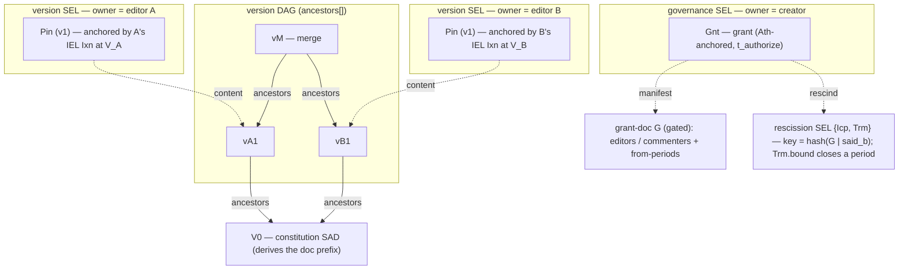

# Multi-party documents

_Forthcoming._ The full multi-party-documents feature lands here — a document several parties
co-author, whose membership and sharing evolve under a creator, fully end-verifiable. It composes
the SAD + SEL primitives with the document layer
([`../../primitives/policy/documents.md`](../../primitives/policy/documents.md)); credentials are
the contrast (issuer/issuee, fixed membership). This stub carries the structure diagram ahead of the
prose.

## The construct

A multi-party document is a DAG of **attributed version SADs** under a **creator-governed,
per-period access list**. **V0** (the constitution) derives the doc prefix. The creator governs
membership on a **governance SEL**: a `Gnt` (tier 2, `Ath`-anchored, `t_authorize`) names a gated
**grant-doc `G`** listing `editors` / `commenters` and their `from` validity-period starts; a
per-period **rescission** (`{Icp, Trm}`, keyed `hash(G | said_b)`) closes a period at a `bound`.
Each editor authors versions on its **own version SEL** — a custody-attributed SAD, `{Icp, Pin}`
whose `Pin` (v1) is anchored by that editor's IEL `Ixn` at position `V_x`; versions chain via
`ancestors[]` into a multi-parent DAG rooted at V0. A version by X at `V_x` is **honored iff** its
grant names a period `[F_x, B_x]` with `F_x ≤ V_x ≤ B_x` — an intra-chain, append-only, clock-free
membership test.

