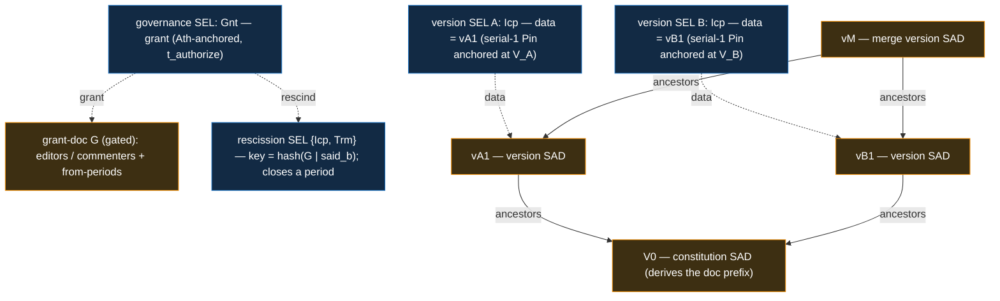

# Multi-party documents

_Forthcoming._ The full multi-party-documents feature lands here — a document several parties
co-author, whose membership and sharing evolve under a creator, fully end-verifiable. It composes
the SAD + SEL primitives with the document layer
([`../../primitives/policy/documents.md`](../../primitives/policy/documents.md)); credentials are
the contrast (issuer/issuee, fixed membership). This stub carries the structure diagram ahead of the
prose.

## The construct

A multi-party document is a DAG of **attributed version SADs** under a **creator-governed,
per-period access list**. **V0** (the constitution) derives the doc prefix. The creator governs
membership on a **governance SEL**: a `Gnt` (tier 2, `Ath`-anchored, `t_authorize`) names a gated
**grant-doc `G`** listing `editors` / `commenters` and their `from` validity-period starts; a
per-period **rescission** (`{Icp, Trm}`, keyed `hash(G | said_b)` — `said_b` the nonce'd grant-entry
SAID) closes a period. Its `bound` rides **gated content**, not a public `manifest.bound` (a bound
SAID is participant-identifying by matching). Each **version** is a custody-attributed SAD on its
**own version SEL** (`{Icp, Pin}`, `derive(owner, DOC_TOPIC, version_said)`): the `Icp`'s `data`
names the version SAD, and its serial-1 `Pin` (v1) is anchored by the author's IEL `Ixn` at position
`V_x`. Versions chain via `ancestors[]` into a multi-parent DAG rooted at V0. A version by X at
`V_x` is **honored iff** its grant names a period `[F_x, B_x]` with `F_x ≤ V_x ≤ B_x` — an
intra-chain, append-only, clock-free membership test.

Nodes are colour-coded (SEL blue, referenced SADs / grant-doc orange). Dotted arrows are manifest
references (`grant`, `data`) and the governance→rescission relation; solid arrows are the
`ancestors[]` version DAG. Each version SEL is `{Icp, Pin}` — its `Icp`'s `data` names the version
SAD, the serial-1 `Pin` floors it to the author's IEL tip.
