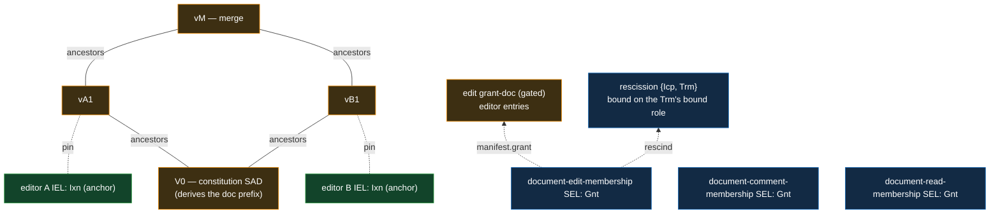
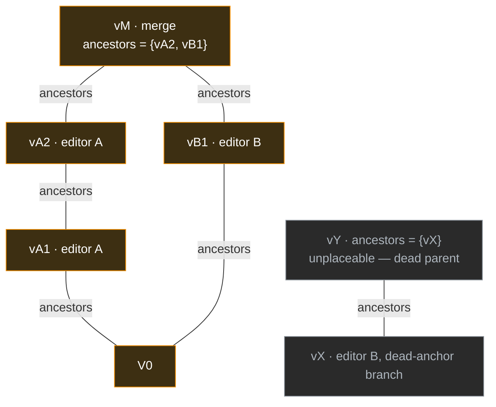
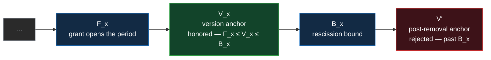
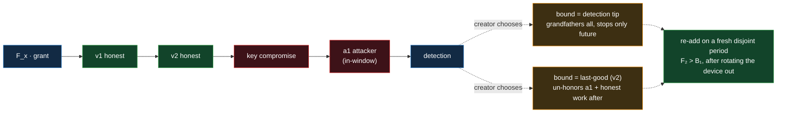
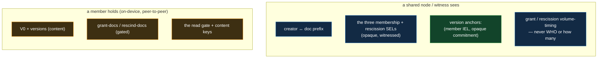

# Shared documents

A **shared document** is content several parties co-author — a spreadsheet, a design doc, a shared
ledger — whose **membership and sharing evolve under a creator**, fully end-verifiable. The
shared-documents feature is how VDTI builds one: a growing graph of attributed versions, governed by
a creator who admits and removes participants over time, with every version's authorship and every
membership change independently checkable from the data alone.

It composes the primitives below it and adds **no new chain machinery**. Three carry the weight:
**[membership](../primitives/protocols/membership.md)** gates who may participate,
**[authored-dag](../primitives/protocols/authored-dag.md)** structures the versions, and — for a
confidential document — **[group-key](../primitives/protocols/group-key.md)** distributes the
content key. A version is a piece of content, authored by anchoring it; a membership change is a
grant or a rescission on the creator's chain.

**Credentials is the contrast.** A [credential](credentials.md) is asymmetric and fixed — one issuer
makes a claim about one subject, frozen at issuance. A shared document has **governed, symmetric
members** — a creator maintains an evolving set of co-equal participants, and the content itself
evolves. The two specialize the same substrate (attributed SADs, membership sets) in opposite
directions and are not merged: a co-author is not an issuer.

## The construct

A shared document is a **DAG of attributed version SADs** under a **creator-governed, evolving
access model**. Its genesis is a **constitution** (V0) that derives the document's identity; from
there, editors author versions that branch and merge, while the creator admits, removes, and
re-admits participants over time.

The creator governs **three roles** — the collaboration triad:

- **view** — who may read the document (the read gate),
- **comment** — who may attach comments (reserved; the mechanism is deferred),
- **edit** — who may author versions.

Each role is its own **membership set** the creator maintains, evolving independently —
`document-edit-membership`, `document-comment-membership`, and `document-read-membership`, in an
implied hierarchy (edit ⊃ comment ⊃ read). Everything else is a verification layer over the
primitives: verify each version as a primitive attributed SAD, then check it against the membership
window and its place in the DAG.



The version DAG (orange) builds up from the V0 constitution; each version's custody `pin` (dotted)
locates its editor-IEL anchor (green). The creator maintains **three** membership grant chains
(blue) — one per role (`document-edit-membership` / `document-comment-membership` /
`document-read-membership`), each a plain membership instance sealing a gated grant-doc and
rescinding through a `{Icp, Trm}` lookup; the **edit** chain's grants open the editor brackets the
honored predicate checks. (Colour legend throughout: SEL blue, versions / gated docs orange, IEL
green.)

## The constitution — V0

V0 is the document's genesis SAD — the root of the version DAG and the source of the document's
identity. Like a chain inception, V0 **derives a `prefix`** (its two-hash content digest), and that
prefix **is** the document: everything references it, and — because a prefix and a SAID are derived
apart — event SAIDs never correlate to it, so an onlooker cannot group a private document's activity
by its prefix.

V0 carries:

- **`creator`** — the creator's identity prefix, which governs membership and sharing. The creator
  may be a multi-device or threshold identity; co-equal separate-identity admins (a governance
  threshold over distinct identities) are a deliberate extension, not this feature.
- **the reserved topics** — a holder derives the governance chains from the document prefix (below).
- **`readers`** — the initial read gate (`None` = public).
- **`nonce`** — high-entropy, so the prefix (hence every governance and version chain) is
  unguessable for a **private** document; a public document may omit it.

V0 is **anonymous-write** — the shared constitution carries no `owner`, so its legitimacy is social,
established out of band. A competing V0′ is always mintable; nothing structural privileges one
genesis over another. That is deliberate — it is what makes whole-document recovery possible
(below).

## Membership — who may participate

Participation is a **[membership](../primitives/protocols/membership.md) set the creator maintains**
— the unbounded, per-requester, checked-one-at-a-time primitive — in **three instances, one per
role**:

- **`document-edit-membership`** — editors,
- **`document-comment-membership`** — commenters,
- **`document-read-membership`** — readers.

Each is a **plain membership instance** with the same shape — its own grant chain, no bespoke
coupling — and the roles form an **implied hierarchy, edit ⊃ comment ⊃ read**: an editor may comment
and read, a commenter may read, a reader is the base. A member's **capability is the most powerful
role it holds** (the union of the implied hierarchies): may-author = an open **editor** membership,
may-comment = editor ∪ commenter, may-read = editor ∪ commenter ∪ reader. There is **no
exclusivity** — a member may hold any combination, and a redundant membership resolves to the max
(harmless). Each group is checked **independently**, so no check ever links a member across the
three chains, and the closed-membership-graph privacy stays strict.

Each instance is a **grant chain** the creator owns, sealing `{ grants, rescinds }` deltas — the
membership primitive's own model, uniform across all three:

- A **grant** admits a member — a **blinded commitment** (`{ said, nonce, data }`, the claim
  construction the membership primitive reuses) — and **opens the member's bracket** in that group:
  a **validity period** on the member's own IEL, `from` = the member's IEL position at grant time.
- A **rescission** **closes the bracket** and records a **grandfather `bound`** — the period's
  closing position on the member's IEL. For an editor the bound grandfathers the versions before it;
  for a commenter or reader (who author no versions) it simply closes the bracket.

A member is **active** in a group iff it has an **open** (granted-not-rescinded) bracket at the
chain's tip — the fail-secure member walk reads exactly that, and the open **editor** bracket _is_
the honored predicate's `[F_x … B_x]` period (below).

Membership is **not delegation** — an editor acts as _itself_, never with the creator's authority.
The grant only says _who may do what_; the editor's own signature is what authors a version.

**Checked one identity at a time**, exactly as the membership primitive prescribes: the fail-secure
walk (default — walk the group's grant chain for the member's open bracket) or the O(1)
content-addressed `{ Icp, Trm }` rescission lookup (opt-out). Because the rescission is **keyed per
period** — on `hash(G : said_b)`, the grant-doc's SAID joined with the member's nonce'd entry SAID,
never the member's prefix — the key is **participant-blind and grant-blind**, and a removed member
can be **re-added** on a fresh grant (a new bracket, a new key).

**A grant is a tier-2, reserve-backed act** (`Gnt ← Ath`, `t_authorize`): minting one reveals a
rotation preimage, so a compromised creator _signing key_ alone cannot admit a rogue or remove an
honest member. Everyday version-authoring stays the cheap `t_use` signing key. Removal is the
polarity-inverse (`Trm ← Dth`, also `t_authorize`) — cost-symmetric with the grant; the asymmetry is
**finality** (a grant is additive and walkable-forward, a rescission a monotone terminal kill), not
threshold.

**Unbounded, one cap.** The set is never materialized — a version's check reads its own grant plus
at most one rescission, never a live roster (knowing the live count would require resolving every
rescission, defeating the O(1) model). The single amplification bound is
**`MAXIMUM_GRANT_ADDS = 64`** — a grant event's add-list totals at most that many entries, enforced
as the verifier accumulates the event's adds and bails the instant it breaches. The grant-chain
length and per-member period count are the creator's own cost, cost-symmetric.

**Member names live in gated content, never public structure.** A chain's structural fields are
witnessed, hence public, so a member prefix in one would leak. Every member reference is therefore a
**read-gated content SAD named by an opaque SAID** carried in the event's manifest; the public chain
shows only grant / rescission **event** volume-timing, never who or how many members an event names.

**Freeze is hard and structural** — two jobs at once: the creator **bounds every member** across all
three chains (closes every open bracket, so no new version is honored — the version-stopper) **and**
terminates the three grant chains (a `Trm ← Rev`, `t_govern` — revoking its own chains), blocking
re-grant. Bounding alone stops new versions; terminating alone leaves open brackets open. A grant
chain carries **no `lineage`** (it is monotone, so a terminated chain cannot be re-incepted at a
fresh lineage), which is what makes the freeze **permanent** — unfreeze is not a chain re-incept but
a fresh V0′.

**Crediting is claimed-versus-consent.** A grant _names_ a participant, but credit accrues only to
one with at least one **honored** version — a malicious creator can grant a non-consenting party but
cannot manufacture that party's `t_use`-signed versions. Being _named_ is an unmitigable social
grief; the rule gates crediting, not naming.

## Versions — the authored DAG

The versions are an **[authored DAG](../primitives/protocols/authored-dag.md), multi-parent
variant.** Each version is a primitive **custody-attributed SAD**, **directly anchored** on the
author's IEL exactly like any bare SAD — its `custody { owner, pin, readers }` names the editor and
locates the anchoring event. Authorship is therefore **provable and non-repudiable**: only the
editor's own `t_use` produces the anchor, so anchoring proves _authorship_, not mere endorsement.

- **Attribution is the branch, not a field.** As the authored DAG prescribes, a version carries no
  author field; the editor is named where a branch roots (a version's custody `owner`) and every
  descendant inherits through the link.
- **`ancestors` is the multi-parent DAG.** A version names its parent version(s); branching is
  **legitimate by design** — two editors working from the same version produce concurrent branches,
  and a later version **merges** them by naming both as ancestors. Acyclic by SAID (a cycle would be
  a hash-preimage cycle).
- **Version order is monotone — trivially.** The authored-DAG ordering key for a document is the
  DAG's own version order, an order defined _by_ the ancestry it would constrain, so monotonicity
  holds by construction and does no independent work here (unlike a chat lane's
  `(epoch, timestamp)`, a genuine external key). The doc variant's backdate defense is the **anchor
  position** — the honored predicate below — not this rule.
- **Forks are presented, never picked.** A version fork (two versions naming the same parent) is the
  branching the feature exists to support; the document state is the set of **tips**. Convergence is
  a merge; a **canonical** choice is a _tag_ — itself an edit, and tags can conflict, so the
  application arbitrates. (This is the multi-parent contrast with a chat lane, where a second child
  is equivocation.)

**Anchoring gives position without a per-version log.** The editor authors an `Ixn` whose manifest
anchors the version's issuance commitment
`hash('vdti/iel/v1/actions/commitment:{owner}:{version_said}')`, and the version's custody `pin`
locates that `Ixn` — call its position `V_x`, the version's **as-of**. There is no per-version SEL:
the direct anchor carries both attribution and position at cheap `t_use` cost, and the commitment
blinds `version_said` on the public IEL.

The version SAD carries a high-entropy **`nonce`** (so `version_said` is unguessable for a private
document), the **document prefix** (scoping and governance lookup, direct — no walk to the DAG
root), the **authorizing grant** — `said(G)`, the SAID of the edit grant-doc whose editor entry
(matched by the member's prefix) names the period this version claims; the reader already holds the
`owner`, so it reveals nothing new, and it lets the check name a specific **editor** bracket —
**`ancestors`**, the **content**, and an advisory **`edited`** timestamp (a feature value on the
SAD, never on the chain).

**Placement — a version's ancestors must be live.** A version places against the **live parents in
the built version set** (the versions the verifier holds), by O(1) set-membership, never a recursive
ancestor walk; a dangling parent is fetched under a bounded backoff, then flagged. `ancestors` is
SAID-committed, so re-parenting is **re-authoring** on a live version. A version whose IEL anchor
resolves onto a **dead** (non-canonical) branch of its editor's identity **un-attributes** — its
anchor is unreachable on the canonical walk, so it reads unauthored. Deadness propagates by
placement rather than by a DAG edge: a dead parent is not in the built set, so its descendants are
**unplaceable**, and on a merge **any** dead parent drops the child — the editor re-authors from a
live version.



Two editors branch from V0 and a later version **merges** the tips (`ancestors` names both). The
document state is the set of **tips** (here `vM`). A version anchored on a **dead** (non-canonical)
branch of its editor's identity un-attributes, and its descendants are **unplaceable** (grey) — the
editor re-authors from a live version.

## The honored predicate

The load-bearing check. A version by editor X at position `V_x` is **honored iff** its pinned
**edit** grant names a period with `from = F_x` and — letting `B_x` be that period's rescission
bound, or open — **`F_x ≤ V_x ≤ B_x`**. `F_x`, `V_x`, and `B_x` are **all positions on X's own
IEL**, so the test is **intra-chain, append-only, and clock-free** — no wall-clock, no self-asserted
position.



All three positions sit on editor X's **own** append-only IEL — no clock. A version is honored iff
its anchor `V_x` falls in `[F_x … B_x]` (blue = the creator's dial). X can only append **forward**,
so a post-removal version lands past `B_x` and is rejected (red); and X cannot make an old,
immutable event anchor a new version.

This predicate **is the edit-membership window check** — the `document-edit-membership` grant's open
period (X's open **editor** bracket), evaluated on the editor's own chain; a claimed comment- or
read-grant authorizes no version. It composes with DAG placement: a version counts only if it is
**both** honored (in an editor period) **and** placeable (live ancestors).

**Backdate is closed both ways.** X can only append **forward** on its own IEL, so a version
authored after removal sits **past** `B_x`; and X **cannot** make an old, immutable IEL event anchor
a new version. A removed or compromised editor therefore cannot backdate into a period it no longer
holds.

- **Endpoints are the creator's dial — within the append-only floor.** `F_x` and `B_x` are
  creator-chosen referents into X's chain, the membership authority's lever. But no honorable
  version can predate its own grant: a version commits `said(G)`, and its anchor commitment embeds
  the version SAID, so by hash-preimage order the anchor position is always **at or past X's tip
  when `G` was minted**. The effective floor is therefore `max(F_x, X's tip at G's mint)` — a `F_x`
  set below it admits nothing (fail-secure), so `F_x` does **disjointness bookkeeping**, not
  backdate defense (which rests on X's append-only chain). A garbage `F_x` matches no version.
- **Open-by-absence reads fail-secure.** `B_x` absent → open is answered like any membership
  rescission: the removal is a `kills[]` declaration on the creator's **witnessed** IEL plus a
  `{ Icp, Trm }` lookup, with
  `target = hash('vdti/sel/v1/actions/rescission:{creator}:{hash(G : said_b)}')` — the primitive's
  derivation **tag** (never a feature topic), colon-joined canonical bytes. Honoring an open-period
  version **walks the creator's fresh IEL and forward-matches the target** — a stale or withheld
  view cannot hide a closure, because a hidden rescission needs a stale chain, which the
  multi-source freshness bar already refuses. The walk's lower bound is the grant's own anchor
  position (a `Dth` before the grant existed cannot close it). The bound `B_x` itself is **gated**
  (participant-identifying by matching): `kills[]` carries only the blind target, and the verifier
  fetches `B_x` from the rescission `Trm`'s gated `bound` role — withheld reads conservative (don't
  honor). Once `B_x` exists it is set-once and sealed, so **closed periods are
  freshness-insensitive**.
- **Periods for a member must be disjoint per group** — enforced at document validation, not the
  per-version walk. The creator _may_ author a retroactive or overlapping grant (a structurally
  valid event the walk does not reject), but a document whose member's periods **overlap** on that
  member's IEL is **invalid**: the creator can author it, they just break the document. This is the
  heavier pass — it opens **every** grant on the chain (any one might name the member), O(chain)
  with a gated fetch per grant, unlike the per-version check's own-grant-plus-one-rescission; the
  witnessed chain makes it enforceable (every `Gnt` is a public structural event, so a verifier
  knows exactly how many grants to open, and a **withheld** grant-doc reads conservative — can't
  establish disjointness, so don't honor). Re-add stays valid because its periods are disjoint
  (`F₂ > B₁` — rescind, then re-grant). The posture is end-verifiability, not pristine data: don't
  prevent the authoring, catch the broken state deterministically at validation.

## Trust posture

- **External parties** cannot inject or alter versions (owner-rooting plus the honored window) or
  brick the document — a junk flood denies only the flooder's own placement (its versions fail to
  place, nothing else moves).
- **An editor's signing-key compromise is bounded and recoverable, and the bound is the operator's
  dial.** The attacker authors valid versions **as that editor** within its open period; they linger
  (durable, route-around-able). Recovery: the creator **rescinds the compromised period**, and
  **where the bound cuts is the creator's choice** — `bound = detection tip` grandfathers all
  honored work (stopping only future versions), `bound = last-good event` un-honors the malicious
  window at the cost of any honest same-window versions. That trade — honest collateral versus
  malicious survival — **is** the recovery decision. The creator then **re-adds** the editor on a
  fresh disjoint period once it has rotated the bad device out of its own IEL. Bounded, recoverable,
  no whole-document reincept.
- **An editor's IEL divergence reads suspect until it resolves.** While the editor's own identity is
  diverged, a version anchored **above its unresolved seal** reads suspect (the seal-boundary rule)
  — a benign two-device race is a recoverable content fork, not a compromise, and the data cannot
  tell intent. Once the IEL resolves, a version whose anchor sits on the **dead** branch
  un-attributes (§Versions); one on the surviving branch stands.
- **Creator-side divergence is the symmetric leg.** During the creator IEL's own divergence the
  document reads suspect by the seal-boundary rule. Because grants and rescissions are **tier-2,
  sealed on arrival, non-buriable**, a rogue grant below a post-compromise tip cannot be silently
  buried — it forces **reincept**. Walking a grant back is **rescind-forward** (a `Dth`), never an
  in-chain undo; the remaining asymmetry is finality-shaped, not threshold.
- **Creator (governance) compromise, or a rogue creator, is whole-document.** A compromised creator
  can grant rogues, rescind honest members, or freeze — the governance locus is captured. Honest
  parties **abandon and reincept a fresh V0′** seeded from the last good version; the old DAG stays
  verifiable. Successor-authority is **out of band** — nothing structural links V0′ to V0 (a
  competing V0″ is always mintable; legitimacy is social). Only the creator's compromise is
  whole-document; an editor's is editor-local.



Recovery from an editor key-compromise: the creator rescinds and chooses where the `bound` cuts —
the honest-collateral-versus-malicious-survival trade — then re-adds the editor on a fresh disjoint
period once the bad device is rotated out. No whole-document reincept.

## Sharing, custody, and privacy

- **The read gate is the union of the three membership sets — a feature check, not the one-set
  custody gate.** `readers` on a doc SAD is `None` = **public** or set = **gated**; but _who may
  read_ is not a single `readers` set — it is **an open bracket in any of `document-edit-membership`
  ∪ `document-comment-membership` ∪ `document-read-membership`** (the implied hierarchy — every
  participant reads; a pure `reader` grant adds someone who only reads). The doc verifier holds the
  three chains (derived from the doc prefix) and evaluates the union; an author trivially reads what
  it authored (it holds its own plaintext). A read-gate change is a `document-read-membership`
  grant, the same tier-2 machinery as an edit grant, rescinded participant-blind exactly the same
  way.
- **The read gate is read-set integrity, not confidentiality.** A co-author can always read and
  exfiltrate; the rule keeps the **canonical DAG's read-set uniform**, it does not hide bytes. For
  confidentiality, **encrypt** (the group-key primitive, below). A version declares the gate it was
  authored under; a read-invariance mismatch is **presented but flagged, application-arbitrated**,
  never a structural un-honor — a wrong-gate version is still a validly authored version.
- **Attribution is opt-in-visible.** A version carries `owner` (provable authorship) behind the read
  gate, so authorship is exposed only to authorized readers. Revealing authorship is the deliberate
  cost of _proving_ it; the private default hides it behind `readers`.
- **Every gated content SAD needs its own `readers` gate and its own high-entropy `nonce`.** A
  parent's read gate does **not** transitively protect its referenced sub-SADs, so each gated doc —
  a grant entry, a rescind-doc, a private version — carries its own gate (else it is publicly
  fetchable by SAID) **and** its own nonce (else its SAID is an **offline confirmation oracle**:
  compose candidate content, hash, compare the committed SAID — a member prefix plus a known grant
  is candidate-composable). A SAD is oracle-safe when its content is **uncomposable** — it carries
  its own `nonce`, **or** it commits a nonce'd sub-SAD: a grant-doc and its role lists carry no
  `nonce` of their own, but each entry does, so the list SAIDs — hence the grant-doc SAID — are
  uncomposable. The store-side "denied looks like absent" cannot defend a SAID already public on the
  chain; the entropy must be in the _input_. The framework provides the per-SAD gate and the nonce
  slot; using them is the application's responsibility.
- **The co-authorship and membership graphs close for a private document.** A version's anchoring
  `Ixn` commits an opaque blinded reference and the version→V0 linkage is read-gated, so a witness
  sees `(member, opaque commitment)` entries but cannot recover a version SAID or group them by
  document. The membership graph closes because the rescission key is participant-blind and
  grant-blind — a witness cannot even link a rescission to its grant. A witness sees only
  `creator ↔ document` (unavoidable — the governance chains derive from the document prefix) plus
  grant and rescission volume-timing.
- **Content off-node — the sovereignty mode.** A participant may submit only the **governance and
  rescission chains** (opaque, witnessed) and the **version anchors** on its own IEL (opaque
  commitments), and **never land any content SAD** (versions, grant or rescind docs) on a node —
  holding the content on-device and sharing it peer-to-peer over the [exchange](exchange.md)
  feature. This composes because a **node's role is chain-only**: chain validity and witnessing are
  content-independent, and every feature check (the membership window, DAG placement, the honored
  predicate) is participant-side, run by whoever holds the content. **No node operation may require
  a content SAD.** Two tiers, a per-document choice: content off-node (maximum privacy; participants
  bear availability) or content on-node but gated (`readers` + nonce'd SADs — node availability, the
  mesh volume-timing residual).



In the off-node (sovereignty) mode a node holds a fully opaque chain and nothing content-readable —
every feature check runs member-side. The membership graph stays **closed**: each of the three
chains blinds its members independently (participant- and grant-blind rescission keys), and no check
links a member across chains, so a witness never recovers _who_ — or _how many_ — the members are.

## Confidentiality — the group-key primitive

Read-set invariance keeps the canonical read-set uniform; it does not encrypt. For a
**confidential** document, the content is sealed under the
**[group-key](../primitives/protocols/group-key.md) primitive** — the same ratcheting shared key
group chat uses. A per-document content key is distributed by wrapping it to each member's published
receive keys, and the content is delivered member-to-member as
**[sealed](../primitives/protocols/essr.md)** payloads, never in the clear on a node. **Re-key on
removal** gives forward secrecy — a fresh epoch key is sealed to the **remaining** members — while
the past cannot be un-shared (a co-author keeps what it already read). The epochs align to the
honored `[from, bound]` membership periods, so "since when" is one notion, not two. The key-epoch
mechanics, the re-key cadence, and the epoch commitment are the primitive's; shared documents is a
**consumer** of it (as is chat).

## Comments — reserved

The **comment** role is live in the model — `document-comment-membership` is one of the three
instances, and a commenter may read (the implied hierarchy) — but the comment **mechanism** (how a
comment threads, resolves, or references a version range) is **deferred**. A comment will be a
commenter-authored **SAD direct-anchored on its own IEL** — the same shape a version is, so, like
editing, it needs **no SEL topic** — naming the version(s) it annotates. Only the
`vdti/doc/v1/schemas/comment` kind is reserved so far; its full shape is the **next design step** —
this feature is not complete until commenting is specified.

## Credentials versus shared documents

Two feature types over one substrate, specializing in opposite directions.

|               | Credential                                            | Shared document                                                    |
| ------------- | ----------------------------------------------------- | ------------------------------------------------------------------ |
| parties       | an issuer (or issuers) and a subject — **asymmetric** | a **creator** and **members** — governed, symmetric                |
| membership    | fixed at issuance                                     | **creator-governed, evolving** (grant / bound / re-add)            |
| authorization | the relying party's acceptance decision (as-issued)   | the read gate only                                                 |
| content       | frozen — a single version                             | evolves — the version DAG                                          |
| removal       | a revocation kill                                     | a per-participant period bound; **freeze** = bound-all + terminate |

Both are **attributed SADs** (`owner` + `pin` direct-anchor) located by their pin, and both draw on
membership sets. They are not merged — a co-author is not an issuer.

## Shapes

The document SADs are reserved under the `doc` concept and catalogued in full at
[`shapes.md`](../primitives/data/sad/shapes.md). The identity and version SADs:

```
inception (V0) = {
  said, kind,                       // vdti/doc/v1/schemas/inception
  prefix,                           // the doc prefix, derived from this SAD's whole content
  creator,                          // the creator's identity prefix
  custody { readers },              // the initial read gate
  nonce?,                           // high-entropy for a private doc
}

version = {
  said, kind,                       // vdti/doc/v1/schemas/version
  custody { owner, pin, readers },  // owner = editor IEL prefix; pin locates V_x, the as-of
  prefix,                           // the doc prefix
  grant,                            // said(G) — the authorizing document-edit-membership grant
  ancestors,                        // parent version SAID(s) — the multi-parent DAG
  content,                          // the version body
  nonce?,                           // high-entropy for a private doc
  edited?,                          // advisory feature timestamp
}
```

A **grant-doc** `G` — the `{ grants, rescinds }` delta a `Gnt` seals — is
`{ said, kind, custody{ readers }, grants, rescinds }`: `grants` a list of nonce'd blinded
commitments `{ said, kind, <role>, from, nonce, custody{ readers } }` (`<role>` = the member's IEL
prefix, `said` = the rescission handle `said_b`), `rescinds` a list of blinded targets. **All three
instances share this one shape**; the grant **kind** names the role. Each rescind also has a
per-member **`{ Icp, Trm }` lookup** whose `Trm` carries the grandfather `bound` in a gated
**rescind-doc** `{ said, kind, custody{ readers }, <role>, bound, nonce }` — the O(1) path the
fail-secure walk's `rescinds` declaration must agree with. Reserved topics:
`vdti/doc/v1/topics/edit-membership`, `.../comment-membership`, `.../read-membership`, and the
shared removal locus `.../rescission` (the per-instance grant instance disambiguating which chain);
grant values `vdti/sel/v1/grants/document-edit-membership`, `.../document-comment-membership`, and
`.../document-read-membership`.

## Boundary / residuals

- **What a document means, who to trust as creator, whether to accept a fork** — the application's
  decisions, not the feature's. The feature presents structure (versions, tips, membership state);
  the application arbitrates the canonical choice.
- **Read-set invariance is integrity, not confidentiality** — a co-author can exfiltrate; hiding
  bytes is the group-key primitive's job, chosen per document.
- **Membership freshness** is bounded by the consumer's read strategy (fail-secure walk vs fail-open
  lookup) — an application choice, not a protocol guarantee.
- **The mesh volume-timing residual** — for a content-on-node document a witness sees
  `creator ↔ document` plus grant, rescission, and version-anchor volume-timing, never who the
  members are. Content off-node removes even that, at the cost of participant-borne availability.
- **A named-but-non-consenting participant** — a creator can name anyone in a grant; crediting
  requires an honored version, but the social grief of being named is unmitigable.
- **Whole-document recovery rests on out-of-band successor-authority** — nothing structural links a
  reincepted V0′ to V0; legitimacy is social.

## Cross-references

- [`../primitives/protocols/membership.md`](../primitives/protocols/membership.md) — the checked set
  the three `document-*-membership` instances are; grant chain, blinded commitments, fail-secure
  walk / O(1) rescission, grandfather bound.
- [`../primitives/protocols/authored-dag.md`](../primitives/protocols/authored-dag.md) — the
  multi-parent version DAG (branch + merge, version-order monotonicity, custody attribution).
- [`../primitives/protocols/group-key.md`](../primitives/protocols/group-key.md) — the ratcheting
  key a confidential document's content is sealed under.
- [`../primitives/protocols/essr.md`](../primitives/protocols/essr.md) — the seal private content
  rides as it moves member-to-member.
- [`../primitives/data/sad/custody.md`](../primitives/data/sad/custody.md) — the `owner` + `pin`
  direct-anchor a version is.
- [`../primitives/data/sad/shapes.md`](../primitives/data/sad/shapes.md) — the concrete document SAD
  shapes.
- [`../primitives/policy/documents.md`](../primitives/policy/documents.md) — the
  document-authorization primitive; a credential is its as-issued sibling, a shared document its
  evolving one.
- [`credentials.md`](credentials.md) — the fixed-membership contrast.
