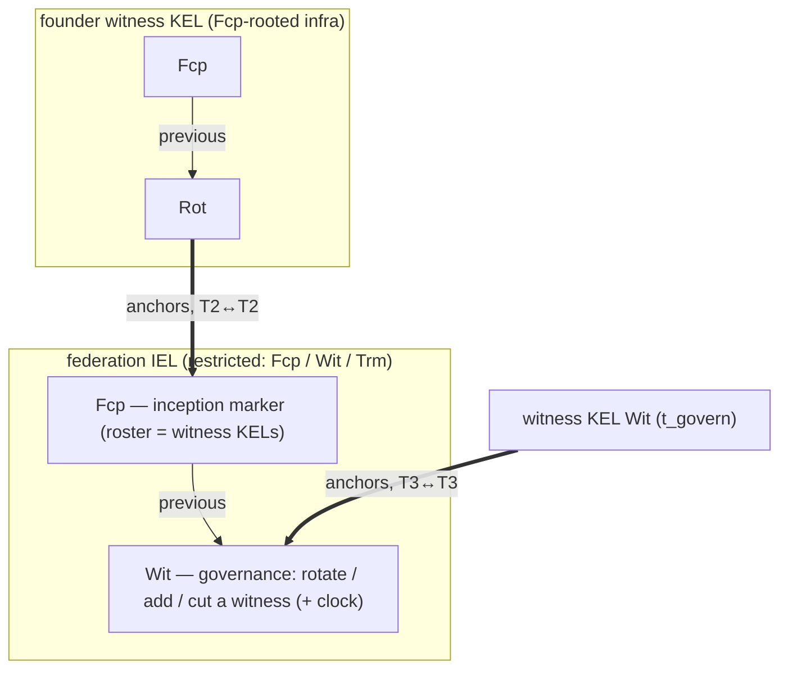
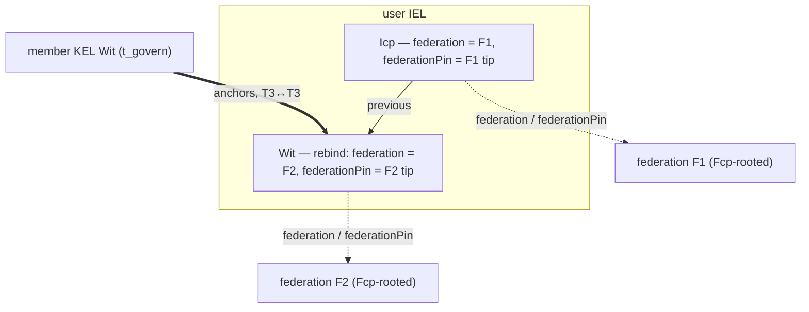

# Federation bootstrap and binding

_Forthcoming._ The full federation doctrine lands here (genesis, witnessing, rebinding); the
cross-primitive framing is in
[`../protocol-doctrine.md` §Federation convergence](../protocol-doctrine.md#federation-convergence).
This stub carries the diagrams ahead of the prose.

## Genesis — a federation is a restricted IEL

A federation is a **restricted IEL** rooted at an `Fcp` inception marker (`Fcp` / `Wit` / `Trm`
only); its roster is witness KELs directly. Each founder witness KEL is `Fcp`-rooted infrastructure
(governed **into** the roster, never self-bound), and its genesis `Fcp → Rot` anchors the federation
IEL's `Fcp` marker (kind-strict, tier-2 ↔ tier-2). Post-genesis governance — add/cut a witness,
rotate — rides a federation `Wit`, anchored by the participating witnesses' KEL `Wit`s (tier-3) and
carrying the federation `clock`.

## Rebinding — a user identity binds to a federation

A user identity's initial federation binding rides its IEL `Icp` (`federation` prefix +
`federationPin` SAID). A later IEL `Wit` **rebinds** it to a new federation, anchored by the
members' KEL `Wit`s (kind-strict, tier-3). Trust is **per-federation and non-transitive** — each
event is witnessed by whichever federation was current when it landed.

