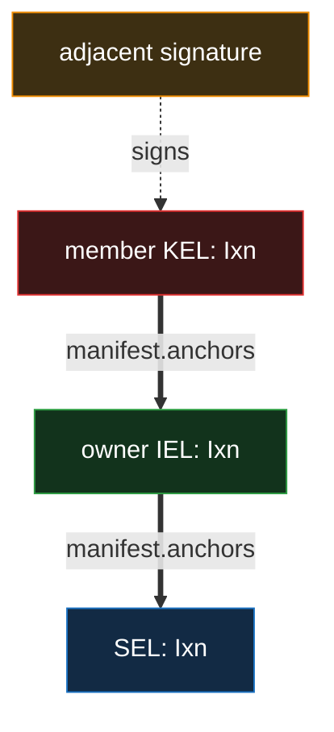
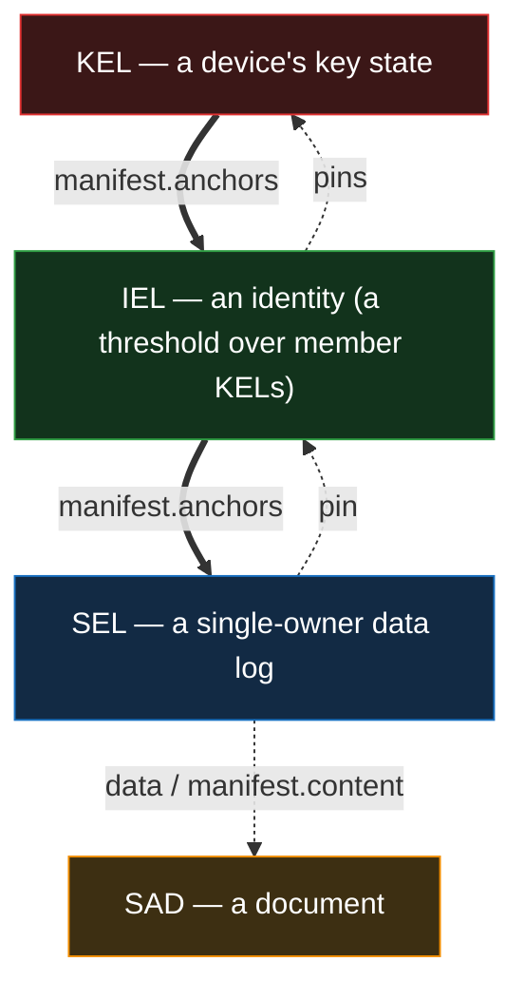
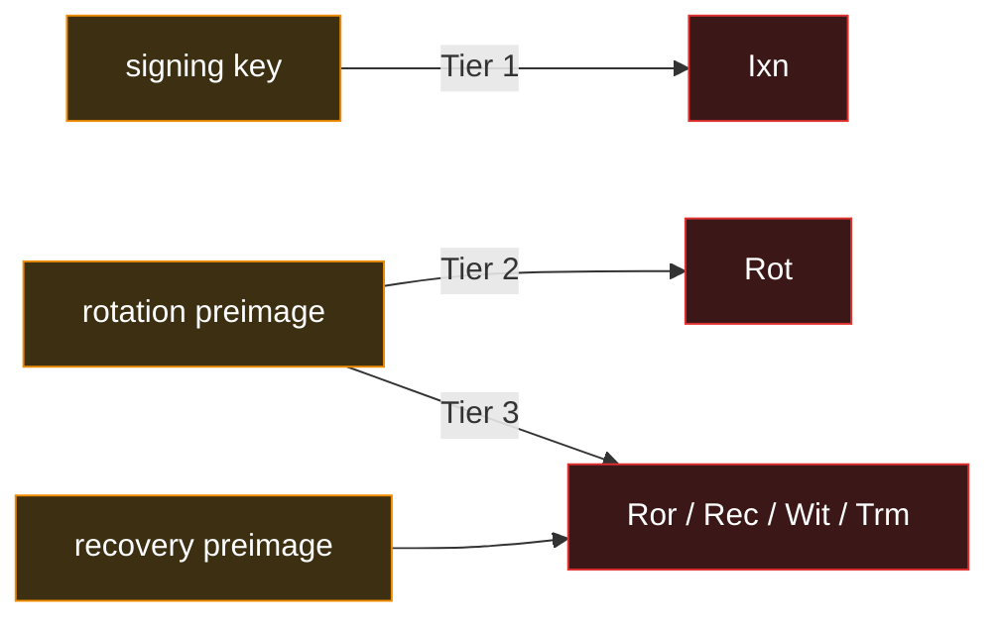
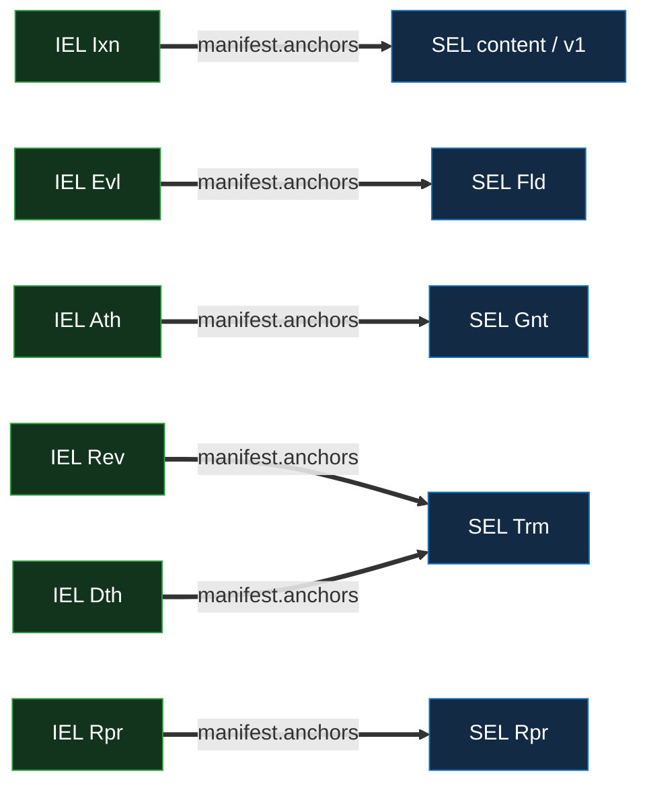
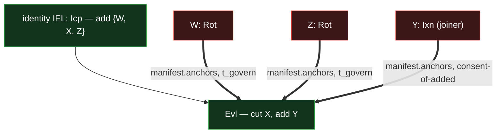
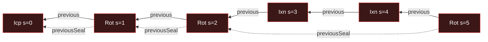
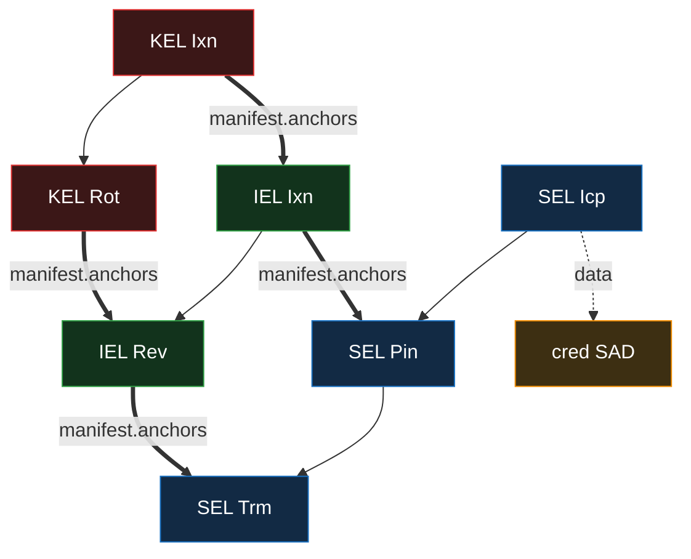

# Event Shape — KEL / IEL / SEL

Canonical reference for the event-log primitives' event taxonomy, field shape, and per-kind
structural-validation rules. The per-primitive docs reference this for the underlying shape;
doctrine specific to a primitive (the exact anchor matrix, divergence and repair rules, federation
mechanics, prefix-derivation specifics) lives in the per-primitive docs and in
[`../../../protocol-doctrine.md`](../../../protocol-doctrine.md).

This is a **shape reference** — it states what fields exist, which kinds populate them, and how the
verifier enforces per-kind field rules. **Authorization is structural:** a KEL, IEL, or SEL event is
authorized by its own key state, its identity's threshold, or its owner. Policy is a property of
**documents**; see [`../../policy/policy.md`](../../policy/policy.md).

## Reading order

- [`kel/`](kel/) — KEL primitive specs. _(Per-primitive doctrine; landed separately.)_
- [`iel/`](iel/) — IEL primitive. _(Per-primitive doctrine; forthcoming.)_
- [`sel/`](sel/) — SEL primitive. _(Per-primitive doctrine; forthcoming.)_
- [`../../../protocol-doctrine.md`](../../../protocol-doctrine.md) — cross-primitive doctrine:
  tiers, divergence and repair, the seal bound, federation convergence, the verification walk.
- [`../../policy/policy.md`](../../policy/policy.md) — the document authorization layer (the policy
  language that lives on documents, not on these events).
- [`../sad/sad.md`](../sad/sad.md) — the SAD layer: chain events are SADs.

## Common fields

Five fields appear on every event across all log types. The per-kind shape (§Per-kind structural
validation) adds fields per kind.

| Field      | Type      | Description                                                                                                                                                                                                              |
| ---------- | --------- | ------------------------------------------------------------------------------------------------------------------------------------------------------------------------------------------------------------------------ |
| `said`     | Digest256 | Blake3-256 hash of the canonical event content (`said` set to the fixed-value placeholder, `prefix` populated real). Uniquely identifies the event.                                                                      |
| `prefix`   | Digest256 | Hash of the canonical event content (both `said` and `prefix` set to the placeholder). Identifies the **chain**, derived from the **whole-event content** — so two inceptions collide only under a Blake3-256 collision. |
| `serial`   | u64       | Chain position. Inception events have `serial == 0`; all others have `serial >= 1`, monotonic per branch.                                                                                                                |
| `previous` | Digest256 | SAID of the parent event. Forbidden at inception (no parent); required elsewhere.                                                                                                                                        |
| `kind`     | String    | Log-type × event-kind discriminator. Drives per-kind structural validation, tier dispatch, and the role vocabulary the event's `manifest` may carry.                                                                     |

Signatures are **not part of event content** — see
[§Authentication & signatures](#authentication--signatures).

## Authentication & signatures

Signatures are not part of the event content — events are pure SAD content. The `said` is the hash
of the content; embedding a signature would make the SAID depend on a signature taken over the prior
SAID, which is circular. Signatures live **adjacent** to the event as separate data.

- **KEL events** are signed by the controller **when authored**: a primary signature on every KEL
  event, plus a **recovery signature** on the dual-signed kinds (`Ror` / `Rec` / `Wit` / `Trm`). The
  recovery key behind that second signature is the **break-glass reserve** for high-assurance
  operations — not a device-loss recovery mechanism (a lost or compromised device is rotated out at
  the identity layer via an IEL roster change).
- **IEL / SEL events** carry no adjacent signatures. They authenticate via their **KEL anchor** — a
  member's KEL event commits to the IEL event it participates in (and an IEL event commits to the
  SEL events it authorizes), and that KEL event's adjacent signature provides the authentication.
  The verifier walks from the IEL / SEL event to its anchoring event and validates the signature
  there.

This composition is what makes the three-tier capability model uniform across primitives — an IEL /
SEL operation inherits its authentication tier from the event that anchors it. See
[`../../../protocol-doctrine.md` §Tiers](../../../protocol-doctrine.md#tiers).

IEL and SEL events carry **no signature** of their own. Thick arrows are `manifest.anchors` (the
down-commit); a verifier reading the SEL event walks them **upward** — SEL → owner IEL → member KEL
— to that KEL event's **adjacent signature**, which authenticates the chain. The act's tier comes
from the anchoring kind (all `Ixn` here → tier 1).

## Structural authorization — the three mechanisms

Each primitive authorizes its own events structurally.

- **KEL — a device's own key.** A KEL event is authorized by the key state the chain itself commits:
  a signing key (tier 1), a revealed rotation preimage (tier 2), a revealed rotation + recovery
  preimage (tier 3). The KEL is the root — self-authorizing, with no chain above it.
- **IEL — an identity's threshold vector over its member devices.** An IEL is a roster of member
  KELs plus a **threshold vector** `{t_use, t_govern, t_authorize, t_recover}`, indexed by the kind
  of event being authored (below). It composes no multi-party policy internally; "who is this
  identity" is the roster, "how many must act for this kind of act" is the threshold vector.
- **SEL — single-owner ownership.** A SEL is owned by exactly one IEL. Its events are authorized by
  that owner IEL: the owner's IEL event anchors the SEL event (commits to its SAID), and the
  required count is set by the SEL event's kind. A SEL hosts no roster of its own.

The composition stack. Each layer **commits down** to the one below via `manifest.anchors` (thick)
and **pins up** to the one above (dotted); a SEL names its documents by `data` / `content`.
Authority resolves **up** the anchor chain to a KEL signature; the as-of / freshness floors **up**
the pins.

**The threshold vector and its bounds.** Each IEL kind draws its required count from one slot of the
vector: content (`Ixn`) from `t_use`; a roster/threshold change (`Evl`) from `t_govern`; an
authorization (`Ath`) from `t_authorize`; a deauthorization (`Dth`) from `t_authorize`; a revocation
(`Rev`) from `t_govern`; a repair (`Rpr`) from `t_recover`; a federation rebind (`Wit`) and the
terminal `Trm` from `t_govern`. The bounds:

- `t_use >= 1` (`t_use = 1` is single-device by choice — no content resilience).
- The authority slots (`t_govern`, `t_authorize`, `t_recover`) carry **two bounds**: a **security
  floor** `>= 2` (hard for every identity of `|roster| >= 2` — no single member exercises authority;
  the singleton below is the degenerate case) and a **recoverability ceiling** `<= |roster| − 1`
  (lets the identity evict a compromised member or recover a lost one without it). The
  recoverability ceiling is **advisory at `|roster| = 2`** (a two-device identity is valid but
  cannot evict/recover without both — the wallet warns) and **hard at `|roster| >= 3`** (a threshold
  equal to `|roster|` is a gratuitous hostage config — rejected). A singleton (`|roster| = 1`) sets
  all thresholds to 1.
- **`t_govern <= t_recover` is a hard floor** — verifier-enforced wherever a threshold is declared
  or changed (`Icp` and every roster-delta event). Recovery reveals the reserve, and a repair may
  now carry a roster `cut` (the repair-and-evict fold — [`iel/`](iel/)), so recovery must never be
  priced below governance. (Vacuous for a federation, which declares no `t_recover`, and for a
  singleton.)
- The roster is **never emptied**: the post-delta size is **`|roster| + |add| − |cut| >= 1`** — an
  absolute floor beneath the security floor and the singleton exception. A roster is a **set**, so a
  delta is well-formed only with `add ∉` the current roster, `cut ⊆` it, and `cut ∩ add = ∅` (the
  size arithmetic then holds). This makes every singleton's roster downward-immutable — a singleton
  `cut` computes `1 + 0 − 1 = 0 < 1` and is rejected — while still allowing singleton
  evict-and-replace via an `Evl` (`cut 1 + add 1` stays 1).
- The bounds are re-checked on the post-delta config at **every** config-changing event — a user
  `Evl`, a **user `Rpr`-cut** (the repair-and-evict fold), or a federation `Wit` (including a
  config-only `Wit` that changes `threshold` / `signers` with no roster delta) — not only at
  inception. For the **federation** the re-check covers the full **witness-config validity** too:
  the recoverability cap `threshold <= min(|roster| − 2, signers − 1)` (the `signers − 1` leg waived
  at `signers = 1`) and the majority floor `threshold > signers/2` must both hold after the change —
  so a `signers` / `threshold` change is re-checked even with the roster untouched
  ([§Federation convergence](../../../protocol-doctrine.md#federation-convergence) derives which leg
  binds). A `Rpr`-cut (and any `threshold` it carries) is authorized at the **outgoing** `t_recover`
  (the pre-change gate — as a user `Evl` rides `t_govern`-of-outgoing — so a `Rpr` cannot lower its
  own gate before cutting).

The per-kind threshold/tier mapping and the bound derivations are the IEL primitive's —
[`iel/`](iel/). The credential acceptance and authorizing conditions that ride **above** this — on
documents — are the policy layer's ([`../../policy/policy.md`](../../policy/policy.md)).

## The manifest — what an event commits to, grouped by role

An event commits to the things below it through a **`manifest`**: the SAID of a SAD that groups
those commitments **by named role**. The manifest SAD reads
`{ said, <role>: <said-or-list-or-scalar>, … }`, and each role reads as "the things this event
{anchors / roster / delegates / …}." The event row holds only the manifest SAID; the grouped
commitments live in the SAD, separately custody-able. A role value is either an **inline list** of
SAIDs/prefixes — `anchors` / `content` / `delegates` — a **single SAID** naming a further structured
SAD (`roster`, `witnesses`), a **single event-SAID pointer** (`bound`, `fork`), or a **direct
scalar** (the federation `clock` — an inline timestamp value, the lone non-SAID role).

**Role vocabulary:**

| Role        | Carried by                                                                                 | Commits to                                          |
| ----------- | ------------------------------------------------------------------------------------------ | --------------------------------------------------- |
| `anchors`   | KEL `Ixn` (≥ 1) / `Rot` / `Ror` / `Wit`; IEL `Ixn` / `Evl` / `Ath` / `Rev` / `Dth` / `Rpr` | lower-layer event SAIDs (the down-commit)           |
| `roster`    | IEL `Icp` / `Evl` / `Rpr`; federation `Fcp` / `Wit`                                        | the roster **delta** / threshold SAD SAID           |
| `delegates` | IEL `Ath`                                                                                  | delegate **prefixes** (act for the delegator)       |
| `grant`     | SEL `Gnt`                                                                                  | the grant-doc SAD SAID                              |
| `content`   | SEL `Ixn`                                                                                  | the content-SAD SAIDs the `Ixn` records             |
| `bound`     | SEL `Trm` (rescission)                                                                     | the last honoured event SAID on an authorized chain |
| `witnesses` | KEL / IEL `Icp` / `Wit`; federation `Fcp` / `Wit`                                          | the witness-config SAD SAID                         |
| `clock`     | federation `Fcp` / `Wit` / `Trm`                                                           | the federation-clock timestamp (inline, non-SAID)   |
| `fork`      | a repair only — KEL `Rec`; IEL / SEL `Rpr`                                                 | the single losing-branch **root** SAID it condemns  |

The roles that carry discrimination or shape rules, in prose:

- **`anchors`** is the one anchoring vocabulary, discriminated by the **anchored event's kind**, not
  a label — kind-strict both ways: a KEL `Wit` anchors the IEL `Wit`; an IEL `Ixn` anchors content
  SEL events and credential-SEL **v1s** (the `Icp` rides `v1.previous`, never itself anchored);
  `Evl` → SEL `Fld`; `Ath` → SEL `Gnt`; `Rev` → SEL `Trm` (revocation); `Dth` → SEL `Trm`
  (rescission); `Rpr` → SEL `Rpr`.
- **`roster`** is a **delta**, never a snapshot (`{ add, cut, changed thresholds }`): `add` is a
  list on the user kinds and a **single** prefix on a federation `Wit`; a user `Rpr` (the
  repair-and-evict fold) carries a **required non-empty `cut`** + optional `threshold`, **never** an
  `add`.
- **`delegates`** is a positive inclusion list; the same `Ath` may also carry `anchors` (a `Gnt`) —
  the two roles are independent.
- **`grant`** names the grant-doc `G`: the `editors` / `commenters` and their `from` validity-period
  starts that the `Gnt` opens.
- **`witnesses`** is mandatory iff federated at inception and present-iff-changed on a `Wit`; its
  `threshold` sits above a **majority floor** (`threshold > signers/2`), and it gates a user IEL's
  content events at their own position
  ([§Federation convergence](../../../protocol-doctrine.md#federation-convergence)).
- **`fork`** names one losing branch's **root** — the whole subtree is condemned (growth after the
  repair is dead by descent); every other competing branch closes below the advanced seal.
  **Required on a repair, forbidden on every other kind.** Validated, not trusted: the verifier
  checks the root is off the retained chain and the condemned subtree is content-only, rejecting the
  repair if any competing branch it holds carries a privileged event.

**Top-level structural vs. manifest.** An event's _own links_ stay top-level: `said`, `previous`,
**`previousSeal`** (on every seal-advancing event — the back-link to the prior seal that renders the
spine; see [§Divergence is scoped to content](#divergence-is-scoped-to-content) and
protocol-doctrine §Forks are Seal-Bounded), the up-pins (`pin` on a SEL, `pins` on an IEL), the
federation `prefix`, `federationPin`. The `manifest` (role-labeled) carries everything the event
_commits to below it_ — lower-layer event SAIDs and documents. Entities are named by **prefix**;
positions and documents by **SAID**. A SAID here is an integrity **commitment**, not a lookup key —
there is no global SAID→event index, so a SAID harvested off a public manifest does not invert to a
(possibly private) chain's prefix for any party outside the federation mesh; logs are fetched by
prefix
([`../../../protocol-doctrine.md` §Negative checks are positive lookups](../../../protocol-doctrine.md#negative-checks-are-positive-lookups)).

**Read the manifest kind-first.** Each kind may carry **only** the roles in its closed vocabulary
(the table above); a manifest carrying any role outside its kind's vocabulary is **malformed →
rejected**, and a role is consumed only after dispatching on a kind permitted to carry it. The
manifest SAID commits the role labels (the hash is over the keys), so a third party cannot relabel a
fixed event; the kind→role allowlist closes _author_-mislabel. This is load-bearing for the
directly-consumed roles (`roster`, `delegates`, `witnesses`, `clock`) — they have no downstream
type-check, so the allowlist is their sole protection. The back-checked role `anchors` is
additionally caught when each referenced event is validated against its required kind — the anchor
matrix is **kind-strict** both directions: an IEL `Rev`'s or `Dth`'s anchors resolve **only** to SEL
`Trm`s, an IEL `Ixn`'s only to content or a credential-SEL v1, and neither the reverse.

## Cross-cutting fields

Beyond the common fields, these appear on multiple kinds with consistent meaning. **Logs** names the
subset of {KEL, IEL, SEL} the field appears on; **Events** the kinds that carry it.

| Field           | Type      | Logs          | Events                                                                                                                                                                           | Description                                                                                                                                                                                          |
| --------------- | --------- | ------------- | -------------------------------------------------------------------------------------------------------------------------------------------------------------------------------- | ---------------------------------------------------------------------------------------------------------------------------------------------------------------------------------------------------- |
| `manifest`      | Digest256 | KEL, IEL, SEL | KEL `Icp` / `Ixn` / `Rot` / `Ror` / `Rec` / `Wit`; IEL `Icp` / `Ixn` / `Evl` / `Ath` / `Rev` / `Dth` / `Rpr` / `Trm` / `Wit`; SEL `Ixn` / `Gnt` / `Trm` / `Rpr`                  | SAID of the role-grouped commitment SAD (above).                                                                                                                                                     |
| `previousSeal`  | Digest256 | KEL, IEL, SEL | the **seal-advancing** kinds (KEL `Rot`/`Ror`/`Rec`/`Wit`/`Trm`; IEL `Evl`/`Ath`/`Rev`/`Dth`/`Rpr`/`Trm`/`Wit`; SEL `Fld`/`Gnt`/`Rpr`/`Trm`)                                     | Back-link to the prior seal-advancing event; renders the **spine** ([§Divergence is scoped to content](#divergence-is-scoped-to-content)). `fbd` on `Icp` / `Fcp` / `Ixn` (and the SEL floor `Pin`). |
| `federation`    | Digest256 | KEL, IEL      | KEL `Icp` / `Wit`; user IEL `Icp` / `Wit` — **all opt** (present-iff-changed: on `Icp` absent ⇒ direct-mode; on `Wit` present only on a rebind)                                  | The federation IEL **prefix** a chain / identity binds to (_which_ federation).ᵃ                                                                                                                     |
| `federationPin` | Digest256 | KEL, IEL      | KEL `Icp` (req iff federated); **opt on `Wit` + every KEL body event** (`Ixn`/`Rot`/`Ror`/`Rec`/`Trm`) — present-iff-re-pinned; user IEL `Icp` (req iff federated) / `Wit` (opt) | A **SAID** pinning the as-of federation position (_as of when_).ᵇ                                                                                                                                    |
| `pin`           | Digest256 | SEL           | `Ixn` / `Gnt` / `Pin` / `Fld` / `Trm` / `Rpr` (req); **`fbd` on `Icp`**                                                                                                          | SAID of the owner IEL event the SEL floors **up** to (its up-pin); `fbd` on `Icp` — the first pin rides the SEL's serial-1 event (SEL taxonomy above).                                               |
| `pins`          | Digest256 | IEL           | every IEL kind (`Icp`/`Ixn`/`Evl`/`Ath`/`Rev`/`Dth`/`Rpr`/`Trm`/`Wit`)                                                                                                           | SAID of a SAD listing the participating member **KEL event SAIDs** — the IEL's **up-pins**.ᶜ                                                                                                         |
| `nonce`         | Nonce256  | IEL           | `Icp`                                                                                                                                                                            | Opaque random bytes chosen by the inceptor; makes the IEL prefix unpredictable. Required at inception, forbidden elsewhere.                                                                          |
| `owner`         | Digest256 | SEL           | `Icp`                                                                                                                                                                            | The **owner IEL prefix** — which IEL owns this SEL; `Icp`-only and **immutable**; participates in the SEL prefix derivation.                                                                         |
| `topic`         | String    | SEL           | `Icp`                                                                                                                                                                            | Application discriminator; participates in the SEL prefix derivation.                                                                                                                                |
| `data`          | Digest256 | SEL           | `Icp` (opt)                                                                                                                                                                      | The content SAD the SEL is rooted on (the whole reference; the `Icp` carries no manifest). Optional; participates in the SEL prefix derivation.ᵈ                                                     |

- ᵃ **`federation`** — the identity's authoritative binding lives on its IEL `Icp` / `Wit`; each
  member KEL's is field-matched to it (kind-strict `Wit ↔ Wit`); a SEL inherits its owner IEL's; a
  federation IEL carries neither field (it _is_ the federation, never self-bound).
- ᵇ **`federationPin`** — present = a forward re-pin within the inherited federation; absent =
  inherit the prior pin (a same-federation re-pin rides the next KEL body event; `Wit` is reserved
  for a **rebind** — changing the `federation` prefix or `witnesses`).
- ᶜ **`pins`** — the complement of fresh-participation up-anchoring (a federation `Wit`'s are the
  witness KELs); every IEL event is anchored by a threshold of members, so every one carries it
  (schema is IEL doctrine — [`iel/`](iel/)).
- ᵈ **`data`** — for a lookup SEL, `data` is the recompute input; absent for an `owner` +
  `topic`-only SEL. _Example: a credential SEL's `data` is the credential's SAID (see `features/`)._

The KEL key-state fields (`publicKey`, `rotationHash`, `recoveryKey`, `recoveryHash`) and the
witness-config SAD are KEL-specific — see [`kel/`](kel/).

## Tiers — the three-tier capability model

**Tier** names the cryptographic capability required to forge an event, set by
**danger-or-permanence**, and is **orthogonal to count** (the threshold vector). Tier is dispatched
from the event kind, never stored.

- **Tier 1 — signing key only.** Content. A `t_use`-counted `Ixn` is tier 1 even at a high count.
- **Tier 2 — rotation preimage.** Establishment-mutation, authority-grant, and **any sealed kill**
  (a kill must be permanent on arrival).
- **Tier 3 — rotation preimage + recovery preimage.** Repair, identity-kill, and any act that also
  refreshes the recovery reserve — proactive rotate-recovery (`Ror`) and federation
  binding/governance (`Wit`).

The material an adversary must hold to forge each kind. **The signing key gates only Tier 1** —
Tiers 2–3 require the reserve preimages (held apart from the signing key), **not** the old signing
key; Tier 3 needs both the rotation _and_ recovery preimage.

The reserve (rotation / recovery preimage, held apart from the signing key) is required when a
forgery would be high-harm or irreversible, **or** when the act must be permanent on arrival
(sealed). A **kill** (revoke / close / rescind / terminate) is the permanence case: low-danger (it
only removes trust) but monotone (a third party relies on it), so it is sealed on a dedicated
kill-anchor and is tier 2 (identity-kill → tier 3). Tier semantics and the **kind-strict** anchor
rule (each IEL / SEL kind is anchored by **exactly** the KEL / IEL kind that reveals the matching
capability — no higher-tier stand-in) are the protocol doctrine's —
[`../../../protocol-doctrine.md` §Tiers](../../../protocol-doctrine.md#tiers).

## Event taxonomy

### KEL — 8 kinds

| Kind  | Tier | Sig    | Role                                                                                                           |
| ----- | ---- | ------ | -------------------------------------------------------------------------------------------------------------- |
| `Fcp` | 1    | single | Founder **pre-federation** inception (self-attested; its v=1 `Rot` anchors the federation `Fcp`).              |
| `Icp` | 1    | single | Standard inception — **federation-bound** or **direct-mode**.                                                  |
| `Ixn` | 1    | single | Content; anchors lower-layer SAIDs (`anchors`, ≥ 1). **Repairable.**                                           |
| `Rot` | 2    | single | Rotation — reveals the next signing key. **Seal-advancing.**                                                   |
| `Ror` | 3    | dual   | Proactive rotate-recovery — rotates signing **and** recovery keys.                                             |
| `Rec` | 3    | dual   | **Recover** — the KEL repair kind; archives the losing `Ixn` branch. **Non-terminal** (returns to **Active**). |
| `Wit` | 3    | dual   | Federation (re)bind (user KEL) / federation **governance** (witness KEL). **Seal-advancing.**ᵃ                 |
| `Trm` | 3    | dual   | **Terminal.**                                                                                                  |

- ᵃ **`Wit`** — on a user (`Icp`-rooted) KEL it changes `federation` and/or `witnesses` and anchors
  the user IEL `Wit`; on an `Fcp`-rooted witness KEL it is federation governance (anchors the
  federation IEL `Wit`, never self-bound).

A KEL has **one inception root**: either a founder **`Fcp → Rot`** pair (a pre-federation founder
anchoring the federation IEL `Fcp` it helps incept) **or** a standalone **`Icp`** (joining an
existing federation) — **never** `Fcp → Icp`. A pre-federation `Fcp` is **self-attested**, carries
**no `witnesses`** (there is no federation yet to witness it — which keeps the federation IEL's own
bootstrap non-circular), and **cannot stand alone**: its v=1 is a **`Rot`** that anchors the
federation IEL's **`Fcp`** marker (kind-strict, tier-2 → tier-2 — there is no founder `Wit`) in the
**same atomic batch** (`Fcp` v=0 → `Rot` v=1). The full ceremony is KEL + federation doctrine —
[`kel/`](kel/), [`federation/`](../../../federation/).

### IEL — 10 kinds

| Kind  | Tier | Count                                      | Role                                                                                                                                                                                                                                   |
| ----- | ---- | ------------------------------------------ | -------------------------------------------------------------------------------------------------------------------------------------------------------------------------------------------------------------------------------------- |
| `Icp` | 2    | all initial members consent                | Inception — pins the initial roster + threshold vector, federation binding, and `witnesses`. A **federation IEL** incepts the `Fcp` marker instead (below).                                                                            |
| `Ixn` | 1    | `t_use`                                    | Content; anchors content SEL events **and** each SEL's serial-1 **v1**, batched. **Repairable.**                                                                                                                                       |
| `Evl` | 2    | all added consent ∧ `t_govern` of outgoing | **Evolve state** — a roster/threshold **delta** (`roster`); also anchors the SEL `Fld`s that re-seal here; no kills.ᵃ                                                                                                                  |
| `Ath` | 2    | `t_authorize`                              | **Authorize a party to act** — `delegates` (act **for**) and/or `anchors` a SEL `Gnt` (act **as itself**). **Forces a `Rot`; sealed on arrival, seal-advancing.**ᵇ                                                                     |
| `Rev` | 2    | `t_govern`                                 | **Revoke** — kill-anchor for an **owned** artifact (anchors a SEL `Trm`). **Forces a `Rot`; sealed on arrival; non-terminal.**ᶜ                                                                                                        |
| `Dth` | 2    | `t_authorize`                              | **Deauthorize** — kill-anchor for a **granted authorization** (anchors a SEL `Trm`); the polarity-inverse of `Ath`. **Forces a `Rot`; sealed on arrival; non-terminal.**ᵈ                                                              |
| `Rpr` | 3    | `t_recover`                                | Divergence repair; may fold in an evicting roster `cut` (repair-and-evict).ᵉ                                                                                                                                                           |
| `Trm` | 3    | `t_govern`                                 | **Terminal** — freezes all the IEL's SELs.                                                                                                                                                                                             |
| `Wit` | 3    | `t_govern`                                 | **Federation rebind** (`federation` / `federationPin` + `witnesses`); anchored by member KEL `Wit`s (kind-strict, T3 ↔ T3). `{Wit, Wit}` terminal. The **one** witness/federation kind; on a federation IEL it is governance (below). |
| `Fcp` | 2    | all founders consent                       | **Federation inception marker** _(federation IEL only)_ — the federation IEL's `Icp`; anchored kind-strict by each founder's KEL `Rot` (T2 ↔ T2). See the restricted-IEL note below.                                                  |

- ᵃ **`Evl`** — the `roster` delta is `add` + `cut`; added members consent at tier 1 via their own
  KEL anchor, the binding authorization tier 2 from the continuing quorum; anchors no kills (those
  ride `Rev` / `Dth`).
- ᵇ **`Ath`** — `delegates` is a positive inclusion list of delegate prefixes; `anchors` is
  kind-strict (names **only** `Gnt`s). Both roles are permitted at once.
- ᶜ **`Rev`** — carries no roster delta; the forced `Rot` gives the permanent act a ≥ tier-2 KEL
  anchor. Non-terminal — it seals a kill on a _target_, not its host chain, so a `{Rev, content}`
  fork stays recoverable.
- ᵈ **`Dth`** — the `Trm` it seals carries `manifest.bound`; non-terminal like `Rev`.
- ᵉ **`Rpr`** — the `cut` is **required non-empty, never an `add`, never `threshold`-only**; priced
  at the **outgoing** `t_recover`; the post-cut roster is re-checked against the threshold-vector
  bounds.

A federation is a **restricted IEL** rooted at an **`Fcp`** inception marker — `Fcp` / `Wit` / `Trm`
only (`Wit` is its governance kind — witness rotation and/or a roster delta — replacing the user
`Evl`; no `Ixn`, so it never has a **reconcilable** fork and needs no `Rpr`; a competing-privileged
`{Wit, Wit}` / `{Trm, Trm}` is still possible but **terminal**, not repairable; no `Ath`, since
trust is per-federation and non-transitive). Its roster is witness KELs directly. See
[`../../../protocol-doctrine.md` §Federation convergence](../../../protocol-doctrine.md#federation-convergence)
and [`federation/`](../../../federation/).

### SEL — 7 kinds

| Kind  | Count                                                | Tier | Anchored by (IEL)                | Role                                                                                                                                                                          |
| ----- | ---------------------------------------------------- | ---- | -------------------------------- | ----------------------------------------------------------------------------------------------------------------------------------------------------------------------------- |
| `Icp` | `t_use`                                              | 1    | — (never anchored; v1 is)        | Inception — no `pin`, no manifest; **never itself anchored** (its v1 is).ᵃ                                                                                                    |
| `Ixn` | `t_use`                                              | 1    | `Ixn`                            | Content SAD(s) + re-`pin`; ≤ 1 per SEL per IEL `Ixn`. **Divergeable, repairable** (as is the floor `Pin`).                                                                    |
| `Trm` | `t_govern` (revocation) · `t_authorize` (rescission) | 2    | `Rev` (revoke) / `Dth` (rescind) | The SEL **kill**. **Sealed on arrival.**ᵇ                                                                                                                                     |
| `Gnt` | `t_authorize`                                        | 2    | `Ath`                            | The doc-governance **grant** — opens editor / commenter periods. **Sealed on arrival, seal-advancing, non-archivable.**ᶜ                                                      |
| `Pin` | `t_use`                                              | 1    | `Ixn`                            | The **floor re-pin** to the owner IEL's current tip (top-level `pin` only). The **serial-1 issuance floor** (the `Icp` can't hold a pin). Repairable; **not** seal-advancing. |
| `Fld` | `t_govern`                                           | 2    | `Evl`                            | The SEL **re-seal** (pure fold; caps the content run). **Seal-advancing.**ᵈ                                                                                                   |
| `Rpr` | `t_recover`                                          | 3    | `Rpr`                            | Divergence repair; owner-authorized, bottom-up cascade.                                                                                                                       |

- ᵃ **`Icp`** — stays recomputable for lookup (§Prefix derivation); the SEL's **serial-1 event (its
  v1)** is what an IEL `Ixn` anchors, the `Icp` riding `v1.previous` (a bare `Pin` for
  issue-and-sit, else the first event). A credential SEL's `data` **is** the credential's SAID; a
  lookup SEL's `data` is the recompute input.
- ᵇ **`Trm`** — the SEL kill, sealed by an IEL `Rev` (`t_govern`, a governed kill) or `Dth`
  (`t_authorize`, which rescinds what an `Ath` granted — the lookup-SEL `{Icp, Trm}` carries
  `manifest.bound`). Monotone — no delayed form; the killed thing = which SEL its `Trm` extends.
  Always **T2**; the T3 _identity_-kill is the same-named KEL/IEL `Trm`, a different variant. Its
  current applications (credential revocation; delegation and doc-membership rescission) live in the
  `features/` layer, not this primitive.
- ᶜ **`Gnt`** — the additive twin of `Trm`; kind-strict (an `Ath` anchors only `Gnt`s); walked back
  by a rescission (`Dth` → SEL `Trm`) or reincept, never a repair; doc-governance SELs only.
- ᵈ **`Fld`** — the KEL `Rot` / IEL-`Evl` re-seal analog; carries `previousSeal`, no `fork` (the
  folded run `[previousSeal..previous]` is derivable); caps the content run so a repair stays
  page-atomic; anchored by an owner IEL `Evl`.

Content rides the IEL `Ixn` rail (tier 1); a kill rides the IEL `Rev` / `Dth` rail (tier 2, sealed);
a grant rides the IEL `Ath` rail (tier 2, sealed); roster/threshold changes ride the IEL `Evl` rail.
A SEL's **trust-finality** floors to the owner IEL's seal — it has no seal of its own for that; but
its own seal-advancing kinds (`Fld` / `Gnt` / `Rpr` / `Trm`) cap its **local divergence/repair
window** and carry `previousSeal` like any spine (only the repair `Rpr` additionally carries
`fork`). Credential issuance, revocation, and status are a **feature** layered on the SEL primitive
— [`features/credentials/`](../../../features/credentials/); multi-party co-authored documents are
another — [`features/multi-party/documents.md`](../../../features/multi-party/documents.md) _(both
forthcoming)_.

The anchor matrix — each IEL kind anchors **only** its matching SEL kind(s) (kind-strict); the two
kill-anchors `Rev` / `Dth` both seal an SEL `Trm`, discriminated by the SEL's type:

## Per-kind structural validation

The verifier enforces per-kind field rules: **req** (must be set), **fbd** (must be unset), **opt**
(may be either). Common fields (`said`, `prefix`, `kind`) are always required; `previous` is
forbidden on inception kinds and required elsewhere; `serial` is 0 on inception, `>=1` elsewhere;
signatures live adjacent (§Authentication & signatures).

### KEL

| Kind  | publicKey | rotationHash | recoveryKey | recoveryHash | federation | federationPin | previousSeal | manifest                         |
| ----- | --------- | ------------ | ----------- | ------------ | ---------- | ------------- | ------------ | -------------------------------- |
| `Fcp` | req       | req          | fbd         | req          | fbd        | fbd           | fbd          | fbd                              |
| `Icp` | req       | req          | fbd         | req          | opt        | opt           | fbd          | opt (`witnesses`)                |
| `Ixn` | fbd       | fbd          | fbd         | fbd          | fbd        | opt           | fbd          | req (`anchors`, ≥1)              |
| `Rot` | req       | req          | fbd         | fbd          | fbd        | opt           | req          | opt (`anchors`)                  |
| `Ror` | req       | req          | req         | req          | fbd        | opt           | req          | opt (`anchors`)                  |
| `Rec` | req       | req          | req         | req          | fbd        | opt           | req          | req (`fork`)                     |
| `Wit` | req       | req          | req         | req          | opt\*      | opt\*         | req          | req (`anchors`; `witnesses` opt) |
| `Trm` | req       | fbd          | req         | fbd          | fbd        | opt           | req          | fbd                              |

The dual-signed kinds (`Ror` / `Rec` / `Wit` / `Trm`) carry an adjacent recovery signature
(§Authentication & signatures). On an `Icp`, `federation` / `federationPin` are **optional**:
present ⇒ federation-bound, absent ⇒ a **direct-mode** chain (un-federated, unwitnessed until a
later `Wit` binds it), and `witnesses` is **mandatory iff federated** (present iff `federation` is;
**forbidden** on a direct-mode `Icp`). **\*The `Wit` row is the user (`Icp`-rooted) facet** — the
federation rebind, `federation` / `federationPin` **present-iff-changed (`opt`)** (present on an
actual rebind / re-pin; a witness-config-only `Wit` carries neither); on an **`Fcp`-rooted
federation-witness `Wit`** (federation governance) both are **fbd** — the witness is never
self-bound. Exact key-state semantics, the witness-config SAD, and the direct-mode / facet doctrine
are KEL + federation doctrine — [`kel/`](kel/), [`../../../federation/`](../../../federation/).

### IEL

| Kind  | nonce | pins | previousSeal | manifest                                                                             |
| ----- | ----- | ---- | ------------ | ------------------------------------------------------------------------------------ |
| `Icp` | req   | req  | fbd          | req (`roster`; `witnesses` mandatory iff federated; a federation `Fcp` adds `clock`) |
| `Ixn` | fbd   | req  | fbd          | req (`anchors`)                                                                      |
| `Evl` | fbd   | req  | req          | opt (`roster`, `anchors`)                                                            |
| `Ath` | fbd   | req  | req          | req (`delegates` and/or `anchors`)                                                   |
| `Rev` | fbd   | req  | req          | req (`anchors`)                                                                      |
| `Dth` | fbd   | req  | req          | req (`anchors`)                                                                      |
| `Rpr` | fbd   | req  | req          | req (`fork`; `anchors`, `roster` opt)                                                |
| `Trm` | fbd   | req  | req          | opt (a federation `Trm` carries `clock` req)                                         |
| `Wit` | fbd   | req  | req          | opt (`witnesses`; a federation `Wit` adds `clock` req + `roster` opt)                |
| `Fcp` | req   | req  | fbd          | req (`roster` + `witnesses` + `clock`) — federation IEL inception marker             |

A **user IEL `Icp`** mirrors the KEL `Icp` on the federation binding: `federation` / `federationPin`
are **optional** (absent ⇒ a direct-mode identity), and `witnesses` is **mandatory iff federated**
(**forbidden** on a direct-mode IEL `Icp`); on a `Wit` all three are **present-iff-changed** (a
field is carried only when it changes). The `nonce` (inception only) drives prefix unpredictability
(§Prefix derivation). `pins` is the IEL's top-level **up-pins** — a scalar SAID naming a small SAD
of the participating member **KEL event SAIDs** (a federation `Wit`'s are the witness KELs); every
IEL event is anchored by a threshold of members, so every IEL event carries it. On a `Rpr`, `roster`
is **present-iff-evicting** and restricted to a **non-empty `cut` + an optional `threshold`**: a
`Rpr` `roster` SAD carrying an `add`, or an empty `cut` (a `threshold`-only change), is **malformed
→ rejected** — a bare threshold change or a replacement `add` rides a later `Evl`, the chain being
unfrozen after the repair. The kind→role allowlist gates the role's _presence_; this content check
gates its _shape_. The exact roster delta SAD and pins-SAD schemas, the consent rule for additions,
and the per-kind anchor matrix are IEL doctrine — [`iel/`](iel/).

### SEL

| Kind  | owner | topic | data | pin | previousSeal | manifest                      |
| ----- | ----- | ----- | ---- | --- | ------------ | ----------------------------- |
| `Icp` | req   | req   | opt  | fbd | fbd          | fbd                           |
| `Ixn` | fbd   | fbd   | fbd  | req | fbd          | opt (`content`)               |
| `Pin` | fbd   | fbd   | fbd  | req | fbd          | fbd                           |
| `Fld` | fbd   | fbd   | fbd  | req | req          | fbd                           |
| `Trm` | fbd   | fbd   | fbd  | req | req          | opt (`bound` on a rescission) |
| `Gnt` | fbd   | fbd   | fbd  | req | req          | req (`grant`)                 |
| `Rpr` | fbd   | fbd   | fbd  | req | req          | req (`fork`)                  |

`owner` (the owner IEL prefix, immutable — `Icp` only), `topic`, and `data` participate in the SEL
prefix derivation (§Prefix derivation), so the `Icp` carries **no `pin`**: a pin field would make
the prefix non-recomputable for lookup. The SEL's up-pin to its owner IEL therefore rides a
**serial-1 event** — a bare **`Pin`** batched with the `Icp` when inception carries no other first
event (issue-and-sit; credentials included), otherwise the first event itself — and re-pins on each
`Ixn`. The exact SEL shapes are SEL doctrine — [`sel/`](sel/).

## Anchoring — committing down, flooring up

An event commits to the layer that depends on it through its `manifest`, and the dependent floors
back up to its authority's current tip:

- A **KEL** event anchors the **IEL** events it authorizes (the IEL event's SAID rides in the KEL
  event's `manifest.anchors`); the IEL event authenticates via that KEL event's signature. A member
  participates in an IEL event by authoring a **fresh KEL event at its own current tip**, of
  **exactly** the kind that reveals the capability the act exercises (**kind-strict**): content ←
  `Ixn`; tier-2 establishment/governance ← `Rot` (incl. the federation `Fcp` inception); tier-3
  recovery/terminal ← `Ror`; tier-3 federation rebind (the IEL `Wit`) ← `Wit`. No higher-tier
  stand-in, and a `Rec` hosts **no** anchor (a recovered member participates via the subsequent
  `Ror`). A rotated-out key cannot produce one, which closes the rotated-out-member backdate.
- An **IEL** event anchors the **SEL** events it authorizes — an `Ixn` for content and
  credential-SEL **v1s** (the serial-1 event; the `Icp` rides `v1.previous`, never itself anchored),
  a `Rev` / `Dth` for the SEL `Trm`s they seal (`Rev` a credential revocation, `Dth` a rescission),
  an `Ath` for a SEL `Gnt`, an `Evl` for a SEL `Fld` re-seal, an `Rpr` for a SEL `Rpr` — each via
  `anchors`, **kind-strict** (each SEL kind is valid only when anchored by its matching IEL kind,
  and each IEL kind anchors only its matching SEL kinds). The SEL event floors up to the owner IEL
  tip via its `pin`, carried on its serial-1 event — a bare `Pin` when inception batches no other
  first event, otherwise the first event itself (the `Icp` stays pin-free for recomputability). The
  as-of authority is the **anchoring position** — the committing IEL event, append-only — so it
  cannot select a more permissive past ([`../../policy/documents.md`](../../policy/documents.md)).

A device swap makes this concrete: replacing device X with Y is an IEL `Evl` carrying a roster delta
(`cut X, add Y`). The continuing `t_govern` members (W, Z) each author a KEL `Rot` that anchors the
`Evl` — a tier-2 governance act, each revealing a rotation preimage — while the joining device Y
consents via a KEL `Ixn` (counted toward consent-of-added, never toward `t_govern`):

The `Icp`→`Evl` arrow is chain order; thick arrows are `manifest.anchors` — each a continuing
member's KEL `Rot` (tier-2 governance); `consent-of-added` is the joiner's KEL `Ixn`.

The per-kind anchor matrix (which KEL kind anchors which IEL kind; the per-kind count
backing-and-demand check) and the forward-only floor are per-primitive and protocol doctrine —
[`kel/`](kel/), [`iel/`](iel/), [`sel/`](sel/), and
[`../../../protocol-doctrine.md`](../../../protocol-doctrine.md).

## Divergence is scoped to content

Only **content** is **repairable** — the content kind `Ixn`, and on the SEL the tier-1 floor `Pin`;
privileged kinds can diverge too, but only terminally. A privileged event (a rotation, an `Evl`, a
`Rev` / `Dth`, a terminal) is **never** archived or overturned — reversing it would resurrect
retired key material or un-do a sealed act. A divergence is resolved by **tier**: a repair (`Rec` on
the KEL, `Rpr` on the IEL / SEL) keeps the at-most-one privileged branch and archives the
all-content branch(es). The **terminal** condition is **branch-level** — two or more branches each
carrying a privileged event past the fork — and any verifier determines it **data-locally** by
walking the retained branches: a node retains a competing branch as non-canonical evidence (rather
than discarding it at the seal-cap), bounded by retention — ≥ 2 privileged branches per spine
position, ≥ 2 competing content events per position — while the uncommitted below-seal content flood
is droppable, since a privileged event re-validates from the spine, not from below-seal content. The
seal-advancing events form a `previousSeal`-linked **spine** on which a privileged divergence, held
across retained branches, shows up as a single fork.

The two views over one dataset — the **flat** walk following `previous` (every event) and the
**folded** spine following `previousSeal` (seal-advancers only) — look like:

Solid `previous` links render the flat chain; dashed `previousSeal` links render the spine, which
jumps the content run (`Ixn` s=3, s=4) from `Rot` s=2 straight to `Rot` s=5 — so a privileged
divergence is one visible spine fork while content stays off the spine. The full
divergence-and-repair doctrine is the protocol doctrine's —
[`../../../protocol-doctrine.md` §Divergence and repair](../../../protocol-doctrine.md#divergence-and-repair).

## Prefix derivation is whole-content

A prefix derives from the entire inception body (with `said` and `prefix` set to the fixed-value
placeholder — a same-length token, so the byte layout at derivation matches what a verifier
re-derives with the real values in place) — not a special tuple. Whatever fields the inception
populates participate.

- **KEL**: the device's key state. The prefix is the device-key commitment.
- **IEL**: the roster + threshold vector + the `nonce`. The `nonce` makes the prefix
  **unpredictable** from outside (camping defense) — so an IEL is located only by parties told its
  prefix.
- **SEL**: the populated inception fields — `owner` (the owner IEL prefix), `topic`, and `data`.
  (Writing it `derive(owner, topic, data)` is shorthand for _constructing that inception and taking
  its prefix_, **not** a hash of those three values pulled into a separate tuple — the prefix is the
  whole-content digest like every other event, so any field on the `Icp` enters it.) A credential
  SEL's `data` is the credential's SAID, so any two non-identical credentials get distinct prefixes
  automatically and byte-identical ones dedupe. A private credential's `data` includes a
  high-entropy nonce in the credential body, keeping the prefix unguessable; a public credential's
  prefix is recomputable from the credential itself (self-locating), which is safe because authority
  rests on **owner-rooting** (only the owner IEL anchors at the locus), not on prefix secrecy.
  Because lookup **recomputes** this prefix, the `Icp` must hold only fields the looker-up already
  has — so it carries **no `pin`** (the pin rides a batched serial-1 `Pin` event instead).

The verifier reconstructs the prefix from canonical serialization and rejects any event whose
computed prefix doesn't match its declared `prefix`.

## Batching requirements

Some kinds land only as part of a multi-event atomic batch, enforced at the merge layer:

- **Credential issuance** — a credential SEL's serial-1 `Pin` (its `v1`) is anchored by an IEL `Ixn`
  under `manifest.anchors` (the `Icp` rides `v1.previous` and is **never** itself anchored); one IEL
  `Ixn` may batch many issuances.
- **A SEL kill** — a credential-SEL `Trm` (revocation) is anchored by an IEL `Rev`, and a lookup-SEL
  `Trm` (rescission) by an IEL `Dth`, each under `manifest.anchors` (one kill-anchor may batch many
  kills).
- **A doc-membership grant** — a SEL `Gnt` is anchored by an IEL `Ath` under `manifest.anchors` (one
  `Ath` may batch many grants; the same `Ath` may also carry `delegates`).
- **Multi-identity document authorization** — the document names a custodied `issuers` SAD and each
  authorizing identity issues its **own** attestation independently (its own SEL, self-flooring via
  its serial-1 `Pin` and self-locating via `derive`); there are no per-party document pins
  ([`../../policy/documents.md`](../../policy/documents.md)).
- **Federation genesis** — the founder KEL `[Fcp, Rot]` pairs, the federation IEL `Fcp`, and the
  cross-attestation receipts land as one atomic batch. See [`federation/`](../../../federation/).

The full enforcement rules are per-primitive and federation doctrine.

Issuance and revocation over one cred-SEL — issuance is the SEL `v1` (`Pin`) anchored by an IEL
`Ixn` (tier 1); revocation is a SEL `Trm` anchored by an IEL `Rev` (tier 2), itself anchored by a
member KEL `Rot`:

Nodes are colour-coded by layer (KEL red, IEL green, SEL blue, doc orange). Solid arrows are chain
order (each event's `previous` points back to the prior); thick links are `manifest.anchors` — each
running from the anchoring event to the exact event it anchors; the dashed link is the `Icp`'s
`data`. The `Icp` is never anchored — the IEL `Ixn` anchors its `v1` (`Pin`), and the `Icp` rides
`v1.previous`.

## Naming conventions

- **Three-letter kind codes**, consistent across log types: `Fcp` / `Icp` / `Ixn` / `Rot` / `Ror` /
  `Rec` / `Wit` / `Trm` (KEL); `Icp` / `Ixn` / `Evl` / `Ath` / `Rev` / `Dth` / `Rpr` / `Trm` / `Wit`
  (IEL); `Icp` / `Pin` / `Ixn` / `Gnt` / `Fld` / `Trm` / `Rpr` (SEL).
- **Inception** is `Icp` on every log — except a founder pre-federation KEL and a federation IEL,
  which root at **`Fcp`**; the log type disambiguates structural differences.
- **`Trm`** (terminal) appears on all three logs; **`Ixn`** (content) on all three; the repair kind
  is **`Rec`** on the KEL and **`Rpr`** on the IEL / SEL (the same operation, named for the KEL's
  recovery-key reveal). When a doc needs to disambiguate the shared `Trm` across layers it qualifies
  it (`KEL-Trm` / `IEL-Trm` / `SEL-Trm`).
- **`Evl`** (IEL) changes the roster/threshold only; **`Rev`** / **`Dth`** (IEL) seal kills (`Rev`
  revokes an owned artifact, `Dth` deauthorizes a grant); on the SEL, **`Pin`** re-pins the floor
  only (tier-1, not sealing), **`Fld`** is the pure re-seal (tier-2, folds — the `Evl`/`Rot`
  analog), and a kill (cred revocation or delegation rescission) is a **`Trm`** (the rescission
  `Trm` additionally carrying the `bound`). These are distinct kinds because they do distinct jobs —
  a roster change can never ride at a kill's count, and a kill carries no roster delta.
