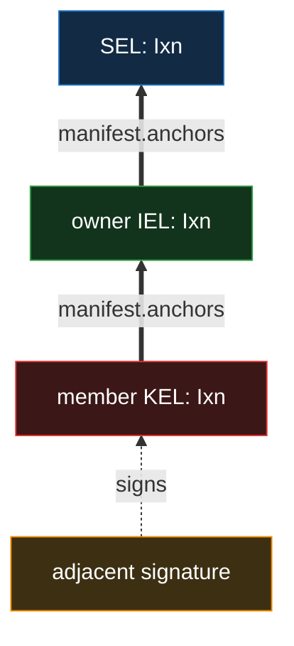
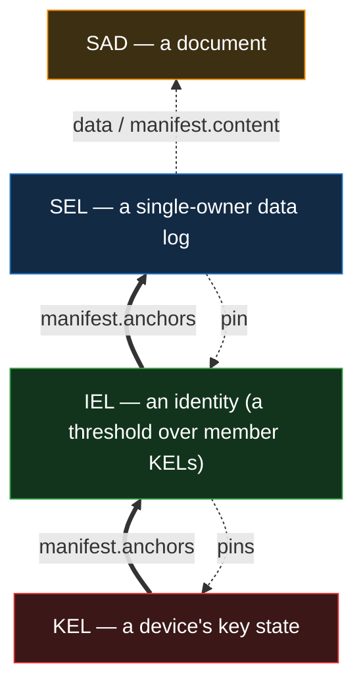
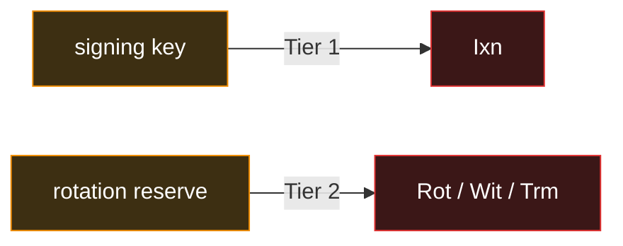
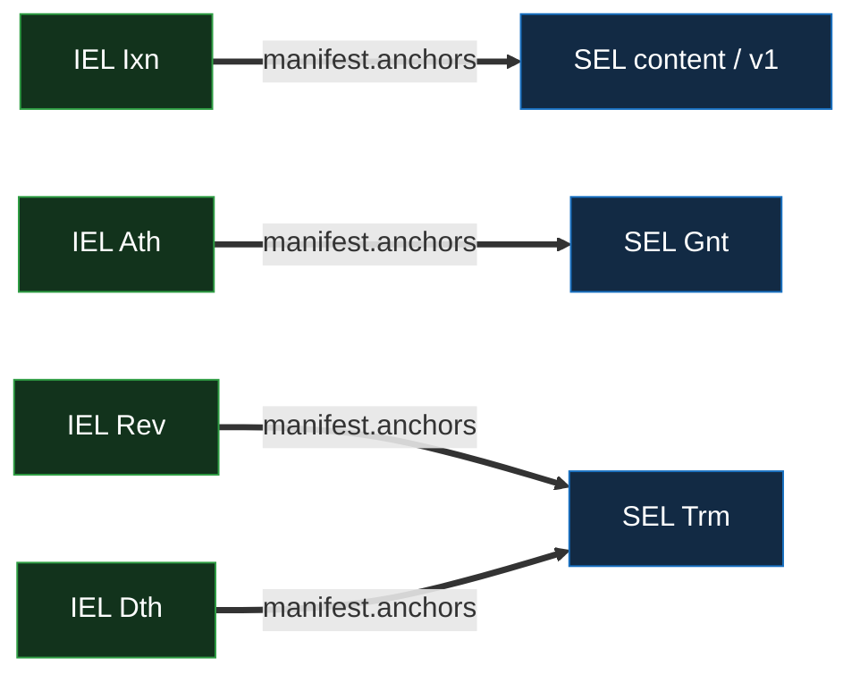
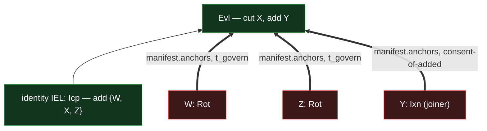
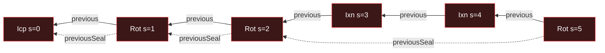
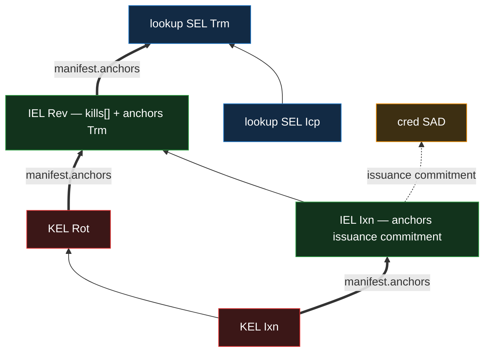

# Event Shape — KEL / IEL / SEL

Canonical reference for the event-log primitives' event taxonomy, field shape, and per-kind
structural-validation rules. The per-primitive docs reference this for the underlying shape;
doctrine specific to a primitive (the exact anchor matrix, divergence and recovery rules, federation
mechanics, prefix-derivation specifics) lives in the per-primitive docs and in
[`../../../protocol-doctrine.md`](../../../protocol-doctrine.md).

This is a **shape reference** — it states what fields exist, which kinds populate them, and how the
verifier enforces per-kind field rules. **Authorization is structural:** a KEL, IEL, or SEL event is
authorized by its own key state, its identity's threshold, or its owner. Policy is a property of
**documents**; see [`../../policy/policy.md`](../../policy/policy.md).

## Reading order

- [`kel/`](kel/) — KEL primitive specs. _(Per-primitive doctrine.)_
- [`iel/`](iel/) — IEL primitive. _(Per-primitive doctrine.)_
- [`sel/`](sel/) — SEL primitive. _(Per-primitive doctrine; forthcoming.)_
- [`../../../protocol-doctrine.md`](../../../protocol-doctrine.md) — cross-primitive doctrine:
  tiers, divergence and recovery, the seal bound, federation convergence, the verification walk.
- [`../../policy/policy.md`](../../policy/policy.md) — the document authorization layer (the policy
  language that lives on documents, not on these events).
- [`../sad/sad.md`](../sad/sad.md) — the SAD layer: chain events are SADs.

## Common fields

Five fields appear on every event across all log types. The per-kind shape (§Per-kind structural
validation) adds fields per kind.

| Field      | Type      | Description                                                                                                                                                                                                              |
| ---------- | --------- | ------------------------------------------------------------------------------------------------------------------------------------------------------------------------------------------------------------------------ |
| `said`     | Digest256 | Blake3-256 hash of the canonical event content (`said` set to the fixed-value placeholder, `prefix` populated real). Uniquely identifies the event.                                                                      |
| `prefix`   | Digest256 | Hash of the canonical event content (both `said` and `prefix` set to the placeholder). Identifies the **chain**, derived from the **whole-event content** — so two inceptions collide only under a Blake3-256 collision. |
| `serial`   | u64       | Chain position. Inception events have `serial == 0`; all others have `serial >= 1`, monotonic per branch.                                                                                                                |
| `previous` | Digest256 | SAID of the parent event. Forbidden at inception (no parent); required elsewhere.                                                                                                                                        |
| `kind`     | String    | Log-type × event-kind discriminator. Drives per-kind structural validation, tier dispatch, and the role vocabulary the event's `manifest` may carry.                                                                     |

Signatures are **not part of event content** — see
[§Authentication & signatures](#authentication--signatures).

## Authentication & signatures

Signatures are not part of the event content — events are pure SAD content. **A signature signs the
event's SAID** (its content digest), **not the full serialized event**; because the SAID is derived
from the whole content, signing it commits to the entire event. Keeping the signature **adjacent**
rather than embedded is also what avoids a cycle: the SAID is the hash of the content, so folding a
signature in would make the SAID depend on a signature taken over that same SAID.

- **KEL events** carry a **single** signature, authored when the event is authored. A content event
  (`Ixn`) is signed with the **signing key**; a **key change** (`Rot` / `Wit` / `Trm`) is signed
  with the **rotation reserve** — the key held apart from the signing key that the rotation reveals
  (you never sign with the key you are abandoning). There is no separate recovery key: healing a
  suspected signing-key leak is a plain rotation, and healing a fully compromised device is the
  identity's job (the other members vote it out via an IEL roster change).
- **IEL / SEL events** carry no adjacent signatures. They authenticate via their **KEL anchor** — a
  member's KEL event commits to the IEL event it participates in (and an IEL event commits to the
  SEL events it authorizes), and that KEL event's adjacent signature provides the authentication.
  The verifier walks from the IEL / SEL event to its anchoring event and validates the signature
  there.

This composition is what makes the two-tier capability model uniform across primitives — an IEL /
SEL operation inherits its authentication tier from the event that anchors it. See
[`../../../protocol-doctrine.md` §Tiers](../../../protocol-doctrine.md#tiers).

IEL and SEL events carry **no signature** of their own. Thick arrows are `manifest.anchors` (the
up-commit); a verifier reading the SEL event walks them **downward** — SEL → owner IEL → member KEL
— to that KEL event's **adjacent signature**, which authenticates the chain. The act's tier comes
from the anchoring kind (all `Ixn` here → tier 1).

## Structural authorization — the three mechanisms

Each primitive authorizes its own events structurally.

- **KEL — a device's own key.** A KEL event is authorized by the key state the chain itself commits:
  a signing key (tier 1) or a revealed rotation reserve (tier 2). The KEL is the root —
  self-authorizing, with no chain below it.
- **IEL — an identity's threshold vector over its member devices.** An IEL is a roster of member
  KELs plus a **threshold vector** `{t_use, t_govern, t_authorize}`, indexed by the kind of event
  being authored (below). It composes no multi-party policy internally; "who is this identity" is
  the roster, "how many must act for this kind of act" is the threshold vector.
- **SEL — single-owner ownership.** A SEL is owned by exactly one IEL. Its events are authorized by
  that owner IEL: the owner's IEL event anchors the SEL event (commits to its SAID), and the
  required count is set by the SEL event's kind. A SEL hosts no roster of its own.

The composition stack. Each layer **commits up** to the one above via `manifest.anchors` (thick) and
**pins down** to the one below (dotted); a SEL names its documents by `data` / `content`. Authority
resolves **down** the anchor chain to a KEL signature; the as-of / freshness floors **down** the
pins.

**The threshold vector and its bounds.** Each IEL kind draws its required count from one slot of the
vector: content (`Ixn`) from `t_use`; a roster/threshold change (`Evl`), a revocation (`Rev`), a
federation rebind (`Wit`), and the terminal `Trm` from `t_govern`; an authorization (`Ath`) and a
deauthorization (`Dth`) from `t_authorize`. Every kind draws from exactly one slot, so an IEL
chain's validity needs no higher-layer input.

The slots carry bounds — `t_use >= 1`; a **security floor** (`>= 2`) and **recoverability ceiling**
(`<= |roster| − 1`) on the authority slots; the **authorization floor** (`> |roster|/2`); the roster
**cap of 32** and the **never-emptied** floor (`|roster| + |add| − |cut| >= 1`); and, for a
federation, the witness-config recoverability cap — all re-checked on the post-delta config at
**every** config-changing event, not only inception. The bounds and their derivations are the IEL
primitive's:
[`iel/events.md` §The threshold vector and its bounds](iel/events.md#the-threshold-vector-and-its-bounds).

The per-kind threshold/tier mapping and the bound derivations are the IEL primitive's —
[`iel/`](iel/). The credential acceptance and authorizing conditions that ride **above** this — on
documents — are the policy layer's ([`../../policy/policy.md`](../../policy/policy.md)).

## The manifest — what an event commits to, grouped by role

An event commits to the things above it through a **`manifest`**: the SAID of a SAD that groups
those commitments **by named role**. The manifest SAD reads
`{ said, <role>: <said-or-list-or-scalar>, … }`, and each role reads as "the things this event
{anchors / roster / delegates / kills / …}." The event row holds only the manifest SAID; the grouped
commitments live in the SAD, separately custody-able. A role value is either an **inline list** of
SAIDs/prefixes — `anchors` / `content` / `delegates` / `kills` — a **single SAID** naming a further
structured SAD (`roster`, `witnesses`), or a **direct scalar** (the federation `clock` — an inline
timestamp value, the lone non-SAID role).

**Role vocabulary:**

| Role        | Carried by                                                                    | Commits to                                                     |
| ----------- | ----------------------------------------------------------------------------- | -------------------------------------------------------------- |
| `anchors`   | KEL `Ixn` (≥ 1) / `Rot` / `Wit`; IEL `Ixn` / `Ath` / `Rev` / `Dth`; SEL `Trm` | higher-layer SAIDs (the general "we commit to this" role)      |
| `roster`    | IEL `Icp` / `Evl`; federation `Fcp` / `Wit`                                   | the roster **delta** / threshold SAD SAID                      |
| `delegates` | IEL `Ath`                                                                     | delegate **prefixes** (act for the delegator)                  |
| `grant`     | SEL `Gnt`                                                                     | the grant-doc SAD SAID                                         |
| `content`   | SEL `Ixn`                                                                     | the content-SAD SAIDs the `Ixn` records                        |
| `kills`     | IEL `Rev` / `Dth`                                                             | the revocation / rescission declaration `[{ target, bound? }]` |
| `witnesses` | KEL / IEL `Icp` / `Wit`; federation `Fcp` / `Wit`                             | the witness-config SAD SAID                                    |
| `clock`     | federation `Fcp` / `Wit` / `Trm`                                              | the federation-clock timestamp (inline, non-SAID)              |

The roles that carry discrimination or shape rules, in prose:

- **`anchors`** is the one anchoring vocabulary, discriminated by the **anchored event's kind**, not
  a label — kind-strict both ways: a KEL `Wit` anchors the IEL `Wit`; an IEL `Ixn` anchors content
  SEL **v1s** (the `Icp` rides `v1.previous`, never itself anchored) **and** a credential's
  **issuance commitment** `hash('{CRED_ISSUANCE_TOPIC}:{issuer}:{cred.said}')` (an immutable SAD, no
  credential-SEL — the anchor is the validity proof); `Ath` → SEL `Gnt`; `Rev` → SEL `Trm`
  (revocation); `Dth` → SEL `Trm` (rescission).
- **`roster`** is a **delta**, never a snapshot (`{ add, cut, changed thresholds }`): `add` is a
  list on the user kinds and a **single** prefix on a federation `Wit`; a `cut` `Evl` carries a
  **required non-empty `cut`** + optional `threshold`, **never** an `add`.
- **`delegates`** is a positive inclusion list; the same `Ath` may also carry `anchors` (a `Gnt`) —
  the two roles are independent.
- **`grant`** names the grant-doc: the `editors` / `commenters` and their `from` validity-period
  starts that the `Gnt` opens.
- **`kills`** is the revocation / rescission **declaration** — a flat list `[{ target, bound? }]`
  carried **alongside** `anchors[]` (two separate roles: `anchors` names the sealing `Trm`, `kills`
  names _what_ is revoked). `target = hash('{topic}:{owner}:{data}')` — a flat, domain-qualified
  hash the verifier computes directly and forward-matches; `bound` (rescission only) is the
  grandfather cutoff. **`kills` is opaque to the IEL** — placement (kind-strict to the tier-2 `Rev`
  / `Dth`) is the only structural rule; the IEL never dereferences a target or interprets a bound
  (all revocation / grandfather logic is the feature layer's).
- **`witnesses`** is mandatory iff federated at inception and present-iff-changed on a `Wit`; its
  `threshold` sits above a **witnessing floor** (`threshold > signers/2`), and it gates a user IEL's
  content events at their own position
  ([§Federation convergence](../../../protocol-doctrine.md#federation-convergence)).

**Top-level structural vs. manifest.** An event's _own links_ stay top-level: `said`, `previous`,
**`previousSeal`** (on every seal-advancing event — the back-link to the prior seal that renders the
spine; see [§Divergence is scoped to content](#divergence-is-scoped-to-content) and
protocol-doctrine §Forks are Seal-Bounded), the down-pins (`pin` on a SEL, `pins` on an IEL), the
federation `prefix`, `federationPin`. The `manifest` (role-labeled) carries everything the event
_commits to above it_ — higher-layer event SAIDs and documents. Entities are named by **prefix**;
positions and documents by **SAID**. A SAID here is an integrity **commitment**, not a lookup key —
there is no global SAID→event index, so a SAID harvested off a public manifest does not invert to a
(possibly private) chain's prefix for any party outside the federation mesh; logs are fetched by
prefix
([`../../../protocol-doctrine.md` §Negative checks are positive lookups](../../../protocol-doctrine.md#negative-checks-are-positive-lookups)).

**Read the manifest kind-first.** Each kind may carry **only** the roles in its closed vocabulary
(the table above); a manifest carrying any role outside its kind's vocabulary is **malformed →
rejected**, and a role is consumed only after dispatching on a kind permitted to carry it. The
manifest SAID commits the role labels (the hash is over the keys), so a third party cannot relabel a
fixed event; the kind→role allowlist closes _author_-mislabel. This is load-bearing for the
directly-consumed roles (`roster`, `delegates`, `witnesses`, `clock`, `kills`) — they have no
downstream type-check, so the allowlist is their sole protection (a `kills` on a tier-1 `Ixn` is
malformed → rejected, closing declare-a-revoke-at-`t_use`). The back-checked role `anchors` is
additionally caught when each referenced event is validated against its required kind — the anchor
matrix is **kind-strict** both directions: an IEL `Rev`'s or `Dth`'s anchors resolve **only** to SEL
`Trm`s, an IEL `Ixn`'s only to content SEL v1s or a credential's issuance commitment, and neither
the reverse.

## Cross-cutting fields

Beyond the common fields, these appear on multiple kinds with consistent meaning. **Logs** names the
subset of {KEL, IEL, SEL} the field appears on; **Events** the kinds that carry it. A cell's `fbd`
means **forbidden** (the field must be unset); the full `req` / `fbd` / `opt` legend is in
[§Per-kind structural validation](#per-kind-structural-validation).

| Field           | Type      | Logs          | Events                                                                                                                                                                                                                                                                                                                         | Description                                                                                                                                                                                          |
| --------------- | --------- | ------------- | ------------------------------------------------------------------------------------------------------------------------------------------------------------------------------------------------------------------------------------------------------------------------------------------------------------------------------ | ---------------------------------------------------------------------------------------------------------------------------------------------------------------------------------------------------- |
| `manifest`      | Digest256 | KEL, IEL, SEL | KEL `Icp` / `Ixn` / `Rot` / `Wit`; IEL `Icp` / `Fcp` / `Ixn` / `Evl` / `Ath` / `Rev` / `Dth` / `Trm` / `Wit`; SEL `Ixn` / `Gnt` / `Trm`                                                                                                                                                                                        | SAID of the role-grouped commitment SAD (above).                                                                                                                                                     |
| `previousSeal`  | Digest256 | KEL, IEL, SEL | the **sealing** kinds (KEL `Rot`/`Wit`/`Trm`; IEL `Evl`/`Ath`/`Rev`/`Dth`/`Trm`/`Wit`; SEL `Gnt`/`Trm`)                                                                                                                                                                                                                        | Back-link to the prior seal-advancing event; renders the **spine** ([§Divergence is scoped to content](#divergence-is-scoped-to-content)). `fbd` on `Icp` / `Fcp` / `Ixn` (and the SEL floor `Pin`). |
| `federation`    | Digest256 | KEL, IEL      | KEL `Icp` (req on a user KEL) / `Wit`; user IEL `Icp` (req) / `Wit` — present-iff-changed on `Wit` (only on a rebind)                                                                                                                                                                                                          | The federation IEL **prefix** a chain / identity binds to (_which_ federation).ᵃ                                                                                                                     |
| `federationPin` | Digest256 | KEL, IEL      | KEL `Icp` (req on a user KEL); **opt on `Wit` + every KEL body event** (`Ixn`/`Rot`/`Trm`) — present-iff-re-pinned; user IEL `Icp` (req); **opt on `Wit` + every user IEL body event** (`Ixn`/`Evl`/`Ath`/`Rev`/`Dth`/`Trm`) — a same-federation re-pin advances only `federationPin` (a rebind of `federation` needs a `Wit`) | A **SAID** pinning the as-of federation position (_as of when_).ᵇ                                                                                                                                    |
| `pin`           | Digest256 | SEL           | `Ixn` / `Gnt` / `Pin` / `Trm` (req); **`fbd` on `Icp`**                                                                                                                                                                                                                                                                        | SAID of the owner IEL event the SEL floors **down** to (its down-pin); `fbd` on `Icp` — the first pin rides the SEL's serial-1 event (SEL taxonomy above).                                           |
| `pins`          | Digest256 | IEL           | every IEL kind (`Icp`/`Ixn`/`Evl`/`Ath`/`Rev`/`Dth`/`Trm`/`Wit`)                                                                                                                                                                                                                                                               | SAID of a SAD listing the participating member **KEL event SAIDs** — the IEL's **down-pins**.ᶜ                                                                                                       |
| `nonce`         | Nonce256  | IEL           | `Icp`                                                                                                                                                                                                                                                                                                                          | Opaque random bytes chosen by the inceptor; makes the IEL prefix unpredictable. Required at inception, forbidden elsewhere.                                                                          |
| `owner`         | Digest256 | SEL           | `Icp`                                                                                                                                                                                                                                                                                                                          | The **owner IEL prefix** — which IEL owns this SEL; `Icp`-only and **immutable**; participates in the SEL prefix derivation.                                                                         |
| `topic`         | String    | SEL           | `Icp`                                                                                                                                                                                                                                                                                                                          | Application discriminator; participates in the SEL prefix derivation.                                                                                                                                |
| `data`          | Digest256 | SEL           | `Icp` (opt)                                                                                                                                                                                                                                                                                                                    | The recompute input a lookup SEL roots on (the whole reference; the `Icp` carries no manifest). Optional; participates in the SEL prefix derivation.ᵈ                                                |

- ᵃ **`federation`** — the identity's authoritative binding lives on its IEL `Icp` / `Wit`; each
  member KEL's is field-matched to it (kind-strict `Wit ↔ Wit`); a SEL inherits its owner IEL's; a
  federation IEL carries neither field (it _is_ the federation, never self-bound). Every identity is
  federation-witnessed — **there is no direct mode** (a user `Icp` omitting the binding is malformed
  → rejected).
- ᵇ **`federationPin`** — present = a forward re-pin within the inherited federation; absent =
  inherit the prior pin (a same-federation re-pin rides the next KEL body event; `Wit` is reserved
  for a **rebind** — changing the `federation` prefix or `witnesses`).
- ᶜ **`pins`** — the complement of fresh-participation up-anchoring (a federation `Wit`'s are the
  witness KELs); every IEL event is anchored by a threshold of members, so every one carries it
  (schema is IEL doctrine — [`iel/`](iel/)).
- ᵈ **`data`** — for a lookup SEL, `data` is the recompute input (a revocation / rescission locus:
  the grant-instance); absent for an `owner` + `topic`-only SEL.

The KEL key-state fields (`publicKey`, `rotationHash`) and the witness-config SAD are KEL-specific —
see [`kel/`](kel/).

## Tiers — the two-tier capability model

**Tier** names the cryptographic capability required to forge an event, set by
**danger-or-permanence**, and is **orthogonal to count** (the threshold vector). It is dispatched
from the event kind, never stored: **tier 1** is content, forged with the **signing key** (an `Ixn`,
even at a high `t_use`); **tier 2** is every key change and every sealed act — establishment,
authority-grant, any sealed kill, federation binding, the terminal — forged with the **rotation
reserve**, held apart from the signing key (the **old signing key is not a prerequisite**). Key
state is a **single-stream pre-rotation**: the reserve committed at one epoch is revealed to sign
the next key change and becomes that epoch's signing key, so a device holds exactly two live keys —
the current signing key and the next reserve.

The full tier model — danger-or-permanence, the kill-as-permanence case, and the **kind-strict**
anchor rule (each IEL / SEL kind is anchored by exactly the KEL / IEL kind that reveals the matching
capability, no higher-tier stand-in) — is the protocol doctrine's —
[`../../../protocol-doctrine.md` §Tiers](../../../protocol-doctrine.md#tiers).

## Event taxonomy

### KEL — 5 kinds (+ the founder `Fcp` inception variant)

| Kind  | Tier | Sig    | Role                                                                                                                |
| ----- | ---- | ------ | ------------------------------------------------------------------------------------------------------------------- |
| `Fcp` | 1    | single | Founder **pre-federation** inception (self-attested; its v=1 `Rot` anchors the federation `Fcp`).                   |
| `Icp` | 1    | single | Standard inception — **federation-bound** (there is no direct mode).                                                |
| `Ixn` | 1    | single | Content; anchors higher-layer SAIDs (`anchors`, ≥ 1). **The divergeable content kind** (first-seen, buriable).      |
| `Rot` | 2    | single | Rotation — reveals the next signing key, commits the next reserve; signed with the reserve. **Seal-advancing.**     |
| `Wit` | 2    | single | Federation (re)bind (user KEL) / federation **governance** (witness KEL); **is** the rotation. **Seal-advancing.**ᵃ |
| `Trm` | 2    | single | **Terminal.**                                                                                                       |

- ᵃ **`Wit`** — the one witness/federation kind: on a user (`Icp`-rooted) KEL it changes
  `federation` and/or `witnesses` and anchors the user IEL `Wit`; on an `Fcp`-rooted witness KEL it
  is federation governance (anchors the federation IEL `Wit`, never self-bound). It **is** the
  rotation (refreshes the signing key + reserve).

A KEL has **one inception root**: either a founder **`Fcp → Rot`** pair (a pre-federation founder
anchoring the federation IEL `Fcp` it helps incept) **or** a standalone **`Icp`** (joining an
existing federation) — **never** `Fcp → Icp`. A pre-federation `Fcp` is **self-attested**, carries
**no `witnesses`** (there is no federation yet to witness it — which keeps the federation IEL's own
bootstrap non-circular), and **cannot stand alone**: its v=1 is a **`Rot`** that anchors the
federation IEL's **`Fcp`** marker (kind-strict, tier-2 → tier-2) in the **same atomic batch** (`Fcp`
v=0 → `Rot` v=1). **Recovery is a plain `Rot`** — rotate at the first compromised position; the
thief's run below dies by descent (§Divergence is scoped to content). The full ceremony is KEL +
federation doctrine — [`kel/`](kel/), [`federation/`](../../../federation/).

### IEL — 8 kinds (+ the federation `Fcp` marker)

| Kind  | Tier | Count                                      | Role                                                                                                                                                                                                                                   |
| ----- | ---- | ------------------------------------------ | -------------------------------------------------------------------------------------------------------------------------------------------------------------------------------------------------------------------------------------- |
| `Icp` | 2    | all initial members consent                | Inception — pins the initial roster + threshold vector, federation binding, and `witnesses`. A **federation IEL** incepts the `Fcp` marker instead (below).                                                                            |
| `Ixn` | 1    | `t_use`                                    | Content; anchors content SEL events, each SEL's serial-1 **v1**, **and a credential's issuance commitment** (an immutable SAD, no credential-SEL), batched. **The divergeable content kind** (first-seen, buriable).                   |
| `Evl` | 2    | all added consent ∧ `t_govern` of outgoing | **Evolve state** — a roster/threshold **delta** (`roster`); a `cut` `Evl` **evicts** (buries a fork and evicts in one sealing event); no kills.ᵃ                                                                                       |
| `Ath` | 2    | `t_authorize`                              | **Authorize a party to act** — `delegates` (act **for**) and/or `anchors` a SEL `Gnt` (act **as itself**). **Forces a `Rot`; sealed on arrival, seal-advancing.**ᵇ                                                                     |
| `Rev` | 2    | `t_govern`                                 | **Revoke** — kill-anchor for an **owned** artifact (anchors a SEL `Trm` + a `kills[]` declaration). **Forces a `Rot`; sealed on arrival; non-terminal.**ᶜ                                                                              |
| `Dth` | 2    | `t_authorize`                              | **Deauthorize** — kill-anchor for a **granted authorization** (anchors a SEL `Trm` + a `kills[]` declaration); the polarity-inverse of `Ath`. **Forces a `Rot`; sealed on arrival; non-terminal.**ᵈ                                    |
| `Trm` | 2    | `t_govern`                                 | **Terminal** — freezes all the IEL's SELs.                                                                                                                                                                                             |
| `Wit` | 2    | `t_govern`                                 | **Federation rebind** (`federation` / `federationPin` + `witnesses`); anchored by member KEL `Wit`s (kind-strict, T2 ↔ T2). `{Wit, Wit}` terminal. The **one** witness/federation kind; on a federation IEL it is governance (below). |
| `Fcp` | 2    | all founders consent                       | **Federation inception marker** _(federation IEL only)_ — the federation IEL's `Icp`; anchored kind-strict by each founder's KEL `Rot` (T2 ↔ T2). See the restricted-IEL note below.                                                  |

- ᵃ **`Evl`** — the `roster` delta is `add` + `cut`; added members consent at tier 1 via their own
  KEL anchor, the binding authorization tier 2 from the continuing quorum; anchors no kills (those
  ride `Rev` / `Dth`). Evicting a compromised / divergence-causing member is a `cut` `Evl` — one
  sealing event buries the fork **and** evicts, atomically (there is no separate repair event).
- ᵇ **`Ath`** — `delegates` is a positive inclusion list of delegate prefixes; `anchors` is
  kind-strict (names **only** `Gnt`s). Both roles are permitted at once.
- ᶜ **`Rev`** — carries no roster delta; the forced `Rot` gives the permanent act a ≥ tier-2 KEL
  anchor. Non-terminal — it seals a kill on a _target_, not its host chain, so a `{Rev, content}`
  fork stays recoverable.
- ᵈ **`Dth`** — its `kills[]` entry carries the rescission `bound` (a delegate's public, a
  doc-member's gated); non-terminal like `Rev`.

A federation is a **restricted IEL** rooted at an **`Fcp`** inception marker — `Fcp` / `Wit` / `Trm`
only (`Wit` is its governance kind — witness rotation and/or a roster delta — replacing the user
`Evl`; no `Ixn`, so it authors no content and every federation conflict is sealed → terminal; no
`Ath`, since trust is per-federation and non-transitive). Its roster is witness KELs directly. See
[`../../../protocol-doctrine.md` §Federation convergence](../../../protocol-doctrine.md#federation-convergence)
and [`federation/`](../../../federation/).

### SEL — 5 kinds

| Kind  | Count                                                | Tier | Anchored by (IEL)                | Role                                                                                                                                                                        |
| ----- | ---------------------------------------------------- | ---- | -------------------------------- | --------------------------------------------------------------------------------------------------------------------------------------------------------------------------- |
| `Icp` | `t_use`                                              | 1    | — (never anchored; v1 is)        | Inception — no `pin`, no manifest; **never itself anchored** (its v1 is).ᵃ                                                                                                  |
| `Ixn` | `t_use`                                              | 1    | `Ixn`                            | Content SAD(s) + re-`pin`; ≤ 1 per SEL per IEL `Ixn`. **Divergeable, buriable** (as is the floor `Pin`).                                                                    |
| `Pin` | `t_use`                                              | 1    | `Ixn`                            | The **floor re-pin** to the owner IEL's current tip (top-level `pin` only). The **serial-1 issuance floor** (the `Icp` can't hold a pin). Buriable; **not** seal-advancing. |
| `Gnt` | `t_authorize`                                        | 2    | `Ath`                            | The doc-membership **grant** — opens editor / commenter periods. **Sealed on arrival, seal-advancing, non-buriable.**ᶜ                                                      |
| `Trm` | `t_govern` (revocation) · `t_authorize` (rescission) | 2    | `Rev` (revoke) / `Dth` (rescind) | The SEL **kill**. **Sealed on arrival.**ᵇ                                                                                                                                   |

- ᵃ **`Icp`** — stays recomputable for lookup (§Prefix derivation); the SEL's **serial-1 event (its
  v1)** is what an IEL `Ixn` anchors, the `Icp` riding `v1.previous` (a bare `Pin` for
  issue-and-sit, else the first event). A lookup SEL's `data` is the recompute input (the
  grant-instance). A **credential is not a SEL** — it is a direct-anchored SAD (§Prefix derivation).
- ᵇ **`Trm`** — the SEL kill, sealed by an IEL `Rev` (`t_govern`, a governed kill) or `Dth`
  (`t_authorize`, which rescinds what an `Ath` granted). The `Rev` / `Dth` also carries the
  `kills[]` declaration naming the killed locus; a rescission's `bound` rides that `kills[]` entry
  (delegate public, doc-member gated). Monotone — no delayed form; the killed thing = which SEL its
  `Trm` extends. The identity-kill is the same-named KEL / IEL `Trm`, a different variant. Its
  current applications (credential revocation; delegation and doc-membership rescission) live in the
  `features/` layer, not this primitive.
- ᶜ **`Gnt`** — the additive twin of `Trm`; kind-strict (an `Ath` anchors only `Gnt`s); walked back
  by a rescission (`Dth` → SEL `Trm`) or reincept, never overturned; doc-membership SELs only.

Content rides the IEL `Ixn` rail (tier 1); a kill rides the IEL `Rev` / `Dth` rail (tier 2, sealed);
a grant rides the IEL `Ath` rail (tier 2, sealed); roster/threshold changes ride the IEL `Evl` rail.
A SEL's **trust-finality** floors to the owner IEL's seal — a plain content SEL has no seal of its
own; its sealing kinds (`Gnt` / `Trm`) cap its **local divergence window** and carry `previousSeal`
like any spine, while a content fork on a plain SEL resolves cross-layer (the owner IEL's burying
seal drops the loser, and the dead line descends across the anchor edge). Credential issuance,
revocation, and status are a **feature** layered on the SEL primitive —
[`features/credentials/`](../../../features/credentials/); multi-party co-authored documents are
another — [`features/multi-party/documents.md`](../../../features/multi-party/documents.md) _(both
forthcoming)_.

The anchor matrix — each IEL kind anchors **only** its matching SEL kind(s) (kind-strict); the two
kill-anchors `Rev` / `Dth` both seal an SEL `Trm`, discriminated by the SEL's type:

## Per-kind structural validation

The verifier enforces per-kind field rules: **req** (must be set), **fbd** (must be unset), **opt**
(may be either). Common fields (`said`, `prefix`, `kind`) are always required; `previous` is
forbidden on inception kinds and required elsewhere; `serial` is 0 on inception, `>=1` elsewhere;
signatures live adjacent (§Authentication & signatures).

### KEL

| Kind  | publicKey | rotationHash | federation | federationPin | previousSeal | manifest                         |
| ----- | --------- | ------------ | ---------- | ------------- | ------------ | -------------------------------- |
| `Fcp` | req       | req          | fbd        | fbd           | fbd          | fbd                              |
| `Icp` | req       | req          | req        | req           | fbd          | req (`witnesses`)                |
| `Ixn` | fbd       | fbd          | fbd        | opt           | fbd          | req (`anchors`, ≥1)              |
| `Rot` | req       | req          | fbd        | opt           | req          | opt (`anchors`)                  |
| `Wit` | req       | req          | opt\*      | opt\*         | req          | req (`anchors`; `witnesses` opt) |
| `Trm` | req       | fbd          | fbd        | opt           | req          | fbd                              |

Every KEL key change (`Rot` / `Wit` / `Trm`) is **single-signed with the rotation reserve**
(§Authentication & signatures). A **user** `Icp` is **federation-bound** — `federation` /
`federationPin` are **required** and `witnesses` is **mandatory** (there is no direct mode); a
founder **`Fcp`** is self-attested and carries none of them. **\*The `Wit` row is the user
(`Icp`-rooted) facet** — the federation rebind, `federation` / `federationPin` **present-iff-changed
(`opt`)** (present on an actual rebind / re-pin; a witness-config-only `Wit` carries neither); on an
**`Fcp`-rooted federation-witness `Wit`** (federation governance) both are **fbd** — the witness is
never self-bound. Exact key-state semantics, the witness-config SAD, and the facet doctrine are
KEL + federation doctrine — [`kel/`](kel/), [`../../../federation/`](../../../federation/).

### IEL

| Kind  | nonce | pins | previousSeal | manifest                                                                             |
| ----- | ----- | ---- | ------------ | ------------------------------------------------------------------------------------ |
| `Icp` | req   | req  | fbd          | req (`roster`; `witnesses` mandatory iff federated; a federation `Fcp` adds `clock`) |
| `Ixn` | fbd   | req  | fbd          | req (`anchors`)                                                                      |
| `Evl` | fbd   | req  | req          | opt (`roster`)                                                                       |
| `Ath` | fbd   | req  | req          | req (`delegates` and/or `anchors`)                                                   |
| `Rev` | fbd   | req  | req          | req (`anchors`, `kills`)                                                             |
| `Dth` | fbd   | req  | req          | req (`anchors`, `kills`)                                                             |
| `Trm` | fbd   | req  | req          | opt (a federation `Trm` carries `clock` req)                                         |
| `Wit` | fbd   | req  | req          | opt (`witnesses`; a federation `Wit` adds `clock` req + `roster` opt)                |
| `Fcp` | req   | req  | fbd          | req (`roster` + `witnesses` + `clock`) — federation IEL inception marker             |

A **user IEL `Icp`** mirrors the KEL `Icp` on the federation binding: `federation` / `federationPin`
are **required** (there is no direct mode) and `witnesses` is **mandatory**; on a `Wit` all three
are **present-iff-changed** (a field is carried only when it changes). The `nonce` (inception only)
drives prefix unpredictability (§Prefix derivation). `pins` is the IEL's top-level **down-pins** — a
scalar SAID naming a small SAD of the participating member **KEL event SAIDs** (a federation `Wit`'s
are the witness KELs); every IEL event is anchored by a threshold of members, so every IEL event
carries it. On a `cut` `Evl`, `roster` carries a **non-empty `cut` + an optional `threshold`**,
never an `add`. The kind→role allowlist gates the role's _presence_; the delta shape is checked
per-kind. The exact roster delta SAD and pins-SAD schemas, the consent rule for additions, and the
per-kind anchor matrix are IEL doctrine — [`iel/`](iel/).

### SEL

| Kind  | owner | topic | data | pin | previousSeal | manifest        |
| ----- | ----- | ----- | ---- | --- | ------------ | --------------- |
| `Icp` | req   | req   | opt  | fbd | fbd          | fbd             |
| `Ixn` | fbd   | fbd   | fbd  | req | fbd          | opt (`content`) |
| `Pin` | fbd   | fbd   | fbd  | req | fbd          | fbd             |
| `Gnt` | fbd   | fbd   | fbd  | req | req          | req (`grant`)   |
| `Trm` | fbd   | fbd   | fbd  | req | req          | opt (`anchors`) |

`owner` (the owner IEL prefix, immutable — `Icp` only), `topic`, and `data` participate in the SEL
prefix derivation (§Prefix derivation), so the `Icp` carries **no `pin`**: a pin field would make
the prefix non-recomputable for lookup. The SEL's down-pin to its owner IEL therefore rides a
**serial-1 event** — a bare **`Pin`** batched with the `Icp` when inception carries no other first
event (issue-and-sit), otherwise the first event itself (a lookup SEL's v1 is its `Trm`) — and
re-pins on each `Ixn`. The exact SEL shapes are SEL doctrine — [`sel/`](sel/) _(forthcoming)_.

## Anchoring — committing up, flooring down

An event commits to the layer that depends on it through its `manifest`, and the dependent floors
back down to its authority's current tip:

- A **KEL** event anchors the **IEL** events it authorizes (the IEL event's SAID rides in the KEL
  event's `manifest.anchors`); the IEL event authenticates via that KEL event's signature. A member
  participates in an IEL event by authoring a **fresh KEL event at its own current tip**, of
  **exactly** the kind that reveals the capability the act exercises (**kind-strict**): content ←
  `Ixn`; tier-2 establishment / governance / kill / terminal ← `Rot` (incl. the federation `Fcp`
  inception, and the IEL / federation `Trm`); the federation binding (the IEL `Wit`) ← `Wit`. No
  higher-tier stand-in. A rotated-out key cannot produce one, which closes the rotated-out-member
  backdate.
- An **IEL** event anchors the **SEL** events it authorizes — an `Ixn` for content and each SEL's
  serial-1 **v1** (the `Icp` rides `v1.previous`, never itself anchored) **and** a credential's
  **issuance commitment** (a flat hash, not a SEL event); a `Rev` / `Dth` for the SEL `Trm`s they
  seal (`Rev` a credential revocation, `Dth` a rescission); an `Ath` for a SEL `Gnt` — each via
  `anchors`, **kind-strict** (each SEL kind is valid only when anchored by its matching IEL kind,
  and each IEL kind anchors only its matching SEL kinds). The SEL event floors down to the owner IEL
  tip via its `pin`, carried on its serial-1 event — a bare `Pin` when inception batches no other
  first event, otherwise the first event itself (the `Icp` stays pin-free for recomputability). The
  as-of authority is the **anchoring position** — the committing IEL event, append-only — so it
  cannot select a more permissive past ([`../../policy/documents.md`](../../policy/documents.md)).

A device swap makes this concrete: replacing device X with Y is an IEL `Evl` carrying a roster delta
(`cut X, add Y`). The continuing `t_govern` members (W, Z) each author a KEL `Rot` that anchors the
`Evl` — a tier-2 governance act, each revealing a rotation reserve — while the joining device Y
consents via a KEL `Ixn` (counted toward consent-of-added, never toward `t_govern`):

The `Icp`→`Evl` arrow is chain order; thick arrows are `manifest.anchors` — each a continuing
member's KEL `Rot` (tier-2 governance); `consent-of-added` is the joiner's KEL `Ixn`.

The per-kind anchor matrix (which KEL kind anchors which IEL kind; the per-kind count
backing-and-demand check) and the forward-only floor are per-primitive and protocol doctrine —
[`kel/`](kel/), [`iel/`](iel/), [`sel/`](sel/) _(forthcoming)_, and
[`../../../protocol-doctrine.md`](../../../protocol-doctrine.md).

## Divergence is scoped to content

Only **content** is **buriable** — the content kind `Ixn`, and on the SEL the tier-1 floor `Pin`. A
**sealed** event (a rotation, an `Evl`, an `Ath` / `Rev` / `Dth`, a terminal) is **never** buried or
overturned — reversing it would resurrect retired key material or un-do a sealed act. So a
divergence resolves by **tier**: a content fork is recoverable (a burying seal-advancer buries the
loser by position + descent), while a fork with **≥ 2 sealed branches** past it is terminal — a
**branch-level** condition any verifier reads **data-locally** by walking the retained branches. The
retention bounds, the burial-by-descent mechanics, and the full recovery doctrine are the protocol
doctrine's — [§Divergence and recovery](../../../protocol-doctrine.md#divergence-and-recovery).

What `event-shape` owns here is the field that makes this legible: the seal-advancing events form a
`previousSeal`-linked **spine**, on which a sealed divergence — held across retained branches —
shows up as a single fork, while content stays off the spine.

The two views over one dataset — the **flat** walk following `previous` (every event) and the
**folded** spine following `previousSeal` (seal-advancers only) — look like:

Solid `previous` links render the flat chain; dashed `previousSeal` links render the spine, which
jumps the content run (`Ixn` s=3, s=4) from `Rot` s=2 straight to `Rot` s=5 — so a sealed divergence
is one visible spine fork while content stays off the spine. The full divergence-and-recovery
doctrine is the protocol doctrine's —
[`../../../protocol-doctrine.md` §Divergence and recovery](../../../protocol-doctrine.md#divergence-and-recovery).

## Prefix derivation is whole-content

A prefix derives from the **entire** inception body — not a special tuple; whatever fields the
inception populates participate. The fixed-value-placeholder mechanic that keeps this re-derivable
is [`said.md` §Derivation](../sad/said.md#derivation)'s; each log doc states which fields its own
inception populates.

- **KEL**: the device's key state. The prefix is the device-key commitment.
- **IEL**: the roster + threshold vector + the `nonce`. The `nonce` makes the prefix
  **unpredictable** from outside (a camping / prefix-squatting defense) — so an IEL is located only
  by parties told its prefix.
- **SEL**: the populated inception fields — `owner` (the owner IEL prefix), `topic`, and `data`.
  (Writing it `derive(owner, topic, data)` is shorthand for _constructing that inception and taking
  its prefix_, **not** a hash of those three values pulled into a separate tuple — the prefix is the
  whole-content digest like every other event, so any field on the `Icp` enters it.) A lookup SEL's
  `data` is its recompute input (a revocation / rescission grant-instance), so a re-grant after a
  kill gets a fresh locus; a private lookup SEL's `data` is high-entropy, keeping the prefix
  unguessable, while a discoverable one rests on **owner-rooting** (only the owner IEL anchors at
  the locus), not on prefix secrecy. Because lookup **recomputes** this prefix, the `Icp` must hold
  only fields the looker-up already has — so it carries **no `pin`** (the pin rides a batched
  serial-1 event instead).

A **credential is not a SEL** — it is an immutable SAD the issuer **direct-anchors** by its
**issuance commitment** `hash('{CRED_ISSUANCE_TOPIC}:{issuer}:{cred.said}')` on an IEL `Ixn` (the
anchor is the validity proof). `cred.said` appears **nowhere raw** on the public IEL — the issuance
commitment, the revocation kill target, and the revocation lookup SEL's prefix/said are all hashes
of it — so a private credential's status stays private (its `cred.said` is high-entropy via the body
`nonce`) while a public credential's is correctly public. The custody rule: **direct-anchor an
immutable SAD that is presented; SEL-wrap anything mutable or looked-up-by-address**
([`../sad/custody.md`](../sad/custody.md)).

The verifier reconstructs the prefix from canonical serialization and rejects any event whose
computed prefix doesn't match its declared `prefix`.

## Batching requirements

Some kinds land only as part of a multi-event atomic batch, enforced at the merge layer:

- **Credential issuance** — the issuer anchors the credential's **issuance commitment**
  `hash('{CRED_ISSUANCE_TOPIC}:{issuer}:{cred.said}')` under an IEL `Ixn`'s `manifest.anchors` (an
  immutable SAD, no credential-SEL — the anchor is the validity proof); one IEL `Ixn` may batch many
  issuances.
- **A SEL kill** — a revocation lookup-SEL `Trm` is anchored by an IEL `Rev`, and a rescission
  lookup-SEL `Trm` by an IEL `Dth`, each under `manifest.anchors` (one kill-anchor may batch many
  kills), and the `Rev` / `Dth` also carries the `kills[]` declaration naming each killed locus.
- **A doc-membership grant** — a SEL `Gnt` is anchored by an IEL `Ath` under `manifest.anchors` (one
  `Ath` may batch many grants; the same `Ath` may also carry `delegates`).
- **Multi-identity document authorization** — the document names a custodied `issuers` SAD and each
  authorizing identity issues its **own** attestation independently (its own SEL, self-flooring via
  its serial-1 `Pin` and self-locating via `derive`); there are no per-party document pins
  ([`../../policy/documents.md`](../../policy/documents.md)).
- **Federation genesis** — the founder KEL `[Fcp, Rot]` pairs, the federation IEL `Fcp`, and the
  cross-attestation receipts land as one atomic batch. See [`federation/`](../../../federation/).

The full enforcement rules are per-primitive and federation doctrine.

Issuance and revocation of one credential — issuance direct-anchors the issuance commitment under an
IEL `Ixn` (tier 1); revocation declares `kills[]` and seals a lookup-SEL `Trm` under an IEL `Rev`
(tier 2), itself anchored by a member KEL `Rot`:

Nodes are colour-coded by layer (KEL red, IEL green, SEL blue, doc orange). Solid arrows are chain
order (each event's `previous` points back to the prior); thick links are `manifest.anchors` — each
running from the anchoring event to the exact event it anchors; the dashed link is the credential's
issuance commitment (a flat hash of `cred.said`, direct-anchored — there is no credential-SEL). The
revocation lookup SEL's `Icp` is never anchored — the IEL `Rev` anchors its `Trm` (the v1), and the
`Icp` rides `Trm.previous`.

## Naming conventions

- **Three-letter kind codes**, consistent across log types: `Fcp` / `Icp` / `Ixn` / `Rot` / `Wit` /
  `Trm` (KEL); `Icp` / `Ixn` / `Evl` / `Ath` / `Rev` / `Dth` / `Trm` / `Wit` (IEL, + the federation
  `Fcp` marker); `Icp` / `Pin` / `Ixn` / `Gnt` / `Trm` (SEL).
- **Inception** is `Icp` on every log — except a founder pre-federation KEL and a federation IEL,
  which root at **`Fcp`**; the log type disambiguates structural differences.
- **`Trm`** (terminal) appears on all three logs; **`Ixn`** (content) on all three. When a doc needs
  to disambiguate the shared `Trm` across layers it qualifies it (`KEL-Trm` / `IEL-Trm` /
  `SEL-Trm`).
- **`Evl`** (IEL) changes the roster/threshold only (a `cut` `Evl` also evicts); **`Rev`** /
  **`Dth`** (IEL) seal kills (`Rev` revokes an owned artifact, `Dth` deauthorizes a grant), each
  also carrying the `kills[]` declaration; on the SEL, **`Pin`** re-pins the floor only (tier-1, not
  sealing), and a kill (cred revocation or delegation / doc-membership rescission) is a **`Trm`**.
  These are distinct kinds because they do distinct jobs — a roster change can never ride at a
  kill's count, and a kill carries no roster delta.
