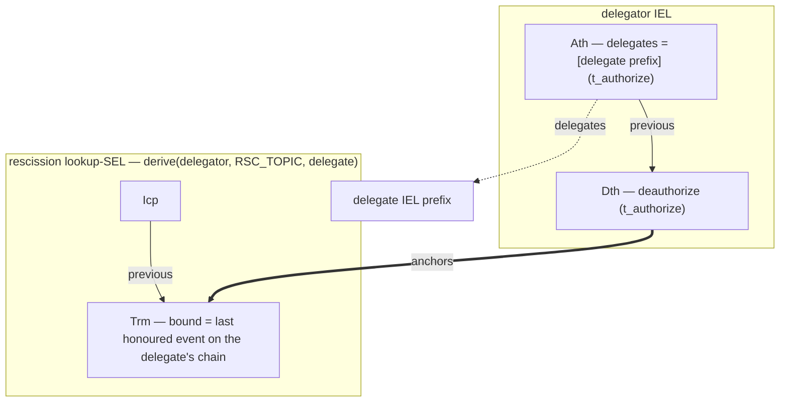

# IEL delegation and rescission

_Forthcoming._ The full delegation doctrine lands here; the mechanism rests on the IEL `Ath` / `Dth`
kinds ([`../event-shape.md` §Event taxonomy](../event-shape.md#event-taxonomy)) and the
negative-check-as-lookup rule
([`../../../../protocol-doctrine.md` §Negative checks are positive lookups](../../../../protocol-doctrine.md#negative-checks-are-positive-lookups)).
This stub carries the diagram ahead of the prose.

## Delegate, then rescind

Delegation is an IEL `Ath` whose `manifest.delegates` names the delegate's IEL **prefix** (the
delegate acts **for the delegator**) — tier 2, `t_authorize`. Rescission is a per-delegate lookup
SEL `{Icp, Trm}` at `derive(delegator, RSC_TOPIC, delegate_prefix)`, whose `Trm` carries
`manifest.bound` — the **last honoured event** on the delegate's chain (the grandfather boundary) —
anchored by an IEL `Dth` (tier 2, `t_authorize`). Present at the derived locus → rescinded
(grandfathered to the bound); absent → not rescinded (an O(1) positive read).

