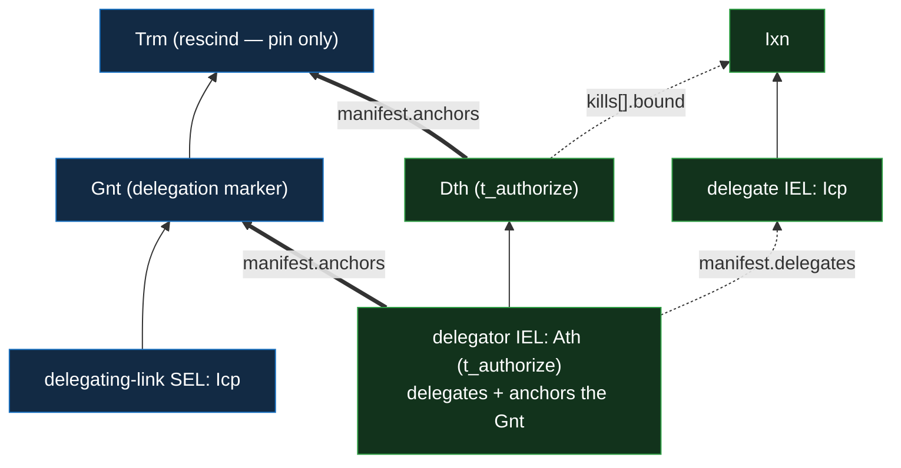

# IEL delegation and rescission

Delegation is an IEL-layer concern, resting on the IEL `Ath` / `Dth` kinds
([`../event-shape.md` §Event taxonomy](../event-shape.md#event-taxonomy)) and the
negative-check-as-lookup rule
([`../../../../protocol-doctrine.md` §Negative checks are positive lookups](../../../../protocol-doctrine.md#negative-checks-are-positive-lookups)).
This doc states the **single-hop** grant-and-rescission primitive. A multi-hop `del(X, N)` is this
primitive applied per hop, forming a **delegation hierarchy** (a delegator delegates to
sub-delegators on down) — how authority scales and key management distributes without `X`
authorizing every actor directly: the verifier's bounded delegation walk and the `kills[]`
forward-match are
[`verification.md` §The bounded delegation walk](verification.md#the-bounded-delegation-walk), and
the document-authorization use — the per-hop grandfather, the committed authorizing path, and the
bound-choice usage doctrine — is
[`../../../policy/documents.md` §Delegation in a document](../../../policy/documents.md#delegation-in-a-document).

## Delegate, then rescind

Delegation is an IEL `Ath` whose `manifest.delegates` names the delegate's IEL **prefix** (the
delegate acts **for the delegator**) — tier 2, `t_authorize`. The **same `Ath`** also anchors the
delegating-link **`Gnt`** (§The positive delegating link), so one IEL event both grants and
signposts. The authority lives on `Ath.delegates`; the delegating-link SEL is only the discoverable,
re-derivable **index** of it — a `Gnt` sealing a minimal marker, never the seat of authority.

Rescission is a **`kills[]` declaration** on the delegator's witnessed IEL **`Dth`** (tier 2,
`t_authorize`, the polarity-inverse of `Ath`) plus a **`Trm` on the delegating-link SEL itself** —
there is **no separate rescission lookup**. The `Dth`'s `kills[]` entry is `{ target, bound }`:
`target = hash('vdti/sel/v1/actions/rescission:{delegator}:{delegate}')` — a flat, domain-qualified
hash over `(delegator, delegate)` (the shared `rescission` tag,
[`../tags-and-topics.md`](../tags-and-topics.md), feature-blind), which the verifier
forward-matches, and **distinct from the delegating-link SEL's derived prefix** (a separate
derivation pass) so the public `kills[]` never leaks the lookup object's address. `bound`, the
**last honoured event** on the delegate's chain (the grandfather boundary), rides **publicly in the
`kills[].bound` field**, un-withholdable on the witnessed IEL. The lookup `Trm` carries **only its
pin**. _(A delegate `bound` is not participant-identifying, so it is public; a doc-membership
rescission's `bound` **is** participant-identifying and instead rides the SEL `Trm`'s gated `bound`
role — see [`../../../../features/shared-documents.md`](../../../../features/shared-documents.md).)_

The check reads the delegating-link SEL **first** (O(1) — tip `Gnt` → live, tip `Trm` → rescinded);
on a miss it is **fail-secure by default** — walk the delegator's fresh IEL and forward-match the
`target` against each `Dth`'s `kills[]` (in some → rescinded; in none on the fully-walked fresh
chain → not rescinded) — with **fail-open** (trust the miss) as the opt-out. On a hit, the lookup
`Trm`'s pin (`Trm.pin` = the `Dth`'s `previous`) points straight at the killing `Dth`, so the
`bound` is read from its `kills[]` entry directly — no exhaustive scan.

Rescission is **final for that `(delegator, delegate)` pair** — the delegating-link SEL is
**monotone** (no `lineage`), so once `Trm`'d its address is dead. To re-delegate, the delegate
**reincepts to a fresh prefix**, which yields a fresh delegating-link address — matching the
recovery doctrine (a rescinded delegate is replaced, not resumed).

Solid arrows are chain order; the dotted arrows are `manifest.delegates` (the grant authority) and
the `Dth`'s `kills[].bound` (the last honoured event on the delegated chain); the thick arrows are
`manifest.anchors` — the `Ath` sealing the delegating-link `Gnt`, and the `Dth` sealing the rescind
`Trm`.

## The positive delegating link

A `del(X, N)` document commits the exact authorizing path it was issued under, and a verifier
re-derives it through the owner-rooted **delegating-link** lookup SEL. Its prefix derives from
`(delegator, vdti/sel/v1/actions/delegation, delegate)` (`delegate` = `data`,
[`../tags-and-topics.md`](../tags-and-topics.md)); it is **`{Icp, Gnt}`-shaped and monotone** (no
`lineage`), rescinded to `{Icp, Gnt, Trm}`. The **`Gnt` seals a `vdti/sel/v1/grants/delegation`
marker** — the discoverable, tier-2 **signpost** to the grant, **not** the seat of authority. The
marker is **not arbitrary**: it commits a **blinded reference to the delegate** (a hash, so the
public witnessed SEL never enumerates who a delegator delegates to — the same discipline as the
address and the rescission target), binding the signpost to the specific delegation it stands for.
That a tier-2 `Gnt` carries this value here (rather than a value-less pointer) is the **accepted
cost** of keeping every lookup tier-2: a uniform content/lookup discriminator with **no carve-out**
and **no `Gnt`-schema special-case** (a value-less pointer would just move the exception onto the
`Gnt` schema).

The **same `Ath`** that carries `delegates` also **anchors this `Gnt`** — `Ath.anchors` is
kind-strict to a `Gnt`, and an `Ath` carries `delegates` and `anchors` at once — so granting a
delegation is **one IEL event** (`Gnt.pin = Ath.previous`), not the `Ath` plus a separate anchoring
event. A delegation signpost and a doc-membership capability `Gnt` are **never confused**: a
consumer reaches each by deriving **its own SEL topic** (a delegation lookup derives the
`delegation` topic; a doc-membership check a `.../topics/*-membership` topic), so the two sit at
different addresses — the disambiguation is the **topic**, not anything read off the `Gnt`.

The link is a **re-verified pointer**: a verifier derives the address, reads the `Gnt`, follows its
anchor to the `Ath`, and the `del(X, N)` walk confirms **both** — the `Ath.delegates` lists this
delegate **and** the marker commits (the blinded reference to) this same delegate — so an unrelated
or mismatched grant-doc at the locus does not pass. This is a **delegation-layer** check, not a
`Gnt`-schema rule; the authority is always `Ath.delegates`, and the marker grants nothing on its own
(a dangling marker is inert). Making the signpost a tier-2 `Gnt` (not tier-1 content) means a stolen
signing key cannot plant a false one, and it satisfies the SEL content/lookup discriminator **as
written** (a no-flag lookup with a tier-2 v1 — no carve-out). A verifier derives one locus per hop
and walks up to `X` (bounded by `MAXIMUM_DELEGATION_DEPTH` and the verifier-wide work cap). See
[`../../../policy/documents.md` §Delegation in a document](../../../policy/documents.md#delegation-in-a-document).
