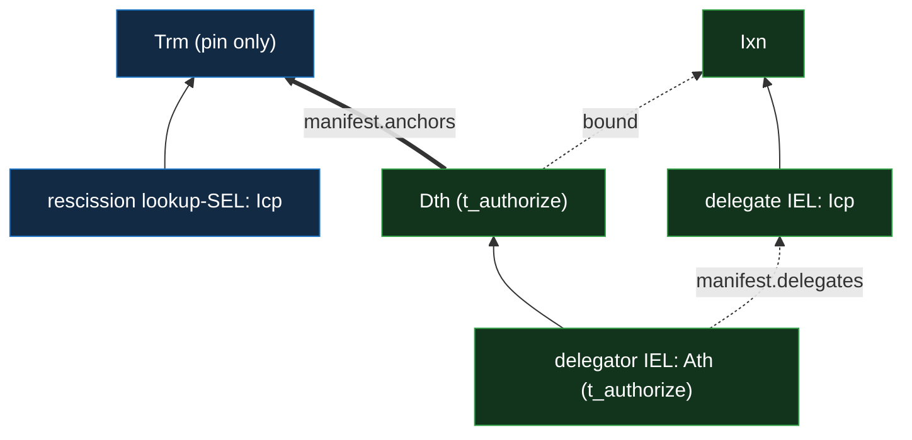

# IEL delegation and rescission

Delegation is an IEL-layer concern, resting on the IEL `Ath` / `Dth` kinds
([`../event-shape.md` §Event taxonomy](../event-shape.md#event-taxonomy)) and the
negative-check-as-lookup rule
([`../../../../protocol-doctrine.md` §Negative checks are positive lookups](../../../../protocol-doctrine.md#negative-checks-are-positive-lookups)).
This doc states the **single-hop** grant-and-rescission primitive. A multi-hop `del(X, N)` is this
primitive applied per hop: the verifier's bounded delegation walk and the `kills[]` forward-match
are [`verification.md` §The bounded delegation walk](verification.md#the-bounded-delegation-walk),
and the document-authorization use — the per-hop grandfather, the committed authorizing path, and
the bound-choice usage doctrine — is
[`../../../policy/documents.md` §Delegation in a document](../../../policy/documents.md#delegation-in-a-document).

## Delegate, then rescind

Delegation is an IEL `Ath` whose `manifest.delegates` names the delegate's IEL **prefix** (the
delegate acts **for the delegator**) — tier 2, `t_authorize`. Rescission is a **`kills[]`
declaration** on the delegator's witnessed IEL **`Dth`** (tier 2, `t_authorize`) plus a
content-addressed lookup SEL `{Icp, Trm}` at `derive(delegator, DLG_RSC_TOPIC, grant_instance)` (the
grant-instance `said({ grant: said(Ath), delegate })`, so a re-grant gets a fresh locus). The
`Dth`'s `kills[]` entry is `{ target, bound }`:
`target = hash('{DLG_RSC_TOPIC}:{delegator}:{grant_instance}')` — a flat, domain-qualified hash the
verifier forward-matches, and **distinct from the lookup SEL's derived prefix** (a separate `derive`
pass), so the public `kills[]` never leaks the lookup object's address — and `bound`, the **last
honoured event** on the delegate's chain (the grandfather boundary), rides **publicly in the
`kills[]` entry**, un-withholdable on the witnessed IEL. The lookup `Trm` carries **only its pin**.
_(A delegate `bound` is not participant-identifying, so it is public; a doc-membership rescission's
`bound` **is** participant-identifying and instead rides a gated rescind-doc committed by its `Trm`
— see
[`../../../../features/multi-party/documents.md`](../../../../features/multi-party/documents.md).)_

The check is **fail-secure by default**: walk the delegator's fresh IEL and forward-match the
`target` against each `Dth`'s `kills[]` — in some `kills[]` → rescinded (grandfathered to its
`bound`); in none on the fully-walked fresh chain → not rescinded. A **fail-open** O(1) lookup at
the derived locus is the opt-out.

Solid arrows are chain order; the dotted arrows are `manifest.delegates` (the grant) and the `Dth`'s
`kills[]` `bound` (the last honoured event on the delegated chain); the thick arrow is
`manifest.anchors` — the `Dth` sealing the rescission `Trm`, which carries only its pin.
