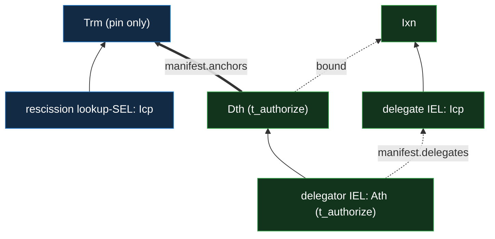

# IEL delegation and rescission

Delegation is an IEL-layer concern, resting on the IEL `Ath` / `Dth` kinds
([`../event-shape.md` §Event taxonomy](../event-shape.md#event-taxonomy)) and the
negative-check-as-lookup rule
([`../../../../protocol-doctrine.md` §Negative checks are positive lookups](../../../../protocol-doctrine.md#negative-checks-are-positive-lookups)).
This doc states the **single-hop** grant-and-rescission primitive. A multi-hop `del(X, N)` is this
primitive applied per hop, forming a **delegation hierarchy** (a delegator delegates to
sub-delegators on down) — how authority scales and key management distributes without `X`
authorizing every actor directly: the verifier's bounded delegation walk and the `kills[]`
forward-match are
[`verification.md` §The bounded delegation walk](verification.md#the-bounded-delegation-walk), and
the document-authorization use — the per-hop grandfather, the committed authorizing path, and the
bound-choice usage doctrine — is
[`../../../policy/documents.md` §Delegation in a document](../../../policy/documents.md#delegation-in-a-document).

## Delegate, then rescind

Delegation is an IEL `Ath` whose `manifest.delegates` names the delegate's IEL **prefix** (the
delegate acts **for the delegator**) — tier 2, `t_authorize`. Rescission is a **`kills[]`
declaration** on the delegator's witnessed IEL **`Dth`** (tier 2, `t_authorize`) plus a
content-addressed lookup SEL `{Icp, Trm}` whose inception commits
`{ owner: delegator, topic: vdti/sel/v1/actions/rescission, data: grant_instance }` (the
grant-instance `said({ grant: said(Ath), delegate })`, so a re-grant gets a fresh locus). The
`Dth`'s `kills[]` entry is `{ target, bound }`:
`target = hash('vdti/sel/v1/actions/rescission:{delegator}:{grant_instance}')` — a flat,
domain-qualified hash the verifier forward-matches (the `tag` is a primitive derivation tag,
[`tags-and-topics.md`](../tags-and-topics.md), never a feature name), and **distinct from the lookup
SEL's derived prefix** (a separate derivation pass), so the public `kills[]` never leaks the lookup
object's address — and `bound`, the **last honoured event** on the delegate's chain (the grandfather
boundary), rides **publicly in the `kills[].bound` field**, un-withholdable on the witnessed IEL.
The lookup `Trm` carries **only its pin**. (Answering multi-hop liveness — the **bounded
per-candidate walk** — is
[`verification.md` §The bounded delegation walk](verification.md#the-bounded-delegation-walk).) _(A
delegate `bound` is not participant-identifying, so it is public; a doc-membership rescission's
`bound` **is** participant-identifying and instead rides the SEL `Trm`'s gated `bound` role — see
[`../../../../features/shared-documents/documents.md`](../../../../features/shared-documents/documents.md).)_

The check reads the derived lookup-SEL **first** (O(1) content-addressed, **present → rescinded**);
on a miss it is **fail-secure by default** — walk the delegator's fresh IEL and forward-match the
`target` against each `Dth`'s `kills[]` (in some → rescinded; in none on the fully-walked fresh
chain → not rescinded) — with **fail-open** (trust the miss) as the opt-out. The `bound` (the
grandfather boundary) rides the `kills[]` entry; on a hit, the lookup `Trm`'s pin (`Trm.pin` = the
`Dth`'s `previous`) points straight at the killing `Dth`, so the `bound` is read from its `kills[]`
entry directly — no exhaustive scan.

Solid arrows are chain order; the dotted arrows are `manifest.delegates` (the grant) and the `Dth`'s
`kills[]` `bound` (the last honoured event on the delegated chain); the thick arrow is
`manifest.anchors` — the `Dth` sealing the rescission `Trm`, which carries only its pin.

## The positive delegating link

A `del(X, N)` document commits the exact authorizing path it was issued under, and a verifier
re-derives it, through an owner-rooted **delegating-link** lookup SEL — the **positive** twin of the
rescission lookup. Its prefix derives from `(delegator, vdti/sel/v1/actions/delegation, delegate)`
(`delegate` = `data`, [`../tags-and-topics.md`](../tags-and-topics.md)); it is `{Icp, Pin}`-shaped.
Granting a delegation is an **`Ath`** (the grant, carrying `delegates`) **plus** an **`Ixn`**
anchoring the delegating-link `Pin`, whose pinned position **names that `Ath`** — the `Ath` does not
anchor the `Pin` (the `Ath` `anchors` role is kind-strict to a `Gnt`). The link is a **re-verified
pointer**: a verifier derives the address, reads the pinned `Ath` position, and **re-checks the
`Ath` grant directly** (T2), so the link's own T1 (`Ixn`) anchoring is discoverability only and
never weakens the grant. Same derived-locus scheme as the rescission lookup, but it **pins** the
grant rather than killing it, so a verifier derives one locus per hop and walks up to `X` (bounded
by `MAXIMUM_DELEGATION_DEPTH` and the verifier-wide work cap). See
[`../../../policy/documents.md` §Delegation in a document](../../../policy/documents.md#delegation-in-a-document).
