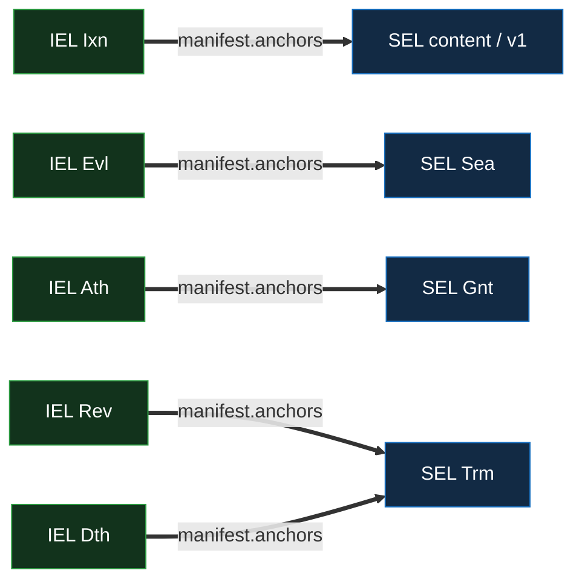

# IEL Events — Per-Kind Reference

Per-kind structural reference for the IEL event taxonomy: the **eight-kind user IEL** and the
**restricted federation IEL**, one content kind across a tier-2 sealed spine. The cross-primitive
field shape — common fields, the `manifest` model, `previousSeal`, and the full per-kind field grid
— is the [event-shape reference](../event-shape.md#iel); this doc states the IEL-specific semantics:
the threshold vector and its bounds, the two-tier capability model, the kind-strict anchor matrix,
the `kills[]` fail-secure declaration, the facet-dependent `Wit`, threshold anchoring, sort
priority, and the seal-advance cap.

For chain lifecycle (states, the seal and spine, locked-portion bound, page model), see
[`log.md`](log.md). For merge-layer routing, [`merge.md`](merge.md). For the verifier walk,
[`verification.md`](verification.md). For the delegate / rescind surface,
[`delegation.md`](delegation.md).

## Event taxonomy

An identity's IEL is one of two facets, fixed by its inception root (§Two-kind inception). A **user
IEL** uses all eight kinds; a **federation IEL** is the restricted set `Fcp` / `Wit` / `Trm`.

| Kind  | Kind string              | Class     | Tier | Count                                      | Purpose                                                                                                                                                                                                  |
| ----- | ------------------------ | --------- | ---- | ------------------------------------------ | -------------------------------------------------------------------------------------------------------------------------------------------------------------------------------------------------------- |
| `Icp` | `vdti/iel/v1/events/icp` | inception | 2    | all initial members consent                | Inception — pins the initial roster, threshold vector, federation binding, and `witnesses`. **User IEL only** — a federation IEL incepts `Fcp`.                                                          |
| `Ixn` | `vdti/iel/v1/events/ixn` | content   | 1    | `t_use`                                    | Content — anchors content SEL events, each content SEL's serial-1 **v1**, and a credential's issuance commitment. **The divergeable content kind** (first-seen, buriable).                               |
| `Evl` | `vdti/iel/v1/events/evl` | sealed    | 2    | all added consent ∧ `t_govern` of outgoing | **Evolve state** — a roster / threshold **delta** (`add` + `cut`); a `cut` `Evl` **evicts**. Anchors no kills, but **anchors a SEL `Sea`** (the burying-seal recovery, `Sea ← Evl`). **Seal-advancing.** |
| `Ath` | `vdti/iel/v1/events/ath` | sealed    | 2    | `t_authorize`                              | **Authorize a party to act** — `delegates` (act **for**) and / or `anchors` a SEL `Gnt` (act **as itself**). Sealed on arrival, non-terminal. **Seal-advancing.**                                        |
| `Rev` | `vdti/iel/v1/events/rev` | sealed    | 2    | `t_govern`                                 | **Revoke** an owned artifact — a `kills[]` declaration + anchors the revocation-SEL `Trm`. Sealed on arrival, non-terminal. **Seal-advancing.**                                                          |
| `Dth` | `vdti/iel/v1/events/dth` | sealed    | 2    | `t_authorize`                              | **Deauthorize** a grant — a `kills[]` declaration + anchors the rescission-SEL `Trm`; the polarity-inverse of `Ath`. Sealed on arrival, non-terminal. **Seal-advancing.**                                |
| `Trm` | `vdti/iel/v1/events/trm` | terminal  | 2    | `t_govern`                                 | **Terminal** — retires the identity and freezes all its SELs. **Seal-advancing.**                                                                                                                        |
| `Wit` | `vdti/iel/v1/events/wit` | sealed    | 2    | `t_govern`                                 | Federation **rebind** (user IEL) / federation **governance** (federation IEL); anchored by member KEL `Wit`s. `{Wit, Wit}` terminal. **Seal-advancing.**ᵃ                                                |
| `Fcp` | `vdti/iel/v1/events/fcp` | inception | 2    | all founders consent                       | **Federation inception marker** _(federation IEL only)_ — the federation IEL's inception; anchored kind-strict by each founder's KEL `Rot`.                                                              |

- ᵃ **`Wit`** is the **one** witness / federation kind — its facet is dispatched on the chain's root
  (§The facet-dependent `Wit`).

The **class** column names the event's role under the
[divergence-and-recovery rules](../../../../protocol-doctrine.md#divergence-and-recovery): only
**content** (`Ixn`) is buriable. Every tier-2 kind is **sealed** — never buried or overturned —
including the **terminal** `Trm`. `Rev` / `Dth` / `Ath` are sealed but **non-terminal**: they seal
an act on a _downstream target_, not on the host IEL, so `{Rev, content}` stays recoverable (the
`Rev` branch survives, the content buries); a chain goes terminal only when it carries a `Trm`, a
`{Wit, Wit}`, or ≥ 2 **accepted** sealed branches. The **tier** column names the KEL capability an
adversary must forge to author the matching member participation — see
[§Two-tier capability model](#two-tier-capability-model). The **Kind string** column is the kind's
versioned schema identifier (`vdti/iel/v1/events/…`), unrelated to a standalone SAD's custody
`topic`.

## Two-kind inception

IEL inception is one of two structurally distinct kinds dispatched by the kind discriminator at
`serial = 0`. The kind fixes the chain's **root facet** for its whole life; the verifier records it
at inception and carries it on the token
([`verification.md` §Root facet](verification.md#root-facet-dispatch)).

| Kind  | Facet         | Roster                | Federation binding                        | Kind set                                                      |
| ----- | ------------- | --------------------- | ----------------------------------------- | ------------------------------------------------------------- |
| `Icp` | user identity | member device KELs    | `federation` + `federationPin` (required) | `Icp` / `Ixn` / `Evl` / `Ath` / `Rev` / `Dth` / `Trm` / `Wit` |
| `Fcp` | federation    | witness KELs directly | none (it _is_ the federation)             | `Fcp` / `Wit` / `Trm`                                         |

- `Icp` → a **user identity**. It is federation-bound from inception: `federation` (the federation
  IEL prefix) and `federationPin` (the as-of federation position) are **required**, and the
  `witnesses` role declares the chain's own witnessing policy. Every identity is
  federation-witnessed — an `Icp` that omits the binding is **malformed → rejected** (there is no
  direct mode). Anchored by **all** initial members' KEL `Rot`s (each consenting at tier 2). Its
  `nonce` drives prefix unpredictability ([`log.md` §Prefix derivation](log.md#prefix-derivation)).
- `Fcp` → a **federation IEL** (the restricted facet). It is the federation's inception marker — a
  structural disambiguator the verifier dispatches on, **not** a trust carve-out (the config-pinned
  federation prefix still roots trust). It carries the initial witness-KEL roster, the initial
  `witnesses` config, and the initial `clock` (the founders' join time), and is anchored kind-strict
  by each founder's KEL `Rot` (tier-2 → tier-2). The full genesis ceremony is federation doctrine —
  [`../../../../substrate/federation/bootstrap.md`](../../../../substrate/federation/bootstrap.md).

## Authorization — threshold over member KELs, no adjacent signature

An IEL event carries **no signature of its own**
([`../event-shape.md` §Authentication & signatures](../event-shape.md#authentication--signatures)).
It authenticates via its **KEL anchors**: a member participates by authoring a fresh KEL event whose
`manifest.anchors` names the IEL event, and that KEL event's adjacent signature provides the
authentication. The IEL event is authorized when a **threshold** of members' fresh KEL
participations anchor it — the count drawn from the threshold vector by the IEL event's kind
(below), the participation kind **kind-strict** to the capability the act exercises (§Threshold
anchoring). So an IEL chain's validity needs no higher-layer policy — every kind prices itself from
exactly one threshold slot, and the verifier resolves each anchor down to a KEL signature.

## The threshold vector and its bounds

An identity's authorization is a **threshold vector** — a labelled object
`{ use, authorize, govern }` — the **count** axis, orthogonal to tier. Prose (and the slot table
below) writes a slot as **`t_use` / `t_govern` / `t_authorize`**: the `t_` marks a **threshold**,
distinct from a **tier** (`T1` / `T2`) — it is a documentation label, not a data key. Each IEL kind
draws its required count from exactly one slot:

| Slot          | Consumed by                   | Meaning                                                                      |
| ------------- | ----------------------------- | ---------------------------------------------------------------------------- |
| `t_use`       | `Ixn`                         | Content — issuance and SEL authoring (tier 1).                               |
| `t_authorize` | `Ath` / `Dth`                 | Authorize / deauthorize a party to act (tier 2).                             |
| `t_govern`    | `Evl` / `Rev` / `Wit` / `Trm` | Roster / threshold change, revocation, federation rebind, terminal (tier 2). |

The bounds (re-checked on the post-delta config at **every** config-changing event, not only
inception):

- **`t_use ≥ 1`** (`t_use = 1` is single-device content by choice — no content resilience). `t_use`
  is **exempt from the authorization floor** — content is first-seen and recoverable.
- **The authority slots (`t_govern`, `t_authorize`) carry two bounds of different kinds.** A
  **security floor `≥ 2`** (hard for every identity of `|roster| ≥ 2` — no single member exercises
  authority) and a **recoverability ceiling `≤ |roster| − 1`** (the identity can evict a compromised
  member or recover a lost one without it). The ceiling is **advisory at `|roster| = 2`** (a
  two-device identity is valid but cannot evict / recover without both — the wallet warns) and
  **hard at `|roster| ≥ 3`** (a threshold equal to `|roster|` is a gratuitous hostage config →
  rejected). A singleton (`|roster| = 1`) sets all thresholds to 1.
- **An authorization floor `t_govern, t_authorize > |roster|/2`** — so any two authorizing quorums
  overlap and a sealed fork always names a double-dealer (closing the disjoint-quorum attribution
  loss).
- **The roster is hard-capped at `MAXIMUM_ROSTER_SIZE` (= 32)** — a DoS backstop; the verifier
  rebuilds the roster in memory as it walks, and any delta pushing the live set past
  `MAXIMUM_ROSTER_SIZE` is rejected (all IELs, including the federation).
- **The roster is never emptied.** The post-delta size `|roster| + |add| − |cut| ≥ 1`. A roster is a
  **set**, so a delta is well-formed only with `add ∉` the current roster, `cut ⊆` it, and
  `cut ∩ add = ∅`. A singleton `cut` computes `1 + 0 − 1 = 0 < 1` and is rejected, so a singleton
  roster is downward-immutable while still allowing singleton evict-and-replace (`cut 1 + add 1`
  stays 1).

A **2-member identity is valid but unrecoverable** (warned — a compromised device can freeze you,
not just self-lock you out; add a third key). Recoverable governance needs `|roster| ≥ 3`. The
federation IEL is tighter still — its recoverability ceiling is **hard** and its witness-config
carries additional bounds — see
[§Federation convergence](../../../../protocol-doctrine.md#federation-convergence) and
[§The restricted federation IEL](#the-restricted-federation-iel).

### Threshold declaration at inception

The **`Icp` declares the active threshold set** — exactly the authority kinds the IEL will ever use.
A threshold is declared **iff its consuming kind is in the IEL's kind set**: a user IEL declares
`t_govern` **mandatory** and `t_use` / `t_authorize` **optional and lockable**; a federation IEL
(`Fcp` / `Wit` / `Trm`, no `Ixn` / `Ath`) declares **exactly `{ govern }`** (declaring `t_use` or
`t_authorize` is malformed → rejected — the threshold-declaration analog of the facet role
allowlist). A kind **omitted at `Icp` can never be exercised** — there is no first-introducing it
later. Thereafter a roster delta carries a threshold field **only when it changes** (present ⇒ must
change; absent ⇒ unchanged) — the same present-is-delta / absent-is-inherit shape as the membership
`add` / `cut`.

## Per-kind semantics

### `Ixn` — content (tier 1)

Anchors content SEL events, each content SEL's serial-1 **v1** (the SEL `Icp` rides `v1.previous`,
never itself anchored), **and a credential's issuance commitment**
`hash('vdti/iel/v1/actions/commitment:{issuer}:{cred.said}')` (an immutable SAD — a credential is
**direct-anchored**, there is no credential-SEL, and the anchor is the validity proof). One `Ixn`
may batch many anchors. A re-anchor naming a SEL event at an already-attributed SEL serial is
malformed / inert — a lightweight structural guard. Fork-prevention for a SEL is the SEL's **own**
witnessing at its own position, **not** the IEL's order: an owner can equivocate its SEL under a
linear IEL (an IEL anchor is an opaque SAID the IEL cannot dedupe), so the anchor cannot prevent a
SEL fork — the SEL witnesses itself
([`../sel/log.md` §The SEL is its own witnessed chain](../sel/log.md#the-sel-is-its-own-witnessed-chain)).
`Ixn` is the **divergeable / first-seen** content kind; it does not advance the seal.

### `Evl` — evolve state (tier 2, `t_govern`)

Carries a roster / threshold **delta** (the `roster` role): `add` (members joined) + `cut` (members
removed) + any changed thresholds — never a full snapshot (the append-only chain is the floor; the
current roster is the accumulation of every delta while walking). **Added members consent at tier
1** via their own KEL `Ixn` (they are joining, not rotating — sign and declare key commitments); the
**`t_govern` of the outgoing roster** approve at tier 2, each revealing a rotation reserve via a KEL
`Rot` that anchors the `Evl`. `Evl` **anchors no kills** (those ride `Rev` / `Dth`) — but it
**anchors a SEL `Sea`** (kind-strict, `Sea ← Evl`: the burying-seal recovery that re-seals a plain
content SEL fork). It carries **no `federation`** (the rebind field), so it cannot mutate the
federation binding — though it may carry `federationPin` for a same-federation re-pin, like any user
IEL body event.

**Eviction is a `cut` `Evl`.** Evicting a compromised or divergence-causing member is an ordinary
`Evl` carrying a roster `cut` — one sealing event buries the fork **and** evicts, atomically (there
is no repair-and-evict fold — there is no repair event). The `cut` is priced the **outgoing**
`t_govern` (the pre-change gate — so an `Evl` cannot lower its own gate then cut), and the post-cut
roster is re-checked against the bounds above (a stranding / hostage cut is rejected, forcing a
simultaneous `threshold` drop or reincept). The timing rationale is in
[`merge.md` §Eviction](merge.md#eviction--a-cut-evl-buries-and-evicts-atomically).

### `Ath` — authorize a party to act (tier 2, `t_authorize`)

The unified authorization anchor, carrying **two manifest roles, both permitted at once**
(batchable, same cost):

- **`delegates`** — a positive inclusion list of **delegate IEL prefixes** (the party acts **for**
  the delegator), capped like every inline manifest list at `MAXIMUM_MANIFEST_LIST = 128` entries
  (event-shape). This is the delegation grant — see [`delegation.md`](delegation.md).
- **`anchors`** — the downstream SEL **`Gnt`**(s) it seals (a doc-membership grant; the party acts
  **as itself**). Kind-strict: `Ath.anchors` names **only** `Gnt`s.

`Ath` carries **no own-state delta** (it grants authority over a downstream party, nothing on the
host IEL) and is the **additive counterpart of the kill-anchors** — sealed on arrival, non-terminal,
walked back forward by a `Dth`, never buried or overturned. An `Ath` whose `delegates` lists the
delegator's own prefix is rejected, so a self-grant cannot collapse `del(X, 1)` into `id(X)` (the
policy layer's delegation leaf — [`policy.md`](../../../policy/policy.md)). The document-layer grant
mechanics live in
[`../../../../features/shared-documents/documents.md`](../../../../features/shared-documents/documents.md)
_(forthcoming)_.

### `Rev` / `Dth` — the kill-anchors (tier 2)

Both seal a **kill** — a monotone act a third party relies on, so tier 2, sealed on arrival — and
both carry a **`kills[]` declaration** alongside the `anchors[]` naming the sealing SEL `Trm`. They
differ by domain and count:

- **`Rev` (revoke, `t_govern`)** — kills an **owned** artifact: a credential's revocation, or an
  app-SEL closure. `anchors` names revocation lookup-SEL `Trm`s.
- **`Dth` (deauthorize, `t_authorize`)** — kills a **granted authorization** (delegation or
  doc-membership): the polarity-inverse of `Ath`. `anchors` names rescission lookup-SEL `Trm`s, and
  its `kills[]` entry carries the rescission `bound`.

Both carry **no roster delta** (they cannot mutate establishment state) and both **force a `Rot`**
on each approving member — a permanent kill needs a ≥ tier-2 KEL anchor, and the distinction from
`Evl` is the absence of a roster delta, not the rotation. Both are **sealed but non-terminal**: they
seal a kill on a target, not the host IEL, so `{Rev, content}` and `{Dth, content}` are recoverable.
Distinct kills at one position are `{Rev, Rev}` → ≥ 2 sealed → terminal (identical kills dedupe by
SAID).

### `kills[]` — the fail-secure revocation declaration

`kills` is a flat list `[{ target, bound? }]` carried **kind-strict to `Rev` / `Dth`** — a `kills`
on a tier-1 `Ixn` is **malformed → rejected** (closing declare-a-revoke-at-`t_use`) — and, like
every inline manifest list, capped at `MAXIMUM_MANIFEST_LIST = 128` entries (event-shape; an
over-length list is rejected in structural validation, bounding the per-event forward-match work).
It is the revocation / rescission **declaration** the fail-secure walk consumes:

- **`target = hash('{tag}:{owner}:{data}')`** — a flat, domain-qualified hash the verifier computes
  directly and **forward-matches** on the owner's fresh IEL. The `tag` is a primitive derivation tag
  ([`tags-and-topics.md`](../tags-and-topics.md)), never a feature name —
  `vdti/sel/v1/actions/revocation` for a `Rev`-anchored kill and `vdti/sel/v1/actions/rescission`
  for a `Dth`-anchored one (one `rescission` tag covers both delegate and doc-member; the `data`
  distinguishes them). The target **mirrors the killed address**
  ([`sel/log.md`](../sel/log.md#the-content-and-lineage-fields)): **non-lineaged**
  `hash('{tag}:{owner}:{data}')` for a **monotone kill** (cred revocation, delegate / doc-member
  rescission), **lineaged** (`…:{lineage}`) for a **value rescission** (scoped to the one instance
  it kills, so the re-established `lineage: N+1` survives), and a literal `:content` for a **content
  (app-SEL) closure**. A value's positive resolution reads its own SEL chain; its per-lineage
  negative check consults this lineaged target. The `tag` is **opaque to the IEL** — the IEL never
  dereferences a target or interprets a bound. Placement (kind-strict) is the only structural rule;
  all revocation and grandfather logic is the feature layer's
  ([`../../../policy/documents.md`](../../../policy/documents.md)). The `target` is **not** the
  lookup SEL's prefix (a separate two-pass derivation), so `kills[]` does not leak the killed
  object's address.
- **`bound`** (rescission only) — the grandfather cutoff, the last honored event on the rescinded
  party's chain. One concept, two custody modes. A **delegate**'s `bound` is not
  participant-identifying, so it rides **publicly** in the `kills[].bound` field (un-withholdable on
  the witnessed IEL). A **doc-member**'s `bound` **is** participant-identifying, so `kills[]`
  carries only the blind `target` and the `bound` rides the **SEL `Trm`'s gated `bound` role** (a
  rescind-doc behind the read gate) — see [`delegation.md`](delegation.md) and
  [`../../../../features/shared-documents/documents.md`](../../../../features/shared-documents/documents.md).

The check reads the derived lookup-SEL **first** (an O(1) content-addressed read, **present →
killed**); on a miss it is **fail-secure by default** — compute the `target` and walk the owner's
**fresh** IEL, forward-matching it against each `Rev` / `Dth`'s `kills[]` (in some `kills[]` →
killed, grandfathered to that entry's `bound`; in none **on a walk that reached the fresh witnessed
tip** → not killed — a walk truncated at `max_pages` before the tip **refuses**, never reports
not-killed). Being in a `kills[]` **is** the definition of killed, and the walk rides the same
witnessed-IEL freshness gate as divergence, so a hidden kill needs a stale IEL the verifier already
refuses. **Fail-open** — trusting the miss — is the opt-out, never up. On a hit, `Trm.pin` (= the
killing `Rev` / `Dth`'s `previous`) points straight at the kill, so the `bound` is read from that
`kills[]` entry directly — no exhaustive scan. This is the negative-check-as-positive-lookup rule
([§Negative checks are positive lookups](../../../../protocol-doctrine.md#negative-checks-are-positive-lookups)).

### `Trm` — the identity kill (tier 2, `t_govern`)

Terminates the identity: the chain becomes Terminated and **all its SELs freeze**. `Trm` advances
the seal to its own serial and admits no successor (the kind-schema rule rejects any
chain-from-`Trm`). It is the identity-layer variant of the shared `Trm` kind (the KEL `Trm` retires
a device; the SEL `Trm` kills a downstream artifact).

### The facet-dependent `Wit`

One `Wit` kind spans both facets; the verifier dispatches its allowed roles on the chain's **root**
(`Fcp` vs `Icp`). The **root is established before any `Wit` payload is read** on every
`Wit`-reading path (fresh walk, `resume`, early-exit), so a governance-shaped payload never rides a
user `Wit` or vice versa. A `Wit` is **never a no-op**, but _what_ makes it non-trivial is
facet-specific.

**User IEL — the federation rebind.** A user `Wit` records the identity's federation binding
(`{federation, federationPin}` top-level) and, optionally, a new `witnesses`. It is anchored by
member KEL `Wit`s (kind-strict, tier-2 ↔ tier-2), and its `{federation, federationPin}` must
**match exactly** those of every anchoring KEL `Wit`, checked on **every walk** — so all `t_govern`
anchoring members are pinned to the **same federation position** and the IEL `Wit` records only what
its members signed (auditable, never self-asserted). Binding validation also checks the `federation`
prefix **resolves to an `Fcp`-rooted IEL** — a binding pointing at an `Icp`-rooted user IEL is
malformed → rejected (trust still roots in the config-pin). A user `Wit` **must change `federation`
(the prefix) or `witnesses`**: a same-federation re-pin (advancing only `federationPin`) is not a
`Wit` — it rides any body event — and a pure key rotation is a member's KEL `Rot`, so a `Wit` that
changes neither is a no-op → rejected. Initial binding rides the `Icp` (which always carries the
federation); a later `Wit` **rebinds**. Trust is **per-federation and non-transitive** — each event
is witnessed by whichever federation was current when it landed.

**Federation IEL — governance.** A federation `Wit` is the analog of `Evl`, doing **everything**
(roster add / cut **and** witness rotation) at tier 2. It carries **no
`{federation, federationPin}`** (a federation witness is never self-bound) and instead carries the
federation's own `witnesses` config, an optional roster delta, and the monotonic `clock`. The
`Wit ↔ Wit` field-match here is the **witness-config only** — that config is the federation's new
config the approvers jointly endorse; the roster delta rides the manifest (`Evl`-style,
SAID-committed, each member endorsing the exact delta by anchoring the `Wit`'s SAID) and the `clock`
is one authoritative IEL-side value, neither matched. A federation `Wit` is **always a rotation** of
its participants and **advances the clock**, so the rotation + clock advance **is** the change — it
has no must-change predicate. The federation-governance mechanics (self-attestation, the
recoverability cap, the clock, roster-add consent) are federation doctrine —
[`../../../../substrate/federation/witnessing.md`](../../../../substrate/federation/witnessing.md).

### `Fcp` — the federation inception marker (federation IEL only)

The federation IEL's inception (§Two-kind inception). It carries the initial witness-KEL roster, the
initial `witnesses` config, and the initial `clock`, declares exactly `{ govern }`, and is anchored
kind-strict by each founder's KEL `Rot`. Its structural role is the **spine root** of the federation
IEL (`previousSeal` walks terminate there). See
[§The restricted federation IEL](#the-restricted-federation-iel).

## The manifest — roles an IEL event carries

An IEL event commits to higher layers and its witnessing policy through a **`manifest`** — the SAID
of a role-grouped SAD
([event-shape §The manifest](../event-shape.md#the-manifest--what-an-event-commits-to-grouped-by-role)).
A manifest carrying any role outside its kind's vocabulary is malformed and rejected, and a role is
consumed only after dispatching on a kind permitted to carry it (**read kind-first** —
load-bearing).

| Role        | Carried by                                       | Commits to                                                                                                          |
| ----------- | ------------------------------------------------ | ------------------------------------------------------------------------------------------------------------------- |
| `roster`    | `Icp` / `Evl` (user); `Fcp` / `Wit` (federation) | the roster / threshold **delta** SAD (`add` + `cut` + changed thresholds); an `Evl` `cut` also carries the eviction |
| `anchors`   | `Ixn` / `Evl` / `Ath` / `Rev` / `Dth`            | higher-layer event SAIDs (the up-commit); `Evl` anchors the SEL `Sea`                                               |
| `delegates` | `Ath`                                            | delegate **prefixes** — a positive inclusion list                                                                   |
| `kills`     | `Rev` / `Dth`                                    | the revocation / rescission declaration `[{ target, bound? }]`                                                      |
| `witnesses` | `Icp` / `Wit`; `Fcp` / `Wit` (federation)        | the witness-config SAD `{ threshold, signers }`                                                                     |
| `clock`     | `Fcp` / `Wit` / `Trm` (federation)               | the federation-clock timestamp (an inline scalar — the lone non-SAID role)                                          |

The **directly-consumed** roles (`roster`, `delegates`, `kills`, `clock`, and the `witnesses`
config) have **no** downstream type-check — the kind → role allowlist is their **only** protection,
so an `Ixn` carrying `roster` / `delegates` / `kills` is rejected (else governance / grants /
revocations at `t_use` reopen). The **back-checked** role `anchors` is additionally caught when each
referenced event is validated against its required kind — the anchor matrix is **kind-strict both
directions**:

### The kind-strict anchor matrix

An IEL kind anchors **only** its matching SEL kind(s), and each SEL kind is valid **only** anchored
by its matching IEL kind:

| IEL kind | Anchors (SEL)                                                                   | Tier-elevation floor |
| -------- | ------------------------------------------------------------------------------- | -------------------- |
| `Ixn`    | content SEL events, each content SEL's v1, and a credential issuance commitment | tier 1               |
| `Evl`    | a SEL `Sea` (the neutral burying-seal recovery)                                 | tier 2               |
| `Ath`    | a SEL `Gnt` (doc-membership grant)                                              | tier 2               |
| `Rev`    | a revocation-SEL `Trm`                                                          | tier 2               |
| `Dth`    | a rescission-SEL `Trm`                                                          | tier 2               |

An IEL `Ixn` anchors only content and SEL v1s; an `Ath` only a `Gnt`; a `Rev` / `Dth` only a `Trm`.
A SEL `Trm` is valid **only** anchored by a `Rev` or `Dth` — this back-check keeps the _object_
sealed, while the kind → role gate keeps the _declaration_ (`kills`) tier 2. The two kill-anchors
are discriminated by the SEL's type (a revocation-SEL versus a rescission-SEL); the anchor SAIDs
carry no per-entry role tags, so anchor structure opens no side-channel. IEL verification validates
anchor **format** only (each entry a SAID-shaped token); anchor **satisfaction** (which kind, which
tier) is enforced when the SEL verifier resolves the anchored SEL event against its required kind.

## Two-tier capability model

IEL acts are classified by **tier** — the KEL capability an adversary must forge to author the
member participation that anchors the act.

- **Tier 1 — a member's signing key.** Content (`Ixn`) is anchored by member KEL `Ixn`s, each signed
  by the member's current signing key. A `t_use`-counted `Ixn` is tier 1 even at a high count.
- **Tier 2 — a member's rotation reserve.** Every sealed act — `Evl`, `Ath`, `Rev`, `Dth`, `Wit`,
  `Trm` — is anchored by member KEL `Rot`s (or, for the IEL `Wit`, KEL `Wit`s), each revealing a
  rotation reserve. The reserve is held **apart** from the signing key, and the **old signing key is
  not a prerequisite** — a rotation reveals the new key.

The reserve is required when a forgery would be high-harm or irreversible, **or** when the act must
be permanent on arrival (sealed). A **kill** is the permanence case: low-danger (it only removes
trust) but monotone, so it rides a dedicated kill-anchor and is tier 2. Tier semantics and the
**kind-strict** anchor rule — each IEL act anchored by **exactly** the KEL kind that reveals the
matching capability, no higher-tier stand-in — are the protocol doctrine's
([§Tiers](../../../../protocol-doctrine.md#tiers)). **The reserve defends the member's signing key,
not the member's rotation key** — a reserve-thieved member is a takeover-by-extend that the
identity's quorum handles by eviction, not by salvaging that member.

## Threshold anchoring — fresh participation up, pins down

Every IEL event is anchored by a threshold of members' **fresh KEL participation** at each member's
own current tip, of **exactly** the kind that reveals the capability the act exercises (kind-strict
up):

| IEL act                                                                                                               | Member KEL participation |
| --------------------------------------------------------------------------------------------------------------------- | ------------------------ |
| content (`Ixn`)                                                                                                       | KEL `Ixn`                |
| tier-2 inception / governance / kill / terminal (`Icp` / `Evl` / `Ath` / `Rev` / `Dth` / `Trm`; the federation `Fcp`) | KEL `Rot`                |
| the federation binding (IEL `Wit`)                                                                                    | KEL `Wit`                |

A rotated-out key cannot produce a fresh participation, which closes the rotated-out-member
backdate. The IEL event records the **down-pins** — each participating member's **prior KEL tip**
(`participation.previous`) — in the top-level `pins`-SAD, so the IEL's `said` never depends on the
anchoring events (no SAID cycle). A federation `Wit`'s `pins` are the participants' pre-rotation KEL
tips plus, on a roster-add, the joiner's `Ixn.previous`. See
[`log.md` §Down-pins](log.md#down-pins-and-the-role-qualified-manifest) and
[`verification.md` §Threshold anchoring](verification.md#threshold-anchoring--fresh-participation-up-pins-down).

The **added-member consent** rule: every added member consents to its own addition at tier 1 (a KEL
`Ixn`, counted toward consent-of-added, **never** toward `t_govern`); the continuing quorum approves
at tier 2 (KEL `Rot`s). The kind split (joiner `Ixn` versus approver `Rot`) keeps the joiner's
consent out of `t_govern`.

## The restricted federation IEL

A federation is a **restricted IEL** rooted at the `Fcp` marker — `Fcp` / `Wit` / `Trm` only. Its
roster is **witness KELs directly** (a threshold over them; no per-witness identity wrapper, no
aggregate-of-IELs recursion). It authors **no `Ixn`** (no content), so every federation event is a
key change → record-both; a competing sealed sibling is **first-seen-declined** (exclude-self
peer-witnessing), so an honest conflict does **not** schism — only a witness-colluded
**two-witnessed** `{Wit, Wit}` → disputed → reincept; and **no `Ath`** (trust is per-federation and
non-transitive). Its threshold vector is exactly `{ govern }`.

The federation's recoverability ceiling `≤ |roster| − 1` is **hard** (unlike a general identity,
where it is advisory at `|roster| = 2`): the federation is critical infrastructure and must always
be able to evict one compromised witness and recover without it, so `|roster| ≥ 4` is structurally
required (≥ 5 recommended). Its `witnesses` config carries the tighter recoverability cap
`threshold ≤ min(|roster| − 2, signers − 1)` and the witnessing floor `threshold > signers/2`,
re-checked on every governance `Wit` (including a config-only one). The witness signer pool
**excludes at least one roster member** (`signers ≤ |roster| − 1` — a witness never receipts its own
event); with `signers ≥ 3` this is exactly why `|roster| ≥ 4`, and it keeps the floor and the cap
**jointly satisfiable** (the `signers − 1` leg binds, the roster leg stays slack) — so at the
minimum `|roster| = 4` a federation selects at most three signers and thresholds to two, and a naive
all-four-witnesses-sign config is not selectable. The witness-config validity, the clock, and
witness selection are federation doctrine —
[§Federation convergence](../../../../protocol-doctrine.md#federation-convergence) and
[`../../../../substrate/federation/witnessing.md`](../../../../substrate/federation/witnessing.md).

## Per-kind sort priority

The merge layer orders events at the same serial deterministically by
`(serial ASC, kind sort_priority ASC, said ASC)`. Sort priorities:

| Kind  | Sort priority |
| ----- | ------------- |
| `Fcp` | 0             |
| `Icp` | 1             |
| `Ixn` | 2             |
| `Evl` | 3             |
| `Ath` | 4             |
| `Rev` | 5             |
| `Dth` | 6             |
| `Wit` | 7             |
| `Trm` | 8             |

Two competing `Ixn` events in a fork get the same priority and break the tie by SAID — identical
ordering across all nodes, so deduplication and divergence detection produce the same result
everywhere. The sealed sort priorities keep sealed events ordered after `Ixn` within a batch for
consistent merge-layer evaluation. The `said` tiebreaker is for determinism only and carries no
semantic meaning.

## Seal-advance cap

A sealing event (`Evl` / `Ath` / `Rev` / `Dth` / `Wit`; the terminal `Trm` also advances the seal
but ends the chain) must land at least every `MAXIMUM_UNSEALED_RUN` content events per lineage. The
cap bounds the content run since the last seal to `MAXIMUM_UNSEALED_RUN` on each branch, so the
canonical two-branch content fork plus the resolving burying seal is sized to fit one page
(`MINIMUM_PAGE_SIZE = 129 = 2·MAXIMUM_UNSEALED_RUN + 1`). It is **required**: `Ixn` is content and
does not advance the seal, and issuance rides `Ixn`, so without the cap the content window would
grow unbounded.

A busy issuer that fills the window **re-seals with a roster-less `Evl`** — a pure re-seal that
omits `roster` (the seal advance via `previousSeal` is the change, not an empty delta). It is valid
(no added members → no consent needed; `t_govern` of the unchanged roster), content-addressed like
any event, so two identical re-seals at one position dedupe (idempotent) while a re-seal `Evl`
versus a real `Evl` at one position diverges as `{Evl, Evl}` → terminal. Validation must accept a
roster-less re-seal `Evl`. `Trm` advances the seal but is terminal, so it is not a mid-chain
cap-satisfier. See [`log.md` §Seal-advance cap](log.md#seal-advance-cap).

## Cross-references

- [`../event-shape.md`](../event-shape.md#iel) — cross-primitive event shape: common fields, the
  `manifest` model, `previousSeal`, the canonical per-kind field grid.
- [`log.md`](log.md) — chain primitive: states, prefix derivation, the seal and spine,
  locked-portion bound, down-pins, page model.
- [`merge.md`](merge.md) — merge-layer routing: content first-seen, sealed record-both, eviction,
  facet dispatch.
- [`verification.md`](verification.md) — verifier walk: threshold anchoring, roster accumulation,
  root facet, the delegation walk, the `kills[]` forward-match.
- [`reconciliation.md`](reconciliation.md) — the exhaustive cross-node correctness proof.
- [`delegation.md`](delegation.md) — the delegate / rescind surface (`Ath` / `Dth`, the `kills[]`
  `bound`).
- [`../kel/events.md`](../kel/events.md) — the KEL kinds that anchor IEL acts (the participation
  kinds).
- [`../../../../protocol-doctrine.md`](../../../../protocol-doctrine.md#tiers) — tiers and
  kind-strict anchoring;
  [§Divergence and recovery](../../../../protocol-doctrine.md#divergence-and-recovery);
  [§Negative checks are positive lookups](../../../../protocol-doctrine.md#negative-checks-are-positive-lookups).
- [`../../../policy/documents.md`](../../../policy/documents.md) — where a credential's issuance /
  revocation actions are interpreted (the feature layer; the IEL states only the kill-anchor
  structure).
- [`../../../../features/shared-documents/documents.md`](../../../../features/shared-documents/documents.md)
  — the doc-membership grant (`Ath` → `Gnt`) and gated rescission `bound` (forthcoming).
- [`../../../../substrate/federation/witnessing.md`](../../../../substrate/federation/witnessing.md)
  — federation witnessing and the federation `Wit` governance mechanics.
