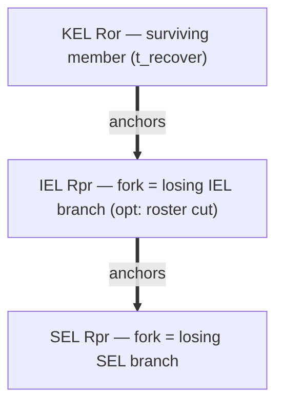
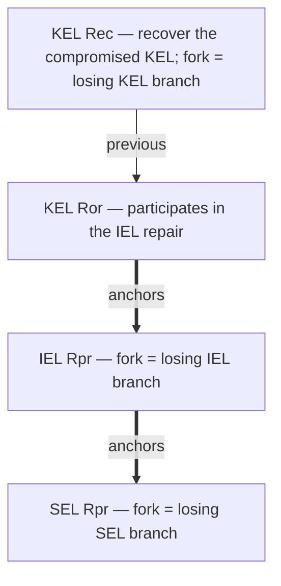

# IEL reconciliation — divergence and repair

_Forthcoming._ The full IEL reconciliation doctrine lands here (mirroring
[`../kel/reconciliation.md`](../kel/reconciliation.md)); the cross-primitive rules it rests on are
in
[`../../../../protocol-doctrine.md` §Divergence and repair](../../../../protocol-doctrine.md#divergence-and-repair).
This stub carries the repair-cascade diagrams ahead of the prose.

## Repair cascade — a surviving member recovers

An IEL divergence is repaired by a threshold of surviving members. Each authors a KEL `Ror` (tier 3,
`t_recover`) that anchors an IEL `Rpr`; the IEL `Rpr` names the losing IEL branch in its
`manifest.fork` (and may fold in a roster `cut` that evicts the fork-causing member — the
repair-and-evict fold), and in turn anchors a SEL `Rpr` for each owned SEL that forked beneath it.
The cascade is authored **bottom-up** (KEL → IEL → SEL) and committed **top-down**, landing as one
atomic batch:

The `fork` root condemns the losing branch's whole subtree, so growth after the repair is dead by
descent. A SEL never forks under a linear IEL (anchor-monotonicity), so every genuine SEL fork rides
the IEL fork and is repaired by this same cascade.

## Repair cascade — a compromised member recovers (KEL `Rec`)

When the divergence-causing member is compromised rather than merely lagging, that member first
recovers its own KEL with a `Rec` (dual-sig — it reveals the recovery key; its `fork` condemns the
adversary's KEL branch), then participates in the IEL repair via the **subsequent** `Ror` (a `Rec`
hosts no anchor). The IEL / SEL cascade is otherwise identical:

