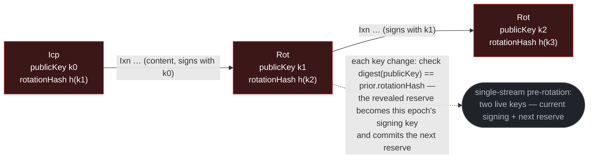

# KEL Events — Per-Kind Reference

Per-kind structural reference for the KEL event taxonomy: **five event kinds** (`Icp` / `Ixn` /
`Rot` / `Wit` / `Trm`) plus the founder `Fcp` inception variant. The cross-primitive field shape —
common fields, the `manifest` model, `previousSeal`, and the full per-kind field grid — is the
[event-shape reference](../event-shape.md#kel); this doc states the KEL-specific semantics: the
key-state fields, two-kind inception, the manifest roles a KEL event carries, forward-key
commitments, the two-tier capability model, sort priority, and the seal-advance cap.

For chain lifecycle (states, the seal and spine, locked-portion bound, page model), see
[`log.md`](log.md). For merge-layer routing, [`merge.md`](merge.md). For recovery doctrine,
[`compromise.md`](compromise.md). For the verifier walk, [`verification.md`](verification.md).

## Event taxonomy

| Kind  | Kind string              | Class     | Tier | Purpose                                                                                                                                                                                                                  |
| ----- | ------------------------ | --------- | ---- | ------------------------------------------------------------------------------------------------------------------------------------------------------------------------------------------------------------------------ |
| `Fcp` | `vdti/kel/v1/events/fcp` | inception | 1    | Federation-infrastructure inception (genesis, or an added witness — never self-bound).                                                                                                                                   |
| `Icp` | `vdti/kel/v1/events/icp` | inception | 1    | Standard inception (member or end-user KEL) — federation-bound (there is no direct mode).                                                                                                                                |
| `Ixn` | `vdti/kel/v1/events/ixn` | content   | 1    | Interaction — hosts tier-1 anchors; changes no keys, no seal. **The divergeable content kind** (first-seen, buriable).                                                                                                   |
| `Rot` | `vdti/kel/v1/events/rot` | sealed    | 2    | Rotation — reveals the next signing key, commits the next reserve; may host tier-2 anchors. **Seal-advancing.** Recovery is a plain `Rot`.                                                                               |
| `Wit` | `vdti/kel/v1/events/wit` | sealed    | 2    | Federation **rebind** (user KEL — changes `federation` / `witnesses`) / federation **governance** (witness KEL — a rotation anchoring the federation's governance event, which carries the `clock`). **Seal-advancing.** |
| `Trm` | `vdti/kel/v1/events/trm` | terminal  | 2    | Terminate — ends the chain on a clean linear landing. **Seal-advancing.**                                                                                                                                                |

The **class** column names the event's role under the
[divergence-and-recovery rules](../../../../protocol-doctrine.md#divergence-and-recovery): only
**content** (`Ixn`) is buriable. Everything above tier 1 is **sealed** — never buried or overturned
— including the **terminal** kind (`Trm`, which also ends the chain); so a branch carrying a `Trm`
counts as sealed in the divergence walk just as a `Rot` branch does. The **tier** column names which
key material is required to forge the event — see
[§Two-tier capability model](#two-tier-capability-model). The **Kind string** column is the kind's
versioned schema identifier (`vdti/kel/v1/events/…`).

## Two-kind inception

KEL inception is one of two structurally distinct kinds dispatched by the kind discriminator at v=0.
The kind determines the chain's service class — federation infrastructure or user device — and what
witnessing applies. KEL is concerned with key state only; delegation is an identity-layer concern
handled at the IEL primitive (see [`../iel/`](../iel/)), not a KEL inception kind.

| Kind  | When used                                                           | Federation binding             | Witnesses                  | Eligible as federation member                                                                         |
| ----- | ------------------------------------------------------------------- | ------------------------------ | -------------------------- | ----------------------------------------------------------------------------------------------------- |
| `Fcp` | Federation-infrastructure inception (genesis, or an added witness). | absent                         | forbidden                  | yes — the only eligible root: genesis via the bootstrap batch, added via the joining consent (below). |
| `Icp` | Standard inception (member or end-user KEL).                        | `federation` + `federationPin` | the `witnesses` role (req) | no — a federation roster admits only `Fcp`-rooted chains.                                             |

The verifier dispatches at v=0 on kind:

- `Fcp` → federation-infrastructure chain (a witness device). It carries no `federation` binding and
  no `witnesses` — a witness is bound by roster membership, never self-bound, and its events are
  peer-witnessed under the federation's config, never a per-chain one — and it cannot stand alone:
  its v=1 anchors the federation establishment act it serves. At **genesis** that is the `Rot`
  anchoring the federation IEL's `Fcp` marker (kind-strict, tier-2 → tier-2) in the same
  dependency-ordered bootstrap bundle — that federation IEL `Fcp` (the `Fcp`-rooted inception
  marker) is brought into existence in that same bundle (see
  [`../../../../substrate/federation/bootstrap.md`](../../../../substrate/federation/bootstrap.md)).
  An **added witness** opens with its consent `Ixn` anchoring the admitting governance `Wit` instead
  — unwitnessed exactly as genesis is, trust rooted in the witnessed admitting act.
- `Icp` → federation-bound from inception. `federation` (the federation IEL prefix) and
  `federationPin` (the as-of federation position) declare the binding, and the `witnesses` manifest
  role declares the chain's witnessing policy — **all required**. Every identity is
  federation-witnessed: an `Icp` that omits `federation` is **malformed → rejected** (there is no
  direct mode).

## The identity bond

Every chain is born into the service of exactly one identity, and declares it at **serial 1**: the
serial-1 event anchors that identity's establishment act, and the bond is permanent — a chain never
re-bonds. The four openings are acts the design already has:

- a **genesis witness** — `Fcp`, then the `Rot` anchoring the federation's inception marker;
- an **added witness** — `Fcp`, then the consent `Ixn` anchoring the admitting governance `Wit`;
- an **initial roster member** — `Icp`, then the `Rot` anchoring the identity's inception;
- an **added member** — `Icp`, then the consent `Ixn` anchoring the admitting evolve.

Two checks enforce it, both on chain data at the gating moment. The KEL verifier requires serial 1
to anchor exactly one identity-establishment act — that identity is the chain's, for life. And
roster-delta validation admits a prefix only if its serial-1 bond names **this** identity (its
inception, or this admitting act). A previously-admitted chain of the same identity fails too — its
serial-1 names a _prior_ admitting act — so re-adding a member means a fresh chain, the same
replace-don't-resume posture the rest of the design follows. The root kind and the bond always agree
— a federation roster admits only `Fcp`-rooted chains, a user roster only `Icp`-rooted — so the
inception root is a trustworthy key for the two `Wit` facets below.

What the bond buys: a device chain can never serve, or be counted toward, a second identity — so
membership in two identities through one chain is unconstructable, and between acts the only lawful
federation-binding mismatch is the migration lag (members still on the old federation until they
each rebind). One chain per identity also means no cross-identity correlation through a shared
device chain. Chains and identities are deliberately cheap: an application gets its own identities,
an identity its own chains — shorter chains verify faster, and the correlation resistance comes from
construction, not policy. When an identity reincepts, its members return on fresh chains (each old
bond names the dead prefix) — a clean break, since the compromise that forced the dispute may have
touched member devices.

## Key-state fields

The canonical per-kind field grid — `publicKey` / `rotationHash` / `federation` / `federationPin` /
`previousSeal` / `manifest`, with each kind's req / fbd / opt — is the
[event-shape reference](../event-shape.md#kel). The KEL-specific key-state semantics:

| Kind          | `publicKey` | `rotationHash` |
| ------------- | ----------- | -------------- |
| `Fcp` / `Icp` | req         | req            |
| `Ixn`         | fbd         | fbd            |
| `Rot` / `Wit` | req         | req            |
| `Trm`         | req         | fbd            |

`publicKey` is the signing key effective at this event; `rotationHash` is the forward-key digest
committing the next reserve. Key state is a **single-stream pre-rotation**: the reserve committed by
one event's `rotationHash` is revealed at the next key change to sign it and thereby becomes that
epoch's signing key, which then commits the next reserve — so a device holds exactly two live keys,
the current signing key (last epoch's revealed reserve) and the next reserve (committed,
unrevealed). The forward-key commitment drives the pre-rotation mechanic — see
[§Forward-key commitments](#forward-key-commitments). The sealing kinds (`Rot` / `Wit` / `Trm`)
additionally carry the top-level `previousSeal` spine back-link
([`log.md` §The spine](log.md#the-spine)).

A device signing key has a **validity window** — the interval a consumer reads it against when
checking that a signature was current when it signed (sender-key currency): from the **witnessed
time** of the `Rot` that reveals the key to that of the next `Rot` that supersedes it, where an
event's witnessed time is its threshold-crossing receipt τ
([witnessing §An-event's-witnessed-time](../../../../substrate/federation/witnessing.md#an-events-witnessed-time)).
The windows are not self-ordering, so a consumer **checks** them in-bounds and non-decreasing along
the chain and **reports** on its verification token — the same compute-check-report discipline every
chain property rides.

## The manifest — roles a KEL event carries

A KEL event commits to higher-layer SAIDs and its witnessing policy through a **`manifest`** — the
SAID of a role-grouped SAD
([event-shape §The manifest](../event-shape.md#the-manifest--what-an-event-commits-to-grouped-by-role)).
A KEL event's manifest may carry only these roles; one carrying any role outside this vocabulary is
malformed and rejected, and a role is consumed only after dispatching on a kind permitted to carry
it (read kind-first):

| Role        | Carried by                       | Commits to                                                                                                                     |
| ----------- | -------------------------------- | ------------------------------------------------------------------------------------------------------------------------------ |
| `anchors`   | `Ixn` (req, ≥ 1) / `Rot` / `Wit` | IEL event SAIDs this event anchors — never a SEL event or a raw SAD (a `Wit` anchors exactly the IEL `Wit` it participates in) |
| `witnesses` | `Icp` / `Wit`                    | the witness-config SAD `{ threshold, signers }`                                                                                |

A seal-advancing event does **not** commit its content run: the retained run since the prior seal is
the derivable `[previousSeal..previous]`, and "content was folded" is the predicate
`previous != previousSeal`. There is no repair kind and no losing-branch commitment — a content
loser is buried **by position + ascent** (the burying seal-advancer's seal-cap locks its first
event, and everything grown on it is dead on ascent), naming no root.

### Anchors

The `anchors` role is a flat list of **IEL event SAIDs**, held **strictly ascending** (sorted and
distinct — order-independent, the sorted-set rule in [`../../sad/said.md`](../../sad/said.md), so
two producers batching the same anchors mint one event, not a spurious fork) — a KEL **always**
anchors IEL events, **never** a SEL event or a raw SAD (an SEL event is anchored only by its owner
IEL; a document reaches the chain only through its SEL). Like every inline manifest list it is
capped at `MAXIMUM_MANIFEST_LIST = 128` entries, the verifier rejecting an over-length list in
structural validation
([`../event-shape.md` §The manifest](../event-shape.md#the-manifest--what-an-event-commits-to-grouped-by-role)).
Which KEL kind anchors which IEL kind is the kind-strict cross-primitive anchor matrix
([§Tiers](../../../../protocol-doctrine.md#tiers)). Two properties motivate the bare-SAID list
shape:

- **Privacy.** The list carries bare SAIDs, never per-entry role tags. SAIDs are opaque —
  type-qualified base64 hashes that reveal nothing without fetching the target — so anchor structure
  opens no side-channel.
- **Batching.** `Ixn` / `Rot` may carry several anchors in one event, saving separate chain entries
  — and their signatures — when an operator legitimately anchors multiple SAIDs at one chain
  position.

`Ixn` carries the `anchors` role required (≥ 1) — anchoring is its purpose; `Rot` carries it
optionally. A **`Wit`** carries **exactly one** anchor — the IEL `Wit` it participates in
(kind-strict, tier-2 ↔ tier-2) — alongside its top-level `federation` / `federationPin` binding and
its `witnesses` role. **`Fcp` / `Icp`** carry their federation binding in the top-level fields and
their witnessing policy in `witnesses` — never as anchors — keeping inception minimal. **`Trm`
carries no anchors** — it ends the chain.

KEL verification validates anchor **format** only — each entry is a SAID-shaped token. Anchor
**satisfaction** — what a SAID points to, and which kind-strict anchor rules apply — is
downstream-verifier responsibility: the **IEL** verifier enforces the anchored IEL event's _kind_
and _tier_ per [§Tiers](../../../../protocol-doctrine.md#tiers) when resolving an IEL event's
authorization against its KEL anchors.

### Federation binding and witnesses

The federation context lives in two top-level fields plus the `witnesses` manifest role, on the
kinds that establish or change it. `federation` is the federation IEL **prefix** (which federation —
it follows the federation's evolution); `federationPin` is a **SAID** pinning the as-of federation
position; the `witnesses` role commits the witness-config SAD `{ threshold, signers }`. The exact
req / fbd / opt per kind is the [event-shape reference](../event-shape.md#kel)'s. On a user
(`Icp`-rooted) KEL the `federation` **prefix** is carried only by `Icp` (the root binding) and `Wit`
(an actual **rebind**). `federationPin` is **optional on every body event** (`Ixn` / `Rot` / `Trm`):
present = a forward **re-pin** within the inherited federation, absent = inherit the prior pin. So a
same-federation re-pin rides whatever event the chain authors next — no `Wit` needed (e.g. a stale
terminal `Trm` re-pins and terminates in one event). A `federationPin` on a non-`Icp`/`Wit` event
must **resolve within the inherited `federation` prefix** — a re-pin can never become a backdoor
rebind. Forward-only is **emergent**, not a structural check: ordering two federation positions is a
_cross-chain_ walk (the KEL verifier is self-contained — it never orders positions on another
chain), so a stale/backward pin lands chain-valid but **un-witnessed** (the currency gate refuses a
non-current roster; the clock refuses closed-window keys) and is cleared by pinning forward. `Fcp`
carries neither (federation-infrastructure — bound by roster membership, never self-bound).

A `Wit` event **rebinds** federation context (the must-change rule and the two facets are below). A
same-federation **re-pin** (advancing `federationPin` within the same federation) is **not** a `Wit`
— since `federationPin` is optional on every event, a re-pin rides whatever the chain authors next,
which is how an active chain answers the witness currency gate after a federation cut. See
[`../../../../substrate/federation/bootstrap.md`](../../../../substrate/federation/bootstrap.md) for
the bootstrap ceremony, the founder genesis (`Fcp → Rot`) pattern, and the inter-federation
re-binding mechanics. A `Wit` **is** the rotation — it refreshes the signing key and the rotation
reserve — so it is structurally **tier-2**, single-signed with the reserve; this is a property of
`Wit`'s own signature shape.

**The `Wit` kind has two facets, dispatched by the inception root — and a `Wit` is never a no-op.**
The **`Icp`-rooted (user) KEL** facet is the identity's federation rebind, carrying `federation` /
`federationPin` (+ optional `witnesses`) and anchoring the **user IEL `Wit`** (kind-strict); it
**must change `federation` or `witnesses`** — changing neither is rejected (a same-federation re-pin
rides a body event, a pure rotation is `Rot`). On an **`Fcp`-rooted (federation-witness) KEL**, a
`Wit` is instead federation **governance**: it anchors the **federation IEL `Wit`** (kind-strict)
and is **never self-bound** — it carries **no** `federation` / `federationPin` (a federation witness
is bound by roster membership, not by self-declaring a federation). A governance `Wit` is **always a
rotation** of its participants and advances the monotonic federation `clock` (a roster delta
optional on top), so the rotation + clock advance **is** the change — it has **no** must-change
predicate. The deep federation-governance mechanics — self-attestation, the recoverability cap, the
federation clock — are federation doctrine
([`../../../../substrate/federation/witnessing.md`](../../../../substrate/federation/witnessing.md)).
The root is a trustworthy facet key because the identity bond forces it to agree with the served
identity: a federation roster admits only `Fcp`-rooted chains, a user roster only `Icp`-rooted
([the identity bond](#the-identity-bond)).

## Authorization and signature shapes

The **authorization** column names which signature the verifier requires for the event to be
accepted. Every KEL event is **single-signed**. Tier-1 events are signed by the signing key in
effect at this chain position — declared by the event itself for inception (`Fcp` / `Icp`),
inherited from the most recent prior establishment for `Ixn`. Tier-2 events (every key change) are
signed by the new signing key the rotation reserve reveals — never by the old signing key.

| Kind  | Signature                                                                             |
| ----- | ------------------------------------------------------------------------------------- |
| `Fcp` | new signing key (declared `publicKey`; self-authenticating against prefix derivation) |
| `Icp` | new signing key (declared `publicKey`; self-authenticating against prefix derivation) |
| `Ixn` | current signing key (most recent establishment's `publicKey`)                         |
| `Rot` | new signing key revealed by `publicKey` (preimage of prior `rotationHash`)            |
| `Wit` | new signing key revealed by `publicKey` (preimage of prior `rotationHash`)            |
| `Trm` | new signing key revealed by `publicKey` (preimage of prior `rotationHash`)            |

`Rot` / `Wit` / `Trm` advance the seal — they are the **sealing** kinds, tracked via
`last_seal_advancing_event`; `Trm` belongs to it too (it advances the seal to its own serial and is
terminal). Once a rotation lands, the reserve preimage it revealed is public — the revealed
`publicKey`, unable to sign; only a thief of its matching **private** half (now the current signing
key) can forge a _late_ competing rotation (declined) — see
[`log.md` §The seal, the spine, and the locked-portion bound](log.md#the-seal-the-spine-and-the-locked-portion-bound)
and [`compromise.md`](compromise.md).

## Two-tier capability model

KEL events are classified by **tier** — the cryptographic material an adversary must hold to forge
the event.

- **Tier 1 — signing key alone.** Adversary holds the current signing key. They can land `Ixn`.
  Inception (`Fcp` / `Icp`) sits at tier 1 by signature shape — signed by the inception's declared
  signing key — but isn't a forge-target against an existing chain: the prefix derives from the
  whole-SAD content (see [`log.md` §Prefix derivation](log.md#prefix-derivation)), so a specific
  prefix's inception cannot be forged without a Blake3-256 collision. No hidden reserve is revealed.
- **Tier 2 — the rotation reserve alone.** Adversary holds the preimage of the prior establishment's
  `rotationHash`. They can land `Rot` / `Wit` / `Trm`. The reserve reveals what _becomes_ the new
  signing key for the event's single signature — the old signing key is **not** a prerequisite for
  tier 2. Rotation exists precisely so an operator can recover when the old signing key is
  compromised; requiring the old signing key to authorize rotation would defeat the purpose.

**Common framing mistake.** Tier 2 is not "signing + rotation reserve." The old signing key is not a
prerequisite for tier 2. Adding "signing +" conflates "what an adversary needs to compromise to
produce this event" with "what keys are referenced by this event." The signing key applies _only_ to
tier 1.

**The boundary case.** Post-rotation the _just-revealed_ reserve **is** the current signing key, so
the current signing key can forge a competing seal **at its own serial** — a late rival to the
rotation that revealed it, first-seen-declined under honest witnesses, a brick under witness
collusion
([`compromise.md` §The live-tip dispute is a killswitch](compromise.md#the-live-tip-dispute-is-a-killswitch-forced-by-structure)).
This does not loosen "signing key → tier 1 only": the capability is the **spent reserve's**, exposed
only after its own rotation revealed it, and authorizes nothing beyond that one already-taken
position.

The two tiers set the cryptographic cost of forging each act; the cross-layer binding is
**kind-strict** ([§Tiers](../../../../protocol-doctrine.md#tiers)): each IEL or SEL operation is
anchored by **exactly** the KEL kind that reveals the capability it exercises. The tier hierarchy
makes the cost of forging a governance act, binding establishment, or terminal event on an IEL or
SEL strictly higher than the cost of forging routine extension events on its contributing KELs.
**The reserve defends the signing key, never the rotation key** — a reserve-holding adversary can
just extend the chain with a rotation to their own key, an unrecoverable takeover
([`compromise.md`](compromise.md)).

### Anchoring is kind-strict

A leaf-anchor check is **exact-event-kind**, not minimum-tier-capability: an IEL / SEL act is
anchored **only** by the KEL kind that reveals the matching capability — content ← `Ixn`; tier-2
establishment / governance / kill / terminal ← `Rot`; the federation rebind (the IEL `Wit`) ← `Wit`.
A higher-tier KEL event does **not** stand in for a lower-tier anchor (a `Rot` does not host a
tier-1 anchor in place of an `Ixn`). See [§Tiers](../../../../protocol-doctrine.md#tiers).

## Forward-key commitments

An **establishment event** reveals a key (checked against the prior establishment's commitment) and
**establishes authoritative state** — new key state, or the terminal terminated state. Most also
commit the forward-key digest for their successor; the terminal `Trm` establishes state (and reveals
a key) but commits **none** — it admits no successor. The content `Ixn` establishes no state (it
anchors content under the existing key state) and is not an establishment event; it commits none:

| Kind          | `rotationHash`       |
| ------------- | -------------------- |
| `Fcp` / `Icp` | required             |
| `Rot` / `Wit` | required             |
| `Trm`         | forbidden (terminal) |
| `Ixn`         | forbidden            |

The verifier seeds the tracked `rotationHash` from the inception event and updates it on each
establishment event. Future revelations are checked against the tracked digest: at each `Rot` /
`Wit` / `Trm`, the verifier checks `digest(publicKey) == prior.rotationHash`.



## Seal-advance cap

KEL has one protocol-enforced cap (the seal-advance cap).

A seal-advancing event (`Rot` / `Wit`; the terminal `Trm` also advances the seal but ends the chain)
must land at least every `MAXIMUM_UNSEALED_RUN` non-seal-advancing events per lineage. The cap
bounds the **fold** — the content run since the last seal — to `MAXIMUM_UNSEALED_RUN` events on each
branch, so the canonical two-branch content fork plus the resolving burying seal-advancer is **sized
to fit** one page (`MINIMUM_PAGE_SIZE = 129 = 2·MAXIMUM_UNSEALED_RUN + 1`): a source → sink transfer
can carry both competing content branches plus the burying seal-advancer in one atomic page, since
the sink holds neither branch in storage. A local node's hot page is smaller still (its retained
branch ≤ `MAXIMUM_UNSEALED_RUN` plus the burying seal-advancer; the losing branch is buried by
position + ascent, validated from retained storage). See
[`log.md` §Seal-advance cap](log.md#seal-advance-cap) and
[§Forks are seal-bounded](../../../../protocol-doctrine.md#forks-are-seal-bounded).

**Adversary bound.** The seal-advance cap bounds each of an adversary's fork lineages at
`MAXIMUM_UNSEALED_RUN` events past the last seal before they must produce a seal-advancing event —
which requires at least tier-2 capability (the rotation reserve). A tier-1 adversary lacking the
reserve cannot extend a lineage beyond the cap. Builders auto-insert `Rot` when an `Ixn` would
exceed the cap. Seal-cap satisfiers are `{Rot, Wit}` — `Trm` advances the seal but is terminal, so
it is not a mid-chain cap-satisfier.

## Per-kind sort priority

The merge layer orders events at the same serial deterministically by
`(serial ASC, kind sort_priority ASC, said ASC)`. Sort priorities:

| Kind  | Sort priority |
| ----- | ------------- |
| `Fcp` | 0             |
| `Icp` | 1             |
| `Ixn` | 2             |
| `Rot` | 3             |
| `Wit` | 4             |
| `Trm` | 5             |

The ordering matters for adversarial-input diagnostics. Two competing `Ixn` events in a fork get the
same priority and break the tie by SAID — identical ordering across all nodes, so deduplication and
divergence detection produce the same result on every node. The sealed sort priorities keep sealed
events ordered after `Ixn` within a batch for consistent merge-layer evaluation: a sealed event
whose landing would create or join a divergence cannot extend the canonical chain past the seal — it
is **retained as non-canonical evidence** rather than landing as a canonical sibling (per
[§Divergence and recovery](../../../../protocol-doctrine.md#divergence-and-recovery)); a clean
linear-extension sealed event lands normally.

The `said` tiebreaker is for determinism only and has no semantic meaning.

## Typical chain shapes

### Federation-infrastructure inception shapes

```
s0  kind=fcp  publicKey=k0,  rotationHash=h(k1)
s1  kind=rot  publicKey=k1,  rotationHash=h(k2),
              previousSeal=fcp.said,  manifest={ anchors: [fed_iel_fcp.said] }
              ← reveals k1; signed by k1 (tier-2); anchors the federation IEL Fcp
```

The `Fcp` inception is unwitnessed and carries no `federation`, no `witnesses` — at genesis because
no federation exists yet to witness it. The v=1 `Rot` anchors the federation IEL's `Fcp` marker
(kind-strict, tier-2 → tier-2) and is the first seal, so it carries `previousSeal = fcp.said` (the
spine root). The founder is bound to the federation by being named in the roster it founds — never
self-bound — so it carries no `federation` / `federationPin`. That federation IEL `Fcp` is brought
into existence in the same dependency-ordered bootstrap bundle — see
[`../../../../substrate/federation/bootstrap.md`](../../../../substrate/federation/bootstrap.md).

An **added witness** opens the same way with a different serial-1 act: `Fcp` at s=0, then its
consent `Ixn` anchoring the admitting governance `Wit` (tier-1 — the joining-not-rotating consent).
The pair is unwitnessed exactly as genesis is, its trust rooted in the **witnessed** admitting
`Wit`; nothing trust-bearing rides the unwitnessed pair alone.

### Standard inception

```
s0  kind=icp  publicKey=k0, rotationHash=h(k1),
              federation=fed_iel.prefix,  federationPin=fed_iel_pos.said,
              manifest={ witnesses: {threshold, signers} }
```

The `Icp` binds to an existing federation at v=0 via `federation` / `federationPin`; its `witnesses`
role declares the chain's witnessing policy. End-user chains and post-bootstrap federation-member
chains use this shape. There is no direct mode — a `federation`-less `Icp` is rejected.

### Normal lifecycle

```
s0   kind=icp  publicKey=k0,  rotationHash=h(k1),
                federation=fed_iel.prefix, federationPin=..., manifest={witnesses}
s1   kind=ixn  manifest={ anchors: [said_a] }                ← signed by k0
s2   kind=rot  publicKey=k1,  rotationHash=h(k2),            ← reveals k1; signed by k1
                previousSeal=icp.said                          ← seals; folds s1 (previous != previousSeal)
s3   kind=ixn  manifest={ anchors: [said_b, said_c] }        ← batched; signed by k1
...
s64  kind=rot  publicKey=kN,  rotationHash=h(kN+1),          ← keeps the chain inside the seal-advance cap
                previousSeal=<prior seal>.said                 ← seals; folds the run since the prior seal
```

The `Rot` at s2 is the first seal, so `previousSeal = icp.said` (the spine root); each later seal
back-links to its predecessor. The `Rot` at s64 keeps the chain inside the seal-advance cap.

### Divergence resolved by recovery

```
s0..s4   normal chain (seal at the most recent prior seal-advancing event)
s5a  kind=ixn  manifest={ anchors: [said_a] }          ← content fork
s5b  kind=ixn  manifest={ anchors: [said_b] }          ← content fork
     — chain is Forked (frozen); recoverable via a burying seal-advancer —
s6   kind=rot  previous=s5a.said,                       ← Rot extends the branch its author keeps
                publicKey=k6, rotationHash=h(k7),         signed by k6 (tier-2, the reserve)
                previousSeal=<prior seal>.said            ← seals past the loser
```

Recovery is a plain `Rot` that **buries at the root**: it extends the branch its submitter keeps and
advances the seal past the loser, so the competing `s5b` (and anything grown on it) is locked below
the new seal and **dead on ascent**. There is no repair kind, no recovery key, and no losing-branch
commitment — burial is by position + ascent. Go for the **root**, not the thief's tip: however long
a run the thief piled on, it all hangs off the buried point and dies at once. See
[`compromise.md` §Recovery is a plain Rot](compromise.md#recovery-is-a-plain-rot-that-buries-at-the-root).

### Clean terminate

```
s0..sN   normal chain
sN+1     kind=trm   ← Trm ends the KEL cleanly; single-signed with the reserve;
                      advances the seal to its own serial; previousSeal=<prior seal>.said
```

After `Trm`, the chain is fully terminal. Two independent merge-layer mechanisms close off every
subsequent submission: a **content** sibling to the `Trm` (sharing parent `v_{N}`) resolves at the
seal-cap's at-seal branch — dead below the `Trm`'s seal, retained → `Buried` — and a submission
chaining from the `Trm` is rejected by the kind-schema rule (`Terminal` — no kind admits a `Trm`
parent). See [`merge.md` §Routing order](merge.md#routing-order). A concurrent sealed event racing
the `Trm` at the same serial on another node is retained as non-canonical evidence and read
data-locally — see [`reconciliation.md` §Matrix 3](reconciliation.md#matrix-3-race-matrix).

## Cross-references

- [`../event-shape.md`](../event-shape.md#kel) — cross-primitive event shape: common fields, the
  `manifest` model, `previousSeal`, the canonical per-kind field grid.
- [`log.md`](log.md) — chain primitive: states, prefix derivation, the seal and spine,
  locked-portion bound, page model.
- [`merge.md`](merge.md) — merge-layer routing.
- [`compromise.md`](compromise.md) — recovery doctrine, recovery as a plain `Rot`, two-tier
  compromise model.
- [`verification.md`](verification.md) — verifier algorithm and kind dispatch.
- [`../../../../protocol-doctrine.md`](../../../../protocol-doctrine.md) — tiers and kind-strict
  anchoring, divergence and recovery, forks-are-seal-bounded, inception tiers.
- [`../../sad/said.md`](../../sad/said.md#derivation) — SAID and prefix derivation algorithms.
- [`../iel/`](../iel/) — IEL primitive. Delegation is an identity-layer concern and lives there
  (delegated IEL inception; declare / rescind delegation); the `del(delegator)` policy node operates
  on IEL prefixes, not KEL prefixes.
- [`../../../../substrate/federation/witnessing.md`](../../../../substrate/federation/witnessing.md)
  — federation witnessing.
- [`../../../../substrate/federation/bootstrap.md`](../../../../substrate/federation/bootstrap.md) —
  federation bootstrap (the dependency-ordered genesis bundle).
