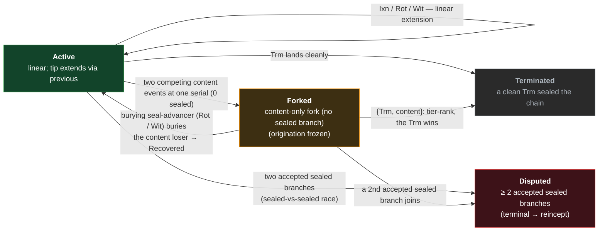

# KEL — Key Event Log

The **Key Event Log** (KEL) is a per-prefix chain of cryptographically-linked signed key events
describing a controller's evolving signing key state. Each event is a [SAD](../../sad/sad.md)
carrying chain-linkage fields (`prefix`, `previous`, `serial`, `kind`) plus kind-specific
commitments; authority is asserted by direct signature against keys committed by prior establishment
events. The per-kind field shape is the cross-primitive [event-shape reference](../event-shape.md);
this doc and its siblings state the KEL-specific doctrine.

KEL is the foundation primitive in VDTI's chain-of-trust composition. IEL events and SEL events root
in KEL events — the [tier model](../../../../protocol-doctrine.md#tiers) ties the cryptographic
difficulty of forging a sealed IEL / SEL act to the difficulty of forging the corresponding KEL
anchor.

Like the IEL and SEL, the KEL is a **mixed chain**: tier-1 **content** (`Ixn`, first-seen and
recoverable) rides alongside a tier-2 **sealed** spine (`Rot` / `Wit` / `Trm`, record-both and
terminal-on-divergence).

This doc states the chain primitive: prefix derivation, the per-node chain states, the seal and the
spine, the locked-portion bound, and the page / chunking model. Per-kind reference lives in
[`events.md`](events.md); merge-handler routing in [`merge.md`](merge.md); recovery doctrine in
[`compromise.md`](compromise.md); the verifier walk in [`verification.md`](verification.md); the
cross-node correctness proof in [`reconciliation.md`](reconciliation.md).

## Prefix derivation

A KEL inception event is a
[prefix-deriving SAD](../../sad/said.md#chain-inception-events-prefix-deriving-sads): its prefix is
the whole-content digest of the inception body —
[`said.md` §Derivation](../../sad/said.md#derivation) owns the mechanic (the two Blake3-256 hashes
and the fixed-value placeholder). What the **KEL** prefix commits to is the inception's `publicKey`,
`rotationHash`, kind discriminator, and — on an `Icp` — its `federation` / `federationPin` binding,
so two distinct inception events cannot share a prefix without a Blake3-256 collision. Subsequent
events inherit the inception's `prefix` and derive only `said`.

KEL inception is dispatched by **kind** at v=0 — see
[`events.md` §Two-kind inception](events.md#two-kind-inception). The kind determines whether the
chain is pre-federation (`Fcp`) or federation-bound from inception (`Icp`). The verifier dispatches
structural behavior on the kind; consumer trust composes through the
[config-pinned federation prefix set](../../../../protocol-doctrine.md#federation-witnessing-in-verification).

## Per-node chain states

A KEL is in exactly one of **four** states **on any given node** — Active, Forked, Disputed, or
Terminated. Every state is **computed by a data-local walk** over the events the node holds, never
tracked as a separate flag. A live fork is **two distinct states**, not one: **Forked** (a
content-only fork — no accepted sealed branch, recoverable) and **Disputed** (≥ 2 **accepted**
sealed branches — terminal). The walk that tells them apart (counting the **accepted** sealed
branches past the fork) **is** how the state is computed — not a "reading" layered on a single
divergent state.

| State          | Description                                                                                                                                                                                                                                                                                                                                                                                                                                                                                                                                                                                                                         | Accepts new events?                                                                                                                                                                                                                 |
| -------------- | ----------------------------------------------------------------------------------------------------------------------------------------------------------------------------------------------------------------------------------------------------------------------------------------------------------------------------------------------------------------------------------------------------------------------------------------------------------------------------------------------------------------------------------------------------------------------------------------------------------------------------------- | ----------------------------------------------------------------------------------------------------------------------------------------------------------------------------------------------------------------------------------- |
| **Active**     | Linear chain; the current tip extends cleanly via `previous`.                                                                                                                                                                                                                                                                                                                                                                                                                                                                                                                                                                       | Yes — `Ixn` / `Rot` / `Wit` / `Trm` per their authorization and seal-cap requirements.                                                                                                                                              |
| **Forked**     | A live **content-only** fork (no accepted sealed branch) past it — recoverable; a fork **carrying** an accepted sealed branch has that seal bury the content and reads Active, not a live fork. Origination onto the live fork is frozen. The way forward is a **burying seal-advancer** (a `Rot` / `Wit`) on the winning branch that buries the content loser below the new seal, after which the chain re-reads Active (carve-out: a `{Trm, content}` fork resolves by tier-rank — the terminal `Trm` wins). A below-seal straggler arriving after the chain sealed past its serial is inert, retained as evidence, not a freeze. | Only the resolving event — a burying seal-advancer on the winning branch. A second **accepted** sealed branch joining the fork moves it to **Disputed**.                                                                            |
| **Disputed**   | A live fork with **≥ 2 accepted sealed branches** past it — terminal. No sealed branch can be buried (that would resurrect retired keys), so nothing resolves it and the prefix must **reincept**.                                                                                                                                                                                                                                                                                                                                                                                                                                  | None (barring a partition) — witnesses decline any extension of a disputed chain. The only exit is reincept.                                                                                                                        |
| **Terminated** | A terminal `Trm` landed cleanly. The `Trm` advances the seal to its own serial; the chain is sealed there.                                                                                                                                                                                                                                                                                                                                                                                                                                                                                                                          | None. A content sibling to the `Trm` is inert below its seal (`Sealed`); a sealed sibling is a second accepted sealed branch → **Disputed**; a submission chaining from the `Trm` is rejected by the kind-schema rule (`Terminal`). |

Recovery keeps the recovering party's own branch and buries the rest by position + ascent, returning
the chain to Active — possible only when no buried branch carries a **sealed** event (see
[`compromise.md`](compromise.md)). Two byte-identical events at one serial **are one event** — they
dedupe by SAID, never a second branch; only distinct events collide. The full freeze-and-recover
rule is the protocol doctrine's —
[§Divergence and recovery](../../../../protocol-doctrine.md#divergence-and-recovery).

### Forked versus Disputed — a data-local walk

Which state a live fork is in turns on **tier**, read from the data by counting the **sealed
branches** — per branch, wherever each branch's seal sits (the content count is irrelevant — all
content is buriable):

- **Forked** — **no branch carries an accepted seal** at the divergence or above (a content-only
  fork; a **single** accepted sealed branch buries the content and reads **Active** instead — a
  resolved fork, not a live one). A content fork is buried by a seal-advancer (a `Rot`) on the
  recovering party's branch; every competing content branch closes below the new seal, dead on
  ascent. While the fork stands the state is `Forked`; the effective SAID is a type-tagged synthetic
  recoupled to the verdict, qualified by prefix and position (below).
- **Disputed** — **two or more branches each carry an accepted seal** (at the divergence or above,
  counted per branch — wherever the seals sit). No sealed branch can be buried (a sealed event is
  never overturned — that would resurrect retired keys), so no single chain can be chosen and the
  prefix must **reincept**. The state is `Disputed` — the same synthetic effective SAID; the verdict
  is the walk's, never encoded in the value. A `{Rot, Rot}` disputed is moreover a **confirmed
  rotation-reserve compromise** — two valid rotations reveal the one reserve preimage in force at
  `v_{d-1}`.

Which reading holds is a **branch-level fact any verifier computes data-locally** by walking the
**retained** branches — a node retains a competing branch as non-canonical evidence rather than
discarding it at the seal-cap ([§The locked portion](#the-locked-portion)). A node holding both
sealed branches reads `disputed` directly; a node holding only one fetches the rest via the
**witness beacon**, which **enumerates** the competing branch SAIDs. The federation **propagates**
the branches; it does **not** decide the verdict. See
[§Divergence and recovery](../../../../protocol-doctrine.md#divergence-and-recovery) and
[§Effective-SAID comparison](../../../../protocol-doctrine.md#effective-said-comparison).

## The seal, the spine, and the locked-portion bound

The KEL verifier surfaces one forward-only watermark on its
[`KelVerification`](verification.md#kelverification-token) token, computed from the chain's events.

| Concept                     | Advances on           | Used for                                                                                                                                                                                                                                                                                                                                                                                                                                                                                          |
| --------------------------- | --------------------- | ------------------------------------------------------------------------------------------------------------------------------------------------------------------------------------------------------------------------------------------------------------------------------------------------------------------------------------------------------------------------------------------------------------------------------------------------------------------------------------------------- |
| `last_seal_advancing_event` | `Rot` / `Wit` / `Trm` | Seal-cap — a new event's parent must sit at-or-after this serial (below is the locked portion; the seal event itself is a legal parent). The **derived seal**: the most recent seal-advancing event with no competing accepted **sealed branch** from the divergence onward (a content sibling is buried below it, not a competitor; a fork with ≥ 2 accepted sealed branches has no clean seal above the divergence); the reading computes against it from the events held, never arrival order. |

`Trm` advances the seal to its own serial, where it is terminal — it opens no new window, since no
successor may land. Once a rotation lands, the reserve preimage it revealed is **spent** — it is the
revealed **public key**, public and **unable to sign**. Forging a _late_ competing rotation at that
position needs the position's **private** signing key (a live-key compromise), and even then it is a
**first-seen-declined** sibling (deferred-pending, forcing nothing) unless witnesses collude — so a
genuinely competing rotation the owner cannot veto needs the _next_ reserve, which is a takeover
(reincept + notify out of band), not a recoverable fork (see [`compromise.md`](compromise.md)).

### The spine

The seal-advancing events form a **spine**: every seal-advancing event carries a top-level
**`previousSeal`** back-link to the prior one, so following `previousSeal` renders a seal-only view
(`Icp → seal → seal → …`) while `previous` renders the full flat chain. The inception (`Icp` /
founder `Fcp`) is the spine root and carries no `previousSeal`. A seal-advancing event does **not**
commit its content run: the retained run since the prior seal is the derivable linear chain
`[previousSeal..previous]` (nodes keep the full bodies; the flat query returns them), and "content
was folded here" is the derived predicate `previous != previousSeal`. There is no repair kind and no
losing-branch commitment — a content loser is buried **by position + ascent**, named by nothing;
`Rot` / `Wit` / `Trm` carry no fold field.

The spine is a **convenience** view — the same walk with `previousSeal` for `previous`, giving
authority state and a terminal-divergence view (a spine fork is two competing seals) but not
recoverable content forks; the **flat** walk stays authoritative for content and detection (a
skipped or forged `previousSeal` surfaces as a competing seal once the real one is held). The
cross-primitive spine / fold model — the fail-secure reasoning included — is the protocol doctrine's
— [§Forks are seal-bounded](../../../../protocol-doctrine.md#forks-are-seal-bounded); the event
fields are the [event-shape reference](../event-shape.md)'s.

### The locked portion

The **locked portion** of a KEL is the segment **below** `last_seal_advancing_event` (strictly — the
seal-advancing event itself is a legal parent: the normal post-`Rot` append extends it). Events in
this segment are structurally immutable within the chain:

- A new event whose `previous` points into the locked portion is **rejected as a canonical
  extension** with `Sealed`. Whether that rejected fork is **retained as non-canonical evidence** is
  a separate, witnessing-gated decision — a losing **content** sibling on a witnessed chain never
  forms (nothing to retain), while a sealed branch is kept, so the proof a divergence occurred
  survives wherever a fork actually forms.
- The seal-cap's role is to deny revival attacks: a party holding stale authority (a rotation
  reserve already revealed — spent — by an earlier `Rot` / `Wit`, or a signing key since rotated
  out) cannot construct an event targeting the locked portion to rearrange the chain. Only current
  authority gates further extension.

### Pre-seal verifiability

The at-or-below-seal portion is permanently final — for the chain itself (no future event may target
it) and for consumers verifying anchors, credentials, and SEL bindings against it; the permanence
claims run against the last **clean** seal (a **witnessed** sealed fork — **two or more accepted
sealed branches**, wherever their seals sit — flips the reading to `disputed` without rewriting any
sealed event and retreats the clean seal to the divergence ancestor; a below-seal sealed straggler
is dropped, inert — backdate-safe). See
[`compromise.md` §Pre-seal verifiability](compromise.md#pre-seal-verifiability) for the structural
defense argument and
[§Divergence and recovery](../../../../protocol-doctrine.md#divergence-and-recovery) (_Pre-seal
verifiability_) for the cross-primitive framing.

### Once-revealed-final invariant

Once a key change lands, the reserve it revealed and the state it established are final. Subsequent
compromise of the key material it revealed does not retroactively unsatisfy the past authorization —
the chain's history at that serial is locked. Without this, history could be invalidated
retroactively by anyone who later comes to control the revealed key material, making terminal states
(recovered, terminated) unstable. The trade-off: a key controller who later turns adversarial cannot
undo their past contributions; only the going-forward spent-reserve effect applies.

## Seal-advance cap

A seal-advancing event (`Rot` / `Wit`; the terminal `Trm` also advances the seal but ends the chain)
must land at least every `MAXIMUM_UNSEALED_RUN` non-seal-advancing events **per lineage**. The cap
bounds the **fold** — the content run since the last seal — to `MAXIMUM_UNSEALED_RUN` events on each
branch, so the canonical two-branch content fork anchored at the last seal — both lineages (≤
`MAXIMUM_UNSEALED_RUN` each) plus the burying seal-advancer — fits in one page.

`MINIMUM_PAGE_SIZE = 129 = 2·MAXIMUM_UNSEALED_RUN + 1` is a protocol constant — a deployment floor,
not a per-deployment knob — so a fork-and-recover page produced on any conformant deployment fits on
every other. The page carries **both** competing content branches plus the burying seal-advancer
because a source → sink transfer delivers the fork to a sink that holds neither branch in storage. A
**local** discriminator needs less: its hot page is the retained branch (≤ `MAXIMUM_UNSEALED_RUN`)
plus the burying seal-advancer; the losing branch is buried by position + ascent, validated from
retained storage, not held in the page. The shapes that exceed one page (an own-`Rot` in the
retained tail; a ≥ 3-branch residual fork) ride earlier or later pages —
[`reconciliation.md` §Invariants](reconciliation.md#invariants) (invariant 3) carries the
derivation.

The seal-advance cap composes with the divergence-and-recovery rules to give the
[bounded-divergence invariant](reconciliation.md#invariants): an adversary holding less than the
rotation reserve can only submit `Ixn` events, and the cap limits each of their lineages to at most
`MAXIMUM_UNSEALED_RUN` events past the last seal before they must produce a seal-advancing event
(which requires at least tier-2 capability — see
[`compromise.md` §Two-tier compromise model](compromise.md#two-tier-compromise-model)).

## Page model

Chains are read, verified, written, and replicated in **pages** of bounded size. The page is the
unit of memory budget for the verifier walk, the unit of round-trip for storage reads, and the unit
of atomicity for the merge handler.

- **`MINIMUM_PAGE_SIZE` = 129** — protocol constant; the floor every conformant deployment must
  support. The seal-advance cap — **`MAXIMUM_UNSEALED_RUN` = `(MINIMUM_PAGE_SIZE − 1)/2` = 64** per
  lineage — is derived from this constant so a two-branch fork-and-recover page produced anywhere
  validates anywhere.
- **Page boundaries align with generations.** A generation is the set of events at the same serial.
  The verifier processes events in generation order (`serial ASC, kind sort_priority ASC, said ASC`)
  and re-fetches an incomplete generation at the next page boundary; a divergent generation that
  spans two pages re-fetches on the next page rather than being processed half-observed.
- **Deterministic intra-generation ordering.** Per-kind `sort_priority` (see
  [`events.md` §Per-kind sort priority](events.md#per-kind-sort-priority)) breaks intra-generation
  order so all nodes process the same batch identically. The `said` tiebreaker is for determinism
  only and has no semantic meaning.

The page model lets every operation be bounded-resource. The hot page — the retained branch plus the
burying seal-advancer — fits in one page (per the seal-advance cap derivation above). The verifier's
`max_pages` cap (default 64 pages ≈ 8K events; configurable via env var) caps resource use even on
adversarial chains.

## Chain-lifecycle paths (per-node)

The structural rules above produce three lifecycle paths per node.

- **Active extension.** Each new event extends the linear chain via `previous = tip.said`. Sealing
  kinds (`Rot` / `Wit` / `Trm`) advance `last_seal_advancing_event` to their own serial and carry
  `previousSeal`; the content kind (`Ixn`) leaves the seal where it was.
- **Divergence and recovery.** Two distinct events at one serial form a fork; the chain freezes
  further origination until a seal-advancer on the winning branch buries the loser below the new
  seal. The burying seal-advancer attaches at its submitter's own last good event, **retaining**
  that branch and burying every competing **content** branch below the new seal (its first event
  locked below the seal, its growth dead on ascent). Go for the **root**, not the loser's tip. Each
  dead lineage is depth-capped by the seal-advance cap; the retained branch plus the burying
  seal-advancer fits in one page. See
  [`compromise.md` §Recovery is a plain Rot](compromise.md#recovery-is-a-plain-rot-that-buries-at-the-root)
  for the two ways a burying seal-advancer can attach.
- **Clean retirement.** `Trm` lands as a linear extension of the current tip; the chain becomes
  Terminated. `Trm` advances the seal to its own serial and sits on the spine, but opens no new
  window — it permits no successor. Subsequent submissions are rejected by two independent
  mechanisms — the seal-cap rejects a sibling to the `Trm`; the kind-schema rule rejects a
  submission chaining from the `Trm` (see [`merge.md` §Routing order](merge.md#routing-order)). Past
  content keeps its meaning under the locked-portion bound.

Cross-node sealed-vs-sealed races — two federation nodes accepting different sealed events at the
same serial via independent clean linear extensions — are not a per-node state. Each node's seal-cap
**rejects the gossip-arriving competing event as a canonical extension but retains it as
non-canonical evidence**, so each node ends up holding both branches and reads the divergence by a
data-local walk; the witness beacon propagates the branches to a node that lacks them, but does not
decide the verdict. See [`reconciliation.md` §Matrix 3](reconciliation.md#matrix-3-race-matrix),
[§Divergence and recovery](../../../../protocol-doctrine.md#divergence-and-recovery), and
[§Federation convergence](../../../../protocol-doctrine.md#federation-convergence).

## End-verifiability

KEL's contribution to end-verifiability over data-from-any-source is two structural properties:
whole-content prefix derivation makes the inception event tamper-evident (substituting content would
require a Blake3-256 collision against both `prefix` and `said`), and locked-portion immutability
under the seal-cap means events at-or-below `last_seal_advancing_event` cannot be rearranged by any
future event — so anchors, credentials, and SEL bindings resolving to the locked portion stay
structurally trustworthy indefinitely. The cross-primitive framing (verify the data, not the source)
is canonical in
[`../../../../system-thesis.md` §End-verifiability](../../../../system-thesis.md#end-verifiability);
the recovery-side composition with the two-tier compromise model is in
[`compromise.md` §Pre-seal verifiability](compromise.md#pre-seal-verifiability).

## Cross-references

- [`../event-shape.md`](../event-shape.md) — cross-primitive event shape: common fields, the
  `manifest` model, `previousSeal`, per-kind field tables.
- [`events.md`](events.md) — per-kind reference: two-kind inception, sealing and non-sealing kinds,
  two-tier capability model, anchor requirements, seal-advance cap.
- [`merge.md`](merge.md) — merge handler routing: routing order, outcomes, locked-portion
  enforcement.
- [`compromise.md`](compromise.md) — recovery doctrine: two-tier compromise model, recovery as a
  plain `Rot`, pre-seal verifiability.
- [`verification.md`](verification.md) — verifier walk algorithm, kind dispatch at inception,
  signature verification, anchor checking.
- [`reconciliation.md`](reconciliation.md) — exhaustive case-matrix proof of cross-node convergence.
- [`../../../../protocol-doctrine.md`](../../../../protocol-doctrine.md) — tiers and kind-strict
  anchoring, divergence and recovery, forks-are-seal-bounded and the spine, operation categories,
  federation convergence, the effective-SAID comparison.
- [`../../sad/sad.md`](../../sad/sad.md), [`../../sad/said.md`](../../sad/said.md) — the SAD shape
  KEL events compose on; prefix and SAID derivation algorithms.
- [`../iel/`](../iel/) — IEL primitive. KEL events host the anchors that authorize tier-2 IEL acts
  per the tier model.
- [`../sel/`](../sel/) — SEL primitive. KEL events root the authority that SEL acts resolve down to,
  through the owner IEL.
- [`../../../../substrate/federation/witnessing.md`](../../../../substrate/federation/witnessing.md)
  — federation witnessing doctrine: the kind-scoped witnessing ladder, the witnessing floor, the
  beacon, divergent witness receipts, acceptance gating.
- [`../../../../substrate/federation/bootstrap.md`](../../../../substrate/federation/bootstrap.md) —
  federation bootstrap: the dependency-ordered ceremony that brings `Fcp` / `Rot` and the federation
  IEL `Fcp` into existence together.
