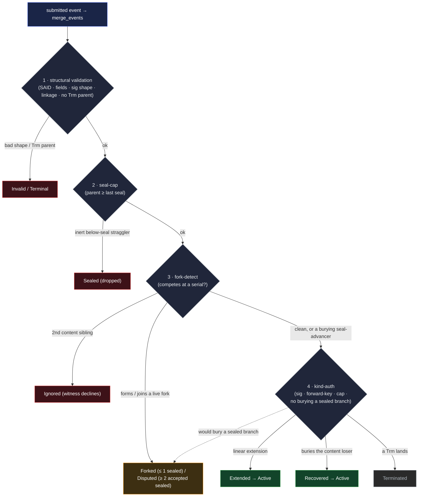

# KEL Merge — Handler Rules

The KEL merge layer integrates submitted events into the existing chain. It is the protocol's
enforcement surface for the locked-portion bound, the divergence-and-recovery rules, and the
seal-cap. The verifier produces a trust signal on a verification token; the merge layer composes
that signal with chain-state-dependent routing to admit or reject batches.

The merge layer integrates every structurally valid event (keep-all-data) and reads the chain's
state as a **pure walk** over the events held: a live fork freezes further **origination**, never
the reading, so two nodes holding the same events read the same state. Its structural checks — the
seal-cap, no-burying-a-sealed-branch, no self-burial — are the **shape-validity gate**: every chain
is federation-witnessed, so a selected witness mirrors them before signing, and a shape it declines
never reaches threshold (see
[`../../../../protocol-doctrine.md` §Divergence and recovery](../../../../protocol-doctrine.md#divergence-and-recovery)).

This doc states the merge-layer routing order, the merge outcomes, the routing rules per chain
state, and the adversarial-input diagnostic rationale that motivates the routing order. For per-kind
event rules, see [`events.md`](events.md); for the verifier walk,
[`verification.md`](verification.md); for the chain primitive, [`log.md`](log.md); for the
cross-node correctness proof, [`reconciliation.md`](reconciliation.md).

## Single entry point

`merge_events` is the single entry point for all write paths into a KEL — direct submissions, gossip
propagation, federation sync, and federation bootstrap bundles. It runs under a database advisory
lock for the duration of verification and write. Time-of-check-to-time-of-use is eliminated
structurally: the verifier reads under the same lock the merge handler will use to write (see
[§Merge verification and advisory locking](../../../../protocol-doctrine.md#merge-verification-and-advisory-locking)).

The merge handler returns either a **merge transition** (carrying the outcome, plus the resulting
state and new tip SAID) or a **merge rejection**.

## Merge outcomes

A merge returns one of two things — a **`MergeTransition`** on success (what the batch did to the
chain, named by the resulting state) or a **`MergeRejection`** when the batch changes nothing.

**Transitions** — each is named for its action or the state the chain is in after the batch lands
(`Extended` and `Recovered` both land **Active**). The Forked-versus-Disputed split is by the
**accepted** sealed-branch count past the fork (≤ 1 → Forked, ≥ 2 → Disputed); the content-branch
count does not affect it.

| Transition     | Verdict                                                                                                                           | Triggering condition                                                                                                                                        |
| -------------- | --------------------------------------------------------------------------------------------------------------------------------- | ----------------------------------------------------------------------------------------------------------------------------------------------------------- |
| **Extended**   | Linear extension → **Active**; new tip established; content does not advance the seal, all other events do.                       | Events chain cleanly from the current tip (or from inception on an Empty chain).                                                                            |
| **Recovered**  | A burying seal-advancer resolved a fork → **Active**: it extends the winning branch and advances the seal past the content loser. | A `Rot` / `Wit` extends a fork's winning-branch tip (or, on a linear chain, buries the run past its attach point) — the content loser drops below the seal. |
| **Terminated** | A `Trm` admitted → **Terminated**.                                                                                                | A `Trm` lands as a linear extension, or buries a content loser below its own seal.                                                                          |
| **Forked**     | A **recoverable** fork (≤ 1 sealed branch past it) → the chain is **Forked**, origination frozen.                                 | A content event forks at an earlier serial, or a sealed event forms the fork's first sealed branch, or a content event lands on an already-forked chain.    |
| **Disputed**   | An **irrecoverable** fork (≥ 2 accepted sealed branches past it) → the chain is **Disputed** (terminal, reincept).                | A second accepted sealed branch joins a fork that already carries one, or a burying seal-advancer would bury a competing sealed branch.                     |

**Rejections** — nothing lands; the chain is unchanged (retention of the rejected event as evidence
is a separate, witnessing-gated matter — below).

| Rejection    | Verdict                                                               | Triggering condition                                                                                                                                                                                                                                                                                                                                                                       |
| ------------ | --------------------------------------------------------------------- | ------------------------------------------------------------------------------------------------------------------------------------------------------------------------------------------------------------------------------------------------------------------------------------------------------------------------------------------------------------------------------------------ |
| **Sealed**   | Parent sits below the seal and the event is **inert** — not admitted. | An inert below-seal parent (a stale tip-view, or a dead-on-arrival content **or sealed** sibling behind an advanced seal — a below-seal sealed straggler is dropped, backdate-safe); on a Terminated chain, the **sibling-to-`Trm`** race (content).                                                                                                                                       |
| **Terminal** | The tip is a `Trm`, which admits no successor.                        | Chains _from_ a `Trm` (parent kind `Trm`) — the kind-schema rule ([§Routing order](#routing-order) rule 1).                                                                                                                                                                                                                                                                                |
| **Invalid**  | Structurally inapplicable to the chain state.                         | Structural-validation failure — the kind does not apply (inception on a non-empty chain, or a non-inception on an Empty one).                                                                                                                                                                                                                                                              |
| **Ignored**  | A well-formed event the witnesses decline.                            | Fork prevention — a second **content** sibling, or a second **sealed** sibling (the position gate is universal: the sealed rung is first-seen too), at a position; or a new event on a **Disputed** / **Terminated** chain the witnesses decline (barring a partition) — the witness-layer decline; a Terminated-chain content sibling a node **does** process is `Sealed`, not `Ignored`. |

`Sealed` is the **inert** case only — a below-seal event that changes nothing (content _or_ sealed:
a below-seal **sealed** straggler is dropped, inert — not witnessable past the seal, the backdate
defense; it does **not** → `Disputed`). A competing event that **forms or joins a live fork
at-or-above the seal** is a transition, not a rejection: it moves the chain to `Forked` or
`Disputed` even though it lands as retained evidence rather than a canonical tip. This is what a
single flat "below-seal rejection" would conflate — the inert case is `Sealed`, the live-fork case
(at-or-above the seal) is `Forked` / `Disputed`.

**Acceptance precedes the outcome — `deferred-pending`.** Every transition above names what an
**accepted** batch does: the canonical routing runs on threshold-witnessed input. A
structurally-valid submission that has **not yet** reached threshold is neither a transition nor a
rejection — it is held **`deferred-pending`**: retained (keep-all-data) and gossiped for witnessing,
but not advancing the tip or seal and not counted toward a verdict. It re-enters routing and
produces its transition **once accepted** (threshold receipts arrive), or becomes `Ignored` if the
witnesses decline it as a later sibling. A submitter's own node holds its fresh submission in
exactly this state until threshold — no node advances to a sub-threshold event (see
[`verification.md`](verification.md), acceptance requires threshold).

**Rejection and retention are separate; retention is witnessing-gated.** A rejection is only the
canonical-admission verdict — the competing branch does not extend the chain. Whether the node also
**retains** that branch as non-canonical evidence is a _separate_ decision, layered on top of the
structural checks (it never replaces them); it is governed by witnessing — the additive gate for
non-witnesses (the full rule lands with
[`../../../../substrate/federation/witnessing.md`](../../../../substrate/federation/witnessing.md)):

- A **sealed** competing branch (`Rot` / `Wit` / `Trm`) is witnessed **first-seen (one per
  position)**; a node **accepts and retains up to two witnessed** sealed branches per position (two
  are the `Disputed` proof) — the evidence the data-local walk that reads `Disputed` relies on. A
  second, witness-declined sibling is deferred-pending and droppable unless witnesses collude.
- A losing **content** sibling on a witnessed chain is **prevented**, not turned into retained fork
  evidence: a selected witness declines it (one content sibling per position), so it never reaches
  `threshold` receipts and a non-witness never accepts it as a witnessed branch — the content fork
  does not form (outcome `Ignored`). It survives only in the witness-compromise residual, retained
  bounded to ≥ 2 per position (the rest droppable — a bounded query surface, never canonical).

Retained evidence — sealed branches, plus the residual content fork evidence — is what lets any
verifier read the chain as `Forked` / `Disputed` by a data-local walk
([§Divergence and recovery](../../../../protocol-doctrine.md#divergence-and-recovery)).

## Routing order

The merge handler routes a submitted batch through four rule scopes in this **structural order**.
The order is chosen so adversarial-input diagnostics correctly name the structural
cause-of-rejection.



### 1. Structural validation

Per-kind field rules (per [`events.md` §Key-state fields](events.md#key-state-fields) and the
[event-shape reference](../event-shape.md#kel)), SAID integrity, prefix consistency, signature
shape, chain-linkage continuity. Any failure here is a structural error; the submission is `Invalid`
regardless of chain state. The verifier walks each event and checks:

- SAID recomputation matches the declared SAID (per
  [`../../sad/said.md`](../../sad/said.md#derivation)).
- For the inception event: prefix recomputes from the canonical bytes with `said` and `prefix` set
  to the placeholder.
- Per-kind required / forbidden field presence per the
  [event-shape reference](../event-shape.md#kel) (including the `manifest` role vocabulary and the
  `previousSeal` presence rule).
- Signature shape (single-sig per kind) per
  [`events.md` §Authorization and signature shapes](events.md#authorization-and-signature-shapes).
- Chain linkage: `previous` resolves to an event in the verifier's branch state; `previousSeal` (on
  a sealing kind) resolves to the prior seal.
- **Kind-schema predecessor rule.** No kind admits a `Trm` parent. A submission whose parent's kind
  is `Trm` is rejected with `Terminal`. This is `Trm`-terminality expressed as a kind-schema
  property — the same class of structural rejection as a forbidden field appearing on an event, not
  a routing-order outcome. `Trm`'s kind semantics mean "no more events"; the kind-schema forbids any
  successor, so the rejection is caught here at merge entry rather than by a downstream rule.

### 2. Seal-cap

The submitted event's parent must sit at-or-after `last_seal_advancing_event` in chain order
(`parent_serial ≥ seal_serial`). A submission whose parent is in the locked portion and would change
nothing is rejected `Sealed`; one that would **form or join a live fork** at the seal's own serial
is a `Forked` / `Disputed` transition instead (retained evidence). This is the structural rule that
enforces current-state-only authority — see
[§Forks are seal-bounded](../../../../protocol-doctrine.md#forks-are-seal-bounded) and
[`log.md` §The locked portion](log.md#the-locked-portion).

The seal-cap is **unconditional** on KEL: every event class is subject to it. A recovery `Rot` whose
`previous.serial < seal_serial` (targeting the locked portion, not the current seal) is rejected —
the locked-portion bound stops stale-authority revival of the chain regardless of who holds the
reserve.

The seal-cap and `Trm`-terminality (rule 1's kind-schema check) are **independent** rejection
mechanisms. Both surface on a Terminated chain, but they catch different shapes:

- **Sibling to the `Trm`** — a submission whose parent is the `Trm`'s parent, racing the `Trm` at
  its serial. A **content** sibling is inert below the `Trm`'s seal → `Sealed`; a **sealed** sibling
  is a second sealed branch → `Disputed`.
- **Chains from the `Trm`** — a submission whose parent IS the `Trm`. Its parent sits at the seal
  boundary, so it _passes_ the seal-cap and would append after the `Trm`. Only the kind-schema rule
  in rule 1 catches it, rejecting `Terminal`.

The kind-schema rule is load-bearing — the seal-cap does not subsume `Trm`-terminality. Without rule
1's check, an event could append after a `Trm`; the seal-cap alone would not stop it.

### 3. Fork-detect

The event's `(parent_said, serial)` is checked against the chain's existing events at that serial:

- **Sealed event whose landing would create or join a divergence** — not admitted as a canonical
  extension; retained as non-canonical evidence per
  [§Divergence and recovery](../../../../protocol-doctrine.md#divergence-and-recovery). The chain
  moves to `Forked` (the fork's first sealed branch) or `Disputed` (its second).
- **Content event** (`Ixn`) — admitted. If a competing event already exists at the same serial, a
  fork forms; a second content sibling on a witnessed chain is `Ignored`, and the residual is
  `Forked`. If no existing event sits at the candidate's serial, the event extends as a linear-chain
  landing (`Extended`).

A **burying seal-advancer** (a `Rot` / `Wit`) that extends the **winning branch's own tip** (its
`previous` is a branch tip above `v_{d-1}`) is not a competing sibling — it advances the seal, so
the content loser drops below the new seal, inert, and the chain re-reads Active → `Recovered`.

### 4. Kind-specific authorization

For events admitted past rule 3, kind-specific authorization fires:

- **Single-sig signature verification** for every kind against the appropriate key (current signing
  key for `Ixn`; new signing key revealed by the `rotationHash` preimage for `Rot` / `Wit` / `Trm`;
  declared `publicKey` for inception kinds).
- **Forward-key commitment checks** for establishment events (see
  [`events.md` §Forward-key commitments](events.md#forward-key-commitments)).
- **Seal-advance cap enforcement** — between successive seal-advancing events the count of
  non-seal-advancing events must not exceed `MAXIMUM_UNSEALED_RUN` per lineage. See
  [`events.md` §Seal-advance cap](events.md#seal-advance-cap).
- **No burying a sealed branch.** A burying seal-advancer that extends a fork's winning branch
  buries the competing **content** below its new seal. If a competing branch it would bury carries a
  **witnessed (accepted)** sealed event, the burial is rejected (a sealed branch is never buried
  ([§Divergence and recovery](../../../../protocol-doctrine.md#divergence-and-recovery), rule 1)) —
  the fork is ≥ 2 **accepted** sealed → `Disputed` (reincept), and the burying event is itself
  retained as a competing sealed branch and counted. This is what keeps a rotation from being buried
  below a seal: the reserve defends the signing key, not the rotation key. Sealed branches are
  always retained (keep-all-data), so an unnamed sealed sibling is caught, never sealed past.
- **`Wit` change-requirement (user facet)** — a **user** (`Icp`-rooted) `Wit` is a **rebind**: it
  must change at least one of (`federation`, `witnesses`). A no-op is `Invalid`; a same-federation
  re-pin (only `federationPin`) is **not** a `Wit` — it rides any body event. A
  **federation-witness** (`Fcp`-rooted) `Wit` is governance — its rotation (and `clock` advance) is
  itself the change, so no must-change applies.

Authorization failure here is HARD: an event whose signature doesn't verify is rejected by the merge
handler and the new events never land. The verifier reports structural validity; the merge layer
gates writes against it — see
[§Structural problems error; everything else is reported](../../../../protocol-doctrine.md#structural-problems-error-everything-else-is-reported).

## Why this routing order — adversarial-input diagnostics

The routing order is chosen so attacker diagnostics correctly name the structural
cause-of-rejection. Consider attacker input where the candidate event's
`parent.serial < seal.serial` (it targets the locked portion) AND a conflicting event already exists
at `candidate.serial`:

- **Rule 2 (seal-cap) before rule 3 (fork-detect)** emits `Sealed`, accurately naming the structural
  rule the attacker violated — the parent sits in the locked portion.
- **Fork-detect before seal-cap** would find the conflict in locked history first and reject as an
  immutable-history violation, naming the symptom (the conflict in locked storage) rather than the
  cause (the attacker's parent reference into the locked portion).

The recommended order — structural → seal-cap → fork-detect → kind-specific — produces correct
cause-of-rejection diagnostics under adversarial input. The security outcome (reject) is identical
regardless of order; only the cause-of-rejection **diagnostic** differs. The order is therefore
**required**, not advisory: "outcomes commute under valid input, so pick any order" is exactly the
benign-input reasoning the adversarial-first posture rejects — doctrine flows from adversarial-input
correctness, and naming the _cause_ rather than the _symptom_ is part of that posture
([`../../../../system-thesis.md` §Adversarial-first posture](../../../../system-thesis.md#adversarial-first-posture)).

The four-rule sequence is what guarantees the chain's four per-node states (Active, Forked,
Disputed, Terminated) are the only states the rules can produce. The seal never forks (rule 2 plus
rule 3 jointly); a Terminated chain accepts nothing — a content sibling to the `Trm` is rejected by
the seal-cap (rule 2, `Sealed`), a sealed sibling is `Disputed`, and any chain-from-`Trm` submission
is rejected by the kind-schema rule (rule 1, `Terminal`).

## Routing by chain state

The merge layer routes a batch through three handlers based on the verifier's `KelVerification`
output: normal append, new KEL, or full path. Each handler operates under the merge transaction's
advisory lock.

### Normal append (~99% of submissions)

The submitted events chain directly from the current tip of an Active chain. The verifier resumes
from the prior tip, walks the new events as a continuation, checks seal-advance cap compliance, and
inserts. Outcome: **Extended**.

A sealed event extending `v_{d-1}` (rather than the tip) is not a normal append — its
`previous = v_{d-1}.said` does not chain from the current tip and routes to the full path, where the
merge layer's fork-detect rule declines to extend the canonical chain onto it per
[§Divergence and recovery](../../../../protocol-doctrine.md#divergence-and-recovery).

### New KEL

The submitted events start from inception (`previous` is absent on the first event) and no KEL
exists yet for the prefix. The verifier walks from inception via
[`KelVerifier::new`](verification.md#constructors), runs the inception kind dispatch (`Fcp` /
`Icp`), and inserts. Outcome: **Extended**.

### Full path (divergence, recovery, overlap)

The full path handles batches that don't chain from the current tip on a non-empty chain. It
subdivides into deduplication, forked-state routing, and overlap-state routing.

**Deduplication.** Submitted SAIDs are checked against existing SAIDs in the chain log. Events
already present are filtered — two byte-identical events are one event (SAID-addressable), so a
re-submission dedupes, never lands as a second branch. If all events are duplicates, the outcome is
`Extended` with no change. If the remaining batch chains from the tip after dedupe, it falls back to
normal-append. This handles partial re-submissions (e.g., gossip sending a full KEL including events
already held).

**Forked KEL.** When the chain holds a live fork, **origination onto that fork is frozen** — but the
chain still resolves, by a burying seal-advancer, and the reading is always the pure walk over the
events held:

- Batch contains a **burying seal-advancer** (`Rot` / `Wit`) on the winning branch — **either attach
  shape**: `previous` a fork-branch tip (above `v_{d-1}`), **or** the ancestor-extending shape
  (`previous = v_{d-1}`, when the submitter kept nothing at or beyond `d`). It advances the seal; if
  the losing branches are content, they drop below the new seal, inert, and the chain **re-reads
  Active** → outcome `Recovered`. If a competing branch it would bury carries a **witnessed
  (accepted)** sealed event, the burial is rejected (a sealed branch is never buried) → the fork is
  ≥ 2 accepted sealed → `Disputed`, and the burying event is retained as a competing sealed branch
  and counted (a witness-declined or below-seal sealed straggler is **dropped**, not counted — it
  does not block the burial). A terminal `Trm` on the winning tip buries the content loser below its
  own seal and terminates → `Terminated`.
- Batch contains a sealed event that lands as a **second** sealed branch — a competing sibling
  (`previous = v_{d-1}.said`) on a fork that **already** carries a sealed branch, or a burying
  seal-advancer whose burial was rejected above → not admitted as a canonical extension; the chain
  moves to `Disputed`. The competing branch is retained as the `Disputed` proof (a node accepts up
  to two witnessed sealed branches per position —
  [§Divergence and recovery](../../../../protocol-doctrine.md#divergence-and-recovery)).
- Otherwise (a content event that neither extends cleanly nor buries the fork) → `Forked` (retained
  as evidence; the chain stays Forked). A second content sibling at a position is `Ignored`.

**Overlap (non-divergent chain).** Submitted events chain from an earlier point in a linear chain,
creating a potential fork. The branch point is the existing event whose SAID matches the first
submitted event's `previous`. The verifier walks from the branch point; the merge layer checks:

- If a seal-advancing event has already landed between the branch point and the chain's current
  state, and the incoming event is inert below it → `Sealed`.
- If the batch contains a sealed event (`Rot` / `Wit` / `Trm`) with `previous = v_{d-1}.said` → not
  admitted as a canonical extension; the chain moves to `Forked` (the fork's first sealed branch) or
  `Disputed` (if the fork already carries one). A burying seal-advancer extending the winning branch
  buries the content loser → `Recovered`.
- Otherwise → the first conflicting content event is inserted as the fork event; outcome `Forked`.

## How a burying seal-advancer resolves a content fork

When the routing path admits a `Rot` / `Wit` extending a fork's **winning branch tip**, the merge
layer advances the seal past the loser — no discriminator, no losing-branch commitment, no
content-only guard walk. The mechanics are pure position + ascent:

1. **Verify the burying event.** It is an ordinary sealed extension of its `previous` (the winning
   branch tip). Re-check SAID, prefix, chain linkage, single signature against the parent's
   `rotationHash`, and forward-key commitment. Verification failure aborts (fail-secure on tampered
   DB rows).
2. **Advance the seal.** The event advances `last_seal_advancing_event` to its own serial. Every
   competing branch whose first event now sits below the advanced seal is inert.
3. **Kill on ascent.** Mark every below-seal loser dead — non-canonical forever, its growth dead on
   ascent (an event whose parent is dead is dead). Move it out of the canonical live chain into
   non-canonical retained storage; then land the winning-branch new events.
4. **Guard the sealed case.** If a would-be-buried branch carries a **witnessed (accepted)** sealed
   event, the burial is rejected — the fork is `Disputed` (≥ 2 accepted sealed), and the burying
   event is itself retained as a competing sealed branch and counted (retain-and-count — dropping it
   would split the reading permanently across nodes); a sealed straggler that isn't accepted —
   witness-declined, below-seal, or **dead on ascent** (its fork-sibling is buried by this very
   seal, so its own later seal lands on the buried chain) — is **dropped**, not counted, and does
   not block the burial. Sealed branches are always retained (keep-all-data), so an unnamed sealed
   sibling is caught, never sealed past — the reserve defends the signing key, not the rotation key.

The hot page covers the retained (winning) branch (≤ `MAXIMUM_UNSEALED_RUN`, the fold) plus the
burying event; the competing content loser is validated from retained storage and need not co-reside
in the hot page.

## A burying seal-advancer is validated on arrival, not auto-applied

A recovery `Rot` is **not** trusted as a resolution the instant it lands. The merge layer validates
it as an **ordinary event at its attach-position** — the same sibling / seal-cap / divergence checks
any event faces — and only then advances the seal and buries on ascent. The on-arrival outcome
splits on the **tier** of anything the burial does not cover
([§Divergence and recovery](../../../../protocol-doctrine.md#divergence-and-recovery)), never on a
blanket freeze:

- **An under-covering burial is accepted (`Recovered`).** A node behind on gossip may hold content
  the burial never covered — a fresh `Ixn` it accepted while reading the chain Active (the incoming
  seal-advancer then lands as that `Ixn`'s sibling), or a content descendant of a losing branch that
  arrived after the seal-advancer was authored. Neither blocks the burial, and no follow-up event is
  needed. Every losing content branch has its **first event locked below the advanced seal** and
  everything built on it dead on ascent (**deadness ascends** — an event whose parent is dead is
  dead). The uncovered content **inerts** on the bounded forked chain — witnessed, retained, never
  canonical — and is **never orphan-dropped**: the node keeps it, and its author re-issues its own
  benign content forward on the recovered chain (adversarial dead content is simply non-canonical —
  nobody re-issues it). One burying seal-advancer resolves the whole current content fork; a
  competing seal-advancer is a second sealed branch → `Disputed`.
- **An un-covered sealed (non-content) branch makes the fork terminal (`Disputed`).** A sealed
  branch is never buriable: the burial is rejected, the fork is ≥ 2 sealed → `Disputed` (reincept),
  and the burying event is retained as a competing sealed branch and counted (retain-and-count —
  [§Kind-specific authorization](#4-kind-specific-authorization)).

The completeness question — every combination of losing-branch tier and delivery timing terminating
correctly, with all honest nodes converging on one reading — is proven in
[`reconciliation.md` §Matrix 4](reconciliation.md#matrix-4-recovery-completeness).

## Recovery attach shapes

You attach the burying `Rot` at your **last good event**, retaining your branch and burying every
competing content branch below the new seal. `Rot.previous` takes one of two shapes.

### Branch-tip-extending shape

`Rot.previous` is your own branch tip at `v_d`. The `Rot` extends that branch at `v_{d+1}`; the
other branch's first event is below the new seal, dead on ascent.

```
Pre-state (divergent at v_d):
    ... → v_{d-1} ─┬─ retained-branch tip @ v_d
                   └─ other-branch root   @ v_d

Recovery: rot.previous = retained-branch tip's said
          rot.serial   = d + 1

Post-state (linear, recovered):
    ... → v_{d-1} → retained-branch tip @ v_d → rot @ v_{d+1}
                  ↑
                  other branch below the advanced seal → dead on ascent
```

The submitter keeps the branch they authored; the burying `Rot` extends it and advances the seal, so
the competing branch (its first event now below the seal) and everything grown on it are dead on
ascent — no submitter-supplied commitment, no content-only guard walk. Every competing content
branch closes the same way; a competing **sealed** branch is never buried (≥ 2 sealed → `disputed`).

### Ancestor-extending shape

`Rot.previous` is `v_{d-1}`, the divergence ancestor. The `Rot` lands at `v_d`; every branch at
`v_d` is a sibling of the `Rot`, barred by the seal-cap (its parent `v_{d-1}` now sits below the
advanced seal), its growth dead on ascent; the `Rot` is the only canonical event at `v_d` after
recovery.

```
Pre-state (divergent at v_d):
    ... → v_{d-1} ─┬─ branch-1 root @ v_d
                   └─ branch-2 root @ v_d

Recovery: rot.previous = v_{d-1}.said
          rot.serial   = d

Post-state (linear, recovered, rot is the only canonical event at v_d):
    ... → v_{d-1} → rot @ v_d
                  ↑
                  both branches below the advanced seal → dead on ascent
```

The ancestor-extending shape is the structural primitive that makes recovery
**cross-node-validatable**: `v_{d-1}` is the unique shared parent of all events at `v_d`, and it
lands cleanly on the linear chain before any divergence, so it is structurally identical on every
node regardless of which divergent contents each node received. A recovery `Rot` extending it
validates uniformly — it signs against the same `v_{d-1}.rotationHash` on every node, and advances
the seal past every `v_d` branch, so every competing branch (and everything grown on it) sits below
the new seal, dead by position + ascent — an outcome every node computes identically, with no
submitter-supplied fork commitment to trust. It is the recourse when the submitter authored nothing
it wants to preserve at or beyond `d`: attaching at `v_{d-1}` buries everything at or beyond `d`,
the submitter's own content included. Every branch here is tier-1 content, so nothing sealed is
overturned.

Both attach shapes route through the merge layer as ordinary sealed extensions — acceptance buries
the losing content by position + ascent rather than producing a divergence. A sealed event sharing
the ancestor-extending parent shape (`previous = v_{d-1}.said`) on a chain that already holds a
sealed event at `v_d` is a **second** sealed branch → `disputed`; a burying `Rot` extending the
winning branch's own tip is the recovery.

## Branch-scoped verification

When verifying a burying-seal-advancer batch, the verifier seeds from the seal-advancer's `previous`
(the submitter's chosen anchor — the branch tip in the branch-tip-extending shape, or `v_{d-1}` in
the ancestor-extending shape) and walks only that branch plus the batch's new events. The competing
branches are buried by position + ascent; the seal advances only after verification succeeds.

This honors the no-extend-adversary rule: the walker's running state never carries a competing
branch across the recovery boundary. After recovery, the chain has a single linear walkback from the
burying seal-advancer; the verifier's resume state is consistent with the post-recovery shape.

## Cross-node sealed-vs-sealed races

When two federation nodes each receive a competing sealed event extending `v_{d-1}` at the same
serial, cross-node convergence runs **data-locally** under acceptance gating:

- Neither event is accepted until it is threshold-witnessed. The two are competing **siblings at one
  position**, so a selected witness first-seen-signs one and **declines** the other — absent
  collusion, only one reaches threshold (**accepted**) and the other stays sub-threshold
  (**deferred-pending**).
- The accepted sibling advances the seal and becomes the canonical tip on every node as receipts
  propagate; the declined sibling is retained as non-canonical evidence (keep-all-data), its parent
  behind the advanced seal, never admitted as a canonical extension. The nodes converge **Active**
  (or **Terminated**); the declined party **re-issues**.
- Only under **witness collusion** do both siblings reach threshold: each node then holds two
  **accepted** sealed branches past the fork and **reads `Disputed` by a data-local walk** — a
  provable double-sign. The witness beacon propagates the competing branch SAIDs to a node that
  lacks them, but the verdict is the node's own.

The merge layer enforces local invariants strictly; convergence is the data-local walk, not a
federation verdict. See [`reconciliation.md` §Matrix 3](reconciliation.md#matrix-3-race-matrix),
[§Divergence and recovery](../../../../protocol-doctrine.md#divergence-and-recovery), and
[§Federation convergence](../../../../protocol-doctrine.md#federation-convergence).

## Gossip send-side partitioning

Propagating a divergent KEL chain to another node requires more than ordering events by canonical
chain order. The receiver's merge handler routes batches by content predicates (burying, rejection,
or divergent-rejection); a single batch that contains both pre-divergence events and a
post-divergence fork event would route through the overlap branch and the second branch's events
would be rejected on the second pass. To make propagation succeed, the **sender** partitions the
chain into sub-batches the receiver will accept under its routing rules and sends them in sequence.

The partitioning algorithm sends the longer chain first as a sequence of non-divergent appends, then
sends the fork event from the shorter chain as an atomic batch (which creates the divergence on the
receiver). The send-side responsibility is structural — receive-side ordering can sort what arrived
but cannot fix composition problems where the receiver's merge handler will reject a particular
batch composition.

See [`reconciliation.md` §Transfer ordering](reconciliation.md#transfer-ordering) for the per-state
matrix.

## Pagination

All KEL queries are deterministically ordered by `(serial ASC, kind sort_priority ASC, said ASC)`
for stable pagination across divergent events sharing a serial. `MINIMUM_PAGE_SIZE` controls the
page size for both reads and the merge handler's full path; responses carry a `has_more` indicator
for truncation.

## Key invariants

1. **Events are sorted deterministically by `(serial, kind_priority, said)`.** The SAID tiebreaker
   is for determinism only; it carries no semantic meaning. See
   [`events.md` §Per-kind sort priority](events.md#per-kind-sort-priority).
2. **Only one divergent event added per overlap.** When divergence is detected, only the first
   conflicting event is written as the fork event; a byte-identical re-submission dedupes
   (SAID-addressable), while a further **distinct** competing event is retained as non-canonical
   evidence (keep-all-data), not added as another canonical branch.
3. **Seal advance in a branch resolves or terminalizes the fork.** Once a seal-advancing event lands
   in a branch (typically via a node-local extension that hasn't gossiped to peers), it buries a
   content loser (→ `Recovered`, Active) or, if it would bury a sealed branch, the fork is
   `Disputed`; the locked-portion bound then rejects further inert extensions against `v_{d-1}` with
   `Sealed`.
4. **Terminated KEL is fully terminal.** No event of any kind lands as a successor. A submission
   chaining from the `Trm` is `Terminal`; a content sibling to the `Trm` is `Sealed`; a sealed
   sibling is `Disputed`.
5. **Branch-scoped verifier input on recovery.** Recovery verification is branch-scoped, not
   chain-scoped; the seal advances only after verification succeeds, and the content loser buries by
   position + ascent (every competing branch below the new seal, its growth dead on ascent).

## Cross-references

- [`log.md`](log.md) — chain primitive: states, the seal and spine, locked-portion bound, page
  model.
- [`events.md`](events.md) — per-kind reference: key-state fields, authorization, the manifest
  roles, sort priority, seal-advance cap.
- [`compromise.md`](compromise.md) — recovery doctrine: recovery attach shapes, locked-portion
  bound, pre-seal verifiability.
- [`verification.md`](verification.md) — verifier algorithm: `KelVerifier::new` / `resume`
  (whole-chain or branch-scoped), signature verification, anchor checking.
- [`reconciliation.md`](reconciliation.md) — cross-node correctness proof; race matrix;
  effective-SAID convergence.
- [`../../../../protocol-doctrine.md`](../../../../protocol-doctrine.md#divergence-and-recovery) —
  divergence and recovery (cross-primitive): freeze, tier-resolution, keep-all-data retention.
- [`../../../../protocol-doctrine.md`](../../../../protocol-doctrine.md#forks-are-seal-bounded) —
  seal-cap and locked-portion bound.
- [`../../../../protocol-doctrine.md`](../../../../protocol-doctrine.md#merge-verification-and-advisory-locking)
  — merge verification and advisory locking.
- [`../../../../protocol-doctrine.md`](../../../../protocol-doctrine.md#operation-categories) —
  operation categories (serving, consuming, resolving).
- [`../../../../substrate/federation/witnessing.md`](../../../../substrate/federation/witnessing.md)
  — federation witnessing: the beacon, cross-node propagation.
