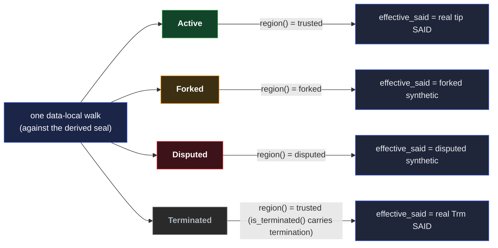

# KEL Verification — Verifier Walk

The KEL verifier walks a chain from inception to tip, validating structural integrity (SAID, prefix,
chain linkage, per-kind field rules), cryptographic authority (a single signature per event),
forward-key commitments (the rotation-reserve commitment), and anchor presence (the `manifest` roles
per kind; tier checks per [§Tiers](../../../../protocol-doctrine.md#tiers)). It returns a
verification token — `KelVerification` — that downstream consumers hold as proof-of-verification and
use to access trusted chain data.

This doc states the walk algorithm, the kind dispatch at inception, per-event checks, divergence
handling, the token surface, and the federation-witnessing signals consumers read. For per-kind
reference (fields, authorization, the manifest roles), see [`events.md`](events.md); for chain
lifecycle, [`log.md`](log.md); for merge-layer routing, [`merge.md`](merge.md); for recovery
doctrine, [`compromise.md`](compromise.md); for the cross-node correctness proof,
[`reconciliation.md`](reconciliation.md).

## What verification ensures

For every event the verifier walks, it ensures:

- Events match their kind-specific schemas (required and forbidden fields per the
  [event-shape reference](../event-shape.md#kel)).
- Serials start at 0 and increment by 1 with no gaps; the inception event has serial 0.
- The inception event has a valid prefix (the prefix re-derives from the canonical bytes with `said`
  and `prefix` set to the placeholder — see
  [`../../sad/said.md` §Derivation](../../sad/said.md#derivation)).
- All event prefixes match the chain's prefix (set at inception).
- All events have valid SAIDs (the SAID re-derives from the canonical bytes with `said` set to the
  placeholder).
- Events chain correctly from inception to tip via `previous` links; each seal-advancing event's
  `previousSeal` resolves to the prior seal (the spine).
- Pre-rotation commitments are honored: each `Rot` / `Wit` / `Trm` reveals a `publicKey` whose
  digest matches the prior establishment's `rotationHash`.
- Every signature verifies against the SAID bytes — one single signature per event, by the key the
  event's tier requires.

Events are linked by their `previous` SAID. The serial in the canonical bytes makes each event's
position structurally unambiguous; the `previous` pointer makes the chain linkage cryptographically
verifiable.

## Walk algorithm

The verifier processes events in a single forward pass, verifying structure and cryptography
simultaneously. Events must arrive in canonical order
`(serial ASC, kind sort_priority ASC, said ASC)` with complete generations.

A **generation** is the set of all events at a given serial. The verifier processes events in
generation order and tracks per-branch state. A fork forks per-branch state — when a second distinct
event appears at the same serial as the first, the verifier records `divergence_ancestor` (the SAID
of `v_{d-1}`) and tracks both branches independently.

### Per-event checks

For each event in the page:

```
verify_event(event):
    # 1. SAID and prefix integrity
    event.verify()  # Inception: verify both prefix and SAID; subsequent: verify SAID

    # 2. Prefix consistency
    if event.prefix != verifier.prefix:
        return Error("Prefix mismatch")

    # 3. Structure validation
    validate_structure(event)  # Required / forbidden fields per kind (event-shape)

    # 4. Serial continuity
    if event.serial != expected_serial:
        return Error("Serial gap or regression")

    # 5. Chain continuity
    match event to a branch via event.previous
    if no matching branch:
        return Error("Previous SAID not found")
    if event is seal-advancing and event.previousSeal != branch.last_seal:
        return Error("Spine back-link mismatch")

    # 6. Manifest roles + format
    if event.manifest is present:
        assert event.manifest carries only roles in allowed(event.kind)   # read kind-first
        for said in event.manifest.anchors (when carried):
            verify said is a valid type-qualified base64 SAID
```

The verifier checks the **manifest role vocabulary** here — a manifest carrying any role outside the
kind's allowlist is malformed and rejected — and **anchor format** (each `anchors` entry is a
SAID-shaped token). Anchor **kind** and **tier** validation are downstream — IEL and SEL verifiers
enforce them when resolving authorization against KEL anchors per
[§Tiers](../../../../protocol-doctrine.md#tiers). The KEL token exposes the anchoring event's kind
on each matched anchor so callers can apply tier-appropriate checks.

### Inception kind dispatch

KEL inception is one of two kinds — `Fcp`, `Icp` (see
[`events.md` §Two-kind inception](events.md#two-kind-inception)). At v=0, the verifier dispatches on
kind:

| Inception kind | Federation binding at v=0      | Verifier behavior                                                                                                                                                                                                                                                                        |
| -------------- | ------------------------------ | ---------------------------------------------------------------------------------------------------------------------------------------------------------------------------------------------------------------------------------------------------------------------------------------- |
| `Fcp`          | absent                         | Federation infrastructure — no `federation`, no witnessing at inception; the v=1 anchors the federation act the chain serves (the genesis `Rot` anchoring the federation IEL `Fcp`, or a joiner's consent `Ixn` anchoring the admitting `Wit`), entering the federation-bound lifecycle. |
| `Icp`          | `federation` + `federationPin` | **Federation-bound** (required — there is no direct mode): reads `federation` / `federationPin` as context (recorded per event); witnessing per `witnesses`. An `Icp` omitting them is rejected.                                                                                         |

The kind discriminator is structural — encoded in the chain data — so the verifier dispatches the
carve-out from chain data alone rather than consulting consumer configuration. Consumer trust
composes through the
[config-pinned federation prefix set](../../../../protocol-doctrine.md#federation-witnessing-in-verification)
as a separate trust decision.

### Manifest-role dispatch

A KEL event's commitments live in a `manifest` SAD grouped by role (see
[`events.md` §The manifest](events.md#the-manifest--roles-a-kel-event-carries) and the
[event-shape reference](../event-shape.md#the-manifest--what-an-event-commits-to-grouped-by-role)).
The verifier dispatches the manifest's roles by event kind — there are no per-entry role tags in the
data; the kind (already in the event) selects the allowed roles:

```
match event.kind:
    Fcp                -> no manifest; federation fbd
    Icp                -> manifest carries { witnesses } (req);  federation + federationPin top-level (req)
    Wit (Icp-rooted)   -> manifest carries { anchors } (the user IEL Wit; req), may also carry { witnesses };  federation + federationPin top-level (opt — present-iff-changed; a config-only Wit carries neither)
    Wit (Fcp-rooted)   -> manifest carries { anchors } (the federation IEL Wit; req), may also carry { witnesses };  federation + federationPin fbd
    Ixn                -> manifest carries { anchors } (req, ≥ 1)
    Rot                -> manifest may carry { anchors }
    Trm                -> no manifest (terminal seal; retained run derivable as [previousSeal..previous])
```

The verifier establishes the chain's **root facet** (`Fcp`-rooted vs `Icp`-rooted) **before**
reading any `Wit` payload — on **every** `Wit`-reading path (from-scratch, `resume`, `search_only`)
— so a federation-governance `Wit` is never read under the user-rebind allowlist or vice versa. The
token carries `root_facet` (set at inception), so every `resume` — whole-chain or scoped to a single
branch — re-applies the facet dispatch **from the token** without re-deriving it.

The federation binding is read from the **top-level** `federation` / `federationPin` fields, never
the manifest. On a **user** (`Icp`-rooted) chain, `federation` (the prefix) appears on `Icp`
(required initial binding) and `Wit` (a **rebind**); a **federation-witness** (`Fcp`-rooted) `Wit`
carries neither (governance, never self-bound). `federationPin` is **optional on every user body
event** (`Ixn` / `Rot` / `Trm`) as a forward **re-pin** that must resolve within the inherited
`federation` prefix (no backdoor rebind) — forward-only is **emergent**, enforced at the witnessing
layer, not the KEL walk (a stale pin is chain-valid but un-witnessed; see [`events.md`](events.md)).
Generic manifest `anchors` on `Ixn` / `Rot` / `Wit` are checked for SAID format only; their
satisfaction is downstream-verifier business per [§Tiers](../../../../protocol-doctrine.md#tiers).

### Generation processing

Events at the same serial form a **generation**. The verifier processes all events in a generation
together:

```
verify_generation(events_at_serial):
    if events_at_serial.len() > branches.len():
        # More events than branches → divergence detected
        fork BranchState for new branches
        record divergence_ancestor (the SAID of v_{d-1}) if first divergence

    for each event:
        match to branch via event.previous
        verify crypto for that branch
```

When a divergent generation spans a page boundary, the verifier re-fetches the incomplete generation
at the next page so partial state never leaks into the walker.

### Establishment-event processing

When an establishment event is encountered (`Fcp` / `Icp` / `Rot` / `Wit` / `Trm`), the verifier
checks the forward-key commitment made by the previous establishment event. The branch's tracked
`rotationHash` is the digest committed by the prior establishment; the current event must reveal a
public key whose digest matches.

```
process_establishment(event, branch):
    new_public_key = parse(event.publicKey)

    # Verify rotation-reserve commitment (forward commitment from prior establishment)
    if branch.tracked_rotation_hash exists:
        expected = digest(new_public_key)
        if branch.tracked_rotation_hash != expected:
            return Error("Public key does not match rotation hash")

    # Update branch state
    branch.current_public_key = new_public_key
    branch.tracked_rotation_hash = event.rotationHash
    branch.establishment_tip = event
```

The forward-key-commitment mechanism is what makes the two-tier capability model cryptographic
rather than policy-bound. See
[`events.md` §Forward-key commitments](events.md#forward-key-commitments) and
[`compromise.md` §Two-tier compromise model](compromise.md#two-tier-compromise-model).

### Signature verification

```
verify_signature(signed_event, public_key):
    # SAID is Blake3-256 of canonical content; signing the SAID bytes is
    # equivalent to signing the content but more efficient (the signing
    # surface is schema-agnostic — see ../../sad/said.md §Signing surface).
    data = signed_event.event.said.as_bytes()

    signature = parse_signature(signed_event.signature)
    public_key.verify(data, signature)
```

Per-kind signature shapes are documented in
[`events.md` §Authorization and signature shapes](events.md#authorization-and-signature-shapes).
Every event carries **one** signature; a key change (`Rot` / `Wit` / `Trm`) is signed by the new
signing key the reserve reveals, and the pre-rotation commitment
`digest(publicKey) == prior.rotationHash` must match.

## KelVerification token

`KelVerifier::into_verification()` produces a `KelVerification` token — the proof-of-verification
type (in the field shapes below, `Vec<T>` is a list, `Option<T>` an optional value, and
`BTreeSet<T>` a sorted set):

```
KelVerification:
    prefix: String
    root_facet: RootFacet                        # Fcp-rooted (federation-witness infra) vs Icp-rooted (user); fixed at inception, carried so a resume reads Wit payloads facet-correctly (never facet-blind)
    branch_tips: Vec<BranchTip>                  # one per branch (1 = linear, >1 = divergent)
    divergence_ancestor: Option<SAID>            # SAID of v_{d-1} on a divergent chain; None on linear
    last_seal_advancing_event: Option<SAID>      # the derived seal: most recent Rot/Wit/Trm with no competing accepted sealed branch from the divergence onward (a content sibling is buried below it; a fork with >= 2 accepted sealed branches has no clean seal above the divergence) — computed from the held events, never arrival order
    federation_context_per_event: ...            # per-event federation binding (for chains that have re-bound)
    anchored_saids: BTreeSet<SAID>               # registered SAIDs found anchored on the canonical branch
    queried_saids: BTreeSet<SAID>                # caller-registered SAIDs of interest
    structurally_valid: bool                     # the structural-validity result (signatures, commitments, linkage)
    competing_branch_saids: Vec<SAID>            # the branch tips of a detected divergence (the beacon enumerates these)
    witnessed: bool                              # threshold-many federation receipts under consistent state
    minority_dissent: ...                        # receipts below threshold; forensic signal
    witnessed_anchors: BTreeSet<SAID>            # subset of anchored SAIDs witnessed on the canonical branch

BranchTip:
    tip: SignedKeyEvent              # chain head (latest event on this branch)
    establishment_tip: SignedKeyEvent  # last establishment event (provides signing key)
```

Token fields are private with no public constructor — the only way to obtain one is through
`KelVerifier`. Holding the token proves the corresponding chain was verified — so a trust decision,
and any resumption toward one, is grounded **only** in a token, never a bare `BranchTip` (a
read-only component of the token, not an independent verified state). The seal tracking
(`last_seal_advancing_event`) is per
[`log.md` §The seal, the spine, and the locked-portion bound](log.md#the-seal-the-spine-and-the-locked-portion-bound).

### Derived accessors

- `current_public_key()` → `None` if divergent (ambiguous which branch's key is current).
- `last_establishment_event()` → `None` if divergent.
- `is_terminated()` → `true` when the linear branch tip is a `Trm` event.
- `is_divergent()` → `branch_tips.len() > 1`.
- `region()` → the consumer-facing trust region computed **data-locally** from the events held,
  against the **derived seal** (above): **trusted** (no fork reaching at-or-above the seal — a fork
  buried below it is inert), **forked** (a content-only fork at-or-above the seal — no accepted
  sealed branch — recovers via a burying seal-advancer that buries the content → Active; a
  **single** accepted sealed branch buries the content and reads **trusted** — a reserve-theft
  takeover you did not author is clean on-chain, caught by owner-vigilance and answered by reincept
  out-of-band, not surfaced here), or **disputed** (two or more branches each carry an **accepted**
  (witnessed-at-threshold) sealed event at the last seal — terminal, reincept).
- `effective_said()` → a fingerprint of the node's held state: a **single confirmed tip yields that
  tip's SAID** (the `Trm` SAID when terminated); a chain with **no single tip** — an unresolved fork
  — yields a **type-tagged synthetic recoupled to the verdict** (`forked` / `disputed`), qualified
  by prefix and position, **structurally distinct from any real SAID** and **not** a digest over the
  competing tips (that set is adversarially extensible → flood-unstable). A **settled content**
  branch (a content sibling buried below the seal) drops out — it is forensic, reached by a
  by-prefix flat fetch; a **below-seal** sealed straggler drops out too (dropped, inert —
  backdate-safe). Only a **witnessed** sealed fork **at the last seal** keeps the chain in the
  synthetic (a spine fork → `disputed`). The value is set-independent yet carries the reading:
  whether a fork is `forked` or `disputed` is the `region()` walk verdict, which the synthetic
  recouples to. See
  [§Effective-SAID comparison](../../../../protocol-doctrine.md#effective-said-comparison).
- `is_said_anchored()`, `anchors_all_saids()` → inline anchor-checking results for SAIDs the caller
  registered before the walk.

The capital chain **states**, the `region()` trust projection, and the `effective_said` type tags
are three views of the one data-local walk:

| chain state | `region()` | `effective_said`     |
| ----------- | ---------- | -------------------- |
| Active      | `trusted`  | real tip SAID        |
| Forked      | `forked`   | `forked` synthetic   |
| Disputed    | `disputed` | `disputed` synthetic |
| Terminated  | `trusted`  | real `Trm` SAID      |

`region()` is the **divergence** axis, so Active and Terminated both project to `trusted` (a
terminated chain is final, not divergent); **termination rides the orthogonal `is_terminated()`
accessor**, never a `region()` value.



## Inline anchor checking

The caller registers SAIDs of interest before the walk via `verifier.check_anchors(saids)`. As the
verifier processes events, it checks each event's `manifest.anchors` entries against the registered
SAIDs. Results are available on the token via `is_said_anchored()` and `anchors_all_saids()`.

The `anchors` role lives on `Ixn` (≥ 1), `Rot`, and `Wit` (see
[`events.md` §Anchors](events.md#anchors)); the `check_anchors` scan over the anchors role matches
these kinds. On `Icp` the federation binding is the top-level `federation` / `federationPin` (not an
anchor); a `Wit` carries that binding top-level too **and** anchors the IEL `Wit` (kind-strict). The
`witnesses` role carries the witness-config SAD. Cross-chain consumers (IEL and SEL verifiers) need
to know not just that a SAID is anchored but in which kind of KEL event — the token surfaces the
anchoring event's kind so callers can enforce kind-strict anchor checks per
[§Tiers](../../../../protocol-doctrine.md#tiers).

Registration before the walk lets the verifier record observations without a second database pass.
The pattern is uniform across all primitive verifiers (KEL, IEL, SEL) and is the realization of the
[§Operation Categories — consuming](../../../../protocol-doctrine.md#operation-categories) rule:
data access happens via a verification token, never via separate database queries between
verification and use.

## Divergence detection and terminal-state determination

Verification surfaces divergence as a **structural condition** on the token — it does not silently
pass, and it reads through the pathology to expose the chain's final portion rather than
hard-failing. The verifier:

- Forks per-branch state when a second distinct event appears at the same serial.
- Records the divergence ancestor (`v_{d-1}`'s SAID) and exposes it via `divergence_ancestor`, and
  the competing branch tips via `competing_branch_saids`.
- Verifies each branch independently.
- Surfaces `is_divergent() = true` and the per-branch state via `branch_tips`, and the trust region
  via `region()`.

The region is a **data-local** verdict over the retained branches — keep-all-data retains a
competing branch as non-canonical evidence, so a node holding both sealed branches reads `disputed`
directly; a node holding one fetches the rest via the beacon. The merge layer resolves a recoverable
content fork (a burying seal-advancer on the winning branch); the verifier reports findings.

### Terminal-state determination rule

The verifier's terminal-state-determination rule:

- A **live** fork — a divergence at or above the **derived seal**?
  - **No accepted sealed branch** (a content-only fork) → **forked** (recoverable); a burying
    seal-advancer buries the content → Active. A **single** accepted sealed branch buries the
    content → **Active**, not forked.
  - **Two or more _accepted_ (witnessed-at-threshold) sealed branches at the last seal** →
    **disputed**; reincept.
- No live fork — linear, or a fork **buried below the seal** (its content loser inert) → **Active**
  (or Terminated via `Trm`); a `{Trm, content}` fork ends **Terminated** by tier-rank.

A burying seal-advancer on the winning branch advances the seal past the loser, so after recovery
the chain has a single linear walkback and is no longer divergent.

### Verifier reports; the merge layer gates

> **Verifier-merge composition.** The verifier itself does not reject submissions — it records the
> **structural-validity result** (`structurally_valid`) and the anchoring / divergence signals on
> the token. The merge layer rejects candidate batches whose post-walk token reports a structural
> failure; the new events never land. See
> [§Structural problems error; everything else is reported](../../../../protocol-doctrine.md#structural-problems-error-everything-else-is-reported).

Hard-fail at the verifier is reserved for structural-integrity violations: SAID mismatch, prefix
mismatch, broken chain linkage, tamper. Chain validity stays separable from the answer a consumer
wants — the verifier reads through pathology to expose it (it must surface the at-or-below-seal
portion even on a chain with above-seal divergence); the merge layer reads `structurally_valid` to
gate against it.

Per-kind signature verification produces:

- **`Ixn`** — single-sig verified against the current signing key. Failure flips
  `structurally_valid = false`; the event lands at the merge layer only if the batch's post-walk
  token shows `structurally_valid = true`.
- **`Rot` / `Wit` / `Trm`** — single-sig verified against the new signing key the reserve reveals;
  the pre-rotation commitment `digest(publicKey) == prior.rotationHash` must match. Failure flips
  `structurally_valid = false`.
- **`Fcp` / `Icp`** — single-sig verified against the declared `publicKey`. Prefix re-derives from
  canonical bytes; SAID re-derives independently.

The merge layer applies the `structurally_valid` gate uniformly across all event kinds — no per-kind
carve-outs — see [`merge.md` §Kind-specific authorization](merge.md#4-kind-specific-authorization).

### Pre-seal verifiability on the token

The trust an anchor carries splits at the **seal**, not the divergence point. An anchor hosted
at-or-below `last_seal_advancing_event` is **permanently final** — it stays anchored on the
canonical branch regardless of any later above-seal divergence. (Against a **witnessed** sealed fork
— **two or more accepted sealed branches**, wherever their seals sit — the reading flips to
`disputed` and the clean seal retreats to the divergence ancestor, so permanence runs against that
retreated clean seal; a below-seal sealed straggler is **dropped**, not disputed, and sealed events
are still never rewritten — see
[§Divergence and recovery](../../../../protocol-doctrine.md#divergence-and-recovery).) An anchor
above the seal carries tier-1-only durable authority and becomes durable only once a later
seal-advancing event lands cleanly past it. So `anchored_saids` reflects the canonical branch, and a
consumer composes the anchor's seal position with `region()`: a below-seal anchor is honored even on
a `disputed` chain; an above-seal anchor on a `disputed` chain grounds no new trust. See
[`compromise.md` §Pre-seal verifiability](compromise.md#pre-seal-verifiability) and
[§Divergence and recovery](../../../../protocol-doctrine.md#divergence-and-recovery).

## Federation witnessing in verification

The verifier surfaces federation-witnessing signals on the token. Full witnessing mechanics live in
[`../../../../substrate/federation/witnessing.md`](../../../../substrate/federation/witnessing.md);
this section names what the KEL verifier reads. **The data decides; witnessing propagates** —
receipts deliver competing branches and freshness, never a verdict.

**`witnessed`.** True iff the event has accumulated threshold-many receipts under a consistent
federation state. Witnesses are sort-selected by chain position `(prefix, serial)`; all competing
candidate events at the same chain position route to the same witness set by construction. The
verifier independently re-checks each receipt's `witnessed_said` against structural validity —
receipt counts alone do not satisfy `witnessed`.

**The divergence signal splits by provenance.** When a node holds two or more sealed branches **each
accepted** — witnessed at threshold **and** its lineage accepted (a branch off a first-seen loss is
dead on ascent and never counts) — at the **last seal**, it reads **`disputed` directly from the
data** — the walk decides. A sealed sibling it holds only as a **receipt** (not yet fetched), one
**below threshold** (a witness-declined sibling), or one **below the seal** (a straggler) is **not**
counted — it stays **`forked`** / deferred-pending, and a below-seal straggler is dropped
(backdate-safe). For **content** the signal is different: a losing content sibling never reaches
threshold under the floor, so the anomaly signal is a **sub-threshold competing receipt set** at a
position — the node fetches the event and the data-local walk decides
([§Federation convergence](../../../../protocol-doctrine.md#federation-convergence) derives why).
Single-rogue protection: a rogue who signs receipts on a fake `witnessed_said` cannot trigger a
verdict — the fake event fails structural re-check, and honest witnesses do not sign for fakes; the
verifier re-checks validity because the database cannot be trusted. Receipts tell a node it is
_forked_; only the data-local walk tells it _disputed_.

**`minority_dissent`.** Receipts below threshold for some `witnessed_said` that don't contribute to
pinning. Forensic signal for potentially-compromised witnesses; not load-bearing for trust
decisions.

**`witnessed_anchors` (KEL-specific).** The subset of anchored SAIDs that are witnessed on the
canonical branch. IEL and SEL verifiers consult this set during kind-strict anchor authorization —
only witnessed anchors count toward threshold.

### Acceptance requires threshold — for every node

Acceptance into the chain's live state (canonical, verdict-counting) requires **threshold
receipts**, for witnesses and non-witnesses alike. A node that is **not** sort-selected as a witness
for event `E` holds `E` **deferred-pending** until `E` reaches threshold via witness gossip. A
**selected witness** that signs `E` holds it in the **same** deferred-pending state: signing gives
it two things a non-witness lacks — direct evidence that `E` is structurally valid (it re-checked
before signing) and a **spent first-seen vote** at that position (it will decline any sibling there)
— but a lone signature is **not** acceptance. `E` is not canonical to the witness either until it
reaches threshold. Self-signing **admits `E` as valid and commits first-seen; it does not make `E`
canonical**.

This is what makes federation witnessing the propagation channel for cross-node convergence on
sealed events: a witness holds and gossips the event it signed, but **no node — witness or not —
treats a sub-threshold event as accepted**.

**Acceptance gates the tip; an accepted event commits its ancestry.** Reaching threshold makes an
event canonical, and its whole `previous`-chain becomes canonical **with** it — including ancestors
that never individually reached threshold (a stale-pin recovery's deferred events, once the
witnessed re-pin commits them as `previous`; a split-stall exit's retained sibling, once the
witnessed seal commits it). This does not contradict the rule above: "no node treats a sub-threshold
event as accepted" governs whether a sub-threshold event stands as a **competing branch** in the
fork walk — it never does — not whether an accepted event's own ancestors are canonical. So a
pure-function-of-accepted-state walk follows an accepted tip's `previous`-chain in full; it does not
re-gate each ancestor on its own receipt count.

### Federation context per layer

Federation context attaches **per layer**, not by blanket inheritance through the anchor walk. A
**KEL** carries its own — the binding declared in the most-recent `Icp` / `Wit` at-or-before the
event. A user **IEL records its own** authoritative `{federation, federationPin}` binding on its
`Icp` / `Wit`, **field-matched** to its members' KEL `Wit`s on every walk; it does **not** adopt a
single member's KEL binding, so a lone or desync'd member cannot straddle the identity onto a
different federation. A **SEL** carries no federation field and **inherits its owner IEL's** binding
(single-owner). The KEL token surfaces `federation_context_per_event` so a cross-chain verifier
resolves each leaf-anchor to its KEL event for witnessing while reading the federation **binding**
from the layer that owns it.

### Trust composition through the config-pinned federation prefix set

For each event the verifier walks the chain's current federation context back to the federation
IEL's inception. If the federation's prefix is in the trusted set (runtime-configured, empty by
default — fail-secure), the federation is trusted for that event. Multi-federation chains (KELs that
have transferred federations via `Wit` events) require each federation in the chain's history to be
independently trusted — no transitive trust. See
[§Federation witnessing in verification](../../../../protocol-doctrine.md#federation-witnessing-in-verification)
and
[`../../../../substrate/federation/bootstrap.md`](../../../../substrate/federation/bootstrap.md).

A consumer refuses to bind under a `disputed` region (the federation cannot agree at this position)
or `witnessed = false` (insufficient attestation), and consults the config-pinned federation prefix
set as the trust ground. Anchors at serials strictly below the last clean seal remain canonical
regardless of above-seal divergence per
[§Divergence and recovery](../../../../protocol-doctrine.md#divergence-and-recovery).

## Streaming

KEL verification follows the cross-primitive streaming pattern. The verifier walks events page by
page rather than loading the full chain into memory.

### Constructors

- **`KelVerifier::new(prefix)`** — Start from inception. Full verification of an untrusted chain.
- **`KelVerifier::resume(prefix, &KelVerification, branch_tip_said?)`** — Resume from a verified
  token — **the only way to resume**, since only a token proves a walk happened (a `BranchTip` is a
  read-only component of the token, never an independent resume source). With `branch_tip_said`
  **absent** it resumes the whole chain (the merge handler's normal-append fast path); with it
  **naming one of the token's own branch tips** it scopes verification to that single branch
  (divergence / recovery — the input stream is only that branch's events; the competing branches sit
  excluded in retained storage). Either way it inherits `root_facet` and the verified state from the
  token — so a `Wit` on the branch is never read facet-blind — and re-runs the to-tip negative
  checks against the new tip whenever a transitively-pinned chain moves
  ([§Walk semantics](../../../../protocol-doctrine.md#walk-semantics)).

### Paginated verification helper

`completed_verification(loader, prefix, page_size, max_pages, anchors)` pages through a
`PageLoader`, calling `truncate_incomplete_generation()` at page boundaries to handle divergent
generations that span pages. Returns a trusted `KelVerification` token. The `max_pages` parameter
prevents resource exhaustion (default 64 pages ≈ 8K events; configurable).

### PageLoader

KEL implements the cross-primitive `PageLoader` trait. Multiple implementations cover the read
paths:

- **Non-locking reads** — wraps a chain-log store reference; serves the consumer (per
  [§Operation Categories — serving](../../../../protocol-doctrine.md#operation-categories)).
- **Advisory-locked reads** — wraps a database transaction holding the advisory lock; the same
  transaction is used for the subsequent write under the merge handler. This eliminates
  time-of-check-to-time-of-use vulnerabilities (per
  [§Merge verification and advisory locking](../../../../protocol-doctrine.md#merge-verification-and-advisory-locking)).

### Walk usage

```
let mut verifier = KelVerifier::new(prefix)
loop:
    let (events, has_more) = source.fetch_page(prefix, since, limit)
    verifier.verify_page(events)
    sink.store_page(prefix, events)
    if not has_more: break
    since = events.last().said

let verification = verifier.into_verification()
```

The walker is single-pass forward; generation-aligned page boundaries mean a divergent generation
spanning two pages re-fetches at the next page rather than being processed half-observed.

## Per-event check summary

| Property                       | Verification method                                                                                                                                                |
| ------------------------------ | ------------------------------------------------------------------------------------------------------------------------------------------------------------------ |
| SAID integrity                 | Re-derive the SAID from canonical bytes with `said` set to the placeholder; compare to declared.                                                                   |
| Prefix integrity               | At inception: re-derive prefix with `said` and `prefix` set to the placeholder; compare. Subsequent events: inherit and check consistency.                         |
| Prefix consistency             | Every event's `prefix` equals the chain's prefix.                                                                                                                  |
| Event chaining                 | `previous` resolves to a verified prior event SAID.                                                                                                                |
| Spine linkage                  | On a seal-advancing event, `previousSeal` resolves to the prior seal.                                                                                              |
| Chain completeness             | All `previous` references resolve to existing events.                                                                                                              |
| Serial monotonicity            | Each event's serial equals previous event's serial + 1.                                                                                                            |
| Inception serial               | Inception events (no `previous`) have serial 0.                                                                                                                    |
| Inception kind dispatch        | Verifier branches on `Fcp` / `Icp` per [§Inception kind dispatch](#inception-kind-dispatch).                                                                       |
| Pre-rotation commitment        | `digest(publicKey) == prior.rotationHash` on each `Rot` / `Wit` / `Trm`.                                                                                           |
| Signature validity             | Every kind: one signature verifies against the appropriate key per [§Signature verification](#signature-verification).                                             |
| Manifest roles + anchor format | The `manifest` carries only roles in the kind's allowlist; each `anchors` entry is a valid SAID-shaped token ([§Manifest-role dispatch](#manifest-role-dispatch)). |
| Federation context             | Verifier records federation binding per event (declared by inception `Icp` or `Wit`).                                                                              |
| Witness state                  | Token surfaces `witnessed`, the divergence signal, `minority_dissent`, `witnessed_anchors` per the federation-witnessing layer.                                    |

## Cross-references

- [`../event-shape.md`](../event-shape.md#kel) — cross-primitive event shape: common fields, the
  `manifest` model, `previousSeal`, the per-kind field grid.
- [`log.md`](log.md) — chain primitive: states, the seal and spine, locked-portion bound, page
  model.
- [`events.md`](events.md) — per-kind reference: fields, authorization, the manifest roles, two-tier
  capability model.
- [`merge.md`](merge.md) — merge handler routing: how the verifier output composes with the merge
  gate.
- [`compromise.md`](compromise.md) — recovery doctrine: recovery attach shapes, two-tier compromise
  model, pre-seal verifiability.
- [`reconciliation.md`](reconciliation.md) — cross-node correctness proof.
- [`../../../../protocol-doctrine.md`](../../../../protocol-doctrine.md#verification-tokens-as-proof-of-verification)
  — verification tokens (cross-primitive pattern).
- [`../../../../protocol-doctrine.md`](../../../../protocol-doctrine.md#walk-semantics) — walk
  semantics and streaming (cross-primitive pattern).
- [`../../../../protocol-doctrine.md`](../../../../protocol-doctrine.md#structural-problems-error-everything-else-is-reported)
  — structural problems error; the verifier-reports / merge-gates split.
- [`../../../../protocol-doctrine.md`](../../../../protocol-doctrine.md#tiers) — tiers and
  kind-strict anchoring (cross-chain anchor checks).
- [`../../../../protocol-doctrine.md`](../../../../protocol-doctrine.md#federation-witnessing-in-verification)
  — federation witnessing in verification.
- [`../../sad/said.md`](../../sad/said.md#derivation) — SAID and prefix derivation algorithms.
- [`../../sad/said.md`](../../sad/said.md#signing-surface) — signing over SAID bytes; the
  schema-agnostic signing surface.
- [`../../../../substrate/federation/witnessing.md`](../../../../substrate/federation/witnessing.md)
  — federation witnessing mechanics.
- [`../../../../substrate/federation/bootstrap.md`](../../../../substrate/federation/bootstrap.md) —
  federation bootstrap and the config-pinned federation prefix set.
