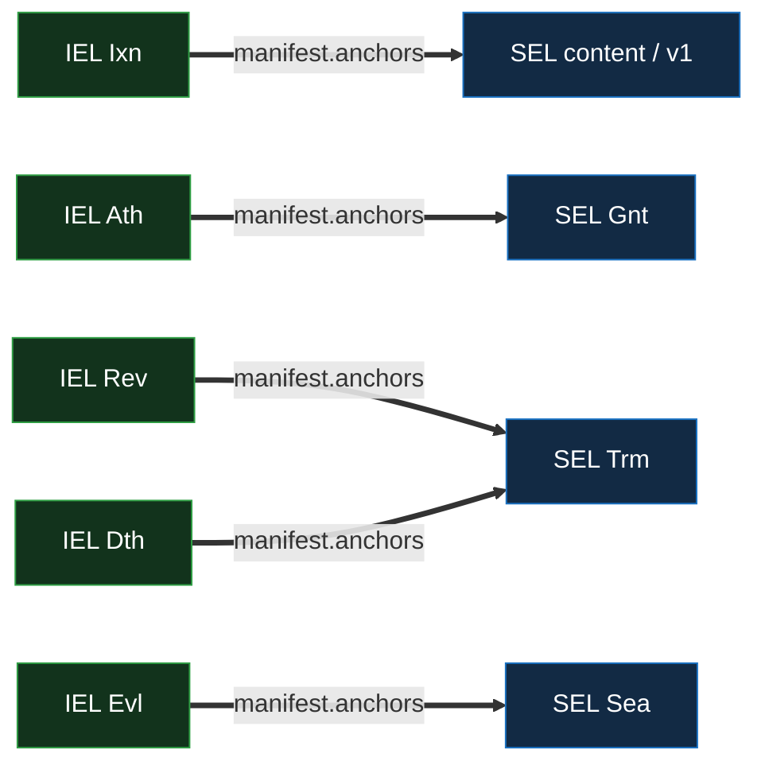

# SEL Events — Per-Kind Reference

Per-kind structural reference for the SEL event taxonomy: the **six** SEL kinds (`Icp` / `Ixn` /
`Pin` / `Gnt` / `Trm` / `Sea`) — one tier-1 content pair beneath three tier-2 sealed advancers, all
anchored cross-layer by the owner IEL. The cross-primitive field shape — common fields, the
`manifest` model, `previousSeal`, and the full per-kind field grid — is the
[event-shape reference](../event-shape.md#sel); this doc states the SEL-specific semantics: the
three orthogonal axes, the two-tier capability model, the kind-strict cross-layer anchor matrix, the
recomputable `Icp` and the serial-1 floor, the `Gnt` typed value, the `Trm` kill, the `Sea` re-seal,
the content and lineage fields, the manifest roles, sort priority, and the seal-advance cap.

For chain lifecycle (states, the witnessed chain, the seal and its advancers, severance, the
down-pin), see [`log.md`](log.md). For merge-layer routing, [`merge.md`](merge.md). For the verifier
walk, [`verification.md`](verification.md).

## Event taxonomy

A SEL uses exactly six kinds; any other kind code is malformed.

| Kind  | Kind string              | Class     | Tier | Count                                         | Purpose                                                                                                                                                                                                                                       |
| ----- | ------------------------ | --------- | ---- | --------------------------------------------- | --------------------------------------------------------------------------------------------------------------------------------------------------------------------------------------------------------------------------------------------- |
| `Icp` | `vdti/sel/v1/events/icp` | inception | 1    | `t_use`                                       | Inception — commits `owner` + `topic` + optional `data` (+ `content: true` for a content SEL, `lineage` for a re-establishable value lookup); **no `pin`, no manifest** (stays recomputable). Its serial-1 **v1** is anchored, not the `Icp`. |
| `Ixn` | `vdti/sel/v1/events/ixn` | content   | 1    | `t_use`                                       | Content — records payload SAD(s) (the `payload` role, **required** — always ≥ 1) and re-pins to the owner IEL. **≤ 1 per SEL per owner-IEL `Ixn`** (counting content). The divergeable content kind (first-seen, buriable).                   |
| `Pin` | `vdti/sel/v1/events/pin` | content   | 1    | `t_use`                                       | The **pin-only re-pin** at any serial — carries only the down-`pin` (no manifest). A pure re-pin is always a `Pin`; its serial-1 instance is the issuance floor (incept-and-sit). Buriable; **not** a seal-advancer.                          |
| `Gnt` | `vdti/sel/v1/events/gnt` | sealed    | 2    | `t_authorize`                                 | The **grant** — seals a typed value (`manifest.grant` names a `vdti/sel/v1/grants/*` SAD). Sealed on arrival, seal-advancing, non-buriable; walked back only by a rescission.                                                                 |
| `Trm` | `vdti/sel/v1/events/trm` | terminal  | 2    | `t_govern` (revoke) · `t_authorize` (rescind) | The **kill** — closes the SEL. Sealed on arrival, monotone, terminal-on-divergence.                                                                                                                                                           |
| `Sea` | `vdti/sel/v1/events/sea` | sealed    | 2    | `t_govern`                                    | The **neutral re-seal** — buries a content fork on a SEL that has no natural `Gnt` or `Trm` to advance the seal. Sealed on arrival, seal-advancing, non-terminal.                                                                             |

The **class** column names the event's role under the
[divergence-and-recovery rules](../../../../protocol-doctrine.md#divergence-and-recovery): only
**content** (`Ixn` and the floor `Pin`) is buriable. `Gnt` / `Trm` / `Sea` are **sealed** — never
buried or overturned — and are the SEL's **seal-advancers** (each carries `previousSeal`; any of the
three buries a content fork by advancing the seal past the loser). The **tier** column names the KEL
capability an adversary must forge to author the owner-IEL participation that anchors the act
(§Two-tier capability model). The **Kind string** column is the kind's versioned schema identifier
(`vdti/sel/v1/events/…`), unrelated to a SEL's derivation `topic` (§Inception and the serial-1
floor).

## The three orthogonal axes

Every SEL kind sits at the intersection of **three independent axes**; conflating them is the
classic error the model guards against.

1. **Count — how many owner-IEL members must authorize.** The count is drawn from the **owner
   IEL's** threshold vector `{ use, authorize, govern }` and delivered by the **anchoring IEL
   event's** member participations (a SEL event has no signers of its own). `t_use` prices content,
   `t_govern` a revocation or a `Sea` bury, `t_authorize` a grant or a rescission. There is no
   recovery slot.
2. **Tier — whether the owner's rotation reserve is required.** **Tier 1** is content (a signing key
   suffices: `Ixn` / `Pin`); **tier 2** is any seal-advancer (`Gnt` / `Trm` / `Sea`), which needs
   the rotation reserve because the act must be permanent on arrival. Tier is set by the kind and is
   **orthogonal to count** — a content `Ixn` is tier 1 even at a high `t_use`. There is no third
   tier.
3. **Anchor-kind → finality.** A content `Ixn` or `Pin` rides an owner-IEL `Ixn` → **first-seen /
   buriable**; a `Gnt` rides an owner-IEL `Ath`, a `Trm` an owner-IEL `Rev` / `Dth`, and a `Sea` an
   owner-IEL `Evl` → **sealed on arrival**. The anchor kind determines whether the SEL event can
   ever be buried.

The axes are independent: the count is a dial, the tier is set by kind, and the finality follows the
anchor kind. Tier-elevation (anchor tier ≥ event tier) is an **additional floor, not the check** — a
tier-only reading would let a tier-2 kill-anchor host tier-1 content, laundering content onto the
sealed rail; the **kind-strict** binding below closes it.

## Two-tier capability model

A SEL act is classified by **tier** — the KEL capability an adversary must forge to author the
owner-IEL participation that anchors it.

- **Tier 1 — a member's signing key.** Content (`Ixn`, `Pin`) rides an owner-IEL `Ixn`, itself
  anchored by member KEL `Ixn`s signed by current signing keys. Tier 1 even at a high `t_use`.
- **Tier 2 — a member's rotation reserve.** A grant (`Gnt`), a kill (`Trm`), and a re-seal (`Sea`)
  each ride a tier-2 owner-IEL event (an `Ath` / `Rev` / `Dth` / `Evl`), itself anchored by member
  KEL `Rot`s revealing a rotation reserve. The reserve is held **apart** from the signing key, and
  the old signing key is **not** a prerequisite — a rotation reveals the new key.

Tier semantics and the kind-strict anchor rule are the protocol doctrine's
([§Tiers](../../../../protocol-doctrine.md#tiers)). A signing-key (tier-1) compromise can author
content but no sealed advancer, so its whole reach is buriable content
([`reconciliation.md` §A signing-key compromise](reconciliation.md#a-signing-key-compromise-is-fully-buriable)).

## Per-kind semantics

### `Icp` — inception (tier 1, `t_use`)

Commits `owner` (the owner IEL prefix, immutable), `topic` (the application discriminator), an
optional `data` (the lookup recompute input), a `content: true` flag on a content SEL (the
discriminator, absent on a lookup), and — on a re-establishable value lookup — a `lineage` counter
(§The content and lineage fields). It carries **no `pin` and no manifest** — either would change the
whole-content prefix and break the recomputation a lookup SEL depends on
([`log.md` §Prefix derivation](log.md#prefix-derivation)). The `Icp` is unsigned, recomputable
content; it establishes the SEL but proves nothing alone — authentication rides the serial-1 event.
It is **never itself anchored**; it rides via `v1.previous`.

### `Ixn` — content (tier 1, `t_use`)

Records the payload SAD(s) it commits (the `payload` role — **required**, always ≥ 1, and capped
like every inline manifest list at `MAXIMUM_MANIFEST_LIST = 128` — event-shape) and re-pins the SEL
to the owner IEL's current tip (the top-level `pin`). Anchored by an owner-IEL `Ixn`, **at most one
`Ixn` per SEL per owner-IEL `Ixn`** (counting content — a pure re-pin is a `Pin`, not a phantom
`Ixn`). `Ixn` is the divergeable content kind; it does not advance the seal and is buriable until
the SEL's next seal-advancer. An `Ixn` **always** carries content — a manifest-less `Ixn` is
malformed; a re-pin with no content is a `Pin`.

### `Pin` — the pin-only re-pin (tier 1, `t_use`)

Carries **only** the down-`pin` — no manifest, no seal — and is the **pin-only re-pin at any
serial**. A pure re-pin (no content) is always a `Pin`, never a payload-less `Ixn`, so the two
content kinds are disjoint. Its **serial-1 instance is the issuance floor**: for a SEL that incepts
and sits (a document author who endorses before editing), the `Icp` cannot hold a pin, so a bare
`Pin` is the v1 that floors the SEL at inception. It is **not** a seal-advancer and is buriable like
content. Where inception carries a first event that already floors (a first content `Ixn`, a lookup
SEL's `Trm` or `Gnt`), no separate serial-1 `Pin` is needed.

### `Gnt` — the grant (tier 2, `t_authorize`)

Seals a **typed value** — a value a third party depends on. Its `manifest.grant` names a
**grant-value SAD** whose kind sits under `vdti/sel/v1/grants/*` (an owner-first namespace, capped
at 64 characters like any event or SAD kind). It is anchored by an owner-IEL **`Ath`** (kind-strict
— an `Ath` anchors only `Gnt`s), sealed on arrival, seal-advancing, and **non-buriable**; it is
walked back only by a later rescission (a `Trm` under an owner-IEL `Dth`), never overturned.

A **value must ride a `Gnt`, never tier-1 content**, when a third party acts on it — a value a
sender encrypts to, for instance, must not be swappable by a bare signing key, so changing it needs
the reserve. A **value lookup SEL** is established `{Icp, Gnt}` at tier 2, and **rotating the value
stacks another `Gnt`** (the walk serves the live sealed tip, so a retired value is never served).
What a grant value _means_ — a document-governance grant, an encryption receive-key — is its
**owner's**: a feature
([`../../../../features/shared-documents.md`](../../../../features/shared-documents.md),
forthcoming) or a **shared-core primitive** (the receive-key directory owns the encryption
receive-key grant, group keying its epoch-key wrap); this primitive states only the
seal-a-typed-value structure.

### `Trm` — the kill (tier 2)

The SEL kill — it closes the SEL, and is **always sealed on arrival**, anchored by one of the owner
IEL's two dedicated kill-anchors:

- **A revocation** rides an owner-IEL **`Rev`** (`t_govern`) — a governed kill of an owned artifact.
- **A rescission** rides an owner-IEL **`Dth`** (`t_authorize`) — deauthorizing what a grant
  granted.

The kill-anchor's `manifest.anchors` names the `Trm`, and the `Rev` / `Dth` also carries the owner
IEL's **`kills[]` declaration** naming the killed locus (the IEL side —
[`../iel/events.md` §Kills](../iel/events.md#kills--the-fail-secure-revocation-declaration)). A
`Trm` is **monotone** — no delayed or unsealed form and no un-kill; restoring a killed thing is a
**fresh grant at a fresh locus** (a lookup SEL re-incepts at a fresh lineage), never a retraction.

**`bound` placement is per-feature — the primitive says only that a kill commits whatever its anchor
commits:** a credential revocation carries no `bound` (revocation is binary); a delegate rescission
carries the grandfather `bound` publicly in the owner IEL `Dth`'s `kills[]` field; a document-member
rescission's `bound` is participant-identifying, so it rides a gated rescind-doc committed by that
`Trm`'s **`bound` role** and the `kills[]` entry carries only a blind target. The read strategy that
consumes this structure — the fail-secure `kills[]` walk and its fail-open lookup — is the feature
layer's ([`../../../policy/documents.md`](../../../policy/documents.md)).

### `Sea` — the neutral re-seal (tier 2, `t_govern`)

The neutral seal-advancer: a re-seal that buries a content fork on a SEL with no natural `Gnt` or
`Trm` to advance the seal
([`log.md` §Why the neutral advancer is needed](log.md#why-the-neutral-advancer-is-needed)). It
carries no value and no kill. It is `t_govern`, anchored by an owner-IEL **`Evl`** (kind-strict — an
`Evl` anchors only `Sea`s), because picking a winner among competing content branches must be gated
above content-authoring, matching the KEL's recovery rotation and the IEL's burying evolve. The
anchoring `Evl` is **empty** for a pure re-seal, or it carries a roster **`cut`** to evict the
colluding owner member atomically with the bury — the same reason an IEL eviction is atomic, so a
still-rostered culprit cannot race a fresh fork at the resolved tip.

## The lookup-SEL shapes

A **lookup SEL** is located by recomputing its prefix, and its shape names its purpose:

- A **kill lookup** is `{Icp, Trm}` — born to kill, its v1 the `Trm` itself. Its prefix and SAID are
  the usual two-hash derivation over its whole inception body (`owner`, `topic`, and optional `data`
  / `content` / `lineage`), where `data` is the grant-instance reference, so a re-grant after a kill
  gets a fresh locus. The owner IEL's `kills[]` target is a **separate** flat, domain-qualified hash
  — distinct from the lookup SEL's prefix and SAID — so the public declaration never leaks the
  lookup object's address
  ([`../iel/events.md` §Kills](../iel/events.md#kills--the-fail-secure-revocation-declaration) is
  authoritative on the IEL-side target and bound).
- A **value lookup** is `{Icp, Gnt}` — its v1 the `Gnt` that seals the value. Rotating the value
  stacks more `Gnt`s; rescinding it is a `Trm` (the locus reads dead, and a fresh value re-incepts
  at the next lineage).

## The content and lineage fields

The `content` / `lineage` field model is defined once at
[`log.md` §The content and lineage fields](log.md#the-content-and-lineage-fields); this section
states how the SEL **kinds** consume it.

**`content: true`** discriminates a content SEL (tier-1 v1) from a lookup (tier-2 v1),
verifier-enforced as a biconditional; because it rides the whole-content prefix, content and lookups
derive to **different addresses** even when they share `(owner, topic, data)` — a content **squat**
at a lookup address is impossible by construction.

**`lineage` — a re-establishment counter (lookups only).** A discoverable value lookup's prefix —
the two-hash digest over its inception body (`owner`, `topic`, and optional `data` / `content`) — is
a pure function of fixed inputs, so a killed or disputed value lookup **cannot re-incept by
rerolling randomness** — the same inputs recompute the same dead address. `lineage` gives it a fresh
one: the base is `lineage: 0`, a re-incept sets `lineage: 1`, `lineage: 2`, and so on, each a
distinct whole-content and so a distinct prefix. It is carried **only** by a **re-establishable
value** lookup; a **monotone** lookup (a kill, or a non-re-establishable value) omits it, and
content omits it too (content uses `content: true`). A re-establishable value's **canonical instance
is the lowest non-dead lineage**, found by a **positive walk**; a lineage above a live one is inert,
so an equivocation attempt fails safe (only the owner anchors at the locus).

A **value lookup** is **positive-walked** — its own live state is the sole authority for "what is
the live value" (no owner-IEL fallback for that resolution), so a dispute is genuine ambiguity and a
collusion-forced dead lineage is a real denial; the walk re-establishes it. But the walk
**consumes** a per-lineage negative check, not a separate mechanism: `lineage: N` reads dead when a
`Trm` sits on its own chain **or** its **lineaged** `kills[]` target
`hash('{tag}:{owner}:{data}:{lineage}')` is present in the owner IEL's fresh `Rev` / `Dth` — scoped
to the one instance, so the re-established `N+1` survives (a rescission is a monotone `Trm` whose
`Dth` declares that lineaged target). A **monotone kill** (a cred revocation, a delegate /
doc-member rescission) uses a **non-lineaged** target and is a single negative-checked read, never
walked. The split is **structural** — the verifier reads the `content` flag and the `lineage`
field's presence, never the topic's meaning, with **no tier-check** on the read path
([`verification.md` §The lineage walk](verification.md#the-lineage-walk)); the walk is capped at
`MAXIMUM_SEL_LINEAGE = 64` — the **highest valid lineage index**, walked **inclusive** (so
`lineage: 64` is a valid instance).

## Inception and the serial-1 floor

Inception is a two-event floor: the `Icp` (recomputable, no pin) plus a **serial-1 event** (the v1)
that carries the pin the `Icp` cannot. The v1 is what the owner IEL anchors — the `Icp` rides via
`v1.previous`, **never itself anchored** — so every SEL reads `{Icp, v1, …}`. Which kind is the v1
depends on why the SEL was born — the v1's only requirement is that it **anchors to the owner IEL
and carries the pin**, so any first event can floor, with a bare `Pin` the fallback when inception
carries no other. `Sea` is the one non-`Icp` kind excluded — it buries a content fork, which cannot
exist at inception. The four shapes are its instances:

| SEL born as                     | v1 (serial-1)   | Anchored by (owner IEL) |
| ------------------------------- | --------------- | ----------------------- |
| a SEL that incepts and sits     | a bare `Pin`    | `Ixn`                   |
| content, with a first amendment | a content `Ixn` | `Ixn`                   |
| a kill lookup                   | the `Trm`       | `Rev` / `Dth`           |
| a value lookup                  | the `Gnt`       | `Ath`                   |

**Authentication is the v1's anchor, never the `Icp`** — a SEL is validly established only if its v1
resolves to a real owner-IEL event whose prefix equals the SEL's `owner`, with the v1 named in that
IEL event's `anchors` and `v1.previous == said(Icp)` ([`log.md` §Inception](log.md#inception)). When
the v1 is a seal-advancer — a value lookup's `{Icp, Gnt}` or a kill lookup's `{Icp, Trm}` — it also
carries `previousSeal`, back-linking at serial 1 to the `Icp` as the spine root. A SEL `Icp` is tier
1 because it establishes single-owner **data**, not governance — the
inception-tier-follows-what-it-establishes rule
([`../../../../protocol-doctrine.md` §Tiers](../../../../protocol-doctrine.md#tiers)).

## The manifest — roles a SEL event carries

A SEL event commits to what sits above it through a **`manifest`** — the SAID of a role-grouped SAD
([event-shape §The manifest](../event-shape.md#the-manifest--what-an-event-commits-to-grouped-by-role)).
A manifest carrying any role outside its kind's vocabulary is malformed and rejected (read
kind-first):

| Role      | Carried by | Commits to                                                                       |
| --------- | ---------- | -------------------------------------------------------------------------------- |
| `payload` | `Ixn`      | the payload SAD SAID(s) the `Ixn` records (**required** — always ≥ 1)            |
| `grant`   | `Gnt`      | the grant-value SAD the `Gnt` seals (a `vdti/sel/v1/grants/*` kind)              |
| `bound`   | `Trm`      | opt — the gated rescind-doc (a doc-member rescission's blind grandfather cutoff) |

The `payload` role is **directly consumed** with no downstream type-check, so the kind → role
allowlist is its only protection — an `Icp` / `Pin` / `Sea` carrying a manifest at all is malformed,
and an `Ixn` **without** one is malformed too (the role is never absent — a pure re-pin is a `Pin`).
The `grant` role is **back-checked** (a `Gnt` is valid only anchored by an owner-IEL `Ath`), so
unlike `payload` it is not directly trusted. A `Trm`'s termination validity is carried by its
anchoring `Rev` / `Dth`; its manifest is **opt**, and when present carries the **`bound`** role — a
feature-layer gated rescind-doc holding a doc-member rescission's participant-blind grandfather
cutoff. This is the **gated custody mode** of the grandfather `bound` (a delegate rescission's rides
the inline-public `kills[].bound` field on the owner IEL); like `grant`, it is a feature-layer SAD,
not a directly-consumed role. The derivation inputs (`owner` / `topic` / `data` / `lineage`) and
every event's down-`pin` are **top-level structural**.

## The kind-strict cross-layer anchor matrix

Each SEL kind is valid **only** when anchored by exactly its matching owner-IEL kind, and each of
those IEL kinds anchors **only** its matching SEL kind:

| SEL kind           | Anchored by (owner IEL) | Tier |
| ------------------ | ----------------------- | ---- |
| content `Ixn` / v1 | `Ixn`                   | 1    |
| `Gnt`              | `Ath`                   | 2    |
| `Trm` (revocation) | `Rev`                   | 2    |
| `Trm` (rescission) | `Dth`                   | 2    |
| `Sea`              | `Evl`                   | 2    |

A `Trm` is valid **only** anchored by a `Rev` or a `Dth`, and a `Sea` **only** by an `Evl` — this
back-check is what keeps a kill and a re-seal _sealed_ (the anchor kinds seal on arrival). The two
kill-anchors are discriminated by the lookup's type; the anchor SAIDs carry no per-entry role tags,
so the anchor structure opens no side-channel. **Tier-elevation is an additional floor, not the
check** — a tier-only reading would let a tier-2 anchor host tier-1 content, laundering content onto
the sealed rail and breaking only-tier-1-is-buriable; the kind-strict binding closes it. The
matching IEL side is
[`../iel/events.md` §The kind-strict anchor matrix](../iel/events.md#the-kind-strict-anchor-matrix);
the `Evl → Sea` pairing gives the IEL `Evl` an `anchors` role, back-checked and priced at the
`Evl`'s own `t_govern`, so nothing is laundered.

## Per-kind sort priority

The merge layer orders events at the same serial deterministically by
`(serial ASC, kind sort_priority ASC, said ASC)`. Sort priorities:

| Kind  | Sort priority |
| ----- | ------------- |
| `Icp` | 0             |
| `Ixn` | 1             |
| `Pin` | 2             |
| `Gnt` | 3             |
| `Sea` | 4             |
| `Trm` | 5             |

Two competing `Ixn` events in a fork get the same priority and break the tie by SAID — identical
ordering across all nodes, so deduplication and divergence detection produce the same result
everywhere. The sealed priorities keep the seal-advancers ordered after content within a batch for
consistent merge-layer evaluation. The `said` tiebreaker is for determinism only and carries no
meaning.

## Seal-advance cap

A seal-advancer (`Gnt` / `Trm` / `Sea`) must land at least every `MAXIMUM_UNSEALED_RUN` content
events per lineage, so the content run since the last seal is bounded to `MAXIMUM_UNSEALED_RUN` on
each branch and the canonical two-branch content fork plus the resolving burying seal fits one page
(`MINIMUM_PAGE_SIZE = 129 = 2·MAXIMUM_UNSEALED_RUN + 1`, the same bound as the KEL and IEL). A busy
SEL with no natural `Gnt` or `Trm` to advance the seal re-seals with a **`Sea`** — the neutral
advancer, the SEL analog of the IEL re-sealing with a roster-less evolve. Two identical re-seals at
one position dedupe (idempotent), while a `Sea` versus a real seal-advancer at one position is two
sealed branches → Disputed, exactly as any two sealed events would be.

## Cross-references

- [`../event-shape.md`](../event-shape.md#sel) — cross-primitive event shape: common fields, the
  `manifest` model, `previousSeal`, the canonical per-kind SEL field grid, the kind string.
- [`log.md`](log.md) — chain primitive: states, prefix and lineage derivation, the witnessed chain,
  the seal and its advancers, severance, the down-pin.
- [`merge.md`](merge.md) — merge-layer routing: witnessed first-seen, seal-advancer burial,
  severance.
- [`verification.md`](verification.md) — verifier walk: owner-rooting, the witnessed divergence
  read, the lineage walk.
- [`reconciliation.md`](reconciliation.md) — the exhaustive correctness proof.
- [`../iel/events.md`](../iel/events.md) — the owner-IEL kinds that anchor SEL acts (`Ixn` / `Ath` /
  `Rev` / `Dth` / `Evl`), the `kills[]` declaration, the anchor matrix from the IEL side.
- [`../../../../protocol-doctrine.md`](../../../../protocol-doctrine.md#tiers) — tiers and
  kind-strict anchoring;
  [§Divergence and recovery](../../../../protocol-doctrine.md#divergence-and-recovery);
  [§Negative checks are positive lookups](../../../../protocol-doctrine.md#negative-checks-are-positive-lookups).
- [`../../../policy/documents.md`](../../../policy/documents.md) — where a credential's revocation
  or a rescission is interpreted (the feature layer; the SEL states only the kill structure).
- [`../../../../features/shared-documents.md`](../../../../features/shared-documents.md),
  [`../../../../features/exchange.md`](../../../../features/exchange.md) — the value-bearing `Gnt`
  consumers (shared-documents forthcoming).
