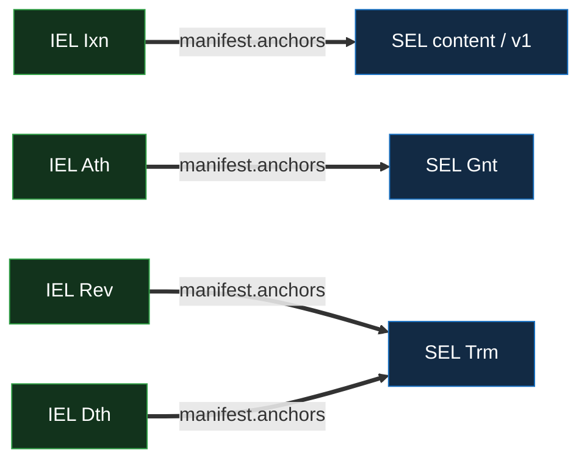

# SEL Events — Per-Kind Reference

Per-kind structural reference for the SEL event taxonomy: the **five** SEL kinds (`Icp` / `Ixn` /
`Pin` / `Gnt` / `Trm`), one tier-1 content pair beneath two tier-2 sealed kinds, all anchored
cross-layer by the IEL. The cross-primitive field shape — common fields, the `manifest` model,
`previousSeal`, and the full per-kind field grid — is the
[event-shape reference](../event-shape.md#sel); this doc states the SEL-specific semantics: the
three orthogonal axes, the two-tier capability model, the kind-strict cross-layer anchor matrix, the
recomputable `Icp` and the serial-1 floor, the `Gnt` grant, the `Trm` kill, the manifest roles, and
sort priority.

For chain lifecycle (states, the seal-advancers, the down-pin, the IEL clock), see
[`log.md`](log.md). For merge-layer routing, [`merge.md`](merge.md). For the verifier walk,
[`verification.md`](verification.md).

## Event taxonomy

A SEL uses exactly five kinds; any other kind code is malformed. A plain content SEL floors its
finality to the IEL rather than sealing itself
([`log.md`](log.md#the-seal-advancers-and-the-trust-finality-floor)).

| Kind  | Topic                    | Class     | Tier | Count                                         | Purpose                                                                                                                                                  |
| ----- | ------------------------ | --------- | ---- | --------------------------------------------- | -------------------------------------------------------------------------------------------------------------------------------------------------------- |
| `Icp` | `vdti/sel/v1/events/icp` | inception | 1    | `t_use`                                       | Inception — commits `owner` + `topic` + optional `data`; **no `pin`, no manifest** (stays recomputable). Never itself anchored; its serial-1 **v1** is.  |
| `Ixn` | `vdti/sel/v1/events/ixn` | content   | 1    | `t_use`                                       | Content — records content SAD(s) and re-pins to the IEL. **≤ 1 per SEL per IEL `Ixn`.** **The divergeable content kind** (first-seen, buriable).         |
| `Pin` | `vdti/sel/v1/events/pin` | content   | 1    | `t_use`                                       | The **floor re-pin** — carries only the down-`pin`. The fallback serial-1 floor when inception batches no other event. Buriable; **not** seal-advancing. |
| `Gnt` | `vdti/sel/v1/events/gnt` | sealed    | 2    | `t_authorize`                                 | The doc-membership **grant** — the additive twin of `Trm`. Sealed on arrival, seal-advancing, non-buriable, walked back only by a rescission.            |
| `Trm` | `vdti/sel/v1/events/trm` | terminal  | 2    | `t_govern` (revoke) · `t_authorize` (rescind) | The SEL **kill** — closes the SEL. Sealed on arrival, monotone, terminal-on-divergence.                                                                  |

The **class** column names the event's role under the
[divergence-and-recovery rules](../../../../protocol-doctrine.md#divergence-and-recovery): only
**content** (`Ixn` and the floor `Pin`) is buriable. `Gnt` and `Trm` are **sealed** — never buried
or overturned. The **tier** column names the KEL capability an adversary must forge to author the
IEL participation that anchors the act (§Two-tier capability model). The **Topic** column is the
kind's versioned schema identifier (`vdti/sel/v1/events/…`), unrelated to a SEL's derivation `topic`
(§Inception and the serial-1 floor).

## The three orthogonal axes

Every SEL kind sits at the intersection of **three independent axes**. Conflating them is the
classic error the model guards against; each answers a different question.

1. **Count — how many owner-IEL members must authorize.** The count is drawn from the **owner
   IEL's** threshold vector `{t_use, t_govern, t_authorize}` and delivered by the **anchoring IEL
   event's** member participations (a SEL event has no signers of its own). `t_use` prices content,
   `t_govern` a governed kill (a revocation), and `t_authorize` a grant or a rescission — the three
   slots are the whole vector.
2. **Tier — whether the owner's rotation reserve is required.** **Tier 1** is content (a signing key
   suffices); **tier 2** is any grant or kill (the act must be permanent on arrival, so it is
   sealed, and a seal is a governance act needing the reserve). Tier is set by the kind and is
   **orthogonal to count** — a content `Ixn` is tier 1 even at a high `t_use`. There is **no tier
   3**.
3. **Anchor-kind → finality.** A content `Ixn` rides an IEL `Ixn` → **first-seen / buriable**; a
   `Gnt` rides an IEL `Ath` → **sealed on arrival**; a `Trm` rides an IEL `Rev` / `Dth` → **sealed
   on arrival**. The anchor kind determines whether the SEL event can ever be buried.

The axes are independent: the count is a dial, the tier is set by kind, and the finality follows the
anchor kind. Tier-elevation (anchor tier ≥ event tier) is an **additional floor, not the check** — a
tier-only reading would let a tier-2 kill-anchor host tier-1 content, laundering content onto the
sealed rail; the **kind-strict** binding below closes it.

## Two-tier capability model

A SEL act is classified by **tier** — the KEL capability an adversary must forge to author the IEL
participation that anchors it.

- **Tier 1 — a member's signing key.** Content (`Ixn`, `Pin`) rides an IEL `Ixn`, itself anchored by
  member KEL `Ixn`s signed by current signing keys. Tier 1 even at a high `t_use`.
- **Tier 2 — a member's rotation reserve.** A grant (`Gnt`) rides an IEL `Ath`, and a kill (`Trm`)
  rides an IEL `Rev` / `Dth`; each of those IEL events is anchored by member KEL `Rot`s revealing a
  rotation reserve. The reserve is held **apart** from the signing key, and the old signing key is
  **not** a prerequisite — a rotation reveals the new key.

A **kill** is the permanence case: low-danger (it only removes trust) but monotone (a third party
relies on it), so it must be sealed and rides a dedicated tier-2 kill-anchor. Tier semantics and the
kind-strict anchor rule are the protocol doctrine's
([§Tiers](../../../../protocol-doctrine.md#tiers)). A signing-key (tier-1) compromise can author
content but no sealed kill — it is **fully deadenable** by one owner rotation
([`reconciliation.md`](reconciliation.md#the-tier-1-compromise-is-fully-deadenable)).

## Per-kind semantics

### `Icp` — inception (tier 1, `t_use`)

Commits `owner` (the IEL prefix, immutable), `topic` (the application discriminator), and an
optional `data` (the lookup recompute input). It carries **no `pin` and no manifest** — a pin or
manifest field would change the whole-content prefix and break the recomputation a lookup SEL
depends on ([`log.md` §Prefix derivation](log.md#prefix-derivation)). The `Icp` is unsigned,
recomputable content; it establishes the SEL but **proves nothing alone** — authentication rides the
serial-1 event (below). It is **never itself anchored**; it rides via `v1.previous`.

### `Ixn` — content (tier 1, `t_use`)

Records the content SAD(s) it commits (the `content` role) and re-pins the SEL to the IEL's current
tip (the top-level `pin`). Anchored by an IEL `Ixn`, **at most one `Ixn` per SEL per IEL `Ixn`** —
so a linear IEL totally-orders the SEL's content. `Ixn` is the **divergeable / first-seen** content
kind; it does not advance the seal, and it is buriable until the SEL's next `Gnt` / `Trm` (or, on a
plain content SEL, until the IEL's seal floors it —
[`log.md` §The seal-advancers](log.md#the-seal-advancers-and-the-trust-finality-floor)).

### `Pin` — the floor re-pin (tier 1, `t_use`)

Carries **only** the down-`pin` — no manifest, no seal. It is the **fallback serial-1 floor**: the
`Icp` cannot hold a pin, so when inception batches **no other first event** (an issue-and-sit SEL),
a bare `Pin` is the v1 that floors the SEL to its IEL at issuance. It is **not** seal-advancing — it
promotes nothing and is buriable like content. Where inception carries a first event that already
floors (a first content `Ixn`, or a lookup SEL's `Trm`), no separate `Pin` is needed.

### `Gnt` — the doc-membership grant (tier 2, `t_authorize`)

Opens a doc-membership grant — the editors / commenters and their validity-period starts —
committing the gated grant-doc SAD (the `grant` role). It is anchored by an IEL **`Ath`**
(kind-strict — an `Ath` anchors **only** `Gnt`s) and is the **additive twin of `Trm`**: sealed on
arrival, seal-advancing, **non-buriable**, walked back only by a rescission (a `Trm` under an IEL
`Dth`) or by reincept, never overturned. What a membership grant _means_ — the version DAG, validity
periods, the read policy — is the shared-documents feature
([`../../../../features/shared-documents/documents.md`](../../../../features/shared-documents/documents.md),
forthcoming); this primitive states only the grant-and-rescind **structure**.

### `Trm` — the SEL kill (tier 2)

The SEL kill — it closes the SEL, and is **always sealed on arrival**, anchored by one of the owner
IEL's two dedicated kill-anchors:

- **A revocation** rides an IEL **`Rev`** (`t_govern`) — a governed kill of an owned artifact.
- **A rescission** rides an IEL **`Dth`** (`t_authorize`) — deauthorizing what an `Ath` / `Gnt`
  granted.

The kill-anchor's `manifest.anchors` names the `Trm`, and the `Rev` / `Dth` also carries the owner
IEL's **`kills[]` declaration** naming the killed locus (the IEL side —
[`../iel/events.md` §Kills](../iel/events.md#kills--the-fail-secure-revocation-declaration)). A
`Trm` is **monotone** — there is no delayed or unsealed form and no un-kill; restoring a killed
thing is a **fresh grant at a fresh locus**, never a retraction. The killed thing is _which SEL its
`Trm` extends_.

**`bound` placement is per-feature — the primitive says only that a `Trm` commits whatever its
manifest commits:**

- **A credential revocation** — no `bound` (revocation is binary); the `Trm` carries only its pin.
- **A delegate rescission** — the `Trm` carries only its pin; the grandfather `bound` rides
  **publicly** in the IEL `Dth`'s `kills[]` entry, un-withholdable on the witnessed IEL.
- **A doc-member rescission** — the `bound` is participant-identifying, so it rides a **gated
  rescind-doc committed by that `Trm`** (via `anchors[]`), and the `kills[]` entry carries only the
  blind target.

So "the `Trm` carries only its pin / self-contained, never fetches" is a **credential-and-delegate**
statement, not universal. The read strategy that consumes this structure — the fail-secure `kills[]`
walk and its fail-open lookup opt-out — is the feature layer's
([`../../../policy/documents.md`](../../../policy/documents.md)); this primitive states only the
kill **structure**.

## The lookup-SEL shape

A **lookup SEL** (a revocation or rescission locus) is the born-to-kill shape `{Icp, Trm}` — its v1
**is** its `Trm` (no separate `Pin`). Its prefix and SAID are the usual two-pass derivation over
`Icp{owner, topic, data}` where `data` is the grant-instance reference, so a **re-grant after a kill
gets a fresh locus** (each grant epoch owns its own). The `Trm`'s pin equals the killing `Rev` /
`Dth`'s `previous` (one-before — the anchor's SAID does not exist yet when the `Trm` is authored).
The IEL's `kills[]` `target` is a **separate** flat, domain-qualified hash
`hash('{topic}:{owner}:{data}')`, distinct from the lookup SEL's derived prefix and SAID — so the
public declaration never leaks the lookup object's address
([`../iel/events.md` §Kills](../iel/events.md#kills--the-fail-secure-revocation-declaration) is
authoritative on the IEL-side `target` / `bound`).

## Inception and the serial-1 floor

Inception is a two-event floor: the `Icp` (recomputable, no pin) plus a **serial-1 event** (the
_v1_) that carries the pin the `Icp` cannot. The v1 is what the IEL anchors — the `Icp` rides via
`v1.previous`, **never itself anchored** — so every SEL uniformly reads `{Icp, v1, …}`. Which kind
is the v1 depends on why the SEL was born:

| SEL born as                     | v1 (serial-1)           | Anchored by (IEL) |
| ------------------------------- | ----------------------- | ----------------- |
| issue-and-sit (floor only)      | a bare `Pin`            | `Ixn`             |
| content, with a first amendment | the first content `Ixn` | `Ixn`             |
| a revocation / rescission locus | the `Trm` (the kill)    | `Rev` / `Dth`     |

**Authentication is the v1's anchor, never the `Icp`** — a SEL is validly established only if its v1
resolves to a real IEL event whose prefix equals the SEL's `owner`, with the v1 named in that IEL
event's `anchors` and `v1.previous == said(Icp)`
([`log.md` §Authentication rides the v1](log.md#authentication-rides-the-v1)). This follows the KEL
/ IEL rule that inception tier follows what it establishes
([`../../../../protocol-doctrine.md` §Tiers](../../../../protocol-doctrine.md#tiers)): a SEL `Icp`
is tier 1 because it establishes single-owner **data**, not governance.

## The manifest — roles a SEL event carries

A SEL event commits to what sits above or beside it through a **`manifest`** — the SAID of a
role-grouped SAD
([event-shape §The manifest](../event-shape.md#the-manifest--what-an-event-commits-to-grouped-by-role)).
A manifest carrying any role outside its kind's vocabulary is malformed and rejected (read
kind-first):

| Role      | Carried by | Commits to                                                   |
| --------- | ---------- | ------------------------------------------------------------ |
| `content` | `Ixn`      | the content-SAD SAID(s) the `Ixn` records                    |
| `grant`   | `Gnt`      | the gated grant-doc SAD a doc-membership grant opens         |
| `anchors` | `Trm`      | the higher-layer SAID(s) a `Trm` commits (a doc-member kill) |

The `content` role is **directly consumed** with no downstream type-check, so the kind → role
allowlist is its only protection — an `Icp` / `Pin` carrying a manifest at all is malformed. `grant`
is **back-checked** (a `Gnt` is valid only anchored by an IEL `Ath`), so unlike `content` it is not
directly trusted. The `Icp`'s derivation inputs (`owner` / `topic` / `data`) and every event's
down-`pin` are **top-level structural**, never manifest roles.

## The kind-strict cross-layer anchor matrix

Each SEL kind is valid **only** when anchored by exactly its matching IEL kind, and each of those
IEL kinds anchors **only** its matching SEL kind:

| SEL kind           | Anchored by (IEL) | Tier |
| ------------------ | ----------------- | ---- |
| content `Ixn` / v1 | `Ixn`             | 1    |
| `Gnt`              | `Ath`             | 2    |
| `Trm` (revocation) | `Rev`             | 2    |
| `Trm` (rescission) | `Dth`             | 2    |

A `Trm` is valid **only** anchored by a `Rev` or a `Dth` — this back-check is what keeps the kill
_sealed_ (the `Rev` / `Dth` seals on arrival), while the IEL's kind → role gate keeps the kill
_declaration_ (`kills[]`) at tier 2. The two kill-anchors are discriminated by the SEL's type (a
revocation locus versus a rescission locus); the anchor SAIDs carry no per-entry role tags, so the
anchor structure opens no side-channel. **Tier-elevation is an additional floor, not the check** — a
tier-only reading would let a tier-2 kill-anchor host tier-1 content, laundering content onto the
sealed rail and breaking only-tier-1-is-buriable; the kind-strict binding closes it. The matching
IEL side is
[`../iel/events.md` §The kind-strict anchor matrix](../iel/events.md#the-kind-strict-anchor-matrix).

## Per-kind sort priority

The merge layer orders events at the same serial deterministically by
`(serial ASC, kind sort_priority ASC, said ASC)`. Sort priorities:

| Kind  | Sort priority |
| ----- | ------------- |
| `Icp` | 0             |
| `Ixn` | 1             |
| `Pin` | 2             |
| `Gnt` | 3             |
| `Trm` | 4             |

Two competing `Ixn` events in a fork get the same priority and break the tie by SAID — identical
ordering across all nodes, so deduplication and divergence detection produce the same result
everywhere. The sealed priorities keep `Gnt` / `Trm` ordered after content within a batch for
consistent merge-layer evaluation. The `said` tiebreaker is for determinism only and carries no
meaning.

## Cross-references

- [`../event-shape.md`](../event-shape.md#sel) — cross-primitive event shape: common fields, the
  `manifest` model, `previousSeal`, the canonical per-kind SEL field grid.
- [`log.md`](log.md) — chain primitive: states, prefix derivation, the seal-advancers and the
  trust-finality floor, the down-pin, the IEL clock.
- [`merge.md`](merge.md) — merge-layer routing: content first-seen, `Gnt` / `Trm` sealed on arrival,
  cross-layer fork resolution.
- [`verification.md`](verification.md) — verifier walk: anchor-monotonicity, the cross-layer
  deadness read, lookup-SEL two-pass derivation.
- [`reconciliation.md`](reconciliation.md) — the exhaustive cross-layer correctness proof.
- [`../iel/events.md`](../iel/events.md) — the IEL kinds that anchor SEL acts (`Ixn` / `Ath` / `Rev`
  / `Dth`), the `kills[]` declaration, the anchor matrix from the IEL side.
- [`../../../../protocol-doctrine.md`](../../../../protocol-doctrine.md#tiers) — tiers and
  kind-strict anchoring;
  [§Divergence and recovery](../../../../protocol-doctrine.md#divergence-and-recovery);
  [§Negative checks are positive lookups](../../../../protocol-doctrine.md#negative-checks-are-positive-lookups).
- [`../../../policy/documents.md`](../../../policy/documents.md) — where a credential's revocation /
  a rescission is interpreted (the feature layer; the SEL states only the kill structure).
- [`../../../../features/shared-documents/documents.md`](../../../../features/shared-documents/documents.md)
  — the doc-membership grant a `Gnt` opens and the gated rescission `bound` (forthcoming).
- [`../../../../features/credentials/`](../../../../features/credentials/) — the credential feature
  (forthcoming): a credential is a direct-anchored SAD, not a SEL.
