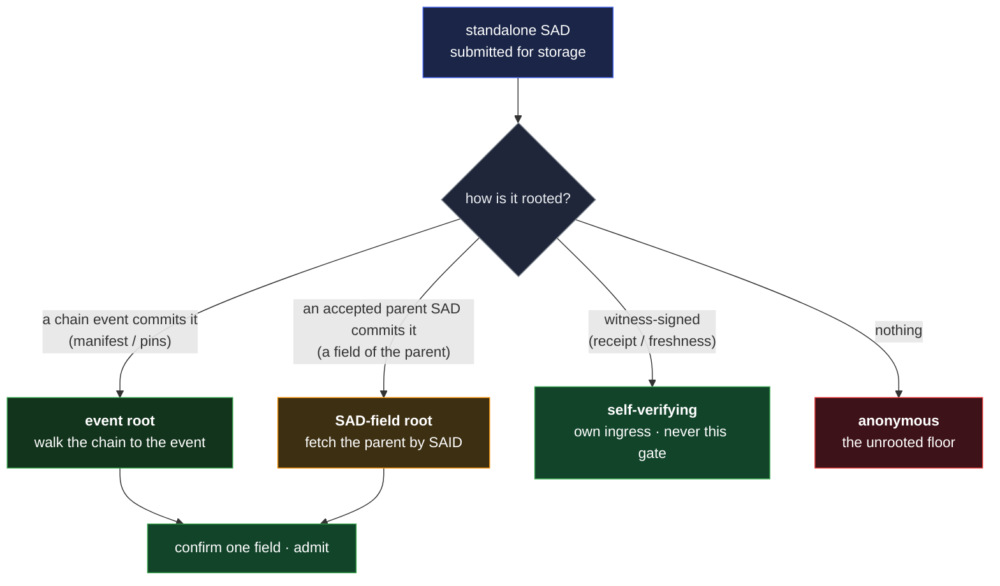

# Rooting — how the store decides a SAD belongs

The SAD object store accepts a standalone [SAD](sad.md) only when the submitter can show it belongs
there. A SAD is **rooted** when an already-accepted **root** commits its identifier; the submitter
names that root, and the store confirms it with one local lookup and one check — it keeps no reverse
index and never inverts an identifier to find a root, it only confirms the one it was handed.
**Confirm, not correlate.**

This is the store's structural admission floor. Without it, the one class the store can't vouch for
— an anonymous write with no writer binding — is held back only by an operator's rate limit
([`../../../residuals.md` §Anonymous-write flood](../../../residuals.md#9-availability-caps-and-dos-bounds)).
Most data already earns its place — a credential is anchored on its issuer's chain, a document
version on its editor's — but a great many legitimate SADs carry **no writer binding of their own
yet are committed by something that does**: a credential's `terms` and `claims`, a co-issuer list, a
`Gnt`'s grant value, an event's manifest role SADs, a replica set. Each rides the anonymous gate
today, so tightening that gate against spam also turns away the framework's own building blocks.
Rooting gives those committed-but-ownerless SADs an admission path of their own, which is what lets
the anonymous gate close.

## The rule

> A standalone SAD is accepted when an already-accepted **root** commits its identifier. A root is
> one of two things, one commitment idea a layer apart:
>
> - **a chain event** — through a field of the event that names a store SAD (the event's `manifest`,
>   or an IEL event's `pins`);
> - **an already-accepted parent SAD** — through a field of the parent that commits a child (a
>   manifest SAD's roles, a credential's `terms` / `claims`).

The manifest is not special — it is a [SAD](sad.md), so its contents root the same way any parent's
do. An owner-anchored object (a credential, a custodied file) is this same rule with a **blinded**
commitment: its identifier is committed as a one-way hash in the anchoring event's
`manifest.anchors`, and the store confirms membership by recomputing that hash
([`custody.md` §Attribution requires an anchor](custody.md#attribution-requires-an-anchor)). Two
escape hatches sit beside the rule and never reach this gate: **self-verifying** SADs (witness
receipts and freshness statements, which prove themselves by signature and arrive through their own
ingress) and **anonymous** SADs (the genuinely rootless residual — a document root, a drop-box —
handled by [§The unrooted floor](#the-unrooted-floor)).



## The submission

A submission is itself a small SAD — an **envelope** naming the object and the root it claims — and
the store dispatches on the root's `kind`, so it needs no guesswork and no per-kind registry:

```
submission = {
  said,
  kind: "vdti/rooting/v1/submission/envelope",
  sad,      // the SAD being admitted
  root,     // a nested rooting SAD (below)
}

root =
    { said, kind: "vdti/rooting/v1/{kel,iel,sel}/event", prefix, event, field }   // rooted by a chain event
  | { said, kind: "vdti/rooting/v1/sad/field", parent, field }                    // rooted by a parent SAD
```

- **`event`** is the anchoring event's `previous` identifier — the same locator custody already
  uses, so the committing event sits one position past it
  ([`custody.md`](custody.md#attribution-requires-an-anchor)). **`prefix`** names its chain.
- **`parent`** is the accepted parent SAD's identifier.
- **`field`** names where the commitment lives — for an event root, `manifest` or `pins`
  ([`../event-logs/event-shape.md`](../event-logs/event-shape.md); those are the only two event-body
  fields that name a store SAD, everything else hangs off the manifest SAD as a `sad/field` root);
  for a parent-SAD root, the parent field that carries the child.

The store reads that field's **declared type from the root's kind schema** and confirms accordingly
— a direct child reference matches by **identifier equality**, a blinded-commitment list (`anchors`)
matches by **recompute-and-membership**. That one schema-driven step is what lets two root types
cover every case, blinded owner-anchors included, with no third type. A failed confirm is a
**rejection**, not a fall-through to the anonymous gate — a bad pointer is a malformed submission.

The submission travels **expanded** — the whole body of `sad` — so the store can recompute its
identifier; the identifier that is signed and verified is the **pre-compact** (fully-compacted) one
([`compaction.md`](compaction.md#said-preservation-invariant)). The store recompacts and checks.
When the named root has not landed yet — the parent or committing event has not arrived — the
submission **waits**, reusing the deferred-dependency parking the store already runs
([`../../../substrate/infrastructure/witnessd.md` §Deferred-dependency parking](../../../substrate/infrastructure/witnessd.md#deferred-dependency-parking-and-drain)),
and admits itself when the root arrives. A parent and its children submitted together land in one
step.

## Two invariants it rests on

Rooting needs no new machinery for these — both already hold at the SAD layer:

- **One identifier per committed SAD.** A committed SAD carries exactly one `said`, at the top
  level; any sub-object that has its own `said` is compacted to it, and any sub-object that must
  stay inline carries none. This is just the **fully-compacted canonical form**
  ([`compaction.md`](compaction.md), [`said.md`](said.md#canonical-form-for-said-computation)) — the
  form the identifier is defined over — so the store always confirms a flat, single-pass shape, and
  the recursive compaction is the submitter's to do.
- **Inline means bound to the parent.** A sub-part that must inherit the parent's read gate, or must
  be deleted when the parent is, carries **no identifier** — it stays in the parent's bytes and
  shares its fate (the `custody` and `availability` structs are exactly this). A sub-part with its
  own identifier is independent on both axes: its own gate
  ([`compaction.md` §Privacy contract](compaction.md#privacy-contract)), its own lifecycle. So there
  is no cascade — "I need deletion to propagate" is answered by "then inline it," the same mechanism
  as shared custody. Rootedness is checked **once, at admission**, never maintained as a live
  invariant.

## A root's availability covers its children's

A rooted child stays re-confirmable only while its root is still reachable, so a root's
[availability](availability.md) must **cover** every SAD it roots — `root ⊇ child`:

- **In time** — `child.expiry ≤ root.expiry`. (A root with no expiry, the `∞` case, covers any
  child.)
- **In space** — `child.replicas ⊆ root.replicas`. A private child of a public root is fine; a
  public child of a private root is refused, because it would need the private root reachable where
  it isn't — bounding the child, never widening the root, is what keeps the root from leaking past
  its own scope.
- **No `once` root.** A root deleted after one read can cover nothing, and no consumer can be
  guaranteed to grab a root and its child atomically; one-shot data whose sub-parts must vanish with
  it uses the inline rule instead (a single `once` object, no separate children).

A **leaf** that roots nothing is unconstrained; a **chain-event root** is federation-wide and
permanent, so only a parent-SAD root needs the check, which rides the admission fetch the store
already does. The rule is enforced at admission from the SADs' own `availability` fields
([`availability.md`](availability.md#a-root-covers-its-children)).

## The unrooted floor

What can't be rooted still needs a floor, now that it is a named minority rather than the default: a
document's founding root (a competing one is always mintable; legitimacy is social), a drop-box
(anonymous writing is its point), a public publication. Two parts:

- **A live identity check.** An unrooted submission must carry a live signature from **any valid
  identity**. That authorizes no specific writer — it only proves a real, witnessed identity stands
  behind the write, which is expensive to forge at scale (identities cost witnessed events). The
  store resolves the identity from its own federation or the submitter presents it — either way
  end-verifiable, no standing index.
- **A bounded, operator-set forensic log.** The store keeps a record of the proven submitter — not
  to run the system (it never needs it for that; an author proves rooting on demand by furnishing
  it) but for emergencies: rate-limiting abuse and evidence if a drop-box is misused. It is
  **operator-local** (never on a chain, never gossiped), so it widens no federation-visible surface,
  and its **retention is a dial** the operator sets — 7–30 days recommended (90 the exceptional
  case), `0` allowed behind a prominent warning that it forgoes spam protection. The same retention
  that catches an abuser de-anonymizes a legitimate source, so a source-protection drop-box wants
  `0` and an accountable one wants retention
  ([`../../../residuals.md`](../../../residuals.md#9-availability-caps-and-dos-bounds)).

The floor is **operator-configured per anonymous kind**, not a protocol registry: a table maps kind
to floor, a `"*"` entry is the blanket default overridden by any exact-kind entry, and with no entry
at all the kind is **refused** — the fail-secure default and the deny-anonymous-by-default posture
the whole design turns on. The store's order: refuse unknown kinds, confirm rooted ones, else the
exact-kind floor, then `"*"`, then refuse. Enforcement is the storage boundary's
([`../../../substrate/infrastructure/vdtid.md`](../../../substrate/infrastructure/vdtid.md#the-sad-store-write-path)).

## Rooting does not stop a valid identity

Rooting raises the cost of a **fake** identity; it does nothing about a **real** one that floods
with valid, rooted data. The per-prefix event budget bounds one prefix and the per-IP limit bounds
one address, but not a resourced spammer spread across many of each. That is the second front — a
federation collectively refusing to witness an abusive prefix — and it lives in its own doc
([`../../../substrate/federation/blocking.md`](../../../substrate/federation/blocking.md)). Rooting
is the admission floor; blocking is the last resort; the two together are the spam-defense story.

## Adversarial framing

- **The anonymous flood is closed by construction.** Under the deny-anonymous posture, a rootable
  kind with no root evidence is refused; to place a SAD an adversary must exhibit an accepted root,
  and a root costs a witnessed, per-prefix-budgeted chain event. Spam resistance moves from an
  operator knob to a structural floor.
- **Confirm-not-correlate is preserved.** The store never inverts an identifier to find a root and
  keeps no reverse index; a blinded anchor is matched by recomputation, never by search. The
  serve-by-SAID anti-correlation property ([`sad.md`](sad.md#structural-shapes)) is untouched — the
  store still cannot walk an identifier back to the chain it stands for.
- **Bounded fan-out from a rooted parent.** A valid rooted parent can reference many junk children,
  but the child set is fixed by the parent's bytes, which the request size cap bounds — one root
  admits a bounded, not unbounded, fan. The parked-await set is bounded by the same reaper that
  sweeps the store's other transient tables
  ([`../../../substrate/infrastructure/vdtid.md`](../../../substrate/infrastructure/vdtid.md#request-bounds-and-rate-limits)).
- **The residual is the valid-identity flood**, addressed by
  [blocking](../../../substrate/federation/blocking.md), and — for the kinds that keep an anonymous
  floor — the operator-local forensic log, priced in
  [residuals](../../../residuals.md#9-availability-caps-and-dos-bounds).

## Cross-references

- [`sad.md`](sad.md) — the SAD layer; composition by reference; the standalone-vs-event split.
- [`compaction.md`](compaction.md) — the fully-compacted form, partial disclosure, the privacy
  contract, two-phase storage.
- [`custody.md`](custody.md) — the owner-anchor (the blinded event-root instance) and the inline
  structs.
- [`availability.md`](availability.md) — `replicas` / `expiry` / `once`, and the `root ⊇ child`
  rule.
- [`kinds.md`](kinds.md) — the `vdti/rooting/v1/*` family; [`shapes.md`](shapes.md) — its field
  shapes.
- [`../../../substrate/infrastructure/vdtid.md`](../../../substrate/infrastructure/vdtid.md) — the
  write path that enforces rooting and the anonymous floor.
- [`../../../substrate/federation/blocking.md`](../../../substrate/federation/blocking.md) — the
  second front against a valid-identity flood.
