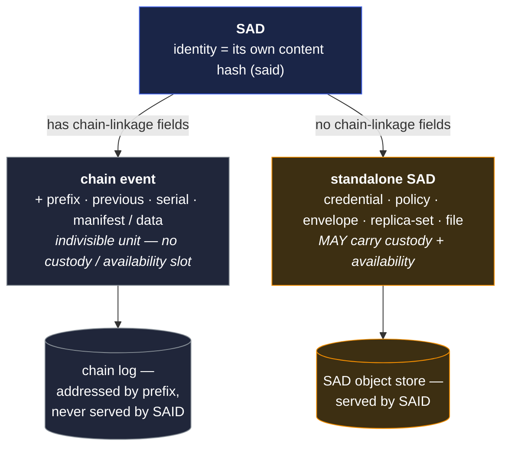
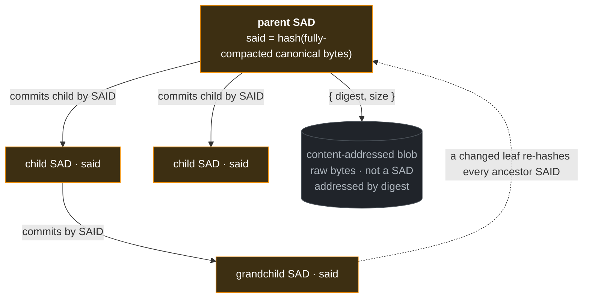

# SAD — Self-Addressed Data

A **Self-Addressed Data** record (SAD) is a serializable object whose own identifier — its
[SAID](said.md) — is derived from its content. Every content-bearing primitive in VDTI is a SAD:
chain events (KEL / IEL / SEL), credentials, policy declarations, exchange envelopes, replica sets,
and the content payloads SEL events anchor.

This doc states the SAD shape and the structural patterns that follow from it. The derivation
algorithm itself lives in [`said.md`](said.md); compaction and disclosure in
[`compaction.md`](compaction.md); per-object authority in [`custody.md`](custody.md).

**Reading order for the SAD primitive group**: this doc → [`said.md`](said.md) →
[`custody.md`](custody.md) → [`availability.md`](availability.md) →
[`compaction.md`](compaction.md).

## Structural shapes

Every SAD carries a `said` field. From there, one specialization matters at this layer:

- **Chain events** are SADs with chain-linkage fields — `prefix` (chain identifier) + `previous`
  (parent SAID) + `serial` (monotonic position) + kind-specific fields, including SAD references
  that point to what an event commits to (a KEL or IEL event's role-grouped `manifest`, a lookup SEL
  inception's `data`). Chain events live on a KEL, IEL, or SEL chain and replicate as indivisible
  units. Their kind-specific schemas declare no custody or availability fields, so — under the
  exhaustive-schema rule ([`kinds.md`](kinds.md#schema--exhaustive-and-versioned)) — those fields
  are rejected on a chain event.
- **Standalone (non-chain-event) SADs** are the rest — credentials, policy SADs, exchange envelopes,
  replica sets, file payloads, and the content payloads SEL events anchor. Stored in the SAD object
  store and retrieved by SAID. MAY carry per-object authority via a top-level
  [`custody`](custody.md) field and per-object replication scope via an independent
  [`availability`](availability.md) field on the same wrapper.

A chain event is a SAD with additional structural commitments — chain identity, monotonic position,
continuity via `previous`. A standalone SAD is independently addressable and carries its content
directly. The doctrine that follows uses "SAD" as the general term and specializes to "chain event"
or "standalone SAD" where the distinction matters.

The split is what the store enforces: only standalone SADs are served by SAID, so an identity's
opaque event commitments can never be inverted by a SAID lookup (§Events are never fetchable below).

**Events are never fetchable by SAID from the SAD object store.** Chain events live in the chain
log, addressed **by prefix**; only standalone SADs are stored in — and served by SAID from — the SAD
object store, so its write path **classifies a submission by `kind` and rejects event kinds**. The
principle: **nothing whose SAID must stay opaque is fetchable by SAID from the store** — a SAID is
an integrity commitment, not a global lookup key, and serving event bodies by SAID would let an
attacker invert an identity's opaque commitments. The full argument (which uses vocabulary defined
later) is
[`protocol-doctrine.md` §Negative checks are positive lookups](../../../protocol-doctrine.md#negative-checks-are-positive-lookups);
storage-side enforcement is
[`../../../substrate/infrastructure/vdtid.md`](../../../substrate/infrastructure/vdtid.md).

## Required fields

Every SAD carries:

- `said` — the SAD's self-addressing identifier. Computed per [`said.md`](said.md): the SAD is
  canonicalized with `said` populated to a fixed-value placeholder, Blake3-256 is computed over the
  canonical bytes, and the digest is base64 encoded and qualified.
- `kind` — a versioned string naming the SAD's type (`vdti/{component}/v1/{category}/{name}`). It
  drives structural validation, tier dispatch, the role vocabulary the SAD may carry, and whether
  the store serves it by SAID; a SAD with no `kind` cannot be sorted and is refused. The catalogue
  is [`kinds.md`](kinds.md).
- For **chain inception events** and the shared-document constitution `V0` (the prefix-deriving
  SADs): a `prefix` field in addition to `said`. Such a prefix-deriving SAD derives the two values
  via two separate hashes, in order — first `prefix` (with both `said` and `prefix` set to the
  fixed-value placeholder), then `said` (with `prefix` populated with its just-derived real value,
  and only `said` set to the placeholder). On the inception event, `prefix` and `said` are different
  values. Subsequent events on the chain inherit `prefix` from the inception event and derive only
  `said`; the inherited prefix is part of the canonical bytes the `said` hash sees. See
  [`said.md` §Derivation](said.md#derivation) for the algorithms.

What content the prefix commits to is **per-primitive** — always the whole inception SAD (the KEL's
key state; the IEL's `roster`, threshold vector, and `nonce`; the SEL's `owner` / `topic` / `data`),
never a hash of a separate field tuple. The shared fixed-value mechanism and the per-primitive
shapes are [`said.md` §Derivation](said.md#derivation)'s.

## Canonical serialization

Canonicalization uses JSON Canonicalization Scheme (JCS, RFC 8785): deterministic key ordering, no
insignificant whitespace, a stable number representation. Two parties starting from the same logical
content produce the same canonical bytes — and therefore the same SAID — independently.

The fixed-value placeholder for `said` (and `prefix`, when prefix-deriving) is the same shape and
byte-length as a real SAID. The canonical serialization's byte layout during SAID computation
matches the byte layout a verifier sees when reading the SAD with its real SAID in place. This is
what lets a SAID be embedded inside its own SAD without circularity: every consumer re-applies the
fixed-value rule, re-hashes the same bytes, and arrives at the same digest. For chain inception
events the same property holds for the prefix derivation as for the SAID derivation — two parties
starting from the same logical content arrive at the same prefix and the same SAID via two
independent hashes (see [`said.md` §Derivation](said.md#derivation)).

## Composition by reference

A SAD that depends on another SAD commits to that child by SAID. The canonical form for SAID
computation — the **fully-compacted** form — uses SAIDs at sub-SAD positions, never inline content
(see [`said.md` §Canonical form for SAID computation](said.md#canonical-form-for-said-computation)).
Over-the-wire representations MAY embed children inline for atomicity or transport efficiency (see
[`compaction.md`](compaction.md)); the parent's SAID is **defined over the fully-compacted canonical
form** and re-derived by compacting any wire form down (verifying each child), never read off the
wire bytes as-is.

The reference graph composes: a parent SAD's SAID commits to the SAIDs of its referenced children,
which commit to their own children, and so on. An adversary cannot substitute any node in the graph
without changing every SAID at-and-above that node.

## Bulk opaque bytes — the content-addressed blob

Composition by SAID (above) is for **structured** children — nested SADs that canonicalize and
expand for disclosure. Bulk **opaque** bytes — an encrypted payload, a file, media — are different:
canonical SADs are JCS text, so inlining raw bytes base64-encodes them, bloating a large payload by
roughly a third and forcing every reader to carry the whole blob just to verify its parent. So a SAD
names bulk bytes by **digest** rather than inlining them. The bytes live in the store as a
**content-addressed blob** — raw, addressed by the Blake3-256 digest of the bytes themselves (a
`digest`, not a SAID over a canonical SAD) — and the referencing SAD carries a `{ digest, size }`
reference. Because the SAD's SAID commits that reference, the parent's signature covers the exact
bytes by binding; a consumer fetches the blob separately and accepts it only when its recomputed
digest matches.

A content-addressed blob is **not itself a SAD** — it is opaque bytes, so it carries no `kind`, no
`custody`, no nested structure. Everything structured about it — its type, who wrote it, who may
read it, where the bytes live and for how long — rides the **`file` SAD** that names it
([`shapes.md`](shapes.md)); the blob is only that SAD's payload, governed by the SAD's
[`availability`](availability.md) (replication scope, TTL, one-shot) and written under an
authorization the storage service enforces
([`../../../substrate/infrastructure/vdtid.md`](../../../substrate/infrastructure/vdtid.md)).

The two reference mechanisms hang off one parent — **structured children by SAID**, **bulk bytes by
digest** — and both are committed by the parent's SAID:

Structured children canonicalize and expand for disclosure; the opaque blob does not (it carries no
`kind`, no `custody`, no nesting). Either way, substituting any node changes its SAID — or digest —
and every ancestor SAID that commits it, so tamper-evidence is transitive through the whole graph.

## Adversarial framing

A SAD's identity IS its content hash (SAID). Verification reduces to recomputation; trust in the
source is not required.

- A verifier given a SAD and its claimed SAID checks `computed_said == declared_said` from the bytes
  alone. The source can be a hostile peer, a tampered database, or a cached blob of unknown
  provenance; the bytes either hash to the claimed identifier or they do not. This is what
  [`../../../system-thesis.md`](../../../system-thesis.md) names **end-verifiability over
  data-from-any-source**.
- Tamper-evidence is transitive via the reference graph above. Composition by SAID means a parent's
  SAID transitively commits to every reachable child; modification anywhere in the subgraph
  propagates upward as a SAID change at every ancestor.
- Canonical serialization is part of the security argument, not a convenience. A non-deterministic
  serializer would let an adversary produce two different byte sequences from the same logical
  content with two different SAIDs, breaking the "one content, one identifier" property the rest of
  the protocol depends on.

The SAID is the load-bearing handle for every reference in the system — `previous` pointers, `pin`
references, policy SAIDs, anchor SAIDs, `manifest` SAIDs, custody references. The per-primitive
event-log docs and [`../../../protocol-doctrine.md`](../../../protocol-doctrine.md) elaborate the
structural rules that compose on top.
