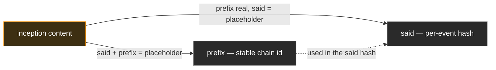

# SAID — Self-Addressing Identifier

A **Self-Addressing Identifier** (SAID) is the content-derived handle that names a [SAD](sad.md). It
is a type-qualified base64 encoding of the Blake3-256 hash of the SAD's canonical serialization with
the SAID field populated with a fixed value.

This doc states the SAID derivation algorithm, the fixed-value placeholder rule that makes
self-embedding work, and the consequences for signing and verification. The SAD shape this algorithm
hashes over is documented in [`sad.md`](sad.md).

## Derivation

SAID derivation differs slightly for chain inception events (which carry a `prefix` field) and for
all other SADs. Both algorithms share the same fixed-value placeholder mechanism, the same JCS
canonicalization, and the same Blake3-256 hash; they differ in which fields carry the placeholder
and how many hashes are computed.

**Canonicalization is RFC 8785 (JSON Canonicalization Scheme), pinned normatively.** Implementations
MUST conform to RFC 8785's key ordering, number representation, and escape rules. Any divergence is
a bug to fix, not a design hedge — SAID-bearing wire formats are interoperable only under a single
canonicalization spec, and the design pins that spec here.

Base64-encoding and qualifying the Blake3-256 digest produces a fixed-length text token. The
qualifier carries the algorithm code in its leading characters, so any consumer can re-derive
without out-of-band agreement on the hash function.

### Standalone and non-inception SADs

For any SAD that is not a chain inception event:

1. Take the SAD as a structured value (its logical content, including every field except `said`
   being derived).
2. Populate the `said` field with the **fixed-value placeholder** — an ASCII string of the same
   shape and byte-length as a real SAID.
3. Serialize the result with JSON Canonicalization Scheme (JCS, RFC 8785).
4. Compute Blake3-256 over the canonical bytes.
5. Base64 encode and qualify the digest.
6. Write the result back into the SAD's `said` field.

Non-inception chain events inherit their `prefix` value from the chain (copied forward from the
inception event) before `said` is derived; the inherited prefix is part of the canonical bytes the
hash sees.

### Chain inception events (prefix-deriving SADs)

A chain inception event derives **two** values — first `prefix`, then `said` — via two separate
hashes:

1. **Derive the prefix.** Populate **both** `said` and `prefix` with the fixed-value placeholder.
   Canonicalize with JCS. Hash with Blake3-256. Base64 encode and qualify. Write the result into the
   SAD's `prefix` field.
2. **Derive the SAID.** With `prefix` now populated with its real (just-derived) value, populate
   **only** `said` with the fixed-value placeholder. Canonicalize with JCS. Hash with Blake3-256.
   Base64 encode and qualify. Write the result into the SAD's `said` field.

The two hashes see different canonical bytes, so on the inception event `prefix ≠ said`. The prefix
is the stable chain identifier — copied forward on every subsequent event of the chain. The SAID is
the per-event content hash that turns over each event.

Two Blake3-256 hashes over the same canonical content. The **prefix** hash blanks both `said` and
`prefix` to the fixed-length placeholder; the **said** hash uses the real `prefix` and blanks only
`said`. Different bytes → **`prefix ≠ said`** (correlation resistance), and the placeholder's fixed
byte-length lets a SAID name its own SAD without circularity.

**Why two hashes, not one — correlation resistance.** A single hash would set the inception event's
SAID equal to the prefix — and the prefix is the chain's lookup key, while a SAID is an opaque
per-event commitment — a unique per-event identifier that is not itself a lookup key. So an
application that logs event SAIDs — an audit trail, a trace, a debug line — reveals nothing about
which chain an event belongs to, _except_ at the inception: if `said(Icp) == prefix`, logging that
one SAID hands an observer the chain's lookup key, correlating every other logged SAID back to the
identity. Deriving `prefix` and `said` via two separate hashes keeps `said(Icp)` a distinct opaque
commitment, so no logged SAID — the inception's included — leaks the prefix.

## The fixed-value placeholder rule

The placeholder mechanism — populating `said` (and `prefix`) with a fixed-value token of the SAID's
exact byte shape rather than removing the field or substituting a different-sized value — is the
structural property that lets a SAID be embedded inside its own SAD without circularity.

- **Same byte layout at derivation and verification.** The canonical bytes a producer hashes are
  exactly the canonical bytes a verifier reads, modulo the substitution of placeholder for real SAID
  at the `said` position. The field's byte length, the surrounding JCS punctuation, and the position
  of every other field stay identical. The hash function sees the same input shape both times.
- **No re-serialization on verification.** A verifier with the SAD in hand performs the substitution
  in place — replace the bytes at the `said` position with the placeholder, hash, compare. No
  reconstruction from a stripped or rewritten form is needed.
- **Deterministic across producers.** Two parties producing the same logical content arrive at the
  same canonical bytes, the same placeholder substitution, and the same SAID — without coordinating
  on which producer "owns" the SAID.

The same three properties hold for prefix derivation on chain inception events, with both `said` and
`prefix` set to the placeholder simultaneously per [§Derivation](#derivation) step 1. The
placeholder mechanism is identical; the set of placeholder-filled positions differs by algorithm.

Per-primitive prefix derivation rules — what content the prefix commits to (whole-SAD-content for
KEL; whole-SAD-content for IEL, including the `roster` of member devices, the threshold vector, and
the `nonce`; whole-SAD-content for SEL, namely the populated `owner` / `topic` / `data` (+
`content: true` on a content SEL, + the optional `lineage` on a re-establishable value lookup)
inception fields — so content and lookups derive to **distinct** prefixes (the `content: true` flag
rides the whole-content digest, and a lookup omits it), and a re-establishable value lookup carrying
`lineage: 0` derives a **different** prefix than a monotone lookup that omits the field,
absent-is-absent) — are documented in the corresponding event-log primitive docs. The prefix is
always the whole-content digest, never a hash of a separate tuple of fields; the primitives differ
only in which fields are populated and which are left content-bearing, but they share this same
fixed-value mechanism.

## Canonical form for SAID computation

Two rules govern the canonical form a SAD presents to the SAID-computation hash. They are jointly
load-bearing: together they define the SAID over the **fully-compacted** canonical form —
re-derivable from any wire form by compacting down — and propagate tamper-evidence downward through
any inline embedding.

**Rule 1 — The canonical form is the fully-compacted form (nested SADs by SAID).** The canonical
form used for SAID computation represents every nested SAD by its SAID (a type-qualified base64
string) — the **fully-compacted** form. A SAD's SAID is **defined over this canonical form**, and
every reference in the system commits to that value, so the SAID is **form-dependent**: it is the
fully-compacted form's SAID, not a property shared by every wire form's literal bytes. A SAD MAY be
transmitted with sub-SADs embedded inline (an expanded wire form; see
[`compaction.md`](compaction.md)) or with sub-SADs referenced by SAID (a compacted wire form). To
compute or verify the SAID from **any** wire form, a verifier **compacts it down** — replacing each
nested SAD with its SAID (verifying each per Rule 2) until the fully-compacted canonical form is
reached — then hashes that. The SAID must always stay **re-derivable from the data** this way;
hashing an expanded form's literal bytes does not yield it.

**Recognition rule.** A nested object is a nested SAD iff it carries a `said` field. The `said`
field is reserved at every nesting level; its presence is the structural marker by which a
canonicalizer identifies a sub-SAD position. The canonical form substitutes such an object with the
value of its `said` field. The recognition rule is schema-free — generic walkers compose without
per-payload schemas — and naturally surfaces submission errors: an inline nested object carrying a
`said` field is not in canonical form, its byte-hash does not match the declared SAID, and the
storage service rejects via the existing SAID-match check without a new code path.

**Rule 2 — Inline embedding requires verification before substitution.** When a sub-SAD is embedded
inline, the verifier MUST verify the embedded child's declared SAID against the child's own bytes —
re-deriving the child's SAID per the algorithm above — before substituting that SAID into the
parent's canonical form. If a child's declared SAID does not recompute from its content, the
parent's SAID computation rejects. The rule recurses: verifying a parent SAID requires that every
inline-embedded child verify down to leaves.

Without Rule 2 the design has a gap: an adversary could submit an expanded SAD whose embedded child
claims a SAID that does not actually hash to the child's content; the verifier would substitute the
lying SAID into the parent's canonical form, the parent's hash would match what the parent declared,
and the parent would appear to verify while committing to a fake child. Rule 2 closes the gap by
requiring downward recursion — tamper-evidence propagates down through inline embedding, symmetric
with the upward propagation [`sad.md` §Adversarial framing](sad.md#adversarial-framing) describes.

Canonical form is a global property. A SAD does not get to redefine it per-context — there is one
canonicalization (RFC 8785 plus the SAID-substitution rule above), and the SAID-computation hash
sees only that form.

## Signing surface

Signatures throughout VDTI are produced over the SAID bytes, not over the SAD's serialized content.
The SAID is the cryptographic commitment to the content; signing the SAID transitively commits the
signer to the canonical bytes that produced it.

- **Stable signing surface under extension.** When a SAD's schema gains new fields under extension
  discipline (see
  [`../../../protocol-doctrine.md`](../../../protocol-doctrine.md#extension-discipline)), the SAID
  computation absorbs the new fields into the digest. The signing surface is still the SAID, even
  though the underlying canonical-byte stream changed shape.
- **Unambiguous signature subject.** Signatures over serialized payloads are ambiguous about which
  canonicalization the verifier should reapply; signatures over a SAID are unambiguous — the SAID
  names exactly one content. A verifier checks the signature against the SAID, then independently
  re-derives the SAID from the content and checks equality.
- **Sign only a form you have seen.** One signature validates every faithful disclosure of a SAD —
  that is what makes graduated disclosure work — so a signer handed a _partially-compacted_ SAD can
  commit to sub-content it never expanded, and no later reader can recover which form the signer
  saw, because every disclosure shares the one SAID. A verifier cannot police this after the fact;
  the signer's own tooling must, before it commits. A signing helper finds the compacted positions
  **by schema**: a typed SAD's `kind` names which fields carry nested sub-SADs, so a bare SAID where
  the schema expects an expanded child is a position the signer has not seen. The helper **refuses
  to sign until the input is fully expanded at those positions**, and takes an explicit **override**
  for the deliberate case — committing to a SAD authored elsewhere by reference, vouching for it by
  hash on purpose. An unknown-`kind` SAD cannot be schema-checked, so it is override-only. The
  default is fail-secure and the opt-out is the signer's own, matching the framework's posture
  elsewhere; a SAD's own author holds its full form by construction, so the gate only bites when
  signing something handed over already compacted.

## Adversarial framing

The SAID's adversarial properties follow from Blake3-256's collision resistance and from the
determinism of the derivation algorithm.

- **Content authenticity from the SAID alone.** A verifier handed `(content, claimed_said)`
  recomputes `derived_said` from the content and accepts only when `derived_said == claimed_said`.
  Source provenance is not a verification input — the source can be a hostile peer, a tampered DB
  row, or a cached blob — because the bytes either re-derive to the claimed SAID or they do not.
- **Substitution is structurally infeasible.** Replacing a SAD with a different content payload
  while preserving the SAID would require a Blake3-256 collision. The protocol treats this as out of
  scope under standard cryptographic assumptions.
- **Producer ambiguity does not break verification.** Two honest parties producing the same content
  arrive at the same SAID; an adversary producing different content arrives at a different SAID. The
  protocol cares about which SAID is referenced (by `previous`, by a `manifest`, by an anchor, by a
  policy SAID, by a custody field), not about who computed it.
- **Canonicalization is part of the security argument.** A non-deterministic serializer would let an
  adversary produce two byte sequences with the same logical content but different SAIDs. JCS
  removes that degree of freedom — the canonical bytes are a function of the logical content alone.

For chain inception events the prefix is independently content-derived via the second algorithm in
[§Derivation](#derivation) and carries the same adversarial properties as the SAID —
content-authenticity by recomputation, substitution-infeasibility under Blake3-256 collision
resistance, producer-ambiguity-immunity, canonicalization-as-security. An adversary substituting
content on an inception event while preserving both `said` AND `prefix` would need to produce a
Blake3-256 collision against each — two independent collisions, not one. The bullets above describe
the SAID-side argument; the parallel prefix-side argument holds by construction.

The SAID is the load-bearing handle every reference in the system uses to commit to a SAD:
`previous` pointers, `pin` references (a SEL event floors down to its owner IEL via its `pin`), KEL
anchor SAIDs, policy SAIDs, `manifest` SAIDs on chain events, and a SEL's `data` naming the
standalone SAD it attributes (a write's custody anchor; see [`custody.md`](custody.md)). When the
doctrine talks about "a SAID anchored in a KEL `Ixn`" or "the `previous` SAID matches the parent,"
it is talking about this identifier and the recomputable derivation that backs it.
