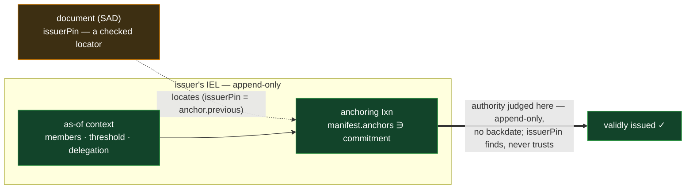

# Documents — the anchored context a policy is matched against

Part of the policy layer — see [`policy.md`](policy.md) for the language and the two authorization
mechanisms.

A document is a [SAD](../data/sad/sad.md): an application-defined payload (a credential, an
attestation, a signed declaration) that carries its content and the **anchored facts** a policy is
evaluated against — who issued it, and the **anchoring position** that fixes its issuer context so
it cannot name a more permissive past. **The document carries no policy of its own.** Whether to
accept it is the **relying party's** decision, written in the policy language and matched at the
application ([`policy.md`](policy.md)); policy lives at this document/application layer, never on a
chain event. This doc states the generic shape every such document shares — the anchored issuer
condition its acceptance turns on, and how anchoring fixes that context. The lifecycle of any
specific document kind is a feature layered above this one: how a **credential** is issued and
revoked (see [`../../features/credentials.md`](../../features/credentials.md)), or how a **shared
document** several parties co-author evolves under a creator (see
[`../../features/shared-documents.md`](../../features/shared-documents.md)) — the as-issued and the
evolving realizations of the same document substrate.

## The anchored issuer condition

Acceptance turns on **who issued the document** — judged from **anchored facts, not a policy the
document carries.** The document carries **no policy reference**; the **relying party's** policy
(`id` / `del` / `thr` / … — [`policy.md`](policy.md)) expresses which issuers it accepts, and the
verifier evaluates it **as-issued** against the document's issuer context. When a single identity
issues the document the common case needs no policy expression at all: the issuer's own IEL
**`t_use`** threshold authorizes the issuance **structurally**, and the relying party's condition is
just "the issuer is one I trust." A policy expression earns its keep when acceptance **spans
separate identities** (for example `thr(2, [id(A), id(B), id(C)])` — any two of three institutions)
or a **delegated** issuer (`del(root, N)`) — there the relying party's expression is evaluated
**as-issued** ([`evaluation.md`](evaluation.md)) against the anchored attestations.

**Who may _present_ the document is not a policy.** It is the uniform **challenge-the-issuee** step
— the holder proves control of the issuee identity live (single-identity authentication) — handled
by the presentation exchange, not the policy layer. A **read** gate on a document is likewise not a
policy: it is a `readers` membership ([`../data/sad/custody.md`](../data/sad/custody.md)). Policies
are **as-issued only**; there is no current-mode evaluation. (Durable **joint** presentation is a
**shared IEL** — one issuee prefix whose roster carries the required threshold, satisfied by the
same challenge; live multi-party consent is the exchange layer's, not the credential's.)

## The anchoring position — fixing the issuer context

A document carries no self-asserted **authority** pin — no value the issuer is _trusted_ on. Its
issuer context is fixed by the **anchoring position**: the issuer commits the document to its IEL by
authoring an **anchoring event** — an IEL `Ixn` whose `manifest.anchors` names the document. For a
**credential** — a direct-anchored SAD, never a SEL — that is the issuance `Ixn` naming the
**issuance commitment** `hash('vdti/iel/v1/actions/commitment:{issuer}:{cred.said}')`, and that
anchor **is** the validity proof
([`../data/event-logs/event-shape.md`](../data/event-logs/event-shape.md)). That event sits at a
fixed serial on the append-only chain, and it fixes the context two ways at once:

- It **commits the point-in-time** so a verifier can find and verify the issuer's context — the
  state immediately **before** the anchoring event transitively commits the issuer's identity (its
  members and threshold) and its whole delegation chain, because each is committed by the events the
  anchoring event builds on.
- It **cannot be backdated.** The anchoring position is append-only — it cannot be inserted into the
  past — so the issuer cannot make the document appear authorized under a more permissive past while
  it actually anchors in the restrictive present.

So **authority-affecting resolution is judged by the anchoring position.** The _document_ carries no
self-asserted value the issuer is _trusted_ on — the as-of is read from where it is anchored (a
credential's `issuerPin` / a custody SAD's `pin` only _locates_ that anchor, checked, never trusted)
— and there is no separate machinery to establish "when": the append-only chain is the clock.

**The anchoring position is named by the credential's committed `issuerPin`.** A cred's issuance
commitment is a flat hash in `anchors[]`, not a chain event, so nothing structurally forbids
re-anchoring it — and a later re-anchor must not move the as-of forward. Concretely: a **T1 `Ixn`
re-anchor** landing _after_ a **T2 `Rev`** revoked the cred would, under a naive latest-anchor
floor, push the as-of _past_ the revocation, silently un-revoking it — a **tier inversion**. The
credential's **`issuerPin`** (= the anchoring `Ixn`'s `previous`, committed by `cred.said`) fixes
the position at `issuerPin`'s serial + 1: a **checked locator** (the `Ixn` there must carry
`previous == issuerPin` and the commitment), and **provably the earliest** possible anchor — an
earlier one would need a hash cycle, since the commitment embeds `cred.said` which embeds
`issuerPin`. So a later re-anchor is **never consulted** — no scan reads `anchors[]` per event
(which would open a manifest per event — the cost the canonical walk is built to avoid). The pinned
position is the fixed range start for the revocation walk, alongside the fresh tip
([`evaluation.md`](evaluation.md)).

A document that is instead **looked up by a derived address** rather than presented — a
multi-identity **attestation SEL** (below), or any looked-up attested SAD — is located through the
serial-1 `Pin` (its `v1`) of its anchoring SEL. That `Pin` names a position but is **checked, not
trusted**: the verifier enforces `Pin.pin ==` the anchoring `Ixn`'s `previous`, so a served `Pin`
can't resolve under a stale roster (a SEL down-pin, checked the same way —
[`../data/event-logs/sel/log.md`](../data/event-logs/sel/log.md)).

### Non-circular

The document's SAID is fixed from its content; only **then** does the issuer author the anchoring
event whose `manifest` names that SAID. So the anchoring event commits to a document that is already
fixed. The document **does** carry a checked locator (a credential's `issuerPin`, a custody SAD's
`pin`) to _find_ that event — committed before the event exists, so still no cycle — but it is
verified against the real anchor, never a _trusted_ value that points back at the chain.

## Multi-identity authorization — independent attestations

A document whose **acceptance** turns on separate identities cannot collapse to a single joint
identity (a threshold over devices is not a threshold over identities). The document instead names a
custodied **`issuers` SAD** — `{ issuers: [ prefix, … ] }` — and **each authorizing identity issues
its own attestation independently**: each authors its own attestation SEL over the document,
self-flooring to its own IEL through that SEL's serial-1 `Pin` and self-locating by re-deriving its
prefix. The attestation SEL is a **discoverable content SEL** with its derivation fully pinned: its
`Icp` carries `owner` = the attesting identity's prefix, `topic` = `vdti/sel/v1/actions/attestation`
([`../data/event-logs/tags-and-topics.md`](../data/event-logs/tags-and-topics.md)), `data` = the
attested SAD's **`said`** (never a prefix), and `content: true` — with no `lineage` and no nonce, so
any relying party recomputes the same address (a private document's nonce'd `said` keeps the address
unguessable to non-holders). Its v1 is the serial-1 `Pin`, anchored by the attesting identity's IEL
`Ixn` — attesting is a **use act** (`t_use`), and the anchored existence, read as-of its own
anchoring position, **is** the attestation. The **relying party's** authorizing policy (`thr` /
`wgt` / `and` over `id()`) is satisfied by the **positive lookup** of each named issuer's
attestation — there are **no per-party pins**, no scan, and no cross-issuer coordination: each
issuer anchors on its own chain at its own pace, and the verifier reads each one's authorization
**as-of its own anchoring position**.

- An issuer that has **not** attested contributes no anchored position and is **not credited** — a
  malicious co-issuer cannot manufacture another's attestation, exactly as a single issuer cannot
  backdate its own.
- The threshold reads the count of **distinct** attesting identities (by prefix,
  [`policy.md`](policy.md)).

## Recursive

A document issued under another document is anchored just as a credential is. A document `D` issued
under credential `C` is committed by `D`'s **own** anchoring event on its issuer's IEL; `C`'s
context is committed by, and found through, that position, since the issuer holds and anchored `C`.
Authority is judged by `D`'s own anchoring position. The same append-only-chain-is-the-clock rule
applies at every level — with no self-asserted value carried at any level.

## Delegation in a document

A document may be authorized by a **delegate** of an identity — the `del(X, N)` leaf
([`policy.md`](policy.md)). The document commits the **one authorizing path** it was issued under:
each hop's delegating link is the content-addressed prefix recomputed from
`(delegator, vdti/sel/v1/actions/delegation, delegate)` (delegator = owner, delegate = data — the
same scheme as a rescission lookup,
[`../data/event-logs/iel/delegation.md`](../data/event-logs/iel/delegation.md)), **committed on the
delegator's (owner's) own identity** (owner-rooted — only the owner anchors at a derived locus) and
pinning up to `X`, so the verifier **derives** the authorizing chain from committed data and walks
it (up to `N` hops, and never beyond the verifier-wide work cap — exceeding either denies,
fail-secure) — the presenter furnishes nothing to prune. Per hop the verifier checks that the
delegation was granted — the hop's `Ath` delegates the prefix **and** the delegating-link marker
commits that same delegate — and that the grant has not been **rescinded** (a positive `kills[]`
match, fail-secure by default — [`policy.md`](policy.md)).

The **grandfather** check is **per hop, on that hop's own chain** — there is no cross-chain clock:
the **issuer's own hop** is grandfathered iff the document's **anchoring position** is an ancestor
of the issuer's rescission bound; each **upstream hop** iff _that hop's committed grant position_ is
an ancestor of _that hop's_ bound, on the granting delegator's chain. The document is authorized iff
**every** hop is grandfathered. (A grant authored before trust was withdrawn at its hop stays valid;
one that post-dates that hop's bound does not — and the bound is **set once** at rescission — the
rescission is a terminal `Trm`, so it can't be moved later to un-kill, nor tightened earlier; a
mis-set bound is recovered operationally, not by adjusting it.)

To give several delegators kill-authority over a document, issue it under a threshold spanning their
legs, so every leg lands in the committed chain. The delegation mechanics — the delegate list, the
rescission lookup, and the bound — are the IEL primitive's; see
[`../data/event-logs/iel/`](../data/event-logs/iel/).

## Timestamps are advisory

A document may carry feature-level timestamps (an issued time, an expiry). They are **advisory**:
they never decide a structural or cryptographic check. An expired document is _expired_ — the caller
inspects that and decides — but all ordering and grandfather questions use the **anchoring
position** (append-only ancestry), never a clock. The chain primitives themselves carry no
timestamps at all; only feature layers do, and only as feature semantics.

## Public versus private issuance

Whether an outside observer can tell that an identity issued a particular document is a property of
how the document is located and disclosed, not of the policy layer. A document whose locating
address is derivable from its public content is **discoverable**; one whose content carries a
high-entropy nonce derives an unguessable address and stays **private** until its holder discloses
it. Either way the relying party's policy, and the anchoring that fixes the document's context, work
identically. The addressing and privacy rules live with the SEL primitive and the credentials
feature — [`../data/event-logs/sel/`](../data/event-logs/sel/).
