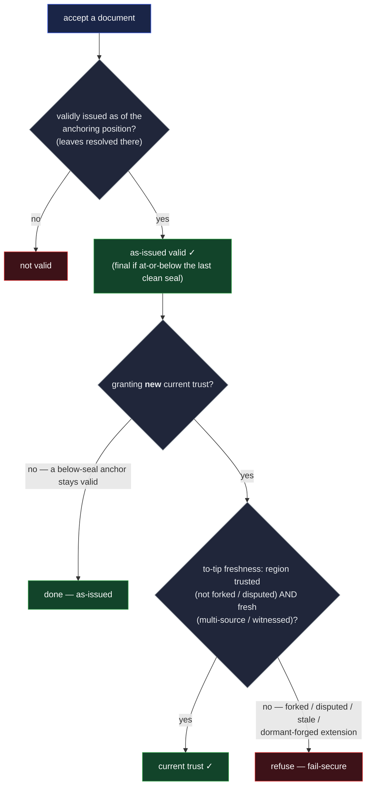

# Evaluating a policy — the as-issued composer

Part of the policy layer — see [`policy.md`](policy.md) for the language and
[`documents.md`](documents.md) for where a policy lives.

A policy answers one question — **_was this validly issued?_** — and it is evaluated **as-issued**:
resolve each leaf **as of the document's anchoring position** (the issuer's identity state at the
moment of issuance). The proof that the named parties acted is **already on the chain** — the
committed anchors that position reaches ([`documents.md`](documents.md)). This is how a document's
**authorizing** condition is checked when it spans separate identities.

There is no live, current-mode policy evaluation. Live checks don't compose — a passive verifier
cannot gather async parties' live signatures — so composition is **as-issued only**. The live acts
that might look like a current policy are **not** policies: _who may present a credential_ is a
single-identity **challenge** to the issuee (the presentation exchange, not this layer), and _who
may read a document_ is a **membership** lookup against the SAD's `readers` gate
([`../data/sad/custody.md`](../data/sad/custody.md)). Neither is composed by the policy engine. A
chain's current-state freshness is the **to-tip freshness step** below — a separate check, not a
policy mode.

## One composer, one leaf resolver

- **The composer** — the `thr` / `wgt` / `and` / `pol` logic (credited set, distinct-by-identity
  counting, per-identity-max weight, `and` over disjoint pools, the threshold check). It calls the
  leaf resolver, combines the results, and applies the
  [composition rules](policy.md#composition-rules).
- **The as-issued leaf resolver** — each leaf needs two things: the **state** it resolves against —
  the identity's members + **`t_use`** threshold **as of its anchoring position** — and the
  **proof** that the named party acted — the **committed on-chain anchors** those positions reach,
  the proof already in the chain.

  The `del(X, N)` leaf resolves the same way, and is **bounded** — the verifier walks **up** from
  the presented party at most `N` hops (and never beyond a verifier-wide work cap) to reach `X`,
  denying fail-secure if either is exceeded: it resolves each hop's delegation as of the anchoring
  position and checks the grant's grandfather ancestry against the rescission bound. "Is this
  delegation rescinded?" is the **positive lookup** of [`policy.md`](policy.md), never a scan.

  The `crd(K, E)` leaf resolves against a **furnished** credential — supplied by the presenting
  context the way a document supplies its `delegationPath`, never discovered by scan. The resolver
  checks the typed envelope (the `kind` matches `K` in full; the `issuee` is the credited party —
  bearer credentials never satisfy; `expires` has not passed — expired folds to deny), verifies the
  issuance anchor at the credential's own `issuerPin`, evaluates `E` in the issuer slot as-issued at
  that anchoring position, and reads the revocation status by the positive kill lookup — the same
  current-mode fold as a `del` hop's liveness, fail-secure by default.

So evaluation is one function over the policy expression, parameterized by the as-issued resolver: a
thin entry point assembles the resolver's inputs (the anchoring positions and the committed-anchor
proofs). Everything above the leaves is the composer.

## The to-tip freshness step is mandatory for trust

An **as-issued** resolution answers only "was this validly issued, as of its anchoring position." It
does **not** answer "is the issuer still trustworthy now." A forged extension of a dormant chain is
a clean linear extension — there is no divergence for the as-issued path to notice — so as-issued
alone can be fooled into honoring an issuer that has since been revoked, rescinded, or has diverged.

Therefore the verifier does not return a bare yes/no — it **reports**, for each contributing chain,
three things the caller composes:

- **the anchor's status** — present, and at-or-below the chain's last clean **seal**, so its
  as-issued validity is **final** and stays final regardless of any divergence later landing _above_
  the seal;
- **the current region** at and above the anchor — **trusted**, **forked** (a recoverable
  divergence, pending its burying seal-advancer), or **disputed** (terminal); and
- **freshness** — whether the chain's current state is fresh, read against **multi-source /
  witnessed** state, never a single source's possibly-stale claim (a single stale or malicious
  source could hide a revocation).

So **as-issued validity** (_was this validly issued, as of its anchoring position?_) is a separate
question from **current trust** (_may I newly rely on this issuer now?_). A below-seal anchor is
validly-issued **always**; granting _new_ current trust additionally requires the current region to
be **trusted** (not forked, not disputed) and the state fresh. "Not divergent" therefore means _no
divergence reaching the anchor's at-or-below-seal region_, not _the chain carries no divergence
anywhere_. The as-issued resolver alone is **insufficient** to grant current trust: a forged
extension of a dormant chain is a clean linear extension (no divergence for the as-issued path to
notice), so only the to-tip step surfaces a since-revoked issuer or a forged dormant extension — and
only insofar as the consumer can **reach honest multi-source state** (detection is _eventual_; a
consumer eclipsed to a malicious subset sees it after the heal —
[`../../protocol-doctrine.md`](../../protocol-doctrine.md) §Federation convergence). The walk
semantics and freshness rules are the verification doctrine's —
[`../../protocol-doctrine.md`](../../protocol-doctrine.md).

## Decisions at the leaves, reports around them

The policy layer and the chain verifiers sit on opposite sides of one architectural line. A chain
verifier **reports** — region state, freshness, anchor status — because its output serves many
questions and the purpose lives with the caller: the same walk feeds a trust-granter, a history
reader, and a forensic auditor, and the right disposition differs per purpose. A policy **decides**,
because the policy **is** the caller's purpose, already written down — the relying party made its
decision when it authored the expression, and evaluation executes that pre-committed judgment
against facts. The composers force the shape: `thr(M, […])` must count **satisfied** branches, so
every leaf collapses to a boolean under one fixed rule — **deny on any uncertainty** — and two
evaluators can differ only toward denial, never toward a wrongful accept. A leaf's current-mode
reads — a `del` hop's rescission liveness, a `crd`'s revocation and expiry — are folds under that
same rule, not a live evaluation mode: nothing gathers live signatures.

What evaluation returns is therefore a **decision with a witness**, not a report awaiting one:
satisfied or denied; the satisfying assignment the composer found (which identities and credentials
filled which branches); on denial, per-leaf dispositions naming the cause — unfurnished, expired,
revoked, path-rescinded, unrecognized construct, budget exceeded — the correct-and-informative
rejections the adversarial posture demands; and beneath them the contributing chains' own reports
(anchor status, region, freshness), which the caller still composes into current trust exactly as
above. This result is **not** a verification token: a token is proof a chain was verified —
position-addressable, reusable across questions, the thing trust rides on — while an evaluation
result is bound to its policy, its furnished inputs, and its moment, and decays with freshness.
Trust keeps riding the chain tokens beneath it.

## The verification-token interface — the seam to the primitives

The policy layer reads **no chain directly** and holds no live connection to a chain source. Instead
it consumes **verification tokens** produced by the chain primitives' verifiers. A token is the
immutable result of verifying one chain once — position-addressable and resumable — and **holding a
token is itself the proof the chain was verified** (verify-before-use, with no opportunity to read
unverified state). This interface is what the policy layer **declares** and the primitives
**implement** — the dependency is inverted, which is what breaks any policy-depends-on-primitive /
primitive-depends-on-policy cycle.

The resolver asks a token for exactly four things:

- **An identity's members and threshold as of a position** (or at the tip) — what `id(X)` resolves
  against. Supplied by the IEL verifier's token.
- **A delegation's live status** — whether `X` granted the delegation, whether it has been rescinded
  (the positive lookup), and the grandfather bound — what `del(X, N)` resolves against, walking up
  at most `N` hops. Supplied by the IEL and SEL verifiers' tokens.
- **A credential's anchor and kill status** — that a furnished credential's issuance commitment is
  anchored at the position its `issuerPin` names, and whether its derived revocation target has been
  declared — what `crd(K, E)` resolves against. Supplied by the issuer's IEL token and the kill
  lookup's SEL token.
- **The events a chain has committed to as of a position** — the committed anchors that prove, in
  as-issued mode, that the named party acted. Supplied by every contributing chain's token.

The primitives must therefore make their verification **tokenizable**: a token is bound to a
position, can be reused, and can be **resumed forward** to a later tip when the to-tip freshness
step needs current state. Token reuse is transitive — a token's reusability depends on every chain
it leans on (the devices beneath an identity, the delegators above it, the federation that witnesses
it), not on that one chain alone — so a change anywhere beneath an upper-layer event is visible to a
holder of the upper token. The token mechanics, resume semantics, and the transitive freshness rule
are the verification doctrine's ([`../../protocol-doctrine.md`](../../protocol-doctrine.md)); this
layer only declares the four questions above and consumes the answers.

## What the primitives implement

The tokens this layer names are produced by the per-primitive verifiers:

- [`../data/event-logs/iel/`](../data/event-logs/iel/) — resolves an identity's members + threshold
  at a position, and reads the delegate list a `del` leaf needs. _(Per-primitive doctrine.)_
- [`../data/event-logs/kel/`](../data/event-logs/kel/) — resolves a member device's key state, the
  base case `id` recursion bottoms out in. _(Per-primitive doctrine.)_
- [`../data/event-logs/sel/`](../data/event-logs/sel/) — the single-owner data log a delegation's
  rescission lookup is read from. _(Per-primitive doctrine.)_
