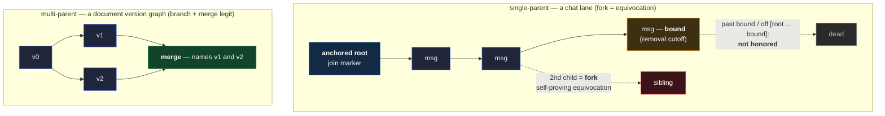

# Authored DAG — a multi-writer content graph, attributed by lane

A group's content is written by many members at once and has no central sequencer: a chat's messages
arrive concurrently from every participant; a shared document's versions branch and reconcile as
editors work in parallel. The **authored DAG** is the shared structure both sit on. Content nodes —
each a SAD authored by one member — link into a graph by naming their predecessors, and the graph
carries three things a group needs: **attribution** (which member wrote each node), **order** (a
monotone key along any authored path), and a **fork rule** (what it means when a node has two
successors). Two variants differ in exactly one thing — whether branching is legitimate.

## What it is

Each node is a **SAD** authored by **one member**, linking to the node(s) it follows. The link runs
**backward** — a node names its predecessor(s), never its successors — so the graph grows
append-only and a writer commits only to what already exists. A node carries the writer's
**signature over its own SAID** (riding adjacent, the universal rule), and that signature — verified
against the writer's key-state as of authoring — is what makes the node the writer's. The composing
feature supplies the **currency bound** on that key-state (a chat's witnessed epoch window; a
document version's anchoring position); the DAG itself only requires that a node's authority is its
writer's signature under a key-state that was **current when the node was authored**, never a
since-retired one.

## Attribution is the lane, not a field

A node carries **no "sender" field**. Attribution rides the **lane** (single-parent) or **branch**
(multi-parent): the writer is named **only where a path roots**, and every later node **inherits**
it through the backward link. A chat lane roots at a body-less **join marker** that names the
writing device (its `previous` absent); a document version roots on the editor its custody names. A
reader following the links to a node's root learns the writer, derives whatever per-writer material
it needs (a chat lane's decryption subkey), and verifies the node's signature against that writer's
key. Naming the writer once, at the root, is deliberate: it never lets a mid-graph node **claim** a
different author than the path it descends from, and it never duplicates what the structure already
says.

## Order — monotonicity along an authored path

The DAG has an **ordering key** — a value that must be **non-decreasing along any authored path**
(from a node to any of its descendants). For a chat lane it is the pair `(epoch, timestamp)`: a
message may not sit in an earlier group-key epoch than the message it follows, nor carry an earlier
timestamp. For a document it is the version order the DAG expresses directly.

Monotonicity is what stops **backdating by appending**. Without it, a member could append to the tip
of its own lane a message stamped months ago and it would read as authored then. With it, a
tip-append carrying a stamp earlier than the tip's is **malformed** — rejected on the same footing
as a broken signature. The only way left to inject a backdated node is to **fork** — attach it not
at the tip but as a second child of an earlier node — which the fork rule turns into a **detectable,
self-proving act** rather than a silent one.

## The two variants — the fork rule is the whole difference

### Single-parent — a lane (chat)

Each node names **exactly one** predecessor. A **second child of any node is a fork**: the writer
signed two conflicting successors to the same point in its own history — self-proving
**equivocation**. A reader that sees two signed children of one node holds **undeniable evidence**
of a **same-writer fork**: each node's **content-addressed SAID** commits its content and carries
the writer's signature, so the two are provably the same writer's successors — no ordering
ambiguity, no way to pass a fork off as one node. Whether the fork is **misbehavior** is the group's
policy, not automatic: a crash-**resend** of a minted node carries the _same_ SAID (a dedup, not a
sibling), but a writer that crashes before persisting its record and re-authors the text draws a
**fresh** mandatory nonce → a genuine same-text sibling, an **honest** fork. The undeniability holds
either way; the consequence is the policy's call. **Surfacing** it needs the two siblings to reach a
common honest reader — which rides **propagation**, not witnessing: a chat lane is unwitnessed, and
two _version_ siblings anchor at distinct editor-IEL positions with no shared witnessed
`(prefix, serial)`, so no receipt beacon fires on the pair either. An eclipse or a split delivery
only **defers** detection — the standard _detection-is-eventual_ residual, never a way to hide the
fork permanently. (A document's multi-parent forks are legitimate anyway — this is
tips-completeness, availability-bounded, not an anti-equivocation gate.) The group's policy decides
the consequence (for chat, coupled to removal + the epoch turn).

**One lane per writer is enforced, not derived — the root is anchored.** Single-parent linking alone
yields a **forest**: a writer can mint a second parentless **root** (a disjoint lane), and the fork
rule never fires on it — two roots share no parent, so neither is a "second child" of the other. And
unlike a fork, two roots are **not self-proving**: a fork is undeniable from the two siblings and
their shared parent alone, but two roots are just two validly-signed lanes, with nothing intrinsic
marking which is the writer's real one. So the composing feature **anchors the root** — for chat, a
writing device's lane root is a body-less **join marker** it mints (with its device key alone),
registered by a `chat-membership` grant-chain act ([membership](membership.md)) — and a verifier
honors only the lane rooted there; an **unanchored root is rejected** data-locally. That is what
makes "one lane per writer" a rule rather than a hope, and it is what closes a removed member's
fresh-root backdate (below).

### Multi-parent — a version graph (shared documents)

A node may name **several** predecessors, and branching is **legitimate by design**: two editors
working from the same version produce concurrent branches, and a later version **merges** them by
naming both as ancestors. Here a node with two children is not misbehavior — it is exactly the
concurrency the feature exists to support; a **merge** reconciles the branches. Monotonicity still
holds (version order rises from any ancestor to any descendant), and attribution is still per-branch
(each version is its editor's, custody-attributed). What differs is only that "two successors"
carries no equivocation charge — divergence is the point, and merge is the resolution.

The two variants share everything else: append-only backward links, per-writer attribution by root,
monotone order, signature-bound authority under a current key-state. A feature picks the variant its
content model needs — a lane where one legitimate successor is the rule, a version graph where
divergence is.

Both link backward and hold monotone order; the whole difference is the fork rule — on a lane a
second child is undeniable equivocation, on a version graph it is the concurrency a later **merge**
reconciles. The lane's honored history is exactly `[anchored root … bound]`; anything a removed
writer signs off that interval is not honored.

## What this leaves standing (and to whom)

- **Backdating shrinks to a detectable act; a removed writer's reach shrinks to an interval.** When
  a **current** writer's tip is **past** the target point, monotonicity forces a backdate to **fork
  its own lane** — a self-signed equivocation. On a live lane the DAG **detects** the fork
  (self-proving); _which_ branch counts is **reported, and the group's policy decides**, because no
  on-chain fact picks a winner (detection is immediate on a witnessed node,
  eventual-but-not-hideable on an unwitnessed chat lane). A **removed** writer — still holding a
  retired key — is closed **structurally** instead, because its removal left an **on-chain fact**: a
  chat `chat-membership` rescission records a **lane-tip `bound`** (the device's tip at removal) on
  the governing identity's **witnessed** grant chain, so the bound is a **durable witnessed
  commitment** every verifier holds (the gated bound _value_ degrades fail-secure if withheld —
  [membership](membership.md)). The device's honored history is then exactly the `previous`-chain
  from the `bound` back to the **anchored root** — `[root … bound]` — and **any node it signs off
  that chain is not honored**: a **forward-append past the bound** (a descendant), a **fork below
  the bound** (a sibling of a node on the chain), and a **fresh parentless root** (a disjoint lane
  the root anchor already rejects) all fall outside the interval. That is a **local interval check
  against the durable `bound`**, not fork detection — the verifier never has to see the offending
  sibling to exclude it, so it neither waits on propagation nor defers to policy. The two brackets —
  the **anchored root** on the way in, the witnessed **`bound`** on the way out — pin the interval
  (to the anchored root alone if the device wrote nothing past it) ([membership](membership.md)).
  The DAG gives monotonicity and fork _detection_; the feature gives the root anchor and the removal
  bound that _resolve_ it. (A **current**, non-removed writer that merely went dormant can still
  forward-append into an epoch it held but was silent for — no bound, valid key — the accepted
  backdate-within-a-held-window residual, confined to its own lane.)
- **Node witnessing is the feature's, not the DAG's.** A document version is **anchored** on its
  editor's identity (custody direct-anchor) and so is witnessed; a chat message is a
  store-and-forward blob and is **not** individually witnessed — its fork detection rests on
  **propagation + signature**, not on receipts. The DAG states the fork rule; each feature states
  how a node reaches readers.

## The boundary — what the authored DAG is not

- **Not who may write.** Whether a writer is a current member — the gate on appending at all — is
  [membership](membership.md); the DAG assumes an authorized writer and structures what it wrote.
- **Not keying or confidentiality.** What a node's body is encrypted under is
  [group-key](group-key.md) and the feature; the DAG carries an opaque, digest-named body like any
  other content.
- **Not delivery.** How nodes reach readers (store-and-forward, the recipient's own nodes) is the
  transport and the feature; the DAG only requires that siblings **do** reach readers, so a fork is
  detectable.
- **Not currency.** Whether the writer's key-state was current when it signed is the
  sender-key-currency mechanism the feature supplies; the DAG requires the property, not the
  mechanism.

## Cross-references

- [`membership.md`](membership.md) — the gate on **who** may append a node; the DAG structures
  **what** an authorized writer wrote.
- [`group-key.md`](group-key.md) — the epoch key a chat lane's bodies are encrypted under; the epoch
  is a chat node's monotone key.
- [`../data/sad/shapes.md`](../data/sad/shapes.md) — the concrete node shapes: the chat **message**
  (the single-parent lane) and the document **version** (`ancestors[]`, the multi-parent graph).
- [`../data/sad/custody.md`](../data/sad/custody.md) — the direct-anchor that witnesses a
  multi-parent document version and attributes it to its editor.
- [`../../features/exchange.md`](../../features/exchange.md) — the chat lane instance
  (single-parent).
