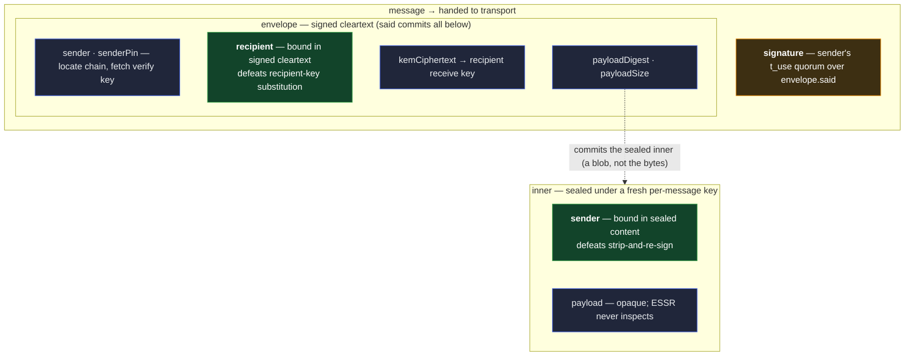

# ESSR — the sealed, authenticated one-to-one envelope

ESSR is the one-to-one secure envelope. Given a sender, a recipient, and a payload, it produces one
message that **only the recipient can read** and that is **provably from the sender** — resisting
both an attacker who has compromised a key and an attacker who tries to pass off a message as the
sender's. The name records the construction: **encrypt** so the **sender** rides inside, **sign** so
the **receiver** rides in the clear.

It is **thin**. ESSR holds no key material, reads no chain, and does not inspect the payload it
seals. Turning a prefix into a key, checking whether a sender's key is still current, delivering the
message, hiding who is talking to whom, keying a group — none of those are ESSR. They belong to the
[exchange](../../features/exchange.md) feature or to whoever calls ESSR. That narrowness is what
lets [credentials](../../features/credentials.md) and the [presentation exchange](ipex.md) seal a
message at the edge without dragging a feature's machinery along.

## What ESSR guarantees

ESSR gives one-to-one messaging four properties at once. Reading them needs two distinctions:
**who** might forge — an outside party, or the recipient itself — and **what** they might forge —
the payload the sender is made to appear to have written, or the ciphertext attributed to the
sender.

- **No outsider can forge the payload.** No third party can produce a message that verifies as the
  sender's while carrying a payload the sender never wrote.
- **No outsider can forge the ciphertext.** No third party can produce a _ciphertext_ that verifies
  as the sender's. Anyone may seal a message to the recipient — sealing to a public receive key is a
  public operation — but not one authenticated as coming from the sender.
- **The recipient cannot forge the ciphertext.** A dishonest recipient holds none of the sender's
  signing keys, so it cannot mint a new ciphertext that verifies as the sender's. This property
  holds from signing the message alone.
- **The recipient cannot forge the payload.** A dishonest recipient cannot make the sender's message
  appear to carry a payload the sender never wrote. This is the property the two identity bindings
  add, and it needs **both** of them. Binding the recipient in the signed cleartext defeats a
  **recipient-key substitution** — an attacker re-addressing the message to a key it controls, so it
  opens for the attacker while the sender's signature still seems to vouch for that delivery;
  because the recipient is signed, the message must open under the named recipient's key, or the
  signature does not verify. Binding the sender inside the sealed content defeats a
  **strip-and-re-sign** — a re-signed envelope naming a different sender fails the check that the
  sender named inside matches the sender who signed. The first three properties hold from
  encrypt-then-sign alone; this fourth is what the ESSR shape buys.

## Why the shape is load-bearing

Strong one-to-one messaging needs confidentiality (seal to the recipient) and authenticity (sign by
the sender) at once. Neither the order nor where each identity sits is cosmetic.

- **Signing only the sealed bytes is not enough.** A dishonest recipient — or anyone who intercepts
  the message — can strip the signature and re-sign the same sealed bytes under a different key,
  making it appear the sender composed that message for a party it never did.
- **ESSR closes this with two bindings.** The **sender's identity rides inside the sealed content**,
  and the **recipient's identity rides in the signed cleartext**. The first stops the
  strip-and-re-sign; the second makes any substitution of the recipient's key detectable — the
  message must open under the intended recipient's key, or the signature is invalid.



**One strengthening from naming parties by chain.** Because the sender and recipient are named by
their IEL prefixes, with keys looked up from their logs, a dishonest recipient cannot substitute an
arbitrary key — only a key that actually appears in its own chain, at worst a stale one. Naming
identities by prefix makes the recipient-key binding harder to attack than naming a raw key would.

## The construction

We use the **full** ESSR message — no binding omitted, no guarantee traded away.

**The confidential inner** (sealed; ESSR defines only the sender binding, the rest is opaque):

```
inner = {
  said,
  kind,       // vdti/essr/v1/schemas/inner
  sender,     // the sender's IEL prefix — the binding that rides INSIDE the sealed content
  payload,    // opaque application bytes — ESSR never inspects them
}
```

**The signed envelope** (cleartext; only what ESSR structurally needs):

```
envelope = {
  said,               // commits every field below; the signature is over this
  kind,               // vdti/essr/v1/schemas/envelope
  sender,             // the sender's IEL prefix — cleartext: locates the chain, routes, fetches the verify key
  senderPin,          // SAID of the sender's IEL key-state position at signing — the roster + t_use threshold that verifies the signature
  recipient,          // the recipient's IEL prefix — bound by the signature; the transport also routes on it
  kemCiphertext,      // key-encapsulation to the recipient's receive key — small, inline (derives the sealing key)
  payloadDigest,      // commitment to the sealed inner (the encrypted payload) — a content-addressed blob, never the bytes
  payloadSize,        // the encrypted payload's byte length
  nonce,              // sealing nonce — fresh random; a per-message key means single use
}
```

**The signed message** (handed to transport):

```
message = {
  said,
  kind,        // vdti/essr/v1/schemas/message
  envelope,    // the SAD above
  signature,   // the sender's t_use quorum over envelope.said, riding adjacent
}
```

**To seal:** encapsulate to the recipient's receive key → a shared secret → derive a sealing key
(domain-separation context `vdti/essr/v1/protocols/kdf`) → seal `inner` under a fresh nonce → the
envelope commits that sealed inner by **`payloadDigest`** (+ `payloadSize`), the caller holding
those bytes as a content-addressed blob → assemble `envelope` and compute its `said` → sign that
`said`.

**To open:** **recompute `envelope.said` from the envelope fields and reject on any mismatch** — the
ordinary SAD check, and what makes the signature (which is over `said`) bind every field → verify
the signature over `said` against the sender's `t_use` key-state, resolved by the caller from
`sender` + `senderPin` (ESSR does no lookup — see the boundary) → **assert `recipient` is the
opener's own prefix** → decapsulate → derive the sealing key → **take the sealed-inner bytes the
caller fetched by `payloadDigest` and check their digest matches** → open the inner → **assert
`inner.sender == envelope.sender`**.

Only `envelope.said` is signed, so only its recompute gates trust. `inner.said` and `message.said`
are ordinary self-addresses, present by the universal [SAD](../data/sad/sad.md) rule — the sealed
inner rides as a **content-addressed blob** the signed envelope commits by `payloadDigest`, so its
bytes are protected by the sealing tag **and** the envelope signature, and the message by the
envelope signature; none is separately load-bearing.

**The sender signs with a quorum.** A `sender` is an IEL prefix — an identity that is a threshold
over its member devices, not a single key — so the signature is the sender's `t_use` quorum (signing
a message is a use act), exactly as a presentation's is ([`ipex.md`](ipex.md)). ESSR stays agnostic
to this: the caller's signing capability produces the quorum signature, and the caller's resolver
returns the key-state that `senderPin` names.

**Crypto by what it is** (the strength tier is a parameter, not a separate code path): a **key
encapsulation mechanism** and a **signature scheme**, both lattice-based and post-quantum, an
authenticated cipher, and a key-derivation function. Everyday clients may run the lighter tier;
infrastructure runs the heavier one. The construction does not depend on which — only that the
pieces are of these kinds.

**Why the sender appears twice — by design.** The sender prefix sits inside the sealed content (the
binding that defeats impersonation) **and** in the cleartext envelope (so the transport can route
and the recipient can fetch the right verify key). This is the full-ESSR baseline, not redundancy.
The recipient prefix sits in the signed cleartext for its binding and for routing.

**Why the nonce is safe.** Each message derives a **fresh** shared secret, hence a **fresh** sealing
key used **exactly once** — so a random nonce never repeats under a key. No cross-message nonce
discipline is needed; the key is per-message.

## The boundary — what ESSR is not

ESSR is deliberately narrow. Everything below sits **outside** it:

- **Payload contents.** ESSR seals opaque bytes. A timestamp, a protocol or topic label, the content
  itself — all shaped by the **application**, inside `payload`, confidential and signed. ESSR
  neither defines nor inspects them.
- **Key resolution.** Turning `recipient` into a receive key is the
  [**receive-key directory**](receive-key-directory.md) lookup — an identity's published device
  keys, resolved through a lookup log its identity owns; turning `sender` into a verify key is the
  caller's chain read. ESSR is handed the keys.
- **Sender-key currency.** Whether `senderPin`'s key state is still current and trusted, or has been
  superseded, is the **caller's** check against the sender's current witnessed chain. ESSR only
  needs the pin to verify the signature at all.
- **Identity hiding.** The sender and recipient prefixes are visible on a held message. Hiding them
  is **nested routing** — an outer message whose confidential payload is itself an ESSR message — a
  feature concern, not the primitive.
- **Delivery and the serve-time gate.** Storing and routing the opaque message, and gating delivery
  on a **live check that you control the recipient prefix** before the store serves you, are the
  mail feature's — they limit store-side harvesting even though the prefix is on the message.
- **Group keying.** Sealing an epoch key to many members, ratcheting, per-sender subkeys — the
  [group-key primitive](group-key.md), which both the exchange and shared-documents features
  compose, built atop this one-to-one primitive.
- **Replay.** A sealed message can be re-delivered verbatim; ESSR does not detect that. Replay
  defence is the consumer's (the [presentation-freshness](ipex.md) cache, or a mail dedup window).
  The fresh nonce buys key-uniqueness, not replay resistance.

**Keys enter through capabilities, not raw material.** ESSR is defined over what you can _do_ with a
key — a signing capability on the sender side, a decapsulation capability on the recipient side — so
it holds no private key and does not care where keys live (a hardware token, an enclave, memory).
Public material — the recipient's receive key, the sender's verify key, the prefixes — is passed as
values or fetched by a resolver the caller supplies.

## Credit and prior art

ESSR is prior work VDTI adopts, adapts to its identity model, and credits.

- The construction is **Jee Hea An's** (2001) study of authenticated encryption in the public-key
  setting ([eprint 2001/079](https://eprint.iacr.org/2001/079)), which showed that the generic ways
  of combining encryption and signing do not all meet every authenticity and confidentiality notion,
  and gave the scheme that does — the four properties above are that paper's, stated in plain terms.
- Naming the sender and recipient by their **chain identifiers**, with keys resolved from their logs
  rather than carried in the message, is **Samuel M. Smith's** adaptation in the Trust Spanning
  Protocol ([glossary](https://weboftrust.github.io/WOT-terms/docs/glossary/ESSR),
  [spec](https://trustoverip.github.io/tswg-tsp-specification/)). VDTI's prefix-named form follows
  it.

VDTI takes the full construction over its own post-quantum crypto and its own SAD-and-chain model,
and states the design here in VDTI's own terms.

## Residuals

- **Identity exposure on a held message.** The `sender` and `recipient` prefixes are visible to
  anyone holding the bytes — required for routing and for the recipient binding. Nested routing
  (full hiding) and the serve-time delivery gate (limits harvesting) address it at the feature
  layer; it is not an ESSR concern.
- **Sender-key currency is the caller's.** ESSR verifies the signature against `senderPin`; whether
  that key state is still trusted is checked outside ESSR, against the sender's current witnessed
  chain.

## Cross-references

- [`ipex.md`](ipex.md) — the presentation exchange; a private disclosure is an IPEX message sealed
  inside an ESSR envelope.
- [`../data/sad/sad.md`](../data/sad/sad.md) / [`../data/sad/said.md`](../data/sad/said.md) — the
  SAD layer and the self-addressing digest the envelope's `said` and signature rest on.
- [`../data/sad/shapes.md`](../data/sad/shapes.md) — the field catalogue; the ESSR envelope, inner,
  and message summarized alongside every other SAD shape.
- [`../data/sad/kinds.md`](../data/sad/kinds.md) — the `kind` catalogue and the naming convention
  the `vdti/essr/v1/*` identifiers follow.
- [`../data/event-logs/iel/events.md`](../data/event-logs/iel/events.md) — the IEL an identity's
  `sender` / `recipient` prefix resolves to, and the key state `senderPin` names.
- [`receive-key-directory.md`](receive-key-directory.md) — the directory that resolves a `recipient`
  prefix to its device receive keys, the keys this envelope encapsulates to.
- [`group-key.md`](group-key.md) — the group-key primitive, which composes this one-to-one seal to
  distribute an epoch key to a whole group's devices.
- [`../../features/exchange.md`](../../features/exchange.md) — delivery, the serve-time gate, and
  identity hiding, all built on this primitive.
