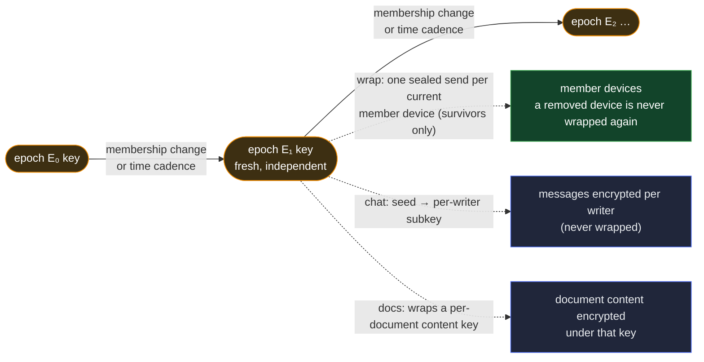

# The group-key primitive — a ratcheting shared key for a group

Group keying gives a bounded set of members a **shared symmetric key** to encrypt under, rotated
forward over time. Both secure messaging (group chat) and shared documents need exactly this, and
neither should own it, so it is its own primitive: the two features **compose** it rather than one
depending on the other.

It builds on the **sealed-send core** — the [sealed envelope](essr.md), the
[receive-key directory](receive-key-directory.md), and transport — the same "deliver sealed bytes to
a device" machinery a one-to-one message uses. What group keying adds on top is the **fan-out to a
whole group**, the **epochs**, and the **ratchet**. It hands its consumers one thing: the **current
epoch key**, openable by every current member's devices. What they encrypt with it is theirs.

## What it distributes

A **fresh, independent symmetric key per epoch** — each generated at random, never derived from the
one before, so learning one epoch's key tells you nothing about any other. The key is distributed by
**wrapping it to each current member's device receive keys**, one wrap per device, through the
sealed-send core. The members' **bulk data — chat messages, document content — is never wrapped**;
it is encrypted once under the epoch key (or a per-writer subkey of it) by the consumer. The wrap
carries only the small key.

The distribution is ordinary key-encapsulation-plus-encryption: encapsulating to a device's key
yields a fresh shared secret and a ciphertext, and the epoch key is sealed under a key derived from
that secret. The group enumerates its **roster** (the members), then each member's device keys (from
that member's [receive-key directory](receive-key-directory.md)), and seals the epoch key to each.
Because the wraps ride the sealed-send core, a device that was **offline** when the epoch turned
picks up its wrap when it reconnects — catch-up on the current key comes for free from
store-and-forward transport.

## The pieces

- **The member roster — a bounded, enumerable, gated set.** The epoch key has to be wrapped to each
  member, so the group must be able to **list** its members — unlike a [membership](membership.md)
  set (the per-requester authorization primitive), which is deliberately unbounded and never
  materialized. This roster is **not** the membership set: a keyed group composes **both** — this
  bounded roster to distribute the key, and a membership instance to authorize a requester — because
  wrapping a key forces enumeration where authorizing one requester does not. So the roster is
  **bounded** and **enumerable**, but still **gated**: member entries ride read-gated opaque
  references, so members can materialize the set to build the wraps while onlookers see only opaque
  anchors, never who is in the group. Membership changes are a **tier-2, reserve-backed** act
  (`Gnt ← Ath`, `t_authorize`), so a stolen signing key can neither add nor remove a member, and a
  removed member cannot re-admit itself. Members are **people** (identities), and a person's device
  keys live in that person's own receive-key directory, so the group never controls a member's key.
- **The key-epoch log — one fresh key per epoch.** A single-owner log — owned by the group's
  **governing identity** (as is the roster) — advances one independent symmetric key per epoch; each
  epoch's event references the per-device wraps for that epoch, and a device opens its own with its
  hardware receive key. Because each epoch's key is independent, compromising one exposes only that
  epoch.
- **The wraps are member-delivered, never published.** Each wrap names its recipient in the clear
  (to route it and to resist key-confusion), so the set of wraps would **enumerate the devices** to
  anyone holding it. The wraps are therefore delivered member-to-member and **never served to the
  shared store or the witnesses** — the same discipline a private credential body follows — so the
  key-epoch event leaks only the **count** of wraps (a bounded number), never who. That is what
  keeps the membership blind to onlookers; the gated roster alone would not, since the wraps would
  otherwise re-expose it.
- **The ratchet — the epoch turns on either trigger, whichever is first.**
  - **A membership change** — an add or a remove seals a **fresh** epoch to the new set. A removal
    gives **forward secrecy** (the removed member cannot open new epochs); a joiner **cannot read
    past epochs** (their keys were never wrapped to it, and epochs are independent). A removal
    installs the new epoch at once, and a retired-epoch message **stamped outside that epoch's
    witnessed window** (as current, past the removal) is rejected by the sender-key-currency
    epoch-window check ([exchange](../../features/exchange.md)), so a lagging sender cannot pass a
    just-removed member off as currently readable — while **in-window** late history a member
    authored while it legitimately held the epoch is the accepted backdate-within-a-held-window
    residual, not this rejection. The further residual: a message a lagging sender emits under the
    retired epoch **before** it sees the removal is still readable by the removed member — bounded
    by how fast senders observe the change. Because the wrap roster and the authorizing membership
    instance are **two structures** (§The pieces), a removal must reach both — and no authoring-side
    rule ties the two acts together (the chain layer cannot pair them; an anchor is opaque to it).
    What keeps them in lockstep is a **derivation rule**: an epoch's wrap set is the roster **minus
    every member the membership instance has rescinded**, both read as of the epoch's own anchoring
    position — data-local, checkable by any member, so an epoch wrapped to a rescinded member is a
    **visible violation**, never silent drift — and a consumer reads a member as **removed the
    instant either structure records it**. A partial or lagging state therefore costs availability,
    or a bounded window of fetching ciphertext the member can no longer decrypt — never a key.
    Authoring both changes together is good hygiene that shrinks the window; nothing depends on it.
  - **A time cadence** — after a set interval, the epoch turns even with stable membership, so a
    compromised epoch key exposes only that window.
- **Checkpoints keep verification bounded.** A long-lived group accrues a great many epoch events on
  one log, which a cold verifier would otherwise walk end to end. The primitive **re-incepts a fresh
  key-epoch log every so often** (chained to its predecessor), so a cold verifier walks only a
  bounded tail.

Each epoch's key is **independent** (never derived from the last), so learning one reveals no other;
a removal gives forward secrecy and a joiner cannot read past epochs.

## Hardware, compromise, and the two axes

A wrap targets a device's receive key, and every such key is **held in hardware** — a secure element
whose private half never leaves it, with no software-key path (the
[receive-key directory](receive-key-directory.md) holds that rule). Three things follow:

- **Removal locks a device out by exclusion, not by hardware.** When the epoch turns, the next key
  is wrapped **only to the survivors**, and epochs are independent — so a removed device is simply
  never wrapped to again and can open nothing after its removal. This holds whether the key was
  hardware or software; removal is what does it.
- **Hardware bounds a still-a-member compromise to live access.** While a compromised device is
  **still in the group**, each new epoch _is_ wrapped to it — but its receive key is
  non-extractable, so an attacker can open a new epoch **only while it holds the device live**; it
  cannot walk off with the key and open future epochs offline. (A software key could be copied and
  then open every epoch during membership, offline — which is why hardware is required.) That is
  what gives the time cadence its teeth against a quiet, persistent compromise.
- **A device compromise is a confidentiality loss, never a control loss.** What a compromised device
  can read is bounded — by non-extractability, the ratchet, and re-key on removal — and it **cannot
  take over the member's identity**, which is a governance act a single device's key cannot reach.
  (The exception is a single-device identity: its one device is the whole governance quorum, so a
  full compromise there is a control loss — an authority-bearing identity needs at least three
  devices, so its survivors can evict a compromised one.)

The epoch key never needs to sit on disk in the clear: its at-rest form is the wrap on the key-epoch
log, opened on demand by the hardware key. The unavoidable floor — a live, fully-compromised device
reads its own in-use plaintext — is a property of every endpoint, not of group keying, and the
ratchet is what bounds it.

## Using the epoch key

The primitive hands the consumer the current epoch key. What is encrypted with it is the consumer's,
with **one discipline the primitive states because it is easy to get wrong**: a shared key has
**many concurrent writers**, so a naive per-message counter or nonce collides across them —
catastrophic for the authenticated cipher. Each writer therefore encrypts under its **own derived
subkey**, keyed on the writing device, so two devices are distinct writers and each is a single
writer of its own subkey; its per-message nonce cannot collide with another's. The epoch key is a
**seed**, never used to encrypt directly. A subkey authenticates no one — every member can derive
every member's subkey — so it is only a nonce-partitioning device; **authenticity is the writer's
own signature**.

The two consumers build the rest their own way:

- **Group chat** — messages are **per-writer lanes** (each device's messages its own linked chain,
  merged into the group view): the lane _is_ the writer, so no sender field is carried mid-lane (the
  consuming feature roots a lane at its anchored join marker). A receiver reads which lane a message
  sits on, derives that lane's subkey to open it, and verifies the writer's signature. The epoch key
  proves only "a group member"; the signature proves _which_.
- **Shared-document content** — a per-document content key is wrapped under the epoch key, and
  members open and decrypt the document.

## The boundary — what group keying is not

- **The one-to-one seal** — the [sealed envelope](essr.md); the primitive calls it, does not define
  it.
- **Reaching a member's devices** — the fan-out and the
  [receive-key directory](receive-key-directory.md) it reads; group keying wraps to whatever the
  directory resolves.
- **Bulk encryption, message structure, per-message signatures, delivery** — the consuming
  feature's.
- **Who is admitted or removed, under what authority** — a governance act the feature or app drives;
  the primitive consumes the resulting roster.
- **Authorizing a single requester** — the unbounded, per-requester [membership](membership.md)
  check a keyed feature also composes; this primitive only wraps the key to the bounded roster.
- **The one-to-one degenerate case, and re-obtaining missed past-epoch history** — consumer
  concerns.

## Residuals

- **A lagging sender's last retired-epoch message** stays readable by a just-removed member until
  senders observe the removal — bounded by that observation delay, not removable after the fact.
- **The membership count leaks.** The key-epoch event reveals how many wraps there are — a bounded
  number — though never who.
- **The endpoint floor.** A live, fully-compromised member device reads its own in-use plaintext;
  hardware and the ratchet bound the blast radius, but no key management closes an endpoint that is
  compromised while in use.

## Cross-references

- [`essr.md`](essr.md) — the one-to-one seal each wrap is built from.
- [`membership.md`](membership.md) — the separate, unbounded per-requester authorization a keyed
  group also composes; this roster is the bounded cap, not that set.
- [`receive-key-directory.md`](receive-key-directory.md) — the device receive keys the fan-out wraps
  to.
- [`../data/event-logs/sel/log.md`](../data/event-logs/sel/log.md) — the single-owner logs the
  roster and the key epochs ride.
- [`../data/sad/kinds.md`](../data/sad/kinds.md) — where the group-key topics, the epoch-key grant,
  and the subkey derivation context are catalogued.
