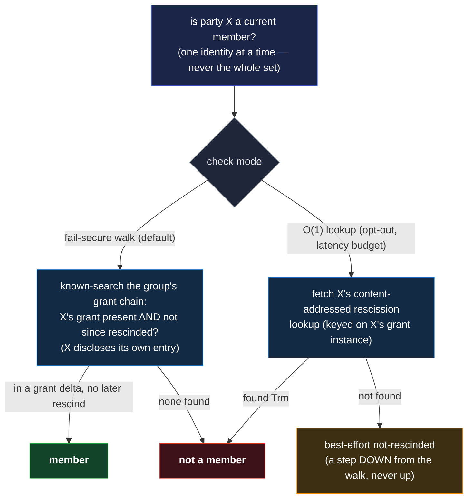

# Membership — a gated set of identities, checked one at a time

**Membership** answers one question, for one identity at a time: **is this party a current member of
this group?** A chat asks it to gate who may deposit and drain messages; a shared document asks it
to gate who may read or write. It is deliberately **not** a list you can read off — the set has **no
cap**, and no party ever holds it whole. You bring the identity you care about and check _that one_.

Membership is the **authorization** half of a group. It is not the keying half: handing a member a
shared decryption key means wrapping that key to each member, which forces enumerating them — a
**bounded** act that belongs to [group-key](group-key.md), not here. Membership stays unbounded
because it never enumerates.

## The grant chain

A group's membership lives on a **grant chain** the group's governing identity owns. Each event on
it seals a **membership delta** — `{ grants, rescinds }`:

- **`grants`** — identities admitted, each as a **blinded per-member commitment** — the same
  **nonce-blinded claim construction** [credentials](../../features/credentials.md) use for
  per-predicate gating (a SAD carrying its own `kind`, blinded by a `nonce`; each membership
  instance registers its **own** entry kind, shown in that feature's shapes): the commitment names
  the member without publishing who, so an onlooker reading the chain learns a count, never a
  roster. A grant-chain event may also carry a **feature lane anchor** — for chat, a writing
  **device's lane root** (below), anchored on-demand — the companion to the `rescinds` `bound`.
- **`rescinds`** — identities removed, each a **blinded `target`** (derived from the member's grant
  instance — the same no-guessing rationale as the O(1) address; a raw-prefix target would leak
  removal-status to a guessing onlooker on the chain), optionally carrying a **grandfather
  boundary** (below).

A membership change is one such delta. There is no separate "add" and "remove" event — one delta
carries both, the way an identity's own roster change carries adds and cuts together. One delta's
`grants` list is capped at **`MAXIMUM_GRANT_ADDS = 64`** — the verifier accumulates the event's adds
and bails the instant it breaches. Every instance inherits this bound — the three
`document-*-membership` sets and `chat-membership` alike. The **membership set itself stays
uncapped** (§No cap, no enumeration): the bound is per-delta verifier work, never set size.

## Checking one member — the two modes credentials already use

Membership reuses the credential **accept** shape wholesale: a party is a current member iff its
**grant is validly recorded and not since rescinded**. That check runs in either of two modes, the
same fail-secure / fail-open split a credential's revocation check uses:

- **The fail-secure walk (default).** Walk the group's grant chain with the party as a **known
  search** — you are looking for exactly this identity's grant, and for any later rescind of it —
  against the multi-source-fresh chain. In some grant delta and not since rescinded → a member; in
  none → not. This is the sound reading: hiding a rescind would take a stale chain, which the
  freshness bar already refuses. For this to stay the **default**, the non-member store must be able
  to **run** it — and it can, because the requester **discloses its own entry's content** (the
  `nonce` included) in the live-signed request (the same disclosure a credential holder makes): the
  store recomputes the member's blinded-claim `said` and matches it on the grant chain — **and
  checks the disclosed `data` names the identity the request's live signature resolves to** (a
  disclosure naming any other identity is refused, so a leaked disclosure is **not** a bearer token
  — it leaks only status-checkability, the accepted confirm-a-known-subject class). So the
  commitment stays **unguessable to an outsider** (the high-entropy `nonce` — no
  confirm-a-guessed-prefix oracle) yet **store-checkable** (the requester carries its own secret,
  the way a credential disclosure does). What the walk must **not** rest on is a secret the
  requester does **not** hold — that would make it non-performable and silently force the fail-open
  path.
- **The O(1) happy path (opt-out).** A rescinded member has a **content-addressed rescission
  lookup** — a tiny `{ inception, termination }` log derived from
  `{ group, the rescission topic, the member's grant instance }` (a **feature-defined identifier
  built on the member's high-entropy blinded-claim `said`** — shared documents key per period on
  `hash(G : said_b)` — never the bare prefix: a raw-prefix address would be a
  confirm-a-guessed-removal oracle, reopening for removals exactly what the grant-side `nonce`
  closes for admissions; keyed on the grant instance, the address is no more guessable than the
  grant it locates) — whose **termination `Trm` records the removal** and carries the lane-tip
  **`bound` on the `Trm`'s `bound` role** (a gated rescind-doc — the same carrier a document-member
  rescission uses), so the verifier reads both the removal and its cutoff from the `Trm` itself, no
  cross-SEL pin. Fetch it: **found → rescinded**, no walk. The grant side is symmetric — a member's
  grant is located directly by its own pin. A consumer under a latency budget opts down to this;
  **not-found reads best-effort not-rescinded**, so it is a deliberate step down from the walk,
  never a step up.

Both modes check **one identity at a time**. Neither ever builds the set.

## No cap, no enumeration

The set is **unbounded** — a document may be readable by an open-ended audience — so it is **never
materialized**. Every operation is a check against a **known** identity: the store gates a deposit
or a fetch by the **requester**, which presents itself, so the store confirms that one party's
membership and nothing else. There is no operation that asks "who are all the members," because the
answer has no bound and no party is entitled to it. This is what lets a downloader of the chain
learn only a count, and what keeps the check cheap regardless of how large the audience grows.

Where a group genuinely must reach every member — wrapping a shared key — that enumeration is
[group-key](group-key.md)'s **bounded wrap roster**, a separate structure. Membership never does it.

## Rescission and the grandfather boundary

Removing a member is a `rescinds` entry `{ target, bound? }` — the same shape as a `kills` entry — a
blinded `target` and an optional grandfather `bound`. The `bound` is what a **verifier** enforces,
so a removed member is cut at a **provable** point, not just refused live by the untrusted store.
What it points to is the feature's:

- **Chat — each writing device's lane is bracketed `[anchored root … bound]`.** Reading and writing
  gate differently: the store's per-requester check gates **reading and deposit** at the
  **identity** level (any of a member's devices proves it), while **writing** is per **device** — a
  lane _is_ a device (its subkey is keyed on the device prefix), so only a device that actually
  writes needs an anchored lane, and a member's read-only devices anchor nothing. **Anchoring the
  root:** a writing device's lane root is a **body-less join marker** it mints with its **device key
  alone** (no epoch key — which it does not yet hold at admission), and a **governing grant-chain
  act anchors that marker's SAID** — at admission if the device is already known to write (one
  event), else a later act when the device first writes (**on-demand**). The verifier honors only
  the lane rooted at the anchored marker and rejects any **fresh parentless root** a device mints
  outside it — a removed member cannot fabricate a second lane, because the fork rule never fires
  across two roots (they share no parent) and two roots are not self-proving, so the anchor is the
  fact that distinguishes the real one — and **two** anchored markers for one device within one
  membership period is itself malformed (the verifier honors **neither**, fail-secure), so even a
  colluding governing identity cannot mint two clean parallel lanes for a writer. Anchoring **must**
  be the governing grant-chain act, never a member self-attestation: a removed member still controls
  its own devices, so a self-anchor would reopen the fresh-lane hole. **Removal records a `bound`**
  per anchored device lane = that device's **last message** (or the **anchored marker itself** if
  the device wrote nothing past it — a member with several writing devices carries one bound per
  lane, the singular `rescinds` `bound?` generalizing to a per-lane list on the rescission `Trm`'s
  `bound` role, and the grant-chain entry and that `Trm` role must **agree**, the `Trm`'s the cut
  the verifier enforces); the verifier honors exactly the `bound`'s **ancestor-chain** — the
  `previous`-path from the `bound` back to the anchored marker — and honors **no** node off it: a
  **forward-append past the bound** (a descendant) or a **fork below the bound** (a sibling of an
  on-chain node) alike falls outside `[root … bound]`. This is a **local interval check against the
  durable on-chain `bound`**, not fork detection — the verifier never has to see the offending
  sibling, so it neither waits on propagation nor defers to policy; it closes both the removed
  member's monotone forward-append and a fork below the bound into a **retired** epoch it held. For
  chat the `bound` is **required** on every rescind, and a missing or unresolvable `bound` reads
  **fail-secure** (honor the anchored marker only, nothing past it); likewise a walk that cannot
  reach the marker (a withheld interior lane node) honors **nothing below the gap** — the check is
  positive placement, so missing bytes only **shrink** the honored set, never extend it. The **epoch
  turning** gives forward secrecy for **new** epochs; the **anchor + bound** pin each device's
  honored history to `[root … bound]` — the three together, not the store's deposit check, bind it.
  A **crash at the root** does not brick the lane: the marker is minted before the anchoring act
  (re-mint freely until anchored) and, once anchored, re-fetchable by the SAID the grant chain
  records (its bytes are **retained** on the group's nodes and served under the same
  `chat-membership` gate as any lane message). **Membership periods are disjoint anchored lanes:** a
  re-added member's device anchors a **new** marker, so its later stint is a fresh lane with its own
  bracket, never a continuation past the old bound.
- **Grandfathered** — content the member authored (or was entitled to) **before** the bound stays
  honored, only its reach past the bound is cut. A shared document uses this so a removed editor's
  earlier versions do not retroactively vanish.

The `bound` is blinded when it would otherwise identify a participant (riding behind the read gate);
a non-identifying one rides in the open. Either way the removal is one `rescinds` entry plus, for
the happy path, the member's content-addressed rescission lookup.

## The membership instances

Features name their membership sets on the shared `vdti/{component}/v1/{category}/{name}`
convention, and the instances that exist are parallel:

- **`chat-membership`** — the set a chat's store checks to gate deposit and fetch. Bounded in
  practice (the chat is a keyed group, so group-key already caps it), but checked the same
  one-at-a-time way; the check is per **identity** (any device reads), while each writing **device**
  anchors its own lane on-demand and removal records a per-lane `bound`, so each device's membership
  period is a disjoint bracketed lane (above).
- **`document-edit-membership`** / **`document-comment-membership`** /
  **`document-read-membership`** — a shared document composes **three** plain instances, one per
  role, in an implied hierarchy (edit ⊃ comment ⊃ read); a member's capability is the most powerful
  role it holds, and each group is checked **independently** (no cross-group linkage). Genuinely
  unbounded (an open readership), grandfather-rescinded
  ([shared documents](../../features/shared-documents.md)).

The roles land as those **three instances**; the exact per-instance shapes are the composing
feature's, and membership provides the one checked-set mechanism all sit on.

## The cap is keying's, not membership's

The reason chat feels "limited" and an open document does not is **not** a property of membership —
it is a property of **key distribution**:

- A feature that hands members a **shared decryption key** must wrap it to each of them, which means
  enumerating them → a **bounded** roster ([group-key](group-key.md)). Chat, and any encrypted
  shared document behind a shared key, are capped for this reason.
- A feature that encrypts nothing — or delivers content **per request**, sealed to the one member
  who asks — never enumerates, so its membership stays **unbounded**.

So a **keyed** feature composes **both** — group-key's bounded wrap roster (to distribute the key)
and a membership instance (to authorize a requester) — while an **unkeyed** feature composes
**only** membership. The two are different structures with opposite shapes; a feature that needs
both uses both.

## The boundary — what membership is not

- **Not the wrap roster.** Enumerating members to wrap a key is [group-key](group-key.md)'s bounded
  roster. Membership never enumerates.
- **Not a policy.** Membership answers "is this one identity in the set," a single-party lookup —
  not a multi-party expression evaluated live. Document authorization above it (who may do what) is
  the policy layer's; membership is the set it draws on.
- **Not keying, delivery, or the content structure.** What a group encrypts, how it delivers, and
  how its content threads (the [authored DAG](authored-dag.md)) are the composing feature's;
  membership only says who is in.

## Cross-references

- [`../../features/credentials.md`](../../features/credentials.md) — the grant / blinded-commitment
  and the fail-secure-walk / fail-open-lookup accept shape membership reuses.
- [`group-key.md`](group-key.md) — the bounded wrap roster that distributes a keyed group's shared
  key; the enumeration membership deliberately does not do.
- [`../data/sad/custody.md`](../data/sad/custody.md) — a SAD's `readers` names a membership set: the
  read-authorization pointer into this primitive.
- [`authored-dag.md`](authored-dag.md) — the per-writer content structure a group's messages or
  versions form; membership gates who may append to it.
- [`../data/event-logs/sel/log.md`](../data/event-logs/sel/log.md) — the single-owner log the grant
  chain and the content-addressed rescission lookups ride.
