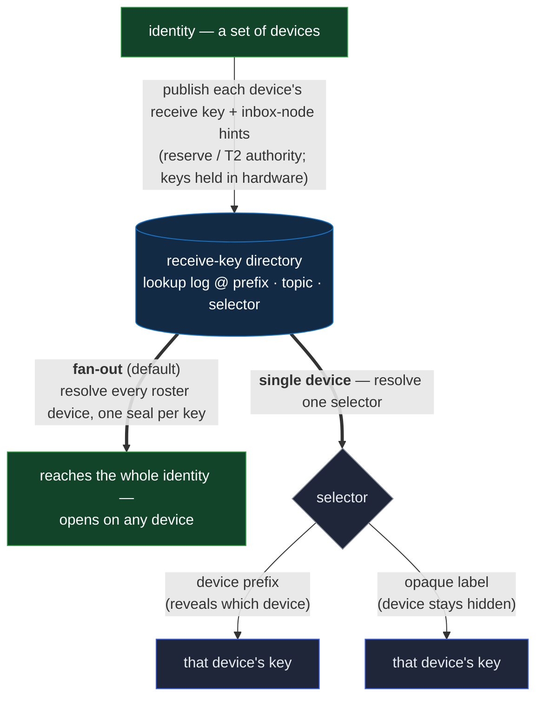

# The receive-key directory — publishing and resolving device keys

Every sealed message needs a key to seal to. The **receive-key directory** is where an identity
publishes the public keys others encrypt to it under, and where a sender looks them up. It is the
small shared piece the [sealed envelope](essr.md), secure messaging, [group keying](group-key.md),
and shared documents all resolve recipients through — none of them defines its own key lookup.

An identity is a set of **devices** — each a key history in the identity's roster. Each device holds
its own key-encapsulation keypair and publishes the public half here, so the directory is a map from
an identity to its devices' receive keys. A device is never its own identity; it is one member of
exactly one — enforced, not assumed: a chain's first act declares the identity it serves, and roster
admission checks it ([the identity bond](../data/event-logs/kel/events.md#the-identity-bond)).

## Publishing a key

An identity publishes each key into a **single-owner lookup log** its own authority governs, at a
**deterministic address** any sender computes from the identity's prefix, the directory's topic, and
a **selector**. Because the address is a function of those inputs, a receive key is meant to be
**found** — a sender who holds the recipient's prefix can reach it with no registry to consult.

The selector is one of two things, and both name **one device's key**:

- the **device's own prefix** — which reveals which device the key belongs to; or
- an **opaque label** — which publishes the same per-device key **without** disclosing the device.

There is deliberately no single "identity-wide" key. One shared key would funnel every message
through one device; instead each device publishes its own, and a sender reaches the whole identity
by fanning out over them (below).

Alongside each published key, the identity publishes **inbox-node hints** — the storage nodes where
a message sealed to that key is deposited — so a sender learns, in one lookup, both the key to seal
to and where to deliver. A recipient lists several nodes for redundancy, and a send deposits to
each. The hints are a **discovery fact**, not a channel: they say _where_ a recipient reads its
mail, so its routing is visible only to its own nodes rather than gossiped federation-wide
([exchange](../../features/exchange.md)).

Publishing — or changing — a key takes the identity's **rotation reserve** — its tier-2 authority,
held apart from the everyday signing key, not the signing key alone. So an attacker who steals a
signing key **cannot** swap the key others seal to and begin reading the identity's mail. Changing a
receive key is always a reserve act, never something a bare signing key can do.

## Hardware, and proving it

A receive key is a **key-encapsulation public key generated and held in hardware** — a secure
element whose private half is **non-extractable** and never leaves the device. There is no
software-key path. Hardware residence is what lets a compromised device be read only while an
attacker holds it live, and lets the group keying lock a removed device out for good — the
[group-key](group-key.md) note carries that reasoning.

Nothing can _force_ a publisher to use hardware: a published key is only bytes, and a verifier
cannot tell from the bytes alone how the private half is stored. A key **may** therefore carry an
**attestation** — a vendor-signed statement binding the public key to a non-extractable private key
on a genuine device. This is never required by the substrate; it is a **policy a counterparty opts
into** when it needs the guarantee — a group that admits only attested keys, say. Keeping
attestation at that edge is deliberate: an attestation chains to a fixed vendor root, and a rootless
system confines that trust to whoever chooses to demand it, rather than baking it into the base.
Attestations that verify offline, without a live challenge, fit a publish-once/verify-by-anyone
directory best.

## Reaching an identity's devices

Because a sender addresses an **identity**, reaching it means reaching **all** its devices. The
default is a **fan-out**: the sender takes the identity's device roster — the same roster a verifier
already builds while walking the identity's chain, so it needs no extra lookup — and resolves each
device's key by its prefix, sealing one envelope per key. The message then opens on any of the
recipient's devices.

A sender that wants a **single** device resolves just that one, at its selector — by the device's
**prefix** if it knows which device it means, or by an **opaque label** if the device is to stay
hidden; either way only that device can open the result. A key published under an opaque label is
reachable _only_ this way — it is not part of the roster-derived fan-out, since the label is
unguessable by design. That is the trade an opaque label makes: device-privacy in exchange for
automatic discoverability, so it serves point-to-point sends rather than fan-out.

An identity's **own** device roster is resolvable by a correspondent this way. A **group's**
membership, which stays hidden from onlookers, is a different thing and a different mechanism.

## Rotating and retiring a key

Rotation stacks a fresh sealed grant onto the log; the lookup serves only the **live** entry, so a
retired key is never handed to a sender. Removing a compromised device's key is the same act, and
because it takes the reserve, a stolen signing key cannot undo it.

A key is retired for good by a terminal kill on its log. A killed key **reads dead**, and a sender
that resolves it **fails closed** rather than sealing to a key the owner has disowned. For that
"fails closed" to hold against a **withholding** node, the kill must declare the **matching
lineaged** `kills[]` target — not just an on-chain `Trm` — else a node missing that lineage's kill
reads the retired key **live** and serves it (the value-lookup lineaged-target discipline,
[`../data/event-logs/sel/verification.md`](../data/event-logs/sel/verification.md)); the directory
is the **first value-lookup to carry this obligation**. That path is for loss of control; ordinary
key changes are rotations, and a disowned key recovers by re-publishing at a fresh lineage.

## The boundary — what the directory is not

- **The seal itself** — the directory hands a sender the recipient's public key; the
  [sealed envelope](essr.md) encapsulates to it. The directory neither seals nor opens anything.
- **Reaching all devices in one operation** — the fan-out and the epoch-key wrap that build on it
  are the caller's and the [group-key](group-key.md) primitive's; the directory only resolves one
  key per selector.
- **Delivery** — the directory publishes **where** a recipient reads its mail (the inbox-node hints
  above, a discovery fact); actually **moving** the bytes there is transport's job. The directory is
  a lookup, not a channel.
- **A device's signing key** — the directory publishes only the encapsulation (receive) key. A
  device's signing key and its identity's authority live in the key and identity logs.
- **Witnesses** — a witness publishes **no** receive key. Its channel is an ephemeral,
  signature-authenticated handshake, so the "who owns the key" question the directory answers does
  not arise for the federation. The directory is a person-identity mechanism.

## Residuals

- **The label is public, and a descriptive one leaks the device.** A selector rides in the open, so
  a descriptive label (`basement-mac`, `personal-iphone`) tells an onlooker **which** device to
  compromise to read a correspondent. Labels must be **opaque** (`primary`, a random string); the
  application enforces the naming. The framework can only warn.
- **Attestation leans on a vendor root.** Requiring attestation imports trust in a device vendor's
  attestation authority. That is why it stays a per-counterparty policy at the edge, never a
  substrate rule — the cost is borne only where someone chooses the guarantee.
- **A receive key's address is discoverable.** Because the address is deterministic, an onlooker
  holding a candidate identity prefix can confirm a key exists at it — the price of being reachable
  without a registry. It confirms a known guess; it does not enumerate.
- **The inbox-node hints are themselves targeting metadata.** Publishing "this identity reads its
  mail on these nodes" is a discovery fact anyone resolving the directory can read, so it also tells
  an observer **where** to watch or pressure to see a correspondent's traffic. That is the cost of
  resolving a recipient's mailbox without gossiping the communication graph federation-wide; the
  hints name storage **location**, never key material, and an identity can list several nodes so no
  single one is the whole picture.

## Cross-references

- [`essr.md`](essr.md) — the sealed envelope that encapsulates to a key this directory resolves.
- [`group-key.md`](group-key.md) — the group-key primitive, which fans out over a member's device
  keys here.
- [`../data/event-logs/sel/log.md`](../data/event-logs/sel/log.md) — the single-owner lookup log a
  published key is sealed into, and how a rotated value stacks while only the live tip is served.
- [`../data/sad/kinds.md`](../data/sad/kinds.md) — where the receive-key grant and the directory's
  topic are catalogued.
