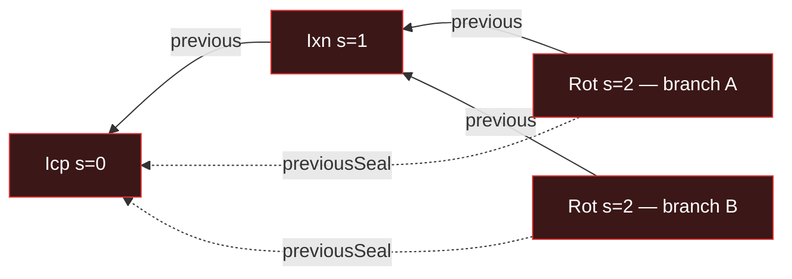
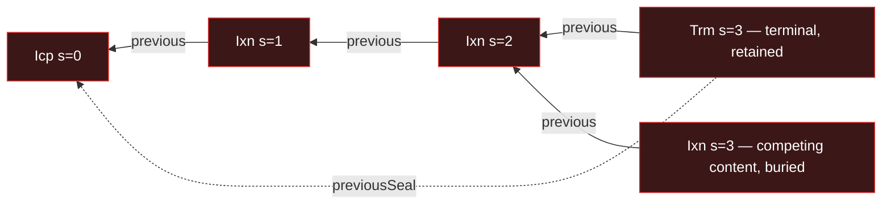
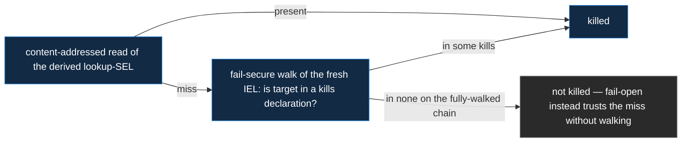

# Protocol Doctrine

The structural rules that govern VDTI — security invariants, cross-cutting doctrines, and
verification mechanics. Each part below is load-bearing for protocol correctness; per-primitive
design docs cross-reference these as the upstream source rather than re-deriving them.

Read [`system-thesis.md`](system-thesis.md) first. The thesis is the framing — adversarial-first
posture, end-verifiability over data-from-any-source, fail-secure default — and points back here for
the structural rules that realize those properties.

> **Reading this before the taxonomy?** This doctrine uses the event **kinds** (`Icp` / `Ixn` /
> `Rot` / `Evl` / `Ath` / `Rev` / `Dth` / `Wit` / `Gnt` / `Trm` / `Sea` / `Fcp` / `Pin`) and
> manifest **fields** (`previousSeal`, `manifest`, `pins`, `federationPin`, `kills[]`, the threshold
> vector) that [`event-shape.md`](primitives/data/event-logs/event-shape.md) defines (read next —
> group 3 in the design-docs reading order). Keep the [glossary](glossary.md)'s kind table open as a
> one-line crib — this doc is the concept map; `event-shape` makes it concrete.

**[Part 1 — Security Invariants](#part-1-security-invariants):**

- [Terminology](#terminology) — locked portion, per-node chain states, cross-chain anchor
  satisfaction.
- [Operation categories](#operation-categories) — serving, consuming, resolving.
- [Compromise is permanent](#compromise-is-permanent) — authority belongs to current state only.
  - [Pin everything to current, floored per chain](#pin-everything-to-current-floored-per-chain)
  - [Tiers](#tiers) — the two-tier capability model
  - [Structural authorization](#structural-authorization) — no policy on chain events
  - [Forks are seal-bounded](#forks-are-seal-bounded)
  - [Divergence and recovery](#divergence-and-recovery)
  - [Kills are sealed; validity bounds are contiguous](#kills-are-sealed-validity-bounds-are-contiguous)
  - [Inception tiers](#inception-tiers)
  - [Terminate and clean retirement](#terminate-and-clean-retirement)
  - [Limit of the doctrine — current-state compromise](#limit-of-the-doctrine--current-state-compromise)

**[Part 2 — Cross-Cutting Doctrines](#part-2-cross-cutting-doctrines):**

- [Ordering without timestamps](#ordering-without-timestamps)
- [Federation convergence](#federation-convergence)
- [Extension discipline](#extension-discipline)

**[Part 3 — Verification Mechanics](#part-3-verification-mechanics):**

- [Verification tokens as proof of verification](#verification-tokens-as-proof-of-verification)
- [Walk semantics](#walk-semantics)
- [Structural problems error; everything else is reported](#structural-problems-error-everything-else-is-reported)
- [Negative checks are positive lookups](#negative-checks-are-positive-lookups)
- [Merge verification and advisory locking](#merge-verification-and-advisory-locking)
- [Federation witnessing in verification](#federation-witnessing-in-verification)
- [Effective-SAID comparison](#effective-said-comparison)

---

## Part 1: Security Invariants

The invariants below are load-bearing for VDTI security. They are stated structurally rather than
statistically: the protocol's safety claims hold _by construction_, not by observation. Verifier
implementations enforce them on every walk; an event or chain state that violates them is rejected
regardless of source.

### Terminology

Structural concepts referenced throughout. Distinct senses; not interchangeable.

- **Sealed / content** (for post-inception events): **content** is tier 1 — `Ixn` (and the SEL's
  floor `Pin`); **sealed** is every non-content kind — tier 2 ([§Tiers](#tiers)). Every
  **non-inception** sealing event advances the seal, and only sealing kinds do
  ([§Forks are Seal-Bounded](#forks-are-seal-bounded)). **Inception is the exception on both
  counts**: an `Icp` / `Fcp` is the spine root (it advances no seal) and may itself be tier 1 (KEL /
  SEL) or tier 2 (IEL) — it never enters fork dispatch, because two distinct inceptions for one
  prefix are impossible by whole-content prefix derivation.
- **Locked**: the portion of a chain before its most recent sealed event. **Within-chain rule** —
  locked events are structurally immutable within their own chain: a recovery cannot bury them, and
  within-chain historical authorizations are not retroactively unsatisfiable. The sealed event
  ratchets the lock forward. On a chain carrying a fork, the locked portion is still read against
  the tracked seal — the most recent seal-advancing event that landed cleanly on the linear chain; a
  seal-advancing event on a competing branch never becomes the lock (it is a sealed fork, and the
  divergence rules read it — see [§Divergence and recovery](#divergence-and-recovery)).
- **Chain states** (per-node — a chain is in exactly one of **four**, each **computed from the
  events a node holds by a data-local walk**, never a stored flag):

  - **Active** — a single confirmed tip; accepts linear extension.
  - **Forked** — a **live, recoverable** fork: two **distinct** events at one serial, with **≤ 1
    sealed branch** past it. While the fork is live (at or above the derived seal) the chain
    **freezes further origination** — it originates no new work onto the live fork; the one move
    that resolves it is a **burying seal-advancer on the winning branch** (a `Rot` / `Wit` / `Trm`
    on the KEL; a sealing event on the IEL — any seal-advancer on the winning branch, typically the
    `Evl` or the `cut` `Evl`; a `Trm` buries then terminates), which extends the winning branch and
    advances the seal past a **content** loser (the loser dies below the new seal, dead on ascent).
    A content fork is recoverable because all content is buriable. The **reading** is the pure walk
    over the events held, not a frozen flag: a node that comes to hold a burying seal-advancer
    re-reads the chain **Active**, order-independently. A lone sealed branch a party did **not**
    author reads Forked node-agnostically, yet still forces **that** party's reincept — an
    **accepted** key-state branch you did not author can never be buried (the reserve-theft
    takeover, below; a seal forged on a _dead_ lineage is a different thing — dead on ascent,
    dropped).
  - **Disputed** — an **irrecoverable** fork: **two accepted seals racing to the same serial**. An
    **accepted sealed branch** is one whose seal is **witnessed at threshold** _and_ whose **lineage
    is accepted** — a branch built on a first-seen loss is **dead on ascent** (you can't seal a
    buried chain) and never counts. Working the cases (a fork on one chain forks _prior_ to its
    seals): a fork with a **single** seal is **recoverable** — the seal buries the content
    competitor (`{seal, content}`); a content fork whose branches seal at **different** serials is
    **also recoverable** — the **earlier** seal buries the other branch **from the fork** (its
    losing fork-sibling locks below the seal, the rest **dead on ascent** — otherwise the fork would
    persist below the seal), so that branch's later seal lands on a buried chain and is dropped. The
    **only** irrecoverable case is **two seals at the same serial**: siblings at one position,
    neither can bury the other, so both stand — which takes a **witness double-sign** at that seal
    position (honest first-seen accepts only one). No sealed branch can be buried (burying a
    rotation would resurrect a retired key), so no single chain can be chosen and the prefix must
    **reincept** — terminal for _everyone_. This is a **branch-level** determination — acceptance is
    a **per-lineage** fact, computed by **any verifier as a data-local walk over the retained
    branches**, not read off a single serial's event count in isolation: a node retains a competing
    branch as non-canonical evidence rather than discarding it (see
    [§Divergence and recovery](#divergence-and-recovery)), so a node holding both sealed branches
    reads Disputed directly, and a node holding only one assembles the others — the witness beacon
    enumerates the competing branch SAIDs, the node fetches and walks them. The federation
    **propagates** the branches; it does **not** decide the verdict.
  - **Terminated** — a terminal `Trm` has landed cleanly (or won a `{Trm, content}` fork on
    tier-rank). Fully terminal: accepts no submission. A `{Trm, content}` fork resolves here — the
    terminal `Trm` is the single sealed branch and wins on tier-rank over the buriable content, the
    same reading as a cleanly-landed `Trm` (the effective SAID is the `Trm`'s own — a resolved fork
    carries no synthetic; [§Divergence and recovery](#divergence-and-recovery)).

  Forked and Disputed are **distinct, detectable states** — the walk that counts sealed branches
  past the fork **is** how they are told apart, not a reading laid over one "divergent" state. A
  `Rev`/`Dth` is **not** terminal (it seals a kill on a _target_, not its host chain, which
  continues), so a `{Rev|Dth, content}` fork is an ordinary Forked one — the `Rev`/`Dth` retained,
  the content buried, recovered like `{Evl, content}`.

- **Cross-chain anchor satisfaction**: whether a document's or upper-layer event's authorization
  still holds is checked against its contributing lower-layer anchors. How a contributing anchor
  becomes non-canonical depends on its **tier**: a tier-1 (`Ixn`) anchor (buriable) drops when a
  later burying seal buries its host; a tier-2 anchor (on a seal-advancing event, durable against
  burial) drops only when it sits **at-or-beyond the divergent serial** on a host chain that becomes
  **Disputed** — a tier-2 anchor below the last clean seal stays anchored. Either way the
  lower-layer verifier reports the SAID as not-anchored on the canonical branch, and the dependent
  answer flips to unsatisfied. Distinct from within-chain state — locked events stay locked within
  their own chains; cross-chain satisfaction is handled by composition redundancy (anchor count
  above the exact threshold).

### Operation Categories

The database cannot be trusted — it may have been altered. All operations on chain data fall into
three categories:

1. **Serving** — returning data to a client or peer. **No verification needed**; the receiver
   verifies what they get. (Read endpoints — effective-SAID lookups, paginated reads — which carry
   their query in the request body, not the address.)
2. **Consuming** — using data for a security decision (anchoring, key extraction, divergence
   routing, merge). **MUST verify the full chain first.** The only way to reach consumed data is
   through that primitive's **verification token** (`KelVerification` / `IelVerification` /
   `SelVerification`), obtainable only via the verifier — so verification and access happen in the
   same pass, eliminating time-of-check-to-time-of-use gaps.
3. **Resolving** — comparing state to decide whether to sync. A wrong answer triggers an unnecessary
   sync (which itself verifies), not a security hole; standalone functions are acceptable here.
   (Effective-SAID comparison, anti-entropy, proactive-rotation prechecks.)

### Compromise is Permanent

The protocol grants authority **only to a chain's current state** (and its most-recent shared
pre-divergence state, where divergence has occurred). Past keys, past members, past delegators —
anything rotated, evicted, or revoked out — has zero structural ability to act. Per primitive:

- **KEL** — a signing or rotation key compromised in the past cannot extend the chain today, even if
  the adversary still holds the key material. A new event requires the **current** key.
- **IEL** — a member evicted via an `Evl` cannot land further acts after their eviction.
- **SEL** — a SEL pins **down** to its owner IEL's current tip; a rotated-out party of that IEL has
  no authority over it.

This closes the **stale-state kill-switch problem**: without it, everyone who ever held authority
over a chain would retain a permanent kill switch. The structural mechanisms that enforce it are the
per-chain forward floor, the seal bound, the tier model, and fresh-participation — below.

#### Pin everything to current, floored per chain

Every event pins its dependencies' **current tips**, and a per-chain **forward-only floor** keeps
those pins from regressing. The floor lives on the chain doing the pinning (intra-chain — there is
no cross-chain clock for ordering). Two distinct backdate mechanisms are closed, and they are kept
separate:

- **Fresh participation closes the deep-member backdate.** A member participates in an IEL event by
  authoring a **fresh KEL event at its own current tip** that commits to that specific IEL event
  (`Ixn → IEL Ixn`, `Rot → IEL Evl`), signed by its **current** key. A rotated-out key cannot
  produce one — a KEL append needs the current key, and an old event already committed to something
  else. There is no detached-signature-resolved-as-of-a-pin path. So a rotated-out member cannot
  retroactively appear to have authorized an IEL event.
- **The forward floor closes the as-of-context backdate.** An event cannot pin an **intra-chain**
  dependency at an old position (an old roster or authority state, judged by the anchoring
  position), because the per-chain floor only moves forward — the monotonicity backstop for the
  as-of pins. The **federation** context is the exception: ordering two federation positions needs a
  cross-chain walk the intra-chain floor cannot do, so for `federationPin` forward-only is
  **emergent, not structural** — a stale or backward federation pin lands chain-valid but
  **un-witnessed** (the currency gate refuses a non-current roster), cleared by pinning forward.

**As-of authority is judged by the anchoring position, never by a self-asserted pin.** A document
carries **no** self-asserted pin; authority-affecting resolution — grandfather and rescission
ancestry, roster and delegation state — is judged by the **anchoring position**: the serial of the
committing event, append-only-fixed via the chain `document ← SEL ← IEL Ixn ← KEL Ixn` (each
`previous`-linked). There is no self-asserted document value to backdate: the as-of is read directly
from the anchoring position, which lives on the append-only chain and cannot be inserted into the
past. The structural SEL down-pin that floors each log to its owner still satisfies
`pin == anchor.previous` as a chain link, but that is a chain field, not a document's claim
([`primitives/policy/documents.md`](primitives/policy/documents.md)).

#### Tiers

**Tier** names the cryptographic capability required to forge an event. It is set by
**danger-or-permanence** and is **orthogonal to count** (how many members must act). Tier is
dispatched from the event kind, never stored.

| Tier | Capability       | Used for                                                            |
| ---- | ---------------- | ------------------------------------------------------------------- |
| 1    | signing key only | content (`Ixn`) — even at a high count                              |
| 2    | rotation reserve | every key change, establishment-mutation, authority-grant, any kill |

One **reserve** backs the upper tier: the **rotation reserve**, a preimage held apart from the
signing key, gates every tier-2 act. A reserve is required when a forgery would be high-harm or
irreversible, **or** when the act must be **permanent on arrival** (sealed). A **kill** (revoke /
close / rescind / terminate) is the permanence case: low-danger (it only removes trust) but
**monotone** (a third party relies on it), so it must be sealed — it rides a dedicated sealed
kill-anchor and is tier 2. Only content is tier 1; every key change and every sealed act is tier 2.

The old signing key is **not** a prerequisite for tier 2 — the rotation reserve reveals the new
signing key (you never sign with the key you are abandoning). **Key-state is single-stream
pre-rotation:** the reserve committed at each epoch (via `rotationHash`) is revealed to sign the
next key change and thereby becomes that epoch's signing key, while that same event commits the next
reserve — so a device holds exactly two live keys, the current signing key (last epoch's revealed
reserve) and the next reserve (committed, unrevealed). On the KEL, `Rot` / `Wit` / `Trm` are all
**single-signed with the rotation reserve** (no dual signature, no recovery key). IEL and SEL events
have no intrinsic key state, so they reach a tier by **being anchored by a lower-layer event of the
matching kind** — **kind-strict**. Each **IEL** kind is anchored by **exactly** the **KEL** kind
that reveals the capability it exercises (content ← KEL `Ixn`; tier-2 establishment / governance /
kill / terminal ← KEL `Rot`; the IEL `Wit` ← a KEL `Wit`); each **SEL** kind rides its matching
**IEL** kind in turn (SEL content ← IEL `Ixn`, `Gnt` ← `Ath`, `Sea` ← `Evl`, the kill `Trm` ←
`Rev`/`Dth`). A KEL `Wit` anchors **only** the IEL `Wit`. Kind-strict binding keeps content on a
buriable host and closes the signing-key-only path to forging governance acts, grants, and terminals
on the chains that root other chains' authority. The per-primitive anchor matrix is in
[`primitives/data/event-logs/`](primitives/data/event-logs/).

#### Structural authorization

**Authorization is structural**, per primitive:

- **KEL** — the device's own key state (tier 1/2 above).
- **IEL** — a roster of member KELs plus a **threshold vector** `{t_use, t_govern, t_authorize}`,
  indexed by the event's kind (`t_govern` is mandatory; `t_use` / `t_authorize` are declared at
  inception or **locked out** for the chain's life —
  [`iel/events.md`](primitives/data/event-logs/iel/events.md)). Every IEL kind **prices itself**:
  `Ixn` from `t_use`, `Evl` from `t_govern`, `Ath` from `t_authorize`, `Wit` and the terminal `Trm`
  from `t_govern`. The two sealed kill-anchors price the same way: `Rev` (revocation) from
  `t_govern`, `Dth` (rescission) from `t_authorize` — the count is **implied by the kind**,
  **backed** by its anchoring member-KEL signatures at the IEL walk and **demanded** by the anchored
  kill's kind at the SEL check. So verifying an IEL chain's validity needs **no SEL input** — each
  event prices from its own kind.
- **SEL** — single-owner ownership: the owner IEL anchors the SEL event, and the count is set by the
  SEL event's kind.

**Threshold-vector bounds** — the security invariants (re-checked on the post-delta config at
**every** config-changing event — a user `Evl`, including the `cut` `Evl` that evicts, or a
federation `Wit`, including a config-only `Wit` that changes `threshold` / `signers` — not only at
inception). The full statement and derivations are the IEL primitive's
([`iel/events.md` §The threshold vector and its bounds](primitives/data/event-logs/iel/events.md#the-threshold-vector-and-its-bounds));
the invariants:

- `t_use ≥ 1` — exempt from the authorization floor (content is first-seen / recoverable).
- The authority slots (`t_govern` / `t_authorize`) carry a **security floor `≥ 2`** (no single
  member exercises authority) and a **recoverability ceiling `≤ |roster| − 1`** (evict/recover
  without one member — advisory at `|roster| = 2`, hard at `|roster| ≥ 3`, where a threshold equal
  to `|roster|` is a gratuitous hostage config and is rejected).
- An **authorization floor `> |roster|/2`** — a strict majority signs every governance / grant, so
  any two authorizing quorums overlap and a sealed fork always names a double-dealer.
- The roster is **never emptied** (`|roster| + |add| − |cut| ≥ 1`; a set — `add ∉` it, `cut ⊆` it,
  `cut ∩ add = ∅`, making a singleton's roster downward-immutable), **hard-capped at
  `MAXIMUM_ROSTER_SIZE`** (a DoS backstop); a singleton (`|roster| = 1`) sets all thresholds to 1.
- A **federation** IEL's recoverability ceiling is **hard** (critical infrastructure must always be
  able to evict a compromised witness), so `|roster| ≥ 4`, and its **witness-config** carries an
  added cap `threshold ≤ min(|roster| − 2, signers − 1)` plus the witnessing floor
  `threshold > signers/2`, re-applied on any `Wit` that changes roster / `threshold` / `signers`.
  The witness signer pool **excludes at least one roster member** (`signers ≤ |roster| − 1` — a
  witness never receipts its own event), which with `signers ≥ 3` is why `|roster| ≥ 4` and keeps
  the floor and the cap **jointly satisfiable** (the `signers − 1` leg binds, the roster leg stays
  slack): a four-witness federation selects at most three signers, thresholds to two, and can still
  evict one. Which leg binds, and the concrete roster shrinks that get rejected, are covered in
  [§Federation convergence](#federation-convergence).

Authorization that a third party relies on — who issued a credential, who may present it — is the
job of the **document policy layer** ([`primitives/policy/policy.md`](primitives/policy/policy.md)),
which sits above the primitives and consumes their verification. Keeping the two apart removes the
issuer-chosen-policy backdate surface from the chain entirely.

#### Forks are Seal-Bounded

The structural mechanism that enforces current-state-only authority is the chain's **seal**.

Each primitive tracks `last_seal_advancing_event` — the SAID of the chain's most recent
seal-advancing event that landed cleanly on the linear chain. A new event's parent must sit
at-or-after the seal (`parent_serial ≥ seal_serial`); a submission whose parent sits in the locked
portion is **rejected as a canonical extension**. Whether that rejected fork is **retained as
non-canonical evidence** is a separate, witnessing-gated decision — a losing **content** sibling on
a witnessed chain never forms (so there is nothing to retain), while a sealed branch is kept, so the
proof that a divergence occurred survives wherever a fork actually forms (see
[§Divergence and recovery](#divergence-and-recovery)). This guarantees the authorization context
resolved at the event's parent is the chain's currently-tracked state, not a stale one.

**Sealed** means any non-content kind — everything at tier 2 ([§Tiers](#tiers)); **content** (`Ixn`,
plus the SEL's floor `Pin`) is tier 1. Every **non-inception** sealing kind advances the seal, and
only sealing kinds do — so **past inception** the two classes coincide, which is why the divergence
rules below can dispatch on either. (Inception is outside this: an `Icp` / `Fcp` is the spine root —
it advances no seal — and may be tier 1 or tier 2; it never enters fork dispatch, since one prefix
admits only one inception.) The **sealing** kinds (those that open a new locked window, plus the
terminal `Trm` which opens none) per primitive:

- **KEL**: `Rot` / `Wit` (and `Trm`) — a content `Ixn` does not advance the seal. `Rot` is the
  default cap-satisfier; the mid-chain seal-advancers are `{Rot, Wit}` (`Trm` also advances the seal
  but is terminal).
- **IEL**: every non-inception **sealed** event advances the seal — `Ixn` is the lone content kind,
  and an IEL `Ixn` does not advance the seal; the sealing kinds (`Evl` / `Ath` / `Rev` / `Dth` /
  `Trm` / `Wit`) are the window-openers.
- **SEL**: `Gnt` / `Trm` / `Sea` are the seal-advancers; a content `Ixn` and a floor `Pin` are
  tier-1 buriable and do not advance the seal. A plain content SEL's finality normally floors to the
  owner IEL via its `pin`; it re-seals itself only with a **`Sea`** — the neutral seal-advancer (the
  SEL analogue of the KEL recovery `Rot` / the IEL roster-less `Evl`) — to bury a content fork it
  must resolve at its own tip (a witness-compromise fork that landed live and locked below the
  owner-IEL seal, beyond both severance and an owner-IEL re-bury).

The terminal `Trm` advances the seal to its own serial and permits no successor. The seal-cap
rejects any submission whose parent sits before the `Trm`; a direct `Trm`-child passes the cap and
is rejected by the terminal-state gate.

**Bounds on the post-seal window.** KEL, IEL, and SEL bound the gap between seal-advancing events at
`MAXIMUM_UNSEALED_RUN` non-seal-advancing events **per lineage**, so the canonical two-branch fork
anchored at the last seal — both lineages (≤ `MAXIMUM_UNSEALED_RUN` each) plus the burying
seal-advancer — fits one page on any conformant deployment
(`MINIMUM_PAGE_SIZE = 129 = 2·MAXIMUM_UNSEALED_RUN + 1`, a protocol constant, not a per-deployment
knob). The page carries **both** competing branches plus the burying seal because a source → sink
transfer delivers the fork to a sink holding neither branch — the burying seal's content-only guard
needs every branch to walk within one atomic unit; there is no separate repair event, the burying
event is a single ordinary `Rot` / `Wit` / `Trm` (KEL) or sealing event (IEL).

On the IEL the cap is just as load-bearing: content (`Ixn` — the **content rail**, the stream
issuance rides via `anchors[]`) does **not** advance the seal, so trailing issuances accumulate and
the seal lags the tip; without the cap the post-seal window grows unbounded and the page-atomic
content-fork burial breaks. A busy issuer that fills the window **re-seals with a roster-less
`Evl`** — one that **omits `roster`** (no roster change), the identity-layer analogue of a KEL
re-sealing via `Rot`; validation **accepts** it, and it advances the seal with no new kind.

Two serialization disciplines follow, and they are **not** the same. Under a network partition the
two halves **cannot** both re-seal independently: the position gate (universal — content _and_
sealed) first-seen-declines the second roster-less `Evl` at its serial, so — absent witness
collusion — one half's re-seal reaches threshold and the other **stalls** sub-threshold (a
`{Evl, Evl}` where **both** reach threshold is a collusion proof → Disputed, not an honest
partition). So a **high-volume issuer serializes its content submissions** to avoid **wasted stalls
and re-issues**, a discipline **separate from, and additional to, serializing sealing** (sealing
events passing through **one designated submitter**, so two never race during a partition; operator
doctrine, forthcoming). Both rails serialize only for **liveness / waste**, not safety:

- **The sealing rail.** A race between honest sealing events is resolved like a content race: the
  witnessing floor plus one-sealing-per-position **decline** the second sealed sibling (first-seen),
  so it stalls-and-re-issues rather than bricking. Two _accepted_ `{Evl, Evl}` / `{kill, kill}` →
  Disputed require witness collusion (a provable double-sign), not an honest race.
- **The content rail.** Every chain is federation-witnessed (there is no direct mode) and the
  witnessing floor prevents a competing content sibling going live — a partitioned content rail
  **stalls** rather than forks — so an un-serialized rail costs stalls and re-issuance, not
  terminality ([§Federation convergence](#federation-convergence)).

The exact constant, the roster-less re-seal, and the content-rail serialization are IEL doctrine —
[`primitives/data/event-logs/iel/`](primitives/data/event-logs/iel/).

**The spine.** The seal-advancing events form a **spine**: each carries a top-level `previousSeal`
back-link to the prior seal-advancing event, so following `previousSeal` renders a seal-only view
(`Icp → seal → seal → …`) while `previous` renders the full flat chain. A seal does **not** commit
its content run — the retained run since the prior seal is the derivable linear chain
`[previousSeal..previous]` (nodes keep the full bodies; the flat query returns them), and "content
was folded here" is the derived predicate `previous != previousSeal`. No seal carries a fork role: a
content loser is buried **by position + ascent**, committed by nothing (see
[§Divergence and recovery](#divergence-and-recovery)). The spine is a **convenience** view, verified
by the same chain walk with `previousSeal` substituted for `previous`, yielding authority state and
a terminal-divergence view (a spine fork is two competing seals — sealed, hence Disputed) but not
recoverable content forks or content completeness. The detection guarantee, and any decision that
turns on a content event, use the **flat** walk; a skipped seal is caught by the flat walk (it
appears as a seal-advancing event when `previous` traverses the run) plus spine-fork detection (the
real skipped seal, once held, competes at its spine position). The spine alone trusts
`previousSeal`; it is fail-secure (a forged `previousSeal` that skips a seal surfaces as a competing
seal when the real one is held, and is otherwise bounded by the **eclipse residual** — a reader cut
off from a branch reads stale until the beacon delivers it;
[§Federation convergence](#federation-convergence)). Event structure:
[`event-shape.md`](primitives/data/event-logs/event-shape.md).

#### Divergence and recovery

A chain **diverges** the instant it carries two **distinct** events at one serial. Distinct means
different-SAID: SAIDs are content-addressable, so two byte-identical events **are** one event (the
submit path accepts an already-present event idempotently, never as a second branch). So dedupe is
by **byte-identical SAID'd content**: an **idempotent resubmit**, or two **independent authorings
that commit the same bytes** (same intent, no `nonce` — e.g. a roster-less re-seal `Evl`, a benign
merge `iel/log` relies on). Two authorings that commit **different** bytes — the usual case, each
with its own down-pins and chain position — are **distinct** and **collide** at one serial, resolved
by the machinery below, never silently merged. (Signatures live adjacent to the event, outside the
SAID'd bytes — [event-shape](primitives/data/event-logs/event-shape.md) — so dedupe is by content,
independent of who signed it.)

**A live divergence freezes further origination; the reading is a pure walk.** A node's **reading**
of a chain — Active / Forked / Disputed — is a **pure function of the events it holds**: the walk
derives the seal from those events (the most recent seal-advancing event that landed cleanly on a
linear run) and reads the fork against it, counting the **sealed** branches past it, so two nodes
holding the same events read the same state whatever order the events arrived in. What **freezes**
is **origination**: while a node holds a fork **at or above the derived seal**, it **grows the fork
no further** — it originates no new event that would **extend a contested branch**. The only event
it authors onto such a chain is the one that **resolves** a content fork: a **burying seal-advancer
on the winning branch** — a `Rot` / `Wit` / `Trm` on the KEL, a sealing event on the IEL (any
non-terminal seal-advancer, typically the `Evl`, or the `cut` `Evl` when it also evicts) — that
seals past the loser. That resolving move is **not** an exception to the freeze: it attaches at the
**winning** branch and seals past the loser, it does not extend the contested position (you cannot
fork the past, so a below-seal content loser is inert). Freezing is an **origination posture**, not
a stored flag and not the reading: a node that comes to hold a burying seal-advancer re-reads the
chain **Active**, exactly as a node that sealed before it ever saw the loser. One carve-out on the
resolving move: a fork whose single sealed branch is a **terminal `Trm`** (an identity/SEL
terminate) resolves by **tier-rank** with no burying event (below) — the terminal admits no
successor, so it wins outright over the buriable content. A `Rev`/`Dth` is **not** terminal (it
kills a _target_, not its host chain), so `{Rev|Dth, content}` recovers like `{Evl, content}`. (A
below-seal **content** straggler that arrives after the chain already sealed past its serial is dead
on ascent — kept as evidence or dropped per the retention bound below — never a freeze: the
canonical branch is already sealed past it. A below-seal **sealed** straggler is **dropped** (inert)
— the witness mirrors the seal-cap, so it cannot be witnessed past the seal and it does not retreat
the clean seal (the backdate defense); a sealed dispute forms only at the **last seal**, from two
witnessed seals there; see pre-seal verifiability, below.) Freezing origination on divergence is the
founding insight of the event-log primitives.

Every KEL, IEL, and SEL is **federation-witnessed** — there is no direct mode; a SEL is its own
witnessed chain at its own `(prefix, serial)`, inheriting its owner IEL's federation (below). On a
witnessed chain a **content** fork rarely reaches this machinery at all: the witnessing floor makes
two competing content siblings un-co-witnessable, so the fork is **prevented** from forming below
fork-cost ([§Federation convergence](#federation-convergence)). The rules below run in the
**residual** — a **witness compromise** owning the intersection, split-stalls (where a burying
seal-advancer is the exit), and **sealed** races — where the floor plus one-sealing-per-position
decline the second sealed sibling (exactly as for content), so a _witnessed_ sealed fork requires
witness collusion.

The **shape-validity gate** — reject a seal-advancer that would bury a **sealed** branch, or a
self-burial (a burying seal-advancer siblinging its own retained chain) — runs wherever an event is
admitted to **trusted** state. The **witness** applies it before signing: a shape it declines never
reaches threshold, and a non-witness admits nothing below threshold. Merge otherwise integrates
every structurally valid event (keep-all-data) plus the seal-cap and lets the walk read the state;
it does not stick a divergence into the reading. Content-fork **prevention** is the witnessed layer;
the residual is a witness compromise, where a content fork forms, reads Forked (fail-secure), and
recovers by a burying seal-advancer.

**Divergence is resolved by tier, not by identity.** Chain data cannot tell the rightful operator
from an adversary — both branches were structurally authorized when they landed — so resolution
turns on **tier**, never on who is presumed legitimate. Two foundational rules govern every recovery
— the first **machine-enforced**, the second **automatic by construction**, not a check any verifier
could run:

- **Only tier-1 content is buriable** (content `Ixn`; on the SEL, also the floor `Pin`). A
  **sealed** event — a rotation, an `Evl`, a `Rev`/`Dth`, a terminal — is **never** buried or
  overturned: reversing a rotation resurrects retired keys, and un-doing a kill breaks a third
  party's reliance. Enforced by the merge / witness layer on every burying seal-advancer (the
  content-only guard below).
- **You never extend an adversarial event.** Chain data carries no authorship, so this is not
  enforceable as a check — it holds by construction for the honest submitter, who attaches at their
  **own** last event, or at the shared pre-divergence ancestor `v_{d-1}`. (A dishonest submitter's
  "own branch" _is_ the adversarial branch; what protects everyone else there is rule 1 plus hard
  auth — a burying seal-advancer reveals the rotation reserve.)

From those two rules, recovery is **one universal rule.** You attach a **burying seal-advancer at
your last good event** — a `Rot` / `Wit` / `Trm` on the KEL, a sealing event on the IEL (any
non-terminal seal-advancer, typically the `Evl`, or the `cut` `Evl` when it also evicts) —
**retaining** that branch and burying every competing **content** branch below the new seal (they
die on ascent). There is **no repair event and no recovery key**: recovery is a plain seal-advancer,
single-signed with the rotation reserve, that buries at the root by position. On a multi-member IEL
the attach point is unambiguous even though several devices operate the identity: **an identity is a
single entity**, so it is the tip of the branch the governance quorum retains as the identity's
canonical one — never a co-member's isolated event, and never a serial below the tracked seal.

Attaching at the entity's **own** last event satisfies the no-extend-adversary rule automatically,
and it reconciles with the fork point by construction. A divergence is **two or more** distinct
events at one serial `d`, and the chain **freezes** at the first fork, so there is a **single
divergence position**. `v_{d-1}` — the event at serial `d-1` — is therefore the **agreed common
ancestor**: it lies below the divergence, so every branch shares it — it is **attested-shared
state** ([§Extension Discipline](#extension-discipline)) — and it therefore **always lies on the
retained chain**. The burying seal-advancer attaches at **the last event the entity chooses to
keep** — at or above `v_{d-1}`, never below it (`v_{d-1}` and earlier is the agreed shared history).
That is `v_{d-1}` itself when the entity kept nothing at or beyond `d`, or a later event of its own
when it did. So the attach may sit **below the current tip** to shed an **adversarial content
extension** — a compromised signing key can append content past your last good event, and you attach
at that good event and the appended tail dies below the new seal. A **sealed** own-tip
(`Evl`/`Rot`/`Ath`/`Wit`/`Gnt`/`Rev`/`Dth`, at or above the seal) is **kept**, never discarded by
attaching lower — rule 1 forbids burying it — so the retained run always carries the entity's own
sealed events, and the burying event's `previous` is at or above the seal (never in the locked
portion).

The recovery check is a **single question about the competing branches** — every branch but the one
the entity retains, i.e. the branches a burying seal would drop: **is any of them a sealed branch?**
A sealed event on the **retained** branch is kept, not buried, so it never blocks recovery — only
the branches being buried are checked.

- **No — every competing branch is content** → **recoverable.** A `Rot` at your last event buries
  them and advances forward (Forked → **Recovered** → Active). Your retained branch may carry your
  _own_ rotation — it is kept, not buried. An adversary holding your signing key can append only
  content, and a burying `Rot` drops it — so **the rotation reserve defends the signing key.**
- **Yes — a competing branch carries a sealed event** (a rotation, an `Evl`, an `Ath`, a
  `Rev`/`Dth`, a `Wit`, a `Gnt`, a `Trm`) → **not recoverable → reincept** (for a **delegate
  identity** — an IEL a delegator granted authority to, whose doctrine is the delegator's — the
  delegator `Dth`s it instead). That event cannot be buried (rule 1), cannot be extended (rule 2 —
  it is not your branch), and out-sealing it is a second sealed branch (Disputed). So **the rotation
  reserve does not defend the rotation key: a key-state branch you did not author is the point of no
  return** — a hostile `Rot` at a forked position is a **reserve-theft takeover-by-extend**,
  unrecoverable, while the party that **did** author it recovers by **retaining** it. (A _winning_
  terminal `Trm` sits on the **retained** branch and resolves by tier-rank, above — it never
  triggers this arm; a `Rev`/`Dth`, being non-terminal, is likewise retained in a
  `{Rev|Dth, content}` recovery. A `Rev`/`Dth` or `Trm` reaches a **competing** branch only
  alongside a **second** sealed branch — and then that second branch is the trigger.)

A divergence with **two or more sealed branches** is **Disputed** ([§Terminology](#terminology)) —
terminal for _everyone_, not just the recovering party: whichever branch a party retains, a
**second** sealed branch remains that it cannot bury, so **no party has a valid recovery** and every
party must reincept. This is a **node-agnostic, data-local** condition: a branch-level fact any
verifier computes by walking the branches it holds — the canonical branch plus the competing
branches **kept as evidence** (**keep-all-data** — a node retains competing branches as
non-canonical evidence rather than discarding them at the seal-cap; the witness beacon enumerates
the branch SAIDs so a one-branch holder can fetch and walk the rest). The federation **propagates**
the branches; it does not pronounce the verdict. A `{Rot, Rot}` collision is moreover a **proof of
rotation-reserve compromise** — two valid rotations both reveal the one rotation reserve preimage in
force at `v_{d-1}`, which an honest, correctly-implemented holder never does; `{Evl, Evl}` is
terminal for the same branch-level reason but is **not** a single-reserve-compromise proof — its two
sealing events reveal _different_ preimages; two **accepted** `{Evl, Evl}` branches require witness
collusion (a provable double-sign) or a genuine distinct-branch fork, and **do not** arise from an
honest partition (the witnessing floor plus one-sealing-per-position decline the second sibling —
content and sealing serialization is a liveness/waste discipline, not a safety requirement). So
**reincept** is what a party does when **no valid recovery exists for it**: either the chain is
**Disputed** — **≥ 2 accepted competing sealed branches** (`{Rot, Rot}`, `{Evl, Evl}`, any pair), so
no retention is clean and _no one_ can recover — or it reads **Forked** but the sole sealed branch
is one this party did **not** author (the point of no return above; only that branch's author can
retain-and-recover). The Disputed case a one-branch holder detects once the beacon delivers the
second branch.

Two distinct `Rot`s at one serial — the Disputed case — look like:

Neither `Rot` can be **buried** (overturning a rotation would resurrect a retired key), and neither
can be **extended** past: authoring an event after a `Rot` requires the key that `Rot` established,
so a party can extend at most the one branch whose established key it controls — never both. With ≥
2 accepted sealed branches and neither resolvable, the two seals share one `previousSeal`, so the
walk sees a single spine fork and reads **Disputed** → reincept.

**Eviction is an `Evl` with a roster `cut`.** When the divergence was caused by a member that must
be removed, the eviction rides a **`cut` `Evl`** — one sealing event that buries the fork **and**
evicts, atomically — not a following `Evl`. Atomicity is required: were the eviction a later event,
the still-rostered member could race a fresh `Ixn` at the resolved tip → re-fork → indefinitely (a
timing attack); the `cut` `Evl` makes it atomic by construction, so the member is gone the instant
the fork resolves and no post-recovery window exists. The `cut` `Evl` carries a **required non-empty
`cut` + an optional `threshold` change — never an `add`, never a `threshold`-only change**, and is
`Rot`-anchored like any `Evl`. There is **no** repair-and-evict fold — the eviction is an ordinary
`Evl`. The cut is priced at the **outgoing** `t_govern` (the pre-change gate — an `Evl` cannot lower
its own gate before cutting); the post-cut roster is re-checked against the threshold-vector bounds
(a stranding or hostage cut is rejected, forcing a simultaneous `threshold` drop the `Evl` may
carry, or reincept). The cut target is **operator-chosen** — the fork-causer is the motivating case,
not a structural check, since chain data cannot tell operator from adversary. This is IEL-only (the
KEL buries by rotating, the SEL cascades from its owner IEL).

**Burial is by position + ascent — growth-proof.** There is no repair event and no `fork` root; a
content loser is buried **by position**: its **first event** is locked below the burying seal (the
seal-cap) and **everything built on it is dead on ascent** — **deadness ascends: an event whose
parent is dead is dead**. The per-event seal-cap locks only a branch's _first_ event by its attach
point; the ascent rule kills the growth. So a burying seal resolves more than the branches as they
stood when it was authored: a losing branch that a gossip-lagging node **grows after the burial** is
dead **on ascent**, with no follow-up event needed. A content branch a lagging node accepted while
reading the chain Active (a fresh `Ixn` the incoming burying seal then siblings) does not freeze the
chain either: the burying seal is **accepted**, that unnamed branch's **first event** now sits below
the new seal — the seal-cap bars **that first event** from being a canonical extension — and
everything built on it is dead on ascent. Either way the losing content rides the **Forked chain** —
the bounded dead region (the retention bound below) — **propagated and retained**, never canonical,
and **never orphan-dropped**: the events stay kept per the retention bound, and an honest author
**re-issues its own benign content** forward on the recovered chain once it catches up (adversarial
dead content is simply non-canonical — nobody re-issues it). At most **one** burying seal-advancer
resolves a content-only divergence; a _second_, competing seal-advancer is a `{Rot, Rot}` /
`{Evl, Evl}` divergence — two **accepted** sealed branches → Disputed. An un-buried **sealed**
(non-content) branch is the other tier entirely: it is never buriable, so ≥ 2 **accepted** sealed
branches **at the last seal** → **Disputed** (you can't overturn a witnessed rotation). A
**below-seal** sealed straggler, by contrast, is **dropped** (inert — not witnessable past the seal;
it does not retreat the clean seal, the backdate defense).

**Termination.** Each dead lineage is **depth-capped**: at most `MAXIMUM_UNSEALED_RUN` events past
the last seal (the seal-advance cap — a deeper event would itself have to be a seal-advancer, which
on this dead branch is itself dead on ascent, dropped), and burial-on-ascent makes one seal
growth-proof for the whole current fork within that cap. What closes the culprit's ability to mint a
**new** fork differs by layer:

- **KEL — the `Rot` self-neutralizes the culprit.** It rotates the signing key out and re-commits
  the next rotation reserve (`rotationHash`, so the reserve persists and the next `Rot` is always
  authorable), locking out whoever forked with the old key — one `Rot` terminates, no re-fork loop.
- **IEL — the roster `cut` neutralizes the culprit.** An IEL burying seal rotates no identity key
  (an IEL is a threshold over member KELs), so an **adversarial** re-forker is neutralized by the
  `cut` a `cut` `Evl` carries (the eviction above) — **provided the operator cuts the culprit**. The
  cut target is operator-chosen (chain data cannot tell operator from adversary), so cutting the
  wrong member leaves the culprit able to re-fork.
- **SEL — the owner IEL's cut neutralizes the culprit.** A SEL is single-owner with no roster of its
  own, and its recovery cascades from the owner IEL, so the owner IEL's cut evicts the forking
  member (the cross-layer mechanics are IEL / SEL doctrine —
  [`primitives/data/event-logs/iel/`](primitives/data/event-logs/iel/),
  [`sel/`](primitives/data/event-logs/sel/)).
- **A benign gossip-lag `Ixn`** (an honest member's content on a lagging node) needs no cut: it is
  buried and re-issued, terminating as honest members catch up to the recovered tip.

So termination is **bounded**: each fork a sustained adversarial re-forker mints is capped at one
bounded fork window (≤ `MAXIMUM_UNSEALED_RUN` deep), and once the neutralizing move — the rotation,
or the cut — propagates, no new fork can be minted; a benign lag terminates as soon as its node
catches up. A benign content self-cascade is the **content-rail liveness** case, not a safety one —
the witnessing floor keeps it to stall-and-re-issue, never a live fork
([§Federation convergence](#federation-convergence)).

**Finality is question-dependent.** A burying seal is **content-final the instant it seals**:
burial-by-position plus deadness-ascends close every losing content branch, present _or_
later-grown. On the sealed side, two **distinct** properties are easy to conflate under one name —
keep them apart:

- **No-resurrection** (the property, **unconditional**): nothing buried is ever un-buried. It holds
  from the instant the burying seal lands — rule 1 plus the absence of any below-seal burial
  operation — and it holds **even under** the residual below.
- **Resolution-stability** (whether the recovery's **reading stands**, **conditional**): the
  recovered prefix stays non-Disputed. A consumer may treat it as stable once (a) the minting
  capability is **neutralized** (the KEL `Rot`; the IEL `cut` `Evl` — vacuous for a benign burying
  seal carrying no roster role, where (b) alone gates) **and** (b) the witness beacon shows no
  omitted sealed branch (the beacon is a _detection_ oracle — it raises confidence, it cannot
  certify absence). The residual is **not** a historical mint: a **harvested old reserve cannot flip
  a buried position**, because a below-seal sealed event is first-seen-declined and
  seal-cap-rejected — **dropped**, inert (it does not retreat the clean seal; this is the **backdate
  defense** — nothing can fabricate a historical fork after the fact). The one reachable residual is
  a **live-tip compromise**: to force Disputed an attacker must forge a second _witnessed_ seal at
  the **current** last seal — the live signing key **plus** a colluding witness quorum (a provable
  double-sign) — which is detectable and recoverable (reincept + out of band). So
  resolution-stability is **stable barring a live-tip key-and-witness compromise** — fail-secure
  (nothing buried is resurrected; a dispute only ever forms at the live tip, never backdated).

**Recovery conditions** (data-driven, merge / witness-layer-enforced, uniform across primitives):

- **Hard auth at landing.** The burying seal-advancer's signature / threshold check hard-fails on
  rejection — no soft-fail. (KEL `Rot`: single signature against the parent's `rotationHash`
  commitment, revealing the rotation reserve. IEL burying seal — an `Evl`, or a `cut` `Evl` — is
  anchored by its members' KEL `Rot`s at `t_govern`, tier 2.) Authority concurrence is a
  moment-in-time question: an event cannot land under-authorized and gather its authorization
  afterward.
- **The burying seal's `previous` is not in the locked portion.** It is at-or-after the tracked seal
  (`last_seal_advancing_event` — a seal-advancing event on a competing branch is never the lock; it
  is a sealed fork, read by the divergence rules). This restricts recovery to constructions that
  _could_ be an honest extension of the submitter's own tip — a party holding stale authority cannot
  construct a burying seal against an old position to rearrange the chain. When its `previous` is
  the divergence ancestor `v_{d-1}` (structurally shared across all nodes), it validates uniformly
  regardless of which divergent contents each node received; attaching at the submitter's own tail
  instead is validated against that retained tail (both are cross-node-checkable, but only the
  `v_{d-1}` attach needs no fetch).

**The burying seal commits no fork record — the loser is buried by position + ascent.** There is no
`fork` role and no root-condemnation; the losing content closes below the seal (its first event
seal-capped) with its growth dead on ascent, committed by nothing. The verifier **independently**
computes the competing set from the branches it holds (the beacon enumerates the rest) — validated,
not trusted — so no branch escapes by being unnamed. Two shape guards run at admission:

- **No self-burial.** A burying seal-advancer that siblings its own retained chain — burying content
  it authored below its own attach point — is **rejected**. The verifier knows the retained chain
  (it walks the seal's `previous` back), so a seal that would bury a subtree including the canonical
  chain is refused; each event has one `previous`, so a genuinely off-chain loser's subtree is
  disjoint from the retained chain.
- **No buried rotation.** A burying seal is valid only where every competing branch it drops is
  **content-only**: the verifier walks the branches it holds, and a **witnessed (accepted)** sealed
  event in any of them means ≥ 2 accepted sealed branches at or beyond the divergent serial →
  **Disputed**, never buried (a witness-declined or below-seal sealed straggler is **dropped**, not
  counted). A `Rot` cannot be hidden by leaving its branch unnamed and letting the seal advance past
  it — sealed branches are always retained (keep-all-data), and every sealed KEL event is a
  seal-advancer, so a buried rotation is a competing seal → a spine fork → Disputed independent of
  any walk bound. A reserve-revealing seal authored against a fork that turns out to hold a sealed
  branch is **retained as a competing sealed branch and counted** — retain-and-count is the only
  convergent semantics, because this rejection is **branch-dependent** (a node that dropped it would
  read the prefix differently from one that counted it). By contrast a burying seal that fails hard
  auth or self-burial is **dropped, never counted** — those rejections are deterministic from data
  every node holds uniformly, so every node drops identically and junk submissions cannot
  terminalize a prefix.

Burial reaches no _live_ state — it marks a subtree dead, never extends or revives an event. There
is **no below-seal burial operation**, and the seal-cap stays unconditional. A race whose retained
branch's **tip** is a **terminal `Trm`** — an identity/SEL terminate, whatever precedes it on that
branch (a bare `Trm`, or a `[…, Rot, Trm]` run) — needs no burying event: this is the **tier-rank**
resolution (the freeze rule's one carve-out). The terminal admits no successor, so it outranks the
losing content outright — the chain terminates on the `Trm`, the content is buried non-canonical
(retained as fork evidence per the ≥ 2-per-position bound, droppable only beyond that evidence set),
and the resulting reading is the ordinary **Terminated** one (the effective SAID is the `Trm`'s SAID
— the fork is resolved, so no synthetic applies). The rule exists because a `Trm` **admits no
successor** — you cannot author a burying seal after it — so without it a benign terminate that
collided with a stray content event would be forced to reincept; tier-rank keeps the `Trm` clean and
the content **non-canonical**. It only ever lets **higher** authority (the reserve-backed `Trm`)
override **lower** (T1 content); a **second sealed** branch at the **same serial** (`{Trm, Rot}` /
`{Trm, Trm}`, or the competing branch carrying a `Gnt`/`Evl` seal there instead of plain content) is
not this case — two **accepted** seals at one serial → **Disputed**. To resolve a content fork _and_
terminate, a `Trm` on the winning branch does both in one event — it buries the content loser below
its own seal and terminates. (A `Rev`/`Dth` is **not** terminal — it seals a kill on a _target_, not
its host IEL — so a `{Rev|Dth, content}` fork takes the ordinary recoverable path: the `Rev`/`Dth`
is retained and the content buried, exactly like `{Evl, content}`.)

A `{Trm, content}` race — the `Trm` retained, the competing content buried non-canonical, no burying
event authored — looks like:

The `Trm` (sealed, reserve-backed) outranks the tier-1 content at the same serial and wins outright;
the chain reads **Terminated** at the `Trm`. Tier-rank keeps it clean without a burying event.

**Cross-node races converge data-locally.** Two nodes can each accept a competing event extending
`v_{d-1}` via independent clean linear landings; gossip then delivers each to the other node, where
the late arrival **lands as a competing event at serial `d`** — a fork. A seal-advancer among the
siblings does **not** win by arriving first: a seal-advancing event that is **itself one of the
competing siblings at `d`** never becomes the tracked seal (it is a sealed fork branch —
[§Terminology](#terminology)), so the tracked seal stays below `d` and the fork is **live**. (This
is distinct from a seal-advancer that extends one branch **above** the fork: that one advances the
seal and buries a content loser, resolving the fork — the burying case above.) Both arrival orders
therefore converge to the same reading (identical events, identical state — the reading is the
walk's, not the arrival order's). What it resolves to follows the tier rules above: **≤ 1 sealed
branch is Forked** — a burying seal-advancer extends the winning branch and buries the rest, so a
mixed `{Rot, Ixn}` recovers by extending the `Rot`; **≥ 2 accepted sealed branches are Disputed**.
So each node ends up holding both branches and **detects the divergence by a data-local walk**. The
beacon's divergent witness receipts (see [§Federation convergence](#federation-convergence))
propagate the competing branch SAIDs to a node that has not yet received the events, but the verdict
is the node's own. This is the deliberate trade-off: relaxing the seal bound to admit a competing
sealed event as a _canonical_ extension at a sealed serial would re-open the stale-authority
kill-switch surface, so the bound stays unconditional — the chain does not extend onto the competing
branch, it only retains it as the evidence a data-local detection needs.

**Retention is bounded — keep-all-data is not keep-everything.** **Buried** is a _status_ (a losing
event is non-canonical, permanently), not a storage guarantee: a node need only **retain** a bounded
set of the buried events as evidence, and may drop the rest. The bound is **≥ 2 competing events per
position**, on both rails:

- **Sealed branches** are retained to ≥ 2 per spine position — at the **live** seal, two competing
  **accepted** seals are the Disputed proof, so a node retains the second and stops. An adversary
  holding a harvested old signing key can author unbounded distinct sealed events at a **spent**
  position, but those are **dropped** (backdate-safe), never Disputed — an old-position straggler
  proves nothing.
- **Content siblings** are bounded the same way: keep ≥ 2 competing events per position as fork
  evidence and drop the rest — a signing-key re-forker can author more, but they sit beyond the
  retained set (droppable, a bounded query surface, never an unbounded fork).

_Which_ two are kept is immaterial — any two competing events prove the fork; the bound requires
keeping at least two, not a particular two. This ≥ 2 is a **floor on retained evidence** (keep at
least two; more is fine, fewer loses the proof), distinct from the **cap of two accepted witnessed
branches** a reader needs to read `Disputed` — two are the proof, so a node accepts up to two and
need not accept a third (the merge layer's "up to two witnessed sealed branches",
[`kel/merge.md`](primitives/data/event-logs/kel/merge.md#merge-outcomes)). Deterministic witness
co-location fixes the witness _set_, not arrival order, and the witnessing floor lets at most one
content sibling per position ever go live (the kind-scoped witnessing counts — one content sibling,
one sealed — are [§Federation convergence](#federation-convergence)'s), so arrival order decides
only _which_, never whether a fork forms.

Dropping the rest is safe because **detection is content-independent**: the canonical run's bodies
are kept and retrievable by prefix (the flat query returns them); a losing content sibling closes
below the burying seal by position + ascent (every dead event's ancestry passes through a below-seal
first event); and a sealed event re-validates against the prior seal's key state (reached via
`previousSeal` on the retained spine) plus its own committed fields, never against this chain's
below-seal content. So the evidence a data-local detection needs is bounded and always retained;
dropping the uncommitted below-seal content flood beyond the ≥ 2-per-position set is a storage /
audit tuning knob, not a detection gap. The chain's **reading** — Active / Forked / Disputed — is
the walk over the canonical chain plus the retained set; the effective SAID is then the tip's real
SAID when a single **confirmed** tip is held, or a **type-tagged synthetic recoupled to the
verdict** (`forked` / `disputed`) when no single tip is — see
[§Effective-SAID comparison](#effective-said-comparison).

**Pre-seal verifiability.** A seal is **clean** iff it carries no competing witnessed sibling **at
its own position**; the **last clean seal** is the chain's **highest** such seal-advancing event —
found **forward**, not by walking its lineage backward. On the common chain it is simply
`last_seal_advancing_event`, the tracked seal. Everything at-or-below the **last clean seal** is
final in the sense that matters — **immutable** (no event rewrites it, and a below-seal submission
is seal-cap-rejected) and **canonical** (no divergence targets it) — and consumers verify against it
indefinitely. **A below-seal sealed straggler does not move this boundary:** it is **dropped**
(inert) — it does **not** retreat the clean seal. That retreat was the **backdate** hole (it let a
total-key-compromise adversary drag a dispute onto a buried position); forward-anchoring the clean
seal closes it. So the below-seal portion is final against later divergence of **both** tiers —
content losers close below the seal, and a sealed straggler is dropped. Anchors hosted at-or-below
the last clean seal stay anchored; documents issued under that state stay verifiable; audit queries
on that portion return truthful answers. Sealed events are never _rewritten_ (immutability is
unconditional), and the only thing that flips the reading to Disputed is a **witnessed** sealed fork
**at the last seal** — two seals there, needing a provable witness double-sign — never a below-seal
straggler, and never a fork **below** the seal: a content fork's loser is **dead on ascent** (you
cannot seal a buried chain — honest witnesses, having accepted the winner at the fork, decline a
dead lineage's descendants), so two branches both accepted at a seal can only fork at their
competing seals themselves. Every dispute collapses to two witnessed seal-siblings at **one
position** — the fork is the last seal. Above-seal events carry tier-1-only auth — structurally
indistinguishable from signing-key-only adversary capture — and become durable only when a later
seal-advancing event lands cleanly past them. The clean seal is the boundary the protocol can
defend.

A **Forked** divergence resolves by a burying seal that seals its surviving branch, so that branch's
above-seal anchors become durable; a **Disputed** divergence never seals, so its post-seal window
grounds no new trust. The divergence's reach is bounded to that window — it does not retroactively
alter the below-seal portion, whose structural finality is unchanged. That finality is
**immutability, not a warrant of honest authorship**: an attacker already holding current keys can
clean-rotate and seal its own content below the seal — the current-state-compromise limit (below),
which a later divergence neither creates nor cures. Whether the **identity** survives a member KEL
going terminal is decided one layer up, by IEL threshold redundancy and an `Evl` eviction, not by
salvaging the suspect chain's own tail.

**IEL distrust is forward-only.** An IEL event is trusted only when a threshold of members anchored
it, so a single compromised member KEL cannot reach any threshold **greater than 1** on its own. (At
`t_use = 1` — legal at any roster size — or on a singleton, one member _can_ act alone; that is
precisely the tier-1 content compromise a burying seal recovers from — recoverable, not inert.) The
quorum withholds trust from a compromised member by not co-anchoring its acts and by evicting it
with an `Evl`; both are forward acts. There is **no retroactive per-event distrust** — a quorum that
could reach back and un-trust events it had already authorized would itself be a stale-state kill
switch, the very surface this section closes. An event the quorum co-signed stands even if a
co-signer is later found compromised; remediation is forward (revoke what the event granted, evict
the member), never retroactive invalidation. A member KEL that cannot be resolved at its own layer —
an attacker's clean multi-rotation leaves no divergence to contest — does not propagate to the
identity: the identity evicts the member and continues on its quorum.

#### Kills are sealed; validity bounds are contiguous

A **kill** — revoke, close, rescind, terminate — is **always sealed on arrival**. It is anchored in
a dedicated sealed kill-anchor (the IEL `Rev`/`Dth`, tier 2; an identity-kill rides a tier-2 `Trm`),
distinct from the roster-changing `Evl`. Because a sealed kill-anchor is durable against burial — it
seals a kill on a _target_, not its host chain — the kill can **never** be buried away (no silent
un-revoke), the host chain itself stays recoverable, and there is no unsealed window to undo. A kill
is **monotone**: restoring a killed thing is **never** a retraction — the party reincepts under a
**new prefix** and is granted or issued afresh. A re-grant of the _same_ killed prefix does not
restore it; its kill locus permanently caps that prefix.

A **validity bound** removes a **contiguous suffix** of a chain — whether it is a rescission's
`bound` (declared in the `Dth`'s `kills[]`) or the attacker's tail a **burying seal** drops from a
divergence point. By chain linearity every event builds on the prior, so only a contiguous tail can
be invalidated — never a non-contiguous subset. **Nothing past the bound is honored — grants _and_
kills alike**; there is no per-kind exception across a validity bound (honoring an event past the
bound would trust an un-anchored, invalidated event). In a compromise the invalidated suffix is
exactly the attacker's contiguous tail from the divergence point — legitimate and attacker events
never interleave into a subset worth keeping. A bound is **set once** at the rescission `Trm`: it
can't move later (no un-kill) nor be tightened earlier; a sealed kill is never retracted. Recovery
from a mis-set bound is operational (reincept and re-grant / reissue), not a rewind.

#### Inception tiers

Inception tier follows what the inception establishes:

- **KEL `Icp`** — tier 1. The root is self-authorizing; there is no chain below it.
- **IEL `Icp`** — tier 2. It establishes governance (a roster + threshold vector) — a genuine
  state-establishment.
- **SEL `Icp`** — tier 1. It establishes single-owner data, not governance. It carries **no `pin`**
  (it must stay recomputable for lookup) and is **never itself anchored** — the SEL's **serial-1
  event (its v1)** is what an IEL `Ixn` anchors, and the `Icp` rides `v1.previous`. That v1 is a
  bare **`Pin`** when inception carries no other first event (issue-and-sit), otherwise the first
  event itself. A **lookup SEL**'s `data` is the recompute input the verifier blind-recomputes the
  prefix from (a grant-instance), and its rescission / revocation kill is a terminal `Trm` sealed by
  an IEL `Dth` (rescission) or `Rev` (revocation).

A **credential is not a SEL** — it is a **direct-anchored SAD**: the issuer anchors its issuance
commitment `hash('vdti/iel/v1/actions/commitment:{issuer}:{cred.said}')` on its own IEL via an
`Ixn`, and that anchor **is** the validity proof (the cred is immutable and presented by the holder,
never looked up by address — [§Negative checks](#negative-checks-are-positive-lookups)).

A compromised tier-1 signing key can already issue content in your name, so letting it also create a
SEL adds no blast radius — tier-1 inception is sound. Issuing a credential is tier 1 because a
credential is **content** (one bounded, revocable claim); an authority-grant (a delegation, `Ath`)
is tier 2 because it **expands who may act with your authority** going forward (an ongoing forgery,
not one revocable assertion).

#### Terminate and clean retirement

When a terminal `Trm` lands cleanly on a linear chain, it is a clean-retirement signal — no
compromise indicated, pre-`Trm` content keeps its meaning. Once it lands the chain is Terminated and
accepts nothing further. A `Trm` is sealed, so a `Trm` that would land in a divergent set is subject
to the divergence rules above (a `{Trm, content}` collision resolves to Terminated by keeping the
`Trm` — the single sealed branch wins on tier-rank, the content is buried non-canonical, and **no
burying event is authored**: the terminal admits no successor to carry one, and none is needed since
the chain is terminating. A `{Trm, Trm}` or `{Trm, Rot}` collision is two **accepted** sealed
branches → Disputed). An IEL `Trm` freezes all the identity's SELs.

A submitter who detects compromise pre-emptively has no dedicated "compromise signal" event:
available paths are to rotate the compromised key out (chain stays alive), to `Trm` (clean
retirement — semantically loose when compromise is the cause), or to attest out-of-band under a
separate KEL. This trade-off is accepted; the chain layer has no identity concept, so a
"terminate-with-prejudice" primitive justified by submitter intent would be structurally incoherent.

#### Limit of the doctrine — current-state compromise

The doctrine closes attacks rooted in **past** state. It does **not** defend against compromise of
**current** state. An adversary holding sufficient currently-controlling authority — the current KEL
rotation reserve, or `t_govern`-many current IEL members across distinct custody — is the chain's
current state by every protocol-observable measure, and can rotate authority away and lock the prior
operator out. There is no protocol mechanism to distinguish "legitimately current" from
"compromise-acquired-current"; there is only a narrow detect-and-respond window before the
adversary's rotation lands. **The rotation reserve defends the signing key, never the rotation key**
— a thief who steals the reserve can extend the chain with a rotation to their own key (a
takeover-by-extend), silent to third parties on a dormant chain, and unrecoverable → reincept.

**Defense is layered** — the layers compose; none is load-bearing alone:

- **The KEL rotation reserve** (held apart from the signing key) lets a device heal a suspected
  signing-key leak by itself — every key change reveals it, single-signed, so a signing-key-only
  thief can append content but never a key change. Healing a _fully_ compromised device (both keys)
  is the identity's job (evict via an `Evl`). A single-device deployment is first-class.
- **IEL threshold composition** (high thresholds — a roster (`M`) larger than the threshold (`N`) it
  needs — redundancy across **distinct custody domains**) handles total device compromise: evict the
  device via an `Evl`; surviving members keep the threshold and the identity stays alive. Two
  prefixes under one operator's hardware compose to effective threshold 1 against an adversary who
  breaches that hardware — composition must span genuine custody separation.
- **Federation witnessing** propagates a partition-or-no-partition rotation-tier race so the
  divergence is **detectable**: competing events at one position accumulate receipts that enumerate
  the branches (the beacon — see [§Federation convergence](#federation-convergence)), and any
  verifier holding both branches reads the disagreement by a **data-local walk** — the data decides,
  witnessing only delivers the branches. The rotation-tier-compromise-plus-partition case is the
  structurally unavoidable CAP failure mode — VDTI guarantees the divergence is detected
  post-resolution, not prevented.
- **Operational hardening** — monitoring for unexpected sealing/rotation events, fast
  detect-to-respond, custody separation, and abandon-and-reincept as the last resort.

**Adversary patience.** A strategic adversary accumulates authority quietly (compromise key 1, wait,
key 2, …) and acts only on a satisfying combination, so the response window is bounded by the
adversary's timeline, not the operator's first detection. Policy design is therefore a budget
against patience: high thresholds + custody separation raise the accumulation cost; `M > N`
redundancy tolerates loss of `M − N` members (evict via `Evl`, no reincept); hierarchical scope
partitioning bounds blast radius. A chain whose roster permits no eviction path — a threshold equal
to `|roster|` — loses to the first compromise that reaches the threshold and forces a reincept under
a new prefix, which propagates to every consumer. Design rosters to **survive compromise instead of
catastrophically reincepting**; treat reincept as the last resort.

**Cascade-reincept honesty.** Reincept is needed only when the primitive itself is **disputed** (a
data-local verdict — [§Terminology](#terminology)), not when a referenced primitive is. Dependent
chains whose bindings reach at-or-below-seal state stay authorized.

- **A disputed IEL** → every SEL bound to it that would forward-extend its binding must reincept
  under a new prefix.
- **A disputed SEL** → the SEL is dead in place; nothing downstream cascades.
- **A disputed KEL** → dependents reincept only when the disputed KEL actually anchored their events
  **and** the resolving threshold lacks redundancy. A `M > N` roster absorbs a single member's
  dispute by evicting it via `Evl`. The expensive case is a dispute on an IEL at the root of a
  dependency tree — so partition identity hierarchies to bound any single dispute's blast radius.

---

## Part 2: Cross-Cutting Doctrines

Properties that hold across all primitives and bind them into a coherent protocol. They constrain
how the protocol composes (across nodes, across kinds, across time) rather than asserting an
authorization rule; the Part 1 rules lean on them for their cryptographic-soundness argument.

### Ordering Without Timestamps

Chain events carry **no wall-clock timestamp field**. Ordering is by serial + cryptographic chain
linkage (`previous` SAID). Wall-clock timestamps on chain events would not be cryptographically
meaningful: an author can write any timestamp, the protocol can only verify an event was _observed_
at-or-before now, and clock drift across nodes precludes timestamps as a cross-node ordering signal.
Cryptographically verifiable ordering already exists via serials and linkage; adding timestamps
would be redundant for ordering and unsound for tiebreaking — an untrusted input as a protocol
decision input, which is exactly the backdate surface to avoid.

Where timestamps appear, they serve narrow roles within a **single party's reference frame** —
peer-to-peer signed requests (a Unix timestamp + nonce checked against the receiver's own clock),
feature-level fields on the content a chain event anchors (a credential's issued/expiry times,
advisory and checked by the verifier against its own clock). None influence chain ordering.

**Federation consensus clock (the one exception).** The federation publishes a coarse,
consensus-attested clock **for freshness / staleness detection only** — the `clock` role on each
federation `Fcp` / `Wit` / `Trm` (an inline timestamp value in the `manifest`, one per such sealed
event), sealed and monotonic, **not** a field on any chain event. It bounds each witness key's
validity window so a closed-window key can only stamp old receipts, which makes a backdated
dormant-chain forgery read **stale** — detectable, fail-secure. It **defeats** backdating rather
than inviting it, and intra-chain ordering stays pin-based, so it honors this rule's intent; the
bytes live in a SAD, so the primitives stay timestamp-free. See
[§Federation convergence](#federation-convergence) and
[`substrate/federation/witnessing.md`](substrate/federation/witnessing.md).

### Federation Convergence

VDTI depends on **eventual cross-node convergence**: gossip propagation paired with deterministic
effective-SAID computation ensures every chain resolves to the same semantic state on every node
that holds the same events. Concurrent sealed-event races between nodes converge **data-locally** —
keep-all-data retains a competing branch as evidence, so a node ends up holding both branches and
detects the divergence by walking them. The federation's witness receipts **propagate** the
competing branches to nodes that have not yet received the events; they do not pronounce the
verdict.

The federation is **a restricted IEL rooted at an `Fcp` inception marker** — there is no separate
consensus algorithm and no central state machine. Its roster is **witness KELs directly**; its kind
set is restricted to `Fcp` / `Wit` / `Trm` (no content, so it never has a **Forked** fork and needs
no burying event; every federation fork is sealed — a `{Wit, Wit}` / `{Trm, Trm}` race is
first-seen-declined under an honest partition (one sibling accepted, the other deferred), and only a
**witness-colluded two-accepted** race is **Disputed**, terminal — which is why a federation runs a
hard recoverability ceiling and `|roster| ≥ 4` with serialized sealing; no delegation, since trust
is per-federation and non-transitive). Its roster changes ride the `Wit`'s **roster delta**, whose
**`add` is a single prefix** — one witness added per `Wit`, the `Fcp` inception alone standing up
the founding roster wholesale (`cut` stays a list: cuts remove synced witnesses, so emergency
multi-eviction is unaffected — evict-and-replace is `cut: [..], add: one`). Standing up a witness is
deliberate infrastructure, never bulk — and structurally, a governance transition then introduces at
most **one** unsynced witness, which alone cannot reach a majority `threshold` against synced
co-selectees that decline by first-seen — so the benign two-fresh-witnesses straddle (two full
quorums under disjoint contexts) collapses into the priced witness-compromise residual (a fresh
sibling needs a byzantine synced co-signer). Its trust root is a **config-pinned federation prefix**
(a compile-time default with a runtime override) — the prefix derives from the whole inception
content `(roster, threshold, nonce)`, so it is a binding commitment to the exact founder set. There
is **no self-witnessing carve-out** — the `Fcp` is a structural marker the verifier dispatches on,
not a trust shortcut: authorization is ordinary member-anchoring (the founders' `Rot`s anchor the
federation `Fcp`), trust roots in the config-pin, and everything post-genesis is witnessed normally.

The convergence model has three components:

- **Gossip propagates events** — anti-entropy plus submission-time fan-out push new events to all
  nodes within a bounded window (the bound is operational; the doctrine asserts only the eventual
  property).
- **Semantic state is a function of the events** — each node computes a chain's state (Active /
  Forked / Disputed / Terminated, with which events at which serials) deterministically from the
  events it holds, **deriving the seal from those events**
  ([§Divergence and recovery](#divergence-and-recovery)), so **identical event sets yield identical
  state** — arrival order does not enter.
- **Effective-SAID determinism** — the effective SAID is a deterministic function of the events a
  node holds: a **single confirmed tip's real SAID**, or — when no single tip is held — a
  **type-tagged synthetic recoupled to the verdict** (`forked` / `disputed`), qualified by prefix +
  position, set-independent (not a digest over competing tips). Guaranteed witnessed propagation
  means all nodes eventually hold the same state and compute the **same value**; until they do,
  their differing values are exactly the anti-entropy signal that drives the exchange — fail-secure
  under partition, since nodes holding different state never falsely agree (see
  [§Effective-SAID comparison](#effective-said-comparison)).

**Content-fork prevention — the witnessing floor.** The witness-config every federated chain carries
(`{ threshold, signers }` — the `witnesses` role) sits above a structural **witnessing floor:
`threshold > signers/2`**, a strict majority of the selected witnesses (a sub-majority config is
rejected as un-usable — its `witnessed` signal would no longer mean per-position exclusivity; every
config clears the `signers ≥ 3` witness-pool floor, so there is no lone-witness degenerate). Witness
selection is deterministic by position, so any two threshold-quorums at one `(prefix, serial)` share
at least `2·threshold − signers ≥ 1` witnesses — and an honest witness signs at most **one content
sibling per position** (the kind-scoped witnessing counts below) — so **two competing content events
can never both be witnessed**: a content fork on a witnessed chain is **prevented from forming**,
not merely detected. Manufacturing one costs owning the whole quorum intersection — the **fork-cost
`2·threshold − signers`**, a priced, tunable security parameter, not a free consequence of the
network (the dial trades one-for-one against receipt redundancy: `fork-cost = threshold − slack`
where `slack = signers − threshold`, so at `threshold = signers` fork resistance is maximal but one
unreachable witness stalls the position). Paying fork-cost also means exposure: two receipts by one
witness over two distinct **content** `witnessed_said`s at one position (or a second distinct sealed
sibling — sealed is one-per-position too) are cryptographic proof of misbehavior — forensics, then
eviction. The floor holds at KEL positions **and user-IEL positions**: a user IEL's content events
must reach a majority quorum at their own `(IEL prefix, serial)` — a fork-prevention gate
**alongside** their anchor-based authorization, closing the two-disjoint-member-sub-quorums content
fork — while the **federation IEL** authors no content (so the content gate is moot) but gates its
sealed events via exclude-self peer-witnessing (a competing sealed sibling is first-seen-declined,
only witness collusion yields Disputed), and a SEL is its **own** witnessed chain, prevented at its
own `(SEL-prefix, serial)` — an owner can equivocate its SEL even under a linear IEL, because an IEL
anchor is an opaque SAID the IEL cannot dedupe, so the SEL witnesses itself, inheriting the owner
IEL's federation (the SEL primitive states this). Every KEL, IEL, and SEL is federation-witnessed —
there is no direct mode. What survives the floor is the **residual**: a witness compromise owning
the intersection, and — rarely — a roster-delta straddle (two full quorums under disjoint contexts),
which under the propagation premise below requires the new selectees cut off from the
already-propagated old quorum — an entrance to the partition/eclipse family, not a freestanding
race. In the residual, the machinery of [§Divergence and recovery](#divergence-and-recovery) runs
unchanged.

**Witnessing is kind-scoped — the ladder (one rung per kind: one content sibling, one sealed, per
position); the data decides** (witnesses are reporters, not deciders): a selected witness signs the
**first** structurally-valid **content** event it sees at a `(prefix, serial)` and **declines any
later content sibling** there (first-seen, one per serial); it signs the **first**
structurally-valid **sealed** sibling per position and **declines every later sealing sibling** (the
same first-seen rule as content) — a second sealed receipt from one witness at one position is proof
of that witness's misbehavior. A competing sealed sibling reaches threshold only if
`2·threshold − signers` selected witnesses double-sign, so a **both-witnessed** sealed pair proves
the witnesses colluded; a **witness-declined** sealed sibling is deferred-pending and droppable. On
a content-only divergence the first sealed sibling at the position is exactly the **single resolving
burying seal-advancer** (a `Rot`/`Evl`) — sealed, needing no separate clause — and a second
competing seal-advancer is the proving pair `{Rot, Rot}` / `{Evl, Evl}` → `disputed`. Receipts are
indexed at the chain position `(prefix, serial)` rather than at event SAID, so competing receipts at
one position **enumerate the branches** — the **beacon**. Selection is a function of the position
over the position's **as-of roster membership** only — never the event's bytes or its own pin, so an
adversary cannot mint sibling-specific witness sets — and the selected witnesses sub-gossip the
event among themselves, so the **first-seen** sealed sibling at a position — the one honest
witnesses sign — reaches threshold once it reaches any one honest selected witness. A **later**
sealed sibling is witness-**declined**: it stays permanently sub-threshold (deferred-pending,
droppable) — exactly like a losing **content** sibling under the floor. And a seal on a **dead
lineage** — one that lost first-seen at any earlier position — is itself **dead on ascent** (you
can't seal a buried chain), so a dispute cannot form across positions; it collapses to two witnessed
seal-siblings at the fork. How a node acts on the signal splits by **provenance**: when it **holds
two or more sealed branches that each reached threshold** (accepted) **at the last seal**, it reads
**disputed** directly from the data — the walk decides, no re-tally; a sealed event it holds only as
a **receipt** (not yet fetched) or **below threshold** is **deferred-pending** — it waits for the
witness threshold, and a below-threshold sibling (a rogue's receipt on a fake event, or a
spent-preimage sibling), or a **below-seal** straggler, is **inert / dropped** (the verifier
independently re-checks validity; the database cannot be trusted; a below-seal straggler cannot
retreat the clean seal — backdate-safe). For **content** the signal is a **sub-threshold competing
receipt set** at a position — a losing content sibling never reaches threshold. A **selected
witness** (which holds the sub-threshold sibling on the sub-gossip mesh) fetches it and its
data-local walk reads _forked_; a **non-witness** holds only witnessed-in-full events
(query-scoping, below), so the losing sibling never reaches it — the content fork is **prevented**
and reads **Active**. Only the data-local walk tells a node it is _disputed_ (never a receipt count
alone). This makes divergence **locally determinable** on every node, without watcher
infrastructure. **All inter-node mesh traffic is encrypted** (ML-KEM-1024 + AES-256-GCM) — the
receipts and the events they propagate alike — and the mesh is the federation roster, so mesh
contents stay within the federation.

**Query-scoping and the audit flag.** A **not-yet-witnessed** (sub-threshold) event lives on the
selected witnesses' sub-gossip mesh while it gathers receipts, and is returned by a query **only to
a selected witness** for that position — to every other node it is noise that could only skew a
reading, so it is **not** returned. A non-witness therefore holds only **witnessed-in-full** events,
which is what makes the data-local walk a pure function of **accepted** state on every node. An
opt-in, non-default **`all-data` audit query** is the one exception: it returns **every** event and
receipt a node holds, sub-threshold ones included — but the walk **ignores** anything not accepted,
so surfacing them cannot skew a verdict. Its value is **forensic** (detecting injection or collusion
attempts) and it carries an audit obligation. The mechanics are federation doctrine —
[`substrate/federation/witnessing.md`](substrate/federation/witnessing.md).

**The propagation premise and the split stall.** Prevention's success rate — never its safety —
rests on prompt roster-wide propagation once an event is witnessed in full (the push-gossip mesh): a
roster member ordinarily sees a completed quorum before any later sibling arrives, which is what
arms the first-seen declines. A fork that forms despite the premise lands in freeze → burying
seal-advancer; nothing false becomes canonical on any node. First-seen-one-per-serial partitions the
receipts at a contested position (`a + b ≤ signers`); when neither content sibling reaches majority
(an even-`signers` tie, abstentions, or a partition) the **position stalls, fail-secure** — signed
witnesses cannot switch, so a minority partition **stalls, never forks** (consistency over
availability). The **exit is a burying seal-advancer**: a `Rot` / `Evl` at the position is sealed —
the first sealed sibling there, signed by every selected witness (including those that signed a
content sibling — the cross-tier co-sign) — and reaches majority. If it attaches at the author's
**own** stalled sibling it **retains** that content (the witnessed seal commits it as canonical) and
the competing sibling closes below the seal; if it attaches at the shared ancestor it buries
**both**, and the honest content re-issues forward. Odd `signers` avoids the pure tie (operator
guidance: with every selected witness voting, an odd set always yields a strict majority for one
sibling).

Witnessing is **current** — the currency gate refuses a stale-pin event, so selection happens over
the current set — and receipts are then **counted as-of the event's federation context** by
re-deriving that same then-current selection. A receipt counts iff its signer is among the witnesses
**selected** for the position, `select(prefix, serial, roster(F @ federationPin), signers)`, where
`federationPin` is the event's own recorded binding at that position — **inherited** by an ordinary
event (so competing **content** siblings at a serial share it and select the **same** set, the
quorum-intersection the floor needs), **declared** by a rebind `Wit` — current when the event was
witnessed. The selection is derived over that as-of roster — never mere roster membership (the
fork-cost intersection is over the selection, so the counting predicate must be selection-scoped
too), and never re-derived at the federation's current tip — so an event stays witnessed forever (no
re-witnessing of history), and a since-removed witness's established receipts keep counting. A
witness's receipting key-window is bounded by the **federation clock** (above): a cut or rotated-out
witness earns no new pinned window, and a witness **wipes superseded private keys on rotation and
removal** (forward secrecy; durability is unaffected because old receipts verify with public keys).
Together — wipe plus the clock — these close the harvested-old-key forgery on a dormant chain (it
reads stale → detectable). Witness rotation is legal **only** as a synchronized federation `Wit`
(the witness's KEL `Wit` is the rotation and anchors the federation IEL `Wit`); an off-ceremony
rotation produces receipts the federation does not honor.

**Detection is eventual, not at-decision-time.** Every detection guarantee assumes the consumer can
reach enough honest witnesses / converged gossip to see the competing branch. A consumer eclipsed to
a malicious subset, or reading during an incomplete heal, sees the detection later — so a binding
made in that window can transiently trust the wrong branch. This is the standard cost of a detection
model; the multi-source freshness bar shrinks the window but does not close it, and recovery is
operational (re-verify before binding; reincept on a surfaced divergence).

Full mechanics — receipt encoding, witness selection, the clock's `CLOCK_TOLERANCE_BAND` and upper
sanity bound — are the federation doctrine
([`substrate/federation/witnessing.md`](substrate/federation/witnessing.md)).

### Extension Discipline

The protocol cannot prevent a currently-authorized party from chaining a new event onto any existing
event — `previous` validates against the structural parent, not "who authored the parent." Operator
**design discipline** closes the implicit-endorsement gap: extending an event is semantically
endorsing it (the new signed event carries the parent's content forward), so a submitter extends
**only**:

- **Their own previously-signed events.**
- **Attested-shared state** — the divergence ancestor `v_{d-1}` (the unique shared parent of all
  events at `v_d`, which every node accepts), or a deterministic dedupe-equivalent inception (any
  party's inception for the same derivation inputs produces the same SAID, so extending it is
  extending shared state).

A submitter never points `previous` at an adversary event. If an adversary captures key material and
extends the chain linearly past the legitimate party's last attested event, the legitimate party's
structurally available moves all extend their own last attested event (`v_{N-1}`): a sealed event
there would create a divergence (surfaced via witness receipts and resolved by tier), and a burying
seal-advancer there is available only if the adversary's extension did not advance the seal past
`v_{N-1}`. Once the adversary has rotated authority forward past `v_{N-1}`, no protocol recourse
remains and the response is reincept. The discipline is structurally identical across primitives;
the shapes of "own tip" and "attested-shared state" instantiate per primitive, but the principle
holds without exception.

---

## Part 3: Verification Mechanics

The implementation invariants that make Part 1 enforceable. Verification and use happen in the same
pass, under the same lock, against the same trusted context — this is how "the database cannot be
trusted" becomes a safe operation.

### Verification tokens as proof of verification

Functions that consume chain data accept a verification token (`KelVerification` / `IelVerification`
/ `SelVerification`). Holding the token proves the chain was verified; token fields are private with
no public constructor, so the only way to obtain one is through the corresponding verifier. A token
exposes per-primitive specifics plus the cross-cutting signals: the structural-validity result,
which registered SAIDs were found anchored on the canonical branch, per-position divergence
(carrying the competing SAIDs when true), and witnessing status (`witnessed` / `minority_dissent`).

**Token reuse is transitive.** A cached token's reusability gates on the effective-SAID of **every**
chain it transitively leans on — the KEL(s) beneath an IEL, the IEL beneath a SEL, every delegator
above it, and the federation that witnesses it — not on that one chain alone. A lower-layer recovery
`Rot` that breaks an upper event must be visible to a holder of the upper token, so a loss-of-trust
decision confirms each dependency's effective-SAID **multi-source** (a witness-signed effective-SAID
is multi-source by construction; an unwitnessed chain degrades to single-source, flagged). "Is this
chain forked / disputed?" is itself a loss-of-trust question — a one-branch holder computes a
normal-looking tip and never sees a fork, so divergence detection is in the multi-source bucket.

### Walk semantics

Every walk is preloaded with the SAIDs the caller cares about. The **baseline is a full walk** that
returns which sought SAIDs were found and the chain's divergence status. Whether the tip must be
reached depends on the question: _"is the chain valid?"_ walks to tip; _"is this SAID anchored?"_
may end once all sought digests are found, **provided the chain is non-divergent up to that point**.
A `search_only` walk ends when all digests are found and the token points at the reached position; a
`resume` takes that token forward to a later tip. **`resume` must re-run the to-tip negative
checks** (revocation / rescission / divergence) against the new tip whenever any transitively-pinned
chain moves — an incremental resume that only extended chain state would advance the token past a
revocation without surfacing it.

Chain verification **pages through** events a page at a time rather than loading whole chains; the
verifier walks in generations (all events at a serial), and a generation spanning a page boundary
re-fetches rather than being processed half-observed.

### Caching and continuation

A verification token is **continuable and cacheable** — a consumer keeps it and resumes from it
rather than re-verifying from inception. What to cache depends on what the next decision needs:

- **The token alone** — enough when the decision reads only the token's own signals (structural
  validity, which registered SAIDs were found anchored, the divergence verdict, witnessing status).
  Reuse it iff the effective-SAID of every chain it transitively leans on still matches (the
  transitive-reuse rule above) — a match means nothing moved, so the verdict stands. It cannot
  answer a question about a **new** anchor or manifest role the original walk never sought; for that
  the events are needed.
- **The chain (the events)** — kept when a later decision must **re-walk to find other `manifest.*`
  SAIDs** (a different anchor, a `roster` or `witnesses` role) the cached token never captured.
- **The chain and the token together** — when the effective-SAID still matches, the re-walk **skips
  structural re-verification** (already proven for this state) and only scans the events for the new
  manifest detail: a faster re-walk that trusts the prior structural result because the fingerprint
  is unchanged.

Fetching is **incremental against a source**: a consumer queries with the token's effective-SAID as
a **`since` cursor**, and the source returns only the events **after** that stored position. When
the cursor is **not a stored event** — a `forked` / `disputed` **synthetic**, or any SAID the source
does not hold — the lookup simply misses and the source returns the **whole chain from the start**
(the first page), which the consumer re-walks; a synthetic effective-SAID needs no special handling,
and a fork or dispute just costs a full re-walk. The mesh is beacon-plus-fetch, not a stream — every
page is a network round-trip, so continuation avoids re-fetching settled history (the sink/source
transfer surface is a services-layer mechanism, forthcoming). A `resume` still re-runs the to-tip
negative checks (revocation / rescission / divergence) against the new tip whenever a
transitively-pinned chain moved, so extending a walk never advances a token past a revocation
without surfacing it.

Caching is a **consumer choice**: a client may retain tokens and chains up to whatever its disk and
memory allow; a service keeps no such per-consumer cache and re-walks under its work bound.

### Structural problems error; everything else is reported

A **structural** problem — an invalid chain, a divergence, broken linkage, tamper, a SAID or prefix
mismatch — produces a descriptive **error**. A **non-structural** condition — a sought SAID not
anchored, a document's policy unsatisfied, an expired credential — is returned as **contextual
information** in the result, never raised. Callers must distinguish "the data is broken" from "the
answer is no"; conflating them is a correctness and fail-secure hazard. (Policy lives in the
document layer, so there is no chain-layer "policy satisfaction" — document-policy evaluation is the
policy layer's concern, [`primitives/policy/evaluation.md`](primitives/policy/evaluation.md). The
chain verifier reports structural validity and anchoring; the policy layer composes those token
answers.)

The verifier and the merge layer share the same walk but compose its result differently: the
**verifier** reads through pathology to expose it (it must surface the at-or-below-seal portion even
on a chain with above-seal divergence), reserving hard-fail for structural-integrity violations; the
**merge layer** gates writes — it runs the same verifier under a lock and rejects a submission whose
post-batch walk reports a structural failure, with no per-kind carve-out.

### Negative checks are positive lookups

"Is X revoked / rescinded / closed?" is answered by whether X's derived **`target`** appears in a
**`kills[]`** declaration on the owner's chain — a **positive** match, **never** a scan for the
_absence_ of a kill. Being in a `kills[]` **is** the definition of killed, so "in none on the
fully-walked fresh chain" is exactly "not killed" — nothing to miss. The check is an **O(1) fast
path with a fail-secure fall-through** — the posture is a function parameter, not two separate
algorithms:

- **O(1) content-addressed read — always first.** Recompute the derived lookup-SEL address from its
  inception content `(owner, topic, data)` and read it: **present → killed** (O(1), tamper-evident
  and authoritative — done, no walk: a kill is **monotone**, never retracted, so
  present-means-killed needs no freshness check). A monotone kill's address carries no lineage; a
  **value's** per-lineage check recomputes the lineaged address from
  `(owner, topic, data, lineage: N)` for the specific `N` the positive walk landed on — the value's
  live state is read from its own SEL chain, its per-lineage kill from the lineaged target
  ([`sel/log.md`](primitives/data/event-logs/sel/log.md#the-content-and-lineage-fields)).
- **On a miss, fail-secure by default.** A withheld object reads not-found, so a miss is
  authoritative only after the walk: compute `target = hash('{tag}:{owner}:{data}')` — the target
  **mirrors the killed address**: **non-lineaged** for a monotone kill, **lineaged** (`…:{lineage}`)
  for a **value rescission** (scoped to one instance), a literal `:content` for a **content
  (app-SEL) closure**
  ([`sel/log.md`](primitives/data/event-logs/sel/log.md#the-content-and-lineage-fields)). This is
  **not** a separate "walk to tip" pass: the verifier **pre-computes the set of `target`s** it is
  checking (itself bounded — the candidate subjects are capped input, at most
  `MAXIMUM_MANIFEST_LIST` per matching `kills[]` and otherwise bounded by the caller / policy
  layer), and the **ordinary bounded verification walk** it already runs over the owner's **fresh**
  IEL detects and reports any match **inline** as it passes each `Rev`/`Dth` — forward-matching each
  `kills[]` against the target set, no accumulation. In some `kills[]` → killed; in none, **on a
  walk that reached the fresh witnessed tip** → not killed. This **rides the multi-source freshness
  gate** ([§Verification tokens](#verification-tokens-as-proof-of-verification)): the only way to
  hide a kill is a **stale** IEL, which the verifier already refuses when trusting the owner at all
  — so kill-freshness equals authority-freshness. "**No lossy cap**" means the walk **drops nothing
  within its bound** — but a walk that **cannot reach the fresh witnessed tip within `max_pages`**
  is a can't-freshness-confirm condition, so it **refuses (fail-secure)**, **never** reports
  not-killed.
- **Fail-open opts out of the fall-through.** Under a latency budget (an app server on a
  walk-timeout) a verifier may **opt down** to trusting the miss (**best-effort not-killed**), never
  **up**.

A **credential is a direct-anchored SAD, not a SEL** — its issuance commitment is anchored by an IEL
`Ixn` (the validity proof), and its revocation is a `kills[]` declaration on the issuer's witnessed
IEL `Rev` plus a sealed `{Icp, Trm}` lookup SEL (the O(1) lookup object). Rescission and closure are
the same shape on a `Dth`. The revocation check is the **consumer's**, not the store's — `vdtid` is
a structural store, not a revocation authority (a revoked subject is still structurally-valid data),
so the fail-secure / fail-open / timeout posture lives at the application layer.

Logs are referenced **by prefix**; a SAID is an integrity commitment, not a global lookup key —
there is no SAID→event index — so a SAID harvested off a public chain does not invert to a private
chain's prefix **for any party outside the federation mesh** (the witness beacon pairs a prefix with
its `said(Icp)`, so a federation witness can correlate — a standing confidentiality property of mesh
membership; see [§Federation convergence](#federation-convergence)). A prefix-bearing request
likewise keeps the prefix out of the **address** — it rides in the request **body** (a safe,
body-carrying read like HTTP QUERY), never the request line or query string, since a URL-encoded
prefix leaks into common access and proxy logs that aren't otherwise privacy-controlled.

### Merge verification and advisory locking

All verify-then-write paths hold a **database advisory lock** for the duration of both verification
and write: the submit handler verifies the entire existing chain under the lock, obtains a trusted
token, verifies the incoming events against that token's data, and writes — never re-querying the
database between verification and use. The verifier supports **registering SAIDs of interest before
the walk** so the walk records what it observed without a second pass. The pattern is uniform across
KEL, IEL, and SEL.

### Federation witnessing in verification

Federation witnessing surfaces in verification as the per-token witnessing signals and as the set of
witnessed anchors that IEL / SEL anchor resolution consults on a KEL. IEL and SEL events
authenticate via their KEL anchors, but federation context attaches **per layer**: a **KEL** carries
it (the most-recent `Icp` / `Wit`); a user **IEL records its own** authoritative binding
(`federation` / `federationPin` on its `Icp`/`Wit`, field-matched to its members' KEL `Wit`s); a
**SEL** carries no federation field and inherits its owner IEL's. The KEL is the base of trust
composition — witnessed-anchor resolution resolves each anchor down to its KEL event, while the
federation **binding** is read from the layer that owns it (above). A consumer refuses to bind under
a divergent position or insufficient attestation, and grounds trust in the **config-pinned
federation prefix set** (compile-time-baked + runtime override) — for a chain that transferred
federations via `Wit`, each federation in its history must be independently in the trusted set (no
transitive trust). The full witnessing rules are the federation doctrine
([`substrate/federation/witnessing.md`](substrate/federation/witnessing.md)).

### Effective-SAID comparison

The effective SAID is the canonical chain-state fingerprint across KEL, IEL, and SEL — it lets nodes
recognize each other's state cheaply and is the universal "has state changed?" comparison behind
token reuse, deferred-dependency draining (parking an event until a dependency on another chain
lands, then replaying it — a services-layer mechanism, forthcoming), anti-entropy, and divergence
handling. It is a **pure function of the events a node holds**, and it takes one of two forms:

- **A single confirmed tip** (Active or Terminated — a settled/recovered fork reads Active) — **that
  tip's real SAID** (a terminated chain's is its `Trm`).
- **No single tip** (an unresolved fork — a live content fork, or ≥ 1 sealed branch past it) — a
  **type-tagged synthetic recoupled to the verdict** (`forked` / `disputed`), qualified by
  **prefix + position** and **structurally distinct from any real SAID** (a distinct type tag, so a
  linear state and a forked one cannot collide — the inequality that fires anti-entropy is
  _structural_, never a probabilistic hash collision). **There is no digest over the competing
  tips.**

**Why a synthetic, not a digest over the live tips.** Under dishonest signers the competing-branch
set is **adversarially extensible** — a compromised quorum can threshold-witness a third or Nth
sealed sibling, so a hash over the set would change as the set grows, and differently-viewed
verifiers would disagree or thrash ("which two" is view-dependent). A synthetic is **set-independent
→ flood-stable**: it still fires anti-entropy (a single-tip SAID never equals a synthetic) and is
**verdict-sufficient** — the exact set is never needed for the value, since a burying seal kills all
content branches by position (masking is harmless — the value still moves on tip-advance and
verdict-transition), a `disputed` chain reincepts (outcome invariant to the set), and attribution
walks the stored events, not the value.

**The verdict rides the synthetic — they converge.** A data-local walk over the retained branches
reads `forked` (≤ 1 sealed branch past the fork — recoverable, pending its burying seal; only
content produces a recoverable fork, so a federation IEL, which carries no content, never reads
`forked`) or `disputed` (≥ 2 accepted sealed branches — terminal, reincept), with the seal
**derived** from the held events. Both the **value** and the **verdict** are pure functions of the
held set — no arrival-order dependence — so two nodes holding the same events compute the same value
**and** read the same verdict. A **settled** branch (a content sibling buried below the seal, a
recovered fork) drops both back to the canonical tip: the value returns to the real tip SAID and the
verdict to Active, in lockstep, on every node. A **witnessed** sealed fork **at the last seal**
never settles — two seals there keep the chain at a `disputed` synthetic, which is how a dispute
propagates. A **below-seal** sealed straggler, by contrast, **is** dropped (inert — it can't retreat
the clean seal), so it does not disturb a single confirmed tip; only a live-tip seal-vs-seal
collision is unsettled.

**The value can't hide a revocation.** A consumer's trust decision reads the **verdict**, never
branch content: **any** non-single-tip state — `forked` _or_ `disputed` — grounds no new trust →
fail-secure refuse. A `forked` issuer IEL can't advance past the fork, so a pending revocation (a
`Rev` declaring `kills[]`) can't land on a confirmed tip; refusing on `forked` degrades an induced
fork to a _denial_, never a _grant_.

The value is **change-sensitive** — it moves the instant a node's held state changes (a tip
advances, a fork forms or settles, a verdict transitions) — and that is load-bearing: the
anti-entropy trigger is the effective-SAID delta, so a change a node lacks must move the value to
drive the fetch that assembles it. A node fetches `since: {its own last seal}` — pulling everything
from that seal forward (the canonical tip, every competing branch above it, a burying seal-advancer)
**plus the seal's own siblings**, so it also learns if the seal it anchors on is itself forked — and
SAID-addressed dedupe reconciles cleanly. Convergence is **conditional on propagation**: witnessed
events always propagate and are never dropped, so all nodes eventually hold the same state and
compute the same value; the un-witnessed flood a node may briefly hold is declined by witnesses and
droppable, so it self-limits. **Fail-secure under partition** — two nodes holding different state
compute different values, so disagreement drives a fetch where the peer is reachable and reads as
distrust where it is not; nodes never falsely agree. The one thing the value cannot carry is a
**sealed** branch a node does not hold at all — most sharply, one minted **below its own seal** (a
reserve harvested long after that position sealed): the node that holds it reads `disputed`
directly, and a node without it learns it from the witness beacon (or is eclipsed until it does) —
the standing eclipse limit, not a false agreement. Differently-forked nodes **converge by exchanging
the branches they each lack**, while a **burying seal-advancer** resolves a content fork: sync
propagates, the seal resolves.
