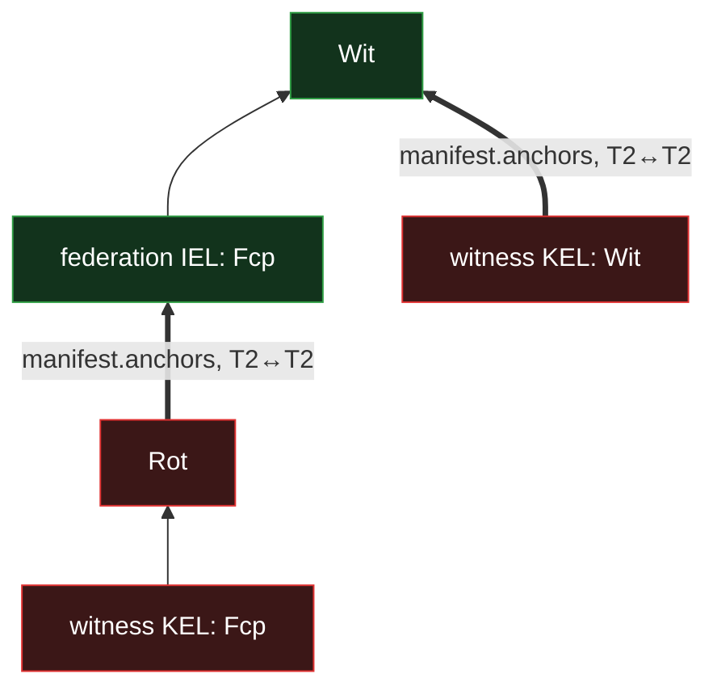

# Federation bootstrap — genesis and the trust root

A federation is a **restricted identity log** ([IEL](../../primitives/data/event-logs/iel/log.md))
whose roster is witness KELs directly. Every other chain in the system — every KEL, IEL, and SEL —
grounds its trust in a federation's witnessing. This doc states how a federation comes into being:
the genesis ceremony that stands up the founding roster, and the **self-certifying trust root** that
lets a verifier trust a federation it has never seen witnessed.

Genesis is the one place the witnessing machinery cannot bootstrap itself — before the federation
exists there is no mesh to witness its own inception. The resolution is not a cryptographic trick
but an honest one: **trust comes from the configured federation set, not from witnessing.** The
inception event is a way to _recognize_ a federation, never a way to _vouch_ for one. This doc
explains that carefully, because it is the part of the model that most easily reads as circular and
is not.

The witnessing mechanism a federation runs once it exists — selection, receipts, the clock,
first-seen — is [`witnessing.md`](witnessing.md). The federation reuses the IEL's chain structure
wholesale; this doc states only what genesis adds.

## A federation is a restricted IEL

A federation is **one IEL**, its prefix written `F`. It differs from a user identity's IEL in three
ways, all fixed at inception by the `Fcp` root kind:

- **The roster is witness KELs directly** — a threshold over the witness devices, with no policy and
  no per-witness identity wrapper (policy is not on the primitives — it is the application's, at the
  document layer — [`../../primitives/policy/policy.md`](../../primitives/policy/policy.md)). A
  witness is a device (a KEL), HSM-backed and horizontally replicated; the model sees one logical
  KEL per witness key.
- **The kind set is `Fcp` / `Wit` / `Trm`, plus `Ath` / `Dth` for blocking only.** `Fcp` is the
  inception marker; `Wit` is the single governance kind — it stands in for the user IEL's `Evl`,
  carrying every roster change and every witness rotation; `Trm` terminates the federation. There is
  **no `Ixn`** (a federation authors no content). `Ath` / `Dth` are admitted **solely to anchor the
  federation's own [prefix-block](blocking.md) SELs** — a `topics/block` grant / kill and nothing
  else; a delegation `Ath` is malformed. So a federation still **delegates to no other identity**
  and trust stays per-federation and non-transitive; the one non-governance thing it authorizes is a
  block on a prefix.
- **The threshold vector is `{ govern, authorize }`.** `t_govern` gates the governance `Wit`s;
  `t_authorize` gates the block `Ath` / `Dth` (typically set below `t_govern`, so a block stays
  agile while still reserve-backed). There is no `t_use` — with no `Ixn`, a federation `Fcp` that
  declares `t_use` is malformed, since a threshold exists only when its consuming kind is in the
  kind set
  ([`../../primitives/data/event-logs/iel/events.md`](../../primitives/data/event-logs/iel/events.md)).

A witness KEL is **single-federation**: it is `Fcp`-rooted infrastructure, governed _into_ one
roster and never self-bound. To serve a second federation, an operator stands up a **new** witness
KEL and has it governed into that federation's roster; the old KEL's events stay validly witnessed
by the old federation. This contains a witness compromise to a single federation rather than fanning
it out across every federation the witness might have served.

Because a federation is critical infrastructure, its recoverability ceiling is **hard**, not
advisory: it must always be able to evict one compromised witness and recover without it. That
forces `|roster| ≥ 4` structurally (the `signers ≥ 3` witness-pool floor plus the federation's
exclude-self pool of `|roster| − 1`); operators run **`≥ 5`**. The reasoning is
[`witnessing.md`](witnessing.md); here it is enough that a federation is never a fragile
one-to-three-witness affair.

## The genesis ceremony

No prior federation or gossip mesh exists yet, so genesis is arranged point-to-point. It has three
kinds of event and a strict dependency order:

1. **Each founder incepts its witness KEL** — an `Fcp` at serial 0, **self-attested**. There is no
   federation yet to witness it; that is exactly what makes the bootstrap non-circular — the
   federation is built _from_ these KELs, so their inceptions cannot wait on it.
2. **Each founder anchors the federation's inception** — a `Rot` at serial 1 (tier 2) on the
   founder's own KEL whose `manifest.anchors` names the federation IEL's `Fcp`. The anchor is
   **kind-strict, tier 2 → tier 2**: a founder `Rot` anchors the federation `Fcp`, with no tier
   elevation and no special founder kind. A founder is bound to the federation by being **named in
   the roster it founds**, not by self-binding.
3. **The federation IEL's `Fcp`** — the inception itself, marked `Fcp`, whose roster is the founder
   witness KELs (with a threshold) and whose `manifest.clock` sets the founders' join time as the
   timeline's lower bound. It is authorized the ordinary way — its declared members (the founders)
   anchor it in step 2. The founders _are_ the roster, so their anchors satisfy the inception
   threshold; no special authorization rule applies.

Solid arrows are chain order (each event's `previous` points back to the prior); thick arrows are
`manifest.anchors`. The left column is a founder witness KEL — its `Fcp` inception, its `Rot`
anchoring the federation, and a later governance `Wit`. The right column is the federation IEL — its
`Fcp` marker and a later governance `Wit` anchored by the witnesses' KEL `Wit`s.

**Genesis is dependency-ordered, not atomic.** The only real constraint is dependency: the founder
`Fcp`s exist before their `Rot`s, and the `Rot` anchors are locally present before the federation
`Fcp`'s content is fixed. Founders push their bundles point-to-point to a **coordinator** — an
operational convenience, never a protocol leader and never an election. The coordinator submits the
federation `Fcp` once the anchoring `Rot`s are present, redistributes the full bundle, and nodes set
their federation prefix and let the gossip mesh form; subsequent sync is ordinary anti-entropy. A
**partial** genesis is simply sub-threshold — a verifier's token reports it cannot confirm the
federation, so the read fails secure. There is no all-or-nothing transaction to honor, only the
dependency order.

Everything **after** genesis — every `Wit` that adds or cuts a witness or rotates the roster's keys
— is witnessed normally by the now-existing federation ([`witnessing.md`](witnessing.md)). The
unwitnessed steps are the federation-infrastructure inceptions: genesis, rooted in the configured
trust pin, and a joining witness's own inception pair, rooted in the **witnessed** governance `Wit`
that admits it — in both shapes, nothing trust-bearing rides the unwitnessed pair alone.

## The trust root is the configured federation set

A consumer trusts a federation **if and only if its prefix is in the set the consumer is configured
to trust** — provided at runtime by the application, empty by default. The library takes this
trusted-federation set from the application; an **unconfigured** library trusts **nothing**, and its
verification token reports that it cannot confirm any federation, so every downstream decision fails
secure. There is no built-in default federation.

The federation prefix is a Blake3 commitment to the whole inception content — the founder roster,
the threshold, and the inception nonce — so it is a **binding commitment to the exact founder set**.
Matching a doctored root against the configured prefix would require finding a Blake3 preimage.
Tamper-protection for the root therefore comes for free from every node holding the same configured
prefix: a substituted or altered genesis mismatches the configured value and is rejected. The
consumer walks the received federation chain from the configured prefix forward, validating each
event, and grounds all of its federation trust in that one out-of-band decision.

For a chain that has moved between federations over its life (a rebind —
[`witnessing.md`](witnessing.md)), trust is **per-federation and non-transitive**: _each_ federation
the chain was ever bound to must be independently in the consumer's trusted set. Trusting the
federation a chain is bound to today says nothing about a federation it was bound to yesterday.

## Why there is no self-witnessing carve-out

The question genesis seems to demand is _"who witnesses the federation's own inception, before the
federation exists?"_ The tempting answer is to make the verifier — dispatching on the `Fcp` kind —
treat genesis as **self-witnessing**, with the witness pool set to the inception's own declared
members. The model does not do this; the `Fcp` kind serves a much smaller job.

The apparent need for a carve-out dissolves once two separate questions are pulled apart:

- **Authorization** — _"is this `Fcp` inception validly created?"_ — is handled the **ordinary**
  way: the inception is anchored by its declared members' KEL events (the founders' `Rot`s,
  kind-strict, tier 2 → tier 2). The founders are the roster, so their anchors satisfy the inception
  threshold. There is no special rule here at all.
- **Trust-rooting** — _"should a consumer trust this federation at all?"_ — is **inherently
  out-of-band**. It cannot be derived cryptographically from nothing, and the honest form of it is
  the configured prefix above.

The insight is that a "self-witnessed" genesis is only ever as trustworthy as the decision to accept
its prefix — and that decision _is_ the configured pin. Self-witnessing would add a verifier branch
without adding any trust the configured pin does not already provide — circular theatre — so the
model grounds trust in the pin instead.

What the `Fcp` kind carries is a role of pure **interpretation**. It is a **marker** — a structural
disambiguator that tells the verifier _"this IEL is a federation"_, so it applies the restricted
kind set and exclude-self peer-witnessing. Reading a marker is not vouching for trust. An attacker
can stand up a perfectly well-formed `Fcp`-rooted federation of its own; a consumer honors a binding
to it **only** if that prefix is in the consumer's configured set. So a stood-up federation the
consumer has not configured earns no trust. **Well-formedness is the `Fcp` marker; trust is
set-membership.** Once the mesh forms, every **subsequent** federation event is cross-witnessed
exclude-self; the genesis `Fcp` itself roots in the config-pinned prefix, not a receipt count
(§Verifying the genesis bundle), and is not re-witnessed after the fact — the marker never carried
the trust in the first place.

## Verifying the genesis bundle

A verifier validates a received genesis against the configured prefix as follows:

- **The federation `Fcp`'s recomputed prefix equals the configured prefix.** The prefix derives from
  the inception content `(roster, threshold, nonce)`, so this both places the chain and confirms the
  founder set is exactly the configured one.
- **The `Fcp` is well-formed as a federation inception** — the restricted kind set is in force, the
  threshold vector is `{ govern, authorize }`, `|roster| ≥ 4`, and the witness-config clears its
  floors ([`witnessing.md`](witnessing.md)).
- **All founders' `Rot`s anchor the federation `Fcp`, kind-strict (tier 2 → tier 2)** — every
  founder anchors, so no founder lands in the founding roster without consenting to it, and the
  founders' `Rot`s satisfy the inception threshold; a partial genesis (any founder's `Rot` absent)
  is sub-threshold and reads fail-secure, no special rule.
- **The `Fcp` carries a `manifest.clock`** seeding the timeline's lower bound.

A genesis that clears these is trusted as the federation's serial-0 root. Nothing about it rests on
a receipt count — it is serial 0, with nothing before it to be forward-of, so it sidesteps the
receipt and freshness machinery entirely. Its trust is the configured prefix, full stop.

## Cross-references

- [`witnessing.md`](witnessing.md) — the witnessing mechanism the federation runs post-genesis:
  selection, receipts, the clock, first-seen, and rebinding.
- [`../../primitives/data/event-logs/iel/log.md`](../../primitives/data/event-logs/iel/log.md) — the
  IEL chain primitive the federation is a restricted instance of.
- [`../../primitives/data/event-logs/event-shape.md`](../../primitives/data/event-logs/event-shape.md)
  — the `Fcp` marker, the `Wit` facets, and the `federation` / `federationPin` fields.
- [`../../protocol-doctrine.md` §Federation convergence](../../protocol-doctrine.md#federation-convergence)
  — the cross-primitive framing of federation-as-restricted-IEL and the convergence model.
