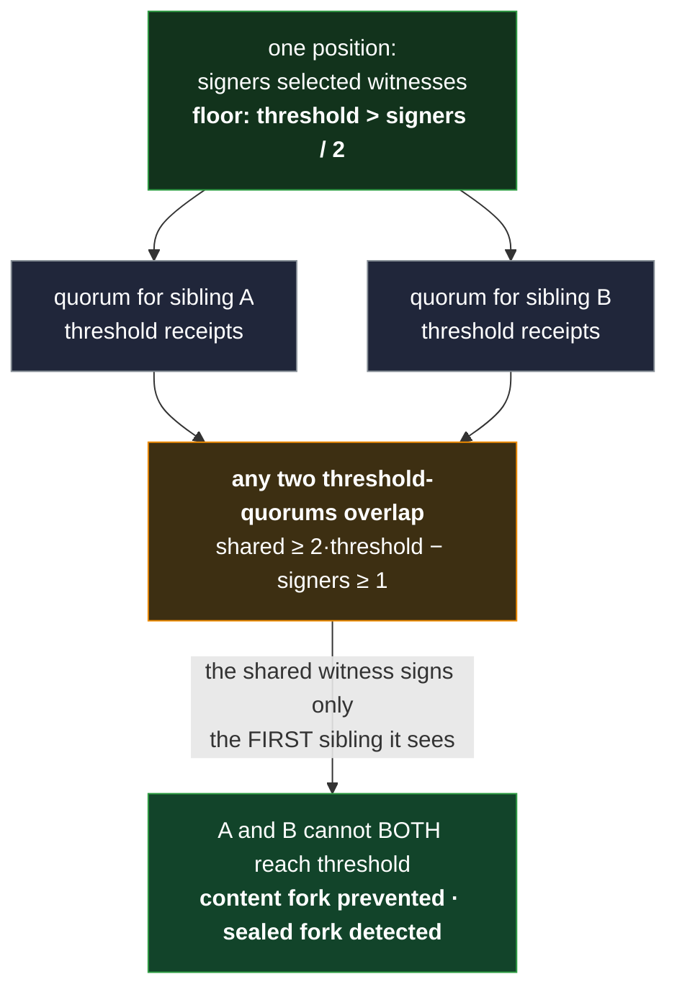
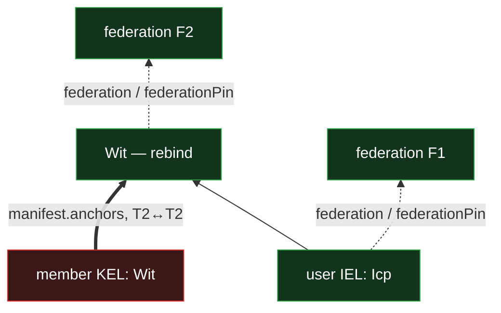

# Federation witnessing

Every KEL, IEL, and SEL in the system rests on **witnessing** for its soundness. Witnessing is what
makes a content fork impossible to form on an honest chain, what makes a sealed fork detectable
everywhere, and what a consumer's freshness and loss-of-trust decisions ground in. This doc states
the mechanism: how witnesses are selected, what a receipt attests, how receipts are counted as-of an
event's federation context, and how first-seen and the witnessing floor turn a majority of honest
witnesses into a convergence guarantee.

A federation is a **restricted IEL** and reuses the IEL's chain machinery wholesale; its genesis and
its configured trust root are [`bootstrap.md`](bootstrap.md). The cross-primitive framing — how the
primitives consume these guarantees — is
[`../../protocol-doctrine.md` §Federation convergence](../../protocol-doctrine.md#federation-convergence);
this doc is the mechanism that section refers to.

The one-line shape of the model: **witnesses are reporters, not deciders.** A receipt attests that a
witness saw a structurally-valid event first at its position; the **data-local walk** decides
terminality. Content forks are _prevented_ on witnessed chains; sealed races are _detected_. Every
identity is federation-witnessed — there is **no direct mode**.

## The witness-config and the witnessing floor

Every federated chain carries a **witness-config** — the `witnesses` manifest role, a SAD
`{ threshold, signers }`:

- **`threshold`** — the number of valid receipts a consumer requires before it trusts an event. It
  is a chain-criticality choice the operator makes **above** a structural floor.
- **`signers`** — the number of witnesses selected per event, `signers ≥ threshold`. It is
  over-provisioned for redundancy: up to `signers − threshold` selected witnesses can fail to
  receipt and the event still reaches trust.

The config is bounded `signers/2 < threshold ≤ signers ≤ |roster(F @ context)|`. The lower bound is
the **witnessing floor `threshold > signers/2`** — a strict majority of the _selected_ witnesses. It
is the load-bearing structural rule, because it is what makes two competing quorums overlap: any two
threshold-quorums at one position share at least `2·threshold − signers ≥ 1` witnesses. A
sub-majority config is rejected as **un-usable** — its `witnessed` signal would no longer mean
per-position exclusivity, a consumer footgun — and every config additionally clears `signers ≥ 3`
(real byzantine tolerance; no forced lone witness).



The floor is exactly the strict-majority threshold that forces the overlap: below it, two disjoint
threshold-quorums could form and `witnessed` would stop meaning per-position exclusivity.

**Worked example — the minimum federation.** A federation carries two distinct numbers that are easy
to conflate, so pin them at the smallest roster (`|roster| = 4`): a **governance** change needs
`t_govern = 3` co-authoring members (the authorization floor `> |roster| / 2` meeting the
recoverability cap `≤ |roster| − 1`), while an event becomes **witnessed** at `threshold = 2` of its
`signers` selected witnesses (the floor `threshold > signers / 2`, held at `2` so the federation can
still evict one witness and stay recoverable — `threshold ≤ |roster| − 1 − 1`). Three to govern, two
to witness: different questions at the same roster — how many members must author a governance
event, versus how many selected witnesses must sign to make any event witnessed.

**Per-layer.** A KEL, a user IEL, and the federation IEL each carry their **own** authoritative
witness-config, independent of one another; a **SEL inherits** its owner IEL's (a single-owner log
declares nothing of its own). A user IEL needs its own config because an IEL event is witnessed and
could otherwise fork with no member KEL forking — two disjoint member sub-quorums each landing a
valid event at one IEL position. The config is **mandatory** wherever a chain is federated: a
federated inception that omits it is malformed and rejected, fail-secure.

## First-seen: prevention for content, detection for sealed

A selected witness signs at most one sibling **per kind, per position**, and the two rungs compose
into the whole guarantee.

**Content is prevented.** A selected witness signs the **first** structurally-valid content event (a
tier-1 `Ixn`) it sees at a `(prefix, serial)` and **declines every later content sibling** there.
With the witnessing floor, two content siblings then cannot both reach `threshold` — their quorums
share at least one witness, and that witness signed only one — so a **content divergence never
forms** on a witnessed chain. It is _prevented_, not merely detected. This holds at KEL positions,
at user-IEL positions (a user IEL's content events reach a majority at their own
`(IEL prefix, serial)` — the fork-prevention gate alongside their anchor-based authorization), and
at SEL positions (a SEL is its own witnessed chain, prevented at its own `(SEL prefix, serial)`,
because an IEL anchor is an opaque SAID the IEL cannot dedupe, so the SEL must witness itself — the
SEL primitive states this).

**Sealed is detected.** A selected witness likewise signs the **first** structurally-valid sealed
sibling (`Rot` / `Wit` / `Trm` and their IEL / SEL analogs) at a position and declines every later
one. A **second** sealed receipt from one witness at one position is cryptographic proof of that
witness's misbehavior. So a competing sealed sibling reaches `threshold` only if
`2·threshold − signers` selected witnesses **double-sign** — a **both-witnessed** sealed pair is
itself proof the witnesses colluded (a provable double-sign → eviction), while a
**witness-declined** sealed sibling stays permanently sub-threshold (deferred-pending, droppable — a
spent preimage or a partition race, no witness fault). Two or more _accepted_ sealed branches
(counted per branch, wherever their seals sit) are the definition of **disputed**.

**Fork-cost `= 2·threshold − signers`** is therefore the price of manufacturing a fork on a
witnessed chain: the number of selected witnesses an attacker must own _and expose_. It is a tunable
security parameter, not a free consequence of the network — the dial trades one-for-one against
receipt redundancy (`fork-cost = threshold − slack`, `slack = signers − threshold`), so at
`threshold = signers` fork resistance is maximal but one unreachable witness stalls the position. A
**fork-cost-1** config (`signers = 2·threshold − 1`, the minimal majority) is warned at config time,
never silently accepted: deterministic selection makes a thin intersection a precomputable target,
so the single gating witness for a position can be identified in advance.

On a content-only divergence the resolving **burying seal-advancer** (a `Rot` / `Evl`) is exactly
that first sealed sibling at the position, needing no separate rule; a _second_ competing
seal-advancer is the proving pair `{Rot, Rot}` / `{Evl, Evl}` → disputed. And a seal on a **dead
lineage** — one that lost first-seen at any earlier position — is itself dead on ascent (you cannot
seal a buried chain), so it never counts. In the **honest** case only one branch's lineage survives
first-seen → its seal is the single sealed branch (Active); a dispute takes **two accepted-lineage
branches**, whose seals may sit **at the fork or at different serials above it** — counted per
branch. The one honest-witness exception is two **rebinds** naming **different federations** at that
serial — disjoint witness sets, so each federation honestly signs its own (an author-equivocation
dispute, not collusion).

**A below-seal sealed event is declined — the witness mirrors the seal-cap.** The "structurally
valid" test a selected witness applies before signing includes the **seal-cap** (the merge
shape-validity gate —
[`../../primitives/data/event-logs/kel/merge.md`](../../primitives/data/event-logs/kel/merge.md)): a
sealed event whose parent lies **below the chain's current seal** is inert and is **declined**, so
it never reaches threshold. This is the **backdate defense**: keeping a below-seal sealed straggler
off the receipt path stops a total-key-compromise adversary from minting a fabricated historical
fork years later. The witness decline is the **fast prevention layer** — it holds under honest,
well-connected operation; the **guarantee** is the walk itself, because a below-seal sealed event is
**dead on ascent** (its parent is already buried by a later seal — you cannot seal a buried chain),
so even a partitioned or colluding witness set that _does_ sign one cannot overturn the live seal
(the position is already spent). The **only** reachable dispute is therefore a seal-vs-seal
collision **at the last (live) seal** (two accepted seals there, which takes a provable witness
double-sign — the `2·threshold − signers` collusion, the determinism price; **or**, for two rebinds
naming different federations at that seal, honest witnesses on disjoint sets — author equivocation).
This signing decision reads the event **body** and the witness's held chain state to locate the
current seal; it is a different operation from the bodyless **receipt-counting** below
([§Query-scoping](#query-scoping-and-the-audit-flag)), which only confirms a receipt came from a
legitimately-selected witness — not whether to sign.

**The split-stall and its exit.** First-seen partitions the receipts at a contested content position
(`a + b ≤ signers`); when neither sibling reaches a majority — an even-`signers` tie, abstentions,
or a partition — the position **stalls, fail-secure**: signed witnesses cannot switch, so a minority
partition stalls rather than forks (consistency over availability). The exit is a burying
seal-advancer at the position — the first sealed sibling there, signed by every selected witness
including those that signed a content sibling (the permitted cross-tier co-sign) — which reaches the
majority. Attached at the author's own stalled sibling it retains that content; attached at the
shared ancestor it buries both and the honest content re-issues forward. Odd `signers` avoids the
pure tie.

**The predicate is tier-scoped.** An honest witness legitimately holds
`{≤ 1 content} ∪ {≤ 1 sealed}` at a position — the cross-tier co-sign the split-stall exit needs is
not misbehavior. Only a second receipt over two distinct _content_ `eventSaid`s, or a second
distinct _sealed_ sibling, at one position is proof of misbehavior. That clean attribution is what
the fork-cost pricing rests on.

## Deterministic selection

Which witnesses are asked to receipt an event is a deterministic function of its **position**, over
the federation's as-of roster:

`select(prefix, serial, roster(F @ federationPin), signers)`

Competing events at one `(prefix, serial)` **that inherit the same pin** therefore route to the
**same** selected set, so the quorum-intersection the floor relies on is over one set. Selection
keys on the **position** and the **as-of roster** — never on the event's bytes — so an adversary
cannot mint sibling-specific witness sets **within one federation**. The **exception is a rebind**:
a rebind `Wit` **declares** its own `federationPin` and so selects over a **different** roster
(§Rebinding), so two competing rebinds declaring different federations select **disjoint** sets —
the one place two accepted siblings at one serial need **no** witness double-sign (each federation
honestly signs its own), a dispute proven by author equivocation instead. A receipt counts toward an
event's `threshold` only if its signer is in the _selected_ set, not merely in the roster: the
intersection guarantee is over the selection, so the counting predicate is selection-scoped.

`select` is a **cross-node protocol constant.** Every conforming node must compute the _identical_
selected set — receipt-counting and the fork-cost arithmetic rest on it — so its algorithm is pinned
byte-exactly rather than left to the implementation. The scheme is a stable-sort of the current
roster membership by a position-keyed digest, taking the first `signers`:

```
select(chain_prefix, serial, membership, signers):
    stable_sort(membership, w => blake3('{chain_prefix}:{serial}:{w.prefix}')).take(signers)
```

The digest is keyed on the position and the witness prefix — never the event's bytes or pin — over
the **currency-gated current membership** read from the verified federation context. The digest
input follows the shared byte convention of the `hash('{tag}:…')` derivations
([`../../primitives/data/event-logs/tags-and-topics.md`](../../primitives/data/event-logs/tags-and-topics.md)):
each field in its canonical form — the prefixes as their qualified representation
([`../../primitives/data/sad/said.md`](../../primitives/data/sad/said.md)), `serial` as its
**minimal base-10 ASCII** form (no leading zeros) — concatenated `':'`-joined as raw bytes (the join
is its own byte convention, not the JSON/JCS canonicalization `said.md` governs), so independent
implementations compute the identical selected set.

For a **federation member's own KEL events**, selection runs the same algorithm with **that
witness's own prefix removed** — exclude-self, a witness never receipts its own event — over the
pool `|roster| − 1`.

## As-of-context evaluation and the currency gate

Receipts are **adjacent attestation data** — unanchored, like a KEL's signatures — and they are
evaluated **as-of the event's own federation context**, never at the federation's current tip.

**Durability.** A witnessed event's pin is **current** — the currency gate refuses a stale-pin
event, so witnessing selects over the current set (§Deterministic selection). What makes witnessing
_durable_ is that this then-current selection is fixed forever. A receipt counts iff its signer is
in `select(prefix, serial, roster(F @ federationPin), signers)`, where `federationPin` is the
event's own recorded binding at that position — **inherited** by an ordinary event, **declared** by
a rebind `Wit` — which was current when the event was witnessed; the `select` here is a **counting
re-derivation** of that past selection, never a fresh selection under an old pin. The federation IEL
and the witness KELs are append-only, so `roster(F @ federationPin)` and each witness's key at that
context are both fixed: **an event stays witnessed forever — there is no re-witnessing of historical
data**, and a since-removed witness's _established_ receipts keep counting. Federation context
attaches per layer: a KEL carries it, a user IEL records its own authoritative
`{federation, federationPin}` (field-matched to its members' KEL `Wit`s), and a SEL inherits its
owner IEL's. A SEL event selects witnesses under the `federationPin` of the owner-IEL event it pins
to — fully derivable, no new mechanism.

**The acceptance-time currency gate.** To keep an active chain from pinning an ever-staler context,
witnesses **refuse to witness an event whose `federationPin`'s roster membership is not current**.
This forces an active chain to advance its pin **lazily, on its next event of any kind** — a fresh
`federationPin` is optional on every event, so no `Wit` is needed unless the chain is rebinding. The
gate compares roster **membership**, so it fires on **any membership change — an add or a cut** —
not on a pure rotation (same witnesses, new keys — the clock bounds key-time-validity, so a
pre-rotation pin is safe). It is an **establishment-time** check (a beyond-band-stale pin can never
_start_ gathering receipts); it **never voids** receipts already established under a then-current
pin. There is **no grace window** — a since-cut witness earns zero countable receipts immediately,
because any grace would re-admit the pre-cut roster and revive the exact backdate sliver the gate
exists to stop.

A stale in-flight event is not stranded. A submitter accepts its **own** structurally-valid,
sub-threshold events as its local tip (you cannot extend a `Rot` you have not landed), making
forward progress ahead of witnessing; the next event carrying a current `federationPin` earns
cross-node acceptance for the run — peers defer the un-witnessed events, then fetch them once the
witnessed re-pin commits them as `previous`. The recovery rests on the **rotation reserve** (the
standing tier-2 requirement), never on retaining an old signing key.

## The federation clock

The currency gate governs _roster version_; the **federation clock** governs _time_, closing the
harvested-old-key forgery that the forward-floor alone cannot reach.

The clock is the **`clock` role** in each federation governance event's manifest — an **inline
timestamp value**, not a separate SEL, event kind, or nested SAD (nothing dereferences it by its own
SAID, so the manifest commits the value directly). Every federation governance `Wit` — a rotation,
optionally also a roster change — commits a `clock` timestamp, and so do the genesis `Fcp` and the
terminal `Trm`. The `Wit` is sealed and the timeline is **monotonic** (each clock time ≥ the prior,
enforced at the seal), so it cannot be rolled back. Consumers read the timeline by walking the
federation IEL they already walk for the roster.

**Key-windows.** Each witness has a key-validity window `[T_join, T_end]` in clock time: `T_join` is
the clock at the `Wit` that admitted or last rotated the key, `T_end` the clock at the `Wit` that
retired it. Because witness key-windows change **exactly** at federation `Wit`s, timestamping those
`Wit`s time-bounds every key's window. A receipt counts only if its own timestamp `τ` falls inside
the signer's window, with a tolerance of `CLOCK_TOLERANCE_BAND`:
**`τ ∈ [T_join − CLOCK_TOLERANCE_BAND, T_end + CLOCK_TOLERANCE_BAND]`**. A cut or rotated-out
witness, being out of the roster, earns no new pinned window, so its forward-rotated keys never
count.

**Wipe.** A witness **wipes superseded and removed private key material** on rotation and on removal
(forward secrecy). Durability is unaffected — old receipts verify with the witness's _public_ keys,
which persist in its KEL — but there is no soft harvest target, so the only extant keys for a closed
window sit on witnesses still using them (compromising one is a _current_ compromise, the accepted
byzantine residual). Wipe plus the clock together close the dormant-chain forgery: a forgery built
on a closed-window key is forced to carry old timestamps, so the tip reads **stale** and is
detectable, fail-secure.

**The 365-day auto-expiry.** A key-window may stay open at most
**`MAXIMUM_WITNESS_KEY_WINDOW = 365 days`** — an un-refreshed window is treated as **closed at
`T_join + 365 days`**, a fixed protocol constant, with no explicit `cut`. So a witness that never
participates in a `Wit` no longer keeps an indefinitely open window; it auto-expires and its later
receipts read stale, the same closure a cut gives. Every witness therefore rotates **at least once a
year** as standard practice (ML-DSA-87 handles the frequency easily); a slow-but-honest witness that
lets its window lapse simply reads stale until it rotates, at no security cost. A member whose
window has auto-expired is **flagged at-risk** on the verification token — a data-local computed
property, reported not raised — so operators evict-and-replace or reconfirm by rotation before
cumulative loss reaches `t_govern`. There is no auto-eviction (removing a member is governance,
which cannot be auto-authored). An **all-witness lapse** — a missed synchronized ceremony, every
window expiring together — is **not a brick**: the federation reads stale (loss-of-trust decisions
refuse) until a catch-up rotation `Wit` lands, which self-attests under the **new** windows it
establishes (the clock axis is carved out of the no-self-weakening rule, so a rotation's fresh-key
receipts are never judged under the expired old windows).

**The upper sanity bound.** A consumer rejects or stale-flags any federation clock time — and any
receipt `τ` — beyond **`now + CLOCK_TOLERANCE_BAND`**. This bounds a `t_govern`-compromised
federation's ability to future-date a `Wit`'s clock (which would push every window forward, making
closed windows read open) to roughly one `CLOCK_TOLERANCE_BAND`. It reads against the consumer's own
wall clock.

**Deployment invariant.** Because these are wall-clock checks, a consumer **must stay NTP-synced to
within `CLOCK_TOLERANCE_BAND`**. A consumer drifted by more than `CLOCK_TOLERANCE_BAND` cannot trust
its own freshness results, and a _backward_ skew is the fail-open direction (stale reads fresh). NTP
sync to within `CLOCK_TOLERANCE_BAND` is therefore a **security control**, not best-effort, and
belongs in every deployment's operating requirements; a verifier cannot be defended against its own
wrong clock. When the federation is reachable, a live challenge-response is the no-local-clock path.

**Constants.** The tolerance **`CLOCK_TOLERANCE_BAND = 1 minute`** and
**`MAXIMUM_WITNESS_KEY_WINDOW = 365 days`** are fixed protocol constants (deterministic — every
verifier agrees). `CLOCK_TOLERANCE_BAND` absorbs honest clock skew at a window boundary; its
security cost is nil, since the attack it faces is gross staleness, not boundary-seconds. Distinct
from the **staleness threshold** ("how old before a tip is flagged"), which is consumer /
loss-of-trust policy. Clock timestamps are **UTC, RFC 3339, exactly 6 fractional digits
(microseconds), zero-padded**, so the manifest canonicalizes byte-identically; the 6-place precision
is for deterministic serialization, not a claim of microsecond accuracy.

## The witness receipt

A receipt is itself a **SAD** — it carries its own `said` and `kind`
(`vdti/witness/v1/receipts/{kel,iel,sel}`, by witnessed chain), and its witness **signature rides
adjacent, never in the body** (a SAD cannot contain a signature over its own `said`; receipts are
adjacent attestation data). Its body:

```
{
  said,            // the receipt's own SAID
  kind,            // a witness receipt kind (vdti/witness/v1/receipts/{kel,iel,sel})
  threshold,       // witness-config threshold in effect at this position
  signers,         // witness-config selection size in effect at this position
  federationPin,   // the chain's federation binding at this position → resolves roster(F @ federationPin)
  chainPrefix,     // the witnessed chain's prefix
  eventSaid,       // the one committing SAID of the witnessed event
  eventSerial,     // its serial
  timestamp,       // the witness's asserted time τ (inside the signed payload)
  witnessPrefix    // the signing witness's KEL prefix
}
```

The design choices in the shape are load-bearing:

- **`timestamp` (`τ`) is inside the signed payload.** If it rode adjacent, a harvested receipt's `τ`
  would be rewritable to "now" and the clock's key-window check would be moot.
- **It binds the full as-of-position selection context `{ federationPin, threshold, signers }`.** A
  mesh witness can then resolve `roster(F @ federationPin)` from its own federation IEL and validate
  `witnessPrefix ∈ select(chain_prefix, event_serial, roster, signers)` **without the chain body** —
  sound, cheap detection, with fakes dropped at the mesh edge. The context is **stateful** (the
  value in effect at this event's position, not a chain constant), and the checks are **equality**
  against the chain-authoritative committed config, never the self-asserted receipt field: a receipt
  whose `threshold` mismatches the committed witness-config SAD in effect at the position is invalid
  **even if higher**. A stale-config witness (lagging a governance `Wit`) emits a non-matching
  receipt that is discarded — a liveness cost around config changes, not a safety hole.
- **A batch is witnessed by its one committing SAID** (`eventSaid`, committed by chain linkage or
  the anchoring event's `anchors[]`), never an enumerated list — single-SAID keeps receipts small
  and floodable.

**Federation-pin currency (the rebind path).** A receiving node — always a current federation member
holding F's state — runs a **local pre-check** returning a **signal only**: a beyond-band-stale pin
yields a positive "stale — rebind" signal (not an absence-of-receipts timeout). The signal is a
**hint, not authority**: the consumer **walks the federation chain** from the configured prefix to
the **verified** current position and rebinds to a value it verified, never the node's asserted
value (trust the data, not the service). Witnesses **refuse** a beyond-band-stale event outright —
signing it would consume the position's first-seen slot and block the rebind — and a submitter
likewise drops its own declined stale-pin local tip so it cannot self-collide with the rebind at the
same serial. The rebind is a `Wit` carrying the verified current `{federation, federationPin}`: it
declares the current pin, so its own selection is over the current roster → it is witnessed → it
self-bootstraps into the current federation, and subsequent content inherits the new pin.
Resubmission is idempotent (dedup by SAID), so resubmitting any event doubles as a liveness check;
resubmitting a _stale-pin_ event never fixes it (the pin is baked into its SAID) — the fix is
rebind, then submit a new event.

## An event's witnessed time

A witnessed event gathers receipts, each carrying its witness's asserted time `τ` inside the signed
payload (above). The event's **witnessed time** is the `τ` of the receipt that brought it to
`threshold` — order the event's valid receipts by `τ` and take the `threshold`-th smallest: the
instant at which `threshold`-many witnesses had attested at or before it, i.e. **when the event
became witnessed-in-full**. It is a single value every verifier holding the **same receipts**
computes identically, distinct from any one witness's `τ` — though not unconditionally per-verifier
deterministic: with `signers > threshold`, a verifier handed only the **latest** `threshold` valid
receipts computes a **later** crossing than one holding the earliest, and accumulating receipts
moves it only **earlier** (monotone downward). A receipt-curating adversary (eclipse-class — it must
control which receipts your sources hand you) can inflate a computed boundary by at most the
**honest receipt spread** (the slack witnesses' in-window `τ`s, gossip-latency scale), and the
consequences stay inside accepted classes: a later **closing** boundary only widens the
already-accepted backdate-into-closed-interval sliver, a later **opening** boundary refuses honest
edge messages (fail-secure), and full withholding below `threshold` is closed by query-scoping plus
the freshness bar.

It is **robust against a byzantine minority**, which a per-witness or "newest `τ`" reduction is not,
and the security-critical direction is the strongest: the crossing **cannot be pushed later**. A
witnessed event has already earned **≥ `threshold` durable honest receipts** at its true time (that
is what made it witnessed-in-full); an adversary can neither delete them nor move the
`threshold`-th-smallest `τ` later by **adding** late receipts (adding larger values leaves the
bottom-`threshold` unchanged). So read against the multi-source freshness bar, the upper boundary a
stale key would need inflated is **pinned in the past** by those durable receipts. Pushing the
crossing **earlier** needs `threshold`-many receipts below the honest cluster — a full witness
compromise (`threshold` witnesses, the catastrophic residual) — and even then only shrinks a past
interval (fail-secure) or lets the **newer** key backdate, never lets a stale key read current. Each
`τ` is independently capped at `now + CLOCK_TOLERANCE_BAND` and valid only inside its signer's
key-window, so a rogue future- or past-dated `τ` is discarded before it can skew the crossing. The
witnessed time is therefore a consensus timestamp for **when an event became final**, carried by the
same receipts the currency gate already trusts threshold-many-strong.

This is **distinct from the federation clock**. The clock (a governance-authored `clock` role) times
**federation governance events** and bounds **witness** key-windows — which cannot be
receipt-derived without circularity, since a receipt counts only if its `τ` sits inside the signer's
window. An ordinary event (a user's rotation, a group-key epoch) has no such circularity — its
authors are not its witnesses — so its finality time is read from its **own** receipts. Because the
witnessed time comes from the event's own receipts rather than the federation clock (which advances
only at federation governance events, roughly yearly), it gives **per-event granularity** — a user
rotating monthly, an epoch turning hourly, each gets its **own** boundary — resolving the
quantization a governance-cadence clock would impose.

Witnessed times are **not self-ordering**, though: two establishment events witnessed within a
tolerance band can come out inverted. So a currency consumer **checks** the establishment times it
reads are **in-bounds** (`≤ now + CLOCK_TOLERANCE_BAND`) and **non-decreasing along the chain** and
**reports the result on its verification token** — a structural violation **bails** (fail-secure),
an in-bounds-but-out-of-order pair is **reported and the message whose interval that inversion makes
untrustworthy is refused** (the informative-token model, §The token reports its own completeness),
never silently treated as a valid empty interval. This is the same compute-check-report discipline
every chain-validity property rides. Consumers use the witnessed time as the time boundary wherever
a witnessed event needs one: the **key-state validity intervals** a message's sender-key currency
reads ([`../../features/exchange.md`](../../features/exchange.md)) and a **group-key epoch's
window**.

## Query-scoping and the audit flag

Events reach the nodes that need them over the federation's gossip mesh — roster-wide push-gossip
for an event witnessed in full, and sub-gossip among a position's selected witnesses for one still
gathering receipts. All mesh traffic is encrypted, so contents stay within the roster; the channels
and the two-scope transport are [`topics.md`](topics.md); the channel underneath it — the handshake,
the per-connection session keys, and the nonce discipline that makes reuse structural — is
[`../infrastructure/mesh-transport.md`](../infrastructure/mesh-transport.md). What matters for
witnessing is what a query returns.

This position-indexed receipt query is **the beacon**: because receipts are keyed at
`(prefix, serial)`, querying a position returns the receipts for **every** witnessed branch there,
so a node holding one branch learns the others exist and fetches them to walk — the detection signal
a `disputed` read rests on.

**Witnessed-in-full is a receipt count, checked against the committed config.** Each receipt carries
the `threshold` in effect at its position, so a node reads "witnessed in full" by counting
`threshold`-many receipts that agree on the same `(event SAID, threshold)` — with no chain-walk to
re-derive the in-effect threshold (it still needs the roster and selection to know each receipt came
from a selected witness). The carried `threshold` is a **hint, never the authority**: the count
holds only on an **exact match** to the chain-committed witness-config in effect at that position —
a receipt whose threshold does not match is invalid **even if it names a higher bar**. A bar set too
low would under-count a forgery into acceptance; a bar set too high disagrees with honest receipts
on `(SAID, threshold)` and is detected; and the consistent understatement — event and its receipts
together — is defeated because the match is against the committed config, not the receipt field. A
**stale-config** witness lagging a governance `Wit` emits a non-matching receipt that is simply
discarded — a small liveness cost around config changes, never a safety hole. So a countable receipt
needs all of: a valid signature, its signing key inside the witnessed window, a selected signer, and
a matching threshold.

A **not-yet-witnessed (sub-threshold) event is witness-scoped**: a query returns it **only to a
selected witness** for that position; to every other node — a non-witness, or a witness not selected
here — it is noise and is not returned. So **non-witnesses only ever hold witnessed-in-full
events**, which is what makes the data-local walk a pure function of _accepted_ state on every node,
and an attacker cannot feed a sub-threshold competing event to a non-witness to skew its reading.

An **opt-in `all-data` audit query** is the one exception: it returns every event and receipt a node
holds, sub-threshold noise included. It is **walk-ignored** — a sub-threshold event never enters a
verdict, so surfacing it cannot skew a reading — and its value is purely **forensic**: a suppressed
competing sibling is evidence of an injection or collusion attempt, so the flag makes attack-attempt
detection possible for an auditor. The default stays scoped.

For a **sealed** event, sub-gossip means it reaches every selected witness, so there is no stable
"witnessed but sub-threshold" state (the only ways to hold one sub-threshold are pure eclipse or a
byzantine witness signing-then-withholding — a rogue receipt, discarded and evicted, bounded by
`< threshold`). The first sealed sibling reaches threshold this way; a second is declined
first-seen, so two _accepted_ sealed branches require the colluding double-signers above.

## No direct mode, and fail-secure

**Every identity is federation-witnessed.** A user `Icp` that omits `federation` / `federationPin`
is malformed and rejected; a chain cannot incept un-federated, and there is no "witnessing starts
from a later `Wit`, early range unwitnessed" allowance. A loss-of-trust decision — asking whether a
`Trm` or a divergence closed a chain — that cannot **multi-source-confirm** (any eclipse or
single-source) **refuses**, never proceeds with a flag. The genesis of a federation is _not_ a
direct-mode exception: its `Fcp` is unwitnessed only because it is the configured trust root
([`bootstrap.md`](bootstrap.md)), and the residual where a content fork can still form is a
**witness compromise**, not an un-witnessed chain.

**Detection is eventual, not at-decision-time.** Every detection guarantee assumes the consumer can
reach enough honest witnesses / converged gossip to see the competing branch. A consumer eclipsed to
a malicious subset, or reading during an incomplete heal, sees the detection later — so a binding
made in that window can transiently trust the wrong branch. This is the standard cost of a detection
model; a multi-source freshness bar shrinks the window but does not close it, and recovery is
operational (re-verify before binding; reincept on a surfaced divergence). The content-fork
_prevention_ leg is not subject to this — the floor stops a content fork from forming — but a formed
_sealed_ fork is no more visible than gossip has yet carried it.

## The token reports its own completeness

Witnessing composes with a **work bound** on verification: a verifier walk that paginates or bails
on a deadline mints a **continuable token that reports its incompleteness accurately**. A consumer
gates its trusting behavior off that report — an incomplete kill-walk reads _possibly-killed_, never
_not-killed_; an unconfirmable loss-of-trust decision refuses. This is **separate** from the
structural per-event caps (`MAXIMUM_MANIFEST_LIST` and the like), which stay deterministic
_validity_ checks: the work bound governs how much a walk _traverses_, and a bailed traversal is
reported, never silently treated as a clean result. A **ping-pong rebind DoS** needs no special cap:
an over-long chain of rebind `Wit`s is just a walk the work bound refuses, and every rebind `Wit`
must itself reach witness threshold — so flooding is neither free nor unbounded.

## Rebinding

An identity's initial federation binding rides its `Icp` (`federation` prefix + `federationPin`
SAID). A later `Wit` **rebinds** it to a new federation — anchored by the members' KEL `Wit`s
(kind-strict, tier 2 → tier 2), its `{federation, federationPin}` field-matched to every anchoring
KEL `Wit`, so the identity's binding records only what its members signed. Rebinding is how a prefix
**survives its federation**: if the federation dies or is compromised, the identity rebinds to a
**new** federation and keeps its prefix alive. This is why a rebind `Wit`'s **declared** current
binding **must** be accepted for selection (it selects over the new roster) — forcing it back onto
the dead federation would strand the prefix. The cost of that declared selection is a **reachable
honest-witness dispute**: two rebinds at one serial declaring **different** federations select
**disjoint** witness sets, so each is honestly first-seen-accepted by its own federation and both
reach threshold with **no witness double-sign** — `disputed`, proven by the author's reserve
double-reveal, resolved by reincept. Trust is **per-federation and non-transitive**: a verifier
independently trusts _each_ federation prefix the chain bound to, and each event is witnessed by
whichever federation was current when it landed — so **convergence is among verifiers sharing a
trusted-federation set**, and a verifier trusting only one side of such a race reads only that side
accepted. Witnessing is therefore **range-based** — a contiguous run of events between rebinds
shares one context — and the verification token reports the ranges (`[from, to) → F`), per range,
not per event. A consumer **must not** assume "has a `Wit` ⇒ all events witnessed": an event in a
run bound to a since-changed federation is witnessed by that run's federation, not today's.



Solid arrows are chain order (`previous` points back); dotted arrows are the `federation` /
`federationPin` binding; the thick arrow is `manifest.anchors`.

A **ping-pong rebind DoS** is bounded by the verification work bound, not a separate cap (above).
The **migration overlap window** — during which members below `t_govern` still lag on the old
federation until they each rebind — is **cooperative-only**: it assumes both federations are honest,
an app-coordinated migration both approve. It does **not** cover _escaping_ a compromised
federation: there the old federation still counts during the overlap, and an event mid-migration
cannot be verified under the target federation alone. **Escaping a compromised federation is a hard
cutover / reincept, not a graceful overlap.** Multi-federation orchestration is application-level;
the framework gives the per-federation, non-transitive primitives and the recommendations, not an
orchestrated protocol.

## Roster governance

A federation's roster changes ride the `Wit`'s **roster delta** — never a full snapshot. A `Wit`
carries `{ add: Prefix, cut: Prefix[], …thresholds }`: **`add` is a single prefix** (one witness
added per `Wit`, the `Fcp` inception alone standing up the founding roster wholesale), while **`cut`
is a list** (cuts remove synced witnesses, so emergency multi-eviction is unaffected —
evict-and-replace is `cut: [..], add: one`). One-at-a-time adds are both an operational match
(standing up a witness is deliberate infrastructure, never bulk) and a structural closure: a
transition introduces at most one unsynced witness, which alone cannot reach a majority against
synced co-selectees that decline it first-seen, so the benign two-fresh-witnesses straddle collapses
into the priced witness-compromise residual.

The current roster is reconstructed by **accumulating add/cut while walking**, capped at a **hard
live set of `MAXIMUM_ROSTER_SIZE`** (over-cap → reject as a DoS; operators run `≥ 5`, so
`MAXIMUM_ROSTER_SIZE` is generous headroom). The live roster is a **set**: a `Wit` whose `add` names
an already-live prefix is rejected (re-adding would reset its `T_join`), and `add` membership is
tested against the pre-delta roster, so a same-event `cut` + `add` of the same prefix is rejected
too (order-independent). Every config-changing `Wit` is **re-checked on the post-delta config**,
valid only if the full witness-config validity holds after the change — the witnessing floor, the
`t_govern` bounds, and the federation's tighter recoverability cap (below). A bare `cut` that would
strand the federation un-recoverable is rejected, forcing evict-and-replace or a simultaneous
threshold-and-`signers` drop.

Witness **key rotation is a federation `Wit`** — the witness's KEL `Wit` **is** the rotation (it
refreshes the signing key and rotation reserve) **and** anchors the federation IEL `Wit`
(kind-strict, tier 2 → tier 2). There is no separate rotation event and no phantom key;
`pins = Wit.previous`, so the retiring key's `T_end` lands correctly. A witness rotation is legal
**only** as a federation `Wit`: an **off-ceremony `Rot`** (a witness `Rot` anchoring no `Wit`)
produces receipts the federation does not honor, and an observed off-ceremony rotation is a
cut/eviction signal. Adding a joining witness pairs its consenting KEL `Ixn` (joining, not rotating)
with the pre-add witnesses' KEL `Wit`s, which alone satisfy `t_govern` — the count is gated on
**pre-add roster membership**, so a colluding new witness cannot manufacture a `t_govern` vote by
authoring its own `Wit`.

## The recoverability cap and exclude-self

Because a federation is critical infrastructure, its recoverability ceiling is **hard**: it must
always be able to evict one compromised witness and get the cut trusted. The federation realizes its
fork-prevention position gate through **exclude-self peer-witnessing** — its member witness-KELs
witness _each other's_ KEL events, a witness never receipting its own, over the pool `|roster| − 1`.
So for federation member events the config is bounded

`signers/2 < threshold ≤ min(|roster| − 2, signers − 1)` and `threshold ≤ signers ≤ |roster| − 1`,

where the **recoverability cap `threshold ≤ min(|roster| − 2, signers − 1)`** is the load-bearing
addition. An eviction/recovery `Wit` is authored by the remaining members and **must self-attest** —
the evicted or dead member will not co-witness — so the self-attest pool is `|roster| − 2`, and at
sub-pool selection the selected pool loses one too, so `threshold ≤ signers − 1` also binds. With
`signers ≥ 3` the `signers − 1` leg is `≥ 2` and always binds cleanly, and the guaranteed evict-one
begins at the `|roster| = 4` structural floor with `{ threshold 2, signers 3 }`. Surviving `k > 1`
simultaneous losses is the operator's sizing choice: pick the tolerated simultaneous-loss count `k`
explicitly, set `threshold ≤ |roster| − 1 − k`, and grow the roster to keep `t_govern` reachable. A
user chain is not subject to the cap — its anchors are witnessed by the external federation pool
with no self-exclusion — and realizes the same position gate by reaching a majority at its own
`(IEL prefix, serial)`.

A `Wit`'s own self-attestation is judged under the **at-or-before** witness-config and roster (no
self-weakening — a sub-quorum cannot lower its own trust bar in the very event whose trust is in
question), but under the **new** key-windows the rotation establishes (the clock axis carve-out,
above). So an all-windows-lapsed federation reads stale, then recovers via a catch-up rotation that
self-attests under its new windows — stale-but-recoverable, never bricked. A lone broken or old key
cannot mint a current window: a rotation is honored only as a federation `Wit`, needing `t_govern`
authors and `threshold` self-attestation, which one key reaches neither. A current-window takeover
therefore needs `≥ t_govern` current keys — the byzantine assumption violated, an operational
reincept — and a merely _lost_ key is evicted or reincepted operationally.

## Security assumption and residual

The federation's soundness assumes **fewer than `threshold` byzantine** members at attestation time;
beyond that is operational recovery and reincept. The co-witnessing exclusivity carries its own
tighter bound: it holds against fewer than `2·threshold − signers` byzantine double-signers within
the selected set (the fork-cost), so for an over-provisioned config a coalition _within_ the blanket
`< threshold` assumption can manufacture a co-witnessed content fork at fork-cost — priced, exposed,
and evictable, not free. The irreducible residual is compromising `threshold`-many _current_ witness
keys, which is the federation itself being compromised — recovery is reincept, not a backdate via
stale keys.

## Cross-references

- [`bootstrap.md`](bootstrap.md) — federation genesis and the configured trust root.
- [`../../protocol-doctrine.md` §Federation convergence](../../protocol-doctrine.md#federation-convergence)
  — the cross-primitive convergence framing this mechanism serves.
- [`../../protocol-doctrine.md` §Divergence and recovery](../../protocol-doctrine.md#divergence-and-recovery)
  — the data-local walk that decides a verdict from the branches receipts enumerate.
- [`../../primitives/data/event-logs/iel/log.md`](../../primitives/data/event-logs/iel/log.md) — the
  IEL the federation is a restricted instance of; the witnessing floor gates its content and sealed
  events.
- [`../../primitives/data/event-logs/event-shape.md`](../../primitives/data/event-logs/event-shape.md)
  — the `witnesses` and `clock` manifest roles, the `Wit` facets, and `federation` /
  `federationPin`.
- [`../../primitives/data/sad/kinds.md`](../../primitives/data/sad/kinds.md) — the witness receipt
  kinds `vdti/witness/v1/receipts/*`.
- [`topics.md`](topics.md) — the gossip channels the mesh carries and the two-scope transport.
- [`../infrastructure/mesh-transport.md`](../infrastructure/mesh-transport.md) — the authenticated,
  encrypted channel the mesh runs over: the handshake, the per-connection session keys, and the
  nonce discipline that makes reuse structural.
- The encoding library _(forthcoming)_ — the byte-exact `select` scheme and the receipt
  canonicalization.
