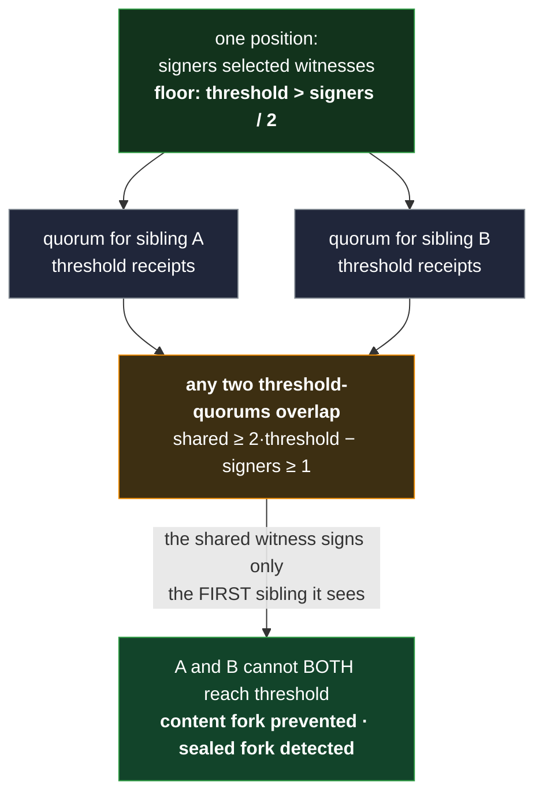
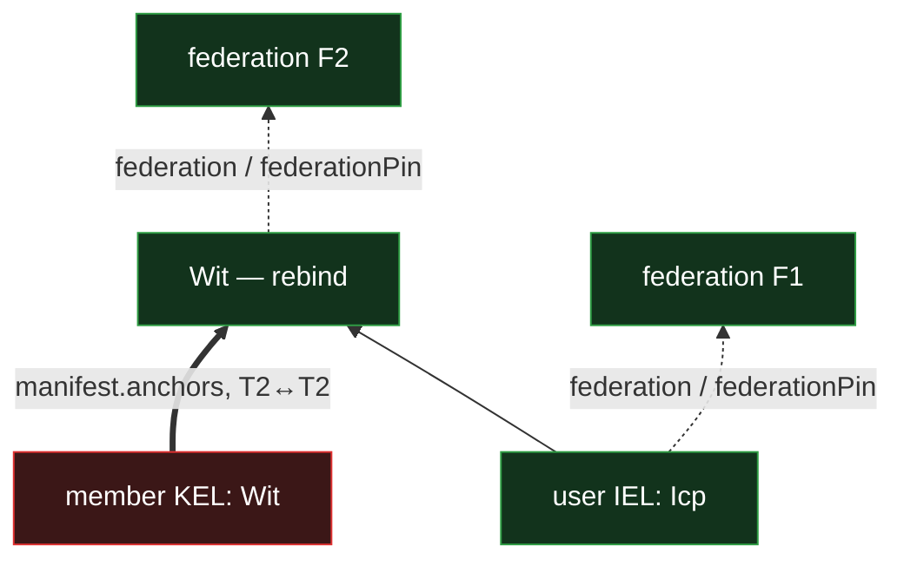

# Federation witnessing

Every KEL, IEL, and SEL in the system rests on **witnessing** for its soundness. Witnessing is what
makes a content fork impossible to form on an honest chain, what makes a sealed fork detectable
everywhere, and what a consumer's freshness and loss-of-trust decisions ground in. This doc states
the mechanism: how witnesses are selected, what a receipt attests, how receipts are counted as-of an
event's federation context, and how first-seen and the witnessing floor turn a majority of honest
witnesses into a convergence guarantee.

A federation is a **restricted IEL** and reuses the IEL's chain machinery wholesale; its genesis and
its configured trust root are [`bootstrap.md`](bootstrap.md). The cross-primitive framing — how the
primitives consume these guarantees — is
[`../../protocol-doctrine.md` §Federation convergence](../../protocol-doctrine.md#federation-convergence);
this doc is the mechanism that section refers to.

The one-line shape of the model: **witnesses are reporters, not deciders.** A receipt attests that a
witness saw a structurally-valid event first at its position; the **data-local walk** decides
terminality. Content forks are _prevented_ on witnessed chains; sealed races are _detected_. Every
identity is federation-witnessed — there is **no direct mode**.

## The witness-config and the witnessing floor

Every federated chain carries a **witness-config** — the `witnesses` manifest role, a SAD
`{ threshold, signers }`:

- **`threshold`** — the number of valid receipts a consumer requires before it trusts an event. It
  is a chain-criticality choice the operator makes **above** a structural floor.
- **`signers`** — the number of witnesses selected per event, `signers ≥ threshold`. It is
  over-provisioned for redundancy: up to `signers − threshold` selected witnesses can fail to
  receipt and the event still reaches trust.

The config is bounded `signers/2 < threshold ≤ signers ≤ |roster(F @ context)|`. The lower bound is
the **witnessing floor `threshold > signers/2`** — a strict majority of the _selected_ witnesses. It
is the load-bearing structural rule, because it is what makes two competing quorums overlap: any two
threshold-quorums at one position share at least `2·threshold − signers ≥ 1` witnesses. A
sub-majority config is rejected as **un-usable** — its `witnessed` signal would no longer mean
per-position exclusivity, a consumer footgun — and every config additionally clears `signers ≥ 3`
(real byzantine tolerance; no forced lone witness).


```mermaid
flowchart TD
  pool["one position:<br/>signers selected witnesses<br/><b>floor: threshold &gt; signers / 2</b>"]:::iel
  pool --> a["quorum for sibling A<br/>threshold receipts"]:::q
  pool --> b["quorum for sibling B<br/>threshold receipts"]:::q
  a --> ov["<b>any two threshold-quorums overlap</b><br/>shared ≥ 2·threshold − signers ≥ 1"]:::mid
  b --> ov
  ov -->|"the shared witness signs only<br/>the FIRST sibling it sees"| out["A and B cannot BOTH reach threshold<br/><b>content fork prevented · sealed fork detected</b>"]:::good
  classDef iel fill:#12331c,stroke:#2f9e44,color:#fff
  classDef q fill:#20263a,stroke:#868e96,color:#fff
  classDef mid fill:#3d2f12,stroke:#f08c00,color:#fff
  classDef good fill:#12442a,stroke:#2f9e44,color:#fff
```

The floor is exactly the strict-majority threshold that forces the overlap: below it, two disjoint
threshold-quorums could form and `witnessed` would stop meaning per-position exclusivity.

**Worked example — the minimum federation.** A federation carries two distinct numbers that are easy
to conflate, so pin them at the smallest roster (`|roster| = 4`): a **governance** change needs
`t_govern = 3` co-authoring members (the authorization floor `> |roster| / 2` meeting the
recoverability cap `≤ |roster| − 1`), while an event becomes **witnessed** at `threshold = 2` of its
`signers` selected witnesses (the floor `threshold > signers / 2`, held at `2` so the federation can
still evict one witness and stay recoverable — `threshold ≤ |roster| − 1 − 1`). Three to govern, two
to witness: different questions at the same roster — how many members must author a governance
event, versus how many selected witnesses must sign to make any event witnessed.

**Per-layer.** A KEL, a user IEL, and the federation IEL each carry their **own** authoritative
witness-config, independent of one another; a **SEL inherits** its owner IEL's (a single-owner log
declares nothing of its own). A user IEL needs its own config because an IEL event is witnessed and
could otherwise fork with no member KEL forking — two disjoint member sub-quorums each landing a
valid event at one IEL position. The config is **mandatory** wherever a chain is federated: a
federated inception that omits it is malformed and rejected, fail-secure.

## First-seen: prevention for content, detection for sealed

A selected witness signs at most one sibling **per tier, per position**, and the two rungs compose
into the whole guarantee.

**Content is prevented.** A selected witness signs the **first** structurally-valid content event (a
tier-1 `Ixn`) it sees at a `(prefix, serial)` and **declines every later content sibling** there.
With the witnessing floor, two content siblings then cannot both reach `threshold` — their quorums
share at least one witness, and that witness signed only one — so a **content divergence never
forms** on a witnessed chain. It is _prevented_, not merely detected. This holds at KEL positions,
at user-IEL positions (a user IEL's content events reach a majority at their own
`(IEL prefix, serial)` — the fork-prevention gate alongside their anchor-based authorization), and
at SEL positions (a SEL is its own witnessed chain, prevented at its own `(SEL prefix, serial)`,
because an IEL anchor is an opaque SAID the IEL cannot dedupe, so the SEL must witness itself — the
SEL primitive states this).

**Sealed is detected.** A selected witness likewise signs the **first** structurally-valid sealed
sibling (`Rot` / `Wit` / `Trm` and their IEL / SEL analogs) at a position and declines every later
one. A **second** sealed receipt from one witness at one position is cryptographic proof of that
witness's misbehavior. So a competing sealed sibling reaches `threshold` only if
`2·threshold − signers` selected witnesses **double-sign** — a **both-witnessed** sealed pair is
itself proof the witnesses colluded (a provable double-sign → eviction), while a
**witness-declined** sealed sibling stays permanently sub-threshold (deferred-pending, droppable — a
spent preimage or a partition race, no witness fault). Two or more _accepted_ sealed branches
(counted per branch, wherever their seals sit) are the definition of **disputed**.

**Scope: first-seen operates on the receipt path.** An `Fcp`-rooted chain's unwitnessed steps —
serials 0–1 of a witness KEL, and a federation IEL's genesis — gather no receipts and spend no
first-seen slot: their acceptance ground is the admission dispatch's own
([`../../compositions/log-server.md` §The admission dispatch](../../compositions/log-server.md#the-admission-dispatch--three-legs-on-the-root-kind)),
and a same-federation serial-1 sibling never accepts because the serial-1 event a roster admission
honors is the **specific consent event the admitting act itself commits** — an unnamed sibling has
no ground.

**Fork-cost `= 2·threshold − signers`** is therefore the **floor** price of manufacturing a fork on
a witnessed chain — the attacker's best case, under total partition; absent delivery control the
rival is carried by a full `threshold` of colluders
([residuals §Fork-cost](../../residuals.md#fork-cost--threshold-colluders-dropping-to-2threshold--signers-under-partition))
— the number of selected witnesses an attacker must own _and expose_. It is a tunable security
parameter, not a free consequence of the network — the dial trades one-for-one against receipt
redundancy (`fork-cost = threshold − slack`, `slack = signers − threshold`), so at
`threshold = signers` fork resistance is maximal but one unreachable witness stalls the position. A
**fork-cost-1** config (`signers = 2·threshold − 1`, the minimal majority) is warned at config time,
never silently accepted: deterministic selection makes a thin intersection a precomputable target,
so the single gating witness for a position can be identified in advance.

The precomputability is general, not a property of the thin config: selection is deterministic and
public, so an attacker able to **choose or await** the attacked position computes the selection for
upcoming serials and strikes where its owned witnesses are already selected. Provisioning should
therefore read the price as fork-cost compromised witnesses **anywhere in the roster**, with waiting
time standing in for per-position luck. What determinism still denies is _minting_: selection is a
function of position and roster only, never the event's bytes, so an attacker can predict a set but
cannot craft an event that draws a favorable one.

On a content-only divergence the resolving **burying seal-advancer** (a `Rot` / `Evl`) is exactly
that first sealed sibling at the position, needing no separate rule; a _second_ competing
seal-advancer is the proving pair `{Rot, Rot}` / `{Evl, Evl}` → disputed. And a seal on a **dead
lineage** — one that lost first-seen at any earlier position, or whose attach point fell below an
accepted seal — is itself dead on ascent (you cannot seal a buried chain), so it never counts. In
the **honest** case only one branch's lineage survives first-seen → its seal is the single sealed
branch (Active); a dispute takes **two accepted-lineage branches**, whose seals may sit **at the
fork or at different serials above it** — counted per branch. The one honest-witness exception is
two **rebinds** naming **different federations** at that serial — disjoint witness sets, so each
federation honestly signs its own (an author-equivocation dispute, not collusion).

**A below-seal sealed event is declined — the witness mirrors the seal-cap.** The "structurally
valid" test a selected witness applies before signing includes the **seal-cap** (the merge
shape-validity gate —
[`../../primitives/data/event-logs/kel/merge.md`](../../primitives/data/event-logs/kel/merge.md))
**and the federation-facet topic → anchor-kind binding** (§The trust grant chain below — a SEL event
anchored by a federation-facet IEL event outside the facet's four admissible rows is inert and is
declined): a sealed event whose parent lies **below the chain's current seal** is inert and is
**declined**, so it never reaches threshold. This is the **backdate defense**: keeping a below-seal
sealed straggler off the receipt path stops a total-key-compromise adversary from minting a
fabricated historical fork years later. The witness decline is the **fast prevention layer** — it
holds under honest, well-connected operation; the **guarantee** is the walk itself, because a
below-seal sealed event is **dead on ascent** (its parent is already buried by a later seal — you
cannot seal a buried chain), so even a partitioned or colluding witness set that _does_ sign one
cannot overturn the live seal (the position is already spent). The **only** reachable dispute is
therefore a seal-vs-seal collision **at the last (live) seal** (two accepted seals there, which
takes a provable witness double-sign — the `2·threshold − signers` collusion, the determinism price;
**or**, for two rebinds naming different federations at that seal, honest witnesses on disjoint sets
— author equivocation). This signing decision reads the event **body** and the witness's held chain
state to locate the current seal; it is a different operation from the bodyless **receipt-counting**
below ([§Query scoping](#query-scoping-and-the-serve-flags)), which only confirms a receipt came
from a legitimately-selected witness — not whether to sign.

**The split-stall and its exit.** First-seen partitions the receipts at a contested content position
(`a + b ≤ signers`); when neither sibling reaches a majority — an even-`signers` tie, abstentions,
or a partition — the position **stalls, fail-secure**: signed witnesses cannot switch, so a minority
partition stalls rather than forks (consistency over availability). The exit is a **burying
seal-advancer**, in either attach shape: **extending the author's own stalled sibling**, it lands at
the **next** serial — an ordinary first sealed event there, no cross-tier co-sign involved — and
retains that content (the witnessed seal commits it as canonical; the competing sibling closes below
the seal); **attaching at the shared ancestor**, it lands **at the stalled position** as the first
sealed sibling there — signed by every selected witness, including those that signed a content
sibling (the permitted cross-tier co-sign) — and buries both, the honest content re-issuing forward.
Either way the seal reaches the majority. Odd `signers` avoids the pure tie.

**The predicate is tier-scoped.** An honest witness legitimately holds
`{≤ 1 content} ∪ {≤ 1 sealed}` at a position — the cross-tier co-sign the split-stall exit's
ancestor-attach shape needs is not misbehavior. Only a second receipt over two distinct _content_
`eventSaid`s, or a second distinct _sealed_ sibling, at one position is proof of misbehavior. That
clean attribution is what the fork-cost pricing rests on.

**A blocked prefix is declined.** Beyond structural validity, a selected witness declines to witness
an event whose authoring identity the federation has **blocked** — a reversible, quorum-gated,
per-prefix refusal that is the second front of spam protection against a valid-identity flood
([`blocking.md`](blocking.md)). The check derives the block's address from the author and reads a
cached lineage state, so it is constant-time on the signing path; a blocked prefix's events stay
sub-threshold and cannot advance, while already-witnessed history and all serving stay untouched.

## Deterministic selection

Which witnesses are asked to receipt an event is a deterministic function of its **position**, over
the federation's as-of roster:

`select(prefix, serial, roster(F @ federationPin), signers)`

Competing events at one `(prefix, serial)` **that inherit the same pin** therefore route to the
**same** selected set, so the quorum-intersection the floor relies on is over one set. Selection
keys on the **position** and the **as-of roster** — never on the event's bytes — so an adversary
cannot mint sibling-specific witness sets **within one federation**. The **exception is a rebind**:
a rebind `Wit` **declares** its own `federationPin` and so selects over a **different** roster
(§Rebinding), so two competing rebinds declaring different federations select **disjoint** sets —
the one place two accepted siblings at one serial need **no** witness double-sign (each federation
honestly signs its own), a dispute proven by author equivocation instead. A receipt counts toward an
event's `threshold` only if its signer is in the _selected_ set, not merely in the roster: the
intersection guarantee is over the selection, so the counting predicate is selection-scoped.

`select` is a **cross-node protocol constant.** Every conforming node must compute the _identical_
selected set — receipt-counting and the fork-cost arithmetic rest on it — so its algorithm is pinned
byte-exactly rather than left to the implementation. The scheme is a stable-sort of the current
roster membership by a position-keyed digest, taking the first `signers`:

```
select(chain_prefix, serial, membership, signers):
    stable_sort(membership, w => blake3('{chain_prefix}:{serial}:{w.prefix}')).take(signers)
```

The digest is keyed on the position and the witness prefix — never the event's bytes or pin — over
the **currency-gated current membership** read from the verified federation context. The digest
input follows the shared byte convention of the `hash('{tag}:…')` derivations
([`../../primitives/data/event-logs/tags-and-topics.md`](../../primitives/data/event-logs/tags-and-topics.md)):
each field in its canonical form — the prefixes as their qualified representation
([`../../primitives/data/sad/said.md`](../../primitives/data/sad/said.md)), `serial` as its
**minimal base-10 ASCII** form (no leading zeros) — concatenated `':'`-joined as raw bytes (the join
is its own byte convention, not the JSON/JCS canonicalization `said.md` governs), so independent
implementations compute the identical selected set.

For a **federation member's own KEL events**, selection runs the same algorithm with **that
witness's own prefix removed** — exclude-self, a witness never receipts its own event — over the
pool `|roster| − 1`.

## As-of-context evaluation and the currency gate

Receipts are **adjacent attestation data** — unanchored, like a KEL's signatures — and they are
evaluated **as-of the event's own federation context**, never at the federation's current tip.

**Durability.** A witnessed event's pin is **current** — the currency gate refuses a stale-pin
event, so witnessing selects over the current set (§Deterministic selection). What makes witnessing
_durable_ is that this then-current selection is fixed forever. A receipt counts iff its signer is
in `select(prefix, serial, roster(F @ federationPin), signers)`, where `federationPin` is the
event's own recorded binding at that position — **inherited** by an ordinary event, **declared** by
a rebind `Wit` — which was current when the event was witnessed; the `select` here is a **counting
re-derivation** of that past selection, never a fresh selection under an old pin. The federation IEL
and the witness KELs are append-only, so `roster(F @ federationPin)` and each witness's key at that
context are both fixed: **an event stays witnessed forever — there is no re-witnessing of historical
data**, and a since-removed witness's _established_ receipts keep counting. The invariant is scoped
to **the trust set in force**: witnessedness is already relative across verifiers with different
trusted sets, and the trust grant chain (below) makes one verifier's trust set vary **in time** — an
un-grant, and nothing else, can move a past countability reading downward (a receipt whose `τ` falls
past the cut, on an event a node accepted before seeing the un-grant, stops counting), while the
acceptance latch keeps already-held data held. Federation context attaches per layer: a KEL carries
it, a user IEL records its own authoritative `{federation, federationPin}` (field-matched to its
members' KEL `Wit`s), and a SEL inherits its owner IEL's. A SEL event selects witnesses under the
`federationPin` of the owner-IEL event it pins to — fully derivable, no new mechanism.

**The acceptance-time currency gate.** To keep an active chain from pinning an ever-staler context,
witnesses **refuse to witness an event whose `federationPin`'s roster membership is not current**.
This forces an active chain to advance its pin **lazily, on its next event of any kind** — a fresh
`federationPin` is optional on every event, so no `Wit` is needed unless the chain is rebinding. The
gate compares roster **membership**, so it fires on **any membership change — an add or a cut** —
not on a pure rotation (same witnesses, new keys — the clock bounds key-time-validity, so a
pre-rotation pin is safe). It is an **establishment-time** check (a beyond-band-stale pin can never
_start_ gathering receipts); it **never voids** receipts already established under a then-current
pin. There is **no grace window** — a since-cut witness earns zero countable receipts immediately,
because any grace would re-admit the pre-cut roster and revive the exact backdate sliver the gate
exists to stop.

A stale in-flight event is not stranded. A submitter accepts its **own** structurally-valid,
sub-threshold events as its local tip (you cannot extend a `Rot` you have not landed), making
forward progress ahead of witnessing; the next event carrying a current `federationPin` earns
cross-node acceptance for the run — peers defer the un-witnessed events, then fetch them once the
witnessed re-pin commits them as `previous`. The recovery rests on the **rotation reserve** (the
standing tier-2 requirement), never on retaining an old signing key.

## The federation clock

The currency gate governs _roster version_; the **federation clock** governs _time_, closing the
harvested-old-key forgery that the forward-floor alone cannot reach.

The clock is the **`clock` role** in each **federation event's** manifest — an **inline timestamp
value**, not a separate SEL, event kind, or nested SAD (nothing dereferences it by its own SAID, so
the manifest commits the value directly). A federation authors no `Ixn`, so **every** federation
event carries a `clock`: the governance `Wit`s (a rotation, optionally also a roster change), the
genesis `Fcp`, the terminal `Trm`, the `Ath` / `Dth` block toggles, and the trusted-federation
un-grant `Rev`s — required there, because a `Rev`'s clock is an un-grant's counting cut (§The trust
grant chain). Each is sealed and the timeline is **monotonic** (each clock time ≥ the prior,
enforced at the seal), so it cannot be rolled back. Consumers read the timeline by walking the
federation IEL they already walk for the roster.

**Key-windows.** Each witness has a key-validity window `[T_join, T_end]` in clock time: `T_join` is
the clock at the `Wit` that admitted or last rotated the key, `T_end` the clock at the `Wit` that
retired it. Because witness key-windows change **exactly** at federation `Wit`s, timestamping those
`Wit`s time-bounds every key's window. A receipt counts only if its own timestamp `τ` falls inside
the signer's window, with a tolerance of `CLOCK_TOLERANCE_BAND`:
**`τ ∈ [T_join − CLOCK_TOLERANCE_BAND, T_end + CLOCK_TOLERANCE_BAND]`**. A cut or rotated-out
witness, being out of the roster, earns no new pinned window, so its forward-rotated keys never
count.

**Wipe.** A witness **wipes superseded and removed private key material** on rotation and on removal
(forward secrecy). Durability is unaffected — old receipts verify with the witness's _public_ keys,
which persist in its KEL — but there is no soft harvest target, so the only extant keys for a closed
window sit on witnesses still using them (compromising one is a _current_ compromise, the accepted
byzantine residual). Wipe plus the clock together close the dormant-chain forgery: a forgery built
on a closed-window key is forced to carry old timestamps, so the tip reads **stale** and is
detectable, fail-secure.

**The 180-day auto-expiry.** A key-window may stay open at most
**`MAXIMUM_WITNESS_KEY_WINDOW = 180 days`** — an un-refreshed window is treated as **closed at
`T_join + 180 days`**, a fixed protocol constant, with no explicit `cut`. So a witness that never
participates in a `Wit` no longer keeps an indefinitely open window; it auto-expires and its later
receipts read stale, the same closure a cut gives. Every witness therefore rotates **at least twice
a year** as standard practice (ML-DSA-87 handles the frequency easily); a slow-but-honest witness
that lets its window lapse simply reads stale until it rotates, at no security cost. A member whose
window has auto-expired is **flagged at-risk** on the verification token — a data-local computed
property, reported not raised — so operators evict-and-replace or reconfirm by rotation before
cumulative loss reaches `t_govern`. There is no auto-eviction (removing a member is governance,
which cannot be auto-authored). An **all-witness lapse** — a missed synchronized ceremony, every
window expiring together — is **not a brick**: the federation reads stale (loss-of-trust decisions
refuse) until a catch-up rotation `Wit` lands, which self-attests under the **new** windows it
establishes (the clock axis is carved out of the no-self-weakening rule, so a rotation's fresh-key
receipts are never judged under the expired old windows).

**The upper sanity bound.** A consumer rejects or stale-flags any federation clock time — and any
receipt `τ` — beyond **`now + CLOCK_TOLERANCE_BAND`**. This bounds a `t_govern`-compromised
federation's ability to future-date a `Wit`'s clock (which would push every window forward, making
closed windows read open) to roughly one `CLOCK_TOLERANCE_BAND`. It reads against the consumer's own
wall clock.

**Deployment invariant.** Because these are wall-clock checks, a consumer **must stay NTP-synced to
within `CLOCK_TOLERANCE_BAND`**. A consumer drifted by more than `CLOCK_TOLERANCE_BAND` cannot trust
its own freshness results, and a _backward_ skew is the fail-open direction (stale reads fresh). NTP
sync to within `CLOCK_TOLERANCE_BAND` is therefore a **security control**, not best-effort, and
belongs in every deployment's operating requirements; a verifier cannot be defended against its own
wrong clock. When the federation is reachable, a live challenge-response is the no-local-clock path.

**Constants.** The tolerance **`CLOCK_TOLERANCE_BAND = 1 minute`** and
**`MAXIMUM_WITNESS_KEY_WINDOW = 180 days`** are fixed protocol constants (deterministic — every
verifier agrees). `CLOCK_TOLERANCE_BAND` absorbs honest clock skew at a window boundary; its
security cost is nil, since the attack it faces is gross staleness, not boundary-seconds. Distinct
from the **staleness threshold** ("how old before a tip is flagged"), which is consumer /
loss-of-trust policy. Clock timestamps are **UTC, RFC 3339, exactly 6 fractional digits
(microseconds), zero-padded**, so the manifest canonicalizes byte-identically; the 6-place precision
is for deterministic serialization, not a claim of microsecond accuracy.

## The witness receipt

A receipt is itself a **SAD** — it carries its own `said` and `kind`
(`vdti/witness/v1/receipts/{kel,iel,sel}`, by witnessed chain), and its witness **signature rides
adjacent, never in the body** (a SAD cannot contain a signature over its own `said`; receipts are
adjacent attestation data). Its body:

```
{
  said,            // the receipt's own SAID
  kind,            // a witness receipt kind (vdti/witness/v1/receipts/{kel,iel,sel})
  threshold,       // witness-config threshold in effect at this position
  signers,         // witness-config selection size in effect at this position
  federationPin,   // the chain's federation binding at this position → resolves roster(F @ federationPin)
  chainPrefix,     // the witnessed chain's prefix
  eventSaid,       // the one committing SAID of the witnessed event
  eventSerial,     // its serial
  timestamp,       // the witness's asserted time τ (inside the signed payload)
  witnessPrefix    // the signing witness's KEL prefix
}
```

The design choices in the shape are load-bearing:

- **`timestamp` (`τ`) is inside the signed payload.** If it rode adjacent, a harvested receipt's `τ`
  would be rewritable to "now" and the clock's key-window check would be moot.
- **It binds the full as-of-position selection context `{ federationPin, threshold, signers }`.** A
  mesh witness can then resolve `roster(F @ federationPin)` from its own federation IEL and validate
  `witnessPrefix ∈ select(chain_prefix, event_serial, roster, signers)` **without the chain body** —
  sound, cheap detection, with fakes dropped at the mesh edge. The context is **stateful** (the
  value in effect at this event's position, not a chain constant), and the checks are **equality**
  against the chain-authoritative committed config, never the self-asserted receipt field: a receipt
  whose `threshold` mismatches the committed witness-config SAD in effect at the position is invalid
  **even if higher**. A stale-config witness (lagging a governance `Wit`) emits a non-matching
  receipt that is discarded — a liveness cost around config changes, not a safety hole.
- **A batch is witnessed by its one committing SAID** (`eventSaid`, committed by chain linkage or
  the anchoring event's `anchors[]`), never an enumerated list — single-SAID keeps receipts small
  and floodable.

**Federation-pin currency (the rebind path).** A receiving node — always a current federation member
holding F's state — runs a **local pre-check** returning a **signal only**: a beyond-band-stale pin
yields a positive "stale — rebind" signal (not an absence-of-receipts timeout). The signal is a
**hint, not authority**: the consumer **walks the federation chain** from the configured prefix to
the **verified** current position and rebinds to a value it verified, never the node's asserted
value (trust the data, not the service). Witnesses **refuse** a beyond-band-stale event outright —
signing it would consume the position's first-seen slot and block the rebind — and a submitter
likewise drops its own declined stale-pin local tip so it cannot self-collide with the rebind at the
same serial. The rebind is a `Wit` carrying the verified current `{federation, federationPin}`: it
declares the current pin, so its own selection is over the current roster → it is witnessed → it
self-bootstraps into the current federation, and subsequent content inherits the new pin.
Resubmission is idempotent (dedup by SAID), so resubmitting any event doubles as a liveness check;
resubmitting a _stale-pin_ event never fixes it (the pin is baked into its SAID) — the fix is
rebind, then submit a new event.

## An event's witnessed time

A witnessed event gathers receipts, each carrying its witness's asserted time `τ` inside the signed
payload (above). The event's **witnessed time** is the `τ` of the receipt that brought it to
`threshold` — order the event's valid receipts by `τ` and take the `threshold`-th smallest: the
instant at which `threshold`-many witnesses had attested at or before it, i.e. **when the event
became witnessed-in-full**. It is a single value every verifier holding the **same receipts**
computes identically, distinct from any one witness's `τ` — though not unconditionally per-verifier
deterministic: with `signers > threshold`, a verifier handed only the **latest** `threshold` valid
receipts computes a **later** crossing than one holding the earliest, and accumulating receipts
moves it only **earlier** (monotone downward). A receipt-curating adversary (eclipse-class — it must
control which receipts your sources hand you) can inflate a computed boundary by at most the
**honest receipt spread** (the slack witnesses' in-window `τ`s, gossip-latency scale), and the
consequences stay inside accepted classes: a later **closing** boundary only widens the
already-accepted backdate-into-closed-interval sliver, a later **opening** boundary refuses honest
edge messages (fail-secure), and full withholding below `threshold` is closed by query-scoping plus
the freshness bar.

It is **robust against a byzantine minority**, which a per-witness or "newest `τ`" reduction is not,
and the security-critical direction is the strongest: the crossing **cannot be pushed later**. A
witnessed event has already earned **≥ `threshold` durable honest receipts** at its true time (that
is what made it witnessed-in-full); an adversary can neither delete them nor move the
`threshold`-th-smallest `τ` later by **adding** late receipts (adding larger values leaves the
bottom-`threshold` unchanged). So read against the multi-source freshness bar, the upper boundary a
stale key would need inflated is **pinned in the past** by those durable receipts. Pushing the
crossing **earlier** needs `threshold`-many receipts below the honest cluster — a full witness
compromise (`threshold` witnesses, the catastrophic residual) — and even then only shrinks a past
interval (fail-secure) or lets the **newer** key backdate, never lets a stale key read current. Each
`τ` is independently capped at `now + CLOCK_TOLERANCE_BAND` and valid only inside its signer's
key-window, so a rogue future- or past-dated `τ` is discarded before it can skew the crossing. The
witnessed time is therefore a consensus timestamp for **when an event became final**, carried by the
same receipts the currency gate already trusts threshold-many-strong.

This is **distinct from the federation clock**. The clock (a federation-authored `clock` role) times
**federation events** and bounds **witness** key-windows — which cannot be receipt-derived without
circularity, since a receipt counts only if its `τ` sits inside the signer's window. An ordinary
event (a user's rotation, a group-key epoch) has no such circularity — its authors are not its
witnesses — so its finality time is read from its **own** receipts. Because the witnessed time comes
from the event's own receipts rather than the federation clock (which advances only at federation
events — governance rotations plus the rare block toggle, so coarse in practice), it gives
**per-event granularity** — a user rotating monthly, an epoch turning hourly, each gets its **own**
boundary — resolving the quantization a coarse federation-cadence clock would impose.

Witnessed times are **not self-ordering**, though: two establishment events witnessed within a
tolerance band can come out inverted. So a currency consumer **checks** the establishment times it
reads are **in-bounds** (`≤ now + CLOCK_TOLERANCE_BAND`) and **non-decreasing along the chain** and
**reports the result on its verification token** — a structural violation **bails** (fail-secure),
an in-bounds-but-out-of-order pair is **reported and the message whose interval that inversion makes
untrustworthy is refused** (the informative-token model, §The token reports its own completeness),
never silently treated as a valid empty interval. This is the same compute-check-report discipline
every chain-validity property rides. Consumers use the witnessed time as the time boundary wherever
a witnessed event needs one: the **key-state validity intervals** a message's sender-key currency
reads ([`../../features/exchange.md`](../../features/exchange.md)) and a **group-key epoch's
window**.

## Query scoping and the serve flags

Events reach the nodes that need them over the federation's gossip mesh — roster-wide announcement
flooding for an event witnessed in full (its receipts and its chain's effective-SAID announcement
flood; nodes fetch the events they lack — [`topics.md`](topics.md)), and sub-gossip among a
position's selected witnesses for one still gathering receipts. All mesh traffic is encrypted, so
contents stay within the roster; the channels and the two-scope transport are
[`topics.md`](topics.md); [`../infrastructure/gossipd.md`](../infrastructure/gossipd.md) terminates
the mesh and enforces the scoping below on the wire; the channel underneath — the handshake, the
per-connection session keys, and the nonce discipline that makes reuse structural — is
[`../infrastructure/mesh-transport.md`](../infrastructure/mesh-transport.md). What matters for
witnessing is what a query returns.

This position-indexed receipt query is **the beacon**: because receipts are keyed at
`(prefix, serial)`, querying a position returns the receipts for the witnessed branches **admitted
there** — so a node holding one branch learns the others exist and fetches them to walk, the
detection signal a `disputed` read rests on. The enumeration is **bounded, not complete**: the
receipt admission gate caps a node at two attested events per signer per position, so its beacon
always covers the dispute-proving pair, and the **union across nodes** covers every branch accepted
anywhere — understanding a race's full branch set means querying all nodes.

**Witnessed-in-full is a receipt count, checked against the committed config.** Each receipt carries
the `threshold` in effect at its position, so a node reads "witnessed in full" by counting
`threshold`-many receipts that agree on the same `(event SAID, threshold)` — with no chain-walk to
re-derive the in-effect threshold (it still needs the roster and selection to know each receipt came
from a selected witness). The carried `threshold` is a **hint, never the authority**: the count
holds only on an **exact match** to the chain-committed witness-config in effect at that position —
a receipt whose threshold does not match is invalid **even if it names a higher bar**. A bar set too
low would under-count a forgery into acceptance; a bar set too high disagrees with honest receipts
on `(SAID, threshold)` and is detected; and the consistent understatement — event and its receipts
together — is defeated because the match is against the committed config, not the receipt field. A
**stale-config** witness lagging a governance `Wit` emits a non-matching receipt that is simply
discarded — a small liveness cost around config changes, never a safety hole. So a countable receipt
needs all of: a valid signature, its signing key inside the witnessed window, a selected signer, and
a matching threshold.

A **not-yet-witnessed (sub-threshold) event is witness-scoped**: a query returns it **only to a
selected witness** for that position; to every other node — a non-witness, or a witness not selected
here — it is noise and is not returned. So, for the **witnessed classes**, non-witnesses only ever
hold witnessed-in-full events — which is what makes the data-local walk a pure function of
_accepted_ state on every node, and an attacker cannot feed a sub-threshold competing event to a
non-witness to skew its reading. (The scope matters: an `Fcp`-rooted chain's unwitnessed steps are
**accepted** on the admission dispatch's own grounds and served on that acceptance — they are not
sub-threshold noise; the serve gate is acceptance per class —
[`../../compositions/log-server.md`](../../compositions/log-server.md).)

The full retained set stays reachable off the default path through **two orthogonal, opt-in serve
flags**
([`../../compositions/log-server.md` §The two serve flags](../../compositions/log-server.md#the-two-serve-flags--non-canonical-and-sub-threshold-orthogonal)):
**`non-canonical`** lifts the cost boundary (everything held off the served spine —
accepted-and-dead, verifiable, skewing nothing), and **`sub-threshold`** lifts the witness-scoping
above — an audit obligation attaches, and what it surfaces is **walk-ignored** (a sub-threshold
event never enters a verdict, so surfacing it cannot skew a reading). Their value is **forensic**: a
suppressed competing sibling is evidence of an injection or collusion attempt, so the flags make
attack-attempt detection possible for an auditor. The default stays scoped.

For a **sealed** event, sub-gossip means it reaches every selected witness, so there is no stable
"witnessed but sub-threshold" state (the only ways to hold one sub-threshold are pure eclipse or a
byzantine witness signing-then-withholding — a rogue receipt, discarded and evicted, bounded by
`< threshold`). The first sealed sibling reaches threshold this way; a second is declined
first-seen, so two _accepted_ sealed branches require the colluding double-signers above.

## No direct mode, and fail-secure

**Every identity is federation-witnessed.** A user `Icp` that omits `federation` / `federationPin`
is malformed and rejected; a chain cannot incept un-federated, and there is no "witnessing starts
from a later `Wit`, early range unwitnessed" allowance. A loss-of-trust decision — asking whether a
`Trm` or a divergence closed a chain — that cannot **multi-source-confirm** (any eclipse or
single-source) **refuses**, never proceeds with a flag. The genesis of a federation is _not_ a
direct-mode exception, nor is a joining witness's inception: the unwitnessed steps are
federation-infrastructure inceptions — genesis rooted in the configured trust pin
([`bootstrap.md`](bootstrap.md)), a joiner rooted in the witnessed admitting `Wit` — and the
residual where a content fork can still form is a **witness compromise**, not an un-witnessed chain.

**Detection is eventual, not at-decision-time.** Every detection guarantee assumes the consumer can
reach enough honest witnesses / converged gossip to see the competing branch. A consumer eclipsed to
a malicious subset, or reading during an incomplete heal, sees the detection later — so a binding
made in that window can transiently trust the wrong branch. This is the standard cost of a detection
model; a multi-source freshness bar shrinks the window but does not close it, and recovery is
operational (re-verify before binding; reincept on a surfaced divergence). The content-fork
_prevention_ leg is not subject to this — the floor stops a content fork from forming — but a formed
_sealed_ fork is no more visible than gossip has yet carried it.

## The token reports its own completeness

Witnessing composes with a **work bound** on verification: a verifier walk that paginates or bails
on a deadline mints a **continuable token that reports its incompleteness accurately**. A consumer
gates its trusting behavior off that report — an incomplete kill-walk reads _possibly-killed_, never
_not-killed_; an unconfirmable loss-of-trust decision refuses. This is **separate** from the
structural per-event caps (`MAXIMUM_MANIFEST_LIST` and the like), which stay deterministic
_validity_ checks: the work bound governs how much a walk _traverses_, and a bailed traversal is
reported, never silently treated as a clean result. A **ping-pong rebind DoS** needs no special cap:
an over-long chain of rebind `Wit`s is just a walk the work bound refuses, and every rebind `Wit`
must itself reach witness threshold — so flooding is neither free nor unbounded.

## Rebinding

An identity's initial federation binding rides its `Icp` (`federation` prefix + `federationPin`
SAID). A later `Wit` **rebinds** it to a new federation — anchored by the members' KEL `Wit`s
(kind-strict, tier 2 → tier 2), its `{federation, federationPin}` field-matched to every anchoring
KEL `Wit`, so the identity's binding records only what its members signed. Rebinding is how a prefix
**survives its federation**: if the federation dies or is compromised, the identity rebinds to a
**new** federation and keeps its prefix alive. This is why a rebind `Wit`'s **declared** current
binding **must** be accepted for selection (it selects over the new roster) — forcing it back onto
the dead federation would strand the prefix. The cost of that declared selection is a **reachable
honest-witness dispute**: two rebinds at one serial declaring **different** federations select
**disjoint** witness sets, so each is honestly first-seen-accepted by its own federation and both
reach threshold with **no witness double-sign** — `disputed`, proven author-side (a reserve
double-reveal, or a member's double-anchoring of both rebinds), resolved by reincept. **Retry a
stalled rebind by chaining, never as a sibling.** An owner whose rebind stalls (the named federation
unreachable, the event sub-threshold) authors the retry **on top of** the stalled one — its own
sub-threshold event is its local tip, and acceptance of the later rebind commits the stalled one as
ancestry
([acceptance commits ancestry](../../primitives/data/event-logs/kel/verification.md#acceptance-requires-threshold--for-every-node)).
A **sibling** retry at the same serial naming another federation is the race above — self-inflicted:
the author-side dispute (a reserve double-reveal, or the members' double-anchoring), a disputed
prefix. Trust is **per-federation and non-transitive**: a verifier independently trusts _each_
federation prefix the chain bound to, and each event is witnessed by whichever federation was
current when it landed — so **convergence is among verifiers sharing a trusted-federation set**, and
a verifier trusting only one side of such a race reads only that side accepted. Witnessing is
therefore **range-based** — a contiguous run of events between rebinds shares one context — and the
verification token reports the ranges (`[from, to) → F`), per range, not per event. A consumer
**must not** assume "has a `Wit` ⇒ all events witnessed": an event in a run bound to a since-changed
federation is witnessed by that run's federation, not today's.


```mermaid
flowchart BT
  uIcp["user IEL: Icp"]:::iel --> uWit["Wit — rebind"]:::iel
  kWit["member KEL: Wit"]:::kel
  F1["federation F1"]:::iel
  F2["federation F2"]:::iel
  uIcp -.->|federation / federationPin| F1
  uWit -.->|federation / federationPin| F2
  kWit ==>|manifest.anchors, T2↔T2| uWit
  classDef kel fill:#3b1717,stroke:#e03131,color:#fff
  classDef iel fill:#12331c,stroke:#2f9e44,color:#fff
```

Solid arrows are chain order (`previous` points back); dotted arrows are the `federation` /
`federationPin` binding; the thick arrow is `manifest.anchors`.

A **ping-pong rebind DoS** is bounded by the verification work bound, not a separate cap (above).
The **migration overlap window** — during which members below `t_govern` still lag on the old
federation until they each rebind — is **cooperative-only**: it assumes both federations are honest,
an app-coordinated migration both approve. It does **not** cover _escaping_ a compromised
federation: there the old federation still counts during the overlap, and an event mid-migration
cannot be verified under the target federation alone. **Escaping a compromised federation is a hard
cutover / reincept, not a graceful overlap.** Multi-federation orchestration is application-level;
the framework gives the per-federation, non-transitive primitives and the recommendations, not an
orchestrated protocol.

## The trust grant chain — the federation boundary

Whose receipts count across a federation boundary is a **governed chain, never per-node
configuration**. Per-operator config would let nodes of one federation disagree on acceptance —
divergence inside the trust boundary — so cross-federation trust is a **federation-governed trust
grant chain**, blocking's mirror: a **per-remote-federation derived SEL** under the federation IEL,
toggled by witnessed governance acts. Operators agree at threshold; every node holding the same
chain state gives the same answer — synchrony is same-data-same-answer, and lag is staleness, never
drift. **Consumers keep the configured set** (a trust root cannot come from data not yet trusted),
and a federation node's **own** prefix is injected at the bootstrap ceremony, never derived from
whatever claims to be self ([`bootstrap.md` §The trust root](bootstrap.md)).

**One definition, inherited by every rule here.** **Trust-granted** means a trust lineage **exists**
for the remote federation — live, or killed (established-then-dead) — with the counting conjunction
below the sole counting authority; **untrusted / never-granted** means no **established** lineage at
any lineage index (a lineage that never established — unestablishable accepted bytes included —
grounds nothing). Membership in the classes never changes at an un-grant: the lineage still exists;
what changes is what the conjunction admits.

### The chain's mechanics

- **Every federation-owned derived locus — trust and block alike — derives with
  `authority = id(this federation)`.** A node holds granted remote federations' trust and block SELs
  too, so the derivation must be pinned: resolving a block under a remote federation's `id` would
  silently import that federation's censorship across the grant, which blocking's own doctrine
  forbids — a block is **local** ([`blocking.md`](blocking.md)). A prefix a remote federation blocks
  needs no local check at all: it simply never reaches threshold on that federation's own chains.
- **The grant** is a **`Gnt` anchored on the federation's governance `Wit`** — true `t_govern` —
  whose typed value is a `grants/trusted-federation` SAD carrying **`{remotePrefix, bound}`**. No
  timestamp field: the committed times come from the anchoring acts' own `clock`s — the grant's from
  its `Wit`, the un-grant's from its `Rev` — and a value-level copy would be a divergence surface.
  `remotePrefix` must equal the derived address's input, checked at the consumer — the address
  commits the prefix; the field makes the SAD self-describing, never a second authority.
- **The un-grant is `t_govern`, symmetric with the grant** — trust in a remote federation moves only
  by governance, both directions: the SEL **`Trm` anchored by a federation `Rev`**, canon's revoke
  rail whole. The `Rev`'s `kills[]` entry declares the **lineaged target only — no `bound`**: the
  horizon is always the killed lineage's live `Gnt` value, and the cut is the `Rev`'s own `clock`,
  un-withholdable. The `kills[]` declaration is stated because **trust fails open where blocking
  fails secure** — a withheld un-grant reads still-granted, so the walk's per-lineage check must
  read the killed target without depending on the withholdable leg. The emergency-speed case is
  already served by per-prefix blocking — fast, scoped, reversible.
- **A refused tip never falls back to a retired grant.** The walk serves the live sealed tip and a
  retired value never surfaces, so a malformed refresh leaves the locus with **no servable value —
  not granted, federation-wide, fail-secure**; the repair is a corrected `Gnt` stacked forward where
  the refused tip's `bound` still resolves forward. Falling back to the last good grant would make
  the answer depend on which grants a node happens to hold — a fail-open divergence inside the trust
  boundary.

### The topic → anchor-kind binding — structural, total on the federation facet

A SEL event **anchored by an `Fcp`-rooted (federation-facet) IEL event** dispatches its admissible
anchor kinds on the locus `topic`, and the federation facet admits **exactly four rows**:
`topics/trusted-federation` — `Gnt` under `Wit` only, `Trm` under `Rev` only; `topics/block` — `Gnt`
under `Ath` only, `Trm` under `Dth` only. **Any other combination — any other topic included — is
inadmissible and INERT.** The rule lives in **structural validity**, at both enforcement points —
the SEL verifier, and the pre-sign test a selected witness applies (§First-seen) — and both are
decidable by construction: the anchoring event's chain and root facet are held wherever the check
runs, and the locus `Icp` resolves from held state or the submitted batch (a
federation-facet-anchored SEL event whose `Icp` resolves to neither is **declined** — safe on this
facet and no other, because a federation-facet `Icp` carries no secret, while a private lookup is
user-anchored and never reaches the rule). Closure is safe on this facet because the federation's
reachable SEL kinds are exactly `{Icp, Gnt, Trm}`; the **user facet keeps no exception at all** — a
topic stays verifier-meaningless there. Consumer-side narrowing survives for the two grant rows as
defense in depth.

**The refusal disposition is INERT — never a chain-level error.** A mismatched event is inadmissible
and inert — dropped by the merge gate on admission, dropped by the walk when a held chain contains
one — so the `Gnt` tip stands, the lineage stays live and un-terminated, and the position remains
authorable by a genuine `t_govern` un-grant. (An error disposition would make the locus
unresolvable, an unresolvable trust input fails secure, and a mismatched `Trm` would read **not
granted** — a small-quorum denial lever this design refuses.) Two implementer notes, stated because
each inverts an instinct: the refusal polarities differ — a mismatched `Gnt` reads _not granted_
(fail-secure) while a mismatched `Trm` reads **still granted**, which is correct (only `t_govern`
may un-grant) but inverts the treat-as-killed reflex; and the mismatch **refuses always and alarms
only** when the anchor resolved to a real, threshold-satisfied event on the anchoring federation's
own IEL with only its kind/topic row wrong — the governance-compromise signal only the federation
can produce. A mismatch on an unresolvable or unrooted anchor is ordinary bad input, refused
silently: a SEL `Icp` is unsigned recomputable content anyone can fabricate, and the trust locus
address derives from two public prefixes, so an ungated alarm is remote-inducible — an alarm-flood
and false-flag generator worse than the silent non-honoring the alarm exists to avoid. **One
residual is worth stating here, though the inert disposition does not cause it.** A structurally
invalid event is never anyone's state: every durable write validates structure first, so a decoy is
refused at the merge gate and dropped by the walk, and minting them buys an adversary nothing. What
remains is that an un-grant is an ordinary event at an ordinary position — so a witness set
compromised at ≥ `threshold` can stall it by declining to sign, exactly as it can stall anything
(§Security assumption). What is specific to **this** locus is that the stall does not age out: the
usual escape — republish at the next lineage — depends on the old lineage reading **dead**, and a
stalled un-grant leaves it **live**, where a reader stops. Trust in that remote therefore stays
granted while the stall holds — **fail-open**, where the rest of this rail fails secure — and the
stall is bounded twice. In time: a stalled un-grant stalls refreshes too, so the vouched key-windows
close within `MAXIMUM_WITNESS_KEY_WINDOW`, after which only backdated, stale-reading receipts still
count — the tail the rogue-remote pricing already carries. In exit: below `|roster| − threshold`
decliners, a retried participation re-draws its selection and the un-grant itself eventually lands;
at or beyond that count no governance act lands — an eviction included — and the exit is reincept.
Priced in the catalog
([`residuals.md` §Witness and federation trust](../../residuals.md#2-witness-and-federation-trust)).

### The counting conjunction

A receipt counts iff its signer resolves to a selected witness — selection as-of the position, over
`roster(F @ pin)` — of a federation that is **the node's own, or trust-granted in the federation's
trust chain and held** ("held" evaluated **as the batch lands**, never once at ingress against
pre-batch state). A remote federation's receipts count only **within its trust lineages' windows**,
and the rule is a **conjunction, evaluated per lineage**: a remote receipt counts iff **some** trust
lineage's window admits it —

- a **live** lineage admits a receipt whose position's roster and key-window resolution stays within
  the lineage's **`bound`** (a live lineage has no cut);
- a **killed** lineage admits a receipt whose **`τ` is at-or-before the un-grant's committed
  `clock`** (the cut) **and** whose resolution stays within its `bound`.

Killed windows are **permanent counting authorities**, and a re-grant only ever widens — without the
existential per-lineage reading, a cautious re-grant whose new `bound` sat below a killed horizon
would move held readings down, a _grant_ moving a reading downward. The conjunction is the rule at
**both consumers of countability** — the acceptance gate on arrival and the walk on held data. There
is **no arrival-order leg anywhere**: acceptance is as data-pure as the walk, a late-arriving
pre-cut migration still lands, and every node converges on the same acceptable set. Receipts of a
never-granted federation are **discarded, never parked**; a formerly-granted federation's receipts
fall to the conjunction — outside every lineage's window they are likewise discarded, never parked.

**`bound` is a position — a remote-federation-event SAID — and it is monotone non-decreasing.** A
refresh can never void a receipt's already-established resolution; **only the un-grant** moves a
reading downward (a `bound` typo'd backwards on routine maintenance would otherwise silently
un-witness a slice of accepted remote history). The `bound` is **refreshed by stacking another
`Gnt`** on the live lineage — the rail's own value-rotation shape — and the monotonicity
comparison's inputs are the dispatch's own: **held state or the submitted batch, the same at every
selected witness, never door-local staging** (the refresh is submitted with the remote extension it
vouches for; ancestry is pure chain linkage, covered by the staged-read license, conferring
nothing). A refresh whose `bound` resolves from neither is **declined** — a liveness cost cured by
resubmission-with-bytes — never inert; **inert is the disposition only for a resolved
not-at-or-after**. Sequencing needs no new machinery: the refresh accepts first (its own
federation's receipts; its monotonicity read resolves from the batch), the batched remote extension
accepts second (resolution now within the new `bound`), parked dependents drain on presence
throughout. **A single refresh vouches at most one submit batch of remote ancestry beyond held
state**; a longer lapse is serviced by **chained refreshes** — each `Gnt` advancing `bound` at most
a batch past the last accepted horizon, each vouched extension becoming held before the next
comparison. The monotone baseline is structural, not reality-checked, and the residual is priced: a
refresh whose `bound` names a fabricated, never-accepting SAID passes the linkage read and accepts —
after which **an unresolvable horizon admits nothing**: the lineage's counting freezes outright,
fail-secure (readings only move down, nothing false accepts), every corrective refresh reads as a
resolved not-at-or-after and is inert, and **the repair is the un-grant plus reincept at the next
lineage** — the un-grant's validity never reads the `bound`, the fresh lineage's first `Gnt` is a v1
with no baseline, and the per-lineage existential read then re-admits everything within the fresh
window, which is what makes the freeze transient rather than lossy.

**The cut's threat model is the honest federation no longer wanted** — a compliance or regulation
change — and against it the stop is immediate: post-change data honestly carries post-cut `τ` and is
refused. **Against a rogue remote the cut does not close, and that is an accepted risk**: `τ` is
capped above only, so a rogue can keep minting receipts indefinitely with backdated `τ` at or below
the cut, from key-windows vouched within `bound` — byte-indistinguishable from genuinely late
pre-cut receipts, which is why no data-pure closure exists. Priced four ways: such fabrications read
**stale** to every freshness consumer (new-but-reads-old is the detectable shape); their ingress
rides the ordinary per-IP and request bounds like any other spam; trust decisions never rest on them
— consumers keep their own configured set; and they cannot move a held chain's **divergence
verdict**, because the walk drops below-seal sealed stragglers as dead on ascent and a completed
migration's remote-witnessed range sits wholly below its rebind `Wit` — a seal-advancer — so no
revivable sibling survives above the live seal. The structural closure is the **`bound` leg**:
post-cut remote governance sits past the horizon and never accepts — rogue included — so the
pause-at-the-horizon posture never rests on honest timestamps.

**Acceptance is a latch; countability is a pure function of committed bytes.** Held stays held,
nothing un-accepts — so two nodes may permanently disagree on events witnessed after a cut that one
accepted before seeing the un-grant: a **storage-and-serving** divergence, never correctness, since
consumers keep the configured set and end-verify what they read. Do not "fix" the latch by
un-accepting.

### Cadence, provisioning, and migration

- **A grant decays as the remote federation governs.** The currency gate re-pins every remote chain
  at the remote's next membership change, so new remote traffic stops counting here until a refresh
  — an in-flight migration pauses at the horizon, resuming on refresh — and between refreshes
  **remote key retirements are invisible here**: a key the remote evicted, compromised keys
  included, keeps producing countable receipts for up to `MAXIMUM_WITNESS_KEY_WINDOW` past its last
  vouched rotation. Both are priced residuals bounded by the refresh cadence, never implied closed
  ([`residuals.md` §Witness and federation trust](../../residuals.md#2-witness-and-federation-trust)).
  And the cadence has a limit case: each chained refresh advances the horizon at most one submit
  batch, so a remote sustaining governance above roughly a batch per local refresh interval
  **outruns any cadence** — fail-secure (new remote traffic never counts; an in-flight migration
  pauses permanently), reachable only by a remote churning its own membership, and the escape is the
  stated posture for a hostile origin: hard cutover / reincept (§Rebinding).
- **Making a grant functional is a provisioning obligation, discharged by ordinary submission of
  authentic data — open to anyone.** Page the remote federation's public by-prefix surface and
  submit its chains as correctly-shaped bundles **with their receipts** — the federation IEL first
  (self-grounding against the granted prefix), then member KELs (now countable), then chains — all
  through the merge layer and the receipt gate; a newly granted federation's chains arrive by
  exactly this resubmission, with nothing staged promoted retroactively. The verifiability ordering
  falls out of the admission dispatch rather than needing enforcement. And the classes never move
  backward: an un-grant does not return a federation to the never-granted class — the lineage still
  exists; the conjunction bounds what counts.
- **Migration is ordinary traffic.** An application cannot migrate data to a federation that does
  not trust the origin; where the destination has **trust-granted** the origin, the chain submits in
  sequence — accepted and durable page by page, the origin's receipts counted per its lineages'
  windows, the rebind last — under the ordinary rate limits, through the resumable admission walk. A
  chain whose origin was **never granted** is refused pre-stage, no carve-out. In the rebind-away
  direction, everything witnessed here **stays held** — what is not accepted is the chain's new,
  elsewhere-bound extension (not own-signed, not dragged; mesh-arrived copies stage and age out). In
  the migration-in direction the range is durable **on its own counted receipts, page by page** —
  the ancestry drag remains only the general ancestry rule (stale-pin recovery, split-stall), never
  a migration mechanism — and the storage is priced by non-transitive trust (the range grounds
  nothing for a consumer that does not trust the origin), with per-prefix blocking as the lever.

## Roster governance

A federation's roster changes ride the `Wit`'s **roster delta** — never a full snapshot. A `Wit`
carries `{ add: Prefix[], cut: Prefix[], …thresholds }`: **`add` carries exactly one prefix on a
`Wit`** (one witness added per `Wit`, the `Fcp` inception alone standing up the founding roster
wholesale), while **`cut` is unrestricted in count** (cuts remove synced witnesses, so emergency
multi-eviction is unaffected — evict-and-replace is `cut: [..], add: one`). One-at-a-time adds are
both an operational match (standing up a witness is deliberate infrastructure, never bulk) and a
structural closure: a transition introduces at most one unsynced witness, which alone cannot reach a
majority against synced co-selectees that decline it first-seen, so the benign two-fresh-witnesses
straddle collapses into the priced witness-compromise residual.

The current roster is reconstructed by **accumulating add/cut while walking**, capped at a **hard
live set of `MAXIMUM_ROSTER_SIZE`** (over-cap → reject as a DoS; operators run `≥ 5`, so
`MAXIMUM_ROSTER_SIZE` is generous headroom). The live roster is a **set**: a `Wit` whose `add` names
an already-live prefix is rejected (re-adding would reset its `T_join`), and `add` membership is
tested against the pre-delta roster, so a same-event `cut` + `add` of the same prefix is rejected
too (order-independent). Every config-changing `Wit` is **re-checked on the post-delta config**,
valid only if the full witness-config validity holds after the change — the witnessing floor, the
`t_govern` bounds, and the federation's tighter recoverability cap (below). A bare `cut` that would
strand the federation un-recoverable is rejected, forcing evict-and-replace or a simultaneous
threshold-and-`signers` drop.

Witness **key rotation is a federation `Wit`** — the witness's KEL `Wit` **is** the rotation (it
refreshes the signing key and rotation reserve) **and** anchors the federation IEL `Wit`
(kind-strict, tier 2 → tier 2). There is no separate rotation event and no phantom key;
`pins = Wit.previous`, so the retiring key's `T_end` lands correctly. A witness rotation is legal
**only** as a federation `Wit`: an **off-ceremony `Rot`** (a witness `Rot` anchoring no `Wit`)
produces receipts the federation does not honor, and an observed off-ceremony rotation is a
cut/eviction signal. Adding a joining witness pairs its consenting KEL `Ixn` (joining, not rotating)
with the pre-add witnesses' KEL `Wit`s, which alone satisfy `t_govern` — the count is gated on
**pre-add roster membership**, so a colluding new witness cannot manufacture a `t_govern` vote by
authoring its own `Wit`. The consenting `Ixn` is the joiner's chain's **serial-1 event** — a fresh
`Fcp`-rooted chain incepted for the federation, its identity bond anchoring this admitting `Wit`
([the identity bond](../../primitives/data/event-logs/kel/events.md#the-identity-bond)).

## The recoverability cap and exclude-self

**Who receipts a federation IEL event.** There is no separate receipt on the federation IEL event
itself: an IEL event has no key of its own, so its witnessing **is** the witnessing of its
**anchoring member-KEL events**. Each member's anchoring KEL event is receipted by the **other**
member witnesses — exclude-self, over the pool `|roster| − 1`; the authoring witness never receipts
its own — and first-seen is keyed at the **federation IEL position**: a peer that has receipted an
anchoring participation for one sibling at a federation `(prefix, serial)` declines a participation
for any competing sibling there. Two counts gate acceptance, at two levels: the event carries its
**required count of participations** (`t_govern` for a governance `Wit`), and **each participation**
is witnessed at the witness-config **`threshold`** — at the minimum federation, three participations
each carrying two peer receipts. A declined competing sibling's participations stay sub-threshold —
the position gate, realized through the anchors.

Because a federation is critical infrastructure, its recoverability ceiling is **hard**: it must
always be able to evict one compromised witness and get the cut trusted. So for federation member
events the config is bounded

`signers/2 < threshold ≤ min(|roster| − 2, signers − 1)` and `threshold ≤ signers ≤ |roster| − 1`,

where the **recoverability cap `threshold ≤ min(|roster| − 2, signers − 1)`** is the load-bearing
addition. An eviction/recovery `Wit` is authored by the remaining members and **must self-attest** —
the evicted or dead member will not co-witness — so the self-attest pool is `|roster| − 2`, and at
sub-pool selection the selected pool loses one too, so `threshold ≤ signers − 1` also binds. With
`signers ≥ 3` the `signers − 1` leg is `≥ 2` and always binds cleanly, and the guaranteed evict-one
begins at the `|roster| = 4` structural floor with `{ threshold 2, signers 3 }`. Surviving `k > 1`
simultaneous losses is the operator's sizing choice: pick the tolerated simultaneous-loss count `k`
explicitly, set `threshold ≤ |roster| − 1 − k`, and grow the roster to keep `t_govern` reachable. A
user chain is not subject to the cap — its anchors are witnessed by the external federation pool
with no self-exclusion — and realizes the same position gate by reaching a majority at its own
`(IEL prefix, serial)`.

A `Wit`'s own self-attestation is judged under the **at-or-before** witness-config and roster (no
self-weakening — a sub-quorum cannot lower its own trust bar in the very event whose trust is in
question), but under the **new** key-windows the rotation establishes (the clock axis carve-out,
above). So an all-windows-lapsed federation reads stale, then recovers via a catch-up rotation that
self-attests under its new windows — stale-but-recoverable, never bricked. A lone broken or old key
cannot mint a current window: a rotation is honored only as a federation `Wit`, needing `t_govern`
authors and `threshold` self-attestation, which one key reaches neither. A current-window takeover
therefore needs `≥ t_govern` current keys — the governance-compromise case, an operational reincept
— and a merely _lost_ key is evicted or reincepted operationally.

## Security assumption and residual

The federation's soundness assumes **fewer than `threshold` byzantine** members at attestation time
(the witness-config's receipting `threshold`, not the `t_govern` governance quorum); beyond that is
operational recovery and reincept. The co-witnessing exclusivity carries its own tighter bound: it
holds against fewer than `2·threshold − signers` byzantine double-signers within the selected set
(the fork-cost), so for an over-provisioned config a coalition _within_ the blanket `< threshold`
assumption can manufacture a co-witnessed content fork at fork-cost — priced, exposed, and
evictable, not free. The irreducible residual is compromising `threshold`-many _current_ witness
keys, which is the federation itself being compromised — recovery is reincept, not a backdate via
stale keys.

## Cross-references

- [`bootstrap.md`](bootstrap.md) — federation genesis and the configured trust root.
- [`../../protocol-doctrine.md` §Federation convergence](../../protocol-doctrine.md#federation-convergence)
  — the cross-primitive convergence framing this mechanism serves.
- [`../../protocol-doctrine.md` §Divergence and recovery](../../protocol-doctrine.md#divergence-and-recovery)
  — the data-local walk that decides a verdict from the branches receipts enumerate.
- [`../../primitives/data/event-logs/iel/log.md`](../../primitives/data/event-logs/iel/log.md) — the
  IEL the federation is a restricted instance of; the witnessing floor gates its content and sealed
  events.
- [`../../primitives/data/event-logs/event-shape.md`](../../primitives/data/event-logs/event-shape.md)
  — the `witnesses` and `clock` manifest roles, the `Wit` facets, and `federation` /
  `federationPin`.
- [`../../primitives/data/sad/kinds.md`](../../primitives/data/sad/kinds.md) — the witness receipt
  kinds `vdti/witness/v1/receipts/*`.
- [`topics.md`](topics.md) — the gossip channels the mesh carries and the two-scope transport.
- [`../infrastructure/mesh-transport.md`](../infrastructure/mesh-transport.md) — the authenticated,
  encrypted channel the mesh runs over: the handshake, the per-connection session keys, and the
  nonce discipline that makes reuse structural.
- The encoding library _(forthcoming)_ — the byte-exact `select` scheme and the receipt
  canonicalization.
